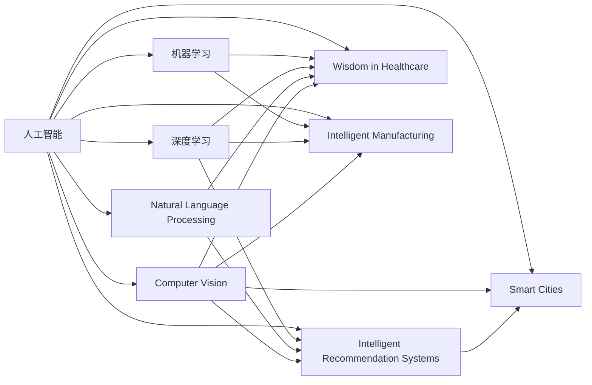

                 

# AI技术在不同场景中的应用

> 关键词：人工智能,机器学习,深度学习,自然语言处理,NLP,计算机视觉,图像识别,智能推荐,智慧医疗,智能制造,智慧城市

## 1. 背景介绍

### 1.1 问题由来

随着信息时代的到来，人工智能(AI)技术在各行各业中得到了广泛应用。从自然语言处理(NLP)、计算机视觉(CV)、智能推荐系统，到智慧医疗、智能制造、智慧城市，AI技术在提升效率、优化决策、改善用户体验等方面展现了巨大的潜力。但同时，AI技术的推广应用也面临诸多挑战，如数据隐私、模型鲁棒性、可解释性等问题。因此，本文将对AI技术在不同场景中的应用进行系统梳理，阐述其核心原理和具体实现，并探讨未来发展趋势和面临的挑战。

### 1.2 问题核心关键点

AI技术在各个领域的应用，主要基于数据驱动的机器学习(ML)和深度学习(DL)方法。通过训练大量标注数据，模型能够学习数据的特征和规律，并进行模式识别、预测和决策。机器学习包括监督学习、无监督学习和强化学习，深度学习则通过多层神经网络实现数据自动特征提取和模式识别。这些技术的应用，使得AI技术在多个场景中发挥了重要作用，提升了生产力、优化了决策过程、改善了用户体验。

## 2. 核心概念与联系

### 2.1 核心概念概述

为了更好地理解AI技术在不同场景中的应用，本节将介绍几个密切相关的核心概念：

- 人工智能(AI)：旨在模拟人类智能行为，通过学习与推理，实现自主决策和问题解决。
- 机器学习(ML)：基于数据驱动的方法，通过学习数据特征和规律，实现模型预测和决策。
- 深度学习(DL)：一种特殊的机器学习方法，通过多层神经网络实现数据自动特征提取和模式识别。
- 自然语言处理(NLP)：研究如何让计算机理解、处理和生成自然语言，包括语言模型、文本分类、机器翻译等任务。
- 计算机视觉(CV)：研究如何让计算机“看”懂图像和视频，实现图像识别、目标检测、图像分割等任务。
- 智能推荐系统：根据用户行为和偏好，自动推荐相关商品、内容或服务，提升用户体验。
- 智慧医疗：利用AI技术提高医疗诊断、治疗和管理的效率和精度，提升患者体验。
- 智能制造：通过AI技术实现生产过程的自动化、智能化，提升生产效率和产品质量。
- 智慧城市：利用AI技术优化城市管理和服务，提升城市运行效率和居民生活质量。

这些核心概念之间存在着紧密的联系，形成了AI技术应用的完整生态系统。接下来，我们将通过一系列的Mermaid流程图来展示这些概念之间的关系：

这个流程图展示了人工智能、机器学习、深度学习等核心概念在自然语言处理、计算机视觉、智能推荐、智慧医疗、智能制造、智慧城市等各个应用场景中的相互关系。

### 2.2 概念间的关系

这些核心概念之间存在着密切的联系，形成了AI技术应用的完整生态系统。具体而言，它们之间的逻辑关系如下：

- 人工智能包括机器学习和深度学习，是AI技术的核心和方法论。
- 机器学习和深度学习在各自领域中具体应用，如NLP、CV、推荐系统等。
- 自然语言处理和计算机视觉是AI技术的两个主要分支，分别关注文本和视觉数据的理解和处理。
- 智能推荐系统和智慧医疗、智能制造、智慧城市是AI技术在特定应用场景中的具体应用，依赖于AI核心技术和方法。
- AI技术的应用，不仅提升了各领域的工作效率和决策质量，还为社会带来了更广泛的正面影响。

## 3. 核心算法原理 & 具体操作步骤

### 3.1 算法原理概述

AI技术在不同场景中的应用，主要基于数据驱动的机器学习和深度学习方法。其核心原理是通过训练大量标注数据，模型能够学习数据的特征和规律，并进行模式识别、预测和决策。以自然语言处理为例，其主要算法包括：

- 词袋模型(Bag of Words)：将文本转换为词频向量，用于文本分类和情感分析。
- 卷积神经网络(CNN)：通过卷积操作提取文本的局部特征，用于文本分类和命名实体识别。
- 循环神经网络(RNN)和长短期记忆网络(LSTM)：通过时间序列建模，用于语言建模和机器翻译。
- 预训练语言模型(Pre-trained Language Model)：通过大规模无标签文本数据进行预训练，学习通用语言表示，用于零样本学习、少样本学习和多模态任务。

这些算法通过不同的网络结构和训练策略，实现了自然语言处理任务的自动化和智能化。

### 3.2 算法步骤详解

以下是AI技术在不同场景中的核心算法步骤：

**自然语言处理**

1. **数据预处理**：将文本数据清洗、分词、向量化，生成训练样本。
2. **模型训练**：使用标注数据训练词袋模型、CNN、RNN/LSTM等模型，优化模型参数。
3. **模型评估**：在验证集上评估模型性能，选择合适的模型进行微调。
4. **模型应用**：将微调后的模型应用于文本分类、情感分析、机器翻译等任务。

**计算机视觉**

1. **数据预处理**：对图像数据进行归一化、增强和标注，生成训练样本。
2. **模型训练**：使用标注数据训练卷积神经网络(CNN)、循环神经网络(RNN)等模型，优化模型参数。
3. **模型评估**：在验证集上评估模型性能，选择合适的模型进行微调。
4. **模型应用**：将微调后的模型应用于图像分类、目标检测、图像分割等任务。

**智能推荐系统**

1. **数据采集**：收集用户行为数据和商品/内容信息。
2. **数据预处理**：对行为数据进行清洗、特征工程和嵌入，生成训练样本。
3. **模型训练**：使用标注数据训练推荐算法，如协同过滤、基于深度学习的模型，优化模型参数。
4. **模型评估**：在测试集上评估推荐效果，优化模型策略。
5. **模型应用**：将训练好的模型应用于推荐系统，生成个性化推荐结果。

**智慧医疗**

1. **数据采集**：收集患者医疗记录、影像数据和基因数据。
2. **数据预处理**：对医疗数据进行清洗、标注和归一化，生成训练样本。
3. **模型训练**：使用标注数据训练医学图像识别、疾病诊断等模型，优化模型参数。
4. **模型评估**：在验证集上评估模型性能，选择合适的模型进行微调。
5. **模型应用**：将微调后的模型应用于疾病诊断、医疗影像分析、治疗方案推荐等任务。

**智能制造**

1. **数据采集**：收集生产设备和传感器数据。
2. **数据预处理**：对传感器数据进行清洗、特征工程和归一化，生成训练样本。
3. **模型训练**：使用标注数据训练生产预测、故障诊断等模型，优化模型参数。
4. **模型评估**：在验证集上评估模型性能，选择合适的模型进行微调。
5. **模型应用**：将微调后的模型应用于生产预测、故障诊断、质量控制等任务。

**智慧城市**

1. **数据采集**：收集城市交通、环境、公共服务数据。
2. **数据预处理**：对城市数据进行清洗、标注和归一化，生成训练样本。
3. **模型训练**：使用标注数据训练城市交通优化、环境监测等模型，优化模型参数。
4. **模型评估**：在验证集上评估模型性能，选择合适的模型进行微调。
5. **模型应用**：将微调后的模型应用于城市交通优化、环境监测、公共服务管理等任务。

### 3.3 算法优缺点

AI技术在不同场景中的应用，具有以下优点和缺点：

**优点**

- **自动化和智能化**：通过数据驱动的机器学习和深度学习，AI技术能够自动提取数据特征，实现自动化和智能化。
- **决策优化**：AI技术能够基于大量数据进行决策优化，提升决策的科学性和准确性。
- **用户体验提升**：AI技术能够通过推荐、智能搜索等功能提升用户体验，提升用户满意度。
- **效率提升**：AI技术能够自动化处理大量数据和复杂任务，显著提升工作效率。

**缺点**

- **数据隐私**：AI技术需要大量数据进行训练，数据隐私问题需重视。
- **模型鲁棒性**：AI模型对噪声和异常数据敏感，模型鲁棒性需加强。
- **可解释性不足**：AI模型的决策过程缺乏可解释性，难以调试和优化。
- **硬件要求高**：AI模型训练和推理对硬件资源需求高，需合理优化和部署。

## 4. 数学模型和公式 & 详细讲解 & 举例说明

### 4.1 数学模型构建

以下是AI技术在不同场景中的数学模型构建过程：

**自然语言处理**

1. **词袋模型(Bag of Words)**：将文本转换为词频向量，用于文本分类和情感分析。模型定义为 $W=\{w_1, w_2, \cdots, w_n\}$，其中 $w_i$ 表示第 $i$ 个词在文本中的出现次数。
2. **卷积神经网络(CNN)**：通过卷积操作提取文本的局部特征，用于文本分类和命名实体识别。模型定义为 $C=[C_1, C_2, \cdots, C_m]$，其中 $C_i$ 表示第 $i$ 层卷积操作。
3. **循环神经网络(RNN)和长短期记忆网络(LSTM)**：通过时间序列建模，用于语言建模和机器翻译。模型定义为 $R=[R_1, R_2, \cdots, R_t]$，其中 $R_i$ 表示第 $i$ 层循环或LSTM操作。
4. **预训练语言模型(Pre-trained Language Model)**：通过大规模无标签文本数据进行预训练，学习通用语言表示。模型定义为 $P=[P_1, P_2, \cdots, P_k]$，其中 $P_i$ 表示第 $i$ 层预训练操作。

**计算机视觉**

1. **卷积神经网络(CNN)**：通过卷积操作提取图像的局部特征，用于图像分类和目标检测。模型定义为 $C=[C_1, C_2, \cdots, C_m]$，其中 $C_i$ 表示第 $i$ 层卷积操作。
2. **循环神经网络(RNN)和长短期记忆网络(LSTM)**：通过时间序列建模，用于视频分类和行为识别。模型定义为 $R=[R_1, R_2, \cdots, R_t]$，其中 $R_i$ 表示第 $i$ 层循环或LSTM操作。
3. **自编码器(Autoencoder)**：通过编码-解码过程，用于图像去噪和图像压缩。模型定义为 $A=[A_1, A_2, \cdots, A_k]$，其中 $A_i$ 表示第 $i$ 层编码或解码操作。

**智能推荐系统**

1. **协同过滤(Collaborative Filtering)**：通过用户-物品矩阵，生成推荐结果。模型定义为 $C=[C_1, C_2, \cdots, C_m]$，其中 $C_i$ 表示第 $i$ 层协同过滤操作。
2. **基于深度学习的推荐模型**：通过深度神经网络，生成推荐结果。模型定义为 $D=[D_1, D_2, \cdots, D_m]$，其中 $D_i$ 表示第 $i$ 层深度神经网络操作。

**智慧医疗**

1. **医学图像识别**：通过卷积神经网络，对医学影像进行分类和标注。模型定义为 $C=[C_1, C_2, \cdots, C_m]$，其中 $C_i$ 表示第 $i$ 层卷积操作。
2. **疾病诊断**：通过逻辑回归或支持向量机，对医疗数据进行分类和预测。模型定义为 $L=[L_1, L_2, \cdots, L_k]$，其中 $L_i$ 表示第 $i$ 层逻辑回归或SVM操作。
3. **治疗方案推荐**：通过协同过滤或深度学习，生成个性化治疗方案。模型定义为 $C=[C_1, C_2, \cdots, C_m]$ 或 $D=[D_1, D_2, \cdots, D_m]$，其中 $C_i$ 或 $D_i$ 表示第 $i$ 层协同过滤或深度学习操作。

**智能制造**

1. **生产预测**：通过时间序列建模，预测生产设备运行状态。模型定义为 $R=[R_1, R_2, \cdots, R_t]$，其中 $R_i$ 表示第 $i$ 层循环或LSTM操作。
2. **故障诊断**：通过卷积神经网络，对传感器数据进行分类和预测。模型定义为 $C=[C_1, C_2, \cdots, C_m]$，其中 $C_i$ 表示第 $i$ 层卷积操作。
3. **质量控制**：通过自编码器，对生产数据进行去噪和压缩。模型定义为 $A=[A_1, A_2, \cdots, A_k]$，其中 $A_i$ 表示第 $i$ 层自编码器操作。

**智慧城市**

1. **城市交通优化**：通过图网络建模，优化城市交通流量。模型定义为 $G=[G_1, G_2, \cdots, G_m]$，其中 $G_i$ 表示第 $i$ 层图网络操作。
2. **环境监测**：通过卷积神经网络，对环境数据进行分类和预测。模型定义为 $C=[C_1, C_2, \cdots, C_m]$，其中 $C_i$ 表示第 $i$ 层卷积操作。
3. **公共服务管理**：通过协同过滤或深度学习，生成公共服务优化方案。模型定义为 $C=[C_1, C_2, \cdots, C_m]$ 或 $D=[D_1, D_2, \cdots, D_m]$，其中 $C_i$ 或 $D_i$ 表示第 $i$ 层协同过滤或深度学习操作。

### 4.2 公式推导过程

以下是AI技术在不同场景中的数学公式推导过程：

**自然语言处理**

1. **词袋模型(Bag of Words)**
   $$
   W = \{w_1, w_2, \cdots, w_n\}
   $$
   $$
   \mathbf{X} = [x_1, x_2, \cdots, x_n]
   $$
   $$
   \mathbf{W} = \mathbf{X} \times \mathbf{T}
   $$
   其中 $x_i$ 表示文本 $i$ 中第 $w_i$ 个词的出现次数，$\mathbf{T}$ 为词频矩阵。

2. **卷积神经网络(CNN)**
   $$
   C = [C_1, C_2, \cdots, C_m]
   $$
   $$
   \mathbf{F}_i = \mathbf{W}_i \times \mathbf{X} + \mathbf{b}_i
   $$
   $$
   \mathbf{A}_i = \text{ReLU}(\mathbf{F}_i)
   $$
   $$
   \mathbf{C}_i = \mathbf{P}_i \times \mathbf{A}_i
   $$
   其中 $\mathbf{W}_i$ 和 $\mathbf{b}_i$ 为卷积核和偏置项，$\mathbf{F}_i$ 为卷积操作输出，$\mathbf{A}_i$ 为激活函数输出，$\mathbf{C}_i$ 为卷积层输出。

3. **循环神经网络(RNN)和长短期记忆网络(LSTM)**
   $$
   R = [R_1, R_2, \cdots, R_t]
   $$
   $$
   \mathbf{H}_i = \mathbf{T}_i \times \mathbf{X}_i + \mathbf{U}_i \times \mathbf{H}_{i-1}
   $$
   $$
   \mathbf{O}_i = \sigma(\mathbf{H}_i)
   $$
   $$
   \mathbf{C}_i = \text{Tanh}(\mathbf{H}_i)
   $$
   $$
   \mathbf{G}_i = \mathbf{O}_i \times \mathbf{C}_i
   $$
   其中 $\mathbf{T}_i$ 和 $\mathbf{U}_i$ 为输入和反馈连接权重，$\mathbf{H}_i$ 为隐藏状态，$\mathbf{O}_i$ 为输出门，$\mathbf{C}_i$ 为记忆单元，$\mathbf{G}_i$ 为门控输出。

4. **预训练语言模型(Pre-trained Language Model)**
   $$
   P = [P_1, P_2, \cdots, P_k]
   $$
   $$
   \mathbf{H}_i = \mathbf{W}_i \times \mathbf{X}_i + \mathbf{b}_i
   $$
   $$
   \mathbf{L}_i = \mathbf{H}_i \times \mathbf{T}_i
   $$
   $$
   \mathbf{V}_i = \text{Softmax}(\mathbf{L}_i)
   $$
   其中 $\mathbf{W}_i$ 和 $\mathbf{b}_i$ 为权重和偏置项，$\mathbf{H}_i$ 为隐藏状态，$\mathbf{T}_i$ 为线性变换，$\mathbf{L}_i$ 为线性层输出，$\mathbf{V}_i$ 为softmax输出。

**计算机视觉**

1. **卷积神经网络(CNN)**
   $$
   C = [C_1, C_2, \cdots, C_m]
   $$
   $$
   \mathbf{F}_i = \mathbf{W}_i \times \mathbf{X}_i + \mathbf{b}_i
   $$
   $$
   \mathbf{A}_i = \text{ReLU}(\mathbf{F}_i)
   $$
   $$
   \mathbf{C}_i = \mathbf{P}_i \times \mathbf{A}_i
   $$
   其中 $\mathbf{W}_i$ 和 $\mathbf{b}_i$ 为卷积核和偏置项，$\mathbf{F}_i$ 为卷积操作输出，$\mathbf{A}_i$ 为激活函数输出，$\mathbf{C}_i$ 为卷积层输出。

2. **循环神经网络(RNN)和长短期记忆网络(LSTM)**
   $$
   R = [R_1, R_2, \cdots, R_t]
   $$
   $$
   \mathbf{H}_i = \mathbf{T}_i \times \mathbf{X}_i + \mathbf{U}_i \times \mathbf{H}_{i-1}
   $$
   $$
   \mathbf{O}_i = \sigma(\mathbf{H}_i)
   $$
   $$
   \mathbf{C}_i = \text{Tanh}(\mathbf{H}_i)
   $$
   $$
   \mathbf{G}_i = \mathbf{O}_i \times \mathbf{C}_i
   $$
   其中 $\mathbf{T}_i$ 和 $\mathbf{U}_i$ 为输入和反馈连接权重，$\mathbf{H}_i$ 为隐藏状态，$\mathbf{O}_i$ 为输出门，$\mathbf{C}_i$ 为记忆单元，$\mathbf{G}_i$ 为门控输出。

3. **自编码器(Autoencoder)**
   $$
   A = [A_1, A_2, \cdots, A_k]
   $$
   $$
   \mathbf{E}_i = \mathbf{W}_i \times \mathbf{X}_i + \mathbf{b}_i
   $$
   $$
   \mathbf{H}_i = \text{ReLU}(\mathbf{E}_i)
   $$
   $$
   \mathbf{D}_i = \mathbf{W}_i \times \mathbf{H}_i + \mathbf{b}_i
   $$
   $$
   \mathbf{X'} = \mathbf{D}_i
   $$
   其中 $\mathbf{E}_i$ 和 $\mathbf{D}_i$ 为编码和解码操作，$\mathbf{W}_i$ 和 $\mathbf{b}_i$ 为权重和偏置项，$\mathbf{H}_i$ 为隐藏状态，$\mathbf{X'}$ 为解码输出。

**智能推荐系统**

1. **协同过滤(Collaborative Filtering)**
   $$
   C = [C_1, C_2, \cdots, C_m]
   $$
   $$
   \mathbf{X} = \mathbf{U} \times \mathbf{V}
   $$
   其中 $\mathbf{U}$ 为用户特征矩阵，$\mathbf{V}$ 为物品特征矩阵，$\mathbf{X}$ 为协同过滤矩阵。

2. **基于深度学习的推荐模型**
   $$
   D = [D_1, D_2, \cdots, D_m]
   $$
   $$
   \mathbf{F}_i = \mathbf{W}_i \times \mathbf{X}_i + \mathbf{b}_i
   $$
   $$
   \mathbf{A}_i = \text{ReLU}(\mathbf{F}_i)
   $$
   $$
   \mathbf{D}_i = \mathbf{P}_i \times \mathbf{A}_i
   $$
   其中 $\mathbf{W}_i$ 和 $\mathbf{b}_i$ 为权重和偏置项，$\mathbf{F}_i$ 为前向传播输出，$\mathbf{A}_i$ 为激活函数输出，$\mathbf{D}_i$ 为深度学习模型输出。

**智慧医疗**

1. **医学图像识别**
   $$
   C = [C_1, C_2, \cdots, C_m]
   $$
   $$
   \mathbf{F}_i = \mathbf{W}_i \times \mathbf{X}_i + \mathbf{b}_i
   $$
   $$
   \mathbf{A}_i = \text{ReLU}(\mathbf{F}_i)
   $$
   $$
   \mathbf{C}_i = \mathbf{P}_i \times \mathbf{A}_i
   $$
   其中 $\mathbf{W}_i$ 和 $\mathbf{b}_i$ 为权重和偏置项，$\mathbf{F}_i$ 为卷积操作输出，$\mathbf{A}_i$ 为激活函数输出，$\mathbf{C}_i$ 为卷积层输出。

2. **疾病诊断**
   $$
   L = [L_1, L_2, \cdots, L_k]
   $$
   $$
   \mathbf{F}_i = \mathbf{W}_i \times \mathbf{X}_i + \mathbf{b}_i
   $$
   $$
   \mathbf{S}_i = \text{Softmax}(\mathbf{F}_i)
   $$
   $$
   \mathbf{Y}_i = \mathbf{S}_i \times \mathbf{X}_i
   $$
   其中 $\mathbf{W}_i$ 和 $\mathbf{b}_i$ 为权重和偏置项，$\mathbf{F}_i$ 为前向传播输出，$\mathbf{S}_i$ 为softmax输出，$\mathbf{Y}_i$ 为预测结果。

3. **治疗方案推荐**
   $$
   C = [C_1, C_2, \cdots, C_m]
   $$
   $$
   \mathbf{F}_i = \mathbf{W}_i \times \mathbf{X}_i + \mathbf{b}_i
   $$
   $$
   \mathbf{A}_i = \text{ReLU}(\mathbf{F}_i)
   $$
   $$
   \mathbf{D}_i = \mathbf{P}_i \times \mathbf{A}_i
   $$
   其中 $\mathbf{W}_i$ 和 $\mathbf{b}_i$ 为权重和偏置项，

