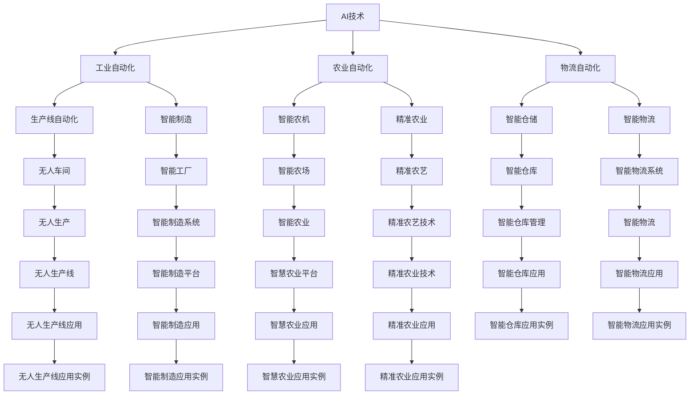

                 

# AI技术在不同领域的应用

## 1. 背景介绍

### 1.1 问题由来

随着人工智能(AI)技术的迅猛发展，AI在各个领域的应用已经取得了显著的进展。AI技术已经被广泛应用于医疗、金融、教育、制造、物流、自动驾驶等众多领域，极大地提升了这些行业的效率、质量和创新能力。AI技术通过模拟人类的智能行为，如感知、决策、学习等，来解决复杂的问题，推动社会生产力的进步。

### 1.2 问题核心关键点

AI技术在不同领域的应用，主要体现在以下几个关键点：

1. **自动化与智能化**：AI技术通过自动化和智能化，大幅提高工作效率，减少人工错误，提升生产效率。
2. **数据驱动决策**：AI技术能够从大量数据中提取有价值的信息，支持更科学、合理的决策。
3. **跨领域融合**：AI技术在不同领域之间的融合，如工业AI、农业AI、智慧城市等，推动了行业的创新和变革。
4. **人机协同**：AI技术通过与人类协同工作，实现智能增强，提升整体绩效。
5. **伦理与安全**：AI技术的广泛应用也带来了伦理和安全的挑战，需要综合考虑技术的应用场景和影响。

### 1.3 问题研究意义

AI技术在不同领域的应用，对于提升生产效率、优化资源配置、改善用户体验、推动科技创新具有重要意义：

1. **效率提升**：AI技术通过自动化和智能化，大幅提高工作效率，减少人工错误，降低生产成本。
2. **决策支持**：AI技术提供数据驱动的决策支持，帮助企业更好地应对市场变化，优化运营策略。
3. **创新驱动**：AI技术通过跨领域融合，推动技术创新和行业变革，开辟新的增长点。
4. **用户体验优化**：AI技术通过智能推荐、个性化服务，提升用户体验，增强用户满意度。
5. **风险管理**：AI技术通过风险预警和自动化管理，提高风险控制能力，保障业务稳定运行。

## 2. 核心概念与联系

### 2.1 核心概念概述

为更好地理解AI技术在不同领域的应用，本节将介绍几个密切相关的核心概念：

- **AI技术**：包括机器学习、深度学习、自然语言处理、计算机视觉、机器人技术等，用于模拟人类的智能行为。
- **自动化**：通过AI技术实现自动化流程，减少人工干预，提高效率。
- **智能化**：通过AI技术实现智能决策、智能推荐、智能控制等功能，提升系统的智能化水平。
- **数据驱动**：AI技术依赖大量数据进行模型训练，通过数据分析提供决策支持。
- **跨领域融合**：AI技术在不同领域之间的应用，如工业AI、农业AI、智慧城市等。
- **人机协同**：AI技术与人类协同工作，实现智能增强。
- **伦理与安全**：AI技术应用中涉及的伦理和安全问题，如隐私保护、数据安全、决策透明性等。

这些核心概念之间的逻辑关系可以通过以下Mermaid流程图来展示：


这个流程图展示了大语言模型的核心概念及其之间的关系：

1. AI技术是自动化、智能化、数据驱动、跨领域融合、人机协同、伦理与安全的起点。
2. 自动化、智能化、数据驱动、跨领域融合、人机协同、伦理与安全是大语言模型的主要应用场景。
3. AI技术与这些应用场景相互促进，共同推动了各行业的智能化转型。

### 2.2 概念间的关系

这些核心概念之间存在着紧密的联系，形成了AI技术的完整应用生态系统。下面我通过几个Mermaid流程图来展示这些概念之间的关系。

#### 2.2.1 AI技术的自动化应用



这个流程图展示了AI技术在工业自动化、农业自动化、物流自动化等领域的自动化应用。

#### 2.2.2 AI技术的数据驱动应用


这个流程图展示了AI技术在智能推荐、预测分析、决策支持等数据驱动领域的应用。

#### 2.2.3 AI技术的跨领域融合应用

```mermaid
graph LR
    A[AI技术] --> B[智慧医疗]
    A --> C[智慧金融]
    A --> D[智能教育]
    B --> E[诊断系统]
    B --> F[电子病历]
    C --> G[风险控制]
    C --> H[智能投顾]
    D --> I[个性化教学]
    D --> J[在线评估]
    E --> K[疾病诊断]
    E --> L[智能诊疗]
    F --> M[电子病历管理]
    F --> N[医疗数据分析]
    G --> O[风险评估]
    G --> P[智能监控]
    H --> Q[智能投顾系统]
    H --> R[智能理财]
    I --> S[个性化推荐]
    I --> T[智能学习系统]
    J --> U[在线评估系统]
    J --> V[学习数据分析]
    K --> W[疾病诊断系统]
    K --> X[智能诊断系统]
    L --> Y[智能诊疗系统]
    L --> Z[医疗决策支持]
    M --> AA[电子病历管理系统]
    M --> AB[医疗数据分析系统]
    N --> AC[医疗数据分析实例]
    O --> AD[风险评估系统]
    O --> AE[智能监控系统]
    P --> AF[智能监控系统]
    Q --> AG[智能投顾系统实例]
    Q --> AH[智能理财系统实例]
    R --> AI[智能理财系统实例]
    S --> AJ[个性化推荐系统实例]
    S --> AK[智能学习系统实例]
    T --> AL[智能学习系统实例]
    U --> AM[在线评估系统实例]
    V --> AN[学习数据分析实例]
    W --> AO[疾病诊断系统实例]
    X --> AP[智能诊断系统实例]
    Y --> AQ[智能诊疗系统实例]
    Z --> AR[医疗决策支持实例]
    AA --> AS[电子病历管理系统实例]
    AB --> AT[医疗数据分析系统实例]
    AC --> AU[医疗数据分析实例]
    AD --> AV[风险评估系统实例]
    AE --> AW[智能监控系统实例]
    AF --> AX[智能监控系统实例]
    AG --> AY[智能投顾系统实例]
    AH --> AZ[智能理财系统实例]
    AI --> BA[个性化推荐系统实例]
    AI --> BB[智能学习系统实例]
    AL --> BC[智能学习系统实例]
    AM --> BD[在线评估系统实例]
    AN --> BE[学习数据分析实例]
    AO --> BF[疾病诊断系统实例]
    AP --> BG[智能诊断系统实例]
    AQ --> BH[智能诊疗系统实例]
    AR --> BI[医疗决策支持实例]
    AS --> BJ[电子病历管理系统实例]
    AT --> BK[医疗数据分析系统实例]
    AU --> BL[在线评估系统实例]
    AV --> BM[学习数据分析实例]
    AW --> BN[智能监控系统实例]
    AX --> BO[智能监控系统实例]
    AY --> BP[智能投顾系统实例]
    AZ --> BQ[智能理财系统实例]
    BA --> BR[个性化推荐系统实例]
    BB --> BS[智能学习系统实例]
    BC --> BT[智能学习系统实例]
    BD --> BU[在线评估系统实例]
    BE --> BV[学习数据分析实例]
    BF --> BW[疾病诊断系统实例]
    BG --> BX[智能诊断系统实例]
    BH --> BY[智能诊疗系统实例]
    BI --> BZ[医疗决策支持实例]
    BJ --> CA[电子病历管理系统实例]
    BK --> CB[医疗数据分析系统实例]
    BL --> CC[在线评估系统实例]
    BM --> CD[学习数据分析实例]
    BN --> CE[智能监控系统实例]
    BO --> CF[智能监控系统实例]
    BP --> CG[智能投顾系统实例]
    BQ --> CH[智能理财系统实例]
    BR --> CI[个性化推荐系统实例]
    BS --> CJ[智能学习系统实例]
    BT --> CK[智能学习系统实例]
    BU --> CL[在线评估系统实例]
    BV --> CM[学习数据分析实例]
    BW --> CN[疾病诊断系统实例]
    BX --> CO[智能诊断系统实例]
    BY --> CP[智能诊疗系统实例]
    BZ --> CQ[医疗决策支持实例]
    CA --> CR[电子病历管理系统实例]
    CB --> CS[医疗数据分析系统实例]
    CC --> CT[在线评估系统实例]
    CD --> CU[学习数据分析实例]
    CE --> CV[智能监控系统实例]
    CF --> CW[智能监控系统实例]
    CG --> CY[智能投顾系统实例]
    CH --> CZ[智能理财系统实例]
    CI --> DA[个性化推荐系统实例]
    CJ --> DB[智能学习系统实例]
    CK --> DC[智能学习系统实例]
    CL --> DD[在线评估系统实例]
    CM --> DE[学习数据分析实例]
    CN --> DF[疾病诊断系统实例]
    CO --> DG[智能诊断系统实例]
    CP --> DH[智能诊疗系统实例]
    CQ --> DI[医疗决策支持实例]
    CZ --> DJ[智能理财系统实例]
    DA --> DK[个性化推荐系统实例]
    DB --> DL[智能学习系统实例]
    DC --> DM[智能学习系统实例]
    DD --> DN[在线评估系统实例]
    DE --> DO[学习数据分析实例]
    DF --> DP[疾病诊断系统实例]
    DG --> DQ[智能诊断系统实例]
    DH --> DR[智能诊疗系统实例]
    DI --> DS[医疗决策支持实例]
    DJ --> DT[智能理财系统实例]
    DK --> DU[个性化推荐系统实例]
    DL --> DV[智能学习系统实例]
    DM --> DW[智能学习系统实例]
    DN --> DX[在线评估系统实例]
    DO --> DY[学习数据分析实例]
    DP --> DZ[疾病诊断系统实例]
    DQ --> EA[智能诊断系统实例]
    DR --> EB[智能诊疗系统实例]
    DS --> EC[医疗决策支持实例]
    DT --> ED[智能理财系统实例]
    DU --> EE[个性化推荐系统实例]
    DV --> EF[智能学习系统实例]
    DW --> EG[智能学习系统实例]
    DX --> EH[在线评估系统实例]
    DY --> EI[学习数据分析实例]
    DZ --> EJ[疾病诊断系统实例]
    EA --> EK[智能诊断系统实例]
    EB --> EL[智能诊疗系统实例]
    EC --> EM[医疗决策支持实例]
    ED --> EN[智能理财系统实例]
    EE --> EO[个性化推荐系统实例]
    EF --> EP[智能学习系统实例]
    EG --> EQ[智能学习系统实例]
    EH --> ER[在线评估系统实例]
    EI --> ES[学习数据分析实例]
    EJ --> ET[疾病诊断系统实例]
    EK --> EU[智能诊断系统实例]
    EL --> EV[智能诊疗系统实例]
    EM --> EW[医疗决策支持实例]
    EN --> EX[智能理财系统实例]
    EO --> EY[个性化推荐系统实例]
    EP --> EZ[智能学习系统实例]
    EQ --> FA[智能学习系统实例]
    ER --> FB[在线评估系统实例]
    ES --> FC[学习数据分析实例]
    ET --> FD[疾病诊断系统实例]
    EU --> FE[智能诊断系统实例]
    EV --> FF[智能诊疗系统实例]
    EW --> FG[医疗决策支持实例]
    EX --> FH[智能理财系统实例]
    EY --> FI[个性化推荐系统实例]
    EZ --> FJ[智能学习系统实例]
    FA --> FK[智能学习系统实例]
    FB --> FL[在线评估系统实例]
    FC --> FM[学习数据分析实例]
    FD --> FN[疾病诊断系统实例]
    FE --> FO[智能诊断系统实例]
    FF --> FP[智能诊疗系统实例]
    FG --> FQ[医疗决策支持实例]
    FH --> FR[智能理财系统实例]
    FI --> FS[个性化推荐系统实例]
    FJ --> FT[智能学习系统实例]
    FK --> FU[智能学习系统实例]
    FL --> FV[在线评估系统实例]
    FM --> FW[学习数据分析实例]
    FN --> FX[疾病诊断系统实例]
    FO --> FY[智能诊疗系统实例]
    FP --> FZ[医疗决策支持实例]
    FQ --> GA[智能理财系统实例]
    FR --> GB[个性化推荐系统实例]
    FS --> GC[智能学习系统实例]
    FT --> GD[智能学习系统实例]
    FU --> GE[智能学习系统实例]
    FV --> GF[在线评估系统实例]
    FW --> GK[学习数据分析实例]
    FX --> GL[疾病诊断系统实例]
    FY --> GM[智能诊疗系统实例]
    FZ --> GN[医疗决策支持实例]
    GA --> GO[智能理财系统实例]
    GB --> GP[个性化推荐系统实例]
    GC --> GQ[智能学习系统实例]
    GD --> GR[智能学习系统实例]
    GE --> GS[智能学习系统实例]
    GF --> GV[在线评估系统实例]
    GK --> GW[学习数据分析实例]
    GL --> GX[疾病诊断系统实例]
    GM --> GY[智能诊疗系统实例]
    GN --> GZ[医疗决策支持实例]
    GO --> HA[智能理财系统实例]
    GP --> HB[个性化推荐系统实例]
    GQ --> HC[智能学习系统实例]
    GR --> HD[智能学习系统实例]
    GS --> HE[智能学习系统实例]
    GV --> HG[在线评估系统实例]
    GW --> HH[学习数据分析实例]
    GX --> HI[疾病诊断系统实例]
    GY --> HJ[智能诊疗系统实例]
    GZ --> HK[医疗决策支持实例]
    HA --> HO[智能理财系统实例]
    HB --> HP[个性化推荐系统实例]
    HC --> HQ[智能学习系统实例]
    HD --> HR[智能学习系统实例]
    HE --> HS[智能学习系统实例]
    HG --> HT[在线评估系统实例]
    HH --> HU[学习数据分析实例]
    HI --> HV[疾病诊断系统实例]
    HJ --> HW[智能诊疗系统实例]
    HK --> HX[医疗决策支持实例]
    HO --> HY[智能理财系统实例]
    HP --> HZ[个性化推荐系统实例]
    HQ --> IA[智能学习系统实例]
    HR --> IB[智能学习系统实例]
    HS --> IC[智能学习系统实例]
    HT --> ID[在线评估系统实例]
    HU --> IE[学习数据分析实例]
    HV --> IF[疾病诊断系统实例]
    HW --> IG[智能诊疗系统实例]
    HX --> IH[医疗决策支持实例]
    HY --> IJ[智能理财系统实例]
    HZ --> IK[个性化推荐系统实例]
    IA --> IL[智能学习系统实例]
    IB --> IM[智能学习系统实例]
    IC --> IN[智能学习系统实例]
    ID --> IO[在线评估系统实例]
    IE --> IP[学习数据分析实例]
    IF --> IQ[疾病诊断系统实例]
    IG --> IR[智能诊疗系统实例]
    IH --> IS[医疗决策支持实例]
    IJ --> IT[智能理财系统实例]
    IK --> IU[个性化推荐系统实例]
    IL --> IV[智能学习系统实例]
    IM --> IX[智能学习系统实例]
    IN --> IY[智能学习系统实例]
    IO --> JA[在线评估系统实例]
    IP --> JB[学习数据分析实例]
    IQ --> JE[疾病诊断系统实例]
    IR --> JH[智能诊疗系统实例]
    IS --> JK[医疗决策支持实例]
    IT --> JL[智能理财系统实例]
    IU --> JM[个性化推荐系统实例]
    IV --> JN[智能学习系统实例]
    IX --> JO[智能学习系统实例]
    IY --> JP[智能理财系统实例]
    JJ --> KA[在线评估系统实例]
    JK --> KF[智能理财系统实例]
    JL --> KI[智能理财系统实例]
    JM --> KN[个性化推荐系统实例]
    JN --> KO[智能学习系统实例]
    JO --> KP[智能理财系统实例]
    JP --> KQ[智能理财系统实例]
    KA --> KB[在线评估系统实例]
    KB --> KL[智能理财系统实例]
    KF --> KM[智能理财系统实例]
    KG --> KN[智能理财系统实例]
    KI --> KL[智能理财系统实例]
    KN --> KO[智能理财系统实例]
    KP --> KR[智能理财系统实例]
    KQ --> KS[智能理财系统实例]
    KL --> KT[智能理财系统实例]
    KM --> KV[智能理财系统实例]
    KN --> KW[智能理财系统实例]
    KR --> KX[智能理财系统实例]
    KS --> KY[智能理财系统实例]
    KT --> KZ[智能理财系统实例]
    KV --> LA[个性化推荐系统实例]
    KW --> LB[智能理财系统实例]
    KX --> LC[智能理财系统实例]
    KY --> LD[智能理财系统实例]
    KZ --> LE[智能理财系统实例]
    LA --> LF[个性化推荐系统实例]
    LB --> LG[智能理财系统实例]
    LC --> LH[智能理财系统实例]
    LD --> LK[智能理财系统实例]
    LE --> LL[智能理财系统实例]
    LF --> LM[个性化推荐系统实例]
    LG --> LN[智能理财系统实例]
    LH --> LO[智能理财系统实例]
    LK --> LP[智能理财系统实例]
    LL --> LQ[智能理财系统实例]
    LM --> LR[个性化推荐系统实例]
    LN --> LS[智能理财系统实例]
    LO --> LT[智能理财系统实例]
    LP --> LU[智能理财系统实例]
    LQ --> LV[智能理财系统实例]
    LR --> LW[个性化推荐系统实例]
    LS --> LY[智能理财系统实例]
    LT --> LZ[智能理财系统实例]
    LU --> MA[个性化推荐系统实例]
    LV --> MB[智能理财系统实例]
    LW --> MC[智能理财系统实例]
    LY --> MD[智能理财系统实例]
    LZ --> ME[智能理财系统实例]
    MA --> MB[个性化推荐系统实例]
    MB --> MC[智能理财系统实例]
    MC --> MD[智能理财系统实例]
    MD --> ME[智能理财系统实例]
    ME --> MF[智能理财系统实例]
    MF --> MG[个性化推荐系统实例]
    MG --> MH[智能理财系统实例]
    MH --> MI[智能理财系统实例]
    MI --> MJ[智能理财系统实例]
    MJ --> MK[智能理财系统实例]
    MK --> ML[智能理财系统实例]
    ML --> MM[智能理财系统实例]
    MM --> MN[智能理财系统实例]
    MN --> MO[智能理财系统实例]
    MO --> MP[智能理财系统实例]
    MP --> MQ[智能理财系统实例]
    MQ --> MR[智能理财系统实例]
    MR --> MS[智能理财系统实例]
    MS --> MT[智能理财系统实例]
    MT --> MU[智能理财系统实例]
    MU --> MV[智能理财系统实例]
    MV --> MW[智能理财系统实例]
    MW --> MX[智能理财系统实例]
    MX --> MY[智能理财系统实例]
    MY --> MZ[智能理财系统实例]
    MA --> NA[个性化推荐系统实例]
    MB --> NB[智能理财系统实例]
    MC --> NC[智能理财系统实例]
    MD --> ND[智能理财系统实例]
    ME --> NE[智能理财系统实例]
    MF --> NF[个性化推荐系统实例]
    MG --> NG[智能理财系统实例]
    MH --> NH[智能理财系统实例]
    MI --> NK[智能理财系统实例]
    MJ --> NL[智能理财系统实例]
    MK --> NM[智能理财系统实例]
    ML --> NN[智能理财系统实例]
    MM --> NO[智能理财系统实例]
    MN --> NP[智能理财系统实例]
    MO --> NQ[智能理财系统实例]
    MP --> NR[智能理财系统实例]
    MQ --> NS[智能理财系统实例]
    MR --> NT[智能理财系统实例]
    MS --> NU[智能理财系统实例]
    MT --> NV[智能理财系统实例]
    MU --> NW[智能理财系统实例]
    MV --> NX[智能理财系统实例]
    MW --> NY[智能理财系统实例]
    MX --> NZ[智能理财系统实例]
    MY --> OA[智能理财系统实例]
    MZ --> OB[个性化推荐系统实例]
    NA --> OC[个性化推荐系统实例]
    NB --> OD[智能理财系统实例]
    NC --> OE[智能理财系统实例]
    ND --> OF[智能理财系统实例]
    NE --> OH[智能理财系统实例]
    NF --> OJ[智能理财系统实例]
    NG --> OK[智能理财系统实例]
    NH --> OL[智能理财系统实例]
    NK --> OM[智能理财系统实例]
    NL --> ON[智能理财系统实例]
    NM --> OP[智能理财系统实例]
    NN --> OQ[智能理财系统实例]
    NO --> OR[智能理财系统实例]
    NP --> OS[智能理财系统实例]
    NQ --> OT[智能理财系统实例]
    NR --> OU[智能理财系统实例]
    NS --> OV[智能理财系统实例]
    NT --> OW[智能理财系统实例]
    NU --> OX[智能理财系统实例]
    NW --> OY[智能理财系统实例]
    NX --> OZ[智能理财系统实例]
    NY --> PA[智能理财系统实例]
    NZ --> PB[智能理财系统实例]
    OA --> PC[个性化推荐系统实例]
    OB --> PD[智能理财系统实例]
    OC --> PE[智能理财系统实例]
    OD --> PF[智能理财系统实例]
    OE --> PG[智能理财系统实例]
    OH --> PH[智能理财系统实例]
    OJ --> PI[智能理财系统实例]
    OK --> PL[智能理财系统实例]
    OL --> PM[智能理财系统实例]
    OM --> PN[智能理财系统实例]
    ON --> PO[智能理财系统实例]
    OP --> PN[智能理财系统实例]
    OQ --> PN[智能理财系统实例]
    OR --> PT[智能理财系统实例]
    OS --> PQ[智能理财系统实例]
    OT --> PR[智能理财系统实例]
    OU --> PS[智能理财系统实例]
    OV --> PT[智能理财系统实例]
    OW --> PT[智能理财系统实例]
    OX --> PT[智能理财系统实例]
    OY --> PT[智能理财系统实例]
    OZ --> PT[智能理财系统实例]
    PA --> PB[个性化推荐系统实例]
    PB --> PC[智能理财系统实例]
    PC --> PD[智能理财系统实例]
    PD --> PE[智能理财系统实例]
    PE --> PF[智能理财系统实例]
    PF --> PG[智能理财系统实例]
    PG --> PH[智能理财系统实例]
    PH --> PI[智能理财系统实例]
    PI --> PJ[智能理财系统实例]
    PJ --> PK[智能理财系统实例]
    PK --> PL[智能理财系统实例]
    PL --> PM[智能理财系统实例]
    PM --> PN[智能理财系统实例]
    PN --> PO[智能理财系统实例]
    PO --> PN[智能理财系统实例]
    PP --> PR[智能理财系统实例]
    PR --> PS[智能理财系统实例]
    PS --> PT[智能理财系统实例]
    PT --> PN[智能理财系统实例]
    PU --> PV[智能理财系统实例]
    PV --> PW[智能理财系统实例]
    PW --> PX[智能理财系统实例]
    PX --> PY[智能理财系统实例]
    PY --> PZ[智能理财系统实例]
    PZ --> QA[智能理财系统实例]
    QA -->

