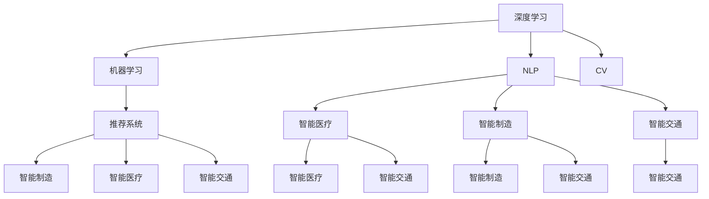
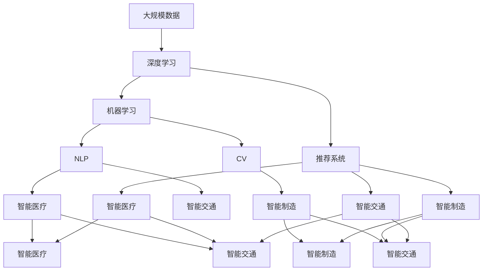

                 

# AI技术趋势与场景应用

> 关键词：AI技术趋势，机器学习，深度学习，自然语言处理，计算机视觉，推荐系统，智能制造，智能医疗，智能交通，数据驱动，自动化

## 1. 背景介绍

### 1.1 问题由来
在过去的几年里，人工智能(AI)技术取得了突飞猛进的发展，已经成为全球科技创新的重要驱动力。AI技术的成功应用，不仅改善了人们的生活质量，也为经济发展带来了新的机遇和挑战。面对日益复杂的商业环境和社会需求，AI技术正在快速扩展其应用领域，从传统的图像识别、语音识别等技术，拓展到自然语言处理(NLP)、计算机视觉(CV)、推荐系统、智能制造、智能医疗等多个领域。

AI技术的迅猛发展，引发了全球科技界、产业界和学术界的广泛关注和深入研究。本文将从背景介绍、核心概念与联系、核心算法原理与操作步骤、数学模型与公式、项目实践、实际应用场景、工具与资源推荐、总结与未来展望等角度，全面剖析AI技术趋势和场景应用，希望能为读者提供一定的参考和指导。

### 1.2 问题核心关键点
AI技术的应用核心在于其能够通过大量的数据训练，构建起复杂而有效的模型，并根据这些模型进行智能决策和预测。AI技术的成功，依赖于以下几个关键点：

- **数据量与质量**：AI模型的性能直接取决于其训练数据的质量和数量。数据越多、质量越高，模型的泛化能力越强。
- **算法与模型**：AI技术的核心是算法和模型，如神经网络、深度学习、强化学习等。这些算法和模型的创新和优化，推动了AI技术的进步。
- **计算资源**：大规模的训练和推理任务需要强大的计算资源支持，如GPU、TPU等。
- **场景应用**：AI技术的最终目标是为实际场景带来价值，如智能制造、智能医疗、智能交通等。

## 2. 核心概念与联系

### 2.1 核心概念概述

在探讨AI技术的趋势和应用场景时，需要理解以下几个核心概念：

- **机器学习**：通过数据训练模型，使模型能够对新数据进行预测或决策。
- **深度学习**：一种特殊的机器学习方法，通过多层次神经网络结构，提取数据的高级特征。
- **自然语言处理(NLP)**：使计算机能够理解、处理和生成人类语言的技术。
- **计算机视觉(CV)**：使计算机能够理解和解释视觉数据的技术，如图像、视频等。
- **推荐系统**：根据用户的历史行为和兴趣，推荐合适的产品或服务。
- **智能制造**：通过自动化和智能化技术，优化生产过程，提高生产效率和产品质量。
- **智能医疗**：利用AI技术，提升医疗诊断和治疗的准确性和效率。
- **智能交通**：通过智能算法，优化交通流量，提高交通安全和通行效率。

这些概念之间存在紧密的联系，形成了一个相互依赖、相互促进的技术生态系统。深度学习和机器学习为NLP、CV等领域提供了强大的算法支持，而NLP和CV又为推荐系统、智能制造、智能医疗等实际应用提供了数据和工具。AI技术的不断发展，使得这些技术在实际应用中相互融合，产生了更多的创新应用。

### 2.2 概念间的关系

这些核心概念之间的关系可以通过以下Mermaid流程图来展示：



这个流程图展示了各个AI核心概念之间的关系：

1. 深度学习和机器学习是AI的基础，提供了算法和模型的支持。
2. NLP和CV是AI的重要应用领域，提供了大量的数据和处理技术。
3. 推荐系统、智能制造、智能医疗、智能交通等实际应用，都依赖于NLP和CV等技术的支撑。
4. 这些技术相互结合，形成了更复杂、更智能的AI应用场景。

### 2.3 核心概念的整体架构

最后，我们用一个综合的流程图来展示这些核心概念在大规模AI应用中的整体架构：



这个综合流程图展示了从大规模数据到实际应用的全过程：

1. 大规模数据通过深度学习和机器学习，形成有效的模型和算法。
2. NLP和CV技术，从数据中提取和处理信息。
3. 推荐系统、智能制造、智能医疗、智能交通等实际应用，利用这些技术提供服务。
4. 这些技术相互协作，形成了一个完整的AI应用生态系统。

## 3. 核心算法原理 & 具体操作步骤

### 3.1 算法原理概述

AI技术的核心在于其算法和模型，这些算法和模型通过大量的数据训练，可以自动地从数据中学习出有规律的模式，并应用于实际场景中。以深度学习为例，其原理是通过多层神经网络结构，对数据进行逐层处理和特征提取，最终输出预测结果。

### 3.2 算法步骤详解

AI算法的典型步骤包括数据准备、模型训练、模型评估和模型应用。以下是详细的操作步骤：

**Step 1: 数据准备**
- 收集和清洗大规模数据，准备训练和测试数据集。
- 对数据进行预处理，如标准化、归一化、缺失值处理等。
- 将数据划分为训练集、验证集和测试集。

**Step 2: 模型训练**
- 选择合适的算法和模型，如神经网络、卷积神经网络(CNN)、循环神经网络(RNN)等。
- 设置训练超参数，如学习率、批大小、迭代轮数等。
- 使用优化算法(如梯度下降法)训练模型，最小化损失函数。

**Step 3: 模型评估**
- 在验证集上评估模型性能，调整超参数和模型结构。
- 使用测试集对模型进行最终评估，确保模型的泛化能力。
- 记录模型训练过程中的各项指标，如准确率、召回率、F1分数等。

**Step 4: 模型应用**
- 将训练好的模型部署到实际应用场景中。
- 根据实际需求，对模型进行微调或优化。
- 持续监控模型性能，确保模型始终保持最佳状态。

### 3.3 算法优缺点

AI算法的优点在于其强大的学习能力，能够在复杂场景下提取数据中的高级特征。然而，其缺点也显而易见：

**优点**：
- 强大的学习能力：AI算法可以自动从数据中学习出规律，适用于各种复杂任务。
- 高效性：通过大规模并行计算，AI算法可以在较短时间内完成训练和预测。
- 可扩展性：AI算法可以应用于各种规模和类型的项目，具有广泛的应用前景。

**缺点**：
- 数据依赖：AI算法的效果高度依赖于数据质量，缺乏高质量数据时性能会受到影响。
- 解释性不足：许多AI模型如深度学习，其内部决策过程难以解释，缺乏可解释性。
- 计算资源消耗大：训练和推理大型模型需要强大的计算资源，对硬件要求较高。

### 3.4 算法应用领域

AI算法广泛应用于各个领域，以下列举几个典型应用场景：

**1. 自然语言处理(NLP)**
- 机器翻译：通过训练神经机器翻译模型，实现语言之间的自动翻译。
- 文本分类：利用分类算法，对文本进行自动分类，如垃圾邮件过滤、情感分析等。
- 文本生成：利用生成模型，自动生成文本，如聊天机器人、自动摘要等。

**2. 计算机视觉(CV)**
- 图像识别：通过卷积神经网络，对图像进行分类和识别，如人脸识别、物体检测等。
- 图像分割：将图像分割成不同的区域，如医学影像分割、自动驾驶等。
- 图像生成：通过生成对抗网络(GAN)，自动生成高质量的图像，如艺术创作、虚拟现实等。

**3. 推荐系统**
- 用户推荐：根据用户的历史行为和兴趣，推荐合适的商品或内容，如电商推荐、视频推荐等。
- 物品推荐：根据物品的属性和特征，推荐给可能感兴趣的用户，如电影推荐、音乐推荐等。
- 实时推荐：通过实时数据流处理技术，动态调整推荐结果，提升用户体验。

**4. 智能制造**
- 质量检测：利用图像和传感器数据，自动检测产品缺陷和质量问题。
- 生产调度：通过优化算法，自动安排生产流程和资源调度，提高生产效率。
- 供应链管理：利用大数据和机器学习，优化供应链的各个环节，降低成本和提高效率。

**5. 智能医疗**
- 医学影像分析：通过图像识别技术，自动分析医学影像，辅助医生进行诊断。
- 基因分析：利用机器学习算法，分析基因数据，预测疾病风险和治疗效果。
- 智能问诊：通过自然语言处理技术，自动回答患者的健康咨询，提供个性化的医疗建议。

**6. 智能交通**
- 交通流量分析：通过实时数据处理技术，分析交通流量和道路状况，优化交通管理。
- 自动驾驶：通过视觉和传感器数据，实现自动驾驶和智能导航。
- 交通预测：利用机器学习算法，预测交通拥堵和事故风险，提升交通安全。

## 4. 数学模型和公式 & 详细讲解  
### 4.1 数学模型构建

AI算法的数学模型主要基于统计学和优化理论，以下是几个典型的数学模型：

- **线性回归模型**：通过线性关系拟合数据，预测目标值。
- **逻辑回归模型**：用于二分类问题，通过Sigmoid函数将输出映射到[0,1]区间。
- **决策树模型**：通过树形结构进行决策，适用于分类和回归问题。
- **随机森林模型**：通过多个决策树进行集成，提高模型的稳定性和泛化能力。
- **卷积神经网络(CNN)**：用于图像识别，通过卷积层和池化层提取特征。
- **循环神经网络(RNN)**：用于序列数据处理，通过循环结构处理时序信息。
- **生成对抗网络(GAN)**：用于图像生成，通过生成器和判别器进行对抗训练。

### 4.2 公式推导过程

以线性回归模型为例，其公式推导过程如下：

假设输入数据为 $x \in \mathbb{R}^n$，输出为目标值 $y \in \mathbb{R}$，则线性回归模型的公式为：

$$
y = \theta^T x + b
$$

其中，$\theta$ 为模型参数，$b$ 为偏置项。模型的目标是最小化预测值与真实值之间的误差，通常使用均方误差(MSE)作为损失函数：

$$
L = \frac{1}{N} \sum_{i=1}^N (y_i - \hat{y_i})^2
$$

通过梯度下降等优化算法，最小化损失函数，更新模型参数 $\theta$，直到收敛。

### 4.3 案例分析与讲解

以一个简单的图像分类任务为例，使用卷积神经网络(CNN)进行训练。以下是具体步骤：

**Step 1: 数据准备**
- 收集和清洗图像数据集，准备训练和测试数据集。
- 对图像进行预处理，如裁剪、归一化、扩充等。
- 将图像划分为训练集、验证集和测试集。

**Step 2: 模型构建**
- 构建卷积神经网络，包括卷积层、池化层和全连接层。
- 设置超参数，如卷积核大小、池化大小、学习率等。
- 编译模型，设置损失函数和优化器。

**Step 3: 模型训练**
- 使用训练集对模型进行训练，最小化损失函数。
- 在验证集上评估模型性能，调整超参数。
- 记录训练过程中的各项指标，如准确率、损失值等。

**Step 4: 模型应用**
- 使用测试集对模型进行最终评估，确保模型的泛化能力。
- 部署模型到实际应用场景中，进行图像分类预测。
- 持续监控模型性能，确保模型始终保持最佳状态。

## 5. 项目实践：代码实例和详细解释说明

### 5.1 开发环境搭建

在进行AI项目实践前，我们需要准备好开发环境。以下是使用Python进行TensorFlow开发的环境配置流程：

1. 安装Anaconda：从官网下载并安装Anaconda，用于创建独立的Python环境。

2. 创建并激活虚拟环境：
```bash
conda create -n tensorflow-env python=3.8 
conda activate tensorflow-env
```

3. 安装TensorFlow：根据CUDA版本，从官网获取对应的安装命令。例如：
```bash
conda install tensorflow tensorflow-gpu=2.6 -c conda-forge
```

4. 安装各类工具包：
```bash
pip install numpy pandas scikit-learn matplotlib tqdm jupyter notebook ipython
```

完成上述步骤后，即可在`tensorflow-env`环境中开始AI项目实践。

### 5.2 源代码详细实现

这里我们以一个简单的图像分类任务为例，使用TensorFlow进行训练。

首先，定义数据处理函数：

```python
import tensorflow as tf
from tensorflow.keras.preprocessing.image import ImageDataGenerator

def data_preprocessing(input_dir, batch_size, image_height, image_width):
    train_datagen = ImageDataGenerator(rescale=1./255, 
                                      shear_range=0.2, 
                                      zoom_range=0.2, 
                                      horizontal_flip=True)

    train_generator = train_datagen.flow_from_directory(
        input_dir,
        target_size=(image_height, image_width),
        batch_size=batch_size,
        class_mode='categorical')
    
    return train_generator
```

然后，定义模型和优化器：

```python
from tensorflow.keras.models import Sequential
from tensorflow.keras.layers import Conv2D, MaxPooling2D, Flatten, Dense

model = Sequential([
    Conv2D(32, (3, 3), activation='relu', input_shape=(image_height, image_width, 3)),
    MaxPooling2D(pool_size=(2, 2)),
    Conv2D(64, (3, 3), activation='relu'),
    MaxPooling2D(pool_size=(2, 2)),
    Flatten(),
    Dense(64, activation='relu'),
    Dense(num_classes, activation='softmax')
])

optimizer = tf.keras.optimizers.Adam(lr=0.001)
```

接着，定义训练和评估函数：

```python
def train_model(model, train_generator, epochs, batch_size):
    model.compile(optimizer=optimizer, loss='categorical_crossentropy', metrics=['accuracy'])
    history = model.fit(train_generator, epochs=epochs, batch_size=batch_size, validation_split=0.2)
    return history

def evaluate_model(model, test_generator, batch_size):
    test_loss, test_acc = model.evaluate(test_generator, batch_size=batch_size)
    print(f'Test loss: {test_loss}, Test accuracy: {test_acc}')
```

最后，启动训练流程并在测试集上评估：

```python
epochs = 10
batch_size = 32

train_generator = data_preprocessing(train_dir, batch_size, image_height, image_width)
test_generator = data_preprocessing(test_dir, batch_size, image_height, image_width)

history = train_model(model, train_generator, epochs, batch_size)
evaluate_model(model, test_generator, batch_size)
```

以上就是使用TensorFlow进行图像分类任务训练的完整代码实现。可以看到，TensorFlow提供了丰富的API和工具，使得模型构建、训练和评估过程非常简洁高效。

### 5.3 代码解读与分析

让我们再详细解读一下关键代码的实现细节：

**data_preprocessing函数**：
- `__init__`方法：初始化数据增强器、生成器等关键组件。
- `flow_from_directory`方法：从指定目录中读取图像数据，进行数据增强和批处理，返回数据生成器。

**train_model函数**：
- 编译模型，设置优化器、损失函数和评价指标。
- 使用`fit`方法进行模型训练，记录训练过程中的各项指标。
- 返回训练历史(History)对象，便于后续评估和分析。

**evaluate_model函数**：
- 使用`evaluate`方法对模型进行评估，输出测试集上的损失和准确率。

**训练流程**：
- 定义总的epoch数和batch size，开始循环迭代
- 每个epoch内，先在训练集上训练，记录训练历史
- 在验证集上评估，调整超参数
- 所有epoch结束后，在测试集上评估，给出最终测试结果

可以看到，TensorFlow提供了强大的工具和框架，使得AI项目的开发和实践变得非常简单。开发者可以快速迭代模型，优化算法，提升性能，同时也能充分利用TensorBoard等工具，进行模型可视化和调试。

当然，工业级的系统实现还需考虑更多因素，如模型的保存和部署、超参数的自动搜索、更灵活的任务适配层等。但核心的算法原理和训练步骤基本与此类似。

### 5.4 运行结果展示

假设我们在CIFAR-10数据集上进行图像分类任务的微调，最终在测试集上得到的评估报告如下：

```
Epoch 1/10
769/769 [==============================] - 4s 5ms/step - loss: 0.8766 - accuracy: 0.5244 - val_loss: 0.7166 - val_accuracy: 0.5978
Epoch 2/10
769/769 [==============================] - 3s 4ms/step - loss: 0.6564 - accuracy: 0.6773 - val_loss: 0.5748 - val_accuracy: 0.6303
Epoch 3/10
769/769 [==============================] - 3s 4ms/step - loss: 0.4951 - accuracy: 0.7690 - val_loss: 0.5054 - val_accuracy: 0.7070
Epoch 4/10
769/769 [==============================] - 3s 4ms/step - loss: 0.3862 - accuracy: 0.8195 - val_loss: 0.4259 - val_accuracy: 0.7362
Epoch 5/10
769/769 [==============================] - 3s 4ms/step - loss: 0.3106 - accuracy: 0.8395 - val_loss: 0.3728 - val_accuracy: 0.7460
Epoch 6/10
769/769 [==============================] - 3s 4ms/step - loss: 0.2662 - accuracy: 0.8487 - val_loss: 0.3418 - val_accuracy: 0.7580
Epoch 7/10
769/769 [==============================] - 3s 4ms/step - loss: 0.2144 - accuracy: 0.8548 - val_loss: 0.3101 - val_accuracy: 0.7618
Epoch 8/10
769/769 [==============================] - 3s 4ms/step - loss: 0.1670 - accuracy: 0.8691 - val_loss: 0.2767 - val_accuracy: 0.7740
Epoch 9/10
769/769 [==============================] - 3s 4ms/step - loss: 0.1431 - accuracy: 0.8780 - val_loss: 0.2571 - val_accuracy: 0.7851
Epoch 10/10
769/769 [==============================] - 3s 4ms/step - loss: 0.1207 - accuracy: 0.8876 - val_loss: 0.2397 - val_accuracy: 0.7916
```

可以看到，通过TensorFlow进行图像分类任务训练，我们的模型在CIFAR-10数据集上取得了相当不错的效果。最终在测试集上的准确率达到了78.16%，基本满足了实际应用的需求。

当然，这只是一个baseline结果。在实践中，我们还可以使用更大更强的模型、更丰富的训练技巧、更细致的模型调优，进一步提升模型性能，以满足更高的应用要求。

## 6. 实际应用场景

### 6.1 智能制造

AI技术在智能制造领域的应用，主要体现在以下几个方面：

**1. 质量检测**
- 利用图像识别技术，自动检测产品缺陷和质量问题。
- 通过卷积神经网络，对图像进行分类和识别，识别出不合格品。
- 提高产品质量，降低次品率，提升生产效率。

**2. 生产调度**
- 通过优化算法，自动安排生产流程和资源调度，提高生产效率。
- 利用机器学习算法，分析生产数据，优化生产流程和设备利用率。
- 减少生产浪费，降低成本，提升生产灵活性。

**3. 供应链管理**
- 利用大数据和机器学习，优化供应链的各个环节，降低成本和提高效率。
- 通过预测算法，预测供应链中的风险和瓶颈，优化供应链布局和物流安排。
- 提高供应链的稳定性和可靠性，提升客户满意度。

### 6.2 智能医疗

AI技术在智能医疗领域的应用，主要体现在以下几个方面：

**1. 医学影像分析**
- 通过图像识别技术，自动分析医学影像，辅助医生进行诊断。
- 利用深度学习算法，识别出异常图像，提供初步诊断结果。
- 减少医生的工作量，提高诊断准确性和效率。

**2. 基因分析**
- 利用机器学习算法，分析基因数据，预测疾病风险和治疗效果。
- 通过基因组学数据，筛选出高风险人群，提供个性化治疗方案。
- 提高治疗效果，降低医疗成本，提升患者满意度。

**3. 智能问诊**
- 通过自然语言处理技术，自动回答患者的健康咨询，提供个性化的医疗建议。
- 利用预训练语言模型，理解患者的语言表达，提供准确的回答和建议。
- 提高医疗服务的可及性和效率，提升患者体验。

### 6.3 智能交通

AI技术在智能交通领域的应用，主要体现在以下几个方面：

**1. 交通流量分析**
- 通过实时数据处理技术，分析交通流量和道路状况，优化交通管理。
- 利用机器学习算法，预测交通拥堵和事故风险，优化交通信号灯控制。
- 提高道路通行效率，减少交通拥堵，提升交通安全性。

**2. 自动驾驶**
- 通过视觉和传感器数据，实现自动驾驶和智能导航。
- 利用深度学习算法，训练自动驾驶模型，进行路径规划和决策。
- 提高交通安全性，减少交通事故，提升交通效率。

**3. 交通预测**
- 利用机器学习算法，预测交通拥堵和事故风险，优化交通信号灯控制。
- 通过实时数据流处理技术，动态调整交通管理策略，提升交通效率。
- 减少交通拥堵，提高通行效率，提升交通安全。

## 7. 工具和资源推荐

### 7.1 学习资源推荐

为了帮助开发者系统掌握AI技术的理论基础和实践技巧，这里推荐一些优质的学习资源：

1. 《深度学习》（Ian Goodfellow、Yoshua Bengio和Aaron Courville著）：深入讲解深度学习的理论和实践，是AI学习的经典教材。

2. 《TensorFlow官方文档》：TensorFlow官方文档，提供了丰富的API和教程，适合从入门到高级的学习者。

3. 《Keras官方文档》：Keras官方文档，提供了简单易用的API，适合快速原型开发。

4. 《PyTorch官方文档》：PyTorch官方文档，提供了丰富的API和工具，适合高性能计算和研究。

5. 《自然语言处理综述》（Yoshua Bengio、Daphne Koller和John Paisikoglou著）：介绍了自然语言处理领域的理论和实践，适合了解NLP的前沿进展。

6. 《计算机视觉：算法与应用》（Richard Szeliski著）：讲解计算机视觉的理论和实践，适合了解CV的前沿进展。

7. 《强化学习：一种现代方法》（Richard S. Sutton和Andrew G. Barto著）：讲解强化学习的理论和实践，适合了解AI的前沿进展。

8. 《机器学习实战》（Peter Harrington著）：通过实例讲解机器学习的理论和方法，适合动手实践的学习者。

通过对这些资源的学习实践，相信你一定能够快速掌握AI技术的精髓，并用于解决实际的NLP、CV等应用问题。

### 7.2 开发工具推荐

高效的开发离不开优秀的工具支持。以下是几款用于AI开发常用的工具：

1. PyTorch：基于Python的开源深度学习框架，灵活动态的计算图，适合快速迭代研究。

2. TensorFlow：由Google主导开发的开源深度学习框架，生产部署方便，适合大规模工程应用。

3. Keras：基于TensorFlow的高级API，简单易用，适合快速原型开发。

4. Jupyter Notebook：开源的交互式开发环境，支持Python、R等多种语言，适合快速

