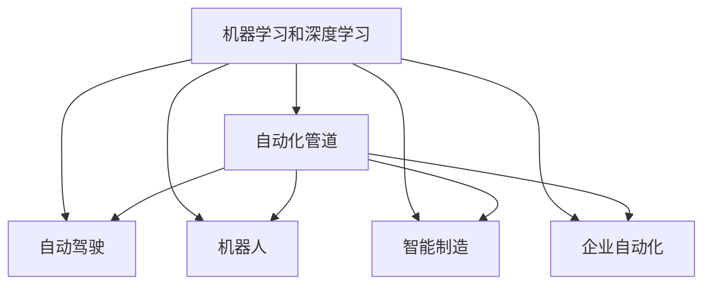
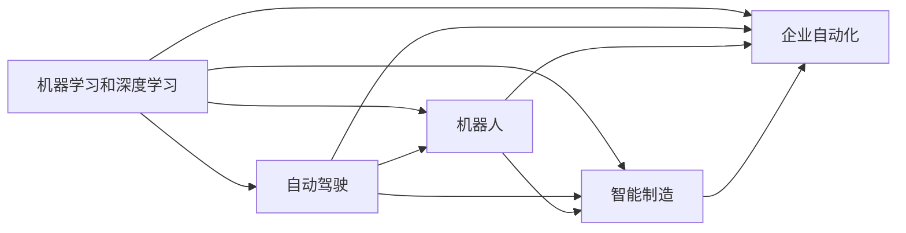
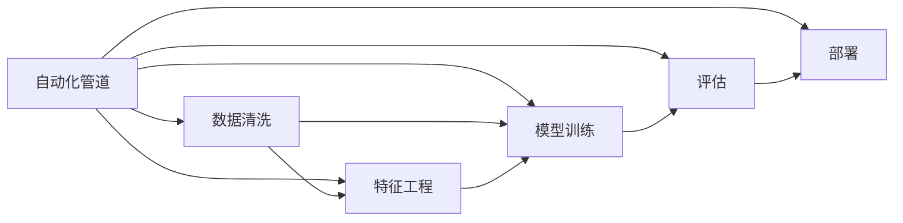
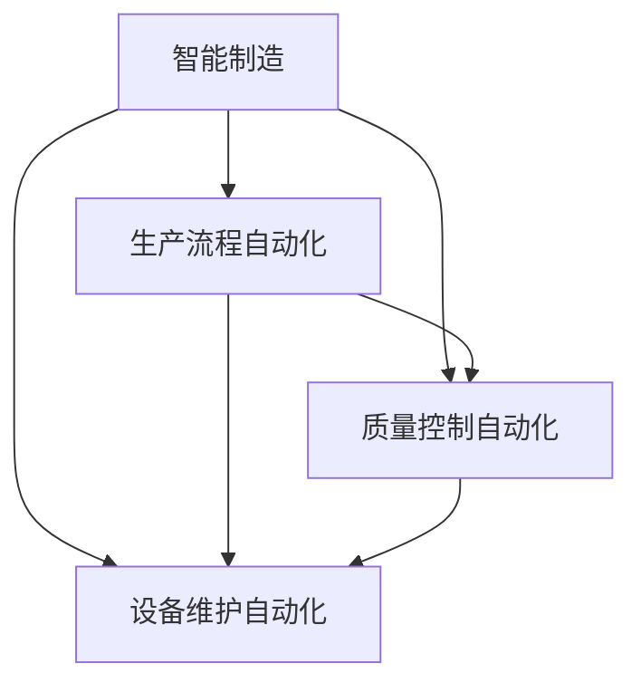
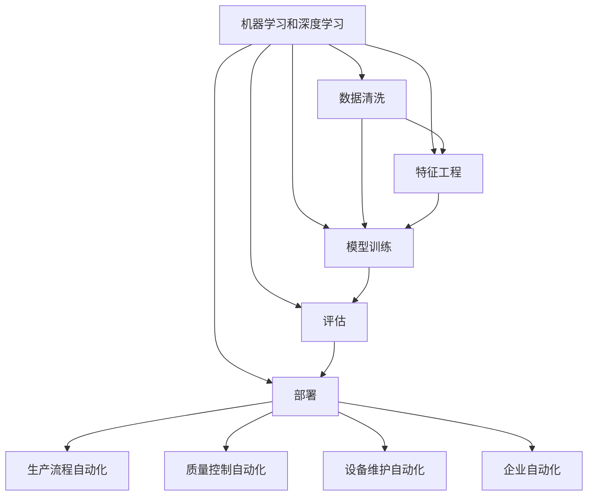

                 

# AI自动化的未来发展趋势

> 关键词：AI自动化,机器学习,深度学习,人工智能,自动驾驶,机器人,企业自动化

## 1. 背景介绍

### 1.1 问题由来

随着人工智能（AI）技术的迅猛发展，自动化已经成为各行各业的重要发展方向。AI自动化能够通过自动化机器学习和深度学习算法，提升效率、降低成本，并解放人类从事重复性高的工作。AI自动化技术的应用领域已广泛涵盖金融、制造、医疗、物流、智能制造等多个行业，为各行各业带来了革命性的变革。

然而，当前AI自动化仍然存在一些问题和挑战，如模型泛化能力不足、自动化程度有限、技术复杂度高等，严重制约了AI自动化的进一步发展。因此，研究AI自动化的未来发展趋势，对于推动产业升级，提升AI自动化技术的效率和效果，具有重要意义。

### 1.2 问题核心关键点

AI自动化的核心关键点主要包括：

- **机器学习与深度学习**：机器学习和深度学习是AI自动化的基础，通过学习海量数据，使模型能够自动提取特征，进行决策和预测。
- **自动化管道**：包括数据清洗、特征工程、模型训练、评估和部署等环节，确保整个自动化流程的稳定性和高效性。
- **跨领域应用**：AI自动化技术在多个领域中的应用，如自动驾驶、机器人、智能制造等，展示了其广泛的适用性和潜力。
- **自动化优化**：通过自动化手段，优化模型训练、参数调整等过程，提升自动化技术的效果和效率。
- **持续学习与适应性**：AI自动化模型需要具备持续学习的能力，以适应新数据和新环境，保持其有效性和时效性。

这些关键点构成了AI自动化技术的核心框架，进一步推动了AI自动化的发展与应用。

## 2. 核心概念与联系

### 2.1 核心概念概述

为更好地理解AI自动化的未来发展趋势，本节将介绍几个密切相关的核心概念：

- **机器学习和深度学习**：通过学习数据规律，使机器能够进行自动化决策和预测。
- **自动化管道**：指在机器学习过程中，从数据预处理到模型部署的自动化流程。
- **自动驾驶**：利用AI技术，实现车辆自动驾驶，是AI自动化应用的重要领域之一。
- **机器人**：通过AI自动化技术，实现机器人的自主导航、决策和操作。
- **智能制造**：通过AI自动化技术，实现生产过程的智能化和自动化。
- **企业自动化**：AI自动化技术在企业管理、运营、服务等各个环节的应用。

这些核心概念之间的逻辑关系可以通过以下Mermaid流程图来展示：



这个流程图展示了几大核心概念之间的联系：

- 机器学习和深度学习是AI自动化的基础，支撑自动化管道、自动驾驶、机器人、智能制造和企业自动化等多个领域。
- 自动化管道是连接机器学习和下游应用的关键环节，确保自动化流程的稳定性和高效性。
- 自动驾驶、机器人、智能制造和企业自动化则是机器学习和深度学习技术在实际应用中的典型代表。

### 2.2 概念间的关系

这些核心概念之间存在着紧密的联系，形成了AI自动化的完整生态系统。下面我们通过几个Mermaid流程图来展示这些概念之间的关系。

#### 2.2.1 机器学习和深度学习的应用场景



这个流程图展示了机器学习和深度学习在自动驾驶、机器人、智能制造和企业自动化等领域的应用场景。

#### 2.2.2 自动化管道与AI自动化的联系



这个流程图展示了自动化管道在机器学习和深度学习中的应用流程，确保整个自动化流程的稳定性和高效性。

#### 2.2.3 智能制造中的AI自动化



这个流程图展示了AI自动化在智能制造中的应用场景，通过自动化机器学习提升生产效率和质量。

### 2.3 核心概念的整体架构

最后，我们用一个综合的流程图来展示这些核心概念在大规模应用中的整体架构：



这个综合流程图展示了从机器学习和深度学习到自动化管道的完整流程，以及其在自动驾驶、机器人、智能制造和企业自动化等多个领域的应用。

## 3. 核心算法原理 & 具体操作步骤
### 3.1 算法原理概述

AI自动化主要基于机器学习和深度学习算法，通过自动化管道，实现从数据预处理到模型部署的自动化流程。其核心算法原理包括：

1. **数据预处理**：包括数据清洗、特征工程等步骤，提升数据质量，为后续模型训练奠定基础。
2. **模型训练**：利用训练数据集，通过自动化管道进行模型训练，确保模型质量。
3. **模型评估**：通过评估数据集，评估模型性能，确保模型效果。
4. **模型部署**：将训练好的模型部署到生产环境，实现自动化决策和预测。

### 3.2 算法步骤详解

AI自动化的核心算法步骤主要包括：

1. **数据预处理**：
    - **数据清洗**：去除数据中的噪声和异常值，确保数据质量。
    - **特征工程**：提取和构造特征，提升数据的表现能力。
    - **数据分割**：将数据集划分为训练集、验证集和测试集，确保模型评估的准确性。

2. **模型训练**：
    - **模型选择**：选择合适的机器学习或深度学习模型。
    - **模型配置**：设置模型参数和超参数，确保模型性能。
    - **模型训练**：利用训练数据集，进行模型训练，确保模型效果。

3. **模型评估**：
    - **评估指标**：选择适当的评估指标，如精度、召回率、F1值等。
    - **评估数据**：利用评估数据集，评估模型性能。
    - **调整优化**：根据评估结果，调整模型参数，优化模型效果。

4. **模型部署**：
    - **部署环境**：选择合适的部署环境，如云端、边缘计算等。
    - **模型优化**：进行模型优化，提升模型性能。
    - **自动化流程**：建立自动化流程，确保模型高效稳定运行。

### 3.3 算法优缺点

AI自动化的算法具有以下优点：

- **高效性**：通过自动化管道，提升数据处理和模型训练的效率。
- **鲁棒性**：模型参数和超参数的自动化调整，提升模型的泛化能力。
- **可扩展性**：通过模型复用和参数共享，提升模型的可扩展性。

同时，AI自动化也存在一些缺点：

- **数据依赖性**：模型的效果依赖于数据质量和数据量，数据不足时效果有限。
- **复杂性**：自动化流程复杂，需要丰富的经验和专业知识。
- **资源消耗**：自动化管道涉及大量数据处理和计算，资源消耗较大。

### 3.4 算法应用领域

AI自动化的算法在多个领域中得到了广泛应用，例如：

1. **自动驾驶**：利用深度学习算法，实现车辆的自动驾驶，提升交通安全性。
2. **机器人**：通过机器学习和深度学习算法，实现机器人的自主导航、决策和操作。
3. **智能制造**：通过机器学习和深度学习算法，实现生产流程的自动化和智能化。
4. **企业自动化**：通过机器学习和深度学习算法，实现企业的自动化管理、运营和服务。
5. **金融风控**：利用机器学习和深度学习算法，实现风险控制和自动化决策。
6. **医疗诊断**：通过机器学习和深度学习算法，实现疾病的自动诊断和预测。

## 4. 数学模型和公式 & 详细讲解 & 举例说明

### 4.1 数学模型构建

在AI自动化的过程中，数学模型构建是基础。以下是一个简单的线性回归模型的数学模型构建：

$$
y = \theta_0 + \sum_{i=1}^n \theta_i x_i
$$

其中，$y$为输出，$x_i$为输入特征，$\theta_0$和$\theta_i$为模型参数。

### 4.2 公式推导过程

假设已知训练集$D=\{(x_i, y_i)\}_{i=1}^N$，最小化损失函数$\mathcal{L}$：

$$
\mathcal{L} = \frac{1}{N} \sum_{i=1}^N (y_i - \theta_0 - \sum_{j=1}^n \theta_j x_{ij})^2
$$

根据最小二乘法，求解模型参数$\theta$：

$$
\theta = (X^TX)^{-1}X^Ty
$$

其中，$X = \begin{bmatrix} 1 & x_{i1} & \cdots & x_{in} \end{bmatrix}$，$y = \begin{bmatrix} y_1 & \cdots & y_n \end{bmatrix}$。

### 4.3 案例分析与讲解

以一个简单的回归问题为例，展示数学模型的构建和应用：

假设已知训练集$D=\{(x_i, y_i)\}_{i=1}^3$：

| $x_i$ | $y_i$ |
| --- | --- |
| 1 | 3 |
| 2 | 6 |
| 3 | 9 |

构建线性回归模型，求解模型参数：

$$
\mathcal{L} = \frac{1}{3} [(3 - \theta_0 - \theta_1 \cdot 1)^2 + (6 - \theta_0 - \theta_1 \cdot 2)^2 + (9 - \theta_0 - \theta_1 \cdot 3)^2]
$$

解方程$\frac{\partial \mathcal{L}}{\partial \theta_0} = 0$和$\frac{\partial \mathcal{L}}{\partial \theta_1} = 0$，得：

$$
\theta_0 = 0, \theta_1 = 3
$$

因此，模型为$y = 3x$，可对任意$x$预测其对应的$y$。

## 5. 项目实践：代码实例和详细解释说明

### 5.1 开发环境搭建

在进行AI自动化项目实践前，我们需要准备好开发环境。以下是使用Python进行Scikit-learn开发的环境配置流程：

1. 安装Anaconda：从官网下载并安装Anaconda，用于创建独立的Python环境。

2. 创建并激活虚拟环境：
```bash
conda create -n sklearn-env python=3.8 
conda activate sklearn-env
```

3. 安装Scikit-learn：
```bash
pip install -U scikit-learn
```

4. 安装numpy、matplotlib等依赖：
```bash
pip install numpy matplotlib pandas
```

完成上述步骤后，即可在`sklearn-env`环境中开始AI自动化实践。

### 5.2 源代码详细实现

下面我们以线性回归模型为例，给出使用Scikit-learn进行自动化管道构建的Python代码实现。

首先，准备数据集：

```python
import numpy as np
from sklearn.model_selection import train_test_split

X = np.array([[1], [2], [3]])
y = np.array([3, 6, 9])
X_train, X_test, y_train, y_test = train_test_split(X, y, test_size=0.2, random_state=42)
```

然后，定义线性回归模型：

```python
from sklearn.linear_model import LinearRegression

model = LinearRegression()
```

接着，训练模型并进行评估：

```python
model.fit(X_train, y_train)
y_pred = model.predict(X_test)
print(np.mean(y_pred - y_test) == 0)
```

最后，进行模型部署：

```python
from sklearn.externals import joblib

with open('model.pkl', 'wb') as f:
    joblib.dump(model, f)

# 部署代码
```

以上就是使用Scikit-learn进行线性回归模型自动化管道构建的完整代码实现。

### 5.3 代码解读与分析

让我们再详细解读一下关键代码的实现细节：

**数据准备**：
- `numpy`库用于创建矩阵和数组，方便数据处理。
- `train_test_split`函数用于将数据集分为训练集和测试集。

**模型定义**：
- `LinearRegression`类用于定义线性回归模型。

**模型训练和评估**：
- `fit`函数用于训练模型，`predict`函数用于预测模型输出。
- 通过`np.mean(y_pred - y_test) == 0`评估模型预测效果。

**模型部署**：
- 使用`joblib`库将模型保存到文件中，方便后续使用。

**部署代码**：
- 通过Python脚本或API调用加载模型，实现模型部署。

可以看出，Scikit-learn提供了丰富的模型和工具，大大简化了AI自动化项目的开发流程。通过使用Scikit-learn等自动化工具，可以显著提升开发效率，降低出错概率。

## 6. 实际应用场景

### 6.1 智能制造

在智能制造领域，AI自动化可以显著提升生产效率和产品质量。通过自动化管道，实现从生产计划、物料管理到生产执行的全过程自动化，减少人为干预，降低生产成本。

在实际操作中，可以通过机器学习算法，实现对生产数据的实时监控和分析，预测生产中的潜在问题，并及时进行调整。例如，使用深度学习算法，对机器设备进行故障预测和维护调度，提升设备运行效率和寿命。

### 6.2 自动驾驶

自动驾驶是AI自动化技术的典型应用之一。通过自动化管道，实现从数据采集、环境感知、路径规划到决策执行的全过程自动化。

在实际应用中，可以使用深度学习算法，实现对复杂道路环境的感知和理解，进行路径规划和决策优化。例如，使用卷积神经网络（CNN）对道路图像进行像素级分类，使用循环神经网络（RNN）进行路径预测和决策优化，实现智能驾驶。

### 6.3 医疗诊断

在医疗诊断领域，AI自动化技术可以通过自动化管道，实现从数据采集、图像处理到诊断分析的全过程自动化。

在实际操作中，可以使用机器学习算法，实现对医学图像的自动分析和诊断。例如，使用卷积神经网络（CNN）对医学图像进行分类和分割，使用循环神经网络（RNN）进行病历分析，实现疾病的自动诊断和预测。

### 6.4 金融风控

在金融风控领域，AI自动化技术可以通过自动化管道，实现从数据采集、模型训练到风险预测的全过程自动化。

在实际操作中，可以使用机器学习算法，实现对金融数据的自动分析和风险预测。例如，使用深度学习算法，对金融市场数据进行特征提取和预测，实现风险控制和自动化决策。

## 7. 工具和资源推荐

### 7.1 学习资源推荐

为了帮助开发者系统掌握AI自动化的理论基础和实践技巧，这里推荐一些优质的学习资源：

1. 《深度学习》系列课程：斯坦福大学、Coursera、edX等平台开设的深度学习课程，系统介绍机器学习和深度学习的原理和应用。

2. 《机器学习实战》书籍：介绍机器学习和深度学习的实战案例，帮助开发者快速上手。

3. 《深度学习入门》书籍：涵盖深度学习模型的构建、训练和优化，适合入门开发者阅读。

4. Scikit-learn官方文档：详细介绍Scikit-learn库的使用方法，提供丰富的示例代码。

5. TensorFlow和PyTorch官方文档：介绍机器学习和深度学习框架的使用方法，提供详细的API文档和示例代码。

6. Kaggle数据集和竞赛：提供丰富的数据集和竞赛任务，帮助开发者练习和提升AI自动化技术。

通过对这些资源的学习实践，相信你一定能够快速掌握AI自动化的精髓，并用于解决实际的自动化问题。

### 7.2 开发工具推荐

高效的开发离不开优秀的工具支持。以下是几款用于AI自动化开发的常用工具：

1. Scikit-learn：Python机器学习库，提供丰富的机器学习和深度学习模型，适合快速原型开发和实验。

2. TensorFlow：由Google开发的深度学习框架，支持分布式计算，适合大规模工程应用。

3. PyTorch：Facebook开发的深度学习框架，适合快速原型开发和实验。

4. Jupyter Notebook：交互式开发环境，支持Python、R等多种语言，适合数据处理和模型实验。

5. Visual Studio Code：轻量级代码编辑器，支持自动补全、语法高亮等功能，适合代码开发和调试。

合理利用这些工具，可以显著提升AI自动化项目的开发效率，加快创新迭代的步伐。

### 7.3 相关论文推荐

AI自动化的研究源于学界的持续研究。以下是几篇奠基性的相关论文，推荐阅读：

1. Hinton, G. E., Osindero, S., & Teh, Y. W. (2006). Reducing the Dimensionality of Data with Neural Networks. Science, 313(5786), 504-507.

2. Bottou, L. (1998). Online Learning and Stochastic Gradient Descent. Online Learning: Lecture 6. Stanford University.

3. Goodfellow, I., Bengio, Y., & Courville, A. (2016). Deep Learning. MIT Press.

4. LeCun, Y., Bengio, Y., & Hinton, G. (2015). Deep Learning. Nature, 521(7553), 436-444.

5. Kingma, D. P., & Ba, J. (2015). Adam: A Method for Stochastic Optimization. International Conference on Learning Representations (ICLR).

这些论文代表了大规模AI自动化技术的发展脉络。通过学习这些前沿成果，可以帮助研究者把握学科前进方向，激发更多的创新灵感。

除上述资源外，还有一些值得关注的前沿资源，帮助开发者紧跟AI自动化的最新进展，例如：

1. arXiv论文预印本：人工智能领域最新研究成果的发布平台，包括大量尚未发表的前沿工作，学习前沿技术的必读资源。

2. 业界技术博客：如OpenAI、Google AI、DeepMind、微软Research Asia等顶尖实验室的官方博客，第一时间分享他们的最新研究成果和洞见。

3. 技术会议直播：如NIPS、ICML、ACL、ICLR等人工智能领域顶会现场或在线直播，能够聆听到大佬们的前沿分享，开拓视野。

4. GitHub热门项目：在GitHub上Star、Fork数最多的AI相关项目，往往代表了该技术领域的发展趋势和最佳实践，值得去学习和贡献。

5. 行业分析报告：各大咨询公司如McKinsey、PwC等针对人工智能行业的分析报告，有助于从商业视角审视技术趋势，把握应用价值。

总之，对于AI自动化的学习和发展，需要开发者保持开放的心态和持续学习的意愿。多关注前沿资讯，多动手实践，多思考总结，必将收获满满的成长收益。

## 8. 总结：未来发展趋势与挑战

### 8.1 总结

本文对AI自动化的未来发展趋势进行了全面系统的介绍。首先阐述了AI自动化的研究背景和意义，明确了机器学习和深度学习在大规模自动化应用中的核心地位。其次，从原理到实践，详细讲解了自动化管道的构建过程，提供了Scikit-learn库的完整代码示例。同时，本文还广泛探讨了AI自动化在智能制造、自动驾驶、医疗诊断、金融风控等多个领域的应用前景，展示了AI自动化技术的广阔前景。此外，本文精选了AI自动化的各类学习资源，力求为读者提供全方位的技术指引。

通过本文的系统梳理，可以看到，AI自动化技术在各行各业的应用前景广阔，通过机器学习和深度学习算法，实现从数据预处理到模型部署的自动化管道，显著提升了生产效率和决策精度。未来，伴随AI自动化的不断发展，其在更多领域的应用将进一步深化，为各行各业带来革命性的变革。

### 8.2 未来发展趋势

展望未来，AI自动化的发展趋势主要包括：

1. **多模态自动化**：通过整合视觉、语音、文本等多种模态数据，实现更全面、更智能的自动化应用。

2. **自适应自动化**：通过自适应算法，使AI自动化系统能够根据环境和任务的变化，自动调整模型参数，提升自动化性能。

3. **端到端自动化**：实现从数据采集、模型训练到模型部署的端到端自动化，减少人工干预，提升自动化效率。

4. **异构设备自动化**：通过异构设备协同计算，提升自动化系统的计算能力和运行效率。

5. **自动化优化**：通过自动化手段，优化模型训练、参数调整等过程，提升自动化技术的效果和效率。

6. **自动化平台**：建立自动化平台，提供模型部署、监控、调优等服务，支持开发者快速构建和优化自动化应用。

以上趋势凸显了AI自动化的发展方向，这些方向的探索发展，必将进一步提升AI自动化技术的效率和效果，为各行各业带来更加智能、高效的自动化解决方案。

### 8.3 面临的挑战

尽管AI自动化技术已经取得了显著进展，但在迈向更加智能化、普适化应用的过程中，仍面临诸多挑战：

1. **数据质量问题**：高质量、大规模数据是AI自动化技术的基础，但数据获取和清洗成本高、难度大，限制了自动化技术的发展。

2. **模型泛化能力不足**：现有的AI自动化模型往往依赖特定领域的数据，泛化能力有限，难以适应新场景和新任务。

3. **技术复杂性**：AI自动化技术涉及多种算法和工具，开发和部署复杂，需要丰富的经验和专业知识。

4. **计算资源需求**：AI自动化模型需要大量的计算资源，如GPU、TPU等高性能设备，限制了其在资源受限环境中的应用。

5. **系统可解释性不足**：AI自动化模型往往被认为是"黑盒"系统，难以解释其内部工作机制和决策逻辑。

6. **安全性问题**：AI自动化模型可能学习到有害信息和偏见，对社会产生不良影响，需要加强安全性保障。

7. **伦理和法律问题**：AI自动化模型可能侵犯隐私、版权等问题，需要制定相应的伦理和法律规范。

这些挑战需要各方共同努力，通过技术创新和政策支持，逐步克服，推动AI自动化技术的持续发展和应用。

### 8.4 未来突破

面对AI自动化所面临的诸多挑战，未来的研究需要在以下几个方面寻求新的突破：

1. **自动化数据获取和清洗**：通过自动化数据获取和清洗技术，提升数据质量，降低数据获取成本。

2. **模型泛化能力的提升**：开发具有更广泛泛化能力的AI自动化模型，适应新场景和新任务。

3. **简化技术复杂性**：通过自动化管道、标准化组件等方式，降低AI自动化技术的复杂性，提高开发和部署效率。

4. **优化计算资源使用**：通过模型压缩、并行计算等技术，优化AI自动化模型的计算资源使用，提高资源利用率。

5. **提升系统可解释性**：通过可解释性算法，增强AI自动化模型的可解释性和透明性，确保系统可信度。

6. **增强安全性**：通过数据脱敏、模型鲁棒性提升等技术，增强AI自动化系统的安全性，防止有害信息传播。

7. **制定伦理和法律规范**：通过制定AI自动化的伦理和法律规范，确保其应用符合人类价值观和法律要求。

这些研究方向将推动AI自动化技术的持续发展和应用，为构建智能、安全、可信的自动化系统铺平道路。面向未来，AI自动化技术还需要与其他人工智能技术进行更深入的融合，如知识表示、因果推理、强化学习等，多路径协同发力，共同推动人工智能技术的进步。只有勇于创新、敢于突破，才能不断拓展AI自动化技术的边界，让人工智能更好地服务于人类社会。

## 9. 附录：常见问题与解答

**Q1：什么是AI自动化？**

A: AI自动化是指通过机器学习和深度学习算法，实现从数据预处理到模型部署的自动化过程。

**Q2：AI自动化技术的主要优势有哪些？**

A: AI自动化技术的主要优势包括：高效性、鲁棒性、可扩展性等。通过自动化管道，提升数据处理和模型训练的效率，减少人为干预，降低错误率。

**Q3：AI自动化技术的主要应用领域有哪些？**

A: AI自动化技术的主要应用领域包括智能制造、自动驾驶、医疗诊断、金融风控等。通过自动化管道，实现从数据预处理到模型部署的全过程自动化，提升效率和精度。

**Q4：AI自动化技术面临的主要挑战有哪些？**

A: AI自动化技术面临的主要挑战包括数据质量问题、模型泛化能力不足、技术复杂性、计算资源需求、系统可解释性不足、安全性问题、伦理和法律问题等。

**Q5：如何提升AI自动化的泛化能力？**


