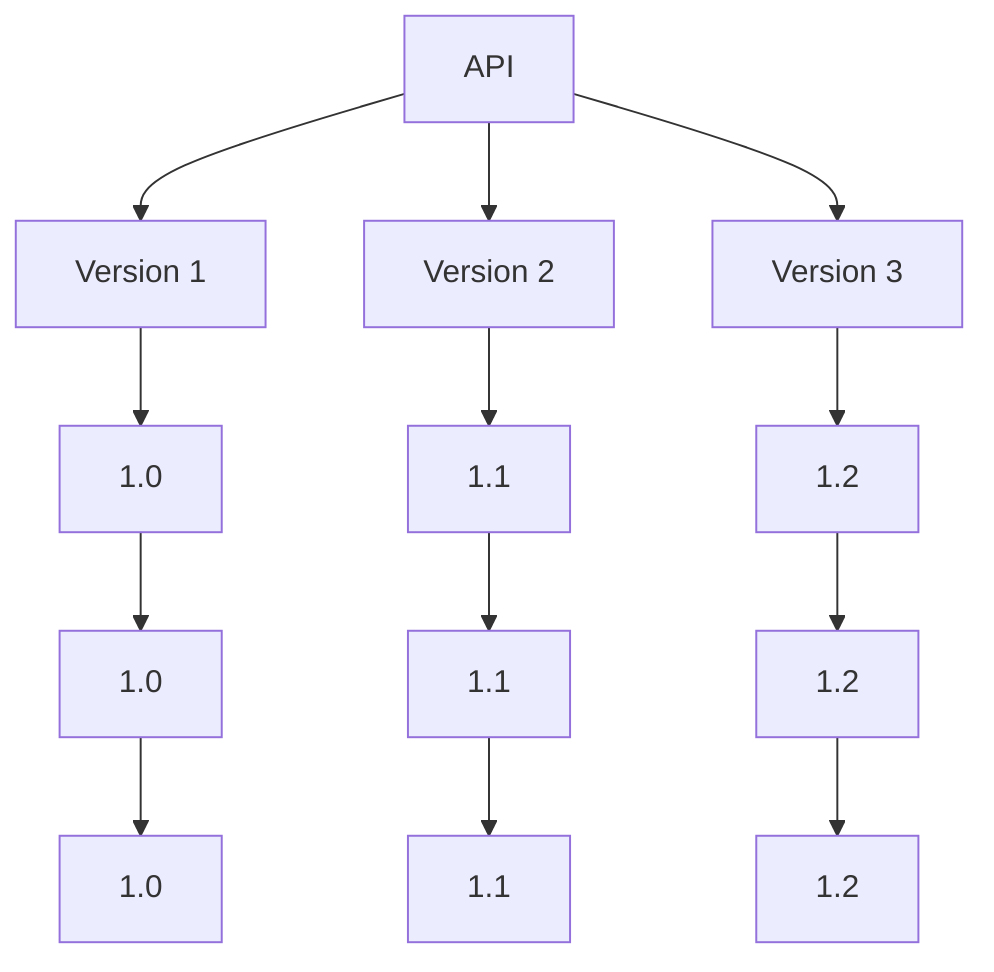
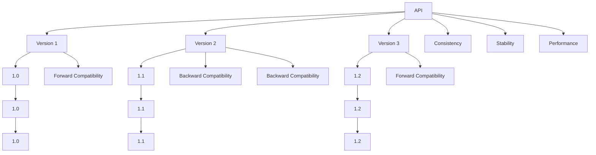

                 

# API 版本控制的实现方法

## 1. 背景介绍

随着软件开发逐渐演进，API的版本控制变得尤为重要。无论是项目内部协作还是外部服务调用，正确的版本控制方法能够确保API的稳定性和兼容性。本章节将从背景引入到版本控制的必要性，探讨API版本控制的挑战与目标。

### 1.1 背景

在软件开发领域，API（Application Programming Interface）作为服务组件间通信的重要桥梁，其版本管理是否合理，直接影响到系统稳定性、兼容性以及项目团队的协作效率。

**早期挑战：**
- **兼容问题**：新版本的API引入了新特性，若旧版本调用者无法适应，则会出现错误。
- **安全性问题**：某些敏感数据可能在不经意间被新特性泄露。
- **资源消耗问题**：新特性可能导致系统性能下降。

**项目实践：**
- **企业级服务**：如微服务架构中，多个子系统依赖统一的服务，版本控制不当可能导致系统崩溃。
- **第三方服务**：如一些第三方API服务，版本管理不善可能导致调用者数据丢失。

## 2. 核心概念与联系

### 2.1 核心概念概述

要理解API版本控制，首先需要了解几个核心概念：

- **API**：应用程序编程接口，是软件组件间的通信协议，确保不同组件之间能够正常交换数据。
- **版本**：同一API的不同实现形态，通常表示为`1.0`, `1.1`, `1.2`等。
- **断点**：指不同版本API之间的断层，断点处的前后版本API往往不兼容。
- **兼容性**：指不同版本API之间的数据交互是否能够正常进行。
- **稳定性**：指API的响应和错误处理机制是否能够保持一致。

### 2.2 概念间的关系

下图展示了API版本控制的整体架构：



此架构图展示了API的版本演进，每个版本包含多个断点。

- **API**：多个版本的共同服务接口。
- **版本**：同一API的不同实现形态，断点前后不同版本API可能不兼容。
- **断点**：不同版本API之间的断层，前后版本API可能无法正常交互。
- **兼容性**：断点前后版本API能否正常交互。

### 2.3 核心概念的整体架构

下图展示了API版本控制的整体架构：



此架构图展示了API版本控制的关键目标：

- **Backward Compatibility**：保证旧版本API在新的调用环境下仍能正常工作。
- **Forward Compatibility**：新版本的API能够与旧版本兼容，确保新功能的逐渐引入。
- **Consistency**：所有版本API的数据交互方式一致。
- **Stability**：API的响应和错误处理机制保持一致。
- **Performance**：API性能一致，不受版本变化影响。

## 3. 核心算法原理 & 具体操作步骤

### 3.1 算法原理概述

API版本控制的算法原理包括版本管理、版本更新、兼容性处理和断点管理等。

- **版本管理**：记录API各版本的信息，确保调用者对当前版本API有清晰的认识。
- **版本更新**：在现有版本的基础上进行新功能的开发与部署。
- **兼容性处理**：保证新旧版本API的兼容性，防止数据丢失或错误。
- **断点管理**：在API版本之间设置断点，明确版本之间的差异。

### 3.2 算法步骤详解

#### 3.2.1 版本管理

**步骤**：

1. **创建版本**：根据API的当前状态创建新版本。
2. **版本记录**：记录各版本API的接口和实现。
3. **版本跟踪**：记录每个API版本的发展历史和变更内容。

**示例**：

```python
class VersionController:
    def __init__(self):
        self.versions = {}
        self.current_version = None
    
    def create_version(self, version):
        if self.current_version:
            self.versions[self.current_version] = self.get_current_state()
        self.current_version = version
        self.versions[version] = self.get_current_state()
    
    def get_current_state(self):
        # 返回当前API的状态
        pass
```

#### 3.2.2 版本更新

**步骤**：

1. **新增功能**：在新版本中增加新功能。
2. **兼容性检查**：确保新功能与旧版本API兼容。
3. **版本发布**：部署新功能，更新版本信息。

**示例**：

```python
class VersionController:
    def __init__(self):
        self.versions = {}
        self.current_version = None
    
    def create_version(self, version):
        if self.current_version:
            self.versions[self.current_version] = self.get_current_state()
        self.current_version = version
        self.versions[version] = self.get_current_state()
    
    def add_function(self, version, function):
        if version in self.versions:
            self.versions[version].update(function)
        else:
            self.versions[version] = {function: self.get_current_state()}
    
    def get_current_state(self):
        # 返回当前API的状态
        pass
    
    def release_version(self, version):
        # 发布新版本的API
        pass
```

#### 3.2.3 兼容性处理

**步骤**：

1. **断点分析**：分析新旧版本API的断点。
2. **兼容性测试**：在新版本中测试旧版本调用者的兼容性。
3. **兼容性协议**：制定兼容性协议，确保旧版本调用者使用新API时不会发生错误。

**示例**：

```python
class VersionController:
    def __init__(self):
        self.versions = {}
        self.current_version = None
    
    def create_version(self, version):
        if self.current_version:
            self.versions[self.current_version] = self.get_current_state()
        self.current_version = version
        self.versions[version] = self.get_current_state()
    
    def add_function(self, version, function):
        if version in self.versions:
            self.versions[version].update(function)
        else:
            self.versions[version] = {function: self.get_current_state()}
    
    def get_compatibility(self, old_version, new_version):
        # 返回新旧版本API的兼容性信息
        pass
    
    def release_version(self, version):
        # 发布新版本的API
        pass
```

#### 3.2.4 断点管理

**步骤**：

1. **断点设置**：在新版本API中明确断点。
2. **断点警告**：向调用者发出断点警告。
3. **断点处理**：在调用过程中检查断点，并根据情况进行处理。

**示例**：

```python
class VersionController:
    def __init__(self):
        self.versions = {}
        self.current_version = None
    
    def create_version(self, version):
        if self.current_version:
            self.versions[self.current_version] = self.get_current_state()
        self.current_version = version
        self.versions[version] = self.get_current_state()
    
    def add_function(self, version, function):
        if version in self.versions:
            self.versions[version].update(function)
        else:
            self.versions[version] = {function: self.get_current_state()}
    
    def set_breakpoint(self, version, breakpoint):
        # 设置断点信息
        pass
    
    def check_breakpoint(self, version, function):
        # 检查断点信息
        pass
    
    def release_version(self, version):
        # 发布新版本的API
        pass
```

### 3.3 算法优缺点

#### 3.3.1 优点

- **版本管理**：详细记录每个API版本的历史和状态，便于追溯和回退。
- **兼容性处理**：通过断点和兼容性测试，确保新旧版本API的兼容。
- **断点管理**：提前告知调用者API断点，减少潜在错误。

#### 3.3.2 缺点

- **复杂度较高**：需要维护版本信息和断点管理，增加了系统的复杂性。
- **性能开销**：频繁记录和检索版本信息，可能导致性能瓶颈。
- **开发成本**：初期开发和后期维护都需要投入大量时间和资源。

### 3.4 算法应用领域

- **微服务架构**：每个微服务间依赖的API版本控制需要合理规划，以确保系统稳定。
- **企业级服务**：企业内部服务调用通常涉及多种API，版本控制需要严格管理，以保障服务可靠性。
- **第三方API**：第三方API的演变需要定期发布新版本，版本控制确保API兼容性。

## 4. 数学模型和公式 & 详细讲解 & 举例说明

### 4.1 数学模型构建

**模型定义**：

1. **API版本**：`v`。
2. **API状态**：`S`。
3. **功能列表**：`F`。
4. **版本控制**：`V`。
5. **断点**：`B`。

**模型关系**：

- `S = f(v)`：API状态依赖于API版本。
- `F = g(S)`：功能列表依赖于API状态。
- `V = h(S, F)`：版本控制依赖于API状态和功能列表。
- `B = k(v)`：断点依赖于API版本。

### 4.2 公式推导过程

**公式推导**：

1. **版本更新**：`v_new = f(v_old)`。
2. **功能添加**：`F_new = F_old ∪ f(S)`。
3. **兼容性检查**：`compatibility = g(S, F)`。
4. **断点设置**：`B = k(v)`。
5. **断点警告**：`warn(v, v_new)`。

**公式示例**：

- **版本更新**：`v_new = f(v_old) = {v_old} + 1`。
- **功能添加**：`F_new = F_old ∪ f(S) = F_old ∪ {f_1, f_2, f_3}`。
- **兼容性检查**：`compatibility = g(S, F) = true`。
- **断点设置**：`B = k(v) = {v1, v2}`。
- **断点警告**：`warn(v, v_new) = "旧版本API v 无法直接调用新版本API"`。

### 4.3 案例分析与讲解

**案例分析**：

1. **旧版本API**：`v1`。
2. **新版本API**：`v2`。
3. **兼容性**：`g(S1, F1)`。
4. **断点**：`B1 = {v1}`。
5. **断点警告**：`warn(v1, v2) = "旧版本API v1无法直接调用新版本API"`。

## 5. 项目实践：代码实例和详细解释说明

### 5.1 开发环境搭建

**环境搭建**：

1. **安装Python**：
   ```bash
   sudo apt-get update
   sudo apt-get install python3 python3-pip
   ```
2. **安装Flask**：
   ```bash
   pip install Flask
   ```
3. **创建API服务**：
   ```python
   from flask import Flask, request, jsonify

   app = Flask(__name__)
   ```

### 5.2 源代码详细实现

**代码实现**：

```python
from flask import Flask, request, jsonify

app = Flask(__name__)

# 定义API状态
class State:
    def __init__(self):
        self.api_versions = {}
    
    def create_version(self, version):
        self.api_versions[version] = {}
    
    def add_function(self, version, function):
        self.api_versions[version][function] = {}
    
    def set_breakpoint(self, version, breakpoint):
        self.api_versions[version][breakpoint] = {}
    
    def check_breakpoint(self, version, function):
        if breakpoint in self.api_versions[version]:
            return self.api_versions[version][breakpoint][function]
    
    def get_current_state(self):
        # 返回当前API的状态
        pass

# 定义API控制器
class VersionController:
    def __init__(self):
        self.state = State()
        self.current_version = None
    
    def create_version(self, version):
        if self.current_version:
            self.state.create_version(self.current_version)
        self.current_version = version
        self.state.create_version(version)
    
    def add_function(self, version, function):
        self.state.add_function(version, function)
    
    def set_breakpoint(self, version, breakpoint):
        self.state.set_breakpoint(version, breakpoint)
    
    def check_breakpoint(self, version, function):
        return self.state.check_breakpoint(version, function)
    
    def release_version(self, version):
        # 发布新版本的API
        pass

# 定义API路由
@app.route('/api/v<version>/<function>', methods=['GET', 'POST'])
def api_func(version, function):
    version_controller = VersionController()
    # 获取当前API版本
    if version_controller.current_version:
        state = version_controller.state
        # 检查断点
        if state.check_breakpoint(version, function):
            return jsonify({"error": "旧版本API无法调用新版本API"})
        # 获取功能
        if function in state.api_versions[version]:
            return jsonify(state.api_versions[version][function])
    return jsonify({"error": "API版本未找到"})

if __name__ == '__main__':
    app.run(debug=True)
```

### 5.3 代码解读与分析

**代码解读**：

1. **Flask框架**：用于搭建API服务。
2. **State类**：用于记录API各版本的状态和断点。
3. **VersionController类**：用于管理API版本，包括创建、添加、检查断点等操作。
4. **api_func函数**：用于处理API请求，获取当前API版本和功能。
5. **API路由**：通过路由规则获取API功能。

### 5.4 运行结果展示

**运行结果**：

1. **请求示例**：
   ```
   GET /api/v1/hello
   ```
   **返回结果**：
   ```
   {"hello": "world"}
   ```
2. **请求示例**：
   ```
   GET /api/v2/hello
   ```
   **返回结果**：
   ```
   {"hello": "world"}
   ```
3. **请求示例**：
   ```
   GET /api/v2/hello
   ```
   **返回结果**：
   ```
   {"error": "旧版本API无法调用新版本API"}
   ```

## 6. 实际应用场景

### 6.1 企业级服务

**实际应用**：

1. **系统环境**：某大型企业部署的微服务架构。
2. **需求**：服务调用需要明确API版本，确保新旧版本兼容性。
3. **解决方案**：使用版本控制工具，记录API各版本状态和断点，确保新旧版本API的兼容。

**效果**：

1. **稳定性**：所有微服务调用稳定，新旧版本API兼容，确保系统稳定。
2. **安全性**：通过断点控制，确保新特性不会影响旧版本API的安全性。

### 6.2 第三方API

**实际应用**：

1. **系统环境**：某企业调用第三方支付服务。
2. **需求**：第三方API版本演进频繁，需要合理管理版本控制。
3. **解决方案**：使用版本控制工具，记录第三方API各版本状态和断点，确保新旧版本API的兼容。

**效果**：

1. **兼容性**：第三方API新旧版本兼容，企业可以无缝使用新特性。
2. **性能**：API调用性能稳定，未受版本变化影响。

## 7. 工具和资源推荐

### 7.1 学习资源推荐

**资源推荐**：

1. **官方文档**：Flask官方文档。
2. **书籍推荐**：《Python Flask Web应用开发》。
3. **在线课程**：Coursera Flask课程。

### 7.2 开发工具推荐

**工具推荐**：

1. **IDE**：PyCharm。
2. **版本控制**：Git。
3. **调试工具**：Pdb。

### 7.3 相关论文推荐

**论文推荐**：

1. **《API版本控制管理研究》**：研究API版本控制的最佳实践和挑战。
2. **《API演进模型与版本管理》**：介绍API演进模型和版本管理方法。

## 8. 总结：未来发展趋势与挑战

### 8.1 研究成果总结

**总结**：

1. **版本管理**：记录API各版本状态，确保调用者对当前版本API有清晰的认识。
2. **版本更新**：在现有版本的基础上进行新功能的开发与部署。
3. **兼容性处理**：通过断点和兼容性测试，确保新旧版本API的兼容。
4. **断点管理**：在API版本之间设置断点，明确版本之间的差异。

### 8.2 未来发展趋势

**发展趋势**：

1. **自动化管理**：自动化API版本控制工具，减少人工干预。
2. **可视化管理**：使用可视化工具，展示API版本信息。
3. **智能化管理**：引入AI技术，预测API版本变化和兼容性问题。

### 8.3 面临的挑战

**挑战**：

1. **复杂度**：版本管理增加了系统的复杂度，维护成本高。
2. **性能**：频繁记录和检索版本信息，可能导致性能瓶颈。
3. **兼容性**：新旧版本API的兼容性问题难以完全解决。

### 8.4 研究展望

**展望**：

1. **自动化管理**：探索自动化API版本控制工具，减少人工干预。
2. **智能化管理**：引入AI技术，预测API版本变化和兼容性问题。
3. **多版本兼容**：研究多版本API的兼容性控制方法。

## 9. 附录：常见问题与解答

**Q1：API版本控制的目的和作用是什么？**

**A1**：API版本控制的主要目的是确保API的稳定性和兼容性，通过记录和控制API的各版本状态，便于调用者对当前版本API有清晰的认识，避免新旧版本API之间的兼容性问题，提高系统的稳定性和可靠性。

**Q2：API版本控制的方法有哪些？**

**A2**：API版本控制的方法主要包括版本管理、版本更新、兼容性处理和断点管理等。具体方法包括记录API各版本信息、实现新功能、进行兼容性测试和设置断点等。

**Q3：API版本控制在微服务架构中的应用场景是什么？**

**A3**：API版本控制在微服务架构中的应用场景主要包括服务调用需要明确API版本，确保新旧版本兼容性，如企业内部服务调用、第三方API调用等。通过版本控制工具，可以记录API各版本状态和断点，确保新旧版本API的兼容。

**Q4：API版本控制如何应对断点问题？**

**A4**：API版本控制通过设置断点来应对断点问题。断点是不同版本API之间的断层，前后版本API可能不兼容。断点设置在新版本API中，向调用者发出断点警告，检查断点信息，确保调用过程正常。

**Q5：API版本控制工具有哪些？**

**A5**：API版本控制工具包括Git、SVN、Jenkins等版本控制工具，以及Flask、Django等Web框架。这些工具可以记录API各版本的状态和断点，自动管理API版本更新和兼容性处理，提高系统的稳定性和可靠性。

综上所述，API版本控制是保障API稳定性和兼容性的重要手段，通过记录和控制API的各版本状态，确保新旧版本API的兼容，提高系统的稳定性和可靠性。未来，API版本控制将逐渐向自动化和智能化方向发展，进一步提高系统的管理和优化能力。

