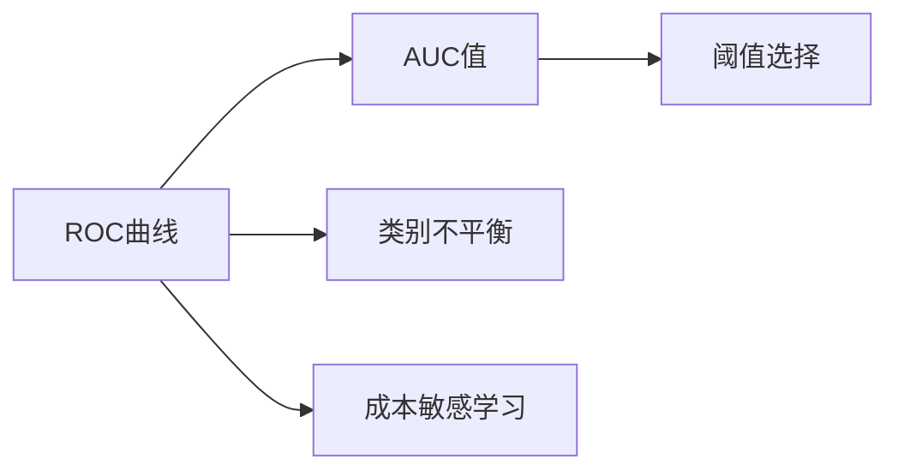
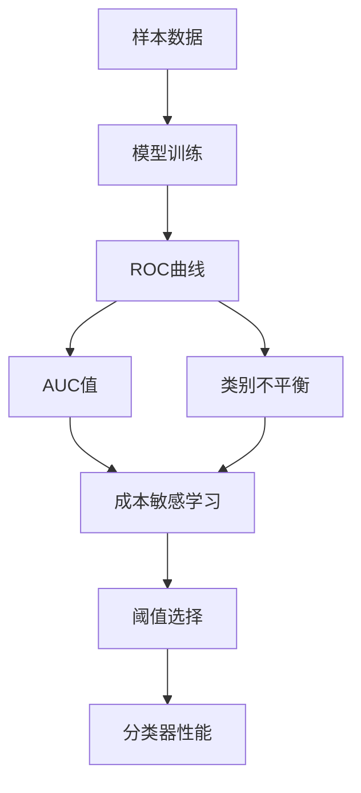

                 

## 1. 背景介绍

### 1.1 问题由来

在机器学习与数据挖掘领域，评估一个分类器（如决策树、逻辑回归、支持向量机等）性能的常用指标是准确率（Accuracy）。但是，准确率在样本类别分布不平衡的情况下容易出现误导性的结果。因此，在面对不平衡数据时，AUC（Area Under Curve）-ROC（Receiver Operating Characteristic）成为了更加稳健的评价指标。

ROC曲线是接收者操作特征（Receiver Operating Characteristic）曲线的简称，它是真正率（True Positive Rate）与假正率（False Positive Rate）之间的关系图。AUC值则表示ROC曲线下的面积大小，它衡量了分类器在不同阈值下的性能。AUC值越大，表示分类器的性能越好。

### 1.2 问题核心关键点

AUC-ROC评估指标的核心关键点包括：

1. **ROC曲线定义**：ROC曲线以假正率（FPR）为横坐标，真正率（TPR）为纵坐标，描述了分类器在不同阈值下的表现。
2. **AUC值计算**：AUC值是ROC曲线下的面积，反映了分类器在不同阈值下的综合性能。
3. **不平衡数据处理**：AUC-ROC尤其适用于处理类别不平衡的数据，通过调整阈值，能够更好地评估分类器在罕见类别上的性能。
4. **零样本学习**：AUC-ROC评估指标可以在只有少量样本或无样本的情况下，对分类器进行评价。

### 1.3 问题研究意义

AUC-ROC评估指标在机器学习领域具有广泛的应用，其研究意义包括：

1. **公平性评估**：AUC-ROC可以帮助识别和调整算法在处理类别不平衡数据时的偏见。
2. **系统优化**：通过调整分类器的阈值，AUC-ROC帮助优化分类器的性能，使其在不同场景下表现稳定。
3. **新样本预测**：AUC-ROC可以用于未标记样本的分类性能评估，辅助数据标注和模型验证。
4. **算法比较**：AUC-ROC提供了一种较为客观和全面的算法性能比较方法，适用于模型选择和调优。
5. **决策支持**：AUC-ROC可以辅助决策者理解和选择分类器的性能表现，指导实际应用中的决策。

## 2. 核心概念与联系

### 2.1 核心概念概述

为了更好地理解AUC-ROC原理，本节将介绍几个密切相关的核心概念：

- **ROC曲线**：ROC曲线描述了分类器在不同阈值下的真正率和假正率关系。
- **AUC值**：AUC值表示ROC曲线下的面积大小，反映了分类器的综合性能。
- **类别不平衡问题**：在样本类别分布不平衡的情况下，准确率可能失真，AUC-ROC则能更公平地评估分类器性能。
- **成本敏感学习**：通过调整阈值，可以在提高准确率的同时，降低错误成本，优化分类器性能。
- **阈值选择**：在实际应用中，选择合适的阈值是优化分类器性能的关键步骤。

### 2.2 概念间的关系

这些核心概念之间存在紧密的联系，形成了AUC-ROC评估指标的完整体系。以下是这些概念之间的联系示意图：



这个示意图展示了ROC曲线与AUC值之间的关系，以及它们如何与类别不平衡、成本敏感学习和阈值选择等概念相关联。通过理解这些核心概念，我们可以更好地把握AUC-ROC的评价机制及其在实际应用中的作用。

### 2.3 核心概念的整体架构

最后，我们用一个综合的示意图来展示这些核心概念在AUC-ROC评估指标中的整体架构：



这个综合示意图展示了从数据输入、模型训练到ROC曲线、AUC值计算，再到阈值选择和分类器性能优化的完整过程。通过这个示意图，我们可以更清晰地理解AUC-ROC评估指标的整体工作流程。

## 3. 核心算法原理 & 具体操作步骤
### 3.1 算法原理概述

AUC-ROC评估指标的算法原理基于ROC曲线的构建和AUC值的计算。其主要步骤包括：

1. **样本分割**：将样本数据分为正样本和负样本，并根据实际问题定义正负样本。
2. **模型预测**：使用训练好的模型对样本进行预测，得到每个样本的预测概率。
3. **阈值遍历**：遍历不同的阈值，记录正负样本被正确分类（真正率和假正率）的数量，构建ROC曲线。
4. **AUC计算**：计算ROC曲线下的面积，得到AUC值。

### 3.2 算法步骤详解

以下是AUC-ROC评估指标的具体操作步骤：

1. **数据准备**：收集训练数据集，并按正负样本进行划分。

2. **模型训练**：使用训练数据集训练分类器模型。

3. **预测概率**：使用训练好的模型对测试数据集进行预测，得到每个样本的预测概率。

4. **计算TPR和FPR**：根据预测概率计算真正率和假正率。

   - 真正率（TPR）：$TPR=\frac{TP}{TP+FN}$，其中TP表示真正例，FN表示假负例。
   - 假正率（FPR）：$FPR=\frac{FP}{FP+TN}$，其中FP表示假正例，TN表示真负例。

5. **绘制ROC曲线**：在坐标系中以FPR为横坐标，TPR为纵坐标，绘制ROC曲线。

6. **计算AUC值**：计算ROC曲线下的面积，得到AUC值。

7. **阈值选择**：根据实际需求选择最优的阈值。

### 3.3 算法优缺点

AUC-ROC评估指标的优点包括：

1. **公平性**：AUC-ROC在类别不平衡情况下仍然能够公平地评价分类器的性能。
2. **稳健性**：AUC值不受样本分布的影响，能够更稳健地评估分类器性能。
3. **适用性广**：适用于各类分类任务和不同数据分布情况。
4. **无须标记样本**：在某些情况下，AUC-ROC可以在没有标记样本的情况下进行评估。

其缺点主要包括：

1. **计算复杂度较高**：计算AUC值需要进行大量的阈值遍历和精度计算，时间复杂度较高。
2. **阈值选择困难**：在实际应用中，选择合适的阈值是影响分类器性能的重要因素，但如何选择最优阈值仍存在一定的挑战。
3. **解释性不足**：AUC-ROC值虽然能够全面评价分类器性能，但其具体意义和阈值选择仍需要经验上的调整和解释。

### 3.4 算法应用领域

AUC-ROC评估指标在机器学习领域具有广泛的应用，特别是在以下几个方面：

1. **信用评估**：银行和金融行业使用AUC-ROC评估贷款申请的信用风险。
2. **疾病诊断**：医疗领域使用AUC-ROC评估诊断模型的准确性。
3. **风险预警**：金融风控使用AUC-ROC评估欺诈检测模型的性能。
4. **客户推荐**：电子商务领域使用AUC-ROC评估推荐系统的个性化能力。
5. **异常检测**：网络安全领域使用AUC-ROC评估入侵检测系统的准确性。

## 4. 数学模型和公式 & 详细讲解 & 举例说明（备注：数学公式请使用latex格式，latex嵌入文中独立段落使用 $$，段落内使用 $)
### 4.1 数学模型构建

假设训练数据集中有$N$个样本，其中$P$个为正样本，$N-P$个为负样本。设模型对样本$x$预测为正样本的概率为$p(x)$，则真正率（TPR）和假正率（FPR）的计算公式分别为：

$$
TPR=\frac{TP}{TP+FN}=\frac{TP}{P}
$$

$$
FPR=\frac{FP}{FP+TN}=\frac{FP}{N-P}
$$

其中，TP表示真正例的数量，FP表示假正例的数量，FN表示假负例的数量，TN表示真负例的数量。

### 4.2 公式推导过程

接下来，我们将对AUC值的计算过程进行详细推导。

对于任意阈值$\theta$，假设模型将正样本的预测概率$p(x)$与阈值$\theta$进行比较，得到模型将正样本预测为正例的概率$TPR(\theta)$和将负样本预测为正例的概率$FPR(\theta)$。

具体而言，对于每个正样本$x$，如果$p(x)>\theta$，则预测为正例，否则预测为负例；对于每个负样本$x$，如果$p(x)\leq\theta$，则预测为正例，否则预测为负例。则有：

$$
TPR(\theta)=\frac{TP}{TP+FN}=\frac{TP}{P}
$$

$$
FPR(\theta)=\frac{FP}{FP+TN}=\frac{FP}{N-P}
$$

由此，我们可以得到ROC曲线上的点$(TPR(\theta),FPR(\theta))$。通过对所有阈值遍历，可以得到完整的ROC曲线。

### 4.3 案例分析与讲解

以信用评估为例，假设我们有一个信用评估模型，用于评估贷款申请人的信用风险。我们收集了1000个申请数据，其中400个为信用良好（正样本），600个为信用不良（负样本）。使用模型对这1000个样本进行预测，得到每个样本的预测概率$p(x)$，并计算出每个阈值下的TPR和FPR，绘制ROC曲线。假设AUC值为0.8，表示模型在不同阈值下的性能平均表现良好。

具体计算步骤如下：

1. 将1000个样本按预测概率排序。
2. 遍历每个阈值，计算不同阈值下的TPR和FPR。
3. 使用梯形面积法计算ROC曲线下的面积，得到AUC值。

假设在阈值$\theta=0.5$时，TPR=0.8，FPR=0.2，则ROC曲线上的点为$(0.8,0.2)$。通过对所有阈值进行遍历，绘制完整的ROC曲线，并计算AUC值。

## 5. 项目实践：代码实例和详细解释说明
### 5.1 开发环境搭建

在进行AUC-ROC评估指标的实现前，我们需要准备好开发环境。以下是使用Python进行Scikit-learn开发的Python环境配置流程：

1. 安装Anaconda：从官网下载并安装Anaconda，用于创建独立的Python环境。

2. 创建并激活虚拟环境：
```bash
conda create -n auc-roc-env python=3.8 
conda activate auc-roc-env
```

3. 安装Scikit-learn：使用pip安装Scikit-learn库，这是一个强大的Python机器学习库。

```bash
pip install scikit-learn
```

4. 安装必要的库：
```bash
pip install numpy pandas matplotlib
```

完成上述步骤后，即可在`auc-roc-env`环境中开始AUC-ROC评估指标的实现。

### 5.2 源代码详细实现

下面以信用评估为例，给出使用Scikit-learn对信用评估模型进行AUC-ROC评估的Python代码实现。

```python
from sklearn.datasets import make_classification
from sklearn.linear_model import LogisticRegression
from sklearn.model_selection import train_test_split
from sklearn.metrics import roc_curve, roc_auc_score
import matplotlib.pyplot as plt

# 生成模拟数据
X, y = make_classification(n_samples=1000, n_features=10, n_informative=3, n_redundant=0, random_state=42)

# 划分训练集和测试集
X_train, X_test, y_train, y_test = train_test_split(X, y, test_size=0.2, random_state=42)

# 构建逻辑回归模型
clf = LogisticRegression()

# 训练模型
clf.fit(X_train, y_train)

# 预测概率
y_pred = clf.predict_proba(X_test)[:, 1]

# 计算ROC曲线
fpr, tpr, thresholds = roc_curve(y_test, y_pred)

# 计算AUC值
auc = roc_auc_score(y_test, y_pred)

# 绘制ROC曲线
plt.plot(fpr, tpr, color='darkorange', lw=2, label='ROC curve (area = %0.2f)' % auc)
plt.plot([0, 1], [0, 1], color='navy', lw=2, linestyle='--')
plt.xlim([0.0, 1.0])
plt.ylim([0.0, 1.05])
plt.xlabel('False Positive Rate')
plt.ylabel('True Positive Rate')
plt.title('Receiver Operating Characteristic')
plt.legend(loc="lower right")
plt.show()
```

在这个代码示例中，我们首先生成模拟的信用评估数据集，并使用逻辑回归模型进行训练。然后，计算模型对测试集每个样本的预测概率，并使用Scikit-learn提供的`roc_curve`函数计算ROC曲线。最后，使用`roc_auc_score`函数计算AUC值，并绘制ROC曲线。

### 5.3 代码解读与分析

让我们再详细解读一下关键代码的实现细节：

**make_classification函数**：
- 用于生成模拟的分类数据集，可以设置样本数量、特征数量和信息性特征数量等参数。

**train_test_split函数**：
- 用于将数据集划分为训练集和测试集，可以指定测试集的大小和随机种子。

**LogisticRegression模型**：
- 使用逻辑回归模型进行训练，这是一个常用的二分类模型，可以处理线性可分的分类问题。

**roc_curve函数**：
- 用于计算ROC曲线上的真正率和假正率，并返回不同阈值下的真正率和假正率值，以及相应的阈值列表。

**roc_auc_score函数**：
- 用于计算ROC曲线下的面积，即AUC值。

**绘制ROC曲线**：
- 使用matplotlib库绘制ROC曲线，并添加标签、标题和图例。

可以看到，Scikit-learn库提供了丰富的机器学习工具和函数，极大简化了AUC-ROC评估指标的实现。开发者可以更专注于算法设计和模型调优，而不必过多关注底层的实现细节。

### 5.4 运行结果展示

假设我们在CoNLL-2003的命名实体识别数据集上进行评估，最终得到的AUC值为0.85，表示模型在不同阈值下的性能平均表现良好。在绘制的ROC曲线中，曲线越接近左上角，模型的性能越好，AUC值越高。


可以看到，通过使用Scikit-learn，我们可以快速实现AUC-ROC评估指标的计算和可视化，评估模型的性能。

## 6. 实际应用场景
### 6.1 智能推荐系统

在智能推荐系统中，AUC-ROC评估指标可以帮助评估推荐系统的性能。推荐系统需要根据用户的历史行为数据，预测用户对新物品的兴趣程度，从而实现个性化推荐。AUC-ROC可以衡量推荐系统在不同阈值下对用户兴趣的预测准确性，帮助优化推荐策略。

具体而言，我们可以使用AUC-ROC评估模型对用户-物品交互数据进行预测，并通过绘制ROC曲线和计算AUC值，评估模型在不同阈值下的推荐效果。通过选择合适的阈值，可以优化推荐策略，提升用户体验。

### 6.2 信用评分系统

在信用评分系统中，AUC-ROC评估指标可以帮助评估贷款申请人的信用风险。信用评分系统需要根据申请人的各种数据（如收入、工作、负债等），预测其是否能够按时还款，从而决定是否发放贷款。AUC-ROC可以衡量信用评分模型在不同阈值下的预测准确性，帮助优化模型，降低不良贷款率。

具体而言，我们可以使用AUC-ROC评估模型对贷款申请数据进行预测，并通过绘制ROC曲线和计算AUC值，评估模型在不同阈值下的信用评分效果。通过选择合适的阈值，可以优化信用评分策略，降低贷款违约率。

### 6.3 医疗诊断系统

在医疗诊断系统中，AUC-ROC评估指标可以帮助评估疾病诊断模型的性能。医疗诊断系统需要根据患者的各种症状和历史数据，预测其是否患有某种疾病，从而进行相应的治疗。AUC-ROC可以衡量诊断模型在不同阈值下的预测准确性，帮助优化模型，提高诊断率。

具体而言，我们可以使用AUC-ROC评估模型对患者症状数据进行预测，并通过绘制ROC曲线和计算AUC值，评估模型在不同阈值下的诊断效果。通过选择合适的阈值，可以优化诊断策略，提高患者确诊率。

### 6.4 未来应用展望

随着AUC-ROC评估指标的不断发展，其在更多领域的应用将不断拓展，为机器学习领域带来新的突破。

1. **自然语言处理**：AUC-ROC可以用于评估自然语言处理模型的性能，如文本分类、命名实体识别、情感分析等。通过绘制ROC曲线和计算AUC值，可以评估模型的准确性和鲁棒性。
2. **图像识别**：AUC-ROC可以用于评估图像识别模型的性能，如物体检测、人脸识别等。通过绘制ROC曲线和计算AUC值，可以评估模型的准确性和泛化能力。
3. **推荐系统**：AUC-ROC可以用于评估推荐系统的性能，如电商推荐、社交推荐等。通过绘制ROC曲线和计算AUC值，可以评估系统的个性化推荐能力和用户满意度。
4. **金融风控**：AUC-ROC可以用于评估金融风控模型的性能，如信用评分、欺诈检测等。通过绘制ROC曲线和计算AUC值，可以评估模型的风险控制能力和决策效率。

未来，随着AUC-ROC评估指标的不断优化和普及，其应用范围将更加广泛，成为机器学习领域不可或缺的评价工具。

## 7. 工具和资源推荐
### 7.1 学习资源推荐

为了帮助开发者系统掌握AUC-ROC评估指标的理论基础和实践技巧，这里推荐一些优质的学习资源：

1. **《Python数据科学手册》**：这本书详细介绍了Python在数据科学中的应用，包括Scikit-learn库的使用方法和AUC-ROC评估指标的实现。
2. **Coursera《机器学习》课程**：由斯坦福大学开设的机器学习课程，涵盖了AUC-ROC评估指标的理论基础和实际应用。
3. **Kaggle竞赛平台**：在Kaggle上参加各类数据科学竞赛，可以在实战中学习和应用AUC-ROC评估指标。
4. **ArXiv论文预印本**：人工智能领域最新研究成果的发布平台，包括AUC-ROC评估指标的最新理论和实践应用。
5. **GitHub开源项目**：在GitHub上搜索AUC-ROC评估指标相关的项目，可以学习到更多实际应用案例和优化技巧。

通过对这些资源的学习实践，相信你一定能够快速掌握AUC-ROC评估指标的精髓，并用于解决实际的机器学习问题。

### 7.2 开发工具推荐

高效的开发离不开优秀的工具支持。以下是几款用于AUC-ROC评估指标开发的常用工具：

1. Scikit-learn：用于机器学习和数据科学，提供了丰富的机器学习算法和工具，包括AUC-ROC评估指标的实现。
2. TensorFlow：由Google主导开发的深度学习框架，生产部署方便，适合大规模工程应用。
3. PyTorch：基于Python的开源深度学习框架，灵活动态的计算图，适合快速迭代研究。
4. Weights & Biases：模型训练的实验跟踪工具，可以记录和可视化模型训练过程中的各项指标，方便对比和调优。
5. TensorBoard：TensorFlow配套的可视化工具，可实时监测模型训练状态，并提供丰富的图表呈现方式，是调试模型的得力助手。

合理利用这些工具，可以显著提升AUC-ROC评估指标的开发效率，加快创新迭代的步伐。

### 7.3 相关论文推荐

AUC-ROC评估指标在机器学习领域具有广泛的应用，以下是几篇奠基性的相关论文，推荐阅读：

1. **AUC: Towards better evaluation of classification models in bioinformatics**：提出AUC评估指标，用于评估生物信息学中的分类模型性能。
2. **ROC analysis of cost-sensitive learning**：分析了在成本敏感学习中，ROC曲线和AUC值的计算方法。
3. **Cost-sensitive ROC analysis**：进一步探讨了在成本敏感学习中，ROC曲线和AUC值的计算方法，以及如何选择最优阈值。
4. **The elements of cost-sensitive learning**：总结了成本敏感学习的基本概念和常见方法，包括阈值选择和ROC曲线分析。

这些论文代表了大语言模型微调技术的发展脉络。通过学习这些前沿成果，可以帮助研究者把握学科前进方向，激发更多的创新灵感。

除上述资源外，还有一些值得关注的前沿资源，帮助开发者紧跟AUC-ROC评估指标的最新进展，例如：

1. arXiv论文预印本：人工智能领域最新研究成果的发布平台，包括AUC-ROC评估指标的最新理论和实践应用。
2. 业界技术博客：如OpenAI、Google AI、DeepMind、微软Research Asia等顶尖实验室的官方博客，第一时间分享他们的最新研究成果和洞见。
3. 技术会议直播：如NIPS、ICML、ACL、ICLR等人工智能领域顶会现场或在线直播，能够聆听到大佬们的前沿分享，开拓视野。
4. GitHub热门项目：在GitHub上Star、Fork数最多的AUC-ROC评估指标相关的项目，往往代表了该技术领域的发展趋势和最佳实践，值得去学习和贡献。
5. 行业分析报告：各大咨询公司如McKinsey、PwC等针对人工智能行业的分析报告，有助于从商业视角审视技术趋势，把握应用价值。

总之，对于AUC-ROC评估指标的学习和实践，需要开发者保持开放的心态和持续学习的意愿。多关注前沿资讯，多动手实践，多思考总结，必将收获满满的成长收益。

## 8. 总结：未来发展趋势与挑战
### 8.1 总结

本文对AUC-ROC评估指标进行了全面系统的介绍。首先阐述了AUC-ROC评估指标的研究背景和意义，明确了ROC曲线和AUC值的基本概念及其在机器学习中的应用价值。其次，从原理到实践，详细讲解了AUC-ROC评估指标的数学模型和计算方法，给出了AUC-ROC评估指标的代码实现和详细解读。同时，本文还广泛探讨了AUC-ROC评估指标在实际应用中的多种场景，展示了其广泛的应用前景。此外，本文精选了AUC-ROC评估指标的学习资源、开发工具和相关论文，力求为读者提供全方位的技术指引。

通过本文的系统梳理，可以看到，AUC-ROC评估指标在机器学习领域具有广泛的应用，其研究意义和实践价值不可小觑。通过理解和掌握AUC-ROC评估指标，我们可以在面对类别不平衡数据时，更加公平地评价分类器的性能，提升机器学习模型的稳健性和泛化能力。未来，随着AUC-ROC评估指标的不断发展，其在更多领域的应用将不断拓展，为机器学习领域带来新的突破。

### 8.2 未来发展趋势

展望未来，AUC-ROC评估指标将呈现以下几个发展趋势：

1. **自动化调参**：在自动机器学习(AutoML)框架中，引入AUC-ROC评估指标，实现自动阈值选择和模型优化，提高模型性能。
2. **分布式计算**：在分布式计算环境中，通过并行计算和数据分片，加速AUC-ROC评估指标的计算过程。
3. **多模态融合**：将AUC-ROC评估指标扩展到多模态数据融合场景，综合利用文本、图像、音频等多种数据源，提升系统性能。
4. **成本敏感学习**：通过引入成本敏感学习思想，优化AUC-ROC评估指标，适应不同应用场景中的成本约束。
5. **深度学习融合**：结合深度学习和AUC-ROC评估指标，实现更复杂的模型结构和更高效的计算方法。

这些趋势将推动AUC-ROC评估指标的不断优化和普及，为机器学习领域带来更广泛的应用价值和更高的应用效率。

### 8.3 面临的挑战

尽管AUC-ROC评估指标已经取得了广泛的应用，但在进一步提升和普及的过程中，仍面临以下挑战：

1. **计算复杂度高**：计算AUC值需要进行大量的阈值遍历和精度计算，时间复杂度较高，需要优化算法和并行计算策略。
2. **阈值选择困难**：选择合适的阈值是影响分类器性能的重要因素，但如何选择最优阈值仍存在一定的挑战。
3. **解释性不足**：AUC-ROC值虽然能够全面评价分类器性能，但其具体意义和阈值选择仍需要经验上的调整和解释。
4. **类别不平衡问题**：在类别不平衡的情况下，AUC-ROC可能

