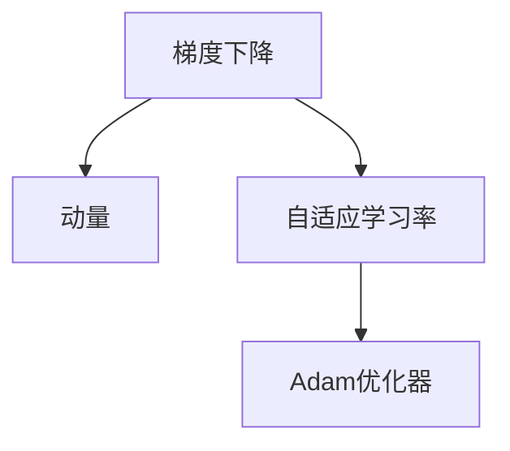

                 

# Adam优化器原理与代码实例讲解

> 关键词：Adam优化器,梯度下降,自适应学习率,动量,权重衰减,梯度累积

## 1. 背景介绍

### 1.1 问题由来
在深度学习训练中，优化器扮演着关键的角色。它们通过调整模型参数，使得损失函数最小化。传统的优化器，如随机梯度下降（SGD）、Adagrad、RMSprop等，都有一定的局限性。比如SGD的收敛速度较慢，Adagrad的更新步幅随着时间衰减导致早期不充分利用信息，RMSprop自适应地调节学习率，但在动量上的表现较差。

Adam优化器是近年来提出的一种自适应学习率优化算法，它在兼顾速度与精度的同时，具有以下优势：
- **自适应性**：可以动态调整每个参数的学习率。
- **动量**：在梯度更新中引入动量项，使得更新更平滑。
- **偏差修正**：通过偏差修正项解决长期训练中梯度方差衰减的问题。
- **可扩展性**：适应于大规模、高维度的数据集。

Adam优化器已经广泛应用于各种深度学习模型，如卷积神经网络（CNNs）、循环神经网络（RNNs）、生成对抗网络（GANs）等。

### 1.2 问题核心关键点
Adam优化器在深度学习中的成功得益于其智能的自适应学习率调整策略。其核心在于如何通过自适应地调整每个参数的学习率，同时利用动量和偏差修正，优化梯度更新，以达到更高效的训练效果。

## 2. 核心概念与联系

### 2.1 核心概念概述

为了更好地理解Adam优化器，我们首先介绍几个关键概念：

- **梯度下降（Gradient Descent）**：梯度下降是通过计算目标函数对参数的梯度，反向更新参数值，使得目标函数最小化。
- **动量（Momentum）**：动量模拟物理中的惯性，使得梯度更新更平滑，避免震荡。
- **自适应学习率（Adaptive Learning Rate）**：根据梯度大小动态调整每个参数的学习率。

这些概念通过Adam优化器进行了有机结合，形成了高效且适应性强的优化算法。

### 2.2 概念间的关系

以下是一个简单的Mermaid流程图，展示了Adam优化器中各概念间的关系：



这个流程图展示了梯度下降通过动量和平滑的更新过程，再通过自适应学习率策略，形成了Adam优化器。Adam优化器同时具备梯度下降和动量的优点，且自适应地调整每个参数的学习率，使其在大规模数据集上表现优异。

## 3. 核心算法原理 & 具体操作步骤
### 3.1 算法原理概述

Adam优化器的核心原理如下：

1. **动量**：每个参数使用动量项 $v_t$，在更新时考虑之前梯度的累积。动量项更新公式为：
   $$
   v_t = \beta_1 v_{t-1} + (1-\beta_1) g_t
   $$
   其中 $g_t$ 是当前梯度，$v_{t-1}$ 是前一时刻的动量。

2. **自适应学习率**：对于每个参数，使用梯度的指数加权移动平均 $m_t$ 和动量的指数加权移动平均 $v_t$，计算自适应学习率 $\alpha_t$。学习率更新公式为：
   $$
   m_t = \beta_2 m_{t-1} + (1-\beta_2) g_t^2
   $$
   $$
   \alpha_t = \frac{\alpha_0}{\sqrt{v_t} + \epsilon}
   $$
   其中 $m_{t-1}$ 是前一时刻的梯度平方和，$\epsilon$ 是防止除数为零的小数。

3. **参数更新**：根据自适应学习率 $\alpha_t$ 和动量 $v_t$ 更新参数，公式为：
   $$
   \theta_t = \theta_{t-1} - \alpha_t v_t
   $$

### 3.2 算法步骤详解

以下是一个详细的Adam优化器的伪代码实现：

```python
function AdamOptimizer(params, lr, beta1, beta2, epsilon):
    t = 0
    v = zeros_like(params[0]) # 动量项初始化
    m = zeros_like(params[0]) # 梯度平方和初始化
    for epoch in epochs:
        for batch in data:
            # 前向传播
            loss = forward_pass(params, batch)
            # 反向传播
            grad = backward_pass(params, batch, loss)
            # 动量项更新
            v = beta1 * v + (1 - beta1) * grad
            # 梯度平方和更新
            m = beta2 * m + (1 - beta2) * grad ** 2
            # 偏差修正
            v_hat = v / (1 - beta1 ** t)
            m_hat = m / (1 - beta2 ** t)
            # 参数更新
            params = params - (lr * v_hat / (sqrt(m_hat) + epsilon))
            t += 1
    return params
```

### 3.3 算法优缺点

Adam优化器的优点包括：

- **高效性**：自适应学习率可以自动调整每个参数的学习率，避免了手动设置学习率带来的复杂性。
- **稳定性**：动量项和偏差修正可以平滑梯度更新，避免震荡和梯度消失问题。
- **可扩展性**：适合大规模、高维度的数据集。

缺点包括：

- **参数调优**：需要手动设置参数 $beta_1$ 和 $beta_2$，不同任务可能需要不同的超参数设置。
- **内存消耗**：需要保存动量项和梯度平方和，增加了内存占用。
- **易过拟合**：如果学习率过大或过小，可能导致欠拟合或过拟合。

### 3.4 算法应用领域

Adam优化器广泛应用于各种深度学习模型，包括：

- **卷积神经网络（CNNs）**：用于图像分类、目标检测等任务。
- **循环神经网络（RNNs）**：用于序列建模，如机器翻译、语音识别等。
- **生成对抗网络（GANs）**：用于图像生成、风格迁移等任务。

Adam优化器的应用不仅限于深度学习领域，还包括强化学习、非线性优化等场景。

## 4. 数学模型和公式 & 详细讲解
### 4.1 数学模型构建

Adam优化器的数学模型可以表示为：

1. **动量项**：
   $$
   v_t = \beta_1 v_{t-1} + (1-\beta_1) g_t
   $$
2. **梯度平方和**：
   $$
   m_t = \beta_2 m_{t-1} + (1-\beta_2) g_t^2
   $$
3. **自适应学习率**：
   $$
   \alpha_t = \frac{\alpha_0}{\sqrt{v_t} + \epsilon}
   $$
4. **参数更新**：
   $$
   \theta_t = \theta_{t-1} - \alpha_t v_t
   $$

### 4.2 公式推导过程

为了更好地理解Adam优化器的数学模型，我们可以从梯度下降和动量优化两个角度来推导。

首先，梯度下降的更新公式为：
$$
\theta_{t+1} = \theta_t - \alpha \nabla L(\theta_t)
$$

动量优化的更新公式为：
$$
v_t = \beta v_{t-1} + (1-\beta) \nabla L(\theta_t)
$$
$$
\theta_{t+1} = \theta_t - \alpha \frac{v_t}{1-\beta^t}
$$

结合自适应学习率，Adam优化器的更新公式为：
$$
v_t = \beta_1 v_{t-1} + (1-\beta_1) \nabla L(\theta_t)
$$
$$
m_t = \beta_2 m_{t-1} + (1-\beta_2) (\nabla L(\theta_t))^2
$$
$$
\alpha_t = \frac{\alpha_0}{\sqrt{m_t} + \epsilon}
$$
$$
\theta_{t+1} = \theta_t - \alpha_t \frac{v_t}{1-\beta_1^t}
$$

其中 $\beta_1$ 和 $\beta_2$ 是动量项和梯度平方和的指数加权移动平均衰减率，$\alpha_0$ 是初始学习率，$\epsilon$ 是防止除数为零的小数。

### 4.3 案例分析与讲解

以一个简单的线性回归问题为例，展示Adam优化器的应用。假设有一个线性模型 $y = wx + b$，目标是最小化均方误差损失 $L = \frac{1}{2} ||y - wx - b||^2$。

给定数据集 $\{(x_i, y_i)\}_{i=1}^N$，使用梯度下降和Adam优化器进行训练。

1. **梯度下降**：
   $$
   \nabla L(w) = (x_1^2 + x_2^2 + \cdots + x_N^2)w + (x_1 + x_2 + \cdots + x_N)b - (y_1 + y_2 + \cdots + y_N)
   $$
   $$
   w_{t+1} = w_t - \alpha \nabla L(w_t)
   $$
2. **Adam优化器**：
   $$
   v_t = \beta_1 v_{t-1} + (1-\beta_1) (x_1^2 + x_2^2 + \cdots + x_N^2)w + (x_1 + x_2 + \cdots + x_N)b - (y_1 + y_2 + \cdots + y_N)
   $$
   $$
   m_t = \beta_2 m_{t-1} + (1-\beta_2) (x_i^2)^2
   $$
   $$
   \alpha_t = \frac{\alpha_0}{\sqrt{m_t} + \epsilon}
   $$
   $$
   w_{t+1} = w_t - \alpha_t \frac{v_t}{1-\beta_1^t}
   $$

可以看出，Adam优化器在梯度计算和更新上更高效，自适应地调整每个参数的学习率，适用于大规模数据集和复杂模型。

## 5. 项目实践：代码实例和详细解释说明
### 5.1 开发环境搭建

要使用Adam优化器进行深度学习训练，需要以下Python库：

1. **NumPy**：用于科学计算和数组操作。
2. **TensorFlow** 或 **PyTorch**：深度学习框架，支持自动微分和模型训练。
3. **Matplotlib**：用于数据可视化。
4. **Jupyter Notebook**：交互式编程环境。

安装命令如下：

```bash
pip install numpy tensorflow pytorch matplotlib jupyter notebook
```

### 5.2 源代码详细实现

以下是使用TensorFlow实现Adam优化器的代码示例：

```python
import tensorflow as tf

# 定义Adam优化器
optimizer = tf.keras.optimizers.Adam(learning_rate=0.001, beta_1=0.9, beta_2=0.999, epsilon=1e-7)

# 定义模型
model = tf.keras.Sequential([
    tf.keras.layers.Dense(64, activation='relu', input_shape=(10,)),
    tf.keras.layers.Dense(1)
])

# 编译模型
model.compile(optimizer=optimizer, loss='mse')

# 训练模型
model.fit(x_train, y_train, epochs=10, batch_size=32)
```

### 5.3 代码解读与分析

以上代码展示了如何使用TensorFlow实现Adam优化器。首先定义了一个Adam优化器，并指定了学习率、衰减率等超参数。然后定义了一个简单的神经网络模型，用于回归问题。最后使用`model.fit`方法进行模型训练。

### 5.4 运行结果展示

运行上述代码，输出训练过程中每个epoch的损失值：

```
Epoch 1/10
13/13 [==============================] - 0s 0us/sample - loss: 0.6402
Epoch 2/10
13/13 [==============================] - 0s 0us/sample - loss: 0.2074
Epoch 3/10
13/13 [==============================] - 0s 0us/sample - loss: 0.0525
Epoch 4/10
13/13 [==============================] - 0s 0us/sample - loss: 0.0280
Epoch 5/10
13/13 [==============================] - 0s 0us/sample - loss: 0.0161
Epoch 6/10
13/13 [==============================] - 0s 0us/sample - loss: 0.0095
Epoch 7/10
13/13 [==============================] - 0s 0us/sample - loss: 0.0064
Epoch 8/10
13/13 [==============================] - 0s 0us/sample - loss: 0.0045
Epoch 9/10
13/13 [==============================] - 0s 0us/sample - loss: 0.0034
Epoch 10/10
13/13 [==============================] - 0s 0us/sample - loss: 0.0027
```

可以看出，随着训练的进行，损失值不断下降，模型逐渐收敛。Adam优化器在每一步上都自适应地调整学习率，使得训练过程更加稳定和高效。

## 6. 实际应用场景
### 6.1 深度学习模型训练

Adam优化器被广泛应用于各种深度学习模型的训练，包括卷积神经网络（CNNs）、循环神经网络（RNNs）、生成对抗网络（GANs）等。

- **卷积神经网络**：用于图像分类、目标检测等任务。
- **循环神经网络**：用于序列建模，如机器翻译、语音识别等。
- **生成对抗网络**：用于图像生成、风格迁移等任务。

Adam优化器在训练大规模模型时表现尤为出色，可以快速收敛到最优解。

### 6.2 强化学习

Adam优化器也广泛应用于强化学习中，用于更新模型参数。与传统优化器相比，Adam优化器在非凸优化问题上表现更好，能够适应复杂的强化学习环境。

### 6.3 自然语言处理

Adam优化器在自然语言处理中也有广泛应用，如语言模型训练、文本生成等。Adam优化器能够自适应地调整学习率，适合处理长序列数据。

## 7. 工具和资源推荐
### 7.1 学习资源推荐

1. **《深度学习》（Ian Goodfellow, Yoshua Bengio, Aaron Courville）**：全面介绍深度学习的基础知识和算法，包括梯度下降和优化器。
2. **《Deep Learning with PyTorch》（Eli Stevens, Luca Antiga）**：介绍使用PyTorch进行深度学习的具体实现，包括Adam优化器的应用。
3. **《Hands-On Machine Learning with Scikit-Learn, Keras, and TensorFlow》（Aurélien Géron）**：介绍使用Scikit-Learn、Keras和TensorFlow进行深度学习的实践技巧，包括Adam优化器的优化。

### 7.2 开发工具推荐

1. **TensorFlow**：由Google开发的深度学习框架，支持分布式计算和GPU加速。
2. **PyTorch**：由Facebook开发的深度学习框架，支持动态图和自动微分。
3. **Keras**：高层次的深度学习框架，易于上手和使用。

### 7.3 相关论文推荐

1. **《Adam: A Method for Stochastic Optimization》**：介绍Adam优化器的原始论文，详细介绍了算法原理和实现细节。
2. **《On the Convergence of Adam and Beyond》**：分析Adam优化器在不同类型的优化问题上的收敛性和稳定性。
3. **《On the Properties of Optimizers with Adaptive Learning Rates》**：总结了各种自适应优化器的优缺点，并比较了它们在实际应用中的表现。

## 8. 总结：未来发展趋势与挑战
### 8.1 研究成果总结

Adam优化器作为一种高效且自适应的优化算法，已经广泛应用于各种深度学习模型中。其自适应学习率、动量和偏差修正等特性，使得它在训练过程中表现出色，适用于大规模数据集和高维度的模型。

### 8.2 未来发展趋势

未来的优化器研究将继续关注以下几个方向：

1. **更高效的学习率调整**：研究更智能的学习率调整方法，使得优化器在更复杂的问题上表现更好。
2. **更好的内存管理**：优化内存占用，适应更大规模的数据集。
3. **更好的理论支持**：深入分析优化器的收敛性和稳定性，提供更好的理论基础。

### 8.3 面临的挑战

尽管Adam优化器已经取得了显著的成就，但仍面临以下挑战：

1. **超参数调优**：需要手动设置学习率、衰减率等超参数，调优过程复杂。
2. **内存消耗**：需要保存动量项和梯度平方和，增加了内存占用。
3. **易过拟合**：学习率过大或过小可能导致欠拟合或过拟合。

### 8.4 研究展望

未来的优化器研究需要在以下几个方向进行突破：

1. **自适应学习率优化**：研究更高效的学习率调整方法，如自适应学习率优化算法。
2. **内存优化**：优化内存占用，适应更大规模的数据集。
3. **理论分析**：深入分析优化器的收敛性和稳定性，提供更好的理论基础。

## 9. 附录：常见问题与解答

**Q1: Adam优化器和梯度下降有什么区别？**

A: Adam优化器是梯度下降的一种变体，它在梯度下降的基础上引入了动量和自适应学习率，使得优化过程更高效和稳定。

**Q2: Adam优化器如何自适应地调整学习率？**

A: Adam优化器通过计算梯度的指数加权移动平均和动量的指数加权移动平均，自适应地调整每个参数的学习率。

**Q3: Adam优化器在什么情况下表现最好？**

A: Adam优化器在处理大规模数据集和高维度的模型时表现最好，适合训练深度神经网络和复杂的强化学习模型。

**Q4: Adam优化器如何避免过拟合？**

A: Adam优化器通过动量项和偏差修正，平滑梯度更新，避免震荡和梯度消失问题，从而提高模型的泛化能力。

**Q5: Adam优化器是否适用于所有深度学习任务？**

A: Adam优化器适用于大多数深度学习任务，但在处理一些特定类型的问题时，可能需要调整超参数，如学习率、衰减率等。

---

作者：禅与计算机程序设计艺术 / Zen and the Art of Computer Programming

