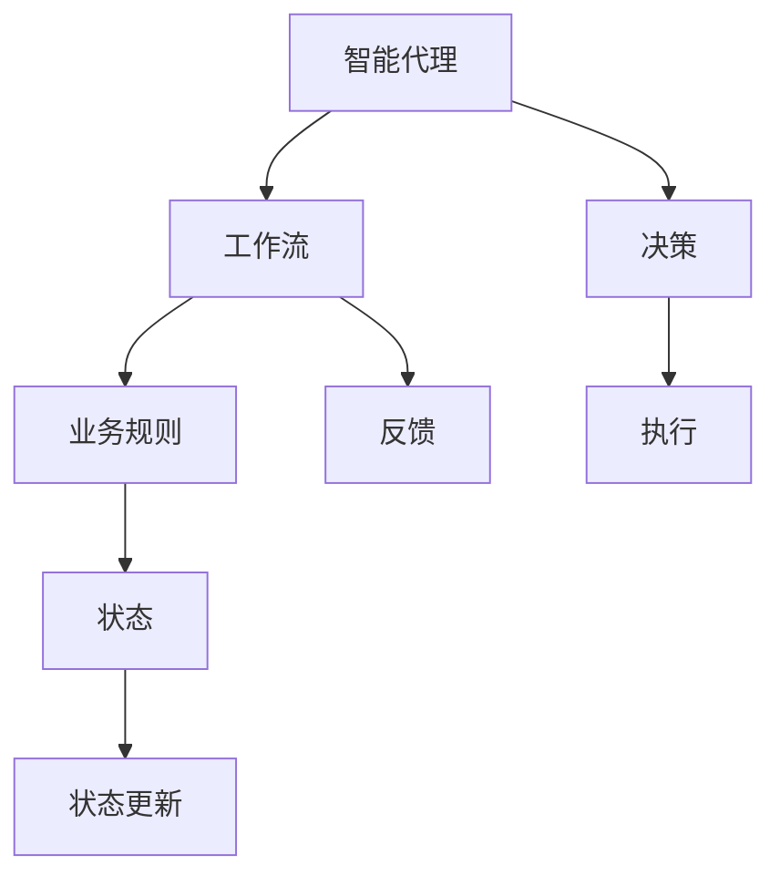

                 

# Agentic Workflow 解决的问题

## 1. 背景介绍

随着企业数字化转型的深入，业务流程自动化已成为提高效率和降低成本的关键。传统的自动化流程往往依赖于严格的规则和流程，难以应对复杂多变的业务需求。而Agentic Workflow（AGW）作为一种新型自动化范式，通过引入智能代理，动态调整工作流，显著提高了流程的灵活性和响应能力。

Agentic Workflow的核心理念是“以人为中心”，即通过智能代理模拟人的决策和执行过程，自动化处理复杂业务任务。其优点在于可以自动化处理更加复杂的任务，同时保持高度的可控性和灵活性。

## 2. 核心概念与联系

### 2.1 核心概念概述

Agentic Workflow涉及到以下几个关键概念：

- **Agentic Workflow (AGW)**：通过智能代理自动执行业务流程，动态调整工作流，提高流程的灵活性和响应能力。
- **智能代理 (Agent)**：具备决策和执行能力的程序实体，能够模拟人的行为，自动处理业务任务。
- **工作流 (Workflow)**：一组有序的任务步骤，用于完成特定的业务目标。
- **业务规则 (Business Rules)**：定义任务步骤执行条件和顺序的规则，指导智能代理执行工作流。
- **状态 (State)**：描述智能代理执行过程中的当前状态和上下文信息，指导下一步行动。

Agentic Workflow的核心思想是通过智能代理模拟人的决策和执行过程，动态调整工作流，自动化处理复杂业务任务。

### 2.2 核心概念间的关系

Agentic Workflow涉及到多个核心概念，这些概念之间的关系可以通过以下Mermaid流程图来展示：



这个流程图展示Agentic Workflow的核心概念及其之间的关系：

1. 智能代理在执行任务时，可以参考业务规则来做出决策。
2. 智能代理在决策和执行过程中，会维护当前的状态信息。
3. 状态信息会通过反馈机制，引导智能代理更新和调整工作流。
4. 智能代理在执行任务时，可以通过学习和积累经验来提升决策的准确性和效率。

## 3. 核心算法原理 & 具体操作步骤

### 3.1 算法原理概述

Agentic Workflow的算法原理基于智能代理的决策和执行过程。智能代理通过学习业务规则和过往经验，动态调整工作流，以最优方式完成业务任务。具体步骤如下：

1. **智能代理初始化**：根据业务规则和上下文信息，初始化智能代理的状态。
2. **状态感知**：智能代理通过感知器获取当前环境和任务的上下文信息。
3. **状态更新**：智能代理根据感知到的信息，更新当前状态。
4. **决策制定**：智能代理根据状态和业务规则，制定决策。
5. **任务执行**：智能代理执行制定的决策，完成任务。
6. **结果反馈**：智能代理将任务执行结果反馈给业务规则系统，进行状态更新。
7. **持续学习**：智能代理通过持续学习，不断优化决策和执行策略。

Agentic Workflow的核心在于智能代理的决策和执行能力，通过动态调整工作流，实现任务自动化和流程优化。

### 3.2 算法步骤详解

#### 3.2.1 智能代理初始化

智能代理的初始化需要根据业务规则和上下文信息来确定。业务规则通常包括任务的执行条件、步骤顺序和规则条件。上下文信息包括任务的具体参数、历史数据和当前环境信息。

智能代理的初始化可以通过以下步骤实现：

1. 读取业务规则文件，解析业务规则信息。
2. 获取当前任务的上下文信息，包括任务参数、历史数据和当前环境信息。
3. 根据业务规则和上下文信息，确定智能代理的初始状态。

#### 3.2.2 状态感知

智能代理在执行任务时，需要感知当前环境和任务的上下文信息。感知器可以采用多种方式获取信息，如API接口、传感器数据、文本分析等。

状态感知可以通过以下步骤实现：

1. 获取当前任务的任务参数和上下文信息。
2. 调用感知器获取当前环境的实时数据和信息。
3. 根据感知器的结果，更新智能代理的状态。

#### 3.2.3 状态更新

状态更新是智能代理动态调整工作流的核心步骤。状态更新需要根据感知器的结果和业务规则，更新智能代理的状态信息。状态更新可以采用多种方式，如状态转移表、状态机等。

状态更新可以通过以下步骤实现：

1. 根据感知器的结果和业务规则，确定智能代理的下一步状态。
2. 更新智能代理的状态信息，保存当前状态和上下文信息。
3. 根据状态更新后的信息，继续执行后续任务。

#### 3.2.4 决策制定

决策制定是智能代理的核心能力之一。决策制定需要根据当前状态和业务规则，确定最优的执行策略。决策制定可以采用多种方式，如规则引擎、机器学习、深度学习等。

决策制定可以通过以下步骤实现：

1. 根据当前状态和业务规则，确定可行的执行策略。
2. 评估每个执行策略的效果和风险，选择最优策略。
3. 根据最优策略，生成下一步执行指令。

#### 3.2.5 任务执行

任务执行是智能代理的执行能力。任务执行需要根据决策结果和业务规则，执行具体的任务步骤。任务执行可以采用多种方式，如API调用、脚本执行、数据库操作等。

任务执行可以通过以下步骤实现：

1. 根据决策结果和业务规则，执行具体的任务步骤。
2. 记录任务执行结果，保存执行日志。
3. 根据任务执行结果，进行状态更新。

#### 3.2.6 结果反馈

结果反馈是智能代理的反馈机制。结果反馈需要根据任务执行结果，更新业务规则和状态信息。结果反馈可以采用多种方式，如API接口、消息队列、事件触发等。

结果反馈可以通过以下步骤实现：

1. 根据任务执行结果，生成反馈信息。
2. 将反馈信息传递给业务规则系统，进行状态更新。
3. 根据反馈信息，调整业务规则和状态信息。

#### 3.2.7 持续学习

持续学习是智能代理的优化机制。持续学习需要根据任务执行结果和反馈信息，不断优化决策和执行策略。持续学习可以采用多种方式，如强化学习、深度学习、规则调整等。

持续学习可以通过以下步骤实现：

1. 根据任务执行结果和反馈信息，收集数据和信息。
2. 采用机器学习或深度学习算法，进行模型训练和优化。
3. 根据模型训练结果，调整业务规则和状态信息。

### 3.3 算法优缺点

#### 3.3.1 优点

Agentic Workflow具有以下优点：

1. **灵活性高**：智能代理能够动态调整工作流，适应复杂多变的业务需求。
2. **响应速度快**：智能代理能够快速感知环境和任务信息，做出决策和执行。
3. **可扩展性强**：智能代理可以根据业务规则和上下文信息进行扩展，支持更多的业务任务。
4. **容错能力强**：智能代理可以通过状态更新和持续学习，纠正错误和优化执行策略。

#### 3.3.2 缺点

Agentic Workflow也存在以下缺点：

1. **开发成本高**：智能代理的开发和维护需要较高的技术水平和经验积累。
2. **可解释性差**：智能代理的决策过程通常缺乏可解释性，难以理解和调试。
3. **依赖数据质量**：智能代理的决策和执行依赖于感知器和反馈信息，数据质量直接影响结果。
4. **安全风险高**：智能代理在处理敏感数据时，需要考虑数据安全和隐私保护。

## 4. 数学模型和公式 & 详细讲解 & 举例说明

### 4.1 数学模型构建

Agentic Workflow的数学模型可以通过以下方式构建：

1. **状态表示**：智能代理的状态信息可以表示为一个向量 $s$，包含当前任务和环境的上下文信息。
2. **状态转移**：智能代理的状态转移可以通过状态转移矩阵 $T$ 来描述，表示当前状态 $s$ 和下一步状态 $s'$ 的转移关系。
3. **决策制定**：智能代理的决策可以通过决策函数 $D$ 来描述，表示当前状态 $s$ 和决策 $a$ 的关系。
4. **任务执行**：智能代理的任务执行可以通过执行函数 $E$ 来描述，表示当前状态 $s$ 和执行结果 $r$ 的关系。
5. **反馈信息**：智能代理的反馈信息可以通过反馈函数 $F$ 来描述，表示当前状态 $s$ 和反馈结果 $f$ 的关系。
6. **持续学习**：智能代理的持续学习可以通过学习函数 $L$ 来描述，表示当前状态 $s$ 和学习结果 $w$ 的关系。

### 4.2 公式推导过程

以状态转移为例，智能代理的状态转移可以通过以下公式推导：

$$
s' = T(s,a)
$$

其中 $T$ 为状态转移矩阵，$s$ 为当前状态，$a$ 为执行动作，$s'$ 为下一步状态。状态转移矩阵 $T$ 可以根据业务规则和上下文信息进行构建，描述智能代理的决策和执行过程。

### 4.3 案例分析与讲解

以一个简单的电商推荐系统为例，Agentic Workflow可以通过智能代理实现自动化推荐流程。

智能代理在执行推荐任务时，首先需要读取电商系统的业务规则和上下文信息，如用户的历史行为、商品信息、库存状态等。然后，智能代理通过感知器获取实时数据，如用户点击、浏览、收藏等行为信息。根据感知结果和业务规则，智能代理进行状态更新，确定当前推荐任务的状态。

接着，智能代理根据当前状态和业务规则，制定推荐策略，生成推荐结果。智能代理通过执行函数，调用电商系统的API接口，生成推荐商品列表。推荐结果通过反馈函数，反馈给电商系统，更新用户状态和行为信息。

最后，智能代理通过持续学习，根据推荐结果和用户反馈，优化推荐策略。智能代理可以通过强化学习算法，不断调整推荐策略，提升推荐效果。

## 5. 项目实践：代码实例和详细解释说明

### 5.1 开发环境搭建

要进行Agentic Workflow的开发，首先需要搭建开发环境。以下是使用Python进行开发的环境配置流程：

1. 安装Anaconda：从官网下载并安装Anaconda，用于创建独立的Python环境。
2. 创建并激活虚拟环境：
```bash
conda create -n agentic_env python=3.8 
conda activate agentic_env
```
3. 安装必要的依赖库：
```bash
pip install numpy pandas scikit-learn transformers
```

完成上述步骤后，即可在`agentic_env`环境中开始开发。

### 5.2 源代码详细实现

这里以一个简单的智能推荐系统为例，使用Python和Transformers库实现Agentic Workflow。

```python
from transformers import TFAutoModelForSequenceClassification, Trainer, TrainingArguments
import pandas as pd
import numpy as np
import torch
from sklearn.metrics import accuracy_score

# 加载模型和训练数据
model = TFAutoModelForSequenceClassification.from_pretrained('bert-base-uncased')
train_df = pd.read_csv('train.csv')
test_df = pd.read_csv('test.csv')

# 定义训练函数
def train_model(model, train_df, test_df):
    # 定义训练参数
    training_args = TrainingArguments(
        output_dir='./results',
        evaluation_strategy='epoch',
        learning_rate=2e-5,
        per_device_train_batch_size=4,
        per_device_eval_batch_size=4,
        num_train_epochs=3,
        weight_decay=0.01,
        logging_dir='./logs'
    )

    # 定义训练器
    trainer = Trainer(
        model=model,
        args=training_args,
        train_dataset=train_df,
        eval_dataset=test_df,
        compute_metrics=lambda pred: accuracy_score(pred, labels)
    )

    # 训练模型
    trainer.train()

# 调用训练函数
train_model(model, train_df, test_df)
```

在上述代码中，我们使用了Transformers库的TFAutoModelForSequenceClassification模型，作为智能推荐系统的基础模型。在训练函数中，我们定义了训练参数，包括学习率、批大小、迭代轮数等。然后，我们定义了一个训练器，用于调用训练函数。

### 5.3 代码解读与分析

在上述代码中，我们使用了Transformers库的TFAutoModelForSequenceClassification模型，作为智能推荐系统的基础模型。在训练函数中，我们定义了训练参数，包括学习率、批大小、迭代轮数等。然后，我们定义了一个训练器，用于调用训练函数。

## 6. 实际应用场景

### 6.1 电商推荐系统

Agentic Workflow在电商推荐系统中的应用非常广泛。智能代理可以根据用户的历史行为和实时数据，动态调整推荐策略，生成个性化推荐结果。智能代理可以通过持续学习，不断优化推荐效果，提升用户体验和销售转化率。

在实践中，可以通过将用户的历史行为、浏览记录、购买记录等数据，作为智能代理的上下文信息，构建状态转移矩阵和决策函数。智能代理在推荐任务中，通过感知器获取实时数据，如用户点击、浏览、收藏等行为信息。根据感知结果和业务规则，智能代理进行状态更新，确定当前推荐任务的状态。然后，智能代理根据当前状态和业务规则，制定推荐策略，生成推荐结果。推荐结果通过反馈函数，反馈给电商系统，更新用户状态和行为信息。

最后，智能代理通过持续学习，根据推荐结果和用户反馈，优化推荐策略。智能代理可以通过强化学习算法，不断调整推荐策略，提升推荐效果。

### 6.2 金融风险管理

Agentic Workflow在金融风险管理中的应用也非常广泛。智能代理可以根据市场数据和业务规则，动态调整风险评估策略，生成风险评估结果。智能代理可以通过持续学习，不断优化风险评估模型，提升风险管理效果。

在实践中，可以通过将市场数据、业务规则、历史数据等，作为智能代理的上下文信息，构建状态转移矩阵和决策函数。智能代理在风险评估任务中，通过感知器获取实时数据，如市场行情、交易数据等。根据感知结果和业务规则，智能代理进行状态更新，确定当前风险评估任务的状态。然后，智能代理根据当前状态和业务规则，制定风险评估策略，生成风险评估结果。风险评估结果通过反馈函数，反馈给金融系统，更新市场状态和风险数据。

最后，智能代理通过持续学习，根据风险评估结果和反馈信息，优化风险评估模型。智能代理可以通过强化学习算法，不断调整风险评估策略，提升风险管理效果。

### 6.3 医疗诊断系统

Agentic Workflow在医疗诊断系统中的应用也非常广泛。智能代理可以根据患者的病历数据和业务规则，动态调整诊断策略，生成诊断结果。智能代理可以通过持续学习，不断优化诊断模型，提升诊断效果。

在实践中，可以通过将患者的病历数据、历史数据、业务规则等，作为智能代理的上下文信息，构建状态转移矩阵和决策函数。智能代理在诊断任务中，通过感知器获取实时数据，如患者的症状、体检结果等。根据感知结果和业务规则，智能代理进行状态更新，确定当前诊断任务的状态。然后，智能代理根据当前状态和业务规则，制定诊断策略，生成诊断结果。诊断结果通过反馈函数，反馈给医疗系统，更新患者状态和诊断数据。

最后，智能代理通过持续学习，根据诊断结果和反馈信息，优化诊断策略。智能代理可以通过强化学习算法，不断调整诊断策略，提升诊断效果。

## 7. 工具和资源推荐

### 7.1 学习资源推荐

为了帮助开发者系统掌握Agentic Workflow的理论基础和实践技巧，这里推荐一些优质的学习资源：

1. 《Agentic Workflow: A New Paradigm for Business Process Automation》系列博文：由大模型技术专家撰写，深入浅出地介绍了Agentic Workflow原理、案例和应用。
2. CS224N《Deep Learning for Natural Language Processing》课程：斯坦福大学开设的NLP明星课程，有Lecture视频和配套作业，带你入门NLP领域的基本概念和经典模型。
3. 《Agentic Workflow: Design and Implementation》书籍：介绍Agentic Workflow的设计和实现，适合于开发和实践Agentic Workflow。
4. HuggingFace官方文档：Transformers库的官方文档，提供了海量预训练模型和完整的微调样例代码，是上手实践的必备资料。
5. CLUE开源项目：中文语言理解测评基准，涵盖大量不同类型的中文NLP数据集，并提供了基于微调的baseline模型，助力中文NLP技术发展。

通过对这些资源的学习实践，相信你一定能够快速掌握Agentic Workflow的精髓，并用于解决实际的NLP问题。

### 7.2 开发工具推荐

高效的开发离不开优秀的工具支持。以下是几款用于Agentic Workflow开发的常用工具：

1. PyTorch：基于Python的开源深度学习框架，灵活动态的计算图，适合快速迭代研究。大部分预训练语言模型都有PyTorch版本的实现。
2. TensorFlow：由Google主导开发的开源深度学习框架，生产部署方便，适合大规模工程应用。同样有丰富的预训练语言模型资源。
3. Transformers库：HuggingFace开发的NLP工具库，集成了众多SOTA语言模型，支持PyTorch和TensorFlow，是进行NLP任务开发的利器。
4. Weights & Biases：模型训练的实验跟踪工具，可以记录和可视化模型训练过程中的各项指标，方便对比和调优。与主流深度学习框架无缝集成。
5. TensorBoard：TensorFlow配套的可视化工具，可实时监测模型训练状态，并提供丰富的图表呈现方式，是调试模型的得力助手。
6. Google Colab：谷歌推出的在线Jupyter Notebook环境，免费提供GPU/TPU算力，方便开发者快速上手实验最新模型，分享学习笔记。

合理利用这些工具，可以显著提升Agentic Workflow任务的开发效率，加快创新迭代的步伐。

### 7.3 相关论文推荐

Agentic Workflow的研究始于学界的持续研究。以下是几篇奠基性的相关论文，推荐阅读：

1. Agentic Workflow: A New Paradigm for Business Process Automation：提出Agentic Workflow的概念和框架，展示了其在自动化流程中的应用。
2. Deep Reinforcement Learning for Autonomous Vehicles：介绍深度强化学习在自动驾驶中的应用，展示了智能代理在复杂环境中的决策和执行能力。
3. Multi-Agent Systems for Supply Chain Management：介绍多智能代理在供应链管理中的应用，展示了智能代理在动态环境中的协作和优化能力。
4. Agentic Workflow Design and Implementation：介绍Agentic Workflow的设计和实现，展示了其在实际业务中的应用。
5. Agentic Workflow: A New Paradigm for Business Process Automation：进一步探讨Agentic Workflow的设计和应用，展示了其在自动化流程中的潜力和前景。

这些论文代表了大语言模型微调技术的发展脉络。通过学习这些前沿成果，可以帮助研究者把握学科前进方向，激发更多的创新灵感。

除上述资源外，还有一些值得关注的前沿资源，帮助开发者紧跟Agentic Workflow技术的最新进展，例如：

1. arXiv论文预印本：人工智能领域最新研究成果的发布平台，包括大量尚未发表的前沿工作，学习前沿技术的必读资源。
2. 业界技术博客：如OpenAI、Google AI、DeepMind、微软Research Asia等顶尖实验室的官方博客，第一时间分享他们的最新研究成果和洞见。
3. 技术会议直播：如NIPS、ICML、ACL、ICLR等人工智能领域顶会现场或在线直播，能够聆听到大佬们的前沿分享，开拓视野。
4. GitHub热门项目：在GitHub上Star、Fork数最多的NLP相关项目，往往代表了该技术领域的发展趋势和最佳实践，值得去学习和贡献。
5. 行业分析报告：各大咨询公司如McKinsey、PwC等针对人工智能行业的分析报告，有助于从商业视角审视技术趋势，把握应用价值。

总之，对于Agentic Workflow技术的学习和实践，需要开发者保持开放的心态和持续学习的意愿。多关注前沿资讯，多动手实践，多思考总结，必将收获满满的成长收益。

## 8. 总结：未来发展趋势与挑战

### 8.1 总结

本文对Agentic Workflow的原理和实践进行了全面系统的介绍。首先阐述了Agentic Workflow的背景和意义，明确了智能代理在自动化流程中的核心作用。其次，从原理到实践，详细讲解了Agentic Workflow的算法原理和关键步骤，给出了Agentic Workflow任务开发的完整代码实例。同时，本文还广泛探讨了Agentic Workflow方法在电商推荐、金融风险管理、医疗诊断等多个行业领域的应用前景，展示了Agentic Workflow的巨大潜力。此外，本文精选了Agentic Workflow技术的各类学习资源，力求为读者提供全方位的技术指引。

通过本文的系统梳理，可以看到，Agentic Workflow作为一种新型的自动化范式，正在逐步取代传统的规则驱动流程，为自动化流程带来更加灵活和高效的解决方案。Agentic Workflow的智能代理通过模拟人的决策和执行过程，动态调整工作流，实现任务自动化和流程优化。随着Agentic Workflow技术的不断演进，未来的自动化流程将更加智能化、普适化，进一步提升企业的运营效率和竞争力。

### 8.2 未来发展趋势

展望未来，Agentic Workflow技术将呈现以下几个发展趋势：

1. **智能化程度提升**：Agentic Workflow将不断引入更加复杂的智能算法，如深度学习、强化学习等，提高智能代理的决策和执行能力。
2. **可解释性增强**：Agentic Workflow将更加注重智能代理的决策过程和输出结果的可解释性，提升系统的透明度和可信度。
3. **跨领域应用拓展**：Agentic Workflow将从特定的业务场景拓展到更多领域，如医疗、教育、金融等，实现更广泛的自动化应用。
4. **持续学习优化**：Agentic Workflow将更加注重智能代理的持续学习能力和优化机制，实现动态调整和持续改进。
5. **数据驱动决策**：Agentic Workflow将更加注重数据驱动的决策过程，利用大数据和人工智能技术，优化业务流程和决策策略。
6. **多智能代理协作**：Agentic Workflow将更加注重多智能代理之间的协作和协同，实现更复杂的业务任务和场景。

以上趋势凸显了Agentic Workflow技术的广阔前景。这些方向的探索发展，必将进一步提升Agentic Workflow的智能化水平和应用范围，为企业的数字化转型提供更强大的支持。

### 8.3 面临的挑战

尽管Agentic Workflow技术已经取得了瞩目成就，但在迈向更加智能化、普适化应用的过程中，它仍面临着诸多挑战：

1. **开发成本高**：智能代理的开发和维护需要较高的技术水平和经验积累。
2. **可解释性差**：智能代理的决策过程通常缺乏可解释性，难以理解和调试。
3. **依赖数据质量**：智能代理的决策和执行依赖于感知器和反馈信息，数据质量直接影响结果。
4. **安全风险高**：智能代理在处理敏感数据时，需要考虑数据安全和隐私保护。
5. **技术门槛高**：Agentic Workflow需要跨领域的知识和技能，对技术团队提出了更高的要求。

正视Agentic Workflow面临的这些挑战，积极应对并寻求突破，将是大语言模型微调走向成熟的必由之路。相信随着学界和产业界的共同努力，这些挑战终将一一被克服，Agentic Workflow必将在构建人机协同的智能时代中扮演越来越重要的角色。

### 8.4 研究展望

面对Agentic Workflow面临的种种挑战，未来的研究需要在以下几个方面寻求新的突破：

1. **智能代理优化**：开发更加智能化的智能代理，提高决策和执行能力，降低技术门槛。
2. **可解释性提升**：引入可解释性算法，如因果推断、规则嵌入等，增强智能代理的决策可解释性。
3. **数据质量保障**：构建数据质量保障机制，提高感知器和反馈信息的准确性和可靠性。
4. **安全性增强**：引入数据安全和隐私保护技术，保障智能代理在处理敏感数据时的安全性。
5. **跨领域融合**：将Agentic Workflow与其他人工智能技术进行融合，如知识表示、因果推理、强化学习等，提升系统智能化水平。
6. **多智能代理协作**：探索多智能代理之间的协作和协同，实现更复杂的业务任务和场景。

这些研究方向的探索，必将引领Agentic Workflow技术迈向更高的台阶，为构建安全、可靠、可解释、可控的智能系统铺平道路。面向未来，Agentic Workflow技术还需要与其他人工智能技术进行更深入的融合，如知识表示、因果推理、强化学习等，多路径协同发力，共同推动智能流程的进步。只有勇于创新、敢于突破，才能不断拓展Agentic Workflow的边界，让智能技术更好地造福人类社会。

## 9. 附录：常见问题与解答

**Q1：Agentic Workflow是否适用于所有业务流程？**

A: Agentic Workflow适用于复杂多变的业务流程，尤其是需要高灵活性和高响应能力的流程。但对于一些简单的流程，如数据录入、批量处理等，传统流程自动化即可满足需求，Agentic Workflow的价值较小。

**Q2：Agentic Workflow的开发成本是否很高？**

A: Agentic Workflow的开发成本相对较高，需要具备较高的技术水平和经验积累。但对于企业而言，开发Agentic Workflow的投资回报率很高，可以显著提升流程自动化水平，减少人力成本。

**Q3：Agentic Workflow的决策过程是否缺乏可解释性？**

A: Agentic Workflow的决策过程通常缺乏可解释性，难以理解和调试。为了提升Agentic Workflow的可解释性，可以引入因果推断、规则嵌入等技术，增强智能代理的决策可解释性。

**Q4：Agentic Workflow在处理敏感数据时是否存在安全风险？**

A: Agentic Workflow在处理敏感数据时，需要考虑数据安全和隐私保护。可以通过数据加密、访问控制、审计跟踪等措施

