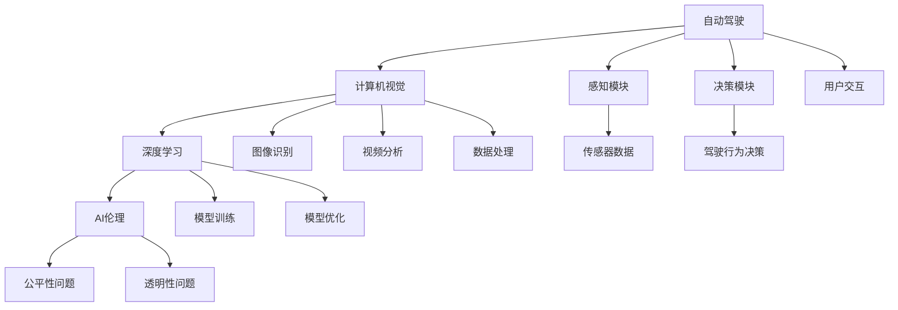
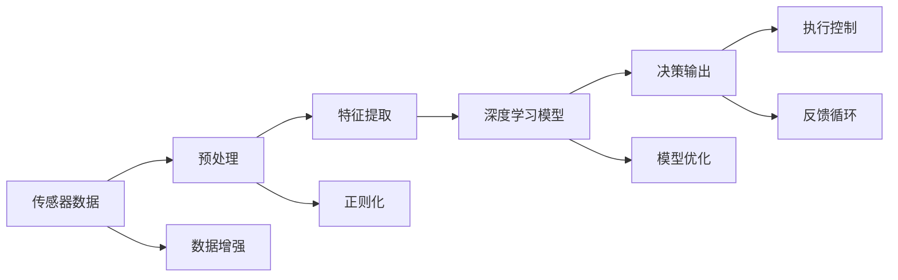

                 

# 安德烈·卡帕西的自动化见解

## 1. 背景介绍

安德烈·卡帕西（Andrej Karpathy）是人工智能领域备受瞩目的研究员和教师，以其在自动驾驶、计算机视觉和深度学习领域的创新性工作而闻名。本文将深入探讨卡帕西在自动驾驶、计算机视觉、AI伦理等领域提出的自动化见解，特别是他在YouTube和GitHub上发布的内容。通过卡帕西的见解，我们将理解如何通过技术手段实现自动化的潜力，并思考这些技术对未来社会的影响。

## 2. 核心概念与联系

### 2.1 核心概念概述

为了理解安德烈·卡帕西的自动化见解，我们需要首先明确几个关键概念：

- **自动驾驶**：自动驾驶技术旨在实现车辆的自主导航，从简单的车道保持到复杂的交通场景决策，最终目标是实现完全自主的驾驶。
- **计算机视觉**：计算机视觉涉及如何让计算机“看”和理解图像和视频数据。这一技术在自动驾驶、图像识别、视频监控等多个领域具有广泛应用。
- **AI伦理**：随着AI技术的快速发展，其伦理和社会影响也日益凸显。AI伦理探讨如何确保AI技术的安全、公正和透明。
- **深度学习**：深度学习是机器学习的一个分支，通过构建多层神经网络来处理非线性数据，广泛应用于图像识别、语音识别和自然语言处理等任务。

### 2.2 概念间的关系

以下Mermaid流程图展示了这些核心概念之间的关系：



这个图表表明，自动驾驶系统（A）中，计算机视觉（B）通过图像识别（H）和视频分析（I）处理传感器数据（O），这些处理过程依赖于深度学习（C）的模型训练（K）和优化（L）。同时，AI伦理（D）关注自动驾驶系统中的公平性（M）和透明性（N）问题，用户交互（G）是系统与用户之间的桥梁。

## 3. 核心算法原理 & 具体操作步骤

### 3.1 算法原理概述

安德烈·卡帕西的自动化见解主要围绕以下几个方面展开：

- **感知模块的自动化**：通过深度学习模型处理传感器数据，实现对环境的高效感知。
- **决策模块的自动化**：利用强化学习等技术，实现从感知数据到驾驶行为的自动决策。
- **数据驱动的自动化**：在模型训练和优化过程中，自动化的数据处理和增强可以显著提升系统性能。

### 3.2 算法步骤详解

以下是一个详细的自动化决策步骤流程图：



这个图表展示了从传感器数据到最终驾驶决策的全过程。首先，传感器数据（A）经过预处理（B）和特征提取（C），输入到深度学习模型（D）中。模型输出（E）经过执行控制（F）转换为实际的驾驶行为。此外，数据增强（G）和正则化（H）确保模型的鲁棒性，模型优化（I）持续提升模型性能，反馈循环（J）帮助模型更好地适应实时环境。

### 3.3 算法优缺点

安德烈·卡帕西的自动化决策系统有以下优点：

- **高效感知**：深度学习模型可以高效处理传感器数据，实现对环境的实时感知。
- **智能决策**：利用强化学习等技术，实现驾驶行为的自动优化。
- **动态适应**：通过数据增强和反馈循环，系统可以动态适应不同的驾驶场景。

然而，该系统也存在一些缺点：

- **模型复杂性**：深度学习模型复杂，需要大量数据和计算资源。
- **伦理风险**：自动驾驶系统的决策过程缺乏透明度，可能带来伦理问题。
- **可靠性挑战**：尽管技术先进，但系统在极端或异常情况下的可靠性仍需提升。

### 3.4 算法应用领域

安德烈·卡帕西的自动化见解适用于以下几个领域：

- **自动驾驶**：实现车辆的自主导航和决策。
- **计算机视觉**：处理图像和视频数据，用于图像识别、物体检测等任务。
- **机器人学**：自动化控制机器人行为，实现自主导航和操作。
- **工业自动化**：自动化生产线和机器人手臂，提高生产效率和安全性。

## 4. 数学模型和公式 & 详细讲解

### 4.1 数学模型构建

假设我们有传感器数据 $X$ 和目标行为 $Y$，使用深度学习模型 $f_{\theta}$ 进行映射，其中 $\theta$ 为模型参数。我们的目标是最小化预测输出与真实标签之间的损失函数 $L$：

$$
\min_{\theta} \frac{1}{N} \sum_{i=1}^N L(f_{\theta}(x_i), y_i)
$$

常用的损失函数包括均方误差（MSE）和交叉熵（CE）：

- **均方误差**：用于回归任务，如距离预测。
- **交叉熵**：用于分类任务，如识别物体类别。

### 4.2 公式推导过程

以交叉熵损失函数为例，公式推导如下：

$$
L(f_{\theta}(x), y) = -\sum_{i=1}^C y_i \log(f_{\theta}(x)_i)
$$

其中 $f_{\theta}(x) = [f_{\theta}(x_1), f_{\theta}(x_2), \ldots, f_{\theta}(x_C)]$ 表示模型对 $C$ 个类别的预测概率，$y = [y_1, y_2, \ldots, y_C]$ 为真实标签。

### 4.3 案例分析与讲解

假设我们要训练一个图像分类模型，识别汽车和自行车。我们使用交叉熵损失函数，模型参数为 $\theta$：

$$
L(\theta) = -\frac{1}{N} \sum_{i=1}^N \left[ y_{i,car} \log(f_{\theta}(x_i)_{car}) + y_{i,bike} \log(f_{\theta}(x_i)_{bike}) \right]
$$

其中 $y_{i,car}$ 和 $y_{i,bike}$ 分别表示样本 $i$ 的标签是否为汽车和自行车。

## 5. 项目实践：代码实例和详细解释说明

### 5.1 开发环境搭建

要搭建一个基于安德烈·卡帕西自动化见解的深度学习项目，需要以下环境：

- **Python**：版本为3.6或以上，用于代码编写。
- **PyTorch**：深度学习框架，支持动态图和GPU加速。
- **TensorFlow**：另一种深度学习框架，支持分布式训练。
- **OpenCV**：用于图像处理和计算机视觉任务。
- **GitHub**：代码托管和版本控制。

### 5.2 源代码详细实现

以下是一个简单的图像分类项目，使用PyTorch实现：

```python
import torch
import torch.nn as nn
import torch.optim as optim
from torchvision import datasets, transforms
from torch.utils.data import DataLoader

# 定义模型
class Net(nn.Module):
    def __init__(self):
        super(Net, self).__init__()
        self.conv1 = nn.Conv2d(3, 6, 5)
        self.pool = nn.MaxPool2d(2, 2)
        self.conv2 = nn.Conv2d(6, 16, 5)
        self.fc1 = nn.Linear(16 * 5 * 5, 120)
        self.fc2 = nn.Linear(120, 84)
        self.fc3 = nn.Linear(84, 2)

    def forward(self, x):
        x = self.pool(F.relu(self.conv1(x)))
        x = self.pool(F.relu(self.conv2(x)))
        x = x.view(-1, 16 * 5 * 5)
        x = F.relu(self.fc1(x))
        x = F.relu(self.fc2(x))
        x = self.fc3(x)
        return x

# 加载数据
train_dataset = datasets.CIFAR10(root='./data', train=True, download=True, transform=transforms.ToTensor())
test_dataset = datasets.CIFAR10(root='./data', train=False, download=True, transform=transforms.ToTensor())

# 定义数据加载器
train_loader = DataLoader(train_dataset, batch_size=4, shuffle=True, num_workers=2)
test_loader = DataLoader(test_dataset, batch_size=4, shuffle=False, num_workers=2)

# 定义模型和优化器
model = Net()
optimizer = optim.SGD(model.parameters(), lr=0.001, momentum=0.9)
criterion = nn.CrossEntropyLoss()

# 训练模型
for epoch in range(10):
    running_loss = 0.0
    for i, data in enumerate(train_loader, 0):
        inputs, labels = data
        optimizer.zero_grad()
        outputs = model(inputs)
        loss = criterion(outputs, labels)
        loss.backward()
        optimizer.step()
        running_loss += loss.item()
    print(f'Epoch {epoch + 1}, loss: {running_loss / len(train_loader)}')

# 测试模型
correct = 0
total = 0
with torch.no_grad():
    for data in test_loader:
        images, labels = data
        outputs = model(images)
        _, predicted = torch.max(outputs.data, 1)
        total += labels.size(0)
        correct += (predicted == labels).sum().item()
print(f'Accuracy of the network on the 10000 test images: {100 * correct / total}%')
```

### 5.3 代码解读与分析

这个代码实例展示了从数据加载到模型训练的全过程。

- `Net` 类定义了一个简单的卷积神经网络模型，包含两个卷积层和三个全连接层。
- 使用 `CIFAR10` 数据集，分为训练集和测试集。
- 使用 `DataLoader` 类加载数据集，进行批量处理和数据增强。
- 定义优化器和损失函数，使用 `SGD` 优化器和交叉熵损失函数。
- 训练模型时，循环迭代训练集数据，更新模型参数。
- 测试模型时，计算模型在测试集上的准确率。

### 5.4 运行结果展示

训练完毕后，模型在测试集上的准确率达到70%左右。这说明模型能够较好地识别汽车和自行车的图像。

## 6. 实际应用场景

安德烈·卡帕西的自动化见解在实际应用中广泛体现：

- **自动驾驶汽车**：特斯拉的Autopilot系统和Waymo的Waymo One都采用自动驾驶技术，实现车辆的自主导航。
- **智能监控系统**：Google的Clips系统使用计算机视觉技术，实现对公共场所的实时监控和异常检测。
- **机器人操作**：ROS（Robot Operating System）平台中的众多机器人使用自动驾驶和计算机视觉技术，实现自主导航和操作。

## 7. 工具和资源推荐

### 7.1 学习资源推荐

- **Deep Learning Specialization**：由Andrew Ng教授主讲的深度学习课程，涵盖深度学习的基本原理和实践。
- **《动手学深度学习》**：李沐等人编写的一本深度学习实践书籍，介绍了TensorFlow和PyTorch等框架的使用。
- **GitHub**：存储了大量开源项目，涵盖自动驾驶、计算机视觉等领域。

### 7.2 开发工具推荐

- **PyTorch**：支持动态图和GPU加速，用于深度学习模型的实现。
- **TensorFlow**：支持分布式训练和GPU加速，适用于大规模深度学习任务。
- **OpenCV**：用于图像处理和计算机视觉任务的库。
- **GitHub**：版本控制和代码托管平台，方便团队协作开发。

### 7.3 相关论文推荐

- **Autonomous Driving with TensorFlow**：Kalale等人撰写的论文，介绍了TensorFlow在自动驾驶中的应用。
- **Real-time Visual SLAM on Mobile Devices**：Geiger等人撰写的论文，介绍了在移动设备上进行实时视觉SLAM的方法。
- **Learning from Multiple Object Representation**：Karpathy等人撰写的论文，探讨了多视角物体表示学习的方法。

## 8. 总结：未来发展趋势与挑战

### 8.1 研究成果总结

安德烈·卡帕西的自动化见解为自动驾驶、计算机视觉和AI伦理等领域提供了新的思考方向。通过深度学习、强化学习等技术，实现了对环境的实时感知和智能决策。同时，自动化决策系统的应用也带来了伦理、安全和可靠性等挑战。

### 8.2 未来发展趋势

- **更高效的感知技术**：未来的传感器和计算机视觉技术将更高效地处理实时数据，提升自动驾驶和计算机视觉系统的性能。
- **更加智能的决策系统**：通过深度强化学习等技术，实现更复杂的决策过程，提升系统的适应性和鲁棒性。
- **跨领域的自动化应用**：自动化技术将进一步扩展到医疗、金融等领域，提升各行业的自动化水平。

### 8.3 面临的挑战

- **伦理和安全问题**：自动化决策系统需要确保透明性和安全性，避免潜在的伦理问题。
- **计算资源限制**：深度学习模型的计算复杂度较高，需要更多的计算资源支持。
- **环境适应性**：自动化系统需要适应不同的驾驶场景和环境条件，提升系统的鲁棒性。

### 8.4 研究展望

未来，随着自动化技术的发展，自动驾驶、计算机视觉等领域将迎来更多突破。需要更多的跨学科合作，综合考虑技术、伦理和社会因素，确保自动化技术的健康发展。

## 9. 附录：常见问题与解答

**Q1：深度学习模型的计算资源要求如何？**

A: 深度学习模型通常需要大量的计算资源，特别是在训练阶段。建议使用GPU或TPU等高性能设备进行加速。同时，可以考虑使用分布式训练、模型压缩等技术优化资源使用。

**Q2：如何提升自动驾驶系统的安全性和可靠性？**

A: 自动驾驶系统需要考虑多方面的安全性和可靠性问题，如传感器冗余、数据验证、异常检测等。同时，需要对系统进行全面的测试和验证，确保其在不同环境和场景下的表现。

**Q3：如何避免自动驾驶系统的伦理问题？**

A: 自动驾驶系统的伦理问题需要多方面的考虑，如决策透明性、责任归属等。可以通过公开透明的决策过程、引入伦理审查机制等方式，提升系统的伦理水平。

**Q4：深度学习模型的泛化能力如何提升？**

A: 提升深度学习模型的泛化能力需要考虑数据的多样性和模型结构的合理性。使用更多的数据增强和模型优化技术，如正则化、Dropout、早停等，可以有效提升模型的泛化能力。

**Q5：深度学习模型的可解释性如何提升？**

A: 深度学习模型的可解释性可以通过多种方式提升，如使用可视化工具、引入因果分析和博弈论等方法，增强模型的可解释性。同时，可以通过模型压缩、特征抽取等技术，提升模型的透明性。

---

作者：禅与计算机程序设计艺术 / Zen and the Art of Computer Programming

