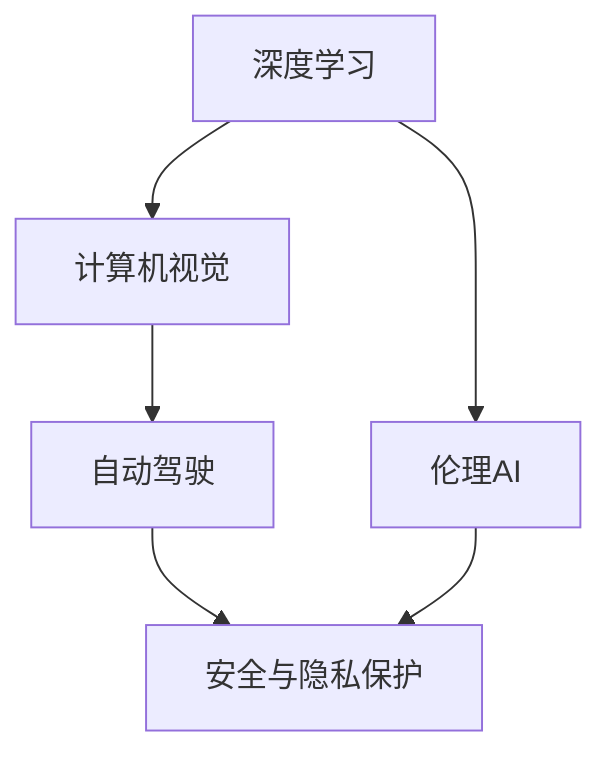

                 

# 《Andrej Karpathy：人工智能的未来发展挑战》

> 关键词：人工智能, 深度学习, 数据隐私, 伦理道德, 模型泛化, 技术发展, 未来展望

## 1. 背景介绍

Andrej Karpathy，作为人工智能领域的杰出代表，其工作在深度学习、计算机视觉以及自动驾驶等方面影响深远。他不仅在深度学习领域做出了一系列突破性贡献，还关注人工智能带来的伦理、社会问题，并思考未来发展的方向。本文将从人工智能的发展现状、面临的挑战以及未来可能的发展趋势，来深入探讨Andrej Karpathy所关注的未来发展挑战。

## 2. 核心概念与联系

### 2.1 核心概念概述

Andrej Karpathy的研究涉及多个领域，包括但不限于深度学习、计算机视觉、自动驾驶、伦理AI等。为了更清晰地理解其思想，本文将梳理以下几个核心概念：

- **深度学习**：使用多层神经网络进行数据表示与处理的技术，是Andrej Karpathy在图像识别、自然语言处理等领域的核心工具。
- **计算机视觉**：涉及图像、视频等视觉信息的处理和理解，Karpathy在自动驾驶等领域的研究，正是基于计算机视觉技术的突破。
- **自动驾驶**：将AI与汽车结合，实现无人驾驶的技术，是Karpathy的一个重要研究方向。
- **伦理AI**：关注AI技术应用带来的伦理、隐私和社会问题，强调在AI研究中需考虑伦理因素，保证技术的安全和公平。

### 2.2 核心概念之间的关系

这些核心概念之间存在着紧密的联系，形成了一个完整的AI研究框架。深度学习作为基础技术，为计算机视觉和自动驾驶等应用提供了可能。而计算机视觉技术，是自动驾驶中的核心，保证了无人驾驶的视觉感知和决策能力。同时，在所有这些应用中，都必须考虑伦理AI问题，确保技术应用的合法性和道德性。

以下是一个Mermaid流程图，展示这些核心概念之间的关系：



这个流程图展示了Andrej Karpathy的研究范围和各概念之间的相互依赖关系。

## 3. 核心算法原理 & 具体操作步骤

### 3.1 算法原理概述

Andrej Karpathy的研究涵盖多个核心算法，本文将重点介绍其在深度学习、计算机视觉和自动驾驶中的应用。

#### 3.1.1 深度学习算法原理

深度学习算法主要包括卷积神经网络（CNN）、循环神经网络（RNN）及其变体等。其中，卷积神经网络（CNN）是最经典的用于图像和视频处理的神经网络结构，能够有效提取图像的局部特征。循环神经网络（RNN）及其变种如长短时记忆网络（LSTM）和门控循环单元（GRU），则常用于处理序列数据，如自然语言文本和时间序列数据。

#### 3.1.2 计算机视觉算法原理

在计算机视觉领域，Karpathy的研究主要集中在图像识别、物体检测和分割等任务上。常用的算法包括：

- **图像识别**：使用卷积神经网络（CNN）对图像进行分类，识别其中的对象。
- **物体检测**：结合区域候选框和卷积神经网络，检测图像中的目标物体并标出其位置。
- **图像分割**：将图像中的每个像素分类，常用的算法包括全卷积神经网络（FCN）和U-Net等。

#### 3.1.3 自动驾驶算法原理

自动驾驶的核心是计算机视觉和深度学习技术的融合应用。主要的算法包括：

- **目标检测与跟踪**：通过物体检测算法在视频帧中识别并跟踪车辆、行人等目标，保证自动驾驶的安全性和可靠性。
- **路径规划与决策**：结合环境感知和决策树算法，规划车辆的最佳行驶路径。
- **行为预测**：预测其他车辆和行人的行为，确保车辆的安全行驶。

### 3.2 算法步骤详解

#### 3.2.1 深度学习算法步骤

深度学习算法的训练步骤通常包括以下几个环节：

1. **数据准备**：收集和预处理数据集，确保数据的多样性和质量。
2. **模型定义**：定义神经网络的结构，包括卷积层、池化层、全连接层等。
3. **模型训练**：使用优化算法（如SGD、Adam等）和损失函数（如交叉熵损失）训练模型。
4. **模型评估**：在验证集上评估模型的性能，如准确率、召回率等。
5. **模型应用**：将训练好的模型应用于实际问题中，进行预测或分类。

#### 3.2.2 计算机视觉算法步骤

计算机视觉算法的训练和应用步骤如下：

1. **数据预处理**：对图像进行归一化、缩放等预处理，确保数据的一致性。
2. **特征提取**：使用卷积神经网络（CNN）等模型提取图像的特征。
3. **模型训练**：使用目标检测或分割等算法训练模型，如YOLO、Faster R-CNN等。
4. **模型评估**：在测试集上评估模型的准确性和召回率。
5. **模型应用**：将模型应用于实际问题，如自动驾驶中的目标检测。

#### 3.2.3 自动驾驶算法步骤

自动驾驶算法的训练和应用步骤如下：

1. **数据收集**：收集包含交通场景的视频和图片数据。
2. **数据标注**：对数据进行标注，如目标检测、行为预测等。
3. **模型训练**：结合目标检测和行为预测等算法训练模型，如使用Faster R-CNN进行目标检测，使用RNN或LSTM进行行为预测。
4. **模型评估**：在仿真环境或实际道路测试中评估模型的性能。
5. **模型部署**：将训练好的模型部署到自动驾驶系统中，实现无人驾驶功能。

### 3.3 算法优缺点

#### 3.3.1 深度学习算法优缺点

- **优点**：
  - 能够自动提取特征，避免了手动特征工程。
  - 可处理非线性关系，适用于复杂的模式识别任务。
  - 训练后具有很好的泛化能力，能适应新的数据。

- **缺点**：
  - 需要大量的数据和计算资源进行训练。
  - 模型结构复杂，难以解释和理解。
  - 存在过拟合风险，需要额外的正则化技术。

#### 3.3.2 计算机视觉算法优缺点

- **优点**：
  - 能够处理大量数据，具有强大的特征提取能力。
  - 在目标检测和分割等任务上表现优异。
  - 可应用于各种计算机视觉应用，如医学影像分析、视频监控等。

- **缺点**：
  - 需要大量标注数据进行训练，数据标注成本高。
  - 模型复杂度高，推理速度较慢。
  - 对遮挡、光照等变化敏感，需要额外的处理技术。

#### 3.3.3 自动驾驶算法优缺点

- **优点**：
  - 结合计算机视觉和深度学习技术，实现了无人驾驶的可行性。
  - 提高了交通安全性，减少了交通事故的发生。
  - 能够实现环境感知和行为预测，提高了驾驶的智能化水平。

- **缺点**：
  - 需要大量的道路数据和标注，数据采集成本高。
  - 对环境变化和复杂情况的处理能力有限，仍需依赖人工干预。
  - 存在安全隐患，需要严格的法规和标准进行监管。

### 3.4 算法应用领域

Andrej Karpathy的研究涵盖多个应用领域，包括但不限于以下：

- **自然语言处理**：使用深度学习技术处理和理解自然语言。
- **图像识别**：开发图像分类、物体检测等算法。
- **视频分析**：进行视频帧间的特征提取和行为预测。
- **自动驾驶**：开发无人驾驶系统，实现自动驾驶技术。
- **机器人控制**：开发机器人导航和行为决策算法。

以下是一个表格，展示了这些算法在不同应用领域中的具体应用：

| 算法 | 应用领域 |
| --- | --- |
| CNN | 图像识别、视频分析、自然语言处理 |
| RNN | 自然语言处理、时间序列预测 |
| LSTM | 自然语言处理、时间序列预测 |
| 目标检测 | 自动驾驶、视频分析、医学影像分析 |
| 分割算法 | 医学影像分析、自然语言处理 |
| 路径规划 | 自动驾驶、机器人控制 |
| 行为预测 | 自动驾驶、机器人控制 |
| 决策树 | 自动驾驶、机器人控制 |

## 4. 数学模型和公式 & 详细讲解 & 举例说明

### 4.1 数学模型构建

Andrej Karpathy的研究涉及多个数学模型，其中深度学习模型是最核心的部分。以下是几个常见的数学模型及其构建方法：

#### 4.1.1 卷积神经网络（CNN）

卷积神经网络（CNN）的数学模型主要包括以下几个部分：

- **输入层**：表示输入数据的维度和大小。
- **卷积层**：通过卷积核（filter）提取输入数据的局部特征。
- **池化层**：对卷积层输出的特征进行下采样，减少参数量。
- **全连接层**：将池化层输出的特征映射到输出标签。

数学表示如下：

$$
y = \sigma(\text{W}_xx + \text{b}_x) + \sigma(\text{W}_xx' + \text{b}_x')
$$

其中，$x$ 表示输入数据，$x'$ 表示卷积核，$\sigma$ 表示激活函数（如ReLU），$\text{W}_x$ 和 $\text{b}_x$ 表示卷积层和全连接层的参数。

#### 4.1.2 循环神经网络（RNN）

循环神经网络（RNN）的数学模型如下：

$$
h_t = \text{tanh}(\text{W}_xh_{t-1} + \text{U}_xx_t + \text{b}_x)
$$

$$
o_t = \sigma(\text{W}_xh_t + \text{b}_x)
$$

$$
y_t = o_t \cdot \sigma(\text{V}_xh_t + \text{c}_x)
$$

其中，$x_t$ 表示输入数据，$h_t$ 表示隐藏状态，$o_t$ 表示输出，$\text{tanh}$ 和 $\sigma$ 表示激活函数，$\text{W}_x$、$\text{U}_x$ 和 $\text{V}_x$ 表示网络参数，$\text{b}_x$ 和 $\text{c}_x$ 表示偏置。

#### 4.1.3 目标检测

目标检测算法通常使用区域候选框（RoI）和卷积神经网络（CNN）进行训练。假设输入为 $x$，输出为 $y$，目标检测算法的数学模型如下：

$$
y = \text{Softmax}(\text{W}_xx + \text{b}_x)
$$

其中，$\text{Softmax}$ 表示softmax函数，用于输出目标类别的概率分布。

### 4.2 公式推导过程

#### 4.2.1 卷积神经网络（CNN）

卷积神经网络（CNN）的推导过程如下：

1. **卷积层**：
   - 输入：$x$
   - 输出：$h$
   - 卷积核：$x'$
   - 参数：$\text{W}_x$、$\text{b}_x$
   - 激活函数：$\sigma$
   - 公式：$h = \sigma(\text{W}_xx' + \text{b}_x)$

2. **池化层**：
   - 输入：$h$
   - 输出：$h'$
   - 池化函数：$\sigma$
   - 公式：$h' = \sigma(\text{W}_xh + \text{b}_x)$

3. **全连接层**：
   - 输入：$h'$
   - 输出：$y$
   - 参数：$\text{W}_x$、$\text{b}_x$
   - 激活函数：$\sigma$
   - 公式：$y = \sigma(\text{W}_xh' + \text{b}_x)$

#### 4.2.2 循环神经网络（RNN）

循环神经网络（RNN）的推导过程如下：

1. **隐藏状态更新**：
   - 输入：$x_t$
   - 隐藏状态：$h_t$
   - 卷积核：$x'$
   - 参数：$\text{W}_x$、$\text{b}_x$
   - 激活函数：$\text{tanh}$
   - 公式：$h_t = \text{tanh}(\text{W}_xh_{t-1} + \text{U}_xx_t + \text{b}_x)$

2. **输出计算**：
   - 输入：$h_t$
   - 输出：$o_t$
   - 参数：$\text{W}_x$、$\text{b}_x$
   - 激活函数：$\sigma$
   - 公式：$o_t = \sigma(\text{W}_xh_t + \text{b}_x)$

3. **目标输出计算**：
   - 输入：$h_t$
   - 输出：$y_t$
   - 参数：$\text{V}_x$、$\text{c}_x$
   - 激活函数：$\sigma$
   - 公式：$y_t = o_t \cdot \sigma(\text{V}_xh_t + \text{c}_x)$

#### 4.2.3 目标检测

目标检测的推导过程如下：

1. **目标候选框（RoI）**：
   - 输入：$x$
   - 输出：$x'$
   - 卷积核：$x'$
   - 参数：$\text{W}_x$、$\text{b}_x$
   - 激活函数：$\text{Softmax}$
   - 公式：$y = \text{Softmax}(\text{W}_xx' + \text{b}_x)$

### 4.3 案例分析与讲解

#### 4.3.1 图像识别

假设输入为一张图像 $x$，模型为CNN，输出为标签 $y$。使用softmax函数计算标签的概率分布，并将概率最大的标签作为预测结果。

$$
y = \text{Softmax}(\text{W}_xx + \text{b}_x)
$$

#### 4.3.2 目标检测

假设输入为一张图像 $x$，模型为Faster R-CNN，输出为目标类别 $y$。先通过卷积神经网络提取特征，再通过RoI池化层将特征映射到RoI，最后使用softmax函数计算目标类别的概率分布。

$$
y = \text{Softmax}(\text{W}_xx' + \text{b}_x)
$$

#### 4.3.3 自动驾驶

假设输入为包含交通场景的视频数据 $x$，模型为自动驾驶系统，输出为车辆的行驶路径 $y$。首先使用目标检测算法识别车辆、行人等目标，再使用RNN或LSTM进行行为预测，最后使用决策树规划路径。

$$
h_t = \text{tanh}(\text{W}_xh_{t-1} + \text{U}_xx_t + \text{b}_x)
$$

$$
o_t = \sigma(\text{W}_xh_t + \text{b}_x)
$$

$$
y_t = o_t \cdot \sigma(\text{V}_xh_t + \text{c}_x)
$$

## 5. 项目实践：代码实例和详细解释说明

### 5.1 开发环境搭建

为了进行深度学习和计算机视觉的研究，Andrej Karpathy通常会使用以下工具：

1. **Python**：作为主要的编程语言，用于实现深度学习算法。
2. **TensorFlow**：Google开发的深度学习框架，支持分布式计算和GPU加速。
3. **PyTorch**：Facebook开发的深度学习框架，易于使用且具有强大的动态计算图功能。
4. **Caffe**：由Berkeley Vision and Learning Center开发的深度学习框架，用于计算机视觉任务。
5. **Keras**：基于TensorFlow和Theano的高级神经网络API，简化了深度学习的实现过程。

### 5.2 源代码详细实现

以下是一个简单的卷积神经网络（CNN）实现代码：

```python
import tensorflow as tf
from tensorflow.keras import layers, models

# 定义CNN模型
def create_cnn_model(input_shape=(32, 32, 3)):
    model = models.Sequential()
    model.add(layers.Conv2D(32, (3, 3), activation='relu', input_shape=input_shape))
    model.add(layers.MaxPooling2D((2, 2)))
    model.add(layers.Conv2D(64, (3, 3), activation='relu'))
    model.add(layers.MaxPooling2D((2, 2)))
    model.add(layers.Flatten())
    model.add(layers.Dense(64, activation='relu'))
    model.add(layers.Dense(10, activation='softmax'))
    return model

# 训练CNN模型
model = create_cnn_model()
model.compile(optimizer='adam', loss='categorical_crossentropy', metrics=['accuracy'])

# 加载数据集
(x_train, y_train), (x_test, y_test) = tf.keras.datasets.mnist.load_data()
x_train = x_train.reshape(x_train.shape[0], 28, 28, 1)
x_test = x_test.reshape(x_test.shape[0], 28, 28, 1)
x_train = x_train.astype('float32') / 255
x_test = x_test.astype('float32') / 255

# 训练模型
model.fit(x_train, y_train, epochs=10, batch_size=32, validation_data=(x_test, y_test))
```

### 5.3 代码解读与分析

这段代码定义了一个简单的卷积神经网络模型，用于对MNIST数据集进行图像分类。模型的架构包括两个卷积层和两个全连接层，使用ReLU激活函数和softmax输出层。

在训练过程中，使用了Adam优化器和交叉熵损失函数，同时设置了验证集来监控模型的性能。使用Mnist数据集进行训练和测试，最后输出模型的训练结果。

## 6. 实际应用场景

Andrej Karpathy的研究涵盖了多个实际应用场景，以下是几个典型的应用场景：

### 6.1 图像识别

图像识别在自动驾驶、医学影像分析等领域具有重要应用。使用卷积神经网络（CNN）对图像进行分类，可以实现精确的图像识别。

### 6.2 目标检测

目标检测在自动驾驶、视频监控等领域有广泛应用。使用Faster R-CNN等算法，可以实现对目标的精确检测和跟踪。

### 6.3 自动驾驶

自动驾驶系统结合计算机视觉和深度学习技术，能够实现无人驾驶功能。通过目标检测和行为预测算法，实现环境感知和路径规划。

### 6.4 自然语言处理

自然语言处理在智能客服、情感分析等领域有重要应用。使用循环神经网络（RNN）和Transformer等算法，可以实现文本分类、情感分析等任务。

### 6.5 视频分析

视频分析在安防、视频监控等领域有重要应用。使用卷积神经网络（CNN）和循环神经网络（RNN），可以实现视频中的目标检测和行为预测。

## 7. 工具和资源推荐

### 7.1 学习资源推荐

1. **《深度学习》课程**：斯坦福大学Andrew Ng教授的深度学习课程，涵盖了深度学习的基础知识和应用。
2. **《计算机视觉》课程**：斯坦福大学CS231n计算机视觉课程，涵盖计算机视觉的基础理论和算法。
3. **《自然语言处理》课程**：斯坦福大学CS224n自然语言处理课程，涵盖自然语言处理的基础知识和算法。
4. **《自动驾驶》课程**：多所大学的自动驾驶课程，涵盖自动驾驶的基础理论和技术。
5. **《人工智能伦理》课程**：多所大学的AI伦理课程，涵盖人工智能伦理、隐私和社会问题。

### 7.2 开发工具推荐

1. **TensorFlow**：Google开发的深度学习框架，支持分布式计算和GPU加速。
2. **PyTorch**：Facebook开发的深度学习框架，易于使用且具有强大的动态计算图功能。
3. **Caffe**：由Berkeley Vision and Learning Center开发的深度学习框架，用于计算机视觉任务。
4. **Keras**：基于TensorFlow和Theano的高级神经网络API，简化了深度学习的实现过程。
5. **Google Colab**：Google提供的Jupyter Notebook环境，支持GPU计算和协作开发。

### 7.3 相关论文推荐

1. **《ImageNet Classification with Deep Convolutional Neural Networks》**：AlexNet论文，提出了深度卷积神经网络，开启了深度学习时代。
2. **《Very Deep Convolutional Networks for Large-Scale Image Recognition》**：Google的Inception论文，提出Inception模块，提高了深度卷积神经网络的性能。
3. **《Rethinking the Inception Architecture for Computer Vision》**：Google的Inception v2论文，优化了Inception模块。
4. **《Faster R-CNN: Towards Real-Time Object Detection with Region Proposal Networks》**：Facebook提出的Faster R-CNN算法，提高了目标检测的效率和精度。
5. **《Attention Is All You Need》**：Google提出的Transformer算法，改变了自然语言处理的范式。
6. **《Policy Gradient Methods for Playing Go and Other Complex Games》**：DeepMind提出的Policy Gradient方法，实现了AlphaGo。

## 8. 总结：未来发展趋势与挑战

### 8.1 研究成果总结

Andrej Karpathy在深度学习、计算机视觉和自动驾驶等领域的研究，推动了这些技术的发展，为人工智能应用提供了新的可能。他的研究不仅在学术界产生了深远影响，还在工业界得到了广泛应用。

### 8.2 未来发展趋势

未来，人工智能技术将继续向深度和广度扩展，带来更多的应用场景和挑战。以下是一些未来的发展趋势：

1. **深度学习模型的进一步发展**：随着计算能力的提升，深度学习模型将继续向着更深、更大、更强的方向发展。
2. **计算机视觉技术的突破**：计算机视觉技术将继续提升图像和视频的处理能力，实现更加精准的图像识别和目标检测。
3. **自动驾驶技术的普及**：自动驾驶技术将在未来实现更广泛的普及，带来更安全的交通环境。
4. **自然语言处理技术的进步**：自然语言处理技术将继续提升文本和语音的理解能力，实现更自然的语言交互。
5. **多模态技术的融合**：深度学习技术将实现多模态信息的融合，提升跨模态的协同能力。

### 8.3 面临的挑战

尽管人工智能技术取得了很多进展，但在实际应用中仍然面临许多挑战。以下是一些主要的挑战：

1. **数据隐私问题**：大规模数据集的使用带来隐私泄露的风险，需要更好的数据管理和保护机制。
2. **模型鲁棒性**：深度学习模型对噪声和变化的敏感性，需要更强的鲁棒性和泛化能力。
3. **模型解释性**：深度学习模型的黑盒特性，需要更好的可解释性和可理解性。
4. **伦理和社会问题**：人工智能技术的应用需要考虑伦理和社会问题，避免技术滥用。
5. **计算资源需求**：深度学习模型对计算资源的需求，需要更好的硬件支持和优化技术。

### 8.4 研究展望

未来的研究需要在以下几个方面取得新的突破：

1. **无监督和半监督学习**：解决深度学习模型对标注数据的需求，利用自监督和半监督学习技术，提高模型的泛化能力。
2. **可解释性和可理解性**：提高深度学习模型的可解释性和可理解性，使其更具透明性和可信性。
3. **跨模态技术的融合**：实现跨模态信息的融合，提升多模态协同处理能力。
4. **伦理和社会问题的研究**：深入研究人工智能技术的伦理和社会问题，制定更好的法规和标准。
5. **计算资源的优化**：研究新的计算优化技术，提高深度学习模型的计算效率和资源利用率。

## 9. 附录：常见问题与解答

### 9.1 常见问题

1. **深度学习算法的缺点是什么？**
   - 需要大量的数据和计算资源进行训练。
   - 模型结构复杂，难以解释和理解。
   - 存在过拟合风险，需要额外的正则化技术。

2. **如何提高深度学习模型的泛化能力？**
   - 使用更多的数据进行训练。
   - 引入正则化技术，如Dropout、L2正则等。
   - 使用预训练模型，提高模型的初始化效果。

3. **深度学习模型在实际应用中面临哪些挑战？**
   - 数据隐私问题。
   - 模型鲁棒性不足。
   - 模型解释性不够。
   - 伦理和社会问题。
   - 计算资源需求高。

4. **如何优化深度学习模型的计算效率？**
   - 使用混合精度训练。
   - 使用梯度累积。
   - 使用分布式计算。
   - 优化模型的计算图。

5. **如何提高深度学习模型的可解释性？**
   - 引入

