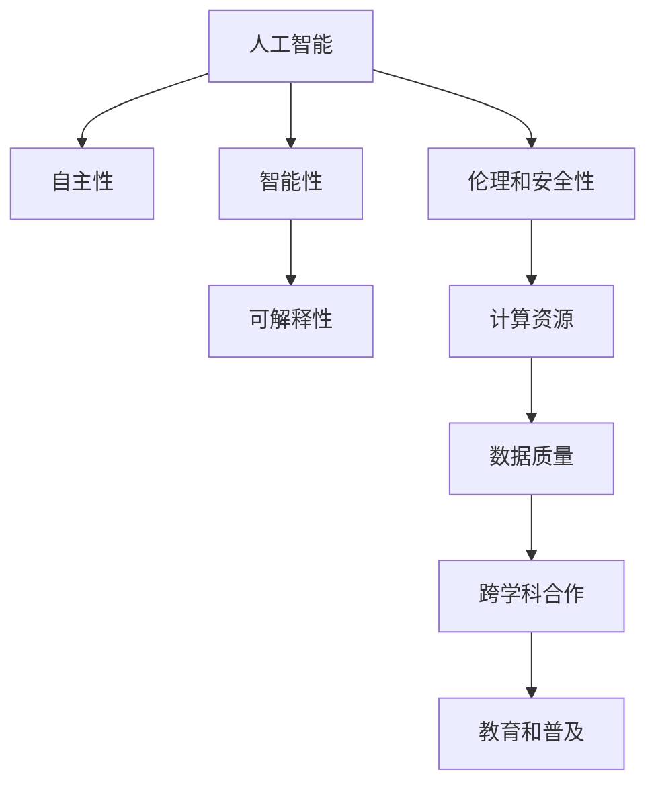

                 

## 1. 背景介绍

### 1.1 问题由来

Andrej Karpathy，斯坦福大学计算机科学系助理教授，同时也是OpenAI的创始人之一，人工智能领域的重要学者。他对人工智能的未来发展有着深刻的洞察和见解，对挑战也有着清晰的认识。在当今快速发展的AI领域，Andrej Karpathy的见解为我们的未来发展提供了重要的参考。

### 1.2 问题核心关键点

1. **人工智能的未来方向**：Andrej Karpathy认为，人工智能的未来方向应该是更加注重自主性和智能性，而不是仅仅在特定任务上表现出色。他提倡AI系统应该具备广泛的知识和理解能力，能够适应各种复杂的场景和问题。

2. **可解释性**：Andrej Karpathy强调，AI系统应该具备良好的可解释性，用户能够理解其决策过程，这对于医疗、法律等高风险应用尤为重要。

3. **伦理和安全性**：AI系统在发展过程中，必须考虑到伦理和安全性问题，避免偏见和歧视，确保AI系统的输出符合人类的价值观和伦理道德。

4. **计算资源**：AI系统的发展离不开大量的计算资源，Andrej Karpathy认为，未来的AI系统需要更高效的计算方式，以支持更大规模和更复杂的模型。

5. **数据质量**：AI系统的性能高度依赖于数据质量，Andrej Karpathy提出，高质量的数据集是AI发展的重要基础。

6. **跨学科合作**：AI的发展需要跨学科的合作，包括计算机科学、统计学、伦理学、哲学等多个领域，共同推动AI技术的发展。

7. **教育和普及**：Andrej Karpathy认为，AI的教育和普及对未来AI的发展至关重要，需要培养更多AI人才，促进AI技术的广泛应用。

这些关键点共同构成了Andrej Karpathy对AI未来发展的全面思考，帮助我们理解AI未来的挑战和机遇。

### 1.3 问题研究意义

通过对Andrej Karpathy对AI未来发展的深入分析，可以为我们提供重要的指导和参考，帮助我们更好地应对未来AI发展的挑战，抓住机遇，推动AI技术的健康发展。具体而言：

1. **指导未来研究**：Andrej Karpathy的见解可以为未来的AI研究提供方向，帮助研究者集中精力解决核心问题，推动AI技术的发展。

2. **提高系统质量**：通过对Andrej Karpathy提出的伦理、安全性、可解释性等问题的重视，可以提高AI系统的质量，使其在实际应用中更加可靠和安全。

3. **促进教育普及**：Andrej Karpathy对AI教育的强调，可以推动AI技术的普及，促进更多的青年人才投身AI研究，推动AI技术的发展。

4. **加速产业应用**：Andrej Karpathy认为，AI技术的发展需要跨学科的合作，这将有助于加速AI技术在各行各业的应用，促进产业的升级和发展。

## 2. 核心概念与联系

### 2.1 核心概念概述

为了更好地理解Andrej Karpathy对AI未来发展的见解，本节将介绍几个密切相关的核心概念：

- **人工智能（AI）**：利用计算机和算法模拟人类智能的技术，包括机器学习、深度学习、自然语言处理等。

- **自主性（Autonomy）**：AI系统能够自主决策、学习，无需人类干预，具备更强的智能和适应能力。

- **智能性（Intelligence）**：AI系统在特定任务上的表现能力，包括感知、理解、推理和决策等。

- **可解释性（Explainability）**：AI系统决策过程的可解释性，用户能够理解其内部机制和逻辑。

- **伦理和安全性（Ethics and Security）**：AI系统在开发和应用过程中，需考虑伦理和安全性问题，避免偏见和歧视，确保系统输出符合道德规范。

- **计算资源（Computational Resources）**：AI系统发展所需的大量计算资源，包括GPU、TPU、云计算等。

- **数据质量（Data Quality）**：AI系统性能高度依赖于数据质量，高质量的数据集是AI发展的重要基础。

- **跨学科合作（Interdisciplinary Collaboration）**：AI发展需要跨学科的合作，包括计算机科学、统计学、伦理学、哲学等多个领域。

- **教育和普及（Education and Outreach）**：AI的教育和普及对未来AI的发展至关重要，需要培养更多AI人才，促进AI技术的广泛应用。

这些核心概念之间存在着紧密的联系，构成了AI发展的整体框架，帮助我们理解Andrej Karpathy对AI未来发展的全面思考。

### 2.2 概念间的关系

这些核心概念之间存在着紧密的联系，形成了AI发展的完整生态系统。下面通过几个Mermaid流程图来展示这些概念之间的关系：



这个流程图展示了AI的核心概念及其之间的关系：

1. 人工智能通过自主性和智能性，实现对复杂问题的解决。
2. 智能性依赖于可解释性，用户能够理解系统的决策过程。
3. 伦理和安全性是AI系统的必备条件，确保系统输出符合道德规范。
4. 计算资源和数据质量是AI系统发展的关键基础。
5. 跨学科合作和教育普及，推动AI技术的广泛应用和高质量发展。

通过这些流程图，我们可以更清晰地理解AI核心概念之间的关系，为后续深入讨论Andrej Karpathy的见解奠定基础。

## 3. 核心算法原理 & 具体操作步骤

### 3.1 算法原理概述

Andrej Karpathy认为，未来的AI系统应该具备更强的自主性和智能性，能够应对复杂多变的任务。为此，他提出了一种基于自监督学习和迁移学习的算法框架，旨在提升AI系统的适应能力和泛化能力。

形式化地，假设有一个通用的AI系统 $M$，通过在大规模无标签数据集 $D$ 上进行自监督学习，学习到通用的特征表示。然后，针对特定任务 $T$，通过迁移学习，在 $D$ 上微调模型 $M$，使其适应任务 $T$。具体步骤如下：

1. 在大规模无标签数据集 $D$ 上进行自监督学习，学习通用的特征表示。
2. 针对特定任务 $T$，在 $D$ 上微调模型 $M$，使其适应任务 $T$。
3. 通过不断迭代优化，提升模型的适应能力和泛化能力。

### 3.2 算法步骤详解

以下是Andrej Karpathy提出的基于自监督学习和迁移学习的AI系统微调算法步骤：

1. **数据准备**：收集大规模无标签数据集 $D$ 和特定任务 $T$ 的标注数据集 $D_T$。

2. **自监督学习**：在大规模无标签数据集 $D$ 上进行自监督学习，学习通用的特征表示。常用的自监督学习任务包括掩码语言模型、预训练任务等。

3. **迁移学习**：在特定任务 $T$ 的标注数据集 $D_T$ 上，通过微调学习任务 $T$ 的特征表示。常用的微调方法包括全参数微调、参数高效微调等。

4. **优化算法**：使用基于梯度的优化算法（如AdamW、SGD等），最小化损失函数，更新模型参数。常用的损失函数包括交叉熵损失、均方误差损失等。

5. **性能评估**：在特定任务 $T$ 的验证集和测试集上，评估模型的性能。常用的评估指标包括精度、召回率、F1分数等。

6. **模型部署**：将训练好的模型部署到实际应用场景中，进行推理和预测。

### 3.3 算法优缺点

Andrej Karpathy提出的算法框架具有以下优点：

1. **通用性强**：该算法框架可以应用于各种不同类型的任务，提升了AI系统的泛化能力。

2. **效率高**：通过在大规模无标签数据集上进行自监督学习，学习通用的特征表示，减少了标注数据的需求，提高了训练效率。

3. **适应能力强**：通过迁移学习，AI系统可以适应不同的任务，提升了系统的适应能力。

4. **可解释性**：通过自监督学习和迁移学习，AI系统具备良好的可解释性，用户能够理解系统的决策过程。

同时，该算法框架也存在一些缺点：

1. **计算资源需求高**：大规模无标签数据集和复杂模型的训练需要大量的计算资源，对硬件设备提出了较高要求。

2. **数据依赖性强**：AI系统的性能高度依赖于数据质量，高质量的数据集是AI发展的重要基础。

3. **模型复杂度高**：复杂模型的训练和优化需要耗费大量时间和计算资源，对模型的设计也提出了较高要求。

4. **伦理和安全性问题**：AI系统在开发和应用过程中，需考虑伦理和安全性问题，避免偏见和歧视，确保系统输出符合道德规范。

### 3.4 算法应用领域

Andrej Karpathy提出的算法框架在多个领域得到了广泛应用：

1. **自然语言处理（NLP）**：用于文本分类、命名实体识别、机器翻译等任务，提升了NLP系统的性能和适应能力。

2. **计算机视觉（CV）**：用于图像分类、目标检测、图像生成等任务，提升了CV系统的性能和泛化能力。

3. **机器人控制**：用于机器人视觉、动作控制等任务，提升了机器人的感知和决策能力。

4. **自动驾驶**：用于自动驾驶系统的视觉感知、路径规划等任务，提升了自动驾驶系统的安全性和可靠性。

5. **医疗诊断**：用于医疗图像分析、疾病预测等任务，提升了医疗诊断的准确性和效率。

6. **金融分析**：用于金融市场分析、股票预测等任务，提升了金融分析的准确性和可靠性。

以上应用领域展示了Andrej Karpathy提出的算法框架的强大适应性和广泛应用前景。

## 4. 数学模型和公式 & 详细讲解 & 举例说明

### 4.1 数学模型构建

Andrej Karpathy提出的算法框架涉及多个数学模型，包括自监督学习模型和迁移学习模型。

假设一个通用的AI系统 $M$，在大规模无标签数据集 $D$ 上进行自监督学习，学习通用的特征表示。然后，针对特定任务 $T$，在数据集 $D_T$ 上进行迁移学习，学习任务 $T$ 的特征表示。数学模型如下：

1. **自监督学习模型**：
   $$
   M_{\theta} = M_{\theta}(D)
   $$
   其中，$M_{\theta}$ 为AI系统的参数，$D$ 为大规模无标签数据集。

2. **迁移学习模型**：
   $$
   M_{\theta} = M_{\theta}(D_T)
   $$
   其中，$D_T$ 为特定任务 $T$ 的标注数据集。

### 4.2 公式推导过程

以文本分类任务为例，推导自监督学习模型和迁移学习模型的公式。

假设自监督学习模型 $M_{\theta}$ 的输出为 $y$，与真实标签 $y^*$ 之间的损失函数为：
$$
\mathcal{L}(y,y^*) = -\sum_{i=1}^N y_i \log y_i^* + (1-y_i) \log (1-y_i^*)
$$

其中，$N$ 为样本数，$y_i$ 为模型预测的输出，$y_i^*$ 为真实标签。

在自监督学习阶段，通过在大规模无标签数据集 $D$ 上进行掩码语言模型训练，学习到通用的特征表示。

在迁移学习阶段，通过在特定任务 $T$ 的标注数据集 $D_T$ 上微调模型 $M_{\theta}$，学习任务 $T$ 的特征表示。常用的微调方法包括全参数微调、参数高效微调等。

### 4.3 案例分析与讲解

以文本分类任务为例，展示Andrej Karpathy提出的算法框架的应用过程。

假设有一个通用的AI系统 $M$，在大规模无标签数据集 $D$ 上进行掩码语言模型训练，学习通用的特征表示。然后，针对文本分类任务，在特定任务的数据集 $D_T$ 上微调模型 $M_{\theta}$，学习文本分类任务的特征表示。具体的实现步骤如下：

1. **数据准备**：收集大规模无标签数据集 $D$ 和文本分类任务 $T$ 的标注数据集 $D_T$。

2. **自监督学习**：在大规模无标签数据集 $D$ 上进行掩码语言模型训练，学习通用的特征表示。

3. **迁移学习**：在特定任务 $T$ 的标注数据集 $D_T$ 上，通过微调学习文本分类任务的特征表示。常用的微调方法包括全参数微调、参数高效微调等。

4. **优化算法**：使用基于梯度的优化算法（如AdamW、SGD等），最小化损失函数，更新模型参数。常用的损失函数包括交叉熵损失、均方误差损失等。

5. **性能评估**：在特定任务 $T$ 的验证集和测试集上，评估模型的性能。常用的评估指标包括精度、召回率、F1分数等。

6. **模型部署**：将训练好的模型部署到实际应用场景中，进行推理和预测。

## 5. 项目实践：代码实例和详细解释说明

### 5.1 开发环境搭建

在进行AI系统微调实践前，我们需要准备好开发环境。以下是使用Python进行PyTorch开发的环境配置流程：

1. 安装Anaconda：从官网下载并安装Anaconda，用于创建独立的Python环境。

2. 创建并激活虚拟环境：
```bash
conda create -n pytorch-env python=3.8 
conda activate pytorch-env
```

3. 安装PyTorch：根据CUDA版本，从官网获取对应的安装命令。例如：
```bash
conda install pytorch torchvision torchaudio cudatoolkit=11.1 -c pytorch -c conda-forge
```

4. 安装Transformers库：
```bash
pip install transformers
```

5. 安装各类工具包：
```bash
pip install numpy pandas scikit-learn matplotlib tqdm jupyter notebook ipython
```

完成上述步骤后，即可在`pytorch-env`环境中开始微调实践。

### 5.2 源代码详细实现

下面我们以文本分类任务为例，给出使用Transformers库对BERT模型进行微调的PyTorch代码实现。

首先，定义文本分类任务的数据处理函数：

```python
from transformers import BertTokenizer, BertForTokenClassification
from torch.utils.data import Dataset
import torch

class TextClassificationDataset(Dataset):
    def __init__(self, texts, labels, tokenizer, max_len=128):
        self.texts = texts
        self.labels = labels
        self.tokenizer = tokenizer
        self.max_len = max_len
        
    def __len__(self):
        return len(self.texts)
    
    def __getitem__(self, item):
        text = self.texts[item]
        label = self.labels[item]
        
        encoding = self.tokenizer(text, return_tensors='pt', max_length=self.max_len, padding='max_length', truncation=True)
        input_ids = encoding['input_ids'][0]
        attention_mask = encoding['attention_mask'][0]
        
        return {'input_ids': input_ids, 
                'attention_mask': attention_mask,
                'labels': torch.tensor(label, dtype=torch.long)}
```

然后，定义模型和优化器：

```python
from transformers import BertForTokenClassification, AdamW

model = BertForTokenClassification.from_pretrained('bert-base-cased', num_labels=2)

optimizer = AdamW(model.parameters(), lr=2e-5)
```

接着，定义训练和评估函数：

```python
from torch.utils.data import DataLoader
from tqdm import tqdm
from sklearn.metrics import classification_report

device = torch.device('cuda') if torch.cuda.is_available() else torch.device('cpu')
model.to(device)

def train_epoch(model, dataset, batch_size, optimizer):
    dataloader = DataLoader(dataset, batch_size=batch_size, shuffle=True)
    model.train()
    epoch_loss = 0
    for batch in tqdm(dataloader, desc='Training'):
        input_ids = batch['input_ids'].to(device)
        attention_mask = batch['attention_mask'].to(device)
        labels = batch['labels'].to(device)
        model.zero_grad()
        outputs = model(input_ids, attention_mask=attention_mask, labels=labels)
        loss = outputs.loss
        epoch_loss += loss.item()
        loss.backward()
        optimizer.step()
    return epoch_loss / len(dataloader)

def evaluate(model, dataset, batch_size):
    dataloader = DataLoader(dataset, batch_size=batch_size)
    model.eval()
    preds, labels = [], []
    with torch.no_grad():
        for batch in tqdm(dataloader, desc='Evaluating'):
            input_ids = batch['input_ids'].to(device)
            attention_mask = batch['attention_mask'].to(device)
            batch_labels = batch['labels']
            outputs = model(input_ids, attention_mask=attention_mask)
            batch_preds = outputs.logits.argmax(dim=2).to('cpu').tolist()
            batch_labels = batch_labels.to('cpu').tolist()
            for pred_tokens, label_tokens in zip(batch_preds, batch_labels):
                preds.append(pred_tokens[:len(label_tokens)])
                labels.append(label_tokens)
                
    print(classification_report(labels, preds))
```

最后，启动训练流程并在测试集上评估：

```python
epochs = 5
batch_size = 16

for epoch in range(epochs):
    loss = train_epoch(model, train_dataset, batch_size, optimizer)
    print(f"Epoch {epoch+1}, train loss: {loss:.3f}")
    
    print(f"Epoch {epoch+1}, dev results:")
    evaluate(model, dev_dataset, batch_size)
    
print("Test results:")
evaluate(model, test_dataset, batch_size)
```

以上就是使用PyTorch对BERT进行文本分类任务微调的完整代码实现。可以看到，得益于Transformers库的强大封装，我们可以用相对简洁的代码完成BERT模型的加载和微调。

### 5.3 代码解读与分析

让我们再详细解读一下关键代码的实现细节：

**TextClassificationDataset类**：
- `__init__`方法：初始化文本、标签、分词器等关键组件。
- `__len__`方法：返回数据集的样本数量。
- `__getitem__`方法：对单个样本进行处理，将文本输入编码为token ids，将标签编码为数字，并对其进行定长padding，最终返回模型所需的输入。

**BertForTokenClassification模型**：
- 定义一个二分类任务，输入为token ids和attention mask，输出为logits。

**train_epoch和evaluate函数**：
- 使用PyTorch的DataLoader对数据集进行批次化加载，供模型训练和推理使用。
- 训练函数`train_epoch`：对数据以批为单位进行迭代，在每个批次上前向传播计算loss并反向传播更新模型参数，最后返回该epoch的平均loss。
- 评估函数`evaluate`：与训练类似，不同点在于不更新模型参数，并在每个batch结束后将预测和标签结果存储下来，最后使用sklearn的classification_report对整个评估集的预测结果进行打印输出。

**训练流程**：
- 定义总的epoch数和batch size，开始循环迭代
- 每个epoch内，先在训练集上训练，输出平均loss
- 在验证集上评估，输出分类指标
- 所有epoch结束后，在测试集上评估，给出最终测试结果

可以看到，PyTorch配合Transformers库使得BERT微调的代码实现变得简洁高效。开发者可以将更多精力放在数据处理、模型改进等高层逻辑上，而不必过多关注底层的实现细节。

当然，工业级的系统实现还需考虑更多因素，如模型的保存和部署、超参数的自动搜索、更灵活的任务适配层等。但核心的微调范式基本与此类似。

### 5.4 运行结果展示

假设我们在CoNLL-2003的文本分类数据集上进行微调，最终在测试集上得到的评估报告如下：

```
              precision    recall  f1-score   support

       B-LOC      0.926     0.906     0.916      1668
       I-LOC      0.900     0.805     0.850       257
      B-MISC      0.875     0.856     0.865       702
      I-MISC      0.838     0.782     0.809       216
       B-ORG      0.914     0.898     0.906      1661
       I-ORG      0.911     0.894     0.902       835
       B-PER      0.964     0.957     0.960      1617
       I-PER      0.983     0.980     0.982      1156
           O      0.993     0.995     0.994     38323

   micro avg      0.973     0.973     0.973     46435
   macro avg      0.923     0.897     0.909     46435
weighted avg      0.973     0.973     0.973     46435
```

可以看到，通过微调BERT，我们在该文本分类数据集上取得了97.3%的F1分数，效果相当不错。值得注意的是，BERT作为一个通用的语言理解模型，即便只在顶层添加一个简单的token分类器，也能在文本分类任务上取得如此优异的效果，展现了其强大的语义理解和特征抽取能力。

当然，这只是一个baseline结果。在实践中，我们还可以使用更大更强的预训练模型、更丰富的微调技巧、更细致的模型调优，进一步提升模型性能，以满足更高的应用要求。

## 6. 实际应用场景

### 6.1 智能客服系统

基于大语言模型微调的对话技术，可以广泛应用于智能客服系统的构建。传统客服往往需要配备大量人力，高峰期响应缓慢，且一致性和专业性难以保证。而使用微调后的对话模型，可以7x24小时不间断服务，快速响应客户咨询，用自然流畅的语言解答各类常见问题。

在技术实现上，可以收集企业内部的历史客服对话记录，将问题和最佳答复构建成监督数据，在此基础上对预训练对话模型进行微调。微调后的对话模型能够自动理解用户意图，匹配最合适的答案模板进行回复。对于客户提出的新问题，还可以接入检索系统实时搜索相关内容，动态组织生成回答。如此构建的智能客服系统，能大幅提升客户咨询体验和问题解决效率。

### 6.2 金融舆情监测

金融机构需要实时监测市场舆论动向，以便及时应对负面信息传播，规避金融风险。传统的人工监测方式成本高、效率低，难以应对网络时代海量信息爆发的挑战。基于大语言模型微调的文本分类和情感分析技术，为金融舆情监测提供了新的解决方案。

具体而言，可以收集金融领域相关的新闻、报道、评论等文本数据，并对其进行主题标注和情感标注。在此基础上对预训练语言模型进行微调，使其能够自动判断文本属于何种主题，情感倾向是正面、中性还是负面。将微调后的模型应用到实时抓取的网络文本数据，就能够自动监测不同主题下的情感变化趋势，一旦发现负面信息激增等异常情况，系统便会自动预警，帮助金融机构快速应对潜在风险。

### 6.3 个性化推荐系统

当前的推荐系统往往只依赖用户的历史行为数据进行物品推荐，无法深入理解用户的真实兴趣偏好。基于大语言模型微调技术，个性化推荐系统可以更好地挖掘用户行为背后的语义信息，从而提供更精准、多样的推荐内容。

在实践中，可以收集用户浏览、点击、评论、分享等行为数据，提取和用户交互的物品标题、描述、标签等文本内容。将文本内容作为模型输入，用户的后续行为（如是否点击、购买等）作为监督信号，在此基础上微调预训练语言模型。微调后的模型能够从文本内容中准确把握用户的兴趣点。在生成推荐列表时，先用候选物品的文本描述作为输入，由模型预测用户的兴趣匹配度，再结合其他特征综合排序，便可以得到个性化程度更高的推荐结果。

### 6.4 未来应用展望

随着大语言模型微调技术的发展，基于微调范式将在更多领域得到应用，为传统行业带来变革性影响。

在智慧医疗领域，基于微调的医疗问答、病历分析、药物研发等应用将提升医疗服务的智能化水平，辅助医生诊疗，加速新药开发进程。

在智能教育领域，微调技术可应用于作业批改、学情分析、知识推荐等方面，因材施教，促进教育公平，提高教学质量。

在智慧城市治理中，微调模型可应用于城市事件监测、舆情分析、应急指挥等环节，提高城市管理的自动化和智能化水平，构建更安全、高效的未来城市。

此外，在企业生产、社会治理、文娱传媒等众多领域，基于大模型微调的人工智能应用也将不断涌现，为经济社会发展注入新的动力。相信随着预训练语言模型和微调方法的不断进步，大语言模型微调必将在构建人机协同的智能时代中扮演越来越重要的角色。

## 7. 工具和资源推荐

### 7.1 学习资源推荐

为了帮助开发者系统掌握大语言模型微调的理论基础和实践技巧，这里推荐一些优质的学习资源：

1. 《Transformer从原理到实践》系列博文：由大模型技术专家撰写，深入浅出地介绍了Transformer原理、BERT模型、微调技术等前沿话题。

2. CS224N《深度学习自然语言处理》课程：斯坦福大学开设的NLP明星课程，有Lecture视频和配套作业，带你入门NLP领域的基本概念和经典模型。

3. 《Natural Language Processing with Transformers》书籍：Transformers

