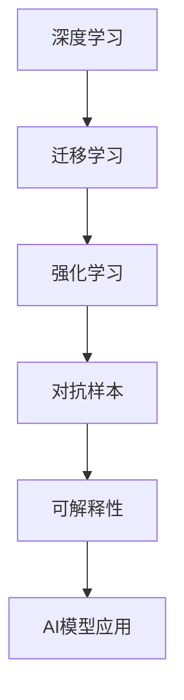
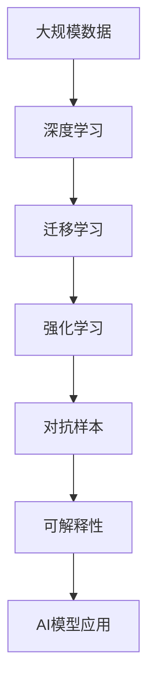

                 

# Andrej Karpathy：人工智能的未来发展规划

在人工智能(AI)领域，Andrej Karpathy无疑是其中的佼佼者之一。作为OpenAI的副总裁、斯坦福大学的教授，Karpathy在深度学习、计算机视觉和机器人领域做出了众多开创性的贡献。近日，Karpathy在斯坦福大学HAI的“人工智能的未来发展规划”讲座中，分享了未来AI发展的五个关键方向，本文将对此进行详细解读，供读者参考。

## 1. 背景介绍

### 1.1 问题由来
人工智能领域正处于快速发展期，AI技术在各行各业的应用前景广阔。但同时，AI技术也面临着诸多挑战，如数据隐私、算法透明度、伦理道德等问题。如何更好地应对这些挑战，引领AI技术的未来发展，成为当下学界和产业界关注的焦点。

### 1.2 问题核心关键点
Andrej Karpathy在讲座中强调，未来AI的发展方向需要在数据、模型、算法、伦理和应用等多个层面进行全面革新。只有将技术创新与实际应用需求紧密结合，才能实现AI技术的可持续发展。

### 1.3 问题研究意义
未来AI技术的发展将深刻影响人类社会的各个方面，从医疗、教育到交通、安全，无所不在。如何在满足技术进步的同时，确保其安全、公正、透明，成为一项重要的使命。Karpathy的讲座旨在为AI开发者和研究者提供未来发展的路线图，为AI技术的健康发展指明方向。

## 2. 核心概念与联系

### 2.1 核心概念概述

本节将介绍几个与未来AI发展密切相关的核心概念：

- **深度学习(Deep Learning)**：基于神经网络的机器学习方法，通过多层非线性变换提取数据的特征表示，广泛应用于图像识别、语音识别、自然语言处理等领域。
- **强化学习(Reinforcement Learning, RL)**：通过智能体与环境的交互，学习最优的策略，实现自主决策和行为优化。
- **迁移学习(Transfer Learning)**：将一个领域学习到的知识，迁移到另一个相关领域的知识获取和任务执行中，减少数据和计算的消耗。
- **对抗样本(Adversarial Examples)**：恶意设计的输入样本，能够导致机器学习模型的输出偏离正常值，对模型的鲁棒性提出严峻挑战。
- **可解释性(Explainability)**：描述AI模型的决策逻辑，提高模型的透明度和可信度，尤其是在金融、医疗等高风险领域。

### 2.2 概念间的关系

这些核心概念之间的关系可以用以下Mermaid流程图表示：

这个流程图展示了深度学习、迁移学习、强化学习、对抗样本和可解释性五个概念之间的相互关系。深度学习为迁移学习、强化学习和对抗样本提供了基础技术支撑，而可解释性则是对这些技术应用效果的补充和优化。

### 2.3 核心概念的整体架构

大语言模型和大规模数据训练

通过这张综合流程图，我们可以看到，未来AI的发展将离不开深度学习、迁移学习、强化学习、对抗样本和可解释性五大关键技术。它们共同构成了一个完整的AI技术体系，为AI技术的广泛应用提供了坚实的技术基础。

## 3. 核心算法原理 & 具体操作步骤
### 3.1 算法原理概述

未来AI的发展将在数据、模型、算法、伦理和应用五个方面展开，以下将详细介绍每个方向的算法原理和具体操作步骤。

### 3.2 算法步骤详解

**1. 数据层面的革新**

- **数据隐私保护**：通过差分隐私、联邦学习等技术，保护数据隐私和安全，减少数据泄露风险。
- **数据增强和合成**：利用数据增强、数据合成技术，扩充训练数据集，提高模型泛化能力。
- **多源数据融合**：将多个数据源的数据进行融合，提高数据的代表性和多样性。

**2. 模型层面的革新**

- **多模态融合**：将图像、语音、文本等多种模态的数据进行融合，提升模型的全面感知能力。
- **模型压缩和加速**：利用模型剪枝、量化、蒸馏等技术，减少模型参数量，提高推理效率。
- **自适应模型**：根据环境变化和任务需求，动态调整模型参数，提升模型的适应性和鲁棒性。

**3. 算法层面的革新**

- **对抗训练**：通过对抗样本训练，提高模型的鲁棒性，防止模型被恶意攻击。
- **强化学习优化**：通过强化学习算法，优化模型的决策策略，提高自主决策能力。
- **无监督学习**：利用无监督学习算法，发现数据中的潜在结构和规律，提高模型泛化能力。

**4. 伦理层面的革新**

- **公平性算法**：设计公平性算法，减少模型偏见，保障各群体权益。
- **透明性和可解释性**：开发可解释性算法，提高模型的透明度，便于用户理解和信任。
- **隐私保护算法**：利用隐私保护算法，确保数据隐私和安全。

**5. 应用层面的革新**

- **跨领域应用**：将AI技术应用于不同领域，如医疗、金融、教育等，解决实际问题。
- **普惠AI**：将AI技术普及到更广泛的群体，确保更多人受益于AI技术。
- **可持续发展**：确保AI技术的可持续发展，减少对环境的影响。

### 3.3 算法优缺点

未来AI的发展方向需要在数据、模型、算法、伦理和应用等多个层面进行全面革新。以下是对这些方向优缺点的详细分析：

**数据层面**

- **优点**：通过数据增强和合成技术，可以提高模型的泛化能力，增强模型的鲁棒性。
- **缺点**：数据隐私保护和合成数据的质量控制仍然是一个难题，数据泄露和数据噪声等问题需要持续关注。

**模型层面**

- **优点**：多模态融合和自适应模型可以提高模型的全面感知能力和适应性。
- **缺点**：模型压缩和加速技术仍需在精度和效率之间找到平衡，模型的解释性和可理解性仍需提升。

**算法层面**

- **优点**：对抗训练和无监督学习可以提高模型的鲁棒性和泛化能力。
- **缺点**：强化学习算法仍需进一步优化，其复杂度和计算资源消耗仍是一个挑战。

**伦理层面**

- **优点**：公平性和隐私保护算法可以提高模型的透明度和可信度。
- **缺点**：如何设计高效的公平性和隐私保护算法，仍然是一个研究难点。

**应用层面**

- **优点**：跨领域应用和普惠AI可以拓展AI技术的应用范围，提升用户体验。
- **缺点**：如何确保AI技术的可持续发展，仍需更多研究和实践。

### 3.4 算法应用领域

未来AI技术将在多个领域得到广泛应用，以下是具体的应用场景：

**医疗领域**

- **影像诊断**：通过深度学习模型分析医学影像，实现自动化的疾病诊断。
- **个性化治疗**：利用强化学习算法，实现个性化的医疗方案设计。
- **药物研发**：利用深度学习模型预测新药的疗效和副作用，加速药物研发进程。

**金融领域**

- **风险评估**：通过深度学习模型分析金融数据，进行风险预测和评估。
- **自动化交易**：利用强化学习算法，设计自动化的交易策略。
- **欺诈检测**：利用深度学习模型检测异常交易行为，防止欺诈。

**教育领域**

- **智能辅导**：通过深度学习模型分析学生的学习行为，提供个性化的辅导方案。
- **语言学习**：利用自然语言处理技术，提高语言学习效率。
- **智能评价**：利用深度学习模型进行自动化的学生评价和反馈。

**交通领域**

- **自动驾驶**：利用计算机视觉和强化学习技术，实现自动驾驶。
- **交通管理**：通过深度学习模型分析交通数据，优化交通管理策略。
- **安全监控**：利用计算机视觉技术，实现实时交通监控和安全预警。

## 4. 数学模型和公式 & 详细讲解 & 举例说明

### 4.1 数学模型构建

在AI的发展中，数学模型起着至关重要的作用。以下是几个核心模型的构建方法：

**1. 深度神经网络**

- **构建过程**：深度神经网络由多个神经网络层组成，每层包含多个神经元，通过多层非线性变换提取数据的特征表示。
- **公式表示**：
  $$
  f(x) = W_n \sigma(W_{n-1} \sigma(\ldots W_1 x \ldots))
  $$
  其中，$W$ 为权重矩阵，$\sigma$ 为激活函数。

**2. 对抗样本**

- **构建过程**：对抗样本通过添加微小扰动，使得模型输出偏离正常值，从而欺骗模型。
- **公式表示**：
  $$
  x' = x + \delta
  $$
  其中，$x$ 为原始样本，$\delta$ 为微小扰动。

**3. 强化学习**

- **构建过程**：强化学习通过智能体与环境的交互，学习最优的策略。
- **公式表示**：
  $$
  Q(s, a) = r + \gamma \max_a Q'(s', a')
  $$
  其中，$s$ 为状态，$a$ 为动作，$r$ 为奖励，$Q$ 为Q值函数，$Q'$ 为下一个状态的Q值函数。

### 4.2 公式推导过程

**1. 深度神经网络**

- **推导过程**：
  $$
  \begin{aligned}
  z^{[l]} &= W^{[l]} h^{[l-1]} + b^{[l]} \\
  h^{[l]} &= \sigma(z^{[l]})
  \end{aligned}
  $$
  其中，$z^{[l]}$ 为第$l$层的输入，$W^{[l]}$ 和 $b^{[l]}$ 为权重和偏置，$h^{[l]}$ 为第$l$层的输出，$\sigma$ 为激活函数。

**2. 对抗样本**

- **推导过程**：
  $$
  \begin{aligned}
  \delta &= \nabla_x f(x) \\
  x' &= x + \delta
  \end{aligned}
  $$
  其中，$\delta$ 为对抗样本的扰动，$\nabla_x f(x)$ 为模型$f(x)$对输入$x$的梯度。

**3. 强化学习**

- **推导过程**：
  $$
  Q(s, a) = r + \gamma \max_a Q'(s', a')
  $$
  其中，$Q(s, a)$ 为策略$Q$值，$r$ 为奖励，$Q'(s', a')$ 为下一个状态的策略$Q$值函数，$\gamma$ 为折扣因子。

### 4.3 案例分析与讲解

**案例1：深度神经网络**

- **背景**：卷积神经网络(Convolutional Neural Networks, CNN)在图像识别任务中取得了优异表现。
- **分析**：CNN通过卷积层、池化层和全连接层，提取图像特征，并通过多层非线性变换，学习图像的高级特征表示。

**案例2：对抗样本**

- **背景**：对抗样本在攻击深度学习模型中起到了重要作用。
- **分析**：通过对抗样本，攻击者可以欺骗模型，导致模型输出错误的结果。对抗样本的生成方法包括FGSM、PGD等，其核心思想是利用梯度反向传播技术，生成对模型输入的微小扰动，从而让模型产生误判。

**案例3：强化学习**

- **背景**：强化学习在自动驾驶、游戏AI等领域取得了成功。
- **分析**：在自动驾驶中，智能体需要根据环境变化，选择最优的驾驶策略。强化学习通过奖励机制，指导智能体不断优化策略，提高决策能力。

## 5. Andrej Karpathy的讲座要点总结

Andrej Karpathy的讲座主要围绕未来AI技术的五个关键方向展开，以下是对讲座要点的详细总结：

**1. 数据隐私保护**

- **目标**：通过差分隐私、联邦学习等技术，保护数据隐私和安全。
- **方法**：差分隐私通过向数据中随机添加噪声，保护个体隐私；联邦学习通过分布式训练，减少数据泄露风险。

**2. 数据增强和合成**

- **目标**：扩充训练数据集，提高模型泛化能力。
- **方法**：数据增强通过扩充数据集，减少过拟合；数据合成通过生成模拟数据，丰富数据集的多样性。

**3. 多模态融合**

- **目标**：提升模型的全面感知能力。
- **方法**：多模态融合通过将图像、语音、文本等多种模态的数据进行融合，提高模型的感知能力。

**4. 模型压缩和加速**

- **目标**：减少模型参数量，提高推理效率。
- **方法**：模型压缩通过剪枝、量化等技术，减少模型参数量；加速通过模型蒸馏、分布式训练等技术，提高推理效率。

**5. 自适应模型**

- **目标**：提高模型的适应性和鲁棒性。
- **方法**：自适应模型通过动态调整模型参数，根据环境变化和任务需求，提升模型的适应性和鲁棒性。

## 6. 实际应用场景

### 6.1 医疗领域

**案例1：影像诊断**

- **技术**：深度学习
- **背景**：医学影像的自动化诊断具有重要意义，可以显著提高诊断效率和准确性。
- **分析**：通过深度学习模型，可以自动分析医学影像，检测肿瘤、病灶等异常情况，辅助医生进行诊断。

**案例2：个性化治疗**

- **技术**：强化学习
- **背景**：个性化治疗可以提高治疗效果，减少副作用。
- **分析**：通过强化学习算法，可以根据患者的基因信息、病史等数据，设计个性化的治疗方案，提高治疗效果。

**案例3：药物研发**

- **技术**：深度学习
- **背景**：新药研发是一个漫长而昂贵的过程。
- **分析**：通过深度学习模型，可以预测新药的疗效和副作用，加速药物研发进程。

### 6.2 金融领域

**案例1：风险评估**

- **技术**：深度学习
- **背景**：金融领域的数据量庞大，风险评估尤为重要。
- **分析**：通过深度学习模型，可以分析金融数据，进行风险预测和评估，帮助投资者做出明智决策。

**案例2：自动化交易**

- **技术**：强化学习
- **背景**：金融市场变化迅速，自动化交易可以显著提高交易效率和收益。
- **分析**：通过强化学习算法，可以设计自动化的交易策略，提高交易效率和收益。

**案例3：欺诈检测**

- **技术**：深度学习
- **背景**：金融欺诈现象普遍存在，需要实时检测和防范。
- **分析**：通过深度学习模型，可以检测异常交易行为，防止欺诈，保护用户利益。

### 6.3 教育领域

**案例1：智能辅导**

- **技术**：深度学习
- **背景**：教育资源分配不均，个性化教育需求日益增长。
- **分析**：通过深度学习模型，可以分析学生的学习行为，提供个性化的辅导方案，提高学习效果。

**案例2：语言学习**

- **技术**：自然语言处理
- **背景**：语言学习是一个漫长的过程，需要高效、个性化的学习工具。
- **分析**：通过自然语言处理技术，可以提高语言学习效率，帮助用户掌握多种语言。

**案例3：智能评价**

- **技术**：深度学习
- **背景**：传统教育评价方式存在主观性和效率低下的问题。
- **分析**：通过深度学习模型，可以进行自动化的学生评价和反馈，提高评价的客观性和效率。

### 6.4 交通领域

**案例1：自动驾驶**

- **技术**：计算机视觉、强化学习
- **背景**：自动驾驶技术可以显著提高交通效率和安全性。
- **分析**：通过计算机视觉和强化学习技术，可以实现自动驾驶，提高交通效率和安全性。

**案例2：交通管理**

- **技术**：深度学习
- **背景**：交通管理是城市管理的重要环节。
- **分析**：通过深度学习模型，可以分析交通数据，优化交通管理策略，提高交通效率。

**案例3：安全监控**

- **技术**：计算机视觉
- **背景**：实时交通监控和安全预警是城市安全的重要保障。
- **分析**：通过计算机视觉技术，可以实现实时交通监控和安全预警，提高城市安全水平。

## 7. 工具和资源推荐

### 7.1 学习资源推荐

为了帮助开发者系统掌握未来AI的发展方向，以下是几本推荐书籍：

**1. 《深度学习》**：Ian Goodfellow等著，系统介绍了深度学习的基础理论和应用。

**2. 《强化学习：一种现代方法》**：Richard S. Sutton等著，全面介绍了强化学习的基础理论和算法。

**3. 《AI数据科学手册》**：Paula M. B.virta等著，介绍了AI数据科学的全流程，包括数据获取、清洗、建模和应用。

**4. 《计算机视觉：模型、学习与推理》**：A. R. Zisserman等著，介绍了计算机视觉的多个重要领域。

**5. 《机器学习：理论与算法》**：Tom Mitchell等著，系统介绍了机器学习的基础理论和算法。

### 7.2 开发工具推荐

为了提高AI开发的效率和效果，以下是一些推荐的开发工具：

**1. PyTorch**：基于Python的深度学习框架，提供了丰富的深度学习模型和优化算法。

**2. TensorFlow**：由Google开发的深度学习框架，支持分布式训练和模型部署。

**3. Jupyter Notebook**：交互式编程环境，支持Python、R等多种语言，便于编写和调试代码。

**4. Keras**：高级深度学习框架，提供简单易用的API，适合快速原型开发。

**5. Google Colab**：由Google提供的免费在线Jupyter Notebook环境，支持GPU和TPU计算资源，方便快速迭代实验。

### 7.3 相关论文推荐

以下是几篇未来AI发展方向的重要论文，推荐阅读：

**1. "Google's AlphaGo Zero"**：DeepMind的研究论文，介绍了AlphaGo Zero在零样本学习中的出色表现。

**2. "End-to-End Learning for Eye Gaze Estimation and Fixation Prediction"**：Berkeley的研究论文，介绍了使用深度学习模型进行眼动分析的方法。

**3. "Training GANs with Limited Data"**：Oxford的研究论文，介绍了如何使用GAN生成数据，提升模型的泛化能力。

**4. "A Limit to the Model Complexity in Gradient-Based Learning of Deep Architectures"**：Szegedy等著，探讨了深度学习模型的复杂度和性能之间的关系。

**5. "Rethinking Adversarial Examples"**：Madry等著，介绍了对抗样本的生成和防御方法。

## 8. 总结：未来发展趋势与挑战

### 8.1 研究成果总结

未来AI技术将在数据、模型、算法、伦理和应用五个方向进行全面革新。以下是几个关键研究成果的总结：

**1. 数据隐私保护**

- **成果**：差分隐私、联邦学习等技术的应用，提升了数据隐私保护的力度。
- **意义**：保护用户数据隐私，减少数据泄露风险。

**2. 数据增强和合成**

- **成果**：数据增强和数据合成技术的应用，提高了模型的泛化能力。
- **意义**：扩充训练数据集，提升模型的泛化能力。

**3. 多模态融合**

- **成果**：多模态融合技术的应用，提高了模型的全面感知能力。
- **意义**：提升模型的感知能力，拓展应用范围。

**4. 模型压缩和加速**

- **成果**：模型压缩和加速技术的应用，提高了模型的推理效率。
- **意义**：减少模型参数量，提高推理效率。

**5. 自适应模型**

- **成果**：自适应模型技术的应用，提高了模型的适应性和鲁棒性。
- **意义**：增强模型的适应性和鲁棒性，提升模型的实际应用效果。

### 8.2 未来发展趋势

未来AI技术将在数据、模型、算法、伦理和应用五个方向继续革新，以下是一些关键趋势：

**1. 数据隐私保护**

- **趋势**：差分隐私、联邦学习等技术将得到更广泛的应用。
- **意义**：保护用户数据隐私，减少数据泄露风险。

**2. 数据增强和合成**

- **趋势**：数据增强和数据合成技术将得到更深入的研究和应用。
- **意义**：扩充训练数据集，提升模型的泛化能力。

**3. 多模态融合**

- **趋势**：多模态融合技术将得到更广泛的应用。
- **意义**：提升模型的全面感知能力，拓展应用范围。

**4. 模型压缩和加速**

- **趋势**：模型压缩和加速技术将得到更深入的研究和应用。
- **意义**：减少模型参数量，提高推理效率。

**5. 自适应模型**

- **趋势**：自适应模型技术将得到更广泛的应用。
- **意义**：增强模型的适应性和鲁棒性，提升模型的实际应用效果。

### 8.3 面临的挑战

未来AI技术的发展仍面临诸多挑战，以下是一些关键挑战的总结：

**1. 数据隐私保护**

- **挑战**：如何设计高效的隐私保护算法，保护用户数据隐私。
- **意义**：确保用户数据隐私安全，提升用户信任度。

**2. 数据增强和合成**

- **挑战**：如何生成高质量的数据增强和合成数据，避免数据噪声。
- **意义**：确保数据增强和合成的有效性，提升模型的泛化能力。

**3. 多模态融合**

- **挑战**：如何高效融合多种模态的数据，避免信息丢失。
- **意义**：确保多模态融合的有效性，提升模型的感知能力。

**4. 模型压缩和加速**

- **挑战**：如何平衡模型压缩和加速的效果，确保模型精度。
- **意义**：确保模型压缩和加速的效果，提高推理效率。

**5. 自适应模型**

- **挑战**：如何设计高效的自适应模型，增强模型的适应性和鲁棒性。
- **意义**：确保自适应模型的有效性，提升模型的实际应用效果。

### 8.4 研究展望

未来AI技术的研究将集中在以下几个方面：

**1. 隐私保护算法**

- **方向**：设计高效的差分隐私和联邦学习算法，保护用户数据隐私。

**2. 数据增强和合成**

- **方向**：生成高质量的数据增强和合成数据，提升模型的泛化能力。

**3. 多模态融合**

- **方向**：高效融合多种模态的数据，提升模型的感知能力。

**4. 模型压缩和加速**

- **方向**：平衡模型压缩和加速的效果，提高推理效率。

**5. 自适应模型**

- **方向**：设计高效的自适应模型，增强模型的适应性和鲁棒性。

## 9. 附录：常见问题与解答

### 9.1 数据隐私保护

**Q1：如何保护用户数据隐私？**

A: 差分隐私和联邦学习是两种常见的数据隐私保护技术。差分隐私通过向数据中随机添加噪声，保护个体隐私；联邦学习通过分布式训练，减少数据泄露风险。

**Q2：什么是差分隐私？**

A: 差分隐私是一种保护用户数据隐私的技术，通过向数据中随机添加噪声，保护个体隐私，同时确保数据可用性。

### 9.2 数据增强和合成

**Q1：数据增强技术有哪些？**

A: 数据增强技术包括随机裁剪、旋转、缩放、噪声注入等。这些技术可以扩充训练数据集，减少过拟合。

**Q2：数据合成技术有哪些？**

A: 数据合成技术包括GAN生成、自适应合成等。这些技术可以生成高质量的模拟数据，丰富数据集的多样性。

### 9.3 多模态融合

**Q1：多模态融合有哪些技术？**

A: 多模态融合技术包括特征融合、协同训练等。这些技术可以提升模型的全面感知能力，拓展应用范围。

**Q2：多模态融合的难点是什么？**

A: 多模态融合的难点在于如何高效融合多种模态的数据，避免信息丢失。

### 9.4 模型压缩和加速

**Q1：模型压缩技术有哪些？**

A: 模型压缩技术包括剪枝、量化、蒸馏等。这些技术可以减小模型参数量，提高推理效率。

**Q2：模型加速技术有哪些？**

A: 模型加速技术包括混合精度训练、模型并行等。这些技术可以优化模型结构，提升推理速度。

### 9.5 自适应模型

**Q1：自适应模型有哪些技术？**

A: 自适应模型包括自适应神经网络、自适应蒸馏等。这些技术可以动态调整模型参数，提升模型的适应性和鲁棒性。

**Q2：自适应模型的难点是什么？**

A: 自适应模型的难点在于如何在保证精度的同时，提升模型的适应性和鲁棒性。

---

作者：禅与计算机程序设计艺术 / Zen and the Art of Computer Programming

