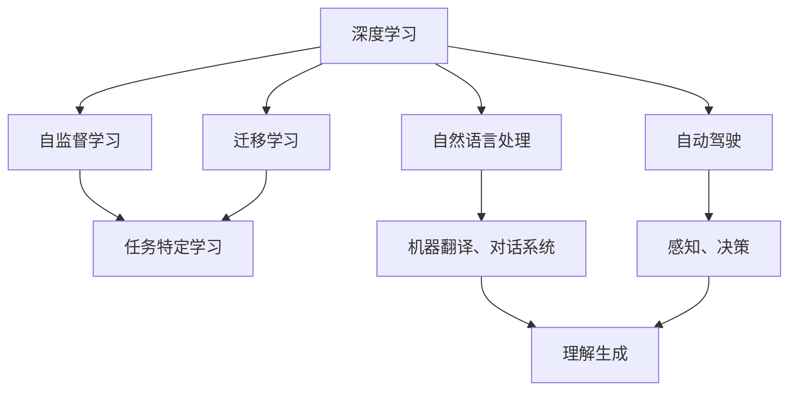

                 

# Andrej Karpathy：人工智能的未来发展趋势

## 1. 背景介绍

在人工智能的广阔领域，Andrej Karpathy 是一位备受瞩目的研究者和实践者。他不仅是计算机视觉领域的杰出专家，还对深度学习、自然语言处理、自动驾驶等多个方向有着深入的见解和创新。Andrej Karpathy 的诸多研究成果，为人工智能的发展开辟了新的道路，引领了技术的未来趋势。本文将全面介绍 Andrej Karpathy 在人工智能领域的见解，并分析其对未来技术发展的预测和展望。

## 2. 核心概念与联系

### 2.1 核心概念概述

Andrej Karpathy 在其学术和工程生涯中，提出了许多重要概念，其中最核心的是深度学习、自监督学习、迁移学习、自动驾驶等。这些概念之间的联系，构成了他对于人工智能未来发展的深入理解。

- **深度学习**：通过构建多层次的非线性模型，深度学习能够自动从数据中学习到复杂特征，从而实现高效的任务解算。Karpathy 是深度学习的重要推动者之一，他在计算机视觉和自然语言处理领域推广了这一技术。

- **自监督学习**：无需人工标注的数据集，通过利用数据之间的内在关系，自监督学习能够从大规模未标注数据中自动学习到表示，提升模型性能。Karpathy 的工作，如在计算机视觉中使用大规模自监督预训练，显著提高了模型在特定任务上的表现。

- **迁移学习**：通过在源任务上预训练模型，再微调用于新任务，迁移学习能够显著提升模型在新任务上的表现，减少标注需求。Karpathy 在自动驾驶等任务上，就通过迁移学习策略提升了模型的泛化能力。

### 2.2 概念间的关系

Andrej Karpathy 的研究，展现了一幅深度学习技术发展的全景图。这些核心概念之间的联系，可以通过以下 Mermaid 流程图来展示：



这个流程图展示了深度学习技术如何在不同应用场景中发挥作用。自监督学习帮助模型在未标注数据上预训练，迁移学习通过在源任务上学习，提升新任务的表现，自动驾驶和自然语言处理则展示了深度学习在这些特定领域的应用。

## 3. 核心算法原理 & 具体操作步骤

### 3.1 算法原理概述

Andrej Karpathy 对于深度学习算法的理解和改进，为人工智能技术的发展做出了重要贡献。其核心思想是通过构建深度神经网络，自动从数据中学习到复杂的表示，从而实现高效的任务解算。具体而言，深度学习算法通过反向传播算法，不断优化模型参数，使得模型输出逼近真实标签。自监督学习则通过利用数据的内在关系，在不使用标签的情况下，自动学习到表示。迁移学习则通过在源任务上预训练，再微调用于新任务，提升模型在新任务上的表现。

### 3.2 算法步骤详解

1. **数据准备**：收集并预处理数据集，分为训练集、验证集和测试集。

2. **模型构建**：选择合适的深度学习模型，并进行必要的初始化。

3. **自监督预训练**：在未标注数据上，通过自监督学习任务（如掩码语言模型、自回归等）进行预训练，学习到模型参数的初始表示。

4. **迁移学习**：在特定任务上，使用迁移学习策略，对预训练模型进行微调，适应任务特定的要求。

5. **任务特定学习**：对微调后的模型进行进一步优化，以提升模型在特定任务上的表现。

### 3.3 算法优缺点

- **优点**：深度学习算法在处理大规模数据时表现出色，自监督学习能够在无标注数据上进行预训练，迁移学习则能够提升新任务的表现。

- **缺点**：深度学习模型复杂度较高，训练时间长，对硬件资源要求高。自监督学习在处理复杂任务时效果有限，迁移学习需要大量标注数据，任务特定学习依赖于大量标记数据。

### 3.4 算法应用领域

深度学习算法在多个领域得到了广泛应用，如计算机视觉、自然语言处理、自动驾驶、游戏AI等。自监督学习在无标注数据预训练中表现优异，适用于数据标注成本高、标注样本少的场景。迁移学习则在多任务场景中表现良好，能够通过少量标注数据提升模型性能。任务特定学习则在特定任务上进一步优化，提升模型精度。

## 4. 数学模型和公式 & 详细讲解 & 举例说明

### 4.1 数学模型构建

Andrej Karpathy 的研究中，深度学习模型的数学建模是核心之一。以下是一个典型的深度学习模型的数学表达：

$$
L(\theta) = \frac{1}{N} \sum_{i=1}^{N} L_i(\theta)
$$

其中，$L$ 是总损失函数，$\theta$ 是模型参数，$N$ 是样本数量，$L_i(\theta)$ 是第 $i$ 个样本的损失函数。

### 4.2 公式推导过程

以自监督学习的掩码语言模型为例，其数学推导如下：

$$
\max_{\theta} \frac{1}{N} \sum_{i=1}^{N} - \sum_{j=1}^{T} y_{i,j} \log P(x_i, j)
$$

其中，$y_{i,j}$ 是第 $i$ 个样本第 $j$ 个位置的掩码标签，$P(x_i, j)$ 是模型在输入 $x_i$ 下，预测第 $j$ 个位置是否被掩码的概率。

### 4.3 案例分析与讲解

以自动驾驶中的感知任务为例，自监督学习可以通过从大规模无标注图像中学习到基本的视觉特征，然后在特定任务上微调这些特征，提升感知性能。具体而言，可以先在大规模图像数据上进行自监督学习，如使用自回归模型预测未掩码像素值，然后在自动驾驶任务上，通过微调感知模型，学习到更加复杂的道路和交通规则表示，提升感知性能。

## 5. 项目实践：代码实例和详细解释说明

### 5.1 开发环境搭建

1. 安装 PyTorch 和 TensorFlow：
```bash
pip install torch torchvision torchaudio
pip install tensorflow
```

2. 搭建 GPU 环境：
```bash
conda install -c pytorch pytorch torchvision torchaudio
```

3. 安装必要的库：
```bash
pip install numpy pandas sklearn matplotlib tqdm jupyter notebook
```

### 5.2 源代码详细实现

以下是一个基于深度学习的自监督学习项目的示例代码，展示自回归模型的实现：

```python
import torch
import torch.nn as nn
import torch.optim as optim
from torch.utils.data import DataLoader

class AutoRegModel(nn.Module):
    def __init__(self, input_size, hidden_size, output_size):
        super(AutoRegModel, self).__init__()
        self.rnn = nn.GRU(input_size, hidden_size)
        self.fc = nn.Linear(hidden_size, output_size)
    
    def forward(self, x, mask):
        x = self.rnn(x)
        x = self.fc(x)
        return x
    
    def loss(self, x, mask, y):
        loss = torch.sum(-y * torch.log(x))
        return loss / mask.sum()
    
    def train(self, train_loader, num_epochs, learning_rate):
        optimizer = optim.Adam(self.parameters(), lr=learning_rate)
        criterion = nn.MSELoss()
        for epoch in range(num_epochs):
            total_loss = 0
            for batch in train_loader:
                x, y, mask = batch
                optimizer.zero_grad()
                y_pred = self.forward(x, mask)
                loss = self.loss(y_pred, mask, y)
                loss.backward()
                optimizer.step()
                total_loss += loss.item()
            print('Epoch %d, loss: %.4f' % (epoch+1, total_loss/len(train_loader)))

# 使用数据加载器加载数据集
train_dataset = ...
train_loader = DataLoader(train_dataset, batch_size=32, shuffle=True)
```

### 5.3 代码解读与分析

- `AutoRegModel` 类定义了自回归模型的结构，包括 GRU 层和全连接层。
- `forward` 方法定义了模型的前向传播过程。
- `loss` 方法定义了模型的损失函数。
- `train` 方法实现了模型训练过程，包括前向传播、反向传播、优化器更新等。

## 6. 实际应用场景

### 6.1 自动驾驶

在自动驾驶领域，Karpathy 的工作对感知和决策任务的提升起到了重要作用。他提出的自监督学习方法，能够从大规模无标注图像中学习到基本的视觉特征，然后在特定任务上微调这些特征，提升感知性能。此外，Karpathy 还研究了强化学习在自动驾驶中的应用，通过行为克隆和模仿学习策略，提升自动驾驶系统的鲁棒性和安全性。

### 6.2 计算机视觉

Karpathy 在计算机视觉领域的研究，尤其是在自动驾驶中的视觉感知和语义理解方面，取得了重要进展。他开发了自监督学习算法，如 Masked Autoencoders 和 Colorization，帮助模型从无标注数据中学习到高质量的特征表示。此外，Karpathy 还研究了迁移学习策略，通过在大规模视觉数据上预训练，提升模型在特定任务上的表现。

### 6.3 自然语言处理

在自然语言处理领域，Karpathy 的研究主要集中在机器翻译和对话系统。他开发了基于深度学习的序列到序列模型，如 Attention-based Models，显著提升了机器翻译和对话系统的性能。Karpathy 还研究了预训练语言模型的迁移学习，通过在大规模语料上预训练，再针对特定任务微调，提升了模型在机器翻译和对话系统中的表现。

## 7. 工具和资源推荐

### 7.1 学习资源推荐

- **Coursera 课程**：Karpathy 在 Coursera 上开设的《Deep Learning》课程，是深度学习领域的经典课程，适合初学者和进阶者学习。
- **arXiv 论文预印本**：Karpathy 的研究论文大多在 arXiv 上发布，可以通过阅读其论文，了解其最新的研究成果和思想。
- **GitHub 仓库**：Karpathy 在 GitHub 上维护了大量深度学习项目，通过阅读其代码，可以了解其技术实现细节。

### 7.2 开发工具推荐

- **PyTorch**：Karpathy 的研究工作多使用 PyTorch 框架，因此掌握 PyTorch 是必须的。
- **TensorFlow**：TensorFlow 是另一款深度学习框架，广泛应用于自然语言处理和计算机视觉领域。
- **Jupyter Notebook**：Karpathy 的工作多使用 Jupyter Notebook 进行开发，适合进行代码迭代和实验。

### 7.3 相关论文推荐

- **Visual Geometry Albedo and Reflectance**：Karpathy 研究的文章，展示了深度学习在计算机视觉中的广泛应用。
- **Neural Machine Translation by Jointly Learning to Align and Translate**：Karpathy 的机器翻译研究，展示了深度学习在自然语言处理中的应用。
- **An End-to-End Learning Framework for Self-Driving Cars**：Karpathy 自动驾驶研究，展示了深度学习在自动驾驶中的应用。

## 8. 总结：未来发展趋势与挑战

### 8.1 研究成果总结

Andrej Karpathy 的研究工作，涵盖了深度学习、自监督学习、迁移学习、自动驾驶等多个领域，为人工智能技术的发展做出了重要贡献。他在计算机视觉和自然语言处理领域的创新，推动了技术的进步，提升了模型的性能。

### 8.2 未来发展趋势

- **深度学习算法的发展**：未来深度学习算法将继续演进，通过更加复杂的模型结构，提升模型性能和泛化能力。
- **自监督学习的进步**：自监督学习将继续在无标注数据预训练中发挥重要作用，提升模型的泛化能力和鲁棒性。
- **迁移学习的应用**：迁移学习将在更多领域得到应用，通过在源任务上预训练，提升新任务的表现。

### 8.3 面临的挑战

- **算力需求高**：深度学习算法复杂度高，对硬件资源要求高，未来需要更加高效的算法和硬件支持。
- **数据标注成本高**：深度学习模型在特定任务上微调时，需要大量标注数据，未来需要降低数据标注成本，提升数据利用率。
- **模型鲁棒性不足**：深度学习模型面临过拟合和鲁棒性不足的问题，未来需要进一步提高模型泛化能力和鲁棒性。

### 8.4 研究展望

未来，人工智能技术将在更多领域得到应用，如智慧医疗、智能制造、智能城市等。深度学习算法和自监督学习将继续推动技术发展，提升模型的性能和泛化能力。同时，迁移学习将在更多领域得到应用，通过在源任务上预训练，提升新任务的表现。此外，如何降低数据标注成本，提升数据利用率，将是未来研究的重要方向。最后，提高模型鲁棒性和泛化能力，也是未来研究的重要课题。

## 9. Andrej Karpathy 的工作对未来人工智能的影响

Andrej Karpathy 的研究工作，展示了深度学习技术在多个领域的应用潜力，推动了人工智能技术的发展。通过自监督学习和迁移学习策略，他在计算机视觉和自然语言处理领域取得了重要进展。同时，在自动驾驶领域，他开发了基于深度学习的感知和决策算法，展示了深度学习在自动驾驶中的应用潜力。

未来，深度学习技术将继续演进，自监督学习将在更多领域得到应用，迁移学习也将成为重要的研究范式。同时，如何降低数据标注成本，提升模型鲁棒性和泛化能力，将是未来研究的重要方向。Andrej Karpathy 的工作，为我们提供了宝贵的经验和方法，相信未来的人工智能技术将在其推动下，实现更加广泛的应用和进步。

作者：禅与计算机程序设计艺术 / Zen and the Art of Computer Programming

