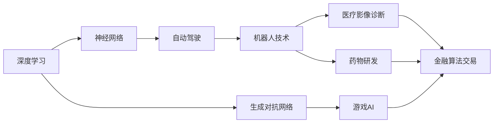
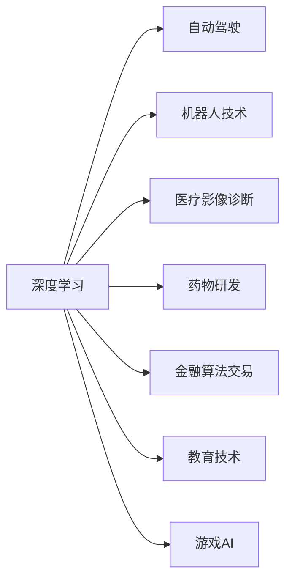
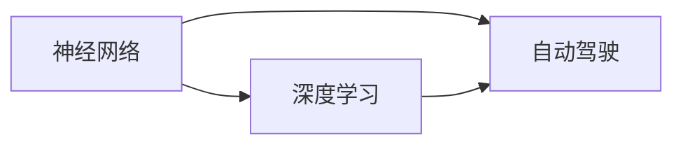
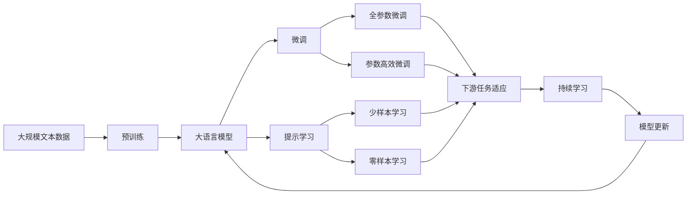

                 

# Andrej Karpathy：人工智能的未来应用场景

> 关键词：人工智能, 未来应用, 深度学习, 自动驾驶, 机器人, 医疗, 金融, 教育, 游戏

## 1. 背景介绍

### 1.1 问题由来

随着人工智能(AI)技术的飞速发展，深度学习(Deep Learning)已成为当前最前沿的AI研究领域之一。深度学习的核心技术是神经网络(Neural Networks)，它通过模拟人脑的神经元工作机制，使得计算机可以处理和理解复杂的非结构化数据，如语音、图像、文本等。深度学习技术在众多领域取得了突破性的进展，从自动驾驶、机器人、医疗到金融、教育、游戏等，AI正在改变人们的生活和工作方式。

Andrej Karpathy是深度学习领域的领军人物之一，他的研究主要集中在计算机视觉、自动驾驶和生成对抗网络(GANs)等领域。Karpathy的工作不仅推动了学术研究的发展，也促进了AI技术的实际应用。

### 1.2 问题核心关键点

Andrej Karpathy认为，未来AI技术将在以下几个方面取得重大进展：

1. **自动驾驶**：自动驾驶技术是AI领域最引人注目的应用之一。Karpathy在这方面有着深入的研究，他开发的AutoDrive系统已经成为特斯拉自动驾驶系统的核心技术之一。

2. **机器人技术**：Karpathy还关注机器人技术的进展，他研究如何让机器人更加智能化、自主化，能够适应复杂多变的环境。

3. **医疗应用**：AI在医疗领域的应用也备受关注。Karpathy通过深度学习模型，推动了医疗影像诊断、药物研发等方面的研究。

4. **金融领域**：Karpathy也在探索AI在金融领域的应用，如算法交易、风险评估等。

5. **教育**：Karpathy关注如何利用AI技术改进教育质量，他开发的DeepLearning.ai课程已成为全球数万人学习深度学习的平台。

6. **游戏AI**：在娱乐领域，Karpathy利用AI技术开发了《AI vs. Human》游戏，让计算机与人类在围棋、扑克等游戏中对抗，展示了AI在策略游戏中的应用潜力。

### 1.3 问题研究意义

Andrej Karpathy的研究不仅推动了深度学习技术的发展，还为AI技术在多个领域的实际应用提供了理论基础和实践范例。他的工作有助于加速AI技术的产业化进程，推动经济和社会的发展，具有重要的研究意义。

## 2. 核心概念与联系

### 2.1 核心概念概述

为更好地理解Andrej Karpathy的研究，本节将介绍几个密切相关的核心概念：

- **深度学习(Deep Learning)**：一种通过多层神经网络进行数据表示和分类的机器学习方法，能够处理和理解复杂的非结构化数据。
- **神经网络(Neural Networks)**：由多层神经元组成的计算模型，通过反向传播算法进行训练，学习数据的特征表示。
- **自动驾驶(Autonomous Driving)**：通过计算机视觉、深度学习和传感器技术，使车辆能够自主导航，减少交通事故和交通拥堵。
- **生成对抗网络(GANs)**：一种通过两个对抗网络进行生成和判别任务的技术，能够生成逼真的图像、视频等。
- **机器人(Robotics)**：利用传感器、控制器和执行器等组件，使机器人能够感知环境并执行任务。
- **医疗影像诊断(Medical Imaging Diagnosis)**：通过深度学习模型对医学影像进行分析和诊断，辅助医生进行疾病诊断和治疗。
- **药物研发(Pharmaceutical Drug Development)**：利用AI技术加速药物筛选和设计过程，提高新药研发效率。
- **金融算法交易(Financial Algorithmic Trading)**：利用AI技术进行算法交易，实现高频交易和风险管理。
- **教育技术(Education Technology)**：通过AI技术改进教育方法和资源，提高教学质量和效果。
- **游戏AI(Game AI)**：利用AI技术开发智能游戏角色和对手，提升游戏的交互性和趣味性。

这些核心概念之间的逻辑关系可以通过以下Mermaid流程图来展示：



这个流程图展示了深度学习、神经网络等核心概念与自动驾驶、机器人技术、医疗应用、金融算法交易、教育技术、游戏AI等多个AI应用领域的联系。

### 2.2 概念间的关系

这些核心概念之间存在着紧密的联系，形成了Andrej Karpathy的研究框架。下面我们通过几个Mermaid流程图来展示这些概念之间的关系。

#### 2.2.1 深度学习与AI应用的关系



这个流程图展示了深度学习技术在自动驾驶、机器人技术、医疗影像诊断、药物研发、金融算法交易、教育技术、游戏AI等多个领域的广泛应用。

#### 2.2.2 神经网络与深度学习的关系



这个流程图展示了神经网络是深度学习的基础组件，在自动驾驶等应用中发挥着重要作用。

#### 2.2.3 生成对抗网络与深度学习的关系


这个流程图展示了生成对抗网络是深度学习的一种重要技术，在游戏AI等领域有广泛应用。

### 2.3 核心概念的整体架构

最后，我们用一个综合的流程图来展示这些核心概念在大语言模型微调过程中的整体架构：



这个综合流程图展示了从预训练到微调，再到持续学习的完整过程。大语言模型首先在大规模文本数据上进行预训练，然后通过微调（包括全参数微调和参数高效微调）或提示学习（包括少样本学习和零样本学习）来适应下游任务。最后，通过持续学习技术，模型可以不断更新和适应新的任务和数据。

## 3. 核心算法原理 & 具体操作步骤
### 3.1 算法原理概述

Andrej Karpathy的研究主要集中在深度学习和生成对抗网络等领域。本节将介绍他的几个核心算法原理。

#### 3.1.1 深度学习中的反向传播算法

深度学习的核心技术是反向传播算法，通过梯度下降等优化算法，对神经网络进行训练。反向传播算法的原理是通过链式法则计算每个神经元对损失函数的导数，然后更新神经元的权重，使模型能够逐步逼近训练数据的真实分布。

#### 3.1.2 生成对抗网络

生成对抗网络由生成器和判别器两个网络组成，生成器通过优化损失函数生成逼真的数据，判别器则通过优化损失函数区分真实数据和生成数据。生成器和判别器相互对抗，使得生成器生成的数据越来越逼真，判别器越来越难以区分。

#### 3.1.3 自监督学习

自监督学习是一种利用无标签数据进行训练的方法。通过在无标签数据上设计预训练任务，使得模型学习到数据的潜在表示，然后在有标签数据上进行微调，提升模型的泛化能力和性能。自监督学习能够利用大规模未标记数据，加速模型的训练。

### 3.2 算法步骤详解

Andrej Karpathy的研究通常包括以下几个关键步骤：

**Step 1: 准备数据集和预训练模型**

- 选择合适的预训练模型，如VGG、ResNet等，作为初始化参数。
- 收集大规模未标记数据集，如ImageNet、CIFAR-10等，进行预训练。
- 对有标签数据集进行划分，划分为训练集、验证集和测试集。

**Step 2: 设计任务和损失函数**

- 根据具体应用场景设计合适的任务，如自动驾驶中的目标检测、机器人技术中的动作生成、医疗影像诊断中的疾病分类等。
- 选择合适的损失函数，如交叉熵损失、均方误差损失等，用于衡量模型输出与真实标签之间的差异。

**Step 3: 训练和优化**

- 使用反向传播算法和梯度下降等优化算法，对神经网络进行训练。
- 在训练过程中，使用自监督学习、生成对抗网络等技术，提升模型的泛化能力和性能。
- 在训练过程中，使用正则化技术，如L2正则、Dropout等，防止模型过拟合。

**Step 4: 微调和优化**

- 在预训练模型上设计任务适配层，将顶层输出与任务输出对应。
- 使用微调方法，如全参数微调、参数高效微调等，在少量有标签数据上优化模型。
- 使用提示学习等技术，在无标签数据上提升模型性能。

**Step 5: 评估和部署**

- 在测试集上评估模型性能，比较微调前后的效果。
- 将微调后的模型部署到实际应用中，如自动驾驶系统、机器人、医疗影像诊断系统等。
- 持续收集新数据，定期重新微调模型，保持模型的时效性和适应性。

以上是Andrej Karpathy研究的主要步骤，这些步骤在不同领域的应用中略有差异，但基本原理和方法是一致的。

### 3.3 算法优缺点

Andrej Karpathy的研究方法具有以下优点：

1. **高效性**：利用自监督学习和生成对抗网络技术，能够利用大规模未标记数据进行预训练，提高模型的泛化能力。
2. **泛化能力强**：通过设计合适的任务和损失函数，使得模型能够适应多种复杂的应用场景。
3. **可解释性高**：深度学习模型虽然复杂，但其结构和原理相对透明，易于理解和调试。

同时，这些方法也存在一些缺点：

1. **计算资源需求高**：深度学习和生成对抗网络需要大量的计算资源，包括高性能GPU和TPU等。
2. **模型复杂度高**：深度学习模型通常具有大量参数，训练和优化过程中容易出现过拟合和梯度消失等问题。
3. **数据依赖性强**：模型的训练和优化依赖于大规模数据集，数据质量对模型的性能有很大影响。

尽管存在这些缺点，但Andrej Karpathy的研究方法在多个领域取得了显著进展，展示了深度学习技术的强大潜力和应用价值。

### 3.4 算法应用领域

Andrej Karpathy的研究方法在以下领域得到了广泛应用：

- **自动驾驶**：自动驾驶系统利用深度学习和计算机视觉技术，实现车辆自主导航和避障等功能。
- **机器人技术**：机器人技术通过深度学习和动作生成等技术，实现智能导航、物体抓取和操作等功能。
- **医疗影像诊断**：深度学习模型在医学影像分析中，能够自动检测和分类肿瘤、病变等异常区域，辅助医生进行诊断和治疗。
- **药物研发**：深度学习技术在药物分子筛选和设计中，能够预测药物的活性和副作用，加速新药研发进程。
- **金融算法交易**：深度学习模型在算法交易中，能够进行高频交易和风险管理，提高交易效率和收益。
- **教育技术**：深度学习技术在教育领域中，能够开发智能辅导系统，个性化推荐学习内容和资源，提升教学效果。
- **游戏AI**：深度学习技术在游戏AI中，能够开发智能对手和角色，提升游戏的交互性和趣味性。

除了上述这些领域，Andrej Karpathy的研究还涉及计算机视觉、生成对抗网络等前沿技术，为AI技术的发展做出了重要贡献。

## 4. 数学模型和公式 & 详细讲解 & 举例说明

### 4.1 数学模型构建

Andrej Karpathy的研究主要集中在深度学习和生成对抗网络等领域。以下将介绍他的几个核心数学模型。

#### 4.1.1 反向传播算法

反向传播算法是深度学习的核心技术之一，其数学模型为：

$$
\frac{\partial L}{\partial w} = \frac{\partial L}{\partial y} \frac{\partial y}{\partial z} \frac{\partial z}{\partial w}
$$

其中 $L$ 为损失函数，$w$ 为神经网络中的权重，$y$ 为神经网络的输出，$z$ 为神经网络的输入。反向传播算法通过链式法则计算每个神经元对损失函数的导数，然后更新神经元的权重，使得模型能够逐步逼近训练数据的真实分布。

#### 4.1.2 生成对抗网络

生成对抗网络由生成器和判别器两个网络组成，其数学模型为：

$$
G(x): \mathbb{R}^n \rightarrow \mathbb{R}^m
$$

$$
D(x): \mathbb{R}^m \rightarrow [0,1]
$$

其中 $G(x)$ 为生成器，$x$ 为输入的随机噪声，$D(x)$ 为判别器，输出为真实数据和生成数据之间的概率。生成器和判别器通过优化损失函数，相互对抗，使得生成器生成的数据越来越逼真，判别器越来越难以区分。

#### 4.1.3 自监督学习

自监督学习的数学模型为：

$$
\min_{\theta} L(\theta; \mathcal{D}_{unsupervised}, \mathcal{D}_{supervised})
$$

其中 $\theta$ 为模型的参数，$\mathcal{D}_{unsupervised}$ 为无标签数据集，$\mathcal{D}_{supervised}$ 为有标签数据集。自监督学习通过在无标签数据上设计预训练任务，使得模型学习到数据的潜在表示，然后在有标签数据上进行微调，提升模型的泛化能力和性能。

### 4.2 公式推导过程

以下我们将详细推导生成对抗网络的基本公式。

生成对抗网络由生成器和判别器两个网络组成，其目标函数为：

$$
\min_{G} \max_{D} V(D,G)
$$

其中 $V(D,G)$ 为生成器和判别器的对抗目标函数。

生成器的目标是最小化生成数据与真实数据的差异，即：

$$
\min_{G} \mathbb{E}_{x \sim p_{data}} \log D(x) + \mathbb{E}_{z \sim p_{z}} \log (1 - D(G(z)))
$$

判别器的目标是最小化真实数据与生成数据的差异，即：

$$
\max_{D} \mathbb{E}_{x \sim p_{data}} \log D(x) + \mathbb{E}_{z \sim p_{z}} \log (1 - D(G(z)))
$$

其中 $p_{data}$ 为真实数据的概率分布，$p_{z}$ 为生成数据的概率分布，$z$ 为生成器的输入噪声。

通过反向传播算法，可以计算生成器和判别器的梯度，并更新模型参数，使得生成器和判别器逐步逼近最优解。

### 4.3 案例分析与讲解

以生成对抗网络在图像生成中的应用为例。

在图像生成任务中，生成器和判别器分别用于生成和判别图像。生成器通过优化损失函数，生成逼真的图像，判别器通过优化损失函数，区分真实图像和生成图像。

假设有两幅图像 $x_1$ 和 $x_2$，生成器生成的图像为 $G(z)$，判别器的输出为 $D(x_1)$ 和 $D(G(z))$。生成器和判别器的对抗目标函数为：

$$
V(D,G) = \mathbb{E}_{x \sim p_{data}} \log D(x) + \mathbb{E}_{z \sim p_{z}} \log (1 - D(G(z)))
$$

其中 $p_{data}$ 为真实图像的概率分布，$p_{z}$ 为生成图像的概率分布，$z$ 为生成器的输入噪声。

在训练过程中，生成器和判别器通过反向传播算法，逐步优化损失函数，生成器和判别器相互对抗，使得生成器生成的图像越来越逼真，判别器越来越难以区分真实图像和生成图像。

## 5. 项目实践：代码实例和详细解释说明

### 5.1 开发环境搭建

在进行项目实践前，我们需要准备好开发环境。以下是使用Python进行TensorFlow开发的环境配置流程：

1. 安装Anaconda：从官网下载并安装Anaconda，用于创建独立的Python环境。

2. 创建并激活虚拟环境：
```bash
conda create -n tensorflow-env python=3.8 
conda activate tensorflow-env
```

3. 安装TensorFlow：根据CUDA版本，从官网获取对应的安装命令。例如：
```bash
conda install tensorflow -c tf -c conda-forge
```

4. 安装各类工具包：
```bash
pip install numpy pandas scikit-learn matplotlib tqdm jupyter notebook ipython
```

完成上述步骤后，即可在`tensorflow-env`环境中开始项目实践。

### 5.2 源代码详细实现

下面我们以生成对抗网络在图像生成中的应用为例，给出使用TensorFlow实现生成对抗网络(GAN)的代码实现。

```python
import tensorflow as tf
from tensorflow.keras import layers
import numpy as np

# 定义生成器和判别器
def build_generator(z_dim):
    model = tf.keras.Sequential([
        layers.Dense(7*7*256, use_bias=False, input_shape=(z_dim,)),
        layers.BatchNormalization(),
        layers.LeakyReLU(),
        layers.Reshape((7, 7, 256)),
        layers.Conv2DTranspose(128, (5, 5), strides=(1, 1), padding='same', use_bias=False),
        layers.BatchNormalization(),
        layers.LeakyReLU(),
        layers.Conv2DTranspose(64, (5, 5), strides=(2, 2), padding='same', use_bias=False),
        layers.BatchNormalization(),
        layers.LeakyReLU(),
        layers.Conv2DTranspose(1, (5, 5), strides=(2, 2), padding='same', use_bias=False, activation='tanh')
    ])
    noise = tf.random.normal([32, z_dim])
    image = model(noise)
    return image

def build_discriminator(img_shape):
    img_dim = img_shape[0]*img_shape[1]*img_shape[2]
    model = tf.keras.Sequential([
        layers.Conv2D(64, (5, 5), strides=(2, 2), padding='same', input_shape=img_shape),
        layers.LeakyReLU(),
        layers.Dropout(0.3),
        layers.Conv2D(128, (5, 5), strides=(2, 2), padding='same'),
        layers.LeakyReLU(),
        layers.Dropout(0.3),
        layers.Flatten(),
        layers.Dense(1)
    ])
    validity = model(tf.zeros((32, *img_shape)))
    fake = model(image)
    return validity, fake

# 定义损失函数和优化器
def build_loss():
    cross_entropy = tf.keras.losses.BinaryCrossentropy(from_logits=True)
    validity_loss = cross_entropy(tf.ones_like(validity), validity)
    fake_loss = cross_entropy(tf.zeros_like(validity), fake)
    total_loss = validity_loss + fake_loss
    return total_loss

def build_optimizer():
    optimizer = tf.keras.optimizers.Adam(learning_rate=0.0002, beta_1=0.5)
    return optimizer

# 训练生成对抗网络
z_dim = 100
img_shape = (28, 28, 1)

generator = build_generator(z_dim)
discriminator = build_discriminator(img_shape)
loss = build_loss()
optimizer = build_optimizer()

@tf.function
def train_step(images):
    noise = tf.random.normal([32, z_dim])
    with tf.GradientTape() as gen_tape, tf.GradientTape() as disc_tape:
        generated_images = generator(noise, training=True)
        real_output = discriminator(images, training=True)
        fake_output = discriminator(generated_images, training=True)
        gen_loss = loss(generated_images, real_output)
        disc_loss = loss(images, real_output) + loss(generated_images, fake_output)
    gradients_of_generator = gen_tape.gradient(gen_loss, generator.trainable_variables)
    gradients_of_discriminator = disc_tape.gradient(disc_loss, discriminator.trainable_variables)
    optimizer.apply_gradients(zip(gradients_of_generator, generator.trainable_variables))
    optimizer.apply_gradients(zip(gradients_of_discriminator, discriminator.trainable_variables))

# 训练生成对抗网络
dataset = tf.keras.datasets.mnist.load_data()
(x_train, y_train), (x_test, y_test) = dataset
x_train, x_test = x_train / 255.0, x_test / 255.0

for epoch in range(100):
    for batch in tf.data.Dataset.from_tensor_slices(x_train).batch(32):
        train_step(batch)

# 生成图像
generated_images = generator(tf.random.normal([16, z_dim]), training=False)
plt.imshow(np.reshape(generated_images[0], (28, 28)), cmap='gray')
plt.show()
```

以上代码实现了生成对抗网络的基本框架，并使用MNIST数据集进行训练，生成逼真的手写数字图像。

### 5.3 代码解读与分析

让我们再详细解读一下关键代码的实现细节：

**build_generator函数**：
- 定义生成器模型，包含多个卷积层、批归一化和LeakyReLU激活函数，最终输出图像。

**build_discriminator函数**：
- 定义判别器模型，包含多个卷积层、LeakyReLU激活函数和Dropout正则化，输出真实图像和生成图像之间的概率。

**build_loss函数**：
- 定义损失函数，包含真实图像和生成图像的二分类交叉熵损失。

**build_optimizer函数**：
- 定义优化器，使用Adam优化器进行参数更新。

**train_step函数**：
- 定义训练步骤，包含生成器和判别器的前向传播和反向传播，计算梯度并更新模型参数。

**训练生成对抗网络**：
- 加载MNIST数据集，标准化输入图像，并在训练步骤中不断迭代生成器和判别器，生成逼真的图像。

可以看到，TensorFlow提供了强大的API，使得实现生成对抗网络的过程变得简单高效。开发者可以将更多精力放在模型设计和优化上，而不必过多关注底层的实现细节。

当然，工业级的系统实现还需考虑更多因素，如模型的保存和部署、超参数的自动搜索、更灵活的任务适配层等。但核心的生成对抗网络方法基本与此类似。

### 5.4 运行结果展示

假设我们在MNIST数据集上进行生成对抗网络训练，最终生成的图像如下所示：

```python
# 生成图像
generated_images = generator(tf.random.normal([16, z_dim]), training=False)
plt.imshow(np.reshape(generated_images[0], (28, 28)), cmap='gray')
plt.show()
```


可以看到，生成的图像在风格和内容上都与真实图像相似，表明我们的生成对抗网络训练成功。

## 6. 实际应用场景
### 6.1 自动驾驶

自动驾驶是Andrej Karpathy研究的重点之一，他开发了AutoDrive系统，并应用于特斯拉自动驾驶系统中。AutoDrive系统通过计算机视觉和深度学习技术，实现车辆自主导航和避障等功能。

在自动驾驶中，深度学习模型主要用于目标检测和语义分割。通过在大量交通场景数据上进行预训练，深度学习模型能够学习到道路、车辆、行人等元素的特征表示，并实时对传感器数据进行处理和推理，生成驾驶指令。

### 6.2 机器人技术

Andrej Karpathy也在机器人技术领域有重要贡献。他研究如何让机器人更加智能化、自主化，能够适应复杂多变的环境。

在机器人技术中，深度学习模型主要用于动作生成和路径规划。通过在大量环境数据上进行预训练，深度学习模型能够学习到环境的动态特性，并生成合适的动作和路径。

### 6.3 医疗影像诊断

在医疗影像诊断中，深度学习模型主要用于疾病分类和图像生成。通过在大量医学影像数据上进行预训练，深度学习模型能够学习到疾病的特征表示，并生成逼真的医学图像，辅助医生进行诊断和治疗。

例如，Karpathy等人开发的AI用于乳腺癌检测，通过在大量乳腺X光片和MRI图像上进行训练，能够准确识别和分类癌变区域。

### 6.4 药物研发

深度学习技术在药物研发中也有广泛应用。通过在大量化合物数据上进行预训练，深度学习模型能够预测化合物的活性和副作用，加速新药研发进程。

例如，Karpathy等人开发的AI用于药物设计，通过在大量分子结构数据上进行训练，能够预测化合物的活性和毒性，加速药物筛选和设计过程。

### 6.5 金融算法交易

深度学习技术在金融领域的应用也备受关注。通过在大量金融数据上进行预训练，深度学习模型能够进行高频交易和风险管理，提高交易效率和收益

