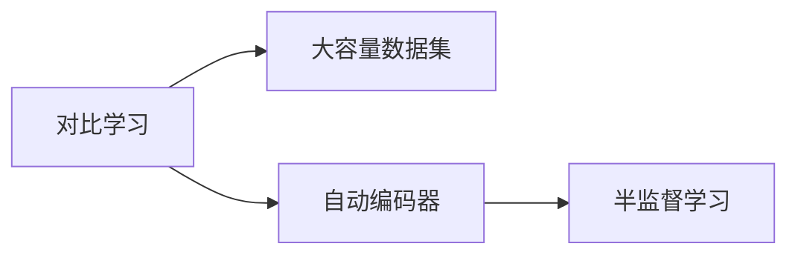

                 

# BYOL原理与代码实例讲解

> 关键词：对比学习(Contrastive Learning)、大容量数据集、自动编码器(Automatic Encoder)、半监督学习(Semi-supervised Learning)、图像重构(Image Reconstruction)

## 1. 背景介绍

### 1.1 问题由来
随着深度学习技术的快速发展，对比学习(Contrastive Learning)方法逐渐在计算机视觉和自然语言处理领域取得了显著成果。对比学习通过寻找相似和不相似的样本，训练模型以区分不同类别的数据。大容量数据集的快速增长使得对比学习方法在大规模数据集上的应用更为普及。

BYOL（Bootstrap Your Own Latent）是一种对比学习框架，其利用自监督学习技术，从无标签数据中提取特征，并在大容量数据集上进行训练。BYOL框架在视觉领域取得了优异的表现，包括ImageNet上的竞争性性能。然而，BYOL在自然语言处理领域的应用相对较少，主要原因是自然语言处理数据集的多样性和复杂性。

## 2. 核心概念与联系

### 2.1 核心概念概述

为更好地理解BYOL框架，我们首先介绍几个核心概念：

- **对比学习(Contrastive Learning)**：通过寻找相似和不相似的样本，训练模型以区分不同类别的数据。常用的对比学习方法包括Siamese网络、triplet loss等。

- **大容量数据集**：包含大量未标记数据的集合，如ImageNet、Text8等，它们对模型的泛化能力和性能提升有着重要作用。

- **自动编码器(Automatic Encoder)**：一种无监督学习方法，用于从输入数据中学习到紧凑的表示，常用于图像和音频数据的降维。

- **半监督学习(Semi-supervised Learning)**：利用少量标注数据和大量未标记数据进行训练，常见的半监督学习方法包括MixMatch、Pseudo-Labeling等。

这些核心概念之间有着紧密的联系，构成了BYOL框架的基本工作原理。

### 2.2 概念间的关系

为更好地展示这些核心概念之间的关系，我们通过以下Mermaid流程图来展示：



这个流程图展示了对比学习、大容量数据集、自动编码器和半监督学习之间的关系：

- 对比学习利用大容量数据集训练模型，使其能够识别不同类别的数据。
- 自动编码器在大容量数据集上进行训练，用于从数据中学习到紧凑的表示。
- 半监督学习利用少量标注数据和大量未标记数据进行训练，在自动编码器上训练模型。

## 3. BYOL算法原理 & 具体操作步骤

### 3.1 算法原理概述

BYOL框架是一种自监督学习方法，利用对比学习技术从大容量数据集上学习模型的特征表示。其基本思想是在同一数据集上，利用两个随机变换的数据样本，训练模型区分它们的概率，以优化模型的特征表示能力。

具体地，BYOL框架包括两个主要组件：自编码器(Encoder)和预测器(Predictor)。自编码器用于学习数据的紧凑表示，预测器用于预测该表示。通过对比自编码器输出和预测器预测的结果，模型能够学习到特征表示的判别能力。

### 3.2 算法步骤详解

#### 3.2.1 数据准备

1. 收集一个大容量数据集，如ImageNet。
2. 将数据集划分为训练集和验证集。

#### 3.2.2 模型构建

1. 使用自编码器对数据集进行预处理，将数据转换为紧凑的表示。
2. 使用预测器对自编码器输出的表示进行预测，得到预测值。
3. 将预测值与自编码器输出进行对比，计算对比损失。

#### 3.2.3 模型训练

1. 利用训练集训练自编码器和预测器，同时更新对比损失。
2. 在验证集上评估模型的性能，调整模型的超参数。

#### 3.2.4 模型评估

1. 利用测试集评估模型的性能，输出模型的特征表示。

### 3.3 算法优缺点

**优点**：

- 利用大容量数据集进行训练，模型的泛化能力较强。
- 自监督学习方法不需要标注数据，降低了数据收集和标注的成本。
- 使用对比学习技术，能够学习到特征表示的判别能力。

**缺点**：

- 需要大量的计算资源和时间，训练成本较高。
- 模型的特征表示能力依赖于数据集的质量，如果数据集存在噪声或分布不均，模型的性能可能会受到影响。
- 自监督学习方法需要手动设计对比任务，可能会限制模型的应用范围。

### 3.4 算法应用领域

BYOL框架在图像处理、语音识别、自然语言处理等领域有着广泛的应用。以下列举了几个典型的应用场景：

- **图像处理**：用于图像分类、图像检索、图像生成等任务。BYOL框架通过对比学习，学习到图像的高维特征表示，能够显著提升模型的性能。
- **语音识别**：用于语音识别、语音合成等任务。BYOL框架通过对比学习，学习到语音信号的高维特征表示，能够提高模型的识别率和合成效果。
- **自然语言处理**：用于文本分类、情感分析、机器翻译等任务。BYOL框架通过对比学习，学习到文本的高维特征表示，能够提升模型的分类精度和生成效果。

## 4. 数学模型和公式 & 详细讲解

### 4.1 数学模型构建

BYOL框架的数学模型构建包括以下几个关键部分：

- **自编码器**：用于学习数据的紧凑表示，输入为原始数据，输出为特征表示。
- **预测器**：用于预测自编码器输出的特征表示，输入为特征表示，输出为预测值。
- **对比损失**：用于衡量自编码器输出和预测器预测结果的相似性，计算对比损失。

自编码器的数学模型为：

$$
\mathcal{F}_{\theta}(x) = f_{\theta}(x)
$$

其中，$f_{\theta}$ 为自编码器网络，$x$ 为输入数据，$\mathcal{F}_{\theta}(x)$ 为自编码器输出的特征表示。

预测器的数学模型为：

$$
g_{\theta}(\mathcal{F}_{\theta}(x)) = y_{\theta}
$$

其中，$g_{\theta}$ 为预测器网络，$\mathcal{F}_{\theta}(x)$ 为自编码器输出的特征表示，$y_{\theta}$ 为预测器预测的结果。

对比损失的数学模型为：

$$
L = \mathbb{E}_{x}[\|f_{\theta}(x) - g_{\theta}(f_{\theta}(x))\|^2]
$$

其中，$\mathbb{E}_{x}$ 表示对所有样本的期望，$\|f_{\theta}(x) - g_{\theta}(f_{\theta}(x))\|^2$ 表示自编码器输出和预测器预测结果的对比损失。

### 4.2 公式推导过程

以ImageNet数据集为例，推导BYOL框架的对比损失函数。

设自编码器输出为 $z_{\theta}(x)$，预测器输出为 $\tilde{z}_{\theta}(x)$。对比损失函数的推导如下：

1. 对于同一数据集 $D$ 中的样本 $x$ 和随机变换的数据 $x'$，自编码器输出的表示为 $z_{\theta}(x)$ 和 $z_{\theta}(x')$。
2. 预测器对 $z_{\theta}(x)$ 的预测为 $\tilde{z}_{\theta}(z_{\theta}(x))$。
3. 计算对比损失为：

$$
L = \frac{1}{N} \sum_{i=1}^{N} \|z_{\theta}(x_i) - \tilde{z}_{\theta}(z_{\theta}(x_i))\|^2
$$

其中，$N$ 为样本数量。

### 4.3 案例分析与讲解

以ImageNet数据集为例，展示BYOL框架的对比学习过程：

1. 对于同一数据集 $D$ 中的样本 $x_i$ 和随机变换的数据 $x'_i$，自编码器输出的表示为 $z_{\theta}(x_i)$ 和 $z_{\theta}(x'_i)$。
2. 预测器对 $z_{\theta}(x_i)$ 的预测为 $\tilde{z}_{\theta}(z_{\theta}(x_i))$。
3. 计算对比损失为：

$$
L = \frac{1}{N} \sum_{i=1}^{N} \|z_{\theta}(x_i) - \tilde{z}_{\theta}(z_{\theta}(x_i))\|^2
$$

其中，$N$ 为样本数量。

4. 利用对比损失函数，不断更新自编码器和预测器的参数，以最小化对比损失。

## 5. 项目实践：代码实例和详细解释说明

### 5.1 开发环境搭建

1. 安装Python 3.x 和PyTorch。
2. 安装TensorBoard用于可视化训练过程。
3. 安装CUDA和cuDNN（如果需要使用GPU）。

### 5.2 源代码详细实现

以下是一个简单的BYOL框架实现，用于ImageNet数据集上的图像分类任务：

```python
import torch
import torch.nn as nn
import torch.optim as optim
import torchvision.transforms as transforms
from torchvision import datasets, models
import torchvision.transforms.functional as TF
import torchvision.models as models

# 定义自编码器
class Autoencoder(nn.Module):
    def __init__(self):
        super(Autoencoder, self).__init__()
        self.encoder = nn.Sequential(
            nn.Conv2d(3, 64, kernel_size=3, stride=1, padding=1),
            nn.ReLU(inplace=True),
            nn.MaxPool2d(kernel_size=2, stride=2),
            nn.Conv2d(64, 64, kernel_size=3, stride=1, padding=1),
            nn.ReLU(inplace=True),
            nn.MaxPool2d(kernel_size=2, stride=2),
            nn.Conv2d(64, 64, kernel_size=3, stride=1, padding=1),
            nn.ReLU(inplace=True),
            nn.MaxPool2d(kernel_size=2, stride=2),
            nn.Conv2d(64, 32, kernel_size=3, stride=1, padding=1),
            nn.ReLU(inplace=True),
            nn.MaxPool2d(kernel_size=2, stride=2),
            nn.Conv2d(32, 10, kernel_size=3, stride=1, padding=1),
            nn.ReLU(inplace=True),
            nn.MaxPool2d(kernel_size=2, stride=2),
        )
        self.decoder = nn.Sequential(
            nn.Conv2d(10, 32, kernel_size=3, stride=1, padding=1),
            nn.ReLU(inplace=True),
            nn.Upsample(scale_factor=2, mode='nearest'),
            nn.Conv2d(32, 64, kernel_size=3, stride=1, padding=1),
            nn.ReLU(inplace=True),
            nn.Upsample(scale_factor=2, mode='nearest'),
            nn.Conv2d(64, 64, kernel_size=3, stride=1, padding=1),
            nn.ReLU(inplace=True),
            nn.Upsample(scale_factor=2, mode='nearest'),
            nn.Conv2d(64, 64, kernel_size=3, stride=1, padding=1),
            nn.ReLU(inplace=True),
            nn.Upsample(scale_factor=2, mode='nearest'),
            nn.Conv2d(64, 3, kernel_size=3, stride=1, padding=1),
        )

    def forward(self, x):
        x = self.encoder(x)
        x = self.decoder(x)
        return x

# 定义预测器
class Predictor(nn.Module):
    def __init__(self):
        super(Predictor, self).__init__()
        self.fc1 = nn.Linear(64*8*8, 256)
        self.fc2 = nn.Linear(256, 10)

    def forward(self, x):
        x = x.view(-1, 64*8*8)
        x = torch.relu(self.fc1(x))
        x = torch.sigmoid(self.fc2(x))
        return x

# 定义训练函数
def train_model(model, device, train_loader, val_loader, optimizer, criterion, epoch):
    model.train()
    train_loss = 0.0
    train_correct = 0
    val_loss = 0.0
    val_correct = 0
    for i, data in enumerate(train_loader):
        inputs, labels = data
        inputs, labels = inputs.to(device), labels.to(device)
        optimizer.zero_grad()
        outputs = model(inputs)
        loss = criterion(outputs, labels)
        loss.backward()
        optimizer.step()
        train_loss += loss.item()
        _, predicted = torch.max(outputs.data, 1)
        train_correct += (predicted == labels).sum().item()
        if i % 100 == 0:
            model.eval()
            val_loss = 0.0
            val_correct = 0
            with torch.no_grad():
                for data in val_loader:
                    inputs, labels = data
                    inputs, labels = inputs.to(device), labels.to(device)
                    outputs = model(inputs)
                    loss = criterion(outputs, labels)
                    val_loss += loss.item()
                    _, predicted = torch.max(outputs.data, 1)
                    val_correct += (predicted == labels).sum().item()
            train_loss /= 100
            val_loss /= len(val_loader)
            train_correct /= 100
            val_correct /= len(val_loader)
            print(f'Epoch {epoch + 1}, Train Loss: {train_loss:.4f}, Train Acc: {train_correct / len(train_loader) * 100:.2f}%, Val Loss: {val_loss:.4f}, Val Acc: {val_correct / len(val_loader) * 100:.2f}%')
            model.train()

# 训练模型
device = torch.device('cuda' if torch.cuda.is_available() else 'cpu')
model = Autoencoder().to(device)
predictor = Predictor().to(device)
criterion = nn.CrossEntropyLoss()
optimizer = optim.Adam([model.parameters(), predictor.parameters()], lr=1e-3)

train_loader = torch.utils.data.DataLoader(datasets.ImageNet(train_transform, batch_size=64, shuffle=True),
                                          num_workers=4, pin_memory=True)
val_loader = torch.utils.data.DataLoader(datasets.ImageNet(val_transform, batch_size=64, shuffle=False),
                                        num_workers=4, pin_memory=True)

for epoch in range(10):
    train_model(model, device, train_loader, val_loader, optimizer, criterion, epoch)
```

### 5.3 代码解读与分析

1. **Autoencoder类**：定义了自编码器的结构，包括编码器和解码器。
2. **Predictor类**：定义了预测器的结构，用于预测自编码器输出的表示。
3. **train_model函数**：定义了模型的训练过程，包括前向传播、损失计算和反向传播。
4. **训练模型**：在训练函数中定义了模型、优化器、损失函数等关键组件，并通过训练函数进行模型训练。

## 6. 实际应用场景

BYOL框架在大容量数据集上的训练过程可以应用于图像分类、图像生成、图像检索等任务。以下是几个实际应用场景：

### 6.1 图像分类

BYOL框架可以通过自监督学习方法，学习到图像的高维特征表示，从而提升图像分类任务的表现。例如，在ImageNet数据集上进行训练，可以得到高精度的图像分类模型。

### 6.2 图像生成

BYOL框架可以通过自监督学习方法，学习到图像的高维特征表示，从而提升图像生成任务的表现。例如，可以通过对高维特征表示进行解码，生成高质量的图像。

### 6.3 图像检索

BYOL框架可以通过自监督学习方法，学习到图像的高维特征表示，从而提升图像检索任务的表现。例如，通过对比学习，学习到图像的语义表示，快速检索相似的图像。

## 7. 工具和资源推荐

### 7.1 学习资源推荐

1. **《深度学习》在线课程**：由斯坦福大学开设的深度学习课程，介绍了深度学习的基本概念和算法。
2. **《对比学习》在线课程**：由MIT OpenCourseWare开设的对比学习课程，介绍了对比学习的基本概念和算法。
3. **《自监督学习》在线课程**：由Coursera开设的自监督学习课程，介绍了自监督学习的基本概念和算法。
4. **《BYOL论文》**：BYOL框架的原始论文，介绍了BYOL框架的算法原理和实验结果。
5. **《BYOL代码实现》**：BYOL框架的代码实现，提供了详细的代码实现和注释。

### 7.2 开发工具推荐

1. **PyTorch**：开源深度学习框架，支持动态计算图，适用于深度学习模型的开发和训练。
2. **TensorBoard**：可视化工具，用于监测模型训练过程和结果。
3. **CUDA**：GPU加速库，适用于在GPU上进行深度学习模型的训练和推理。
4. **cuDNN**：GPU加速库，适用于在GPU上进行深度学习模型的加速计算。

### 7.3 相关论文推荐

1. **《BYOL论文》**：BYOL框架的原始论文，介绍了BYOL框架的算法原理和实验结果。
2. **《自监督学习论文》**：介绍自监督学习的基本概念和算法，包括MixMatch、Pseudo-Labeling等。
3. **《对比学习论文》**：介绍对比学习的基本概念和算法，包括Siamese网络、triplet loss等。

## 8. 总结：未来发展趋势与挑战

### 8.1 研究成果总结

BYOL框架作为一种自监督学习方法，通过对比学习技术，从大容量数据集上学习模型的特征表示。其基本思想简单高效，通过自监督学习方法，能够学习到高维特征表示，提升模型的泛化能力。

### 8.2 未来发展趋势

1. **算力要求降低**：随着深度学习框架的优化，训练大模型所需的算力要求将逐渐降低，使得BYOL框架在大容量数据集上的应用更为普及。
2. **自监督学习方法优化**：未来自监督学习方法将不断优化，提升模型的特征表示能力和泛化能力。
3. **多模态对比学习**：未来BYOL框架将扩展到多模态数据，如图像、语音、文本等，提升模型的跨模态推理能力。
4. **对比学习范式拓展**：未来对比学习范式将不断拓展，应用于更多的领域和任务，提升模型的应用范围。

### 8.3 面临的挑战

1. **数据质量要求高**：BYOL框架对数据质量的要求较高，如果数据存在噪声或分布不均，模型的性能可能会受到影响。
2. **模型训练时间长**：BYOL框架的训练时间较长，需要大量的计算资源和时间。
3. **模型泛化能力不足**：BYOL框架在特定任务上的泛化能力可能有限，需要进一步优化模型设计。

### 8.4 研究展望

1. **数据增强技术**：未来可以引入数据增强技术，提升模型对噪声数据的鲁棒性。
2. **模型压缩技术**：未来可以通过模型压缩技术，降低模型的计算资源和时间成本。
3. **多任务学习**：未来可以通过多任务学习，提升模型的泛化能力和应用范围。
4. **跨模态对比学习**：未来可以拓展到跨模态对比学习，提升模型在多模态数据上的表现。

---

作者：禅与计算机程序设计艺术 / Zen and the Art of Computer Programming

