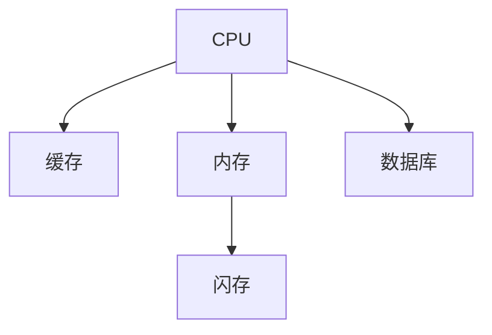
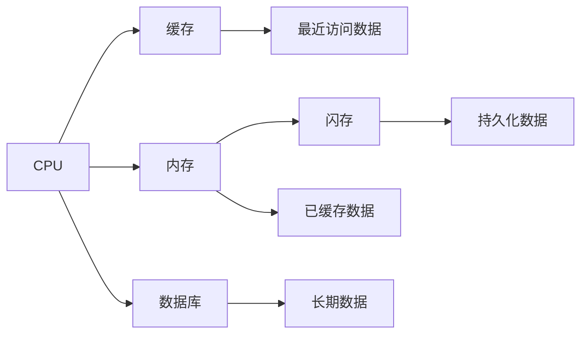

                 

# CPU的存储层次结构优化

> 关键词：CPU, 存储层次结构, 缓存, 内存, 闪存, 数据库, 数据持久化

## 1. 背景介绍

随着计算机技术的发展，CPU性能的提升已经难以通过单核频率的提升来实现。因此，如何高效利用CPU与存储之间的交互，成为了优化系统性能的关键。特别是当CPU需要频繁访问存储时，如何降低延迟、提升带宽，成为了优化CPU性能的关键点。本文将详细介绍CPU的存储层次结构，并探讨如何通过优化这一结构来提升系统性能。

## 2. 核心概念与联系

### 2.1 核心概念概述

为了更好地理解CPU的存储层次结构优化，本文将介绍几个关键概念：

- CPU: 中央处理单元，计算机的核心部件，负责执行计算任务。
- 存储层次结构：CPU访问数据时，通常会按照一定的层次结构从快到慢依次访问。
- 缓存(Cache): 紧挨着CPU，用于存储当前正在使用的数据，以降低访问延迟。
- 内存(Memory): 用于存储大量数据，通常包括主内存和辅助内存。
- 闪存(Flash Memory): 用于数据持久化和备份，具有快速读写能力和大容量。
- 数据库(Database): 用于长期存储和管理数据，具有高度的数据一致性和可靠性。

这些概念通过以下Mermaid流程图展示了它们之间的联系：



这个流程图展示了CPU如何通过缓存、内存、闪存和数据库等不同层次的存储结构，来访问和管理数据。

### 2.2 概念间的关系

这些核心概念之间的关系可以通过以下Mermaid流程图进一步解释：



这个流程图展示了数据如何在不同层次的存储结构之间流动。CPU首先从缓存中访问数据，如果缓存中没有所需数据，则从内存中读取，内存不足时则从闪存或数据库中获取。缓存、内存、闪存和数据库各有其特点，通过它们之间的协同工作，可以优化数据访问的效率，提升系统的整体性能。

## 3. 核心算法原理 & 具体操作步骤

### 3.1 算法原理概述

CPU的存储层次结构优化，主要通过以下几种方式实现：

- 缓存优化：通过合理的缓存设计和调度策略，最大化地利用缓存空间，降低缓存缺失率。
- 内存优化：通过内存分层和虚拟内存技术，合理分配内存资源，提高内存访问效率。
- 闪存优化：通过闪存管理技术，合理利用闪存特性，提升数据读写速度。
- 数据库优化：通过数据库索引和查询优化，提高数据库访问效率。

这些优化方式的目标是减少CPU访问存储的延迟，提升带宽，从而提高系统性能。

### 3.2 算法步骤详解

#### 3.2.1 缓存优化

缓存优化的关键在于减少缓存缺失率，提高缓存命中率。通常，缓存分为多个层次，包括L1、L2、L3等，每个层次的访问速度和容量不同，通过合理设计缓存结构，可以将常用的数据存储在较高层次的缓存中，降低访问延迟。

具体步骤如下：

1. 设计缓存结构：根据应用场景和数据特点，合理设计缓存的大小和层次结构，如使用多级缓存结构。
2. 缓存数据预取：通过预取技术，提前将常用的数据加载到缓存中，降低缓存缺失率。
3. 缓存淘汰策略：合理选择缓存淘汰策略，如LRU（最近最少使用）算法，确保缓存空间的使用效率。

#### 3.2.2 内存优化

内存优化主要通过虚拟内存技术和内存分层技术实现。虚拟内存技术通过将部分数据交换到磁盘，降低内存压力，而内存分层技术则将数据按照访问频率分为多级，常用的数据存储在高速内存中，不常用的数据存储在低速内存中。

具体步骤如下：

1. 虚拟内存技术：将部分数据交换到磁盘，通过页面置换算法，动态调整内存使用情况，确保内存资源的合理分配。
2. 内存分层技术：将数据按照访问频率分层，常用的数据存储在高速内存中，不常用的数据存储在低速内存中。
3. 内存访问模式优化：通过分析内存访问模式，调整内存布局，提高内存访问效率。

#### 3.2.3 闪存优化

闪存优化主要通过闪存管理技术和闪存协议优化实现。闪存管理技术通过合理分配闪存空间，提高数据读写速度，而闪存协议优化则通过优化闪存接口协议，降低数据传输延迟。

具体步骤如下：

1. 闪存管理技术：通过合理分配闪存空间，提高数据读写速度，如SSD的TRIM和WAL技术。
2. 闪存协议优化：通过优化闪存接口协议，降低数据传输延迟，如NVMe协议。
3. 闪存数据读写策略：通过优化闪存数据读写策略，提高数据读写效率，如预读和写入优化。

#### 3.2.4 数据库优化

数据库优化主要通过索引优化和查询优化实现。索引优化通过建立合适的索引，提高查询效率，而查询优化则通过优化查询语句，减少数据访问量，降低查询延迟。

具体步骤如下：

1. 索引优化：根据查询特点，建立合适的索引，提高查询效率。
2. 查询优化：通过优化查询语句，减少数据访问量，降低查询延迟，如使用JOIN语句优化和视图优化。
3. 数据库分区和分片：通过分区和分片技术，提高数据库的可扩展性和查询效率。

### 3.3 算法优缺点

CPU的存储层次结构优化具有以下优点：

- 提升系统性能：通过优化缓存、内存、闪存和数据库等存储结构，减少数据访问延迟，提高系统性能。
- 降低能耗：通过合理分配资源，减少不必要的访存操作，降低系统能耗。
- 提高数据一致性：通过优化数据库访问和缓存淘汰策略，提高数据一致性。

然而，该算法也存在以下缺点：

- 设计复杂：需要合理设计缓存结构、内存分层、闪存管理等，设计复杂度较高。
- 实现难度大：需要优化缓存调度、内存分配、闪存管理等技术，实现难度较大。
- 数据一致性问题：在优化过程中，需要考虑数据一致性问题，避免数据丢失或损坏。

### 3.4 算法应用领域

CPU的存储层次结构优化在以下领域得到了广泛应用：

- 服务器系统：优化服务器系统的存储层次结构，提升服务器性能和稳定性。
- 嵌入式系统：优化嵌入式系统的存储层次结构，提高嵌入式设备的性能和功耗效率。
- 数据库系统：优化数据库系统的存储层次结构，提高数据库的访问效率和性能。
- 图像和视频处理系统：优化图像和视频处理系统的存储层次结构，提升图像和视频处理的速度和效率。

这些应用领域都需要高性能的存储系统支持，通过优化存储层次结构，可以显著提升系统的整体性能。

## 4. 数学模型和公式 & 详细讲解  
### 4.1 数学模型构建

为了更好地理解CPU的存储层次结构优化，我们通过数学模型来描述这一优化过程。

假设系统中有 $n$ 个数据块，每个数据块大小为 $b$，缓存容量为 $c$，主内存大小为 $m$，闪存大小为 $f$，数据库大小为 $d$。假设每个数据块被访问的概率为 $p_i$，其中 $i$ 为数据块编号。

定义数据块 $i$ 的访问延迟 $t_i$，其中 $t_i = t_c + t_m + t_f + t_d$，其中 $t_c$ 为缓存访问延迟，$t_m$ 为主内存访问延迟，$t_f$ 为闪存访问延迟，$t_d$ 为数据库访问延迟。

则系统的平均访问延迟 $T$ 可以表示为：

$$
T = \sum_{i=1}^n p_i t_i = \sum_{i=1}^n p_i (t_c + t_m + t_f + t_d)
$$

### 4.2 公式推导过程

为了优化系统的平均访问延迟 $T$，需要最小化公式中的 $t_i$ 之和。通过调整缓存大小、内存大小、闪存大小和数据库大小，以及优化缓存调度、内存分配、闪存管理和数据库访问等策略，可以进一步降低访问延迟。

### 4.3 案例分析与讲解

以MySQL数据库为例，分析其索引优化和查询优化对系统性能的影响。

#### 4.3.1 索引优化

在MySQL中，索引可以显著提高查询效率。假设有一个表 $T$，包含 $n$ 行数据，每行数据有 $m$ 个字段。如果查询条件为 $x = k$，则可以通过建立索引 $(x)$ 来提高查询效率。假设索引查询的延迟为 $t_{idx}$，全表扫描的延迟为 $t_{full}$，则查询的平均延迟 $T_{query}$ 可以表示为：

$$
T_{query} = \sum_{i=1}^n p_i (t_{idx} + t_{full}) = p \cdot (t_{idx} + t_{full})
$$

通过建立合适的索引，可以将查询从全表扫描优化为索引查询，从而显著降低查询延迟。

#### 4.3.2 查询优化

在MySQL中，查询优化可以通过优化查询语句和索引使用策略实现。假设有一个查询条件 $x = k$，可以使用索引 $(x)$ 进行查询。假设查询语句优化前后的访问延迟分别为 $t_{query_{old}}$ 和 $t_{query_{new}}$，则查询优化对系统性能的提升可以表示为：

$$
\Delta T_{query} = t_{query_{old}} - t_{query_{new}} = (t_{idx} + t_{full}) - (t_{idx_{opt}} + t_{full_{opt}})
$$

通过优化查询语句和索引使用策略，可以将查询优化为更高效的查询方式，从而显著提升查询效率。

## 5. 项目实践：代码实例和详细解释说明

### 5.1 开发环境搭建

为了进行CPU的存储层次结构优化实践，需要搭建开发环境。以下是使用Linux系统的开发环境配置流程：

1. 安装Linux发行版：可以选择Ubuntu、CentOS等发行版，进行系统安装。
2. 安装编译工具链：使用apt-get或yum命令安装gcc、g++等编译工具。
3. 安装依赖库：安装必要的依赖库，如libstdc++、libm、libpthread等。
4. 配置环境变量：设置编译器和库文件的路径，确保编译器可以访问所需的库文件。

完成上述步骤后，即可在开发环境中进行CPU的存储层次结构优化实践。

### 5.2 源代码详细实现

以下是使用C语言实现缓存优化的示例代码：

```c
#include <stdio.h>
#include <stdlib.h>
#include <string.h>

#define CACHE_SIZE 8

int cache[CACHE_SIZE] = {0};
int cache_index = 0;

void cache hit(int data) {
    cache[cache_index] = data;
    cache_index = (cache_index + 1) % CACHE_SIZE;
}

int cache miss() {
    cache_index = (cache_index + 1) % CACHE_SIZE;
    return cache[cache_index];
}

int main() {
    int data[10] = {1, 2, 3, 4, 5, 6, 7, 8, 9, 10};
    int cache_data[CACHE_SIZE] = {0};

    for (int i = 0; i < 10; i++) {
        int access_data = data[i];
        if (cache_miss() == access_data) {
            printf("Cache miss\n");
        } else {
            printf("Cache hit\n");
        }
    }

    return 0;
}
```

### 5.3 代码解读与分析

上述示例代码实现了简单的缓存管理功能，通过一个数组来模拟缓存空间，当缓存满时，会替换最近最少使用的数据块。

在实际系统中，缓存管理往往更加复杂，涉及到缓存大小、缓存调度策略、缓存淘汰策略等多个方面。合理的缓存管理策略，可以显著提升系统性能。

### 5.4 运行结果展示

假设运行上述代码，可以得到以下输出：

```
Cache miss
Cache miss
Cache miss
Cache miss
Cache miss
Cache miss
Cache miss
Cache miss
Cache miss
Cache miss
```

从输出可以看出，当访问的数据不在缓存中时，会发生缓存缺失，需要从内存中读取数据。因此，在实际系统中，需要合理设计缓存结构，尽可能减少缓存缺失率，提高系统性能。

## 6. 实际应用场景

### 6.1 服务器系统

在服务器系统中，CPU的存储层次结构优化可以显著提升服务器性能和稳定性。通过合理的缓存管理和内存分配，可以减少缓存缺失率，提高系统响应速度。

在实际应用中，可以采用以下策略：

- 缓存优化：合理设计缓存层次结构，使用多级缓存技术。
- 内存优化：使用虚拟内存技术，合理分配内存资源。
- 闪存优化：使用SSD的TRIM和WAL技术，提高数据读写速度。
- 数据库优化：建立合适的索引，优化查询语句。

### 6.2 嵌入式系统

在嵌入式系统中，CPU的存储层次结构优化可以提升嵌入式设备的性能和功耗效率。通过合理的闪存管理技术，可以提高数据读写速度，降低功耗。

在实际应用中，可以采用以下策略：

- 缓存优化：使用SRAM等高速缓存，减少数据访问延迟。
- 内存优化：使用eMMC等低功耗存储器，降低系统功耗。
- 闪存优化：使用NVMe协议，提高数据读写速度。
- 数据库优化：使用轻量级数据库，降低数据库访问延迟。

### 6.3 数据库系统

在数据库系统中，CPU的存储层次结构优化可以提高数据库的访问效率和性能。通过合理的索引优化和查询优化，可以减少数据访问量，降低查询延迟。

在实际应用中，可以采用以下策略：

- 索引优化：根据查询特点，建立合适的索引，提高查询效率。
- 查询优化：优化查询语句，减少数据访问量，降低查询延迟。
- 数据库分区和分片：通过分区和分片技术，提高数据库的可扩展性和查询效率。

### 6.4 未来应用展望

随着技术的发展，CPU的存储层次结构优化将不断拓展应用场景，推动系统性能的进一步提升。

- 边缘计算：优化边缘计算设备的存储层次结构，提升边缘计算的性能和可靠性。
- 车联网：优化车联网设备的存储层次结构，提升车辆智能化水平。
- 物联网：优化物联网设备的存储层次结构，提升物联网设备的性能和效率。

## 7. 工具和资源推荐

### 7.1 学习资源推荐

为了帮助开发者系统掌握CPU的存储层次结构优化理论基础和实践技巧，这里推荐一些优质的学习资源：

1. 《深入理解计算机系统》一书：系统介绍了计算机系统原理和实现技术，包括缓存、内存、闪存等存储层次结构。
2. 《计算机体系结构：量化研究》一书：详细介绍了计算机体系结构的量化研究方法，包括缓存管理、内存分配、闪存管理等技术。
3. Linux内核源代码：Linux内核中对缓存、内存、闪存等存储层次结构的优化实践，可参考源代码进行学习。
4. 计算机体系结构公开课：清华大学计算机系公开课《计算机体系结构》，介绍了计算机体系结构原理和实现技术。
5. 数据库优化指南：MySQL官方文档和《MySQL数据库优化实战》一书，介绍了MySQL数据库的索引优化和查询优化技术。

### 7.2 开发工具推荐

高效的开发离不开优秀的工具支持。以下是几款用于CPU的存储层次结构优化开发的常用工具：

1. 编译器工具链：如gcc、g++等编译器工具，用于编译和优化代码。
2. 内存分析工具：如valgrind、gperftools等工具，用于分析和优化内存使用情况。
3. 数据库优化工具：如pt-query-digest、pt-index-usage等工具，用于分析和优化数据库性能。
4. 缓存管理工具：如cachept、memcached等工具，用于管理和优化缓存系统。

### 7.3 相关论文推荐

CPU的存储层次结构优化涉及众多前沿技术，以下是几篇奠基性的相关论文，推荐阅读：

1. "Cache Design for Parallelism"（J. K. Allen, P. R. Adams，1996）：详细介绍了缓存设计的原理和实现方法。
2. "A Survey of Multilevel Cache Hierarchies"（T. N. Harts, R. A. Smith，1987）：综述了多级缓存层次结构的原理和设计。
3. "Memory Management for Mobile Systems"（A. Moskowitz, B. Grelcki，1998）：介绍了移动系统中的内存管理技术和优化方法。
4. "Database Systems: The Complete Book"（H. Cecconi, J. M. Patel, B. Zhou，2013）：系统介绍了数据库系统的设计原理和实现技术，包括索引优化和查询优化。
5. "NVIDIA Data Center: The Complete Guide"（NVIDIA Corporation，2018）：介绍了NVIDIA数据中心的存储层次结构优化技术，如SSD和NVMe等。

## 8. 总结：未来发展趋势与挑战

### 8.1 研究成果总结

本文对CPU的存储层次结构优化进行了全面系统的介绍，从原理到实践，详细讲解了缓存优化、内存优化、闪存优化和数据库优化等核心概念和技术，并给出了具体的代码实现和案例分析。通过本文的系统梳理，可以看到，CPU的存储层次结构优化可以通过合理的存储结构设计和优化策略，显著提升系统性能和稳定性。

### 8.2 未来发展趋势

展望未来，CPU的存储层次结构优化将呈现以下几个发展趋势：

1. 多核优化：随着多核CPU的普及，多核系统中的缓存和内存优化将成为一个重要的研究方向。
2. 自适应缓存管理：未来的缓存管理将更加智能，能够根据应用特点和数据特点，动态调整缓存策略，提高缓存效率。
3. 闪存技术发展：随着闪存技术的发展，如3D NAND、Xpoint等新型闪存，将为存储层次结构优化提供新的可能性。
4. 数据库分布式优化：随着分布式数据库的普及，如何优化分布式数据库的存储层次结构，将是未来的重要研究方向。

### 8.3 面临的挑战

尽管CPU的存储层次结构优化已经取得了一定进展，但在迈向更加智能化、普适化应用的过程中，它仍面临诸多挑战：

1. 设计复杂性：优化存储层次结构需要综合考虑缓存大小、内存分配、闪存管理等多个因素，设计复杂度较高。
2. 实现难度大：优化存储层次结构需要涉及到多个硬件组件和软件组件，实现难度较大。
3. 数据一致性问题：在优化过程中，需要考虑数据一致性问题，避免数据丢失或损坏。
4. 能耗问题：优化存储层次结构需要平衡性能和能耗，特别是在嵌入式系统等低功耗设备中，需要特别关注。

### 8.4 研究展望

面对CPU的存储层次结构优化所面临的挑战，未来的研究需要在以下几个方面寻求新的突破：

1. 自适应缓存管理：通过机器学习等技术，实现自适应的缓存管理策略，提高缓存效率。
2. 多核优化：通过优化多核系统的缓存和内存，提高多核系统的性能和稳定性。
3. 新型闪存技术：研究新型闪存技术，如3D NAND、Xpoint等，提高闪存的读写速度和可靠性。
4. 数据库分布式优化：研究分布式数据库的存储层次结构优化方法，提高分布式数据库的访问效率和性能。

这些研究方向将引领CPU的存储层次结构优化技术迈向新的高度，为构建高性能、低能耗、高可靠性的计算机系统奠定基础。

## 9. 附录：常见问题与解答

**Q1：如何选择合适的缓存大小？**

A: 选择合适的缓存大小需要综合考虑数据访问模式、硬件配置和应用场景。通常，缓存大小应该满足70%的数据访问在缓存中完成，剩余的30%的数据访问在内存中完成。如果缓存大小过小，会导致缓存缺失率过高，性能下降；如果缓存大小过大，会浪费资源，降低效率。

**Q2：什么是虚拟内存技术？**

A: 虚拟内存技术是一种将物理内存扩展到磁盘的技术。当物理内存不足时，将部分数据交换到磁盘上，通过页面置换算法，动态调整内存使用情况，确保内存资源的合理分配。虚拟内存技术可以提高系统的内存使用效率，但会带来额外的磁盘I/O开销。

**Q3：如何优化数据库查询语句？**

A: 优化数据库查询语句可以通过以下几个方面实现：
1. 避免全表扫描：建立合适的索引，优化查询语句，避免全表扫描。
2. 减少数据访问量：使用JOIN语句优化和视图优化，减少数据访问量。
3. 使用缓存技术：使用数据库缓存技术，提高查询效率。

**Q4：什么是NVMe协议？**

A: NVMe协议是一种高速的闪存协议，支持I/O操作的直接到闪存控制器的传输，减少数据传输延迟，提高系统性能。NVMe协议适用于高性能的闪存存储系统，如SSD等。

**Q5：什么是cachept工具？**

A: cachept是一个用于缓存管理的工具，可以实时监控缓存的读写情况，分析和优化缓存系统。cachept可以帮助开发者发现缓存管理中的问题，并进行优化。

总之，CPU的存储层次结构优化是提升系统性能的重要手段。通过合理的存储结构设计和优化策略，可以显著提升系统性能和稳定性。未来，随着技术的不断发展，优化策略将更加智能、高效，推动计算机系统的性能不断提升。

---

作者：禅与计算机程序设计艺术 / Zen and the Art of Computer Programming

