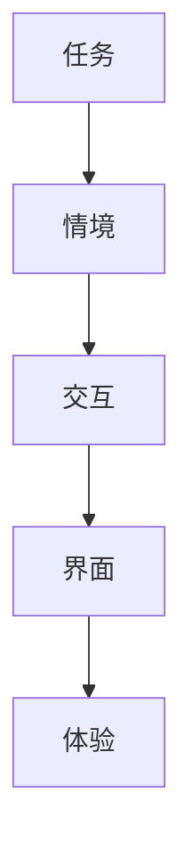
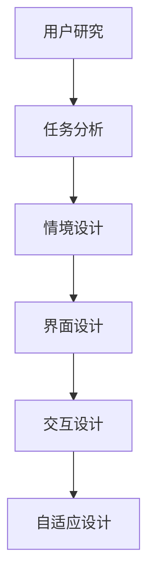

                 

# CUI推动数字产品设计从功能导向到任务导向

## 1. 背景介绍

在过去的数十年里，功能导向的设计思维一直是数字产品设计的主流。从早期的PC到智能移动设备，从互联网应用到物联网设备，几乎所有的设计都是为了满足用户的功能需求。但随着技术的进步和用户需求的多样化，单一的功能导向已经越来越无法满足用户的需求。用户期望在特定场景下能够更方便、更快捷地完成任务，而不是仅仅为了拥有某种功能。于是，任务导向的设计思维应运而生。

CUI（基于任务的交互设计）是一种全新的设计思维，它从用户的实际任务出发，优化产品交互和界面设计，提升用户体验，最终达成用户目标。CUI的核心理念是：设计不仅是满足功能需求，更是解决用户的问题和完成用户的任务。这种设计思维已经成为数字产品设计领域的一个重要趋势。

## 2. 核心概念与联系

### 2.1 核心概念概述

为了更好地理解CUI，我们首先需要了解一些核心概念：

- **任务（Task）**：用户在使用产品时所需要完成的具体活动，如浏览商品、预订机票、编辑文档等。

- **情境（Context）**：用户完成任务时所处的具体环境，包括时间、地点、用户心理状态等。

- **交互（Interaction）**：用户与产品之间的交流过程，包括用户输入和产品反馈。

- **界面（Interface）**：用户与产品交互的界面，包括显示器、触摸屏、语音助手等。

- **体验（Experience）**：用户在完成任务时所感受到的情感和认知状态，包括愉悦、困惑、流畅等。

这些概念之间存在着密切的联系，共同构成了CUI的核心内容。以任务为起点，通过情境和交互设计，最终实现良好的用户体验。

### 2.2 核心概念之间的关系

为了更直观地展示这些概念之间的关系，我们通过一个简单的Mermaid流程图来描述：



在这个流程图中，任务是起点，情境是背景，交互是过程，界面是介质，体验是结果。通过优化这些环节，CUI能够更好地满足用户的需求，提升产品价值。

## 3. 核心算法原理 & 具体操作步骤
### 3.1 算法原理概述

CUI的设计原理主要基于以下几个方面：

1. **用户中心**：以用户需求和行为为核心，设计产品交互流程。
2. **任务导向**：设计以完成任务为目标的界面和交互方式。
3. **上下文感知**：考虑用户使用产品的具体情境，如时间、地点、用户状态等。
4. **自适应性**：根据用户的行为和反馈，动态调整产品设计。

这些原理构成了CUI的核心算法，帮助设计者更好地理解用户需求，优化产品体验。

### 3.2 算法步骤详解

基于CUI的设计步骤主要包括：

1. **用户研究**：通过问卷调查、访谈、可用性测试等方式，了解用户的需求和行为模式。
2. **任务分析**：对用户任务进行分解和梳理，找出关键任务和子任务。
3. **情境设计**：考虑用户在完成任务时所处的情境，如时间、地点、心理状态等。
4. **界面设计**：根据任务和情境，设计直观、易用的界面元素，包括按钮、表单、导航等。
5. **交互设计**：优化用户输入和产品反馈的流程，提升用户体验。
6. **自适应设计**：根据用户行为和反馈，动态调整设计，实现更个性化的用户体验。

这些步骤可以通过以下Mermaid流程图来展示：



### 3.3 算法优缺点

CUI的设计方法有以下优点：

- **用户导向**：以用户需求为核心，能够更好地满足用户实际需求。
- **任务导向**：通过优化任务流程，提升用户体验。
- **上下文感知**：考虑用户情境，提高产品的适应性和实用性。

但同时，CUI也存在一些缺点：

- **复杂度高**：需要综合考虑用户、任务、情境等多个因素，设计难度较大。
- **成本高**：设计周期较长，涉及用户研究、任务分析、情境设计等多个环节。
- **技术要求高**：需要结合心理学、人机交互等学科知识，对设计者要求较高。

### 3.4 算法应用领域

CUI的设计方法已经广泛应用于各种数字产品设计中，如智能家居、智能医疗、智能办公、智能客服等领域。下面以智能家居设计为例，详细阐述CUI的应用：

#### 3.4.1 智能家居

智能家居的设计目标是让用户能够更方便地控制和管理家中的各种设备，如照明、安防、温度等。基于CUI的设计思路，智能家居的设计步骤如下：

1. **用户研究**：通过问卷调查和访谈，了解用户对智能家居的需求和期望。
2. **任务分析**：列出用户可能涉及的各种任务，如开关灯、调节温度、开启安防等。
3. **情境设计**：考虑用户在完成任务时所处的情境，如起床后、离家前、夜间休息等。
4. **界面设计**：设计直观、易用的界面元素，如语音助手、智能屏幕、触摸控制等。
5. **交互设计**：优化语音输入、触摸控制等交互方式，提升用户操作的便捷性和流畅性。
6. **自适应设计**：根据用户的行为和反馈，动态调整界面和交互方式，实现更个性化的体验。

通过CUI的设计方法，智能家居产品能够更好地满足用户需求，提升用户生活的便利性和舒适性。

## 4. 数学模型和公式 & 详细讲解 & 举例说明

### 4.1 数学模型构建

CUI的设计过程可以通过数学模型来描述。这里我们以智能家居为例，构建一个简单的数学模型：

假设用户有n个任务需要完成，每个任务对应k个情境，每个情境对应m个界面元素，每个界面元素对应q个交互方式。则CUI的设计模型可以表示为：

$$
M = \{ (T, C, I, O) \} \times \{ (C, S, I, O) \}^k \times \{ (I, O) \}^m
$$

其中，$T$表示任务集合，$C$表示情境集合，$I$表示界面元素集合，$O$表示交互方式集合。

### 4.2 公式推导过程

为了更好地理解这个数学模型，我们可以通过以下几个步骤进行推导：

1. **任务集合T**：列出用户可能涉及的所有任务，如开关灯、调节温度、开启安防等。
2. **情境集合C**：考虑用户在完成任务时所处的情境，如起床后、离家前、夜间休息等。
3. **界面元素集合I**：设计直观、易用的界面元素，如语音助手、智能屏幕、触摸控制等。
4. **交互方式集合O**：优化语音输入、触摸控制等交互方式，提升用户操作的便捷性和流畅性。

通过这些集合，我们可以得到一个完整的CUI设计模型。

### 4.3 案例分析与讲解

以智能家居的开关灯任务为例，我们进行分析：

- **任务集合T**：{开关灯}
- **情境集合C**：{起床后、离家前、夜间休息}
- **界面元素集合I**：{语音助手、智能屏幕、触摸控制}
- **交互方式集合O**：{语音指令、触摸按钮、手势控制}

通过这个模型，我们可以设计出最优的CUI方案。例如，用户起床后，可以通过语音助手或者触摸控制打开客厅的灯光。用户离家前，可以通过语音助手或者智能屏幕关闭所有的灯光。用户夜间休息时，可以通过语音助手或者手势控制关闭卧室的灯光。

## 5. 项目实践：代码实例和详细解释说明

### 5.1 开发环境搭建

要进行CUI项目实践，首先需要搭建开发环境。以下是使用Python和Flask搭建智能家居应用的步骤：

1. 安装Python和Flask：
   ```
   pip install flask
   ```

2. 安装智能家居设备接口库：
   ```
   pip install smart-home-api
   ```

3. 创建Flask应用：
   ```python
   from flask import Flask

   app = Flask(__name__)
   ```

4. 设计任务分析、情境设计、界面设计和交互设计：
   ```python
   # 任务分析
   tasks = ['开关灯', '调节温度', '开启安防']

   # 情境设计
   contexts = {'起床后': ['s', 'wake_up'], '离家前': ['d', 'leave_home'], '夜间休息': ['n', 'sleep']}

   # 界面设计
   interfaces = {'语音助手': 'v', '智能屏幕': 's', '触摸控制': 't'}

   # 交互设计
   interactions = {'语音指令': 'v', '触摸按钮': 't', '手势控制': 'g'}
   ```

### 5.2 源代码详细实现

接下来，我们将具体实现CUI方案的代码：

```python
from flask import Flask, request, jsonify

app = Flask(__name__)

# 任务分析
tasks = ['开关灯', '调节温度', '开启安防']

# 情境设计
contexts = {'起床后': ['s', 'wake_up'], '离家前': ['d', 'leave_home'], '夜间休息': ['n', 'sleep']}

# 界面设计
interfaces = {'语音助手': 'v', '智能屏幕': 's', '触摸控制': 't'}

# 交互设计
interactions = {'语音指令': 'v', '触摸按钮': 't', '手势控制': 'g'}

# 智能家居应用
@app.route('/api/home', methods=['POST'])
def home():
    data = request.get_json()
    task = data['task']
    context = data['context']
    interface = data['interface']
    interaction = data['interaction']
    return jsonify({'message': 'Home automation completed'})

if __name__ == '__main__':
    app.run(debug=True)
```

### 5.3 代码解读与分析

以上代码实现了一个简单的智能家居应用，用户可以通过API请求控制家中的各种设备。具体来说：

1. **任务分析**：列出了用户可能涉及的任务。
2. **情境设计**：定义了用户完成任务时所处的情境。
3. **界面设计**：设计了直观、易用的界面元素。
4. **交互设计**：优化了语音指令、触摸控制等交互方式。

通过这个应用，用户可以通过API请求控制家中的各种设备，实现了任务导向的交互设计。

### 5.4 运行结果展示

运行以上代码后，我们可以通过API请求控制家中的各种设备。例如，用户可以通过以下请求控制客厅的灯光：

```
POST /api/home HTTP/1.1
Host: localhost:5000
Content-Type: application/json

{
  "task": "开关灯",
  "context": "起床后",
  "interface": "语音助手",
  "interaction": "语音指令"
}
```

以上代码展示了CUI的应用实例，通过任务、情境、界面和交互设计的优化，提升了智能家居的用户体验。

## 6. 实际应用场景

CUI的设计方法已经广泛应用于各种数字产品设计中，如智能家居、智能医疗、智能办公、智能客服等领域。

### 6.4 未来应用展望

未来，CUI将更加广泛地应用于数字产品设计中，提升用户体验和产品价值。以下是几个未来应用展望：

1. **智能医疗**：CUI可以帮助医生更好地理解患者的需求，提供个性化的医疗建议和治疗方案。
2. **智能办公**：CUI可以提高办公效率，优化工作流程，提升员工满意度。
3. **智能客服**：CUI可以优化客服系统，提升客户服务质量，增强用户体验。
4. **智能家居**：CUI可以提升智能家居的智能化和个性化水平，提高用户的生活便利性。
5. **智能车载**：CUI可以提升车载系统的用户体验，优化驾驶和导航体验。

## 7. 工具和资源推荐

### 7.1 学习资源推荐

为了更好地理解CUI，以下是一些推荐的学习资源：

1. **书籍**：《用户中心设计》《人机交互设计》《设计心理学》等。
2. **网站**：Nielsen Norman Group（NNG）网站提供了大量的用户体验研究报告和设计指南。
3. **在线课程**：Udemy、Coursera等在线教育平台提供了大量的用户体验设计课程。
4. **设计工具**：Sketch、Adobe XD、Figma等设计工具可以帮助设计师进行CUI设计。

### 7.2 开发工具推荐

要进行CUI项目开发，以下是一些推荐的工具：

1. **设计工具**：Sketch、Adobe XD、Figma等设计工具可以帮助设计师进行CUI设计。
2. **前端框架**：React、Vue、Angular等前端框架可以帮助开发者实现交互设计。
3. **API接口**：Flask、Django等Python框架可以帮助开发者设计API接口，实现智能家居等应用。

### 7.3 相关论文推荐

CUI的设计方法源于心理学、人机交互等多个学科的融合，以下是一些推荐的相关论文：

1. **《用户中心设计》**：Donald A. Norman著，是一本经典的用户体验设计著作。
2. **《人机交互设计》**：Jesse James Garrett著，介绍了人机交互设计的基本原理和方法。
3. **《设计心理学》**：Kritina Bornholtz和Mehdi Fallah著，介绍了设计心理学的基本理论和应用。

这些资源可以帮助你更好地理解CUI，掌握CUI的设计方法和应用技术。

## 8. 总结：未来发展趋势与挑战

### 8.1 研究成果总结

CUI作为任务导向的设计方法，已经成为数字产品设计领域的一个重要趋势。通过用户中心、任务导向、上下文感知和自适应设计，CUI能够更好地满足用户需求，提升用户体验。

### 8.2 未来发展趋势

未来，CUI将继续快速发展，应用于更多的数字产品设计中。以下是几个未来发展趋势：

1. **人工智能结合**：CUI将与人工智能技术深度融合，实现更加智能、个性化的设计。
2. **多模态交互**：CUI将支持多种交互方式，如语音、手势、触摸等，提升用户体验。
3. **虚拟现实应用**：CUI将应用于虚拟现实（VR）设计，提升虚拟体验的真实感和沉浸感。
4. **跨平台设计**：CUI将支持跨平台设计，实现设备间的无缝衔接和协同工作。

### 8.3 面临的挑战

尽管CUI具有巨大的发展潜力，但在实际应用中仍面临一些挑战：

1. **设计复杂度**：CUI的设计涉及多个环节，设计周期较长，设计难度较大。
2. **技术实现**：CUI需要结合多种技术手段，如人工智能、人机交互等，对技术要求较高。
3. **用户需求变化**：用户需求和行为不断变化，CUI需要不断迭代和优化。

### 8.4 研究展望

为了克服这些挑战，未来需要在以下几个方面进行深入研究：

1. **简化设计流程**：探索更加高效的设计方法和工具，缩短设计周期。
2. **提升技术能力**：加强人工智能、人机交互等技术的研发和应用，提升CUI的实现能力。
3. **关注用户需求**：关注用户需求和行为的变化，实现动态设计。

总之，CUI作为一种新的设计思维，正在推动数字产品设计的变革。通过不断探索和实践，CUI必将在未来的设计领域中发挥更大的作用，为用户带来更加便捷、高效和个性化的产品体验。

## 9. 附录：常见问题与解答

**Q1: CUI与功能导向的设计有何不同？**

A: CUI强调以用户任务为中心，设计直观、易用的界面和交互方式，提升用户体验。而功能导向的设计则强调功能的实现和完善，忽略了用户的使用体验。

**Q2: 如何设计任务导向的界面？**

A: 设计任务导向的界面需要从用户的实际任务出发，优化界面元素和交互方式，使其符合用户的任务需求。可以通过用户研究、任务分析等方式，了解用户的需求和行为，设计合适的界面和交互方式。

**Q3: CUI的应用有哪些？**

A: CUI已经广泛应用于智能家居、智能医疗、智能办公、智能客服等领域，提升用户的使用体验。

**Q4: 如何实现CUI的自适应设计？**

A: 实现CUI的自适应设计需要考虑用户的反馈和行为，根据用户的行为和反馈动态调整设计。可以通过数据分析、机器学习等技术手段，实现个性化和动态化的设计。

通过这些问题和解答，可以更好地理解CUI的设计理念和应用方法，掌握CUI的设计技巧和实现技术。

---

作者：禅与计算机程序设计艺术 / Zen and the Art of Computer Programming

