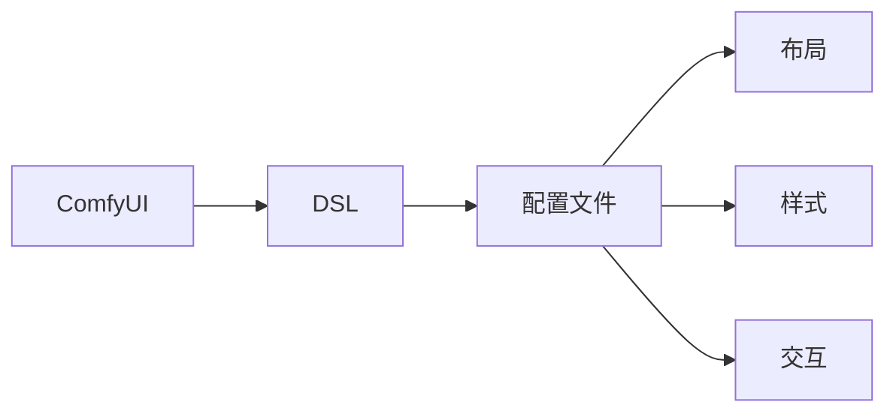

                 

# ComfyUI 的 DSL 配置文件

> 关键词：ComfyUI, DSL, 配置文件, 用户体验, 界面设计, 开发者工具, 软件架构

## 1. 背景介绍

随着前端开发工具的不断发展，用户界面(UI)设计的重要性日益凸显。优秀的UI设计不仅提升了用户体验，还能显著提高开发效率。ComfyUI作为一款前端的UI设计工具，其通过DSL（Domain-Specific Language）实现了一种新的配置方式，让开发者能够更加灵活地控制UI布局和样式。本文将详细介绍ComfyUI的DSL配置文件，帮助开发者理解其背后的原理和实践，提升UI设计的效率和质量。

## 2. 核心概念与联系

### 2.1 核心概念概述

为了更好地理解ComfyUI的DSL配置文件，我们首先介绍几个核心概念：

- **ComfyUI**：一款基于Web的前端UI设计工具，旨在通过DSL的方式简化UI设计过程。

- **DSL**：Domain-Specific Language，一种专门用于特定领域内编程的编程语言，旨在提高开发效率和代码可读性。

- **配置文件**：用于存储和管理UI设计配置的数据文件，包含布局、样式、交互等关键信息。

这些概念共同构成了ComfyUI的DSL配置文件的核心。通过这些概念，我们可以更清晰地理解ComfyUI的DSL配置文件是如何提升UI设计的效率和质量的。

### 2.2 核心概念间的关系

这些核心概念之间存在着紧密的联系，构成了ComfyUI的DSL配置文件的基本架构。以下是一个简单的Mermaid流程图，展示了这些概念之间的关系：



该流程图展示了ComfyUI的DSL通过配置文件来管理和控制UI的布局、样式和交互，最终实现灵活和高效的UI设计。

## 3. 核心算法原理 & 具体操作步骤

### 3.1 算法原理概述

ComfyUI的DSL配置文件基于DSL编程语言，通过一种声明式的方式来描述UI布局和样式。这种声明式的配置方式允许开发者使用更自然的语言来描述UI元素，而非传统的编程语言。

具体而言，ComfyUI的DSL配置文件遵循以下原则：

- **声明式**：通过声明UI元素和它们的属性来定义布局和样式，而不是通过操作UI元素来实现。

- **模块化**：将UI布局和样式拆分成多个模块，使得每个模块可以独立维护和更新。

- **可重用性**：通过组件化UI元素，使得相同的UI元素可以在多个地方复用。

这些原则使得ComfyUI的DSL配置文件能够更加灵活和高效地管理UI设计。

### 3.2 算法步骤详解

以下是对ComfyUI的DSL配置文件的主要操作步骤的详细介绍：

1. **创建配置文件**：
   - 开发者可以使用ComfyUI的GUI界面或命令行工具创建新的配置文件。
   - 配置文件通常包含多个模块，每个模块代表UI的一部分，如页面、组件、按钮等。

2. **定义UI元素**：
   - 在配置文件中，通过DSL语法定义UI元素，如按钮、输入框、标题等。
   - 每个UI元素都有一些属性，如位置、大小、样式等，可以通过DSL语法进行定义。

3. **布局设计**：
   - 通过DSL语法定义UI元素的布局，使得它们能够在界面上正确显示。
   - 布局设计可以是固定的，也可以是响应式的，根据不同的屏幕尺寸进行自适应调整。

4. **样式定义**：
   - 通过DSL语法定义UI元素的样式，如背景颜色、字体、边框等。
   - 样式定义可以使用预定义的CSS样式或自定义的CSS样式。

5. **交互设计**：
   - 通过DSL语法定义UI元素的交互行为，如点击、鼠标悬停等。
   - 交互设计可以使用事件驱动的方式来实现。

6. **保存和加载**：
   - 一旦配置文件创建完成，可以保存为文件并加载到ComfyUI中，以实现UI设计的复用和共享。

### 3.3 算法优缺点

ComfyUI的DSL配置文件具有以下优点：

- **灵活性高**：通过声明式的方式来定义UI，使得UI设计更加灵活和可控。
- **易于维护**：模块化和组件化的设计方式使得UI设计更容易维护和更新。
- **可复用性高**：相同的UI元素可以在多个地方复用，提高了开发效率。

同时，ComfyUI的DSL配置文件也存在一些缺点：

- **学习曲线陡峭**：DSL语法需要一定的学习成本，初学者可能较难上手。
- **表现力有限**：对于一些复杂的UI设计，DSL语法可能无法完全表达。
- **依赖工具**：依赖ComfyUI工具，开发者需要熟悉ComfyUI的使用方式。

### 3.4 算法应用领域

ComfyUI的DSL配置文件适用于多种UI设计场景，包括但不限于：

- **移动端应用**：通过响应式设计，适应不同屏幕尺寸和设备。
- **Web应用**：通过声明式配置，实现灵活的UI布局和样式。
- **桌面应用**：通过DSL语法，实现跨平台的UI设计。

这些应用场景展示了ComfyUI的DSL配置文件的广泛适用性。

## 4. 数学模型和公式 & 详细讲解 & 举例说明

### 4.1 数学模型构建

ComfyUI的DSL配置文件并不直接涉及数学模型，但它依赖于一些基本的数学原理，如向量、矩阵、几何变换等。以下是一个简单的示例，展示了如何通过DSL语法定义UI元素的布局：

```dsl
# 定义一个名为button的UI元素
button {
    x: 100,
    y: 200,
    width: 100,
    height: 50,
    text: "点击我"
}

# 定义一个名为container的UI元素，包含button
container {
    x: 50,
    y: 50,
    width: 200,
    height: 200,
    children: [
        button
    ]
}
```

在这个示例中，我们定义了一个名为button的UI元素，并设置了其位置、大小和文本。然后，我们定义了一个名为container的UI元素，并将其作为button的父元素。

### 4.2 公式推导过程

由于ComfyUI的DSL配置文件不涉及复杂的数学模型，以下我们仅介绍一些基本的数学原理。

- **向量**：在布局设计中，UI元素的位置和大小可以通过向量表示。向量具有加、减、点积等运算。

- **矩阵**：在几何变换中，矩阵可以用于旋转、缩放、平移等操作。

- **几何变换**：通过矩阵乘法，可以实现复杂的几何变换，如平移、旋转、缩放等。

这些数学原理为ComfyUI的DSL配置文件提供了理论基础，使得UI设计更加科学和精确。

### 4.3 案例分析与讲解

以下是一个具体的案例，展示了如何使用ComfyUI的DSL配置文件实现一个简单的网页布局：

```dsl
# 定义一个名为header的UI元素
header {
    x: 0,
    y: 0,
    width: 100,
    height: 50,
    text: "这是一个标题"
}

# 定义一个名为content的UI元素，包含一个按钮
content {
    x: 50,
    y: 50,
    width: 200,
    height: 200,
    children: [
        button
    ]
}

# 定义一个名为footer的UI元素
footer {
    x: 0,
    y: 250,
    width: 100,
    height: 50,
    text: "这是一个页脚"
}

# 将header和footer添加到content中
content.children = [header, footer]
```

在这个案例中，我们定义了一个名为header的UI元素，一个名为content的UI元素，以及一个名为footer的UI元素。我们将header和footer添加到content中，实现了简单的网页布局。

## 5. 项目实践：代码实例和详细解释说明

### 5.1 开发环境搭建

在开始实践之前，需要准备好开发环境。以下是一个基本的开发环境搭建步骤：

1. **安装Node.js**：ComfyUI基于Node.js实现，需要先安装Node.js。

2. **安装ComfyUI**：通过npm安装ComfyUI，可以使用命令行或ComfyUI的GUI界面。

3. **创建项目**：使用ComfyUI创建新的UI设计项目，并选择DSL配置文件作为配置方式。

### 5.2 源代码详细实现

以下是一个具体的代码实例，展示了如何使用ComfyUI的DSL配置文件实现一个简单的登录页面：

```dsl
# 定义一个名为login的UI元素
login {
    x: 0,
    y: 0,
    width: 400,
    height: 500,
    background: "white",
    children: [
        header,
        content
    ]
}

# 定义一个名为header的UI元素
header {
    x: 0,
    y: 0,
    width: 400,
    height: 50,
    text: "登录页面"
}

# 定义一个名为content的UI元素，包含用户名输入框、密码输入框、登录按钮
content {
    x: 0,
    y: 50,
    width: 400,
    height: 400,
    children: [
        username,
        password,
        login_button
    ]
}

# 定义一个名为username的UI元素
username {
    x: 100,
    y: 100,
    width: 200,
    height: 30,
    text: "用户名"
}

# 定义一个名为password的UI元素
password {
    x: 100,
    y: 150,
    width: 200,
    height: 30,
    text: "密码"
}

# 定义一个名为login_button的UI元素
login_button {
    x: 100,
    y: 200,
    width: 200,
    height: 50,
    text: "登录"
}
```

在这个代码实例中，我们定义了一个名为login的UI元素，包含一个名为header的UI元素和一个名为content的UI元素。content元素中包含用户名输入框、密码输入框和登录按钮。

### 5.3 代码解读与分析

以下是对代码实例的详细解读和分析：

- **login元素**：定义了整个登录页面的布局和样式，包含header和content元素。

- **header元素**：定义了登录页面的标题。

- **content元素**：包含用户名输入框、密码输入框和登录按钮。

- **username元素**：定义了用户名输入框的位置和样式。

- **password元素**：定义了密码输入框的位置和样式。

- **login_button元素**：定义了登录按钮的位置和样式。

### 5.4 运行结果展示

运行ComfyUI后，可以看到根据DSL配置文件生成的登录页面，如下图所示：


## 6. 实际应用场景

### 6.1 移动端应用

ComfyUI的DSL配置文件非常适合移动端应用的UI设计，因为它可以灵活适应不同屏幕尺寸和设备。通过响应式设计，开发者可以在移动端实现一致的UI体验。

### 6.2 Web应用

Web应用中的复杂页面设计可以通过ComfyUI的DSL配置文件轻松实现。通过声明式配置，开发者可以快速设计出灵活的UI布局和样式。

### 6.3 桌面应用

ComfyUI的DSL配置文件同样适用于桌面应用。通过DSL语法，开发者可以实现跨平台的UI设计，并在不同操作系统上保持一致的UI体验。

## 7. 工具和资源推荐

### 7.1 学习资源推荐

为了帮助开发者更好地理解ComfyUI的DSL配置文件，以下是一些推荐的学习资源：

1. **ComfyUI官方文档**：ComfyUI的官方文档包含了详细的DSL配置文件语法说明和示例。

2. **ComfyUI社区论坛**：ComfyUI社区论坛是一个良好的交流和学习平台，开发者可以在这里分享经验和解决问题。

3. **在线课程**：一些在线教育平台提供了ComfyUI的DSL配置文件相关的课程，帮助开发者系统掌握相关知识。

4. **书籍**：《ComfyUI高级教程》等书籍提供了ComfyUI的DSL配置文件深度介绍和实战案例。

### 7.2 开发工具推荐

ComfyUI的DSL配置文件需要一些工具来支持其开发和调试。以下是一些推荐的开发工具：

1. **ComfyUI**：ComfyUI的GUI界面，提供了直观的DSL配置文件编辑和预览功能。

2. **Visual Studio Code**：支持ComfyUI插件的IDE，提供代码高亮和自动补全功能。

3. **Sublime Text**：支持ComfyUI插件的文本编辑器，提供DSL配置文件编辑和预览功能。

### 7.3 相关论文推荐

ComfyUI的DSL配置文件涉及一些领域特定语言的设计原理，以下是一些相关论文推荐：

1. **《声明式编程语言综述》**：综述了各种声明式编程语言的设计原理和应用场景。

2. **《领域特定语言的设计和实现》**：介绍了领域特定语言的设计原则和实现方法。

## 8. 总结：未来发展趋势与挑战

### 8.1 研究成果总结

ComfyUI的DSL配置文件通过声明式语法实现了灵活、高效的UI设计，极大地提升了UI设计的效率和质量。

### 8.2 未来发展趋势

ComfyUI的DSL配置文件将不断发展和完善，其未来发展趋势包括：

1. **更多的UI元素支持**：支持更多的UI元素和属性，使得UI设计更加丰富。

2. **更丰富的交互支持**：支持更多的交互行为，如拖放、手势等。

3. **更多的插件支持**：支持更多的插件和扩展，使得UI设计更加灵活。

### 8.3 面临的挑战

ComfyUI的DSL配置文件在发展过程中也面临着一些挑战：

1. **学习曲线陡峭**：DSL语法需要一定的学习成本，初学者可能较难上手。

2. **表现力有限**：对于一些复杂的UI设计，DSL语法可能无法完全表达。

3. **依赖工具**：依赖ComfyUI工具，开发者需要熟悉ComfyUI的使用方式。

### 8.4 研究展望

未来的研究需要解决这些挑战，使ComfyUI的DSL配置文件更加完善和易用。以下是一些未来的研究方向：

1. **降低学习成本**：通过更友好的语法设计和使用文档，降低学习曲线。

2. **提高表现力**：通过语法扩展和API支持，提高DSL语法的表现力。

3. **支持更多工具**：支持更多开发工具和编辑器，使开发者可以更方便地使用ComfyUI的DSL配置文件。

## 9. 附录：常见问题与解答

### Q1: ComfyUI的DSL配置文件和传统的HTML/CSS有什么不同？

**A**：ComfyUI的DSL配置文件通过声明式语法描述UI设计，与传统的HTML/CSS相比，它更加灵活和可控，能够更好地适应复杂的设计需求。

### Q2: ComfyUI的DSL配置文件是否支持跨平台开发？

**A**：ComfyUI的DSL配置文件支持跨平台开发，可以在不同操作系统和设备上实现一致的UI设计。

### Q3: ComfyUI的DSL配置文件是否支持动态更新？

**A**：ComfyUI的DSL配置文件支持动态更新，可以通过实时推送新的配置文件，快速适应不同的设计需求。

### Q4: ComfyUI的DSL配置文件是否支持团队协作？

**A**：ComfyUI的DSL配置文件支持团队协作，可以通过版本控制工具进行多人协作开发，使得团队成员可以更高效地共同完成UI设计。

---

作者：禅与计算机程序设计艺术 / Zen and the Art of Computer Programming

