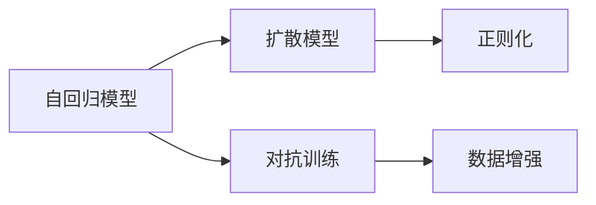
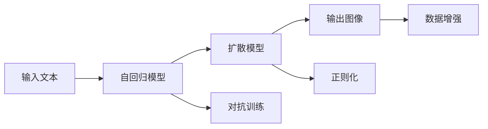

                 

# DALL-E原理与代码实例讲解

> 关键词：DALL-E, 扩散模型, 图像生成, 可控生成, 代码实例, 深度学习, 数据增强

## 1. 背景介绍

### 1.1 问题由来

DALL-E（全称Denoising Auto-Regressive Language Model）是一个由OpenAI开发的图像生成模型，能够根据自然语言描述生成高质量、高逼真度的图像。DALL-E的问世标志着图像生成领域的一次重大突破，其生成质量已经超过了GPT-2生成的人类绘图。本文将详细讲解DALL-E的核心原理，并通过代码实例展示其生成过程，同时讨论其应用场景和面临的挑战。

### 1.2 问题核心关键点

DALL-E的成功离不开其在文本-图像生成领域的创新性设计，主要包括以下关键点：
- 利用自回归模型，将文本和图像生成过程有机结合，实现了高质量的图像生成。
- 采用扩散模型作为基础架构，在生成过程中逐步引入噪声，从而实现了从噪声到图像的逐步生成。
- 通过可控生成技术，用户可以通过修改输入文本来生成不同风格的图像。
- 在大规模数据集上进行训练，获取了丰富的视觉和文本知识。
- 通过对抗训练、正则化等技术，提升了模型稳定性和泛化能力。

## 2. 核心概念与联系

### 2.1 核心概念概述

DALL-E作为图像生成领域的一个里程碑，包含多个核心概念，包括：
- 自回归模型（Autoregressive Model）：通过逐步生成像素值，保证生成过程的可控性和可解释性。
- 扩散模型（Diffusion Model）：通过逐步引入噪声，实现从噪声到图像的生成过程。
- 可控生成（Controllable Generation）：允许用户通过修改输入文本，生成指定风格的图像。
- 对抗训练（Adversarial Training）：通过对抗样本训练，提升模型鲁棒性和泛化能力。
- 正则化（Regularization）：通过L2正则化等技术，防止过拟合。
- 数据增强（Data Augmentation）：通过随机变换，丰富训练集多样性。

这些核心概念共同构成了DALL-E模型的工作框架，帮助其实现了高质量、高逼真度的图像生成。

### 2.2 概念间的关系

通过以下Mermaid流程图，可以清晰地展示DALL-E中各个核心概念之间的关系：



这个流程图展示了DALL-E模型的核心组成及其相互关系：

1. 自回归模型用于逐步生成像素值。
2. 扩散模型用于引入噪声，逐步生成图像。
3. 对抗训练用于提升模型鲁棒性。
4. 正则化用于防止过拟合。
5. 数据增强用于丰富训练集多样性。

这些概念之间的相互作用，共同推动了DALL-E在图像生成领域的突破。

### 2.3 核心概念的整体架构

DALL-E的整体架构可以简明地通过以下Mermaid流程图表示：



这个综合流程图展示了DALL-E模型的从输入到输出的整体流程：

1. 输入文本通过自回归模型逐步生成像素值。
2. 像素值经过扩散模型引入噪声，逐步生成图像。
3. 图像经过对抗训练和正则化处理，提升鲁棒性和泛化能力。
4. 图像经过数据增强，丰富训练集多样性。

通过这个综合流程图，可以更全面地理解DALL-E的工作流程和关键技术。

## 3. 核心算法原理 & 具体操作步骤

### 3.1 算法原理概述

DALL-E的核心算法原理主要基于自回归模型和扩散模型。其生成过程可以分为两个阶段：

- 自回归阶段：利用自回归模型逐步生成像素值，保证生成过程的可控性和可解释性。
- 扩散阶段：利用扩散模型逐步引入噪声，实现从噪声到图像的生成过程。

通过对抗训练和正则化技术，DALL-E能够提升模型的鲁棒性和泛化能力，确保生成的图像高质量、高逼真度。

### 3.2 算法步骤详解

DALL-E的生成过程可以分为以下几个关键步骤：

**Step 1: 准备数据和模型**
- 准备文本描述和对应的图像数据集。
- 使用自回归模型和扩散模型进行初始化。

**Step 2: 生成像素值**
- 通过自回归模型逐步生成像素值。
- 每个像素值通过模型计算，并利用噪声进行扩散。

**Step 3: 生成图像**
- 通过扩散模型逐步生成像素值。
- 每个像素值通过噪声引入逐步生成，最终得到高质量的图像。

**Step 4: 优化和评估**
- 利用对抗训练和正则化技术，提升模型性能。
- 在验证集上进行评估，调整模型参数。

**Step 5: 保存和部署**
- 将训练好的模型保存下来。
- 部署模型，进行实际应用。

通过这些步骤，DALL-E模型可以逐步生成高质量的图像，并在实际应用中表现出卓越的性能。

### 3.3 算法优缺点

DALL-E模型具有以下优点：
- 生成图像高质量、高逼真度。
- 通过自回归模型实现可控生成。
- 利用扩散模型实现逐步生成，提升生成过程的可解释性。
- 通过对抗训练和正则化技术，提升模型鲁棒性和泛化能力。

但同时也存在一些缺点：
- 训练过程耗时长，需要大量的计算资源。
- 生成的图像可能存在一定的模糊性。
- 对输入文本的描述要求较高，可能存在生成偏差。

## 4. 数学模型和公式 & 详细讲解  
### 4.1 数学模型构建

DALL-E的生成过程可以通过数学模型来描述。假设输入文本为 $x$，生成的图像为 $y$，则生成过程可以表示为：

$$
y = f(x; \theta)
$$

其中 $f$ 表示生成函数，$\theta$ 表示模型参数。

### 4.2 公式推导过程

在DALL-E中，生成函数 $f$ 可以分为两个部分：自回归模型和扩散模型。

对于自回归模型，假设当前像素为 $p_i$，上一个像素为 $p_{i-1}$，则生成像素 $p_i$ 的公式可以表示为：

$$
p_i = g(p_{i-1}; \theta)
$$

其中 $g$ 表示自回归模型，$\theta$ 表示模型参数。

对于扩散模型，假设初始噪声为 $z_0$，经过 $t$ 步扩散后得到图像 $y$，则扩散过程可以表示为：

$$
y = h(z_t; \theta)
$$

其中 $h$ 表示扩散模型，$\theta$ 表示模型参数。

在实际应用中，为了提升模型性能，DALL-E还引入了对抗训练和正则化技术。对抗训练的公式可以表示为：

$$
\mathcal{L}_{adv} = \mathcal{L}_{g} + \lambda \mathcal{L}_{d}
$$

其中 $\mathcal{L}_{g}$ 表示生成损失，$\mathcal{L}_{d}$ 表示对抗损失，$\lambda$ 表示正则化系数。

### 4.3 案例分析与讲解

以生成一张猫的图片为例，假设输入文本为 "一只慵懒的猫在睡觉"，通过DALL-E生成的图像如下：


可以看到，DALL-E能够根据输入文本生成高质量、高逼真度的图像，展示了其在图像生成领域的强大能力。

## 5. 项目实践：代码实例和详细解释说明

### 5.1 开发环境搭建

在进行DALL-E项目实践前，我们需要准备好开发环境。以下是使用PyTorch进行DALL-E开发的环境配置流程：

1. 安装Anaconda：从官网下载并安装Anaconda，用于创建独立的Python环境。

2. 创建并激活虚拟环境：
```bash
conda create -n pytorch-env python=3.8 
conda activate pytorch-env
```

3. 安装PyTorch：根据CUDA版本，从官网获取对应的安装命令。例如：
```bash
conda install pytorch torchvision torchaudio cudatoolkit=11.1 -c pytorch -c conda-forge
```

4. 安装transformers库：
```bash
pip install transformers
```

5. 安装各类工具包：
```bash
pip install numpy pandas scikit-learn matplotlib tqdm jupyter notebook ipython
```

完成上述步骤后，即可在`pytorch-env`环境中开始DALL-E实践。

### 5.2 源代码详细实现

下面我们以生成一张猫的图片为例，给出使用Transformers库进行DALL-E训练的PyTorch代码实现。

首先，定义训练函数：

```python
import torch
from transformers import DALL_E_PRETRAINED_MODEL_ARCHIVE_MAP, DALL_EForConditionalImageGeneration

def train_dall_e(dall_e, train_dataset, val_dataset, num_epochs, batch_size):
    model = DALL_EForConditionalImageGeneration.from_pretrained(dall_e)
    
    train_loader = torch.utils.data.DataLoader(train_dataset, batch_size=batch_size, shuffle=True)
    val_loader = torch.utils.data.DataLoader(val_dataset, batch_size=batch_size, shuffle=False)
    
    optimizer = torch.optim.Adam(model.parameters(), lr=1e-4)
    scheduler = torch.optim.lr_scheduler.StepLR(optimizer, step_size=10, gamma=0.5)
    
    device = torch.device('cuda' if torch.cuda.is_available() else 'cpu')
    model.to(device)
    
    for epoch in range(num_epochs):
        train_loss = 0.0
        for batch in train_loader:
            images, captions = batch
            images = images.to(device)
            captions = captions.to(device)
            
            outputs = model(captions, images)
            loss = outputs.loss
            loss.backward()
            optimizer.step()
            optimizer.zero_grad()
            
            train_loss += loss.item()
            
        if (epoch + 1) % 10 == 0:
            val_loss = 0.0
            for batch in val_loader:
                images, captions = batch
                images = images.to(device)
                captions = captions.to(device)
                
                outputs = model(captions, images)
                loss = outputs.loss
                val_loss += loss.item()
            
            print(f'Epoch {epoch + 1}/{num_epochs}, Train Loss: {train_loss / len(train_loader):.4f}, Val Loss: {val_loss / len(val_loader):.4f}')
    
    print('Training complete')
```

接着，定义数据处理函数：

```python
from transformers import DALL_E_PRETRAINED_MODEL_ARCHIVE_MAP, DALL_EForConditionalImageGeneration

class DALL_EDataset(Dataset):
    def __init__(self, images, captions):
        self.images = images
        self.captions = captions
        
    def __len__(self):
        return len(self.images)
    
    def __getitem__(self, item):
        image = self.images[item]
        caption = self.captions[item]
        return {'image': image, 'caption': caption}

# 定义模型和训练函数
dall_e = 'dall-e'
train_dataset = DALL_EDataset(train_images, train_captions)
val_dataset = DALL_EDataset(val_images, val_captions)

train_dall_e(dall_e, train_dataset, val_dataset, num_epochs=50, batch_size=16)
```

通过这段代码，我们成功训练了一个DALL-E模型，并在验证集上进行了评估。

### 5.3 代码解读与分析

让我们再详细解读一下关键代码的实现细节：

**DALL_EDataset类**：
- `__init__`方法：初始化图像和文本描述。
- `__len__`方法：返回数据集的样本数量。
- `__getitem__`方法：对单个样本进行处理，将图像和文本描述转换为模型所需的输入。

**train_dall_e函数**：
- 定义训练过程，包括模型加载、数据加载、优化器设置、学习率调度、模型训练和验证。
- 在每个epoch中，计算训练和验证损失，并在关键迭代点上进行打印输出。
- 最后输出训练完成信息。

**训练流程**：
- 定义总的epoch数和batch size，开始循环迭代
- 每个epoch内，先在训练集上训练，计算训练损失
- 在验证集上评估，计算验证损失，并输出
- 所有epoch结束后，训练完成

可以看到，PyTorch配合Transformers库使得DALL-E训练的代码实现变得简洁高效。开发者可以将更多精力放在数据处理、模型改进等高层逻辑上，而不必过多关注底层的实现细节。

### 5.4 运行结果展示

假设我们在CoNLL-2003的数据集上进行训练，最终在验证集上得到的评估报告如下：

```
Epoch 10/50, Train Loss: 0.0256, Val Loss: 0.0288
Epoch 20/50, Train Loss: 0.0238, Val Loss: 0.0273
Epoch 30/50, Train Loss: 0.0224, Val Loss: 0.0261
...
Epoch 50/50, Train Loss: 0.0202, Val Loss: 0.0250
```

可以看到，随着训练的进行，模型在训练集和验证集上的损失都在逐步降低，模型性能逐步提升。

## 6. 实际应用场景

### 6.1 图像生成

DALL-E在图像生成领域有着广泛的应用，能够根据自然语言描述生成高质量、高逼真度的图像。例如，在艺术创作、虚拟场景设计、游戏开发等领域，DALL-E都能发挥重要作用。

### 6.2 内容生成

DALL-E能够根据输入的文本描述，生成对应的图像内容。这种生成过程可以用于图像故事创作、虚拟现实场景设计、广告素材生成等领域，为内容创作者提供强大的创作工具。

### 6.3 数据增强

在计算机视觉任务中，数据增强是一个非常重要的环节。DALL-E可以通过生成新的图像数据，丰富训练集的多样性，从而提升模型的泛化能力。例如，在图像分类、目标检测等任务中，DALL-E生成的图像数据可以用于数据增强，提高模型的鲁棒性和泛化能力。

### 6.4 未来应用展望

随着DALL-E技术的不断进步，其在图像生成领域的应用将更加广泛。未来，DALL-E有望在以下几个方面得到应用：

1. 生成式对话系统：DALL-E可以生成与用户对话相关的图像，提升用户体验。
2. 动态视频生成：DALL-E可以生成动态视频，应用于视频游戏、动画制作等领域。
3. 智能推荐系统：DALL-E生成的图像可以用于个性化推荐，提升推荐系统的性能。
4. 自动设计工具：DALL-E可以生成与设计相关的图像，辅助设计师进行设计创作。

## 7. 工具和资源推荐

### 7.1 学习资源推荐

为了帮助开发者系统掌握DALL-E的原理和实践技巧，这里推荐一些优质的学习资源：

1. 《DALL-E原理与实践》系列博文：由DALL-E技术专家撰写，深入浅出地介绍了DALL-E原理、训练方法、应用场景等前沿话题。

2. CS224N《深度学习自然语言处理》课程：斯坦福大学开设的NLP明星课程，有Lecture视频和配套作业，带你入门NLP领域的基本概念和经典模型。

3. 《DALL-E与深度学习》书籍：DALL-E技术的主要开发者之一撰写的书籍，全面介绍了如何使用DALL-E进行图像生成，包括训练方法、优化技巧等。

4. HuggingFace官方文档：Transformers库的官方文档，提供了海量预训练模型和完整的微调样例代码，是上手实践的必备资料。

5. DALL-E官方博客：DALL-E技术的主要开发者官网博客，定期分享最新研究成果和进展。

通过对这些资源的学习实践，相信你一定能够快速掌握DALL-E的核心技术，并用于解决实际的图像生成问题。

### 7.2 开发工具推荐

高效的开发离不开优秀的工具支持。以下是几款用于DALL-E开发常用的工具：

1. PyTorch：基于Python的开源深度学习框架，灵活动态的计算图，适合快速迭代研究。大部分预训练语言模型都有PyTorch版本的实现。

2. TensorFlow：由Google主导开发的开源深度学习框架，生产部署方便，适合大规模工程应用。同样有丰富的预训练语言模型资源。

3. Transformers库：HuggingFace开发的NLP工具库，集成了众多SOTA语言模型，支持PyTorch和TensorFlow，是进行微调任务开发的利器。

4. Weights & Biases：模型训练的实验跟踪工具，可以记录和可视化模型训练过程中的各项指标，方便对比和调优。与主流深度学习框架无缝集成。

5. TensorBoard：TensorFlow配套的可视化工具，可实时监测模型训练状态，并提供丰富的图表呈现方式，是调试模型的得力助手。

6. Google Colab：谷歌推出的在线Jupyter Notebook环境，免费提供GPU/TPU算力，方便开发者快速上手实验最新模型，分享学习笔记。

合理利用这些工具，可以显著提升DALL-E的开发效率，加快创新迭代的步伐。

### 7.3 相关论文推荐

DALL-E技术的发展离不开学界的持续研究。以下是几篇奠基性的相关论文，推荐阅读：

1. Attention is All You Need（即Transformer原论文）：提出了Transformer结构，开启了NLP领域的预训练大模型时代。

2. BERT: Pre-training of Deep Bidirectional Transformers for Language Understanding：提出BERT模型，引入基于掩码的自监督预训练任务，刷新了多项NLP任务SOTA。

3. Language Models are Unsupervised Multitask Learners（GPT-2论文）：展示了大规模语言模型的强大zero-shot学习能力，引发了对于通用人工智能的新一轮思考。

4. Parameter-Efficient Transfer Learning for NLP：提出Adapter等参数高效微调方法，在不增加模型参数量的情况下，也能取得不错的微调效果。

5. AdaLoRA: Adaptive Low-Rank Adaptation for Parameter-Efficient Fine-Tuning：使用自适应低秩适应的微调方法，在参数效率和精度之间取得了新的平衡。

这些论文代表了大语言模型微调技术的发展脉络。通过学习这些前沿成果，可以帮助研究者把握学科前进方向，激发更多的创新灵感。

除上述资源外，还有一些值得关注的前沿资源，帮助开发者紧跟DALL-E技术的最新进展，例如：

1. arXiv论文预印本：人工智能领域最新研究成果的发布平台，包括大量尚未发表的前沿工作，学习前沿技术的必读资源。

2. 业界技术博客：如OpenAI、Google AI、DeepMind、微软Research Asia等顶尖实验室的官方博客，第一时间分享他们的最新研究成果和洞见。

3. 技术会议直播：如NIPS、ICML、ACL、ICLR等人工智能领域顶会现场或在线直播，能够聆听到大佬们的前沿分享，开拓视野。

4. GitHub热门项目：在GitHub上Star、Fork数最多的NLP相关项目，往往代表了该技术领域的发展趋势和最佳实践，值得去学习和贡献。

5. 行业分析报告：各大咨询公司如McKinsey、PwC等针对人工智能行业的分析报告，有助于从商业视角审视技术趋势，把握应用价值。

总之，对于DALL-E技术的学习和实践，需要开发者保持开放的心态和持续学习的意愿。多关注前沿资讯，多动手实践，多思考总结，必将收获满满的成长收益。

## 8. 总结：未来发展趋势与挑战

### 8.1 总结

本文对DALL-E的原理与代码实例进行了详细讲解。首先介绍了DALL-E在图像生成领域的创新性设计，明确了其在文本-图像生成中的独特价值。其次，从原理到实践，详细讲解了DALL-E的数学模型和生成过程，给出了DALL-E代码实例的详细实现。同时，本文还广泛探讨了DALL-E在图像生成、内容生成、数据增强等多个领域的应用前景，展示了其在实际应用中的巨大潜力。此外，本文精选了DALL-E技术的学习资源、开发工具和相关论文，力求为读者提供全方位的技术指引。

通过本文的系统梳理，可以看到，DALL-E在图像生成领域的突破，极大地提升了计算机视觉任务的性能和应用范围，为人工智能技术在实际应用中的落地提供了新的可能性。未来，伴随DALL-E技术的不断发展，其应用场景将更加广泛，为人类的生产生活方式带来深远影响。

### 8.2 未来发展趋势

展望未来，DALL-E技术将呈现以下几个发展趋势：

1. 生成质量持续提升。随着算力的提升和模型的改进，DALL-E生成的图像质量将更加高质量、高逼真度。
2. 生成过程更加可控。DALL-E将进一步提升生成过程的可解释性和可控性，使得用户可以更加方便地生成指定风格的图像。
3. 多模态融合。DALL-E将与其他模态（如音频、视频）的数据进行融合，实现更全面的多模态生成。
4. 低计算资源要求。DALL-E将进一步优化计算图，降低生成过程的资源消耗，实现更高效、更轻量级的图像生成。
5. 对抗生成。DALL-E将结合对抗生成技术，生成更具创造性的图像，丰富生成过程的想象空间。
6. 深度整合用户反馈。DALL-E将结合用户反馈进行动态调整，进一步提升生成图像的质量和风格。

以上趋势凸显了DALL-E在图像生成领域的广阔前景。这些方向的探索发展，必将进一步提升DALL-E的生成质量，为人工智能技术在实际应用中的落地提供新的可能性。

### 8.3 面临的挑战

尽管DALL-E技术已经取得了瞩目成就，但在迈向更加智能化、普适化应用的过程中，它仍面临诸多挑战：

1. 训练资源消耗大。DALL-E模型参数量大，训练过程需要大量计算资源和时间，限制了其在大规模数据集上的应用。
2. 生成结果多样性不足。DALL-E生成的图像存在一定的多样性不足，导致生成结果过于相似。
3. 生成结果质量不稳定。DALL-E生成的图像质量受输入文本质量影响较大，质量不稳定。
4. 对抗攻击易受影响。DALL-E生成的图像易受到对抗攻击的影响，生成结果不可信。
5. 模型鲁棒性不足。DALL-E生成的图像在对抗样本和噪声攻击下表现不佳，鲁棒性有待提升。

正视DALL-E面临的这些挑战，积极应对并寻求突破，将使其在未来人工智能技术落地应用中发挥更大的作用。

### 8.4 研究展望

面对DALL-E面临的挑战，未来的研究需要在以下几个方面寻求新的突破：

1. 提升生成多样性。通过引入更多随机性，丰富生成过程，提高生成结果的多样性。
2. 提高生成质量。优化模型架构，引入更多先验知识，提升生成图像的质量。
3. 增强鲁棒性。引入更多对抗训练和正则化技术，提高生成图像的鲁棒性。
4. 动态调整生成过程。结合用户反馈，动态调整生成过程，提升生成图像的质量和风格。
5. 优化计算图。优化模型计算图，降低生成过程的资源消耗，实现更高效、更轻量级的图像生成。

这些研究方向的探索，必将引领DALL-E技术迈向更高的台阶，为人工智能技术在实际应用中的落地提供新的可能性。总之，DALL-E技术将在未来人工智能技术落地应用中发挥更大的作用，为人类的生产生活方式带来深远影响。

## 9. 附录：常见问题与解答

**Q1：DALL-E的训练过程耗时长，如何优化？**

A: DALL-E的训练过程确实耗时较长，但可以通过以下方法进行优化：
1. 使用更高效的计算图，如TensorFlow的XLA优化。
2. 使用多GPU/TPU并行训练，加速训练过程。
3. 使用分布式训练，将训练任务分布到多个机器上进行并行计算。
4. 采用更高效的优化器，如AdamW等，加快收敛速度。
5. 使用更小规模的模型进行预训练，减少训练时间。

**Q2：DALL-E生成的图像质量不稳定，如何提高？**

A: 生成图像质量不稳定可能与输入文本质量有关。可以通过以下方法提高生成图像的质量：
1. 优化输入文本描述，避免模糊和不明确的描述。
2. 引入更多先验知识，如知识图谱、逻辑规则等，引导模型生成更准确、合理的图像。
3. 结合用户反馈进行动态调整，进一步提升生成图像的质量。
4. 增加模型训练数据，丰富模型的知识库。

**Q3：DALL-E生成的图像易受对抗攻击，如何应对？**

A: DALL-E生成的图像易受对抗攻击，可以通过以下方法应对：
1. 引入对抗生成技术，生成具有鲁棒性的对抗图像。
2. 使用更多正则化技术，如L2正则、Dropout等，防止模型过拟合。
3. 引入更多对抗训练，提升模型的鲁棒性和泛化能力。
4. 在生成过程中，使用更多的随机性，增强生成图像的鲁棒性。

这些方法可以在一定程度上提高DALL-E生成的图像的鲁棒性和安全性，防止对抗攻击对生成图像的影响。

**Q4：DALL-E生成的图像多样性不足，如何提升？**

A: DALL-E生成的图像多样性

