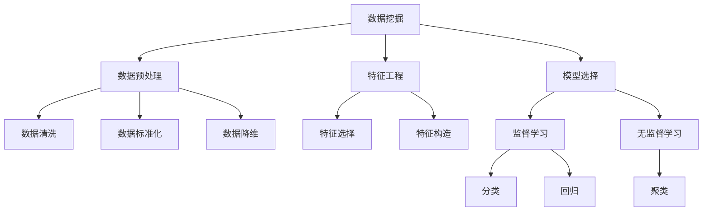
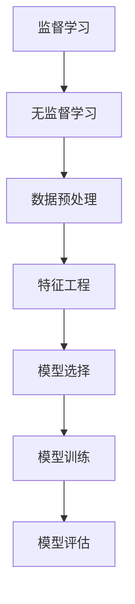

                 

# Data Mining 原理与代码实战案例讲解

> 关键词：数据挖掘, 特征工程, 模型评估, 监督学习, 无监督学习, 聚类算法, 分类算法, 回归算法

## 1. 背景介绍

### 1.1 问题由来
在现代数据驱动的时代，数据挖掘(Data Mining)已经成为各行各业获取知识和洞察的重要手段。从金融、医疗到零售、电商，各行各业都利用数据挖掘技术来揭示业务规律、优化决策过程，提升运营效率和竞争力。数据挖掘不仅限于静态数据，也涵盖时间序列、图像、音频等多模态数据的挖掘与分析。

数据挖掘的过程大致可分为四个步骤：数据预处理、特征工程、模型选择和模型评估。其中，数据预处理包括数据清洗、标准化和降维等环节；特征工程是提取和构造有意义的特征，为模型选择提供支持；模型选择则涉及监督学习、无监督学习等多种学习范式；模型评估用于验证和优化模型性能。本文将重点介绍数据挖掘的核心概念、常见算法以及实战案例，以期帮助读者系统掌握数据挖掘的理论和实践技能。

### 1.2 问题核心关键点
数据挖掘的核心在于通过挖掘数据中的隐藏知识，帮助用户做出更明智的决策。数据挖掘涉及数据预处理、特征工程、模型选择和模型评估等多个环节。

1. **数据预处理**：包括清洗、转换、降维等操作，确保数据质量和可用性。
2. **特征工程**：通过提取和构造特征，为模型学习提供有意义的信息。
3. **模型选择**：在监督学习、无监督学习等范式中，选择合适的模型进行训练和预测。
4. **模型评估**：使用合适的指标评估模型性能，并进行必要的调优。

本文将围绕这些关键点，系统介绍数据挖掘的原理与方法，并通过实际案例进行详细讲解。

### 1.3 问题研究意义
掌握数据挖掘技术，对于提升企业的数据分析能力、优化业务决策具有重要意义。具体来说，数据挖掘可以帮助企业：
1. **发现隐藏模式**：从大量数据中揭示业务规律，预测未来趋势。
2. **优化决策过程**：通过数据驱动的洞察，辅助企业制定更科学的决策。
3. **提高运营效率**：自动化的数据挖掘过程，可以减少人工干预，提高运营效率。
4. **增强竞争力**：通过精准的市场分析，把握商机，提升市场竞争力。

因此，数据挖掘技术在当前数据驱动的商业环境中，具有不可替代的价值。本文将系统介绍数据挖掘的核心概念、常见算法以及实战案例，帮助读者掌握数据挖掘的精髓，并在实际应用中发挥其价值。

## 2. 核心概念与联系

### 2.1 核心概念概述

为更好地理解数据挖掘的过程，本节将介绍几个密切相关的核心概念：

- **数据挖掘(Data Mining)**：从大量数据中提取有用信息和知识的过程。
- **特征工程(Feature Engineering)**：通过预处理和构造特征，为模型学习提供有意义的输入。
- **监督学习(Supervised Learning)**：利用有标签数据训练模型，进行分类、回归等任务。
- **无监督学习(Unsupervised Learning)**：在没有标签数据的情况下，通过聚类、降维等方法发现数据中的隐含结构。
- **聚类(Clustering)**：将数据分成若干群组，使得每个群组内的数据相似度最大化。
- **分类(Classification)**：将数据分为预定义的类别，如回归、SVM、决策树等。
- **回归(Regression)**：预测数值型变量的值，如线性回归、岭回归等。
- **模型评估(Model Evaluation)**：通过交叉验证、ROC曲线等方法评估模型性能，并进行调优。

这些核心概念之间的逻辑关系可以通过以下Mermaid流程图来展示：



这个流程图展示了大数据挖掘的整体流程：

1. 数据挖掘从数据预处理开始，经过特征工程后，可选择监督学习或无监督学习进行模型训练。
2. 监督学习下，模型可以选择分类或回归；无监督学习下，模型可以选择聚类等方法。
3. 最后通过模型评估对模型性能进行验证和调优。

### 2.2 概念间的关系

这些核心概念之间存在着紧密的联系，形成了数据挖掘的完整生态系统。下面我通过几个Mermaid流程图来展示这些概念之间的关系。

#### 2.2.1 数据挖掘的完整流程


这个流程图展示了数据挖掘的全流程：从数据预处理到特征工程，再到模型选择、训练和评估，各个环节相互依赖，共同构成数据挖掘的闭环。

#### 2.2.2 特征工程与模型选择的关系


特征工程通过选择合适的特征，提升模型的预测性能。模型选择根据特征工程的结果，选择合适的模型进行训练，并通过评估验证模型的性能。

#### 2.2.3 监督学习与无监督学习的关系



监督学习和无监督学习各自有不同的应用场景。数据预处理和特征工程是两者共有的环节。模型选择和训练则是根据数据特征进行的，监督学习需要标签数据，而无监督学习则不需要。最后，模型评估是验证模型性能的关键环节。

## 3. 核心算法原理 & 具体操作步骤
### 3.1 算法原理概述

数据挖掘的核心算法主要涉及监督学习、无监督学习和半监督学习。以下是对这些算法原理的概述：

- **监督学习**：利用有标签数据训练模型，常用的算法包括线性回归、逻辑回归、决策树、随机森林、支持向量机(SVM)等。
- **无监督学习**：不依赖标签数据，通过聚类、降维等方法发现数据中的隐含结构，常用的算法包括K-means、层次聚类、PCA、t-SNE等。
- **半监督学习**：利用少量有标签数据和大量无标签数据，通过半监督学习方法提高模型性能，常用的算法包括EM算法、图半监督学习等。

### 3.2 算法步骤详解

以下以监督学习中的逻辑回归算法为例，详细介绍其步骤：

**Step 1: 准备数据集**
- 收集数据集，包括输入特征$X$和输出标签$y$。
- 将数据集划分为训练集、验证集和测试集。

**Step 2: 数据预处理**
- 进行缺失值处理、异常值检测和去除重复值等预处理操作。
- 进行归一化、标准化等数据转换操作。
- 进行特征选择和构造，如去除不相关特征、构造多项式特征等。

**Step 3: 模型训练**
- 定义逻辑回归模型，包括线性模型和逻辑函数。
- 使用梯度下降等优化算法，最小化损失函数。
- 选择适当的损失函数，如二分类问题的二元交叉熵损失函数。

**Step 4: 模型评估**
- 在验证集上评估模型性能，如准确率、精确率、召回率和F1分数等。
- 使用交叉验证等方法，避免过拟合。
- 选择最优模型，并在测试集上验证模型性能。

**Step 5: 模型应用**
- 对新的数据进行预测，如分类、回归等。
- 对预测结果进行后处理，如阈值调整、异常检测等。

### 3.3 算法优缺点

**监督学习的优点**：
- 有标签数据可以直接指导模型的学习方向。
- 算法成熟，有大量理论和实践支持。
- 结果可解释性强，易于理解和调试。

**监督学习的缺点**：
- 需要大量标注数据，标注成本高。
- 数据分布的差异可能导致过拟合或欠拟合。
- 模型的泛化能力有限，可能无法适应新数据。

**无监督学习的优点**：
- 不需要标注数据，数据获取成本低。
- 能发现数据中的隐含结构，如聚类、降维等。
- 结果可解释性强，易于理解和调试。

**无监督学习的缺点**：
- 需要选择合适的算法和参数，容易陷入局部最优。
- 结果可解释性较差，难以理解模型内部机制。
- 可能无法准确识别数据中的复杂结构。

### 3.4 算法应用领域

监督学习、无监督学习以及半监督学习各有其应用领域：

1. **监督学习**：广泛应用于金融、医疗、零售等有大量标注数据的场景，如信用评分、疾病预测、推荐系统等。
2. **无监督学习**：适用于无标签数据的分析，如客户分群、图像分割、异常检测等。
3. **半监督学习**：适用于标注数据不足的情况，如网络安全、文本分类等。

## 4. 数学模型和公式 & 详细讲解 & 举例说明

### 4.1 数学模型构建

逻辑回归是监督学习中最常用的算法之一，其数学模型构建如下：

$$
y = \ln \frac{p}{1-p}
$$

其中，$y$为输出标签，$p$为预测概率。逻辑回归的目标是最小化损失函数，即：

$$
\mathcal{L} = -\frac{1}{N}\sum_{i=1}^N \sum_{y_i \in \{0,1\}} y_i \log p_i + (1-y_i) \log (1-p_i)
$$

其中，$N$为样本数，$\log$为自然对数。

### 4.2 公式推导过程

逻辑回归的公式推导如下：

1. 定义模型：$y = \ln \frac{p}{1-p}$，其中$p$为预测概率。
2. 定义损失函数：$\mathcal{L} = -\frac{1}{N}\sum_{i=1}^N \sum_{y_i \in \{0,1\}} y_i \log p_i + (1-y_i) \log (1-p_i)$。
3. 计算梯度：$\nabla_{\theta}\mathcal{L} = \frac{1}{N}\sum_{i=1}^N (\frac{y_i}{p_i} - \frac{1-y_i}{1-p_i}) \nabla_{\theta}p_i$。
4. 更新模型参数：$\theta \leftarrow \theta - \eta \nabla_{\theta}\mathcal{L}$。

其中，$\theta$为模型参数，$\eta$为学习率。

### 4.3 案例分析与讲解

假设我们有一组二分类数据，特征$x_1, x_2, ..., x_n$，标签$y$，我们利用逻辑回归模型进行训练，并使用梯度下降法进行参数更新。在每次迭代中，我们计算预测概率$p$，并使用梯度下降更新模型参数$\theta$，最小化损失函数$\mathcal{L}$。

## 5. 项目实践：代码实例和详细解释说明

### 5.1 开发环境搭建

在进行数据挖掘项目实践前，我们需要准备好开发环境。以下是使用Python进行scikit-learn开发的开发环境配置流程：

1. 安装Anaconda：从官网下载并安装Anaconda，用于创建独立的Python环境。

2. 创建并激活虚拟环境：
```bash
conda create -n scikit-learn-env python=3.8 
conda activate scikit-learn-env
```

3. 安装scikit-learn：
```bash
pip install scikit-learn
```

4. 安装其他必要的工具包：
```bash
pip install numpy pandas matplotlib seaborn scikit-image scikit-learn
```

完成上述步骤后，即可在`scikit-learn-env`环境中开始数据挖掘项目实践。

### 5.2 源代码详细实现

这里以逻辑回归为例，展示使用scikit-learn进行数据挖掘项目开发的代码实现。

首先，定义数据集和模型：

```python
from sklearn.datasets import make_classification
from sklearn.linear_model import LogisticRegression
from sklearn.model_selection import train_test_split
from sklearn.metrics import accuracy_score

# 生成二分类数据集
X, y = make_classification(n_samples=1000, n_features=10, random_state=42)

# 划分训练集和测试集
X_train, X_test, y_train, y_test = train_test_split(X, y, test_size=0.3, random_state=42)

# 创建逻辑回归模型
clf = LogisticRegression(solver='liblinear', max_iter=1000, random_state=42)
```

接着，进行数据预处理和模型训练：

```python
# 数据预处理
from sklearn.preprocessing import StandardScaler

# 归一化数据
scaler = StandardScaler()
X_train = scaler.fit_transform(X_train)
X_test = scaler.transform(X_test)

# 模型训练
clf.fit(X_train, y_train)
```

最后，进行模型评估和结果展示：

```python
# 模型评估
y_pred = clf.predict(X_test)
accuracy = accuracy_score(y_test, y_pred)
print("Accuracy: {:.2f}%".format(accuracy*100))

# 结果展示
import matplotlib.pyplot as plt
plt.scatter(X_test[:, 0], X_test[:, 1], c=y_pred, cmap='viridis')
plt.xlabel('x1')
plt.ylabel('x2')
plt.title('Accuracy: {:.2f}%'.format(accuracy*100))
plt.show()
```

以上就是使用scikit-learn进行逻辑回归数据挖掘项目开发的完整代码实现。可以看到，scikit-learn提供了丰富的数据挖掘工具，使得数据挖掘任务的开发变得简洁高效。

### 5.3 代码解读与分析

让我们再详细解读一下关键代码的实现细节：

**make_classification函数**：
- 生成一个包含噪声的、二分类的数据集，方便进行模型训练和测试。

**train_test_split函数**：
- 将数据集划分为训练集和测试集，用于模型训练和评估。

**StandardScaler类**：
- 对数据进行归一化处理，使得特征尺度一致，提高模型的泛化能力。

**LogisticRegression类**：
- 定义逻辑回归模型，并通过梯度下降法进行模型训练。

**accuracy_score函数**：
- 计算模型预测的准确率，用于模型评估。

在实际应用中，scikit-learn还提供了丰富的数据预处理、特征选择、模型评估等工具，可以满足各种数据挖掘任务的需求。合理利用这些工具，可以显著提升数据挖掘的效率和效果。

## 6. 实际应用场景

### 6.1 智能推荐系统

智能推荐系统已经成为各大电商平台的标配，通过数据分析，为用户提供个性化的商品推荐。数据挖掘技术在推荐系统中起着至关重要的作用。

具体来说，智能推荐系统通过分析用户的浏览记录、购买历史、评分数据等，提取有意义的特征，如用户兴趣、商品属性等，使用逻辑回归、协同过滤等算法进行预测，生成推荐结果。在推荐系统中，数据挖掘可以帮助电商平台：
1. **提高用户满意度**：通过个性化推荐，提升用户购买体验和满意度。
2. **增加用户粘性**：通过频繁的推荐，增加用户使用频次，提高用户粘性。
3. **提升转化率**：通过精准的推荐，提高商品转化率，增加营收。

### 6.2 金融风险评估

金融风险评估是金融机构的重要业务之一，通过分析客户的信用记录、财务状况、行为数据等，评估客户的信用风险，制定相应的信贷策略。数据挖掘技术在金融风险评估中具有重要作用。

具体来说，金融风险评估系统通过分析客户的财务报表、交易记录、社交媒体数据等，提取有意义的特征，如收入水平、信用历史、交易频率等，使用逻辑回归、决策树等算法进行预测，生成信用评分。在金融风险评估系统中，数据挖掘可以帮助金融机构：
1. **降低信用风险**：通过精准的信用评估，降低不良贷款率，提高信用风险控制能力。
2. **优化信贷策略**：通过数据分析，制定更科学、合理的信贷政策，提升业务效率。
3. **防范欺诈行为**：通过异常检测等技术，及时发现欺诈行为，保障资金安全。

### 6.3 医疗数据分析

医疗数据分析是医疗领域的重要应用，通过分析病历记录、医疗影像、基因数据等，挖掘出疾病的风险因素和治疗方案。数据挖掘技术在医疗数据分析中具有重要作用。

具体来说，医疗数据分析系统通过分析病人的病历记录、医疗影像、基因数据等，提取有意义的特征，如疾病类型、治疗方案、基因变异等，使用分类、聚类等算法进行预测，生成诊断和治疗方案。在医疗数据分析系统中，数据挖掘可以帮助医疗机构：
1. **提高诊断准确性**：通过精准的诊断，提高治疗效果，提升病人满意度。
2. **优化治疗方案**：通过数据分析，制定更科学、合理的治疗方案，提升治疗效果。
3. **降低医疗成本**：通过精准的诊断和治疗，降低误诊率，减少不必要的医疗支出。

### 6.4 未来应用展望

随着数据挖掘技术的发展，其在各行各业的应用将更加广泛和深入。未来，数据挖掘技术有望在以下几个领域取得重大突破：

1. **自动化驾驶**：通过分析车辆传感器数据、路况信息等，预测交通状况，辅助自动驾驶系统做出决策。
2. **智能制造**：通过分析生产数据、设备运行状态等，优化生产流程，提高生产效率。
3. **智慧城市**：通过分析城市运行数据、居民行为数据等，优化城市管理，提升居民生活质量。
4. **个性化健康管理**：通过分析健康数据、生活习惯等，提供个性化的健康建议和治疗方案，提升健康管理效果。

## 7. 工具和资源推荐

### 7.1 学习资源推荐

为了帮助开发者系统掌握数据挖掘的理论基础和实践技能，这里推荐一些优质的学习资源：

1. 《数据挖掘导论》：这是一本经典的数据挖掘教材，系统介绍了数据挖掘的基本概念和算法。
2. 《Python数据科学手册》：这本书详细介绍了Python在数据科学中的应用，包括数据预处理、特征工程、模型选择等。
3. Coursera的《数据挖掘与统计学习》课程：由斯坦福大学教授主讲，涵盖了数据挖掘的基本原理和算法实现。
4. Kaggle平台：提供大量公开的数据集和竞赛，通过实际比赛可以积累实战经验，提升技能。
5. YouTube的Data School频道：提供了大量数据挖掘的教程和实战案例，适合初学者学习。

通过对这些资源的学习实践，相信你一定能够快速掌握数据挖掘的精髓，并用于解决实际的NLP问题。

### 7.2 开发工具推荐

高效的开发离不开优秀的工具支持。以下是几款用于数据挖掘开发的常用工具：

1. Python：数据挖掘的主流编程语言，具备丰富的第三方库和框架，如NumPy、Pandas、scikit-learn等。
2. R：数据挖掘常用的统计分析语言，具备丰富的数据处理和分析工具，如ggplot2、dplyr、caret等。
3. MATLAB：数学计算和数据分析领域的主流工具，具备强大的数据处理和可视化功能。
4. SQL：关系数据库查询语言，数据挖掘中常用的数据获取和清洗工具。
5. Jupyter Notebook：交互式的数据挖掘环境，支持Python、R等多种编程语言，适合开发和分享。

合理利用这些工具，可以显著提升数据挖掘的开发效率，加快创新迭代的步伐。

### 7.3 相关论文推荐

数据挖掘领域的研究仍在不断进步，以下是几篇奠基性的相关论文，推荐阅读：

1. K-means: A Method for Clustering Data:《K-means算法》：Clarke G，Lloyd JB. 1965.《使用距离度量进行计算机规划》，1965。
2. Random Forests: 《随机森林》：Breiman L，1996。
3. Support Vector Machines: 《支持向量机》：Cortes C，Vapnik V，1995。
4. Logistic Regression: 《逻辑回归》：Friedman JH，2001。
5. Adaboost: 《Adaboost算法》：Freund Y，Schapire RE，1997。

这些论文代表了大数据挖掘技术的发展脉络。通过学习这些前沿成果，可以帮助研究者把握学科前进方向，激发更多的创新灵感。

除上述资源外，还有一些值得关注的前沿资源，帮助开发者紧跟数据挖掘技术的最新进展，例如：

1. arXiv论文预印本：人工智能领域最新研究成果的发布平台，包括大量尚未发表的前沿工作，学习前沿技术的必读资源。

2. 业界技术博客：如IBM、Google、Microsoft等顶尖实验室的官方博客，第一时间分享他们的最新研究成果和洞见。

3. 技术会议直播：如KDD、ICDM、SDM等数据挖掘领域的顶级会议现场或在线直播，能够聆听到专家们的分享，开拓视野。

4. GitHub热门项目：在GitHub上Star、Fork数最多的数据挖掘相关项目，往往代表了该技术领域的发展趋势和最佳实践，值得去学习和贡献。

5. 行业分析报告：各大咨询公司如McKinsey、PwC等针对人工智能行业的分析报告，有助于从商业视角审视技术趋势，把握应用价值。

总之，对于数据挖掘技术的学习和实践，需要开发者保持开放的心态和持续学习的意愿。多关注前沿资讯，多动手实践，多思考总结，必将收获满满的成长收益。

## 8. 总结：未来发展趋势与挑战

### 8.1 总结

本文对数据挖掘的核心概念、常见算法以及实战案例进行了全面系统的介绍。首先阐述了数据挖掘的基本原理和应用场景，明确了数据挖掘在各行各业的重要价值。其次，从原理到实践，详细讲解了数据挖掘的数学模型和操作步骤，并通过实际案例进行详细讲解。最后，本文还推荐了一些优质的学习资源和开发工具，以帮助读者更好地掌握数据挖掘技术。

通过本文的系统梳理，可以看到，数据挖掘技术在当前数据驱动的商业环境中，具有不可替代的价值。它不仅可以帮助企业发现隐藏模式，优化决策过程，还能提高运营效率和市场竞争力。未来，数据挖掘技术还将进一步发展，广泛应用于更多领域，推动各行各业的数字化转型。

### 8.2 未来发展趋势

展望未来，数据挖掘技术将呈现以下几个发展趋势：

1. **自动化和智能化**：随着人工智能技术的发展，数据挖掘将逐渐向自动化和智能化方向发展，通过自动化的数据清洗和特征工程，提升数据挖掘的效率和效果。
2. **多模态数据融合**：未来的数据挖掘将涵盖多模态数据，如图像、语音、文本等，通过多模态数据的融合，提升数据的丰富性和多样性，增强模型的泛化能力。
3. **实时数据处理**：随着数据量的激增，实时数据处理将成为数据挖掘的重要方向，通过流式处理和大数据技术，实现实时数据分析和决策。
4. **跨领域应用**：数据挖掘技术将逐渐渗透到更多的领域，如自动驾驶、智能制造、智慧城市等，为各行各业提供智能决策支持。
5. **联邦学习**：在数据隐私和安全问题日益严重的背景下，联邦学习成为数据挖掘的重要趋势，通过分布式数据处理，保护数据隐私，同时实现模型的合作训练。

### 8.3 面临的挑战

尽管数据挖掘技术已经取得了瞩目成就，但在迈向更加智能化、普适化应用的过程中，它仍面临着诸多挑战：

1. **数据质量和多样性**：数据挖掘依赖于高质量、多样化的数据，但在实际应用中，数据的缺失、噪声、偏斜等问题仍然困扰着数据挖掘。如何提高数据质量，增强数据多样性，将成为未来数据挖掘的重要研究方向。
2. **模型复杂性**：随着数据挖掘技术的不断发展，模型的复杂性也在增加，导致模型训练和调优的难度增大。如何在保持模型性能的同时，降低模型复杂度，提升训练效率，将是未来的重要研究方向。
3. **模型可解释性**：许多数据挖掘模型是"黑盒"系统，难以解释其内部工作机制。如何赋予模型更强的可解释性，增强用户信任，将是未来的重要研究方向。
4. **数据隐私和安全**：在数据驱动的应用中，数据隐私和安全问题日益突出。如何保护用户数据隐私，防止数据泄露和滥用，将是未来的重要研究方向。
5. **模型鲁棒性**：在实际应用中，模型可能面临各种数据偏差和噪声干扰，导致模型性能下降。如何增强模型的鲁棒性，提高模型的泛化能力，将是未来的重要研究方向。

### 8.4 研究展望

面对数据挖掘技术面临的挑战，未来的研究需要在以下几个方面寻求新的突破：

1. **数据增强**：通过数据合成、数据扩充等技术，提高数据多样性和质量。
2. **模型压缩和优化**：通过模型压缩、模型剪枝等技术，降低模型复杂度，提升训练效率和模型性能。
3. **可解释性增强**：通过可视化、特征解释等技术，增强模型的可解释性，提高用户信任。
4. **联邦学习**：通过分布式数据处理技术，保护数据隐私，实现模型合作训练。

