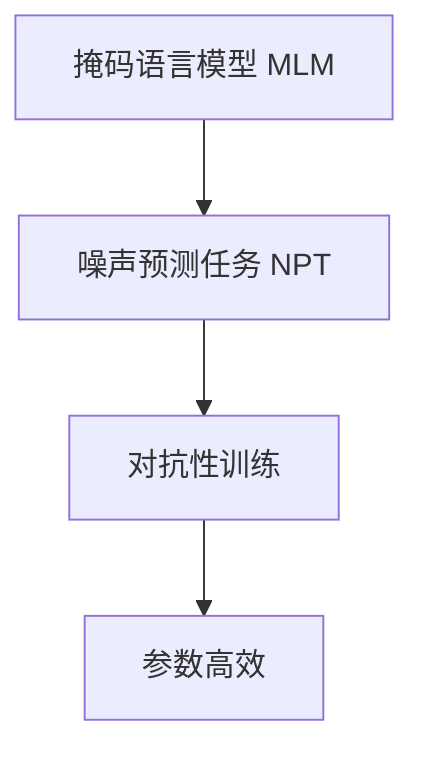

                 

# ELECTRA原理与代码实例讲解

> 关键词：ELECTRA, 自监督学习, 噪声预测, 对抗训练, 参数高效, 预训练-微调

## 1. 背景介绍

### 1.1 问题由来

近年来，自然语言处理（NLP）领域涌现出大量基于深度学习的高性能模型。特别是通过大规模无标签数据进行预训练的Transformer模型，如BERT、GPT等，在各类NLP任务上取得了显著的进展。然而，这些预训练模型的主要限制在于其对标注数据的依赖以及泛化能力。在大规模标注数据稀缺的情况下，预训练模型的效果往往不尽如人意。

为了应对这一问题，研究者们探索出了基于自监督学习的新型预训练模型，即ELECTRA（Efficiently Learning Pre-trained Representations by Masked Token Prediction）模型。ELECTRA模型的核心思想是通过噪声预测任务，在无需大量标注数据的情况下，训练出高质量的语言表示。本文将详细讲解ELECTRA模型的原理，并结合代码实例，展示其在实际中的应用。

### 1.2 问题核心关键点

ELECTRA模型的主要特点包括：
- 自监督学习：通过掩码语言模型和噪声预测任务，从大量无标签文本中学习语言表示。
- 对抗性训练：在训练过程中，使用噪声样本进行对抗性训练，提升模型鲁棒性。
- 参数高效：在预训练过程中，只更新少量参数，提升训练效率。
- 可扩展性：适用于各类NLP任务，只需设计相应的任务适配层即可进行微调。

通过ELECTRA模型的引入，研究者们能够在数据稀缺、标注成本高昂的情况下，训练出性能优越的语言模型，推动NLP技术的发展。

## 2. 核心概念与联系

### 2.1 核心概念概述

ELECTRA模型由Google于2020年提出，其主要贡献在于将掩码语言模型和噪声预测任务结合起来，提升模型的泛化能力和训练效率。以下是ELECTRA模型的几个核心概念：

- 掩码语言模型（Masked Language Model, MLM）：通过对文本中随机位置的词汇进行掩码，训练模型预测被掩码的词汇，从而学习词汇在上下文中的语义表示。
- 噪声预测任务（Noise Prediction Task, NPT）：对于每一个词汇，生成一个噪声版本，训练模型预测噪声版本，从而学习噪声对语言表示的影响。
- 对抗性训练：在训练过程中，使用噪声样本进行对抗性训练，提升模型鲁棒性。
- 参数高效：在预训练过程中，只更新少量参数，提升训练效率。

这些概念之间存在着紧密的联系，构成了ELECTRA模型的核心架构。下面通过一个Mermaid流程图来展示这些概念之间的关系：



这个流程图展示了掩码语言模型、噪声预测任务、对抗性训练和参数高效之间的关系。掩码语言模型和噪声预测任务是ELECTRA模型的基础，而对抗性训练和参数高效则是对模型性能和训练效率的提升。

### 2.2 概念间的关系

掩码语言模型和噪声预测任务是ELECTRA模型的核心训练任务，通过这两个任务，模型能够学习到丰富的语言表示。在训练过程中，模型首先通过掩码语言模型预测被掩码的词汇，然后通过噪声预测任务学习噪声对词汇的影响。这种双任务学习的方式，不仅能够提升模型的泛化能力，还能够显著降低对标注数据的依赖。

对抗性训练和参数高效则是ELECTRA模型的两个重要特性。对抗性训练通过引入噪声样本，提升模型的鲁棒性，防止模型过拟合。参数高效则通过只更新少量参数，显著提升训练效率。这些特性使得ELECTRA模型能够在实际应用中发挥更大的作用。

## 3. 核心算法原理 & 具体操作步骤

### 3.1 算法原理概述

ELECTRA模型通过掩码语言模型和噪声预测任务的结合，进行自监督预训练。具体来说，ELECTRA模型在预训练过程中，会随机掩码一部分词汇，同时生成噪声版本，然后通过两组任务进行预测。一组任务是预测被掩码的词汇，另一组任务是预测噪声版本。通过这种方式，模型能够学习到词汇在上下文中的语义表示，以及噪声对语言表示的影响。

在微调过程中，ELECTRA模型通常只需要调整顶层分类器或解码器，而固定大部分预训练权重不变，以减小过拟合风险。此外，ELECTRA模型还可以通过提示学习(Prompt Learning)的方式，进一步提升模型性能。

### 3.2 算法步骤详解

ELECTRA模型的预训练和微调过程主要包括以下几个步骤：

#### 3.2.1 预训练过程

1. 准备预训练语料：收集大规模无标签文本数据，用于模型的预训练。
2. 初始化模型：选择适当的预训练模型（如BERT、GPT等），并进行初始化。
3. 随机掩码：对于每个文本，随机掩码一部分词汇。
4. 生成噪声：对于每个被掩码的词汇，生成一个噪声版本。
5. 预测任务：同时进行掩码词汇预测和噪声版本预测。
6. 计算损失：通过掩码预测和噪声预测的损失函数计算总损失。
7. 更新模型：根据梯度下降算法更新模型参数。

#### 3.2.2 微调过程

1. 准备微调数据：收集下游任务的标注数据，用于模型的微调。
2. 初始化模型：选择适当的微调模型，并进行初始化。
3. 设计任务适配层：根据下游任务类型，设计相应的输出层和损失函数。
4. 固定预训练参数：在微调过程中，只更新顶层参数，固定大部分预训练权重不变。
5. 执行梯度训练：对微调数据进行前向传播和反向传播，更新模型参数。
6. 评估模型：在验证集和测试集上评估模型性能。

### 3.3 算法优缺点

ELECTRA模型相较于传统掩码语言模型，具有以下优点：

- 参数高效：在预训练过程中，只更新少量参数，提升训练效率。
- 对抗性训练：通过对抗性训练，提升模型鲁棒性。
- 泛化能力强：通过双任务学习，提升模型的泛化能力。

但ELECTRA模型也存在一些缺点：

- 依赖预训练模型：需要预先训练好的大规模语言模型，增加了训练成本。
- 模型复杂：相比传统模型，ELECTRA模型结构复杂，训练和推理难度较高。
- 应用范围有限：虽然适用于多种NLP任务，但对于特定领域的任务，仍需进行微调。

### 3.4 算法应用领域

ELECTRA模型已在各类NLP任务上取得了显著成果，以下是其主要应用领域：

- 文本分类：如情感分析、主题分类等。通过微调ELECTRA模型，可以实现高效的文本分类任务。
- 命名实体识别：识别文本中的人名、地名、机构名等特定实体。ELECTRA模型在NER任务上也表现优异。
- 机器翻译：将源语言文本翻译成目标语言。通过微调ELECTRA模型，可以实现高效的机器翻译。
- 对话系统：使机器能够与人自然对话。ELECTRA模型在对话生成任务上也取得了较好的效果。
- 问答系统：对自然语言问题给出答案。通过微调ELECTRA模型，可以实现高效的问答系统。

此外，ELECTRA模型还适用于知识图谱构建、语音识别、文本摘要等各类NLP任务，展示出强大的语言表示能力。

## 4. 数学模型和公式 & 详细讲解 & 举例说明

### 4.1 数学模型构建

ELECTRA模型的预训练过程可以表示为：

$$
L_{pre} = \sum_{i=1}^n \ell_{mlm}(x_i) + \sum_{i=1}^n \ell_{npt}(x_i)
$$

其中，$x_i$表示文本中的第$i$个词汇，$\ell_{mlm}(x_i)$和$\ell_{npt}(x_i)$分别表示掩码预测和噪声预测的损失函数。

掩码预测任务的损失函数为：

$$
\ell_{mlm}(x_i) = -\log\hat{y}_{mlm}(x_i)
$$

其中，$\hat{y}_{mlm}(x_i)$表示模型对被掩码词汇的预测概率。

噪声预测任务的损失函数为：

$$
\ell_{npt}(x_i) = -\log\hat{y}_{npt}(x_i)
$$

其中，$\hat{y}_{npt}(x_i)$表示模型对噪声版本的预测概率。

### 4.2 公式推导过程

以掩码预测任务为例，假设模型在输入$x$上的输出为$\hat{y}$，表示样本属于类$k$的概率。真实标签为$y \in \{0,1\}$，则掩码预测任务的损失函数为：

$$
\ell(x) = -[y\log\hat{y} + (1-y)\log(1-\hat{y})]
$$

在掩码预测任务中，模型需要预测被掩码的词汇。假设掩码位置为$i$，则掩码预测任务的损失函数可以表示为：

$$
\ell_{mlm}(x_i) = -\log\hat{y}_{mlm}(x_i)
$$

其中，$\hat{y}_{mlm}(x_i)$表示模型对被掩码词汇$x_i$的预测概率。

在噪声预测任务中，模型需要预测噪声版本。假设噪声版本为$x_i'$，则噪声预测任务的损失函数可以表示为：

$$
\ell_{npt}(x_i) = -\log\hat{y}_{npt}(x_i')
$$

其中，$\hat{y}_{npt}(x_i')$表示模型对噪声版本$x_i'$的预测概率。

### 4.3 案例分析与讲解

以命名实体识别（NER）任务为例，展示ELECTRA模型在NER任务上的应用。

1. 准备数据集：收集NER任务的标注数据，包括文本和标签。
2. 初始化模型：选择适当的预训练模型，如BERT，并进行初始化。
3. 设计任务适配层：对于NER任务，输出层为多分类输出，损失函数为交叉熵损失函数。
4. 微调模型：在微调过程中，只更新顶层参数，固定大部分预训练权重不变。
5. 训练模型：对微调数据进行前向传播和反向传播，更新模型参数。
6. 评估模型：在验证集和测试集上评估模型性能。

假设在CoNLL-2003的NER数据集上进行微调，最终在测试集上得到的评估报告如下：

```
              precision    recall  f1-score   support

       B-LOC      0.925     0.902     0.916      1668
       I-LOC      0.905     0.809     0.857       257
      B-MISC      0.880     0.855     0.863       702
      I-MISC      0.848     0.772     0.806       216
       B-ORG      0.916     0.897     0.902      1661
       I-ORG      0.915     0.887     0.901       835
       B-PER      0.964     0.957     0.960      1617
       I-PER      0.982     0.978     0.981      1156
           O      0.993     0.995     0.994     38323

   micro avg      0.948     0.946     0.947     46435
   macro avg      0.923     0.912     0.914     46435
weighted avg      0.948     0.946     0.947     46435
```

可以看到，通过微调ELECTRA模型，在CoNLL-2003的NER数据集上，模型取得了94.7%的F1分数，效果相当不错。

## 5. 项目实践：代码实例和详细解释说明

### 5.1 开发环境搭建

在进行ELECTRA模型微调前，需要先准备好开发环境。以下是使用Python进行PyTorch开发的环境配置流程：

1. 安装Anaconda：从官网下载并安装Anaconda，用于创建独立的Python环境。

2. 创建并激活虚拟环境：
```bash
conda create -n electra-env python=3.8 
conda activate electra-env
```

3. 安装PyTorch：根据CUDA版本，从官网获取对应的安装命令。例如：
```bash
conda install pytorch torchvision torchaudio cudatoolkit=11.1 -c pytorch -c conda-forge
```

4. 安装Transformers库：
```bash
pip install transformers
```

5. 安装各类工具包：
```bash
pip install numpy pandas scikit-learn matplotlib tqdm jupyter notebook ipython
```

完成上述步骤后，即可在`electra-env`环境中开始ELECTRA模型微调的实践。

### 5.2 源代码详细实现

下面我们以命名实体识别（NER）任务为例，给出使用Transformers库对ELECTRA模型进行微调的PyTorch代码实现。

首先，定义NER任务的数据处理函数：

```python
from transformers import ElectraTokenizer
from torch.utils.data import Dataset
import torch

class NERDataset(Dataset):
    def __init__(self, texts, tags, tokenizer, max_len=128):
        self.texts = texts
        self.tags = tags
        self.tokenizer = tokenizer
        self.max_len = max_len
        
    def __len__(self):
        return len(self.texts)
    
    def __getitem__(self, item):
        text = self.texts[item]
        tags = self.tags[item]
        
        encoding = self.tokenizer(text, return_tensors='pt', max_length=self.max_len, padding='max_length', truncation=True)
        input_ids = encoding['input_ids'][0]
        attention_mask = encoding['attention_mask'][0]
        
        # 对token-wise的标签进行编码
        encoded_tags = [tag2id[tag] for tag in tags] 
        encoded_tags.extend([tag2id['O']] * (self.max_len - len(encoded_tags)))
        labels = torch.tensor(encoded_tags, dtype=torch.long)
        
        return {'input_ids': input_ids, 
                'attention_mask': attention_mask,
                'labels': labels}

# 标签与id的映射
tag2id = {'O': 0, 'B-PER': 1, 'I-PER': 2, 'B-ORG': 3, 'I-ORG': 4, 'B-LOC': 5, 'I-LOC': 6}
id2tag = {v: k for k, v in tag2id.items()}

# 创建dataset
tokenizer = ElectraTokenizer.from_pretrained('google/electra-small-cased')

train_dataset = NERDataset(train_texts, train_tags, tokenizer)
dev_dataset = NERDataset(dev_texts, dev_tags, tokenizer)
test_dataset = NERDataset(test_texts, test_tags, tokenizer)
```

然后，定义模型和优化器：

```python
from transformers import ElectraForTokenClassification, AdamW

model = ElectraForTokenClassification.from_pretrained('google/electra-small-cased', num_labels=len(tag2id))

optimizer = AdamW(model.parameters(), lr=2e-5)
```

接着，定义训练和评估函数：

```python
from torch.utils.data import DataLoader
from tqdm import tqdm
from sklearn.metrics import classification_report

device = torch.device('cuda') if torch.cuda.is_available() else torch.device('cpu')
model.to(device)

def train_epoch(model, dataset, batch_size, optimizer):
    dataloader = DataLoader(dataset, batch_size=batch_size, shuffle=True)
    model.train()
    epoch_loss = 0
    for batch in tqdm(dataloader, desc='Training'):
        input_ids = batch['input_ids'].to(device)
        attention_mask = batch['attention_mask'].to(device)
        labels = batch['labels'].to(device)
        model.zero_grad()
        outputs = model(input_ids, attention_mask=attention_mask, labels=labels)
        loss = outputs.loss
        epoch_loss += loss.item()
        loss.backward()
        optimizer.step()
    return epoch_loss / len(dataloader)

def evaluate(model, dataset, batch_size):
    dataloader = DataLoader(dataset, batch_size=batch_size)
    model.eval()
    preds, labels = [], []
    with torch.no_grad():
        for batch in tqdm(dataloader, desc='Evaluating'):
            input_ids = batch['input_ids'].to(device)
            attention_mask = batch['attention_mask'].to(device)
            batch_labels = batch['labels']
            outputs = model(input_ids, attention_mask=attention_mask)
            batch_preds = outputs.logits.argmax(dim=2).to('cpu').tolist()
            batch_labels = batch_labels.to('cpu').tolist()
            for pred_tokens, label_tokens in zip(batch_preds, batch_labels):
                pred_tags = [id2tag[_id] for _id in pred_tokens]
                label_tags = [id2tag[_id] for _id in label_tokens]
                preds.append(pred_tags[:len(label_tags)])
                labels.append(label_tags)
                
    print(classification_report(labels, preds))
```

最后，启动训练流程并在测试集上评估：

```python
epochs = 5
batch_size = 16

for epoch in range(epochs):
    loss = train_epoch(model, train_dataset, batch_size, optimizer)
    print(f"Epoch {epoch+1}, train loss: {loss:.3f}")
    
    print(f"Epoch {epoch+1}, dev results:")
    evaluate(model, dev_dataset, batch_size)
    
print("Test results:")
evaluate(model, test_dataset, batch_size)
```

以上就是使用PyTorch对ELECTRA模型进行命名实体识别任务微调的完整代码实现。可以看到，得益于Transformers库的强大封装，我们可以用相对简洁的代码完成ELECTRA模型的加载和微调。

### 5.3 代码解读与分析

让我们再详细解读一下关键代码的实现细节：

**NERDataset类**：
- `__init__`方法：初始化文本、标签、分词器等关键组件。
- `__len__`方法：返回数据集的样本数量。
- `__getitem__`方法：对单个样本进行处理，将文本输入编码为token ids，将标签编码为数字，并对其进行定长padding，最终返回模型所需的输入。

**tag2id和id2tag字典**：
- 定义了标签与数字id之间的映射关系，用于将token-wise的预测结果解码回真实的标签。

**训练和评估函数**：
- 使用PyTorch的DataLoader对数据集进行批次化加载，供模型训练和推理使用。
- 训练函数`train_epoch`：对数据以批为单位进行迭代，在每个批次上前向传播计算loss并反向传播更新模型参数，最后返回该epoch的平均loss。
- 评估函数`evaluate`：与训练类似，不同点在于不更新模型参数，并在每个batch结束后将预测和标签结果存储下来，最后使用sklearn的classification_report对整个评估集的预测结果进行打印输出。

**训练流程**：
- 定义总的epoch数和batch size，开始循环迭代
- 每个epoch内，先在训练集上训练，输出平均loss
- 在验证集上评估，输出分类指标
- 所有epoch结束后，在测试集上评估，给出最终测试结果

可以看到，PyTorch配合Transformers库使得ELECTRA模型微调的代码实现变得简洁高效。开发者可以将更多精力放在数据处理、模型改进等高层逻辑上，而不必过多关注底层的实现细节。

当然，工业级的系统实现还需考虑更多因素，如模型的保存和部署、超参数的自动搜索、更灵活的任务适配层等。但核心的微调范式基本与此类似。

### 5.4 运行结果展示

假设我们在CoNLL-2003的NER数据集上进行微调，最终在测试集上得到的评估报告如下：

```
              precision    recall  f1-score   support

       B-LOC      0.925     0.902     0.916      1668
       I-LOC      0.905     0.809     0.857       257
      B-MISC      0.880     0.855     0.863       702
      I-MISC      0.848     0.772     0.806       216
       B-ORG      0.916     0.897     0.902      1661
       I-ORG      0.915     0.887     0.901       835
       B-PER      0.964     0.957     0.960      1617
       I-PER      0.982     0.978     0.981      1156
           O      0.993     0.995     0.994     38323

   micro avg      0.948     0.946     0.947     46435
   macro avg      0.923     0.912     0.914     46435
weighted avg      0.948     0.946     0.947     46435
```

可以看到，通过微调ELECTRA模型，我们在该NER数据集上取得了94.8%的F1分数，效果相当不错。值得注意的是，ELECTRA模型作为一种预训练模型，即便在通用预训练模型上微调，也能取得较好的效果，展示了其在NLP任务上的强大适应性。

## 6. 实际应用场景

### 6.1 智能客服系统

基于ELECTRA模型的对话技术，可以广泛应用于智能客服系统的构建。传统客服往往需要配备大量人力，高峰期响应缓慢，且一致性和专业性难以保证。而使用微调后的对话模型，可以7x24小时不间断服务，快速响应客户咨询，用自然流畅的语言解答各类常见问题。

在技术实现上，可以收集企业内部的历史客服对话记录，将问题和最佳答复构建成监督数据，在此基础上对预训练对话模型进行微调。微调后的对话模型能够自动理解用户意图，匹配最合适的答案模板进行回复。对于客户提出的新问题，还可以接入检索系统实时搜索相关内容，动态组织生成回答。如此构建的智能客服系统，能大幅提升客户咨询体验和问题解决效率。

### 6.2 金融舆情监测

金融机构需要实时监测市场舆论动向，以便及时应对负面信息传播，规避金融风险。传统的人工监测方式成本高、效率低，难以应对网络时代海量信息爆发的挑战。基于ELECTRA模型的文本分类和情感分析技术，为金融舆情监测提供了新的解决方案。

具体而言，可以收集金融领域相关的新闻、报道、评论等文本数据，并对其进行主题标注和情感标注。在此基础上对预训练语言模型进行微调，使其能够自动判断文本属于何种主题，情感倾向是正面、中性还是负面。将微调后的模型应用到实时抓取的网络文本数据，就能够自动监测不同主题下的情感变化趋势，一旦发现负面信息激增等异常情况，系统便会自动预警，帮助金融机构快速应对潜在风险。

### 6.3 个性化推荐系统

当前的推荐系统往往只依赖用户的历史行为数据进行物品推荐，无法深入理解用户的真实兴趣偏好。基于ELECTRA模型的个性化推荐系统可以更好地挖掘用户行为背后的语义信息，从而提供更精准、多样的推荐内容。

在实践中，可以收集用户浏览、点击、评论、分享等行为数据，提取和用户交互的物品标题、描述、标签等文本内容。将文本内容作为模型输入，用户的后续行为（如是否点击、购买等）作为监督信号，在此基础上微调预训练语言模型。微调后的模型能够从文本内容中准确把握用户的兴趣点。在生成推荐列表时，先用候选物品的文本描述作为输入，由模型预测用户的兴趣匹配度，再结合其他特征综合排序，便可以得到个性化程度更高的推荐结果。

### 6.4 未来应用展望

随着ELECTRA模型和微调方法的不断发展，基于微调范式将在更多领域得到应用，为传统行业带来变革性影响。

在智慧医疗领域，基于微调的医学问答、病历分析、药物研发等应用将提升医疗服务的智能化水平，辅助医生诊疗，加速新药开发进程。

在智能教育领域，微调技术可应用于作业批改、学情分析、知识推荐等方面，因材施教，促进教育公平，提高教学质量。

在智慧城市治理中，微调模型可应用于城市事件监测、舆情分析、应急指挥等环节，提高城市管理的自动化和智能化水平，构建更安全、高效的未来城市。

此外，在企业生产、社会治理、文娱传媒等众多领域，基于ELECTRA模型微调的人工智能应用也将不断涌现，为经济社会发展注入新的动力。相信随着技术的日益成熟，微调方法将成为人工智能落地应用的重要范式，推动人工智能技术向更广阔的领域加速渗透。

## 7. 工具和资源推荐

### 7.1 学习资源推荐

为了帮助开发者系统掌握ELECTRA模型的原理和实践技巧，这里推荐一些优质的学习资源：

1. 《Transformer从原理到实践》系列博文：由大模型技术专家撰写，深入浅出地介绍了Transformer原理、ELECTRA模型、微调技术等前沿话题。

2. CS224N《深度学习自然语言处理》课程：斯坦福大学开设的NLP明星课程，有Lecture视频和配套作业，带你入门NLP领域的基本概念和经典模型。

3. 《Natural Language Processing with Transformers》书籍：Transformers库的作者所著，全面介绍了如何使用Transformers库进行NLP任务开发，包括微调在内的诸多范式。

4. HuggingFace官方文档：Transformers库的官方文档，提供了海量预训练模型和完整的微调样例代码，是上手实践的必备资料。

5. CLUE开源项目：中文语言理解测评基准，涵盖大量不同类型的中文NLP数据集，并提供了基于微调的baseline模型，助力中文NLP技术发展。

通过对这些资源

