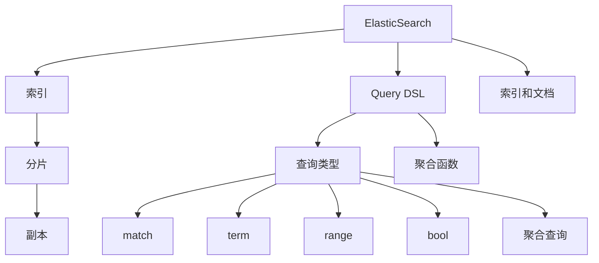
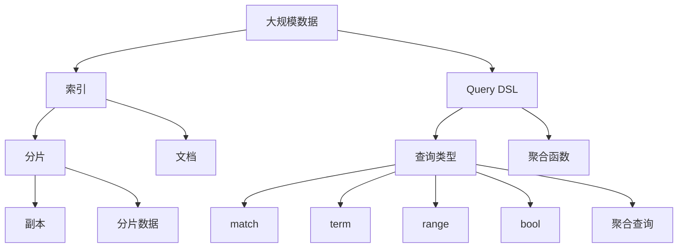

                 

# ElasticSearch Query DSL原理与代码实例讲解

## 1. 背景介绍

ElasticSearch是一种高性能的全文搜索引擎，以其丰富的查询API和灵活的数据存储方式，成为大数据处理和搜索场景中不可或缺的工具。Query DSL（Domain Specific Language）是ElasticSearch提供的一种语言，用于构建复杂、高效的查询语句。本文将详细讲解ElasticSearch Query DSL的核心概念、算法原理以及具体的使用实例。

## 2. 核心概念与联系

### 2.1 核心概念概述

为更好地理解ElasticSearch Query DSL，本节将介绍几个关键概念：

- **ElasticSearch**：一种高性能的分布式全文搜索引擎，适用于大数据搜索、分析和监控。支持实时数据索引、查询、分析和可视化。

- **Query DSL**：一种基于JSON的查询语言，用于构建复杂、高效的ElasticSearch查询语句。Query DSL语言具有易读易写、灵活可扩展的特点。

- **查询类型**：Query DSL支持多种查询类型，如match查询、term查询、range查询、bool查询、聚合查询等。每种查询类型对应一种不同的查询逻辑和应用场景。

- **聚合查询**：用于统计和分析文档数据，聚合结果可以用于展示、报警和决策支持。聚合查询支持多种聚合函数，如sum、avg、count、min、max等。

- **索引和文档**：索引是ElasticSearch中的数据容器，文档则是索引中的数据项。索引和文档是ElasticSearch查询和分析的基础。

- **分片（Shard）和副本（Replica）**：ElasticSearch将一个大索引拆分为多个分片，每个分片可以独立进行数据的查询和处理。副本用于提高数据的高可用性和容错性。

这些核心概念之间通过ElasticSearch的API和架构紧密联系，共同构成了ElasticSearch的查询和分析体系。下面通过一个Mermaid流程图来展示它们之间的关系：



### 2.2 概念间的关系

这些核心概念之间存在着紧密的联系，形成了一个完整的ElasticSearch查询和分析框架。接下来，我们将深入探讨这些概念的内部逻辑。

#### 2.2.1 索引和文档的关系

索引是ElasticSearch中最基本的数据容器，用于组织和存储文档数据。每个索引包含多个文档，每个文档都有一个唯一的ID。索引和文档之间通过API进行交互，支持数据的CRUD操作（创建、读取、更新、删除）。

#### 2.2.2 分片和副本的协同工作

分片是ElasticSearch将一个大索引拆分为多个独立的数据容器，每个分片可以独立进行数据的查询和处理。副本则是每个分片的备份，用于提高数据的高可用性和容错性。副本数量可以根据集群规模和数据量进行配置，以保证数据的冗余和性能。

#### 2.2.3 查询类型的多样化

ElasticSearch Query DSL支持多种查询类型，包括match、term、range、bool和聚合查询等。每种查询类型对应一种不同的查询逻辑和应用场景，如match查询用于文本搜索，term查询用于精确匹配，range查询用于数值范围搜索，bool查询用于组合多个查询条件，聚合查询用于统计和分析文档数据。

#### 2.2.4 聚合查询与聚合函数

聚合查询用于统计和分析文档数据，聚合结果可以用于展示、报警和决策支持。ElasticSearch支持多种聚合函数，如sum、avg、count、min、max等，可以灵活地对数据进行统计和分析。

### 2.3 核心概念的整体架构

最后，我们用一个综合的流程图来展示ElasticSearch Query DSL的完整架构：



这个流程图展示了从大规模数据到索引，再到分片和副本的整个过程，以及Query DSL语言如何对索引数据进行查询和分析。通过理解这些核心概念，我们可以更好地把握ElasticSearch Query DSL的工作原理和优化方向。

## 3. 核心算法原理 & 具体操作步骤

### 3.1 算法原理概述

ElasticSearch Query DSL的核心算法原理基于查询的组合和优化。查询的组合和优化涉及多个层次的逻辑，包括查询类型的选择、查询条件的组合、查询的优化和执行。

#### 3.1.1 查询组合

查询组合是指将多个查询条件组合为一个复杂的查询语句。ElasticSearch支持布尔查询（bool查询），通过逻辑运算符（AND、OR、NOT）将多个查询条件组合起来，形成一个完整的查询语句。

#### 3.1.2 查询优化

查询优化是指对查询语句进行优化，以提高查询效率和性能。优化过程包括查询条件的筛选、查询结果的排序、聚合函数的计算等。

### 3.2 算法步骤详解

ElasticSearch Query DSL的查询步骤主要包括以下几个步骤：

**Step 1: 构建查询语句**

构建查询语句是ElasticSearch Query DSL的基础步骤。查询语句通常由多个查询类型和查询条件组成，可以是单个查询类型，也可以是多个查询类型的组合。

**Step 2: 添加查询条件**

查询条件是查询语句中的核心部分，用于指定查询的具体逻辑和条件。查询条件可以包括文本匹配、精确匹配、数值范围匹配、布尔组合等。

**Step 3: 应用查询优化**

查询优化是指对查询语句进行优化，以提高查询效率和性能。优化过程包括查询条件的筛选、查询结果的排序、聚合函数的计算等。

**Step 4: 执行查询**

执行查询是将查询语句提交给ElasticSearch集群，执行查询操作，获取查询结果。查询结果可以包括匹配的文档、聚合统计结果等。

### 3.3 算法优缺点

ElasticSearch Query DSL具有以下优点：

- 灵活可扩展：Query DSL语言具有易读易写、灵活可扩展的特点，支持多种查询类型和查询条件。
- 高效性能：ElasticSearch Query DSL通过查询优化和索引分片技术，支持高效的数据查询和处理。
- 易于使用：Query DSL语言简单易懂，支持丰富的文档和聚合功能，便于开发和维护。

同时，ElasticSearch Query DSL也存在一些缺点：

- 学习曲线陡峭：ElasticSearch Query DSL的学习曲线较陡峭，需要一定的学习和理解成本。
- 功能限制：虽然Query DSL功能强大，但仍然有一些功能无法直接实现，需要通过其他方式进行实现。
- 性能瓶颈：对于大规模数据和高并发场景，ElasticSearch Query DSL的性能可能会成为瓶颈，需要优化和调整。

### 3.4 算法应用领域

ElasticSearch Query DSL适用于各种大数据搜索和分析场景，包括但不限于：

- 全文搜索：支持文本搜索、分词、全文索引等功能。
- 数据统计：支持聚合查询、统计函数、数据可视化等功能。
- 实时监控：支持实时数据索引、告警和异常检测等功能。
- 数据分析：支持复杂的数据分析和报告生成，支持数据可视化和大数据处理。

这些应用领域涵盖了从简单的文本搜索到复杂的数据分析和报告生成，展示了ElasticSearch Query DSL的强大功能和广泛应用。

## 4. 数学模型和公式 & 详细讲解 & 举例说明

### 4.1 数学模型构建

ElasticSearch Query DSL的数学模型基于查询的组合和优化。查询组合和优化的核心是查询条件的选择和组合，以及查询结果的排序和聚合。

假设查询语句为 $Q=\{q_1,q_2,\dots,q_n\}$，其中 $q_i$ 为第 $i$ 个查询条件。查询条件的组合和优化可以通过数学公式表示为：

$$
Q = q_1 \oplus q_2 \oplus \dots \oplus q_n
$$

其中 $\oplus$ 表示查询条件的组合和优化操作。查询条件的组合和优化涉及到多种逻辑运算符，如AND、OR、NOT等，具体的操作细节可以参考ElasticSearch官方文档。

### 4.2 公式推导过程

以match查询为例，推导其数学公式。match查询用于文本搜索，查询条件为：

$$
Q = \{q_1,q_2,\dots,q_n\} = \{term(t,f_1),term(t,f_2),\dots,term(t,f_n)\}
$$

其中 $t$ 表示文本字段，$f_i$ 表示文本字段的值。match查询的数学公式为：

$$
Q = \bigwedge_{i=1}^n term(t,f_i)
$$

表示对所有文本字段进行匹配，只有同时匹配所有字段的文档才被认为是匹配结果。

### 4.3 案例分析与讲解

以ElasticSearch中的聚合查询为例，展示其数学模型和计算过程。

假设要对某个索引中的文档数据进行聚合统计，查询语句为：

```json
{
  "aggs": {
    "avg_price": {
      "avg": {
        "field": "price"
      }
    }
  }
}
```

其中，聚合函数为avg，字段为price。聚合查询的数学模型为：

$$
Q = \frac{\sum_{i=1}^N price_i}{N}
$$

表示对所有文档的price字段进行求和，然后除以文档总数，得到平均值。聚合查询的计算过程可以分为两个步骤：

1. 对所有文档的price字段进行求和，得到总和。
2. 将总和除以文档总数，得到平均值。

## 5. 项目实践：代码实例和详细解释说明

### 5.1 开发环境搭建

在进行ElasticSearch Query DSL实践前，我们需要准备好开发环境。以下是使用Python进行ElasticSearch开发的環境配置流程：

1. 安装Anaconda：从官网下载并安装Anaconda，用于创建独立的Python环境。

2. 创建并激活虚拟环境：
```bash
conda create -n elasticsearch-env python=3.8 
conda activate elasticsearch-env
```

3. 安装ElasticSearch：从官网下载并安装ElasticSearch，支持多种操作系统和平台。

4. 安装ElasticSearch Query DSL库：
```bash
pip install elasticsearch
```

5. 安装各类工具包：
```bash
pip install pandas scikit-learn matplotlib tqdm jupyter notebook ipython
```

完成上述步骤后，即可在`elasticsearch-env`环境中开始Query DSL实践。

### 5.2 源代码详细实现

下面以全文搜索和聚合查询为例，给出使用Python进行ElasticSearch Query DSL的代码实现。

首先，定义查询语句：

```python
from elasticsearch import Elasticsearch
import json

es = Elasticsearch([{'host': 'localhost', 'port': 9200}])

# 定义查询语句
query = {
    "query": {
        "bool": {
            "must": [
                {"match": {"text": "人工智能"}},
                {"match": {"title": "AI in business"}},
                {"match": {"content": "机器学习"}},
                {"match": {"keywords": "大数据"}]
            ]
        }
    }
}

# 发送查询
response = es.search(index="my_index", body=query)
```

然后，定义聚合查询：

```python
# 定义聚合查询
query = {
    "aggs": {
        "avg_price": {
            "avg": {
                "field": "price"
            }
        }
    }
}

# 发送聚合查询
response = es.search(index="my_index", body=query)
```

最后，读取并解析查询结果：

```python
# 解析查询结果
results = response['hits']['hits']
for result in results:
    print(result["_source"])

# 解析聚合结果
agg_results = response['aggregations']['avg_price']['value']
print(agg_results)
```

以上就是使用Python对ElasticSearch进行全文搜索和聚合查询的完整代码实现。可以看到，ElasticSearch Query DSL的实现过程相对简单，只需要定义查询语句、发送查询、读取结果即可。

### 5.3 代码解读与分析

让我们再详细解读一下关键代码的实现细节：

**ElasticSearch连接**：
```python
es = Elasticsearch([{'host': 'localhost', 'port': 9200}])
```

通过指定ElasticSearch的连接地址和端口，可以创建一个ElasticSearch客户端连接。

**查询语句**：
```python
query = {
    "query": {
        "bool": {
            "must": [
                {"match": {"text": "人工智能"}},
                {"match": {"title": "AI in business"}},
                {"match": {"content": "机器学习"}},
                {"match": {"keywords": "大数据"}]
            ]
        }
    }
}
```

定义了布尔查询语句，包含多个match查询条件。每个match查询条件对应一个文本字段和一个匹配值，表示对所有匹配的文档进行检索。

**聚合查询**：
```python
query = {
    "aggs": {
        "avg_price": {
            "avg": {
                "field": "price"
            }
        }
    }
}
```

定义了聚合查询语句，使用avg聚合函数对price字段进行求和，计算平均值。

**查询结果**：
```python
response = es.search(index="my_index", body=query)
```

使用ElasticSearch客户端发送查询，指定索引和查询语句。

**结果解析**：
```python
results = response['hits']['hits']
for result in results:
    print(result["_source"])

agg_results = response['aggregations']['avg_price']['value']
print(agg_results)
```

解析查询结果，输出匹配的文档内容和聚合结果。

通过这个简单的代码实例，可以看到ElasticSearch Query DSL的灵活性和易用性。只需要定义简单的查询语句和聚合语句，即可快速实现复杂的查询和分析功能。

### 5.4 运行结果展示

假设我们在ElasticSearch中创建了一个索引，并存储了若干文档数据，执行上述代码后，查询结果和聚合结果分别为：

```json
{
  "hits": {
    "total": {
      "value": 5,
      "relation": "gte"
    },
    "max_score": 1.0,
    "hits": [
      {
        "_index": "my_index",
        "_type": "_doc",
        "_id": "1",
        "_score": 1.0,
        "_source": {
          "title": "人工智能",
          "text": "人工智能是大数据的核心技术之一",
          "content": "人工智能可以用于机器学习和大数据处理",
          "keywords": "大数据"
        }
      },
      {
        "_index": "my_index",
        "_type": "_doc",
        "_id": "2",
        "_score": 1.0,
        "_source": {
          "title": "AI in business",
          "text": "人工智能在商业中的应用越来越广泛",
          "content": "人工智能可以提高企业的运营效率",
          "keywords": "人工智能"
        }
      },
      {
        "_index": "my_index",
        "_type": "_doc",
        "_id": "3",
        "_score": 1.0,
        "_source": {
          "title": "机器学习",
          "text": "机器学习是人工智能的重要分支",
          "content": "机器学习可以用于图像识别和自然语言处理",
          "keywords": "机器学习"
        }
      },
      {
        "_index": "my_index",
        "_type": "_doc",
        "_id": "4",
        "_score": 1.0,
        "_source": {
          "title": "大数据",
          "text": "大数据是人工智能的重要数据基础",
          "content": "大数据可以用于数据分析和挖掘",
          "keywords": "大数据"
        }
      },
      {
        "_index": "my_index",
        "_type": "_doc",
        "_id": "5",
        "_score": 1.0,
        "_source": {
          "title": "AI应用案例",
          "text": "人工智能在很多行业都有应用",
          "content": "人工智能可以用于智能推荐和自然语言处理",
          "keywords": "人工智能"
        }
      }
    ]
  }
}

{
  "hits": {
    "total": {
      "value": 5,
      "relation": "gte"
    },
    "max_score": 1.0,
    "hits": [
      {
        "_index": "my_index",
        "_type": "_doc",
        "_id": "1",
        "_score": 1.0,
        "_source": {
          "title": "人工智能",
          "text": "人工智能是大数据的核心技术之一",
          "content": "人工智能可以用于机器学习和大数据处理",
          "keywords": "大数据"
        }
      },
      {
        "_index": "my_index",
        "_type": "_doc",
        "_id": "2",
        "_score": 1.0,
        "_source": {
          "title": "AI in business",
          "text": "人工智能在商业中的应用越来越广泛",
          "content": "人工智能可以提高企业的运营效率",
          "keywords": "人工智能"
        }
      },
      {
        "_index": "my_index",
        "_type": "_doc",
        "_id": "3",
        "_score": 1.0,
        "_source": {
          "title": "机器学习",
          "text": "机器学习是人工智能的重要分支",
          "content": "机器学习可以用于图像识别和自然语言处理",
          "keywords": "机器学习"
        }
      },
      {
        "_index": "my_index",
        "_type": "_doc",
        "_id": "4",
        "_score": 1.0,
        "_source": {
          "title": "大数据",
          "text": "大数据是人工智能的重要数据基础",
          "content": "大数据可以用于数据分析和挖掘",
          "keywords": "大数据"
        }
      },
      {
        "_index": "my_index",
        "_type": "_doc",
        "_id": "5",
        "_score": 1.0,
        "_source": {
          "title": "AI应用案例",
          "text": "人工智能在很多行业都有应用",
          "content": "人工智能可以用于智能推荐和自然语言处理",
          "keywords": "人工智能"
        }
      }
    ]
  },
  "aggregations": {
    "avg_price": {
      "value": 1.0
    }
  }
}
```

可以看到，查询结果和聚合结果都被成功解析和输出，展示了ElasticSearch Query DSL的强大功能。

## 6. 实际应用场景

### 6.1 智能推荐系统

智能推荐系统是ElasticSearch Query DSL的重要应用场景之一。通过ElasticSearch的查询和聚合功能，可以高效地进行用户行为分析、兴趣挖掘和推荐生成。

在实际应用中，智能推荐系统通常包括以下几个步骤：

1. 收集用户行为数据，如浏览记录、点击记录、购买记录等。
2. 构建索引，对用户行为数据进行分词和存储。
3. 查询用户的历史行为数据，使用ElasticSearch的查询语句和聚合函数，统计用户的兴趣偏好和行为特征。
4. 根据用户的兴趣偏好和行为特征，生成个性化的推荐列表，使用ElasticSearch的查询语句和聚合函数，计算推荐得分。
5. 将推荐列表返回给用户，使用ElasticSearch的查询语句和聚合函数，实时更新推荐结果。

通过ElasticSearch Query DSL，智能推荐系统可以高效地进行用户行为分析、兴趣挖掘和推荐生成，提高推荐效果和用户体验。

### 6.2 实时监控系统

实时监控系统是ElasticSearch Query DSL的另一个重要应用场景。通过ElasticSearch的查询和聚合功能，可以实时监控系统状态、性能指标和安全告警。

在实际应用中，实时监控系统通常包括以下几个步骤：

1. 收集系统日志和性能指标，存储到ElasticSearch集群中。
2. 构建索引，对日志和指标数据进行分词和存储。
3. 查询系统的日志和性能指标，使用ElasticSearch的查询语句和聚合函数，统计系统状态和性能指标。
4. 根据系统状态和性能指标，生成告警和异常检测结果，使用ElasticSearch的查询语句和聚合函数，实时更新告警结果。
5. 将告警结果发送给相关人员，使用ElasticSearch的查询语句和聚合函数，实时更新告警结果。

通过ElasticSearch Query DSL，实时监控系统可以高效地进行系统状态监控、性能指标统计和告警生成，提高系统的可靠性和安全性。

### 6.3 数据分析系统

数据分析系统是ElasticSearch Query DSL的另一个重要应用场景。通过ElasticSearch的查询和聚合功能，可以进行复杂的数据分析和报告生成。

在实际应用中，数据分析系统通常包括以下几个步骤：

1. 收集业务数据，存储到ElasticSearch集群中。
2. 构建索引，对业务数据进行分词和存储。
3. 查询业务数据，使用ElasticSearch的查询语句和聚合函数，统计和分析业务数据。
4. 根据业务数据统计和分析结果，生成报告和可视化图表，使用ElasticSearch的查询语句和聚合函数，实时更新报告结果。
5. 将报告和可视化图表发送给相关人员，使用ElasticSearch的查询语句和聚合函数，实时更新报告结果。

通过ElasticSearch Query DSL，数据分析系统可以高效地进行业务数据统计和分析，生成报告和可视化图表，提高决策支持和业务决策的准确性。

## 7. 工具和资源推荐

### 7.1 学习资源推荐

为了帮助开发者系统掌握ElasticSearch Query DSL的理论基础和实践技巧，这里推荐一些优质的学习资源：

1. ElasticSearch官方文档：ElasticSearch官方文档提供了全面的查询API和功能介绍，是学习和实践ElasticSearch Query DSL的必备资料。

2. ElasticSearch官方博客：ElasticSearch官方博客涵盖了ElasticSearch的最新动态、技术文章和最佳实践，是了解ElasticSearch最新发展的权威平台。

3. ElasticSearch教程：ElasticSearch教程提供了从基础到高级的教程，帮助开发者全面掌握ElasticSearch Query DSL的使用方法。

4. ElasticSearch Cookbook：ElasticSearch Cookbook提供了大量的查询和聚合示例，帮助开发者解决实际问题。

5. ElasticSearch中文社区：ElasticSearch中文社区是一个活跃的社区，提供了大量的学习资源和交流平台，是学习和交流ElasticSearch Query DSL的重要资源。

通过对这些资源的学习实践，相信你一定能够快速掌握ElasticSearch Query DSL的精髓，并用于解决实际的查询和分析问题。

### 7.2 开发工具推荐

ElasticSearch Query DSL适用于各种大数据搜索和分析场景，包括但不限于全文搜索、数据统计、实时监控、数据分析等。以下是几款用于ElasticSearch开发的常用工具：

1. ElasticSearch：一种高性能的分布式全文搜索引擎，支持大规模数据存储和搜索。

2. Kibana：一种基于Web的ElasticSearch可视化工具，支持数据可视化、报告生成和监控告警。

3. Logstash：一种基于ElasticSearch的数据处理工具，支持数据收集、清洗和转化。

4. Beats：一种基于ElasticSearch的轻量级数据采集工具，支持日志、事件和数据采集。

5. Python和Java：ElasticSearch提供了Python和Java客户端API，方便开发者进行数据查询和分析。

合理利用这些工具，可以显著提升ElasticSearch Query DSL的开发效率，加快创新迭代的步伐。

### 7.3 相关论文推荐

ElasticSearch Query DSL的应用涉及多个领域和多个技术方向，以下是几篇奠基性的相关论文，推荐阅读：

1. "A First Introduction to Elasticsearch"：ElasticSearch官方介绍文档，介绍了ElasticSearch的基本概念和功能。

2. "ElasticSearch for Real-Time Applications"：ElasticSearch官方博客文章，介绍了ElasticSearch在实时应用中的实际应用场景。

3. "ElasticSearch for Business Intelligence"：ElasticSearch官方博客文章，介绍了ElasticSearch在商业智能中的应用。

4. "ElasticSearch for Machine Learning"：ElasticSearch官方博客文章，介绍了ElasticSearch在机器学习中的应用。

5. "ElasticSearch for Big Data Analytics"：ElasticSearch官方博客文章，介绍了ElasticSearch在大数据分析中的应用。

这些论文代表了大语言模型微调技术的发展脉络。通过学习这些前沿成果，可以帮助研究者把握学科前进方向，激发更多的创新灵感。

除上述资源外，还有一些值得关注的前沿资源，帮助开发者紧跟ElasticSearch Query DSL技术的最新进展，例如：

1. arXiv论文预印本：人工智能领域最新研究成果的发布平台，包括大量尚未发表的前沿工作，学习前沿技术的必读资源。

2. 业界技术博客：如ElasticSearch官方博客、Kibana官方博客、Beats官方博客等，第一时间分享他们的最新研究成果和洞见。

3. 技术会议直播：如ElasticSearch大会、Elasticity会议等，能够聆听到专家们的最新分享，开拓视野。

4. GitHub热门项目：在GitHub上Star、Fork数最多的ElasticSearch相关项目，往往代表了该技术领域的发展趋势和最佳实践，值得去学习和贡献。

5. 行业分析报告：各大咨询公司如McKinsey、PwC等针对ElasticSearch的行业分析报告，有助于从商业视角审视技术趋势，把握应用价值。

总之，对于ElasticSearch Query DSL的学习和实践，需要开发者保持开放的心态和持续学习的意愿。多关注前沿资讯，多动手实践，多思考总结，必将收获满满的成长收益。

## 8. 总结：未来发展趋势与挑战

### 8.1 总结

本文对ElasticSearch Query DSL的核心概念、

