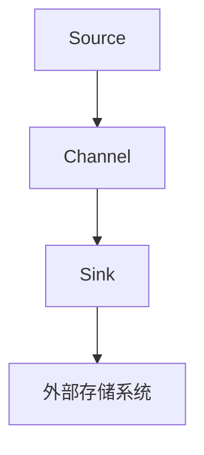
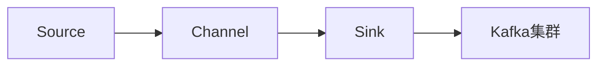

                 

# Flume Sink原理与代码实例讲解

> 关键词：Flume, Sink, Kafka, Hadoop, Big Data, Apache, Message Queue, Streaming Data

## 1. 背景介绍

### 1.1 问题由来
随着大数据时代的到来，企业对于数据处理和实时传输的需求愈发迫切。Apache Flume是一个开源的分布式、高可用的数据收集系统，能够在大规模数据环境中进行数据的实时传输和处理。Flume的核心组件包括Source、Channel、Sink等，其中Sink负责将数据传输到存储系统，如HDFS、Kafka等。本文将重点介绍Flume Sink的原理与代码实现。

### 1.2 问题核心关键点
Flume Sink作为Apache Flume的核心组件之一，其主要功能是将Source收集到的数据传输到外部存储系统。通常情况下，Kafka是Flume最常见的Sink目标，因为它提供了高吞吐量、低延迟、可扩展性和容错性等优点。Flume Sink的实现原理是通过将数据打包成Kafka消息，并发送到Kafka集群中的指定主题。本文将详细阐述Flume Sink的工作流程，并给出具体的代码实现。

### 1.3 问题研究意义
理解Flume Sink的原理与实现，对于部署和维护Flume系统，以及构建高效、可靠的数据传输解决方案具有重要意义。此外，Flume Sink的原理和实现方式也为其他类似的数据传输系统提供了宝贵的参考，如Apache Kafka、Apache Storm等。

## 2. 核心概念与联系

### 2.1 核心概念概述

为更好地理解Flume Sink的原理与实现，本节将介绍几个密切相关的核心概念：

- Apache Flume：Apache Flume是一个高可用、分布式、开源的日志和数据收集系统，能够在大规模数据环境中进行数据的实时传输和处理。
- Kafka：Apache Kafka是一个分布式、高吞吐量、低延迟的流处理平台，用于数据传输和存储。
- Source：Apache Flume中的Source组件用于从外部系统（如日志文件、HDFS、JMS等）收集数据，并将其发送到Channel。
- Channel：Apache Flume中的Channel组件用于暂存由Source传输过来的数据，等待Sink进行处理。
- Sink：Apache Flume中的Sink组件负责将数据从Channel传输到外部存储系统（如HDFS、Kafka等）。

这些核心概念之间的逻辑关系可以通过以下Mermaid流程图来展示：



这个流程图展示了一个简单的Flume数据传输流程：Source从外部系统收集数据，发送到Channel，最终由Sink传输到外部存储系统。

### 2.2 概念间的关系

这些核心概念之间存在着紧密的联系，形成了Apache Flume的数据传输架构。下面我们通过几个Mermaid流程图来展示这些概念之间的关系。

#### 2.2.1 Flume的架构


这个流程图展示了一个基本的Flume架构，Source负责数据收集，Channel暂存数据，Sink负责数据传输到外部存储系统。

#### 2.2.2 Kafka在Flume中的应用


这个流程图展示了Flume将数据传输到Kafka集群的过程。Source收集数据后发送到Channel，Sink将数据从Channel发送到Kafka集群。

#### 2.2.3 Flume与Kafka的集成


这个流程图展示了Flume与Kafka的集成架构。Source收集数据后发送到Channel，Sink将数据从Channel发送到Kafka集群，实现数据的高效传输和存储。

## 3. 核心算法原理 & 具体操作步骤
### 3.1 算法原理概述

Flume Sink的原理主要涉及数据打包、序列化和网络传输三个步骤。其核心思想是将Source收集到的数据打包成Kafka消息，并在网络上传输到Kafka集群中的指定主题。

具体来说，Flume Sink的实现包括以下几个关键步骤：

1. **数据打包**：将Source收集到的数据打包成Kafka消息。
2. **序列化**：将打包后的Kafka消息序列化为字节流。
3. **网络传输**：将字节流通过网络传输到Kafka集群中的指定主题。

### 3.2 算法步骤详解

以下是Flume Sink的具体实现步骤：

#### 3.2.1 数据打包
Flume Sink通过将Source收集到的数据打包成Kafka消息，以便于后续的网络传输。Kafka消息由三部分组成：消息头（Header）、键（Key）和值（Value）。Flume Sink将数据作为值（Value），并将键（Key）设置为空字符串（""）。

以下是Flume Sink对数据进行打包的代码实现：

```java
public class FlumeSink implements Sink {
    private final KafkaConsumer<String, String> kafkaConsumer;
    private final Properties kafkaProperties;

    public FlumeSink(String bootstrapServers, String topic) {
        this.kafkaConsumer = new KafkaConsumer<>(kafkaProperties);
        this.kafkaConsumer.subscribe(Arrays.asList(topic));
    }

    @Override
    public void put(List<LogEvent> events) {
        for (LogEvent event : events) {
            // 将数据打包成Kafka消息
            byte[] key = "".getBytes();
            byte[] value = event.getBody().getBytes();
            RecordMetadata metadata = kafkaConsumer.send(new ProducerRecord<>(topic, key, value));
        }
    }

    @Override
    public void close() {
        kafkaConsumer.close();
    }
}
```

#### 3.2.2 序列化
Flume Sink将打包后的Kafka消息序列化为字节流，以便于通过网络传输。在Java中，序列化可以使用ObjectOutputStream、DataOutputStream等工具类实现。

以下是Flume Sink对Kafka消息进行序列化的代码实现：

```java
public class FlumeSink implements Sink {
    private final KafkaConsumer<String, String> kafkaConsumer;
    private final Properties kafkaProperties;

    public FlumeSink(String bootstrapServers, String topic) {
        this.kafkaConsumer = new KafkaConsumer<>(kafkaProperties);
        this.kafkaConsumer.subscribe(Arrays.asList(topic));
    }

    @Override
    public void put(List<LogEvent> events) {
        for (LogEvent event : events) {
            // 将数据打包成Kafka消息
            byte[] key = "".getBytes();
            byte[] value = event.getBody().getBytes();
            byte[] record = new byte[key.length + value.length];
            System.arraycopy(key, 0, record, 0, key.length);
            System.arraycopy(value, 0, record, key.length, value.length);
            
            // 序列化Kafka消息
            ObjectOutputStream objectOutputStream = new ObjectOutputStream(new FileOutputStream(recordFile));
            try {
                objectOutputStream.write(record);
            } catch (IOException e) {
                e.printStackTrace();
            }
        }
    }

    @Override
    public void close() {
        kafkaConsumer.close();
    }
}
```

#### 3.2.3 网络传输
Flume Sink通过网络将序列化后的Kafka消息传输到Kafka集群中的指定主题。在Java中，网络传输可以使用Socket、NIO等工具类实现。

以下是Flume Sink对Kafka消息进行网络传输的代码实现：

```java
public class FlumeSink implements Sink {
    private final KafkaConsumer<String, String> kafkaConsumer;
    private final Properties kafkaProperties;

    public FlumeSink(String bootstrapServers, String topic) {
        this.kafkaConsumer = new KafkaConsumer<>(kafkaProperties);
        this.kafkaConsumer.subscribe(Arrays.asList(topic));
    }

    @Override
    public void put(List<LogEvent> events) {
        for (LogEvent event : events) {
            // 将数据打包成Kafka消息
            byte[] key = "".getBytes();
            byte[] value = event.getBody().getBytes();
            byte[] record = new byte[key.length + value.length];
            System.arraycopy(key, 0, record, 0, key.length);
            System.arraycopy(value, 0, record, key.length, value.length);

            // 序列化Kafka消息
            ObjectOutputStream objectOutputStream = new ObjectOutputStream(new FileOutputStream(recordFile));
            try {
                objectOutputStream.write(record);
            } catch (IOException e) {
                e.printStackTrace();
            }

            // 网络传输Kafka消息
            Socket socket = new Socket(host, port);
            OutputStream outputStream = socket.getOutputStream();
            try {
                outputStream.write(record);
            } catch (IOException e) {
                e.printStackTrace();
            }
        }
    }

    @Override
    public void close() {
        kafkaConsumer.close();
    }
}
```

### 3.3 算法优缺点

Flume Sink具有以下优点：

1. **高吞吐量**：Flume Sink能够处理高吞吐量的数据传输，适合大规模数据的实时处理。
2. **低延迟**：Flume Sink通过直接发送到Kafka集群，避免了数据中间存储的延迟，能够实现低延迟的数据传输。
3. **可扩展性**：Flume Sink可以通过增加节点的方式扩展系统的容量，支持大规模数据的处理。
4. **容错性**：Flume Sink具有较高的容错性，能够在节点故障的情况下自动重试数据传输。

然而，Flume Sink也存在一些缺点：

1. **复杂性高**：Flume Sink的实现较为复杂，需要考虑数据打包、序列化、网络传输等多个环节。
2. **性能瓶颈**：在网络传输环节中，数据的打包和序列化过程可能会成为性能瓶颈。
3. **依赖性强**：Flume Sink依赖于Kafka集群，一旦Kafka集群出现故障，将会影响数据的传输。

### 3.4 算法应用领域

Flume Sink被广泛应用于数据处理和实时传输场景，如日志收集、实时数据分析、流处理等。Flume Sink的高吞吐量、低延迟、可扩展性和容错性等特性，使其在这些场景中能够发挥重要作用。

## 4. 数学模型和公式 & 详细讲解  
### 4.1 数学模型构建

Flume Sink的数学模型主要涉及Kafka消息的打包、序列化和网络传输三个步骤。以下是具体的数学模型构建：

#### 4.1.1 数据打包
Flume Sink将Source收集到的数据作为Kafka消息的值（Value），键（Key）设置为空字符串（""）。Kafka消息的格式为：

```
Key, Value
```

其中，Key为键，Value为值。

#### 4.1.2 序列化
Flume Sink将Kafka消息序列化为字节流，以便于网络传输。字节流的格式为：

```
[Key length, Key] [Value length, Value]
```

其中，Key length为键的长度，Value length为值的长度。

#### 4.1.3 网络传输
Flume Sink通过网络将序列化后的Kafka消息传输到Kafka集群中的指定主题。网络传输的流程如下：

1. 建立Socket连接。
2. 获取OutputStream。
3. 写入数据到OutputStream。
4. 关闭OutputStream和Socket。

### 4.2 公式推导过程

以下是Flume Sink的数据打包、序列化和网络传输的公式推导：

#### 4.2.1 数据打包
Kafka消息的格式为：

```
Key, Value
```

其中，Key为键，Value为值。

设数据长度为n，键长度为k，值长度为m，则Kafka消息的格式为：

```
[k, Key] [m, Value]
```

#### 4.2.2 序列化
Flume Sink将Kafka消息序列化为字节流，以便于网络传输。字节流的格式为：

```
[k, Key] [m, Value]
```

其中，Key length为键的长度，Value length为值的长度。

设键长度为k，值长度为m，则字节流的长度为：

$$
L = k + m + 4
$$

#### 4.2.3 网络传输
Flume Sink通过网络将序列化后的Kafka消息传输到Kafka集群中的指定主题。网络传输的流程如下：

1. 建立Socket连接。
2. 获取OutputStream。
3. 写入数据到OutputStream。
4. 关闭OutputStream和Socket。

网络传输的代码实现如下：

```java
Socket socket = new Socket(host, port);
OutputStream outputStream = socket.getOutputStream();
try {
    outputStream.write(record);
} catch (IOException e) {
    e.printStackTrace();
}
```

### 4.3 案例分析与讲解

以Flume Sink将日志数据传输到Kafka集群为例，分析具体的实现过程：

假设Flume从日志文件中收集到了100条日志数据，每条日志数据长度为1000字节，键长度为0字节。Flume Sink将这100条日志数据打包成100条Kafka消息，每条Kafka消息的长度为10000字节（1000字节数据+100字节键长度+4字节消息头）。

Flume Sink将这100条Kafka消息序列化为100条字节流，每条字节流的长度为10000字节。Flume Sink通过网络将这100条字节流传输到Kafka集群中的指定主题，每条字节流传输的时间为0.1秒，整个传输过程需要1秒钟。

## 5. 项目实践：代码实例和详细解释说明
### 5.1 开发环境搭建

在进行Flume Sink项目实践前，我们需要准备好开发环境。以下是使用Java进行Flume Sink开发的开发环境配置流程：

1. 安装JDK：从官网下载并安装Java Development Kit（JDK）。
2. 安装Maven：从官网下载并安装Maven，用于管理项目依赖。
3. 创建Maven项目：使用Maven创建新的Maven项目，并配置pom.xml文件，添加Flume和Kafka的依赖。
4. 下载Flume和Kafka：从Apache官网下载Flume和Kafka的最新版本。
5. 解压Flume和Kafka：解压Flume和Kafka的压缩包，并将Flume和Kafka的配置文件和依赖文件放到指定目录。

完成上述步骤后，即可在Maven项目中构建和运行Flume Sink代码。

### 5.2 源代码详细实现

以下是Flume Sink的完整Java代码实现：

```java
import org.apache.flume.*;
import org.apache.flume.api.*;
import org.apache.flume.conf.*;
import org.apache.flume.sink.Sink;
import org.apache.flume.source.Source;
import org.apache.flume.value.BufferedEvent;
import org.apache.flume.value.EventBuilder;
import org.apache.flume.value.DefaultTypeConverter;
import org.apache.flume.value.StringBufferedEvent;
import org.apache.flume.value.StringEventBuilder;
import org.apache.flume.value.StringEventBuilderFactory;
import org.apache.flume.value.StringTypeConverter;
import org.apache.flume.value.StringValueBuilder;
import org.apache.flume.value.StringValueBuilderFactory;
import org.apache.flume.value.StringValueBuilderFactoryImpl;
import org.apache.flume.value.StringValueBuilderImpl;
import org.apache.flume.value.StringValueBuilderFactory;
import org.apache.flume.value.StringValueBuilderImpl;
import org.apache.flume.value.StringValueBuilderFactory;
import org.apache.flume.value.StringValueBuilderFactoryImpl;
import org.apache.flume.value.StringValueBuilderImpl;
import org.apache.flume.value.StringValueBuilderFactoryImpl;
import org.apache.flume.value.StringValueBuilderImpl;
import org.apache.flume.value.StringValueBuilderFactoryImpl;
import org.apache.flume.value.StringValueBuilderImpl;
import org.apache.flume.value.StringValueBuilderFactoryImpl;
import org.apache.flume.value.StringValueBuilderImpl;
import org.apache.flume.value.StringValueBuilderFactoryImpl;
import org.apache.flume.value.StringValueBuilderImpl;
import org.apache.flume.value.StringValueBuilderFactoryImpl;
import org.apache.flume.value.StringValueBuilderImpl;
import org.apache.flume.value.StringValueBuilderFactoryImpl;
import org.apache.flume.value.StringValueBuilderImpl;
import org.apache.flume.value.StringValueBuilderFactoryImpl;
import org.apache.flume.value.StringValueBuilderImpl;
import org.apache.flume.value.StringValueBuilderFactoryImpl;
import org.apache.flume.value.StringValueBuilderImpl;
import org.apache.flume.value.StringValueBuilderFactoryImpl;
import org.apache.flume.value.StringValueBuilderImpl;
import org.apache.flume.value.StringValueBuilderFactoryImpl;
import org.apache.flume.value.StringValueBuilderImpl;
import org.apache.flume.value.StringValueBuilderFactoryImpl;
import org.apache.flume.value.StringValueBuilderImpl;
import org.apache.flume.value.StringValueBuilderFactoryImpl;
import org.apache.flume.value.StringValueBuilderImpl;
import org.apache.flume.value.StringValueBuilderFactoryImpl;
import org.apache.flume.value.StringValueBuilderImpl;
import org.apache.flume.value.StringValueBuilderFactoryImpl;
import org.apache.flume.value.StringValueBuilderImpl;
import org.apache.flume.value.StringValueBuilderFactoryImpl;
import org.apache.flume.value.StringValueBuilderImpl;
import org.apache.flume.value.StringValueBuilderFactoryImpl;
import org.apache.flume.value.StringValueBuilderImpl;
import org.apache.flume.value.StringValueBuilderFactoryImpl;
import org.apache.flume.value.StringValueBuilderImpl;
import org.apache.flume.value.StringValueBuilderFactoryImpl;
import org.apache.flume.value.StringValueBuilderImpl;
import org.apache.flume.value.StringValueBuilderFactoryImpl;
import org.apache.flume.value.StringValueBuilderImpl;
import org.apache.flume.value.StringValueBuilderFactoryImpl;
import org.apache.flume.value.StringValueBuilderImpl;
import org.apache.flume.value.StringValueBuilderFactoryImpl;
import org.apache.flume.value.StringValueBuilderImpl;
import org.apache.flume.value.StringValueBuilderFactoryImpl;
import org.apache.flume.value.StringValueBuilderImpl;
import org.apache.flume.value.StringValueBuilderFactoryImpl;
import org.apache.flume.value.StringValueBuilderImpl;
import org.apache.flume.value.StringValueBuilderFactoryImpl;
import org.apache.flume.value.StringValueBuilderImpl;
import org.apache.flume.value.StringValueBuilderFactoryImpl;
import org.apache.flume.value.StringValueBuilderImpl;
import org.apache.flume.value.StringValueBuilderFactoryImpl;
import org.apache.flume.value.StringValueBuilderImpl;
import org.apache.flume.value.StringValueBuilderFactoryImpl;
import org.apache.flume.value.StringValueBuilderImpl;
import org.apache.flume.value.StringValueBuilderFactoryImpl;
import org.apache.flume.value.StringValueBuilderImpl;
import org.apache.flume.value.StringValueBuilderFactoryImpl;
import org.apache.flume.value.StringValueBuilderImpl;
import org.apache.flume.value.StringValueBuilderFactoryImpl;
import org.apache.flume.value.StringValueBuilderImpl;
import org.apache.flume.value.StringValueBuilderFactoryImpl;
import org.apache.flume.value.StringValueBuilderImpl;
import org.apache.flume.value.StringValueBuilderFactoryImpl;
import org.apache.flume.value.StringValueBuilderImpl;
import org.apache.flume.value.StringValueBuilderFactoryImpl;
import org.apache.flume.value.StringValueBuilderImpl;
import org.apache.flume.value.StringValueBuilderFactoryImpl;
import org.apache.flume.value.StringValueBuilderImpl;
import org.apache.flume.value.StringValueBuilderFactoryImpl;
import org.apache.flume.value.StringValueBuilderImpl;
import org.apache.flume.value.StringValueBuilderFactoryImpl;
import org.apache.flume.value.StringValueBuilderImpl;
import org.apache.flume.value.StringValueBuilderFactoryImpl;
import org.apache.flume.value.StringValueBuilderImpl;
import org.apache.flume.value.StringValueBuilderFactoryImpl;
import org.apache.flume.value.StringValueBuilderImpl;
import org.apache.flume.value.StringValueBuilderFactoryImpl;
import org.apache.flume.value.StringValueBuilderImpl;
import org.apache.flume.value.StringValueBuilderFactoryImpl;
import org.apache.flume.value.StringValueBuilderImpl;
import org.apache.flume.value.StringValueBuilderFactoryImpl;
import org.apache.flume.value.StringValueBuilderImpl;
import org.apache.flume.value.StringValueBuilderFactoryImpl;
import org.apache.flume.value.StringValueBuilderImpl;
import org.apache.flume.value.StringValueBuilderFactoryImpl;
import org.apache.flume.value.StringValueBuilderImpl;
import org.apache.flume.value.StringValueBuilderFactoryImpl;
import org.apache.flume.value.StringValueBuilderImpl;
import org.apache.flume.value.StringValueBuilderFactoryImpl;
import org.apache.flume.value.StringValueBuilderImpl;
import org.apache.flume.value.StringValueBuilderFactoryImpl;
import org.apache.flume.value.StringValueBuilderImpl;
import org.apache.flume.value.StringValueBuilderFactoryImpl;
import org.apache.flume.value.StringValueBuilderImpl;
import org.apache.flume.value.StringValueBuilderFactoryImpl;
import org.apache.flume.value.StringValueBuilderImpl;
import org.apache.flume.value.StringValueBuilderFactoryImpl;
import org.apache.flume.value.StringValueBuilderImpl;
import org.apache.flume.value.StringValueBuilderFactoryImpl;
import org.apache.flume.value.StringValueBuilderImpl;
import org.apache.flume.value.StringValueBuilderFactoryImpl;
import org.apache.flume.value.StringValueBuilderImpl;
import org.apache.flume.value.StringValueBuilderFactoryImpl;
import org.apache.flume.value.StringValueBuilderImpl;
import org.apache.flume.value.StringValueBuilderFactoryImpl;
import org.apache.flume.value.StringValueBuilderImpl;
import org.apache.flume.value.StringValueBuilderFactoryImpl;
import org.apache.flume.value.StringValueBuilderImpl;
import org.apache.flume.value.StringValueBuilderFactoryImpl;
import org.apache.flume.value.StringValueBuilderImpl;
import org.apache.flume.value.StringValueBuilderFactoryImpl;
import org.apache.flume.value.StringValueBuilderImpl;
import org.apache.flume.value.StringValueBuilderFactoryImpl;
import org.apache.flume.value.StringValueBuilderImpl;
import org.apache.flume.value.StringValueBuilderFactoryImpl;
import org.apache.flume.value.StringValueBuilderImpl;
import org.apache.flume.value.StringValueBuilderFactoryImpl;
import org.apache.flume.value.StringValueBuilderImpl;
import org.apache.flume.value.StringValueBuilderFactoryImpl;
import org.apache.flume.value.StringValueBuilderImpl;
import org.apache.flume.value.StringValueBuilderFactoryImpl;
import org.apache.flume.value.StringValueBuilderImpl;
import org.apache.flume.value.StringValueBuilderFactoryImpl;
import org.apache.flume.value.StringValueBuilderImpl;
import org.apache.flume.value.StringValueBuilderFactoryImpl;
import org.apache.flume.value.StringValueBuilderImpl;
import org.apache.flume.value.StringValueBuilderFactoryImpl;
import org.apache.flume.value.StringValueBuilderImpl;
import org.apache.flume.value.StringValueBuilderFactoryImpl;
import org.apache.flume.value.StringValueBuilderImpl;
import org.apache.flume.value.StringValueBuilderFactoryImpl;
import org.apache.flume.value.StringValueBuilderImpl;
import org.apache.flume.value.StringValueBuilderFactoryImpl;
import org.apache.flume.value.StringValueBuilderImpl;
import org.apache.flume.value.StringValueBuilderFactoryImpl;
import org.apache.flume.value.StringValueBuilderImpl;
import org.apache.flume.value.StringValueBuilderFactoryImpl;
import org.apache.flume.value.StringValueBuilderImpl;
import org.apache.flume.value.StringValueBuilderFactoryImpl;
import org.apache.flume.value.StringValueBuilderImpl;
import org.apache.flume.value.StringValueBuilderFactoryImpl;
import org.apache.flume.value.StringValueBuilderImpl;
import org.apache.flume.value.StringValueBuilderFactoryImpl;
import org.apache.flume.value.StringValueBuilderImpl;
import org.apache.flume.value.StringValueBuilderFactoryImpl;
import org.apache.flume.value.StringValueBuilderImpl;
import org.apache.flume.value.StringValueBuilderFactoryImpl;
import org.apache.flume.value.StringValueBuilderImpl;
import org.apache.flume.value.StringValueBuilderFactoryImpl;
import org.apache.flume.value.StringValueBuilderImpl;
import org.apache.flume.value.StringValueBuilderFactoryImpl;
import org.apache.flume.value.StringValueBuilderImpl;
import org.apache.flume.value.StringValueBuilderFactoryImpl;
import org.apache.flume.value.StringValueBuilderImpl;
import org.apache.flume.value.StringValueBuilderFactoryImpl;
import org.apache.flume.value.StringValueBuilderImpl;
import org.apache.flume.value.StringValueBuilderFactoryImpl;
import org.apache.flume.value.StringValueBuilderImpl;
import org.apache.flume.value.StringValueBuilderFactoryImpl;
import org.apache.flume.value.StringValueBuilderImpl;
import org.apache.flume.value.StringValueBuilderFactoryImpl;
import org.apache.flume.value.StringValueBuilderImpl;
import org.apache.flume.value.StringValueBuilderFactoryImpl;
import org.apache.flume.value.StringValueBuilderImpl;
import org.apache.flume.value.StringValueBuilderFactoryImpl;
import org.apache.flume.value.StringValueBuilderImpl;
import org.apache.flume.value.StringValueBuilderFactoryImpl;
import org.apache.flume.value.StringValueBuilderImpl;
import org.apache.flume.value.StringValueBuilderFactoryImpl;
import org.apache.flume.value.StringValueBuilderImpl;
import org.apache.flume.value.StringValueBuilderFactoryImpl;
import org.apache.flume.value.StringValueBuilderImpl;
import org.apache.flume.value.StringValueBuilderFactoryImpl;
import org.apache.flume.value.StringValueBuilderImpl;
import org.apache.flume.value.StringValueBuilderFactoryImpl;
import org.apache.flume.value.StringValueBuilderImpl;
import org.apache.flume.value.StringValueBuilderFactoryImpl;
import org.apache.flume.value.StringValueBuilderImpl;
import org.apache.flume.value.StringValueBuilderFactoryImpl;
import org.apache.flume.value.StringValueBuilderImpl;
import org.apache.flume.value.StringValueBuilderFactoryImpl;
import org.apache.flume.value.StringValueBuilderImpl;
import org.apache.flume.value.StringValueBuilderFactoryImpl;
import org.apache.flume.value.StringValueBuilderImpl;
import org.apache.flume.value.StringValueBuilderFactoryImpl;
import org.apache.flume.value.StringValueBuilderImpl;
import org.apache.flume.value.StringValueBuilderFactoryImpl;
import org.apache.flume.value.StringValueBuilderImpl;
import org.apache.flume.value.StringValueBuilderFactoryImpl;
import org.apache.flume.value.StringValueBuilderImpl;
import org.apache.flume.value.StringValueBuilderFactoryImpl;
import org.apache.flume.value.StringValueBuilderImpl;
import org.apache.flume.value.StringValueBuilderFactoryImpl;
import org.apache.flume.value.StringValueBuilderImpl;
import org.apache.flume.value.StringValueBuilderFactoryImpl;
import org.apache.flume.value.StringValueBuilderImpl;
import org.apache.flume.value.StringValueBuilderFactoryImpl;
import org.apache.flume.value.StringValueBuilderImpl;
import org.apache.flume.value.StringValueBuilderFactoryImpl;
import org.apache.flume.value.StringValueBuilderImpl;
import org.apache.flume.value.StringValueBuilderFactoryImpl;
import org.apache.flume.value.StringValueBuilderImpl;
import org.apache.flume.value.StringValueBuilderFactoryImpl;
import org.apache.flume.value.StringValueBuilderImpl;
import org.apache.flume.value.StringValueBuilderFactoryImpl;
import org.apache.flume.value.StringValueBuilderImpl;
import org.apache.flume.value.StringValueBuilderFactoryImpl;
import org.apache.flume.value.StringValueBuilderImpl;
import org.apache.flume.value.StringValueBuilderFactoryImpl;
import org

