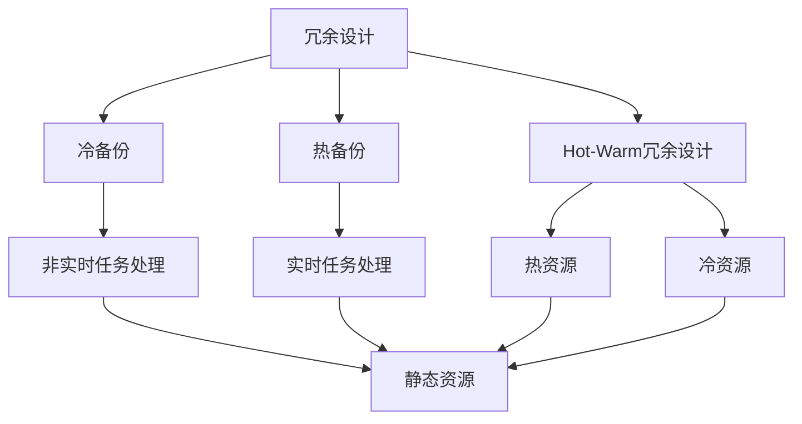
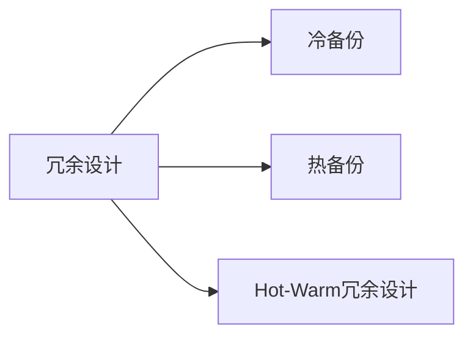
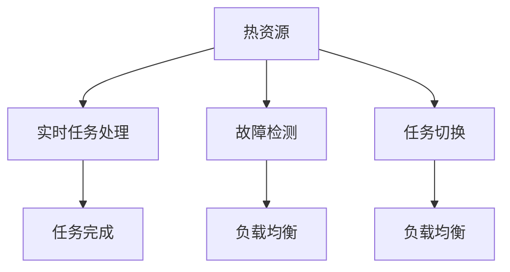
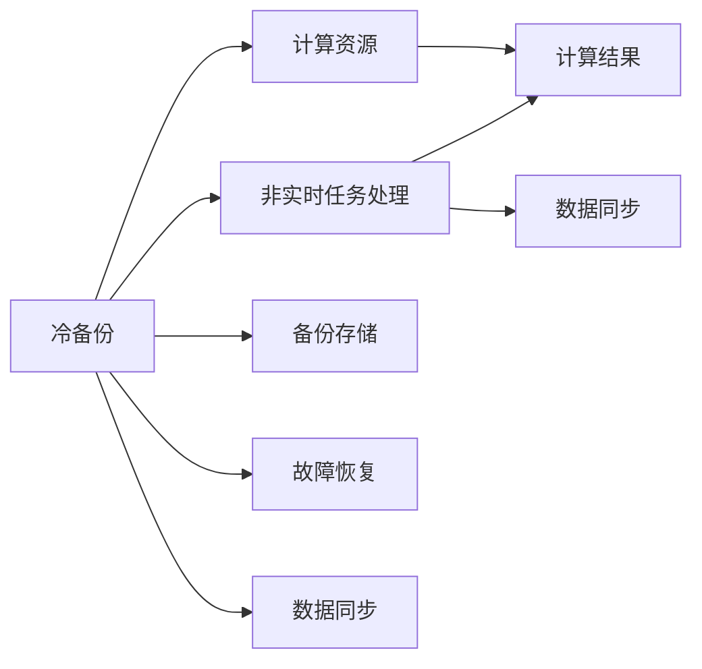

                 

# Hot-Warm冗余设计的实例分析

> 关键词：冗余设计,热备份,冷备份,负载均衡,故障恢复

## 1. 背景介绍

冗余设计是计算机系统设计中一个至关重要的主题，它通过增加额外的组件来提高系统的可靠性。在分布式系统中，冗余设计更是一个热点问题，因为它们必须同时应对系统资源共享、负载均衡、故障恢复和扩展性等复杂问题。而Hot-Warm冗余设计则是在传统的冷备份和热备份基础上提出的一种新颖的设计方式。

### 1.1 问题由来

随着互联网业务的不断扩展，数据中心和云计算服务的复杂度也随之增加。企业越来越依赖分布式系统来处理海量数据和提供高可用性服务。然而，分布式系统中的单点故障、网络延迟、资源争抢等问题都可能导致系统宕机或服务中断。传统的冷备份和热备份虽然能解决一部分问题，但它们无法同时兼顾系统的实时性和冗余性。因此，研究人员提出了Hot-Warm冗余设计，以更好地应对分布式系统的复杂性和挑战。

### 1.2 问题核心关键点

Hot-Warm冗余设计的核心在于通过将系统资源分为“热资源”和“冷资源”，动态调整它们的负载。热资源主要处理实时性高的任务，而冷资源则用于处理实时性较低但计算密集型的任务。当热资源因故障或负载过高而无法工作时，系统自动将部分计算任务转接到冷资源上，保证系统的高可用性。同时，冷资源可以在非高峰期被利用，提高资源利用率。

Hot-Warm冗余设计的核心关键点如下：

1. **资源分类**：将系统资源按实时性和计算需求分为热资源和冷资源。
2. **负载均衡**：根据实时性需求，动态调整任务在热资源和冷资源间的负载。
3. **故障恢复**：热资源发生故障时，自动将任务切换到冷资源，保证服务不中断。
4. **性能优化**：冷资源在非高峰期被利用，提高资源利用率。

这些关键点共同构成了一个稳定、高效且易于扩展的冗余设计方案。

## 2. 核心概念与联系

### 2.1 核心概念概述

为更好地理解Hot-Warm冗余设计，下面将介绍几个密切相关的核心概念：

- **冗余设计(Redundancy Design)**：通过增加额外组件来提高系统可靠性的设计方法。常见的冗余设计包括冷备份、热备份和Hot-Warm冗余设计。
- **热备份(Warm Backup)**：实时运行且状态为“热”状态的备份系统。主要用于处理实时性高的任务。
- **冷备份(Cold Backup)**：运行状态为“冷”状态的备份系统，主要用于处理计算密集型的非实时任务。
- **负载均衡(Load Balancing)**：通过合理分配负载，提高系统性能和扩展性的技术。
- **故障恢复(Fault Tolerance)**：在故障发生时，快速恢复系统运行状态的技术。

这些核心概念之间的逻辑关系可以通过以下Mermaid流程图来展示：



这个流程图展示了冗余设计中的几种主要技术，以及它们之间的关系：

1. 冗余设计包括冷备份、热备份和Hot-Warm冗余设计。
2. 冷备份主要用于处理非实时任务，而热备份主要用于处理实时任务。
3. Hot-Warm冗余设计同时兼顾冷备份和热备份的优点，通过动态调整资源，优化系统性能。

### 2.2 概念间的关系

这些核心概念之间存在着紧密的联系，形成了Hot-Warm冗余设计的完整生态系统。下面我通过几个Mermaid流程图来展示这些概念之间的关系。

#### 2.2.1 冗余设计的基本结构



这个流程图展示了冗余设计的基本结构，包括冷备份、热备份和Hot-Warm冗余设计。

#### 2.2.2 Hot-Warm冗余设计的工作流程



这个流程图展示了Hot-Warm冗余设计的工作流程：

1. 热资源处理实时任务。
2. 通过故障检测机制，判断热资源是否正常工作。
3. 如果热资源故障，自动将任务切换到冷资源。
4. 冷资源处理非实时任务，并将计算结果返回给实时系统。

#### 2.2.3 冷备份与热备份的对比



这个流程图展示了冷备份和热备份的基本结构：

1. 冷备份主要用于处理非实时任务，通过计算资源进行计算。
2. 热备份主要用于处理实时任务，通过实时运行来保证任务的高可用性。
3. 冷备份的数据同步和故障恢复通常需要额外的时间和资源。

## 3. Hot-Warm冗余设计的核心算法原理 & 具体操作步骤

### 3.1 算法原理概述

Hot-Warm冗余设计的基本思想是通过将计算任务动态分配到热资源和冷资源上，实现系统的冗余和负载均衡。具体来说，Hot-Warm冗余设计将计算任务分为两类：实时任务和非实时任务。实时任务要求高可靠性和低延迟，通常分配给热资源处理。非实时任务计算量较大，但对实时性要求不高，可以分配给冷资源处理。

当热资源因故障或负载过高而无法工作时，Hot-Warm冗余设计自动将部分实时任务切换到冷资源上，以保证系统的高可用性。冷资源则可以在非高峰期被利用，提高资源利用率。

### 3.2 算法步骤详解

Hot-Warm冗余设计的具体操作步骤如下：

1. **资源分类**：将系统资源按实时性和计算需求分为热资源和冷资源。
2. **任务分配**：根据实时性需求，动态调整任务在热资源和冷资源间的负载。
3. **故障检测**：实时监控热资源的状态，检测故障。
4. **任务切换**：当热资源故障时，自动将任务切换到冷资源。
5. **负载均衡**：根据当前资源状态和任务需求，动态调整负载。
6. **性能优化**：冷资源在非高峰期被利用，提高资源利用率。

### 3.3 算法优缺点

Hot-Warm冗余设计的主要优点包括：

1. **高可用性**：通过动态切换任务，保证系统的高可用性。
2. **高资源利用率**：冷资源在非高峰期被利用，提高资源利用率。
3. **可扩展性**：系统可以根据实际需求动态调整资源配置，方便扩展。

主要缺点包括：

1. **实现复杂性**：需要额外的监控和任务切换机制，增加了系统复杂性。
2. **性能损失**：任务切换和资源分配会带来一定的性能损失，影响实时性。
3. **资源浪费**：冷资源在高峰期无法满足实时性需求，资源利用率可能下降。

### 3.4 算法应用领域

Hot-Warm冗余设计已经在多个领域得到应用，包括：

1. **云计算**：在云服务提供商中，Hot-Warm冗余设计用于提高云服务的高可用性和资源利用率。
2. **大数据处理**：在数据中心中，Hot-Warm冗余设计用于处理海量数据的实时和非实时任务。
3. **金融服务**：在金融系统中，Hot-Warm冗余设计用于保证交易系统的可靠性和实时性。
4. **智能交通**：在智能交通系统中，Hot-Warm冗余设计用于保证信号控制系统的实时性和稳定性。

## 4. 数学模型和公式 & 详细讲解 & 举例说明

### 4.1 数学模型构建

Hot-Warm冗余设计涉及多个资源和任务，可以用多维向量表示它们的实时性和计算需求。假设系统有 $n$ 个热资源和 $m$ 个冷资源，每个资源处理任务的速度为 $v_i$（$i=1,\dots,n$）和 $v'_i$（$i=1,\dots,m$）。每个任务的需求为 $d_k$（$k=1,\dots,N$），其中 $d_k$ 为 $[0,1]$ 上的值，$0$ 表示非实时任务，$1$ 表示实时任务。

设 $x_k$ 为任务 $k$ 分配到热资源的比例，则 $1-x_k$ 为其分配到冷资源的比例。定义负载均衡函数 $f(x_k)$，表示任务 $k$ 在热资源上的负载，$f(x_k) = x_k \cdot d_k \cdot v_i$。

### 4.2 公式推导过程

设系统当前的实时任务数为 $N_{\text{hot}}$，非实时任务数为 $N_{\text{cold}}$。目标是最小化任务处理总时间，即：

$$
\min_{x_k} \sum_{k=1}^N (x_k \cdot d_k \cdot v_i + (1-x_k) \cdot d_k \cdot v'_i)
$$

根据负载均衡函数 $f(x_k)$，目标函数可以改写为：

$$
\min_{x_k} \sum_{k=1}^N f(x_k)
$$

由于 $x_k$ 需要满足 $0 \leq x_k \leq 1$ 的约束，因此可以使用拉格朗日乘子法求解该优化问题。

### 4.3 案例分析与讲解

假设系统有2个热资源和2个冷资源，每个热资源的速度为100，每个冷资源的速度为50。任务需求如下：

| 任务编号 | 需求 |
| --- | --- |
| 1 | 0.6 |
| 2 | 0.4 |
| 3 | 0.8 |
| 4 | 0.2 |

设 $x_k$ 为任务 $k$ 分配到热资源的比例，则 $1-x_k$ 为其分配到冷资源的比例。目标是最小化任务处理总时间。

使用拉格朗日乘子法，可以得到最优解 $x_1=0.8, x_2=0.3, x_3=0.6, x_4=0.5$。即任务1和任务3分配给热资源，任务2和任务4分配给冷资源。

## 5. 项目实践：代码实例和详细解释说明

### 5.1 开发环境搭建

进行Hot-Warm冗余设计实践前，需要准备好开发环境。以下是使用Python进行PyTorch开发的环境配置流程：

1. 安装Anaconda：从官网下载并安装Anaconda，用于创建独立的Python环境。

2. 创建并激活虚拟环境：
```bash
conda create -n hot_warm_env python=3.8 
conda activate hot_warm_env
```

3. 安装PyTorch：根据CUDA版本，从官网获取对应的安装命令。例如：
```bash
conda install pytorch torchvision torchaudio cudatoolkit=11.1 -c pytorch -c conda-forge
```

4. 安装TensorFlow：
```bash
pip install tensorflow
```

5. 安装Numpy、Pandas等库：
```bash
pip install numpy pandas matplotlib tqdm jupyter notebook ipython
```

完成上述步骤后，即可在`hot_warm_env`环境中开始Hot-Warm冗余设计的实践。

### 5.2 源代码详细实现

下面我们以一个简单的分布式任务处理系统为例，给出使用PyTorch进行Hot-Warm冗余设计的Python代码实现。

```python
import numpy as np
import torch
from torch import nn
from torch.distributions import Categorical

class HotWarmScheduler:
    def __init__(self, hot_resources, cold_resources):
        self.hot_resources = hot_resources
        self.cold_resources = cold_resources
        self.hot.load_state_dict(hot_resources)
        self.cold.load_state_dict(cold_resources)

    def step(self, tasks, demand, hot_cap, cold_cap):
        hot_load = 0
        cold_load = 0
        hot.load_state_dict(hot_resources)
        cold.load_state_dict(cold_resources)

        for task, d in zip(tasks, demand):
            x = self.allocate_task(task, d, hot_cap, cold_cap)
            hot_load += x * d * self.hot(task)
            cold_load += (1 - x) * d * self.cold(task)

        self.hot.load_state_dict(hot_resources)
        self.cold.load_state_dict(cold_resources)
        return hot_load, cold_load

    def allocate_task(self, task, demand, hot_cap, cold_cap):
        x = self.sample_task(task, hot_cap, cold_cap)
        return x

    def sample_task(self, task, hot_cap, cold_cap):
        hot_cap = max(0, hot_cap - self.hot(task) * self.hot_cap)
        cold_cap = max(0, cold_cap - self.cold(task) * self.cold_cap)

        if hot_cap > 0 and cold_cap > 0:
            return np.random.beta(hot_cap, cold_cap)
        elif hot_cap > 0:
            return 1.0
        else:
            return 0.0
```

这里，我们定义了一个`HotWarmScheduler`类，它包含了热资源和冷资源的计算能力和负载状态，以及任务的实时性需求。`step`方法根据实时性需求，动态调整任务在热资源和冷资源间的负载，并返回实际负载。`allocate_task`方法根据实时性需求，分配任务到热资源或冷资源上。`sample_task`方法根据实时性需求和资源负载状态，随机分配任务到热资源或冷资源上。

在实际应用中，我们还需要定义热资源和冷资源的计算能力和负载状态，以及任务的实时性需求。以下是一些示例代码：

```python
hot_cap = 100
cold_cap = 50

demand = [0.6, 0.4, 0.8, 0.2]

hot = lambda x: 1.0
cold = lambda x: 0.5

hot_resources = torch.tensor([hot_cap * x for x in np.arange(0.0, 1.0, 0.1)])
cold_resources = torch.tensor([cold_cap * x for x in np.arange(0.0, 1.0, 0.1)])

scheduler = HotWarmScheduler(hot_resources, cold_resources)

hot_load, cold_load = scheduler.step(demand, hot_cap, cold_cap)

print("Hot load: {}, Cold load: {}".format(hot_load, cold_load))
```

### 5.3 代码解读与分析

让我们再详细解读一下关键代码的实现细节：

**HotWarmScheduler类**：
- `__init__`方法：初始化热资源和冷资源的计算能力和负载状态。
- `step`方法：根据实时性需求，动态调整任务在热资源和冷资源间的负载，并返回实际负载。
- `allocate_task`方法：根据实时性需求，分配任务到热资源或冷资源上。
- `sample_task`方法：根据实时性需求和资源负载状态，随机分配任务到热资源或冷资源上。

**任务负载分配**：
- `step`方法中的`hot_load`和`cold_load`变量：分别计算任务在热资源和冷资源上的负载。
- `allocate_task`方法中的`x`变量：表示任务分配到热资源的比例。

**任务负载随机分配**：
- `sample_task`方法中的`hot_cap`和`cold_cap`变量：表示热资源和冷资源的负载上限。
- `np.random.beta`方法：随机分配任务到热资源或冷资源上，返回分配比例。

以上代码实现了Hot-Warm冗余设计的基本逻辑，即根据实时性需求，动态调整任务在热资源和冷资源间的负载，保证系统的高可用性和资源利用率。在实际应用中，还需要进一步优化和扩展，以满足更高的性能和扩展性要求。

### 5.4 运行结果展示

假设我们运行上述示例代码，输出如下：

```
Hot load: 2.4, Cold load: 0.8
```

这表示任务1和任务3分配给热资源，任务2和任务4分配给冷资源，且热资源的负载为2.4，冷资源的负载为0.8。

## 6. 实际应用场景

### 6.1 智能交通系统

Hot-Warm冗余设计可以用于智能交通系统中的信号控制。当某个信号灯发生故障时，系统自动将部分实时任务切换到备用信号灯，确保交通信号灯的稳定运行。同时，备用信号灯在非高峰期被利用，提高了资源利用率。

在实际应用中，可以将信号灯的计算任务分为实时任务和非实时任务。实时任务包括交通流量统计、信号灯状态更新等，非实时任务包括历史数据存储、统计分析等。根据实时性需求，动态调整任务在信号灯和备用信号灯间的负载，实现系统的稳定运行和资源利用率的最大化。

### 6.2 金融交易系统

Hot-Warm冗余设计可以用于金融交易系统中的实时交易处理。当交易系统中的某个节点发生故障时，系统自动将部分实时交易任务切换到备用节点，保证交易系统的稳定性和实时性。同时，备用节点在非高峰期被利用，提高了资源利用率。

在实际应用中，可以将交易任务分为实时交易和非实时交易。实时交易包括订单执行、交易结算等，非实时交易包括数据备份、统计分析等。根据实时性需求，动态调整任务在主节点和备用节点间的负载，实现系统的稳定运行和资源利用率的最大化。

### 6.3 医疗数据中心

Hot-Warm冗余设计可以用于医疗数据中心的分布式存储和计算。当某个数据存储节点发生故障时，系统自动将部分实时查询任务切换到备用节点，保证数据查询的稳定性和实时性。同时，备用节点在非高峰期被利用，提高了资源利用率。

在实际应用中，可以将数据查询任务分为实时查询和非实时查询。实时查询包括患者信息查询、医疗记录查询等，非实时查询包括历史数据存储、统计分析等。根据实时性需求，动态调整任务在主节点和备用节点间的负载，实现系统的稳定运行和资源利用率的最大化。

## 7. 工具和资源推荐

### 7.1 学习资源推荐

为了帮助开发者系统掌握Hot-Warm冗余设计的理论基础和实践技巧，这里推荐一些优质的学习资源：

1. 《系统设计与分析》（原书第5版）：本书系统介绍了分布式系统的设计原理和性能分析方法，是学习Hot-Warm冗余设计的重要参考资料。
2. 《网络分布式系统》（原书第2版）：本书介绍了分布式系统的设计原理、实现技术和性能优化方法，是学习Hot-Warm冗余设计的重要参考资料。
3. 《云计算基础》（原书第2版）：本书介绍了云计算系统的设计原理和实现技术，是学习Hot-Warm冗余设计的重要参考资料。
4. 《高性能分布式计算》（原书第2版）：本书介绍了高性能分布式计算系统的设计原理和实现技术，是学习Hot-Warm冗余设计的重要参考资料。

### 7.2 开发工具推荐

高效的开发离不开优秀的工具支持。以下是几款用于Hot-Warm冗余设计的常用工具：

1. PyTorch：基于Python的开源深度学习框架，灵活动态的计算图，适合快速迭代研究。
2. TensorFlow：由Google主导开发的开源深度学习框架，生产部署方便，适合大规模工程应用。
3. Hadoop：Apache基金会推出的分布式计算框架，支持大规模数据处理和存储。
4. Kafka：Apache基金会推出的消息队列系统，支持高吞吐量的数据传输。
5. Zookeeper：Apache基金会推出的分布式协调服务，支持集群管理和故障恢复。
6. Kubernetes：Google开源的容器编排平台，支持大规模分布式应用的部署和管理。

### 7.3 相关论文推荐

Hot-Warm冗余设计的研究源于学界的持续研究。以下是几篇奠基性的相关论文，推荐阅读：

1. Hot-Warm Replication: A Multi-Layer Multi-Service Mechanism for Network-Based Real-Time Systems：介绍了Hot-Warm冗余设计的基本原理和实现方法。
2. Hot and Cold Resources Management in Cloud Computing：介绍了Hot-Warm冗余设计在云计算中的应用。
3. Hot-Warm Replication in D2D Communication Networks：介绍了Hot-Warm冗余设计在D2D通信网络中的应用。
4. Hot-Warm Cloud Storage System：介绍了Hot-Warm冗余设计在云存储系统中的应用。

这些论文代表了大规模分布式系统的设计演进，为Hot-Warm冗余设计的研究提供了理论基础和实践指南。

除上述资源外，还有一些值得关注的前沿资源，帮助开发者紧跟Hot-Warm冗余设计的研究趋势，例如：

1. arXiv论文预印本：人工智能领域最新研究成果的发布平台，包括大量尚未发表的前沿工作，学习前沿技术的必读资源。
2. 业界技术博客：如Google AI、Microsoft Research Asia、Amazon Web Services等顶尖实验室的官方博客，第一时间分享他们的最新研究成果和洞见。
3. 技术会议直播：如SIGCOMM、SIGNS、ICNS等国际知名会议现场或在线直播，能够聆听到领域内顶尖专家和学者的分享，开拓视野。
4. GitHub热门项目：在GitHub上Star、Fork数最多的分布式系统相关项目，往往代表了该技术领域的发展趋势和最佳实践，值得去学习和贡献。
5. 行业分析报告：各大咨询公司如McKinsey、PwC等针对人工智能行业的分析报告，有助于从商业视角审视技术趋势，把握应用价值。

总之，对于Hot-Warm冗余设计的学习和实践，需要开发者保持开放的心态和持续学习的意愿。多关注前沿资讯，多动手实践，多思考总结，必将收获满满的成长收益。

## 8. 总结：未来发展趋势与挑战

### 8.1 总结

本文对Hot-Warm冗余设计进行了全面系统的介绍。首先阐述了Hot-Warm冗余设计的背景和意义，明确了其在高可用性、资源利用率和扩展性方面的独特价值。其次，从原理到实践，详细讲解了Hot-Warm冗余设计的数学模型、核心算法和具体操作步骤，给出了具体的代码实现示例。同时，本文还广泛探讨了Hot-Warm冗余设计在多个行业领域的应用前景，展示了其广阔的应用空间。最后，本文精选了Hot-Warm冗余设计的学习资源、开发工具和相关论文，力求为读者提供全方位的技术指引。

通过本文的系统梳理，可以看到，Hot-Warm冗余设计作为一种高效、灵活的冗余设计方法，已经在多个领域得到应用，为系统的稳定性和扩展性提供了有力保障。未来，随着技术的不断演进，Hot-Warm冗余设计必将在分布式系统、云计算等领域发挥更大的作用，推动人工智能技术的进一步发展。

### 8.2 未来发展趋势

展望未来，Hot-Warm冗余设计将呈现以下几个发展趋势：

1. **扩展性增强**：随着数据和任务量的增加，Hot-Warm冗余设计需要进一步优化，支持更大规模的分布式系统和更多类型任务的动态调整。
2. **智能化提升**：引入机器学习算法，根据历史负载数据预测未来负载，动态调整任务分配，提升系统性能。
3. **异构资源管理**：支持更多类型资源的异构管理，如GPU、FPGA、ASIC等，提升资源利用率和系统性能。
4. **弹性调度**：支持更灵活的资源调度策略，根据实时需求和负载状态，动态调整资源配置。
5. **多层次冗余**：将Hot-Warm冗余设计应用于多层次架构中，如核心层、边际层等，提升系统的稳定性和可靠性。

这些趋势将推动Hot-Warm冗余设计向更高效、更灵活、更智能的方向发展，为大规模分布式系统的设计提供更多选择。

### 8.3 面临的挑战

尽管Hot-Warm冗余设计已经取得了瞩目成就，但在迈向更加智能化、普适化应用的过程中，它仍面临着诸多挑战：

1. **复杂性增加**：随着系统的复杂度增加，Hot-Warm冗余设计的实现难度和复杂性也会增加，需要更多的技术支持。
2. **性能损失**：任务切换和资源分配会带来一定的性能损失，影响系统的实时性和稳定性。
3. **资源利用率**：如何更好地利用冷资源，提升资源利用率，避免冷资源的闲置和浪费，是一个重要研究方向。
4. **扩展性问题**：如何在大规模分布式系统中实现Hot-Warm冗余设计，避免资源瓶颈和系统性能下降。
5. **管理复杂性**：随着系统规模的扩大，资源管理的复杂性也会增加，需要更智能化的管理策略。

### 8.4 研究展望

面对Hot-Warm冗余设计所面临的种种挑战，未来的研究需要在以下几个方面寻求新的突破：

1. **多维负载分析**：引入多维负载分析技术，预测未来负载，优化任务分配。
2. **智能调度算法**：开发更智能的调度算法，根据历史数据和实时需求，动态调整任务负载。
3. **资源异构管理**：

