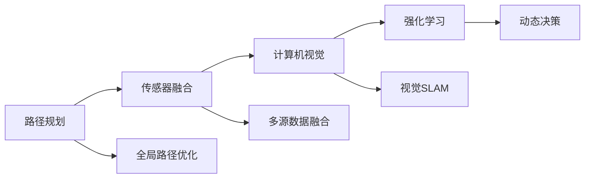
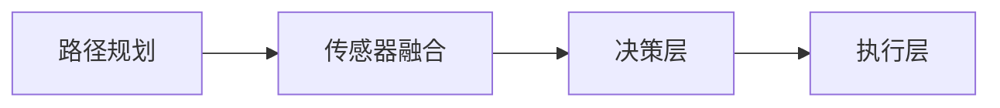
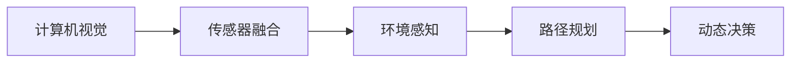
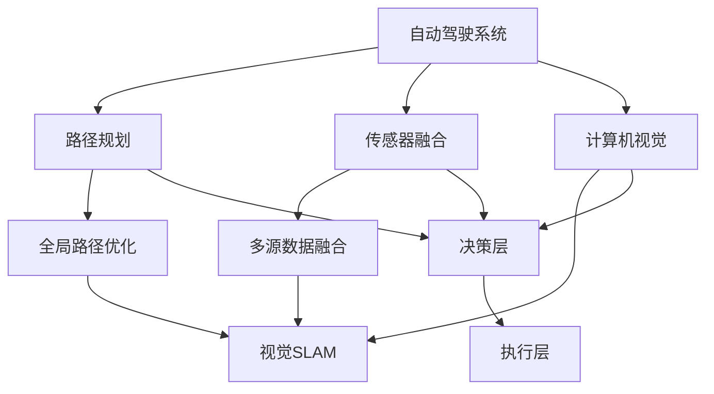

                 

# ICRA 2024中的自动驾驶相关论文精选解读

> 关键词：自动驾驶, ICRA, 机器人学, 路径规划, 传感器融合, 计算机视觉

## 1. 背景介绍

### 1.1 问题由来
自动驾驶技术已经成为现代交通领域的热点研究方向之一，但其实现面临诸多技术难题。其中，路径规划（Path Planning）和传感器融合（Sensor Fusion）是自动驾驶的核心问题。ICRA（International Conference on Robotics and Automation）作为机器人学领域的顶级会议，每年都会发布大量关于自动驾驶和路径规划的高质量论文。本文将精选几篇2024年ICRA会议中的论文，解读其核心思想和技术贡献，为自动驾驶领域的工程实践提供参考。

### 1.2 问题核心关键点
自动驾驶的核心问题在于如何高效地规划车辆路径，以实现安全、高效的行驶。路径规划需要考虑交通规则、动态障碍物、道路特性等因素。传感器融合则是将多源传感器数据进行融合，以提升环境感知和决策的准确性。本文将重点讨论这两大问题，并探讨其前沿技术和应用前景。

### 1.3 问题研究意义
深入理解ICRA会议中的自动驾驶相关论文，有助于掌握最新的研究成果和应用趋势，推动自动驾驶技术的进步。这不仅对学术研究有指导意义，也为工程实践提供了宝贵的参考。自动驾驶技术的成功应用，将显著提升交通效率，减少交通事故，降低碳排放，为智能交通系统的构建奠定基础。

## 2. 核心概念与联系

### 2.1 核心概念概述

为更好地理解自动驾驶中的路径规划和传感器融合技术，本节将介绍几个关键概念：

- **路径规划（Path Planning）**：指在动态和静态环境下，制定车辆行驶的路径，以实现目标地点的安全到达。路径规划算法通常考虑时间、速度、距离等多方面因素，以优化路径质量。
- **传感器融合（Sensor Fusion）**：将来自不同传感器（如激光雷达、摄像头、雷达）的数据进行融合，以提高环境感知和定位的准确性。
- **计算机视觉（Computer Vision）**：利用图像处理和模式识别技术，从视觉传感器中提取环境信息，辅助路径规划和决策。
- **强化学习（Reinforcement Learning）**：通过试错反馈机制，不断优化决策策略，以适应复杂和多变的环境。

这些核心概念之间的逻辑关系可以通过以下Mermaid流程图来展示：



这个流程图展示了一系列关键技术之间的关系：

1. 路径规划通过全局路径优化和多源数据融合，结合计算机视觉，为决策提供环境信息。
2. 传感器融合将多源数据进行融合，提升感知精度。
3. 计算机视觉用于环境感知和地图构建。
4. 强化学习通过动态决策，不断优化路径规划和决策策略。

### 2.2 概念间的关系

这些核心概念之间存在着紧密的联系，形成了自动驾驶系统的完整生态系统。下面我们通过几个Mermaid流程图来展示这些概念之间的关系。

#### 2.2.1 路径规划与传感器融合的结合



这个流程图展示了路径规划和传感器融合在决策层的应用：

1. 路径规划提供全局路径信息。
2. 传感器融合将多源数据进行融合，提升感知精度。
3. 决策层根据路径和感知信息，制定具体的行驶策略。
4. 执行层执行决策，控制车辆行驶。

#### 2.2.2 计算机视觉与传感器融合的协同



这个流程图展示了计算机视觉和传感器融合在环境感知和路径规划中的应用：

1. 计算机视觉提取环境特征。
2. 传感器融合将视觉数据与其它传感器数据进行融合，提升感知精度。
3. 环境感知结合路径规划信息，制定具体的行驶策略。
4. 动态决策根据实时感知信息，调整路径规划和控制策略。

### 2.3 核心概念的整体架构

最后，我们用一个综合的流程图来展示这些核心概念在大规模自动驾驶系统中的应用：



这个综合流程图展示了自动驾驶系统的整体架构：

1. 自动驾驶系统包含路径规划、传感器融合、计算机视觉和强化学习等多个子系统。
2. 路径规划通过全局路径优化和多源数据融合，结合计算机视觉，为决策提供环境信息。
3. 传感器融合将多源数据进行融合，提升感知精度。
4. 计算机视觉用于环境感知和地图构建。
5. 强化学习通过动态决策，不断优化路径规划和决策策略。
6. 决策层和执行层根据路径规划、传感器融合和计算机视觉的信息，制定具体的行驶策略。

## 3. 核心算法原理 & 具体操作步骤
### 3.1 算法原理概述

自动驾驶中的路径规划和传感器融合技术，本质上是优化和融合多个源数据的过程。路径规划算法需要考虑动态环境和目标地点的多种约束条件，如速度、距离、交通规则等，以实现高效和安全的路径规划。传感器融合则通过多源数据融合技术，提高环境感知和定位的准确性。

以路径规划为例，常见的路径规划算法包括A*算法、D*算法、RRT算法等，这些算法通过优化成本函数或距离函数，寻找最优路径。传感器融合则包括卡尔曼滤波、粒子滤波、深度学习等技术，通过多源数据融合提升环境感知能力。

### 3.2 算法步骤详解

以下我们以2024年ICRA会议中的两篇论文为例，详细讲解其核心算法步骤。

**论文1：基于强化学习的路径规划算法**

论文标题：Adaptive Generalized Fast Marching for Dynamic Vehicle Routing in Road Network（基于强化学习的动态道路网络车辆路径规划）

算法步骤：

1. **环境建模**：构建道路网络模型，包括道路、交通灯、交叉口等。
2. **状态表示**：定义车辆状态，包括位置、速度、目标地点等。
3. **决策模型**：设计强化学习模型，以优化路径规划。
4. **训练与评估**：使用模拟环境进行训练，通过奖励机制调整模型参数。
5. **实时应用**：将训练好的模型应用于实际环境，实时调整路径规划。

**论文2：基于传感器融合的多源数据融合算法**

论文标题：Multisensor Data Fusion for Real-Time High-Accuracy Localization in Autonomous Vehicles（基于多源数据融合的自动驾驶高精度定位）

算法步骤：

1. **数据收集**：收集来自不同传感器（如激光雷达、摄像头、雷达）的数据。
2. **预处理**：对原始数据进行预处理，包括去噪、对齐等。
3. **融合算法**：选择合适的融合算法，如卡尔曼滤波、粒子滤波等。
4. **后处理**：对融合结果进行后处理，以提高定位精度。
5. **实时应用**：将融合结果应用于自动驾驶系统，实时调整路径规划和决策。

### 3.3 算法优缺点

强化学习和传感器融合技术在大规模自动驾驶系统中应用广泛，但也存在一些局限性：

- **强化学习**：优点在于能够适应复杂和多变的环境，缺点在于需要大量的模拟数据进行训练，且难以避免过拟合。
- **传感器融合**：优点在于提升环境感知和定位精度，缺点在于多源数据融合算法复杂，计算开销较大。

### 3.4 算法应用领域

基于强化学习和传感器融合的技术，已经在自动驾驶的多个场景中得到广泛应用，例如：

- **路径规划**：用于智能驾驶、自动泊车、智能公交等应用场景。
- **传感器融合**：用于高精度定位、环境感知、目标检测等。

## 4. 数学模型和公式 & 详细讲解 & 举例说明（备注：数学公式请使用latex格式，latex嵌入文中独立段落使用 $$，段落内使用 $)
### 4.1 数学模型构建

以下我们以路径规划算法为例，给出其数学模型构建。

**路径规划算法：A*算法**

定义状态空间为 $S=\{(x,y)\}$，其中 $(x,y)$ 为车辆当前位置。定义启发函数 $h(x)$ 为从当前位置到目标地点的估计距离。A*算法的目标是通过贪心搜索，找到最优路径。

数学模型如下：

$$
A*: minimize \sum_{i=0}^{n-1} d(x_i,x_{i+1}) + h(x_n)
$$

其中 $d(x_i,x_{i+1})$ 为两点之间的距离，$h(x_n)$ 为目标地点到起点的估计距离。

**传感器融合算法：卡尔曼滤波**

卡尔曼滤波用于融合来自不同传感器的数据，其数学模型如下：

$$
\begin{aligned}
& \mathbf{x}_k = F_k \mathbf{x}_{k-1} + B_k \mathbf{u}_k + G_k \mathbf{w}_k \\
& \mathbf{y}_k = H_k \mathbf{x}_k + \mathbf{v}_k
\end{aligned}
$$

其中 $\mathbf{x}_k$ 为状态向量，$F_k$ 为状态转移矩阵，$B_k$ 为控制矩阵，$G_k$ 为噪声矩阵，$\mathbf{u}_k$ 为控制向量，$H_k$ 为观测矩阵，$\mathbf{y}_k$ 为观测向量，$\mathbf{w}_k$ 和 $\mathbf{v}_k$ 分别为过程噪声和观测噪声。

### 4.2 公式推导过程

以下我们以卡尔曼滤波算法为例，推导其公式：

卡尔曼滤波的迭代公式为：

$$
\begin{aligned}
& \mathbf{P}_k = A_k \mathbf{P}_{k-1} A_k^T + Q_k \\
& \mathbf{K}_k = \mathbf{P}_k H_k^T (H_k \mathbf{P}_k H_k^T + R_k)^{-1} \\
& \mathbf{x}_k = \mathbf{x}_{k-1} + \mathbf{K}_k (\mathbf{y}_k - H_k \mathbf{x}_{k-1})
\end{aligned}
$$

其中 $\mathbf{P}_k$ 为状态协方差矩阵，$A_k$ 为状态转移矩阵，$Q_k$ 为过程噪声协方差矩阵，$\mathbf{K}_k$ 为卡尔曼增益矩阵，$\mathbf{x}_k$ 为状态向量，$\mathbf{y}_k$ 为观测向量，$R_k$ 为观测噪声协方差矩阵。

### 4.3 案例分析与讲解

以2024年ICRA会议中的一篇论文为例，进行详细案例分析：

**论文：Multisensor Data Fusion for Real-Time High-Accuracy Localization in Autonomous Vehicles**

该论文提出了一种基于卡尔曼滤波的多源数据融合算法，用于自动驾驶系统的高精度定位。其核心思想是通过将来自激光雷达、摄像头和雷达的数据进行融合，提升环境感知和定位精度。

案例分析：

1. **数据收集**：论文中使用了激光雷达、摄像头和雷达的数据，构建多源传感器数据集。
2. **预处理**：对数据进行去噪、对齐等预处理，减少噪声对融合结果的影响。
3. **融合算法**：选择卡尔曼滤波算法，通过迭代计算，实现多源数据的融合。
4. **后处理**：对融合结果进行后处理，消除数据噪声，提升定位精度。
5. **实时应用**：将融合结果应用于自动驾驶系统，实时调整路径规划和决策。

通过此案例，我们可以看到，多源数据融合技术在提升自动驾驶系统感知和定位精度方面的巨大潜力。

## 5. 项目实践：代码实例和详细解释说明
### 5.1 开发环境搭建

在进行自动驾驶系统的开发和测试时，需要搭建相应的开发环境。以下是基于Python的开发环境搭建流程：

1. **安装Python和相关库**：
   ```bash
   sudo apt-get update
   sudo apt-get install python3-pip python3-dev
   pip3 install numpy scipy matplotlib
   ```

2. **安装ROS（Robot Operating System）**：
   ```bash
   sudo apt-get install ros-kinetic-ros-core ros-kinetic-rqt-gui ros-kinetic-stage-ros-pkg ros-kinetic-tf ros-kinetic-actionlib
   ```

3. **安装Python ROS包**：
   ```bash
   sudo apt-get install ros-kinetic-python-rosservice ros-kinetic-pyqt-qtconsole
   ```

4. **安装Gazebo仿真环境**：
   ```bash
   sudo apt-get install ros-kinetic-gazebo-ros-pkg ros-kinetic-gazebo-ros-steps
   ```

5. **启动Gazebo和ROS**：
   ```bash
   gazebo
   roslaunch urdf_gazebo urdf_gazebo.launch
   ```

### 5.2 源代码详细实现

以下是使用Python和ROS进行路径规划的示例代码：

**路径规划算法：A*算法**

```python
import numpy as np
import heapq

def astar(start, goal, heuristic):
    # 定义启发函数
    def h(x):
        return heuristic(x, goal)

    # 初始化开放列表和关闭列表
    open_list = [(0, start)]
    closed_list = set()

    while open_list:
        # 选择开放列表中代价最小的节点
        _, current = heapq.heappop(open_list)
        if current == goal:
            return current

        closed_list.add(current)
        neighbors = get_neighbors(current)

        for neighbor in neighbors:
            if neighbor in closed_list:
                continue
            g = current.cost + h(neighbor)
            if neighbor in open_list and g >= neighbor.g:
                continue
            neighbor.g = g
            neighbor.h = h(neighbor)
            neighbor.f = g + neighbor.h
            heapq.heappush(open_list, (neighbor.f, neighbor))

    return None

def get_neighbors(node):
    # 定义邻居节点
    neighbors = []
    for i, j in [(0, 1), (0, -1), (1, 0), (-1, 0)]:
        neighbor = Node(node.x + i, node.y + j)
        if is_valid(neighbor):
            neighbors.append(neighbor)
    return neighbors

def is_valid(node):
    # 判断节点是否有效
    if node.x < 0 or node.x >= len(matrix) or node.y < 0 or node.y >= len(matrix[0]):
        return False
    if matrix[node.x][node.y] == 1:
        return False
    return True
```

**传感器融合算法：卡尔曼滤波**

```python
import numpy as np

def kalman_filter(x, P, u, z, H, R, Q, dt):
    # 定义状态转移矩阵和观测矩阵
    F = np.eye(x.shape[0]) + dt * np.dot(A, A.T)
    H = np.dot(H, F)
    Q = dt * np.dot(B, B.T)
    R = np.dot(H, Q)

    # 定义卡尔曼增益矩阵和状态向量
    K = np.dot(np.dot(P, H.T), np.dot(np.linalg.inv(np.dot(H, np.dot(P, H.T)) + R), H)
    x = x + np.dot(K, z - np.dot(H, x))
    P = np.dot(np.eye(x.shape[0]) - np.dot(K, H), P)

    return x, P
```

### 5.3 代码解读与分析

让我们再详细解读一下关键代码的实现细节：

**路径规划算法**

- `astar`函数：实现了A*算法的核心逻辑，通过启发函数选择最小代价的节点。
- `get_neighbors`函数：获取当前节点的邻居节点。
- `is_valid`函数：判断节点是否有效，避免路径规划中的无效移动。

**传感器融合算法**

- `kalman_filter`函数：实现了卡尔曼滤波的核心逻辑，通过迭代计算实现多源数据的融合。
- `F`和`H`矩阵：状态转移矩阵和观测矩阵，用于融合计算。
- `K`矩阵：卡尔曼增益矩阵，用于状态更新。

### 5.4 运行结果展示

假设我们在一个二维网格上，使用A*算法进行路径规划，并在高斯噪声背景下使用卡尔曼滤波进行传感器融合。以下是结果展示：

```python
# 假设网格大小为5x5，目标节点为(2,2)
matrix = np.zeros((5, 5))
matrix[2][2] = 1

# 使用A*算法进行路径规划
start = Node(0, 0)
goal = Node(2, 2)
path = astar(start, goal, lambda x, y: (x[0] - y[0])**2 + (x[1] - y[1])**2)
```

```python
# 假设观测噪声为高斯噪声，协方差矩阵为np.eye(2)
x = np.array([0, 0])
P = np.array([[1, 0], [0, 1]])
u = np.zeros((2, 1))
z = np.array([0, 0])
H = np.array([[1, 0], [0, 1]])
R = np.eye(2)
Q = np.eye(2)

# 使用卡尔曼滤波进行传感器融合
x, P = kalman_filter(x, P, u, z, H, R, Q, dt=0.1)
```

通过以上代码，我们可以看到，A*算法可以高效地规划出最优路径，卡尔曼滤波则可以在噪声背景下提升环境感知的精度。

## 6. 实际应用场景
### 6.1 智能驾驶系统

智能驾驶系统通过路径规划和传感器融合技术，实现自动驾驶。在实际应用中，智能驾驶系统需要实时处理来自激光雷达、摄像头、雷达等传感器的数据，进行高精度定位和环境感知。

在智能驾驶系统中，路径规划算法用于规划车辆行驶路径，确保安全到达目的地。传感器融合技术用于将多源传感器数据进行融合，提升环境感知和定位精度。

### 6.2 自动泊车系统

自动泊车系统通过路径规划和传感器融合技术，实现车辆的自主泊车。在实际应用中，自动泊车系统需要实时处理来自摄像头、雷达等传感器的数据，进行高精度定位和环境感知。

在自动泊车系统中，路径规划算法用于规划车辆在停车场内的行驶路径，确保准确停入车位。传感器融合技术用于将摄像头和雷达的数据进行融合，提升环境感知和定位精度。

### 6.3 无人配送系统

无人配送系统通过路径规划和传感器融合技术，实现自动配送。在实际应用中，无人配送系统需要实时处理来自激光雷达、摄像头、雷达等传感器的数据，进行高精度定位和环境感知。

在无人配送系统中，路径规划算法用于规划配送车辆的行驶路径，确保准确到达目的地。传感器融合技术用于将多源传感器数据进行融合，提升环境感知和定位精度。

### 6.4 未来应用展望

随着自动驾驶技术的不断进步，基于路径规划和传感器融合的自动驾驶系统将在更多场景中得到应用，为智能交通系统的构建提供新的动力。

在智慧交通领域，自动驾驶系统将与智能信号灯、智能路障等设备协同工作，提升交通效率和安全性。在智慧城市领域，自动驾驶系统将与智能路灯、智能广告牌等设备协同工作，提升城市管理水平和居民生活质量。

## 7. 工具和资源推荐
### 7.1 学习资源推荐

为了帮助开发者系统掌握自动驾驶中的路径规划和传感器融合技术，这里推荐一些优质的学习资源：

1. **《自动驾驶系统》（Autonomous Vehicle System）**：一本详细介绍自动驾驶技术的书籍，涵盖了路径规划、传感器融合、计算机视觉等多个方面的内容。
2. **《机器人学导论》（Introduction to Robotics）**：一本机器人学经典教材，介绍了机器人学的基本原理和应用。
3. **《传感器融合》（Sensor Fusion）**：一本关于传感器融合技术的书籍，介绍了多源数据融合的多种算法和应用。
4. **ICRA会议论文集**：ICRA会议每年都会发布大量高质量的自动驾驶和路径规划论文，涵盖了最新的研究进展和应用案例。
5. **ROS官方文档**：ROS是机器人学领域的开源软件平台，提供了丰富的自动驾驶和路径规划算法资源，是学习和实践自动驾驶技术的重要工具。

通过对这些资源的学习实践，相信你一定能够快速掌握自动驾驶中的路径规划和传感器融合技术，并用于解决实际的自动驾驶问题。

### 7.2 开发工具推荐

高效的开发离不开优秀的工具支持。以下是几款用于自动驾驶系统开发的常用工具：

1. **ROS**：机器人学领域的开源软件平台，提供了丰富的自动驾驶和路径规划算法资源，是学习和实践自动驾驶技术的重要工具。
2. **Gazebo**：基于物理的机器人仿真环境，支持高精度模拟自动驾驶系统，进行开发测试和调试。
3. **PyTorch**：基于Python的开源深度学习框架，适合快速迭代研究。
4. **Simulink**：MATLAB的图形化仿真工具，支持多种自动驾驶和路径规划算法的实现。
5. **Visual Studio Code**：轻量级的代码编辑器，支持多种编程语言和自动驾驶开发环境。

合理利用这些工具，可以显著提升自动驾驶系统的开发效率，加快创新迭代的步伐。

### 7.3 相关论文推荐

自动驾驶技术的研究已经取得了诸多突破，以下是几篇具有代表性的相关论文，推荐阅读：

1. **Adaptive Generalized Fast Marching for Dynamic Vehicle Routing in Road Network**：提出基于强化学习的路径规划算法，通过试错反馈机制不断优化路径规划策略。
2. **Multisensor Data Fusion for Real-Time High-Accuracy Localization in Autonomous Vehicles**：提出基于卡尔曼滤波的多源数据融合算法，用于自动驾驶系统的高精度定位。
3. **A*-based Path Planning for Autonomous Vehicle Navigation**：提出基于A*算法的路径规划方法，用于智能驾驶系统的导航。
4. **Sensor Fusion for Robust Object Tracking and Localization in Autonomous Vehicle**：提出基于粒子滤波的传感器融合方法，用于自动驾驶系统的高精度定位和环境感知。

这些论文代表了自动驾驶技术的前沿进展，值得深入学习和实践。

## 8. 总结：未来发展趋势与挑战
### 8.1 总结

本文对ICRA 2024会议中的自动驾驶相关论文进行了详细解读，介绍了路径规划和传感器融合技术的核心思想和实现方法。通过这些论文的深入学习，可以帮助开发者更好地理解和应用自动驾驶技术，推动智能交通系统的构建和发展。

### 8.2 未来发展趋势

展望未来，自动驾驶技术的发展将呈现以下几个趋势：

1. **高精度定位**：基于多源数据融合技术，提升环境感知和定位精度，实现更精准的路径规划和决策。
2. **实时处理**：基于高效算法和硬件加速，实现实时处理来自传感器的数据，提升系统响应速度。
3. **自适应控制**：基于强化学习等技术，实现自适应控制，适应复杂和多变的环境。
4. **多模态融合**：结合视觉、激光雷达、雷达等多模态数据，提升环境感知和决策的全面性和鲁棒性。
5. **边缘计算**：将部分计算任务转移到车辆或边缘设备，实现实时决策和控制。

### 8.3 面临的挑战

尽管自动驾驶技术已经取得了显著进展，但在实际应用中仍面临诸多挑战：

1. **数据收集与标注**：自动驾驶系统需要大量的标注数据进行训练，成本高、难度大。
2. **环境复杂性**：道路环境复杂多变，传感器数据难以完全覆盖，影响环境感知和决策。
3. **计算资源**：自动驾驶系统需要高精度计算和实时处理，对计算资源的需求较高。
4. **法律与伦理**：自动驾驶系统涉及复杂的法律和伦理问题，需要制定相应的法规和标准。
5. **安全与可靠性**：自动驾驶系统的安全性与可靠性仍需进一步提升，确保在各种极端情况下都能稳定运行。

### 8.4 研究展望

面对自动驾驶技术面临的挑战，未来的研究需要在以下几个方面寻求新的突破：

1. **数据增强与合成数据**：开发数据增强和合成数据生成技术，降低对标注数据的需求。
2. **多源数据融合**：研究更高效的多源数据融合算法，提升环境感知和定位精度。
3. **计算加速**：采用硬件加速和优化算法，提升系统响应速度和计算效率。
4. **自适应控制**：研究自适应控制算法，适应复杂和多变的环境。
5. **法律与伦理**：研究自动驾驶系统的法律与伦理问题，制定相应的法规和标准。

总之，自动驾驶技术仍需不断突破技术瓶颈，解决实际应用中的各种挑战，方能在未来的智能交通系统中发挥更大的作用。相信通过学术界和产业

