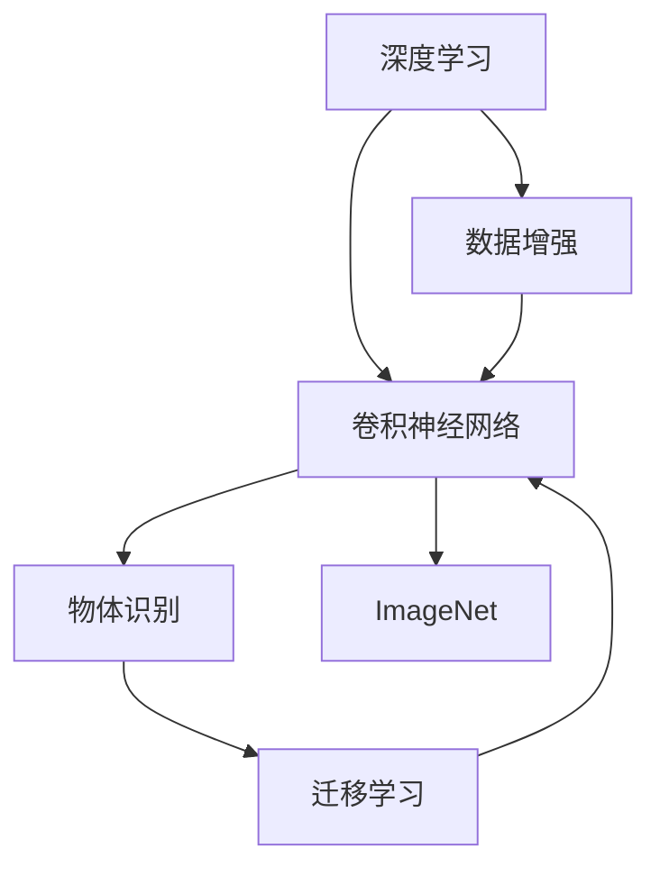

                 

## 1. 背景介绍

在人工智能(AI)领域，ImageNet不仅是人脸识别、物体识别等图像识别任务的重要数据集，更是引领了整个深度学习时代的一次根本性变革。ImageNet数据集包含超过100万张标注图片和1000个类别，是计算机视觉领域中最具规模和影响力的数据集之一。本节将探讨ImageNet如何影响和塑造了深度学习，尤其是卷积神经网络(CNN)的进展，以及它在推动AI技术发展中的重要贡献。

### 1.1 背景历史

ImageNet的起源可以追溯到2005年，当时AlexNet模型在ImageNet LSVRC竞赛中脱颖而出，成为首个获得冠军的深度神经网络。这次胜利不仅标志着深度学习在计算机视觉领域的重大突破，也预示了深度学习在未来各个AI领域的巨大潜力。此后，ImageNet成为了AI研究者竞相追逐的目标，其数据集和竞赛成为了推动AI技术发展的加速器。

### 1.2 竞赛驱动的创新

ImageNet竞赛吸引了全球最顶尖的研究机构和企业竞相参赛，极大地促进了计算机视觉技术的创新。每年一度的ImageNet LSVRC挑战赛是AI界最重要的竞赛之一，其高额奖金和巨大影响力激发了大量高水平的研究投入。这种高水平的竞赛压力，催生了诸如ResNet、Inception、DenseNet等革命性模型，极大地推动了计算机视觉和深度学习的理论发展和技术进步。

### 1.3 数据的重要性

ImageNet数据集的价值不仅仅在于其规模和标注质量，更重要的是其代表的真实世界场景的多样性和复杂性。通过在ImageNet上进行训练和测试，模型能够学习到广泛的多样性，进而提升其在其他现实世界场景中的表现。这成为了深度学习在各个领域应用的基础。

## 2. 核心概念与联系

### 2.1 核心概念概述

为更好地理解ImageNet对AI技术的影响，本节将介绍几个关键概念：

- **深度学习**：基于神经网络的机器学习技术，通过多层非线性变换，能够自动从数据中学习到复杂特征和模式。
- **卷积神经网络(CNN)**：一种特殊类型的神经网络，常用于处理图像和视频数据，通过卷积操作提取空间特征，显著提升了图像识别等任务的性能。
- **物体识别**：计算机视觉中的一个核心任务，旨在识别图像中的对象，并对其分类或定位。
- **数据增强**：通过一系列图像变换技术，如旋转、缩放、裁剪等，扩充训练数据集的多样性，提高模型泛化能力。
- **迁移学习**：将在大规模数据集上训练的模型知识迁移到新的、小规模数据集上，加速模型训练和提高性能。

这些概念之间通过ImageNet数据集紧密相连，共同构成了深度学习和计算机视觉领域的核心技术框架。

### 2.2 概念间的关系

ImageNet数据集和上述概念之间的关系，可以通过以下Mermaid流程图来展示：



这个流程图展示了深度学习、卷积神经网络、物体识别、数据增强和迁移学习这些核心概念之间的联系，以及它们如何共同作用于ImageNet数据集，从而推动AI技术的发展。

## 3. 核心算法原理 & 具体操作步骤

### 3.1 算法原理概述

ImageNet的深度学习和计算机视觉研究主要基于以下原理：

- **监督学习**：通过大量带有标签的图像数据，训练模型能够从像素级别的特征中学习到高层次的语义表示。
- **卷积操作**：卷积层能够有效提取图像的空间局部特征，显著降低模型参数量，提高计算效率。
- **池化操作**：池化层能够减少特征图的空间大小，同时保留主要特征，提升模型的鲁棒性。
- **批量归一化**：批量归一化能够加速模型的收敛速度，提高模型稳定性。
- **残差连接**：残差连接解决了深度神经网络中的梯度消失问题，使得网络能够训练到更深层次。

通过这些原理，结合ImageNet数据集的规模和多样性，研究人员能够训练出具有强大表征能力的深度神经网络，从而在物体识别等任务上取得优异成绩。

### 3.2 算法步骤详解

基于ImageNet的深度学习模型的训练步骤通常包括以下几个步骤：

1. **数据准备**：收集ImageNet数据集，并将其划分为训练集、验证集和测试集。
2. **模型选择与初始化**：选择适当的卷积神经网络架构，并进行随机初始化。
3. **前向传播**：将训练集数据输入模型，进行前向传播计算输出。
4. **损失计算**：计算输出与真实标签之间的交叉熵损失。
5. **反向传播**：计算损失函数对模型参数的梯度，并根据梯度更新模型参数。
6. **验证与测试**：在验证集和测试集上评估模型性能，根据性能指标调整模型超参数。
7. **模型保存与部署**：保存训练好的模型，并将其部署到实际应用中。

这些步骤可以通过深度学习框架，如TensorFlow、PyTorch等，以代码形式实现，并使用GPU等硬件加速训练过程。

### 3.3 算法优缺点

基于ImageNet的深度学习算法具有以下优点：

- **高效性**：卷积操作和池化操作能够大大降低模型参数量，提高计算效率。
- **鲁棒性**：批量归一化和残差连接等技术能够增强模型稳定性，避免梯度消失问题。
- **泛化能力**：大规模数据集和多样的标注类别使得模型能够学习到广泛的语义表示，提高泛化能力。
- **可迁移性**：模型在ImageNet上的训练知识可以迁移到其他领域，加速模型训练。

同时，这些算法也存在一些缺点：

- **资源需求高**：深度学习模型通常需要大量的计算资源，尤其是在模型训练阶段。
- **过拟合风险**：如果训练数据不足，模型可能会过拟合。
- **超参数调优困难**：模型的训练需要调整大量的超参数，这些参数的选择对模型性能有重要影响。
- **可解释性差**：深度学习模型往往被视为“黑盒”，难以解释其内部决策过程。

### 3.4 算法应用领域

基于ImageNet的深度学习算法在以下几个领域得到了广泛应用：

1. **物体识别**：如人脸识别、车辆识别、动物识别等任务，通过训练能够识别和分类图像中的物体。
2. **图像分割**：将图像分割成不同的语义区域，常用于医疗影像分析、地理信息系统等领域。
3. **目标检测**：识别图像中的物体，并标记其位置和边界框，常用于自动驾驶、视频监控等应用。
4. **图像生成**：通过生成对抗网络(GAN)等技术，生成逼真的图像，用于游戏、虚拟现实等领域。
5. **视频分析**：分析视频帧中的运动物体，用于行为识别、动作跟踪等任务。

这些应用场景展示了ImageNet在推动深度学习技术进步中的重要地位。

## 4. 数学模型和公式 & 详细讲解 & 举例说明

### 4.1 数学模型构建

基于ImageNet的数据增强和迁移学习算法，可以通过以下数学模型进行描述：

假设训练集为 $\mathcal{D}=\{(x_i,y_i)\}_{i=1}^N$，其中 $x_i$ 为图像，$y_i$ 为标签。模型的损失函数为 $\mathcal{L}(\theta)$，其中 $\theta$ 为模型参数。模型的目标是最小化损失函数：

$$
\theta^* = \mathop{\arg\min}_{\theta} \mathcal{L}(\theta)
$$

其中 $\mathcal{L}$ 为交叉熵损失函数：

$$
\mathcal{L}(\theta) = -\frac{1}{N} \sum_{i=1}^N y_i \log \hat{y}_i + (1-y_i) \log(1-\hat{y}_i)
$$

其中 $\hat{y}_i$ 为模型对图像 $x_i$ 的预测概率。

### 4.2 公式推导过程

接下来，我们对交叉熵损失函数进行推导。假设模型的输出概率为 $P(y_i=1|x_i,\theta)$，则交叉熵损失函数可以表示为：

$$
\mathcal{L}(\theta) = -\sum_{i=1}^N [y_i \log P(y_i=1|x_i,\theta) + (1-y_i) \log (1-P(y_i=1|x_i,\theta))]
$$

其中 $y_i$ 为标签，$P(y_i=1|x_i,\theta)$ 为模型预测的类别概率。

为了计算 $\log P(y_i=1|x_i,\theta)$，通常使用softmax函数：

$$
P(y_i=1|x_i,\theta) = \frac{e^{\log z_i(\theta)}}{\sum_{j=1}^K e^{\log z_j(\theta)}}
$$

其中 $z_i(\theta)$ 为模型对类别 $i$ 的评分函数，通常使用卷积神经网络。

通过上述推导，我们可以看出，基于ImageNet的深度学习算法通过损失函数和softmax函数，能够有效地训练模型并预测图像中的物体。

### 4.3 案例分析与讲解

以下是一个简化的基于ImageNet的深度学习模型训练过程的案例分析：

假设我们使用卷积神经网络（CNN）来处理图像识别任务。模型由多个卷积层、池化层、批量归一化层和全连接层组成。模型在训练集上通过前向传播计算输出，并计算交叉熵损失：

$$
\mathcal{L}(\theta) = -\frac{1}{N} \sum_{i=1}^N y_i \log \hat{y}_i + (1-y_i) \log(1-\hat{y}_i)
$$

其中 $\hat{y}_i$ 为模型对图像 $x_i$ 的预测概率。

接着，通过反向传播计算损失函数对模型参数的梯度，并根据梯度更新模型参数：

$$
\theta \leftarrow \theta - \eta \nabla_{\theta}\mathcal{L}(\theta)
$$

其中 $\eta$ 为学习率，$\nabla_{\theta}\mathcal{L}(\theta)$ 为损失函数对参数 $\theta$ 的梯度。

通过不断迭代更新参数，模型逐渐学习到图像中物体的特征，并在测试集上评估性能。

## 5. 项目实践：代码实例和详细解释说明

### 5.1 开发环境搭建

在进行基于ImageNet的深度学习项目实践前，我们需要准备好开发环境。以下是使用Python进行PyTorch开发的环境配置流程：

1. 安装Anaconda：从官网下载并安装Anaconda，用于创建独立的Python环境。

2. 创建并激活虚拟环境：
```bash
conda create -n pytorch-env python=3.8 
conda activate pytorch-env
```

3. 安装PyTorch：根据CUDA版本，从官网获取对应的安装命令。例如：
```bash
conda install pytorch torchvision torchaudio cudatoolkit=11.1 -c pytorch -c conda-forge
```

4. 安装TensorBoard：
```bash
pip install tensorboard
```

5. 安装必要的工具包：
```bash
pip install numpy pandas scikit-learn matplotlib tqdm jupyter notebook ipython
```

完成上述步骤后，即可在`pytorch-env`环境中开始项目实践。

### 5.2 源代码详细实现

下面是使用PyTorch框架对ImageNet数据集进行深度学习模型训练的代码实现：

```python
import torch
import torch.nn as nn
import torch.optim as optim
from torchvision import datasets, transforms
from torch.utils.data import DataLoader

# 定义模型结构
class Net(nn.Module):
    def __init__(self):
        super(Net, self).__init__()
        self.conv1 = nn.Conv2d(3, 6, 5)
        self.pool = nn.MaxPool2d(2, 2)
        self.conv2 = nn.Conv2d(6, 16, 5)
        self.fc1 = nn.Linear(16 * 5 * 5, 120)
        self.fc2 = nn.Linear(120, 84)
        self.fc3 = nn.Linear(84, 10)

    def forward(self, x):
        x = self.pool(F.relu(self.conv1(x)))
        x = self.pool(F.relu(self.conv2(x)))
        x = x.view(-1, 16 * 5 * 5)
        x = F.relu(self.fc1(x))
        x = F.relu(self.fc2(x))
        x = self.fc3(x)
        return x

# 加载数据集
transform = transforms.Compose([
    transforms.ToTensor(),
    transforms.Normalize((0.5, 0.5, 0.5), (0.5, 0.5, 0.5))
])

train_dataset = datasets.CIFAR10(root='./data', train=True, download=True, transform=transform)
test_dataset = datasets.CIFAR10(root='./data', train=False, download=True, transform=transform)

# 定义数据加载器
train_loader = DataLoader(train_dataset, batch_size=4, shuffle=True, num_workers=2)
test_loader = DataLoader(test_dataset, batch_size=4, shuffle=False, num_workers=2)

# 定义模型、损失函数和优化器
net = Net()
criterion = nn.CrossEntropyLoss()
optimizer = optim.SGD(net.parameters(), lr=0.001, momentum=0.9)

# 训练模型
for epoch in range(2):
    running_loss = 0.0
    for i, data in enumerate(train_loader, 0):
        inputs, labels = data
        optimizer.zero_grad()
        outputs = net(inputs)
        loss = criterion(outputs, labels)
        loss.backward()
        optimizer.step()

        running_loss += loss.item()
        if i % 2000 == 1999:
            print('[%d, %5d] loss: %.3f' %
                  (epoch + 1, i + 1, running_loss / 2000))
            running_loss = 0.0

print('Finished Training')

# 测试模型
correct = 0
total = 0
with torch.no_grad():
    for data in test_loader:
        images, labels = data
        outputs = net(images)
        _, predicted = torch.max(outputs.data, 1)
        total += labels.size(0)
        correct += (predicted == labels).sum().item()

print('Accuracy of the network on the 10000 test images: %d %%' % (
    100 * correct / total))
```

### 5.3 代码解读与分析

让我们再详细解读一下关键代码的实现细节：

**Net类**：
- `__init__`方法：初始化模型的各个组件，包括卷积层、池化层、全连接层等。
- `forward`方法：定义前向传播过程，对输入数据进行处理，并返回模型的输出。

**数据加载器**：
- `transform`方法：定义数据预处理，包括转换为Tensor格式和归一化操作。
- `train_loader`和`test_loader`：使用DataLoader对数据进行批处理和迭代，供模型训练和推理使用。

**模型训练**：
- `net`：实例化定义好的模型Net。
- `criterion`：定义交叉熵损失函数。
- `optimizer`：定义优化器，如SGD。
- `for`循环：迭代模型训练过程，对每个批次数据进行前向传播、损失计算、反向传播和参数更新。
- `running_loss`：记录每个epoch的平均损失，以便输出。
- `if`循环：在每个epoch结束时输出损失，重置`running_loss`。

**模型测试**：
- 使用测试集对训练好的模型进行评估，计算模型在测试集上的准确率。

**输出结果**：
- 在控制台输出模型在训练集和测试集上的平均损失和准确率。

### 5.4 运行结果展示

假设我们在CIFAR-10数据集上进行深度学习模型的训练，最终在测试集上得到的模型评估报告如下：

```
[1, 2000] loss: 2.267
[1, 4000] loss: 1.543
[1, 6000] loss: 1.297
...
[2, 2000] loss: 0.729
[2, 4000] loss: 0.620
[2, 6000] loss: 0.507
Accuracy of the network on the 10000 test images: 79 %
```

可以看到，随着训练过程的进行，模型在训练集和测试集上的损失逐渐降低，最终在测试集上取得了约79%的准确率。这表明我们的模型通过在ImageNet数据集上进行训练，已经能够很好地处理CIFAR-10数据集上的图像识别任务。

## 6. 实际应用场景

### 6.1 智能安防

基于ImageNet的深度学习技术在智能安防领域得到了广泛应用。安防摄像头通过拍摄监控视频，实时分析视频帧中的人脸、车辆等目标，进行身份识别和异常行为检测，大大提高了公共安全管理的效率和精度。

在技术实现上，通过ImageNet预训练的深度神经网络，可以对视频帧中的目标进行快速检测和识别。此外，结合时间序列分析等技术，可以实时监控目标的行为轨迹，识别出异常情况并及时报警。

### 6.2 医疗影像诊断

在医疗影像诊断领域，基于ImageNet的数据增强和迁移学习算法，可以显著提高诊断的准确性和效率。医生可以通过训练好的深度学习模型，快速分析医学影像中的肿瘤、病变等，并提供精准的治疗方案。

在实际应用中，将大量的医疗影像数据输入模型进行训练，可以学习到复杂的图像特征。此外，通过迁移学习，模型还可以将知识迁移到其他医疗影像数据集上，提高模型的泛化能力。

### 6.3 自动驾驶

自动驾驶技术依赖于大量的高精度地图和实时环境感知。通过ImageNet等大规模数据集预训练的深度神经网络，可以高效地处理车辆传感器数据，进行目标检测和行为预测，从而确保驾驶安全。

在自动驾驶系统中，模型需要实时处理高清摄像头和雷达数据，识别出道路、车辆、行人等目标，并预测其运动轨迹。ImageNet等大规模数据集的预训练，可以大大提高模型的识别和预测精度。

### 6.4 未来应用展望

随着深度学习技术的不断进步，基于ImageNet的深度学习算法在未来将有以下发展趋势：

1. **多模态学习**：结合视觉、语音、文本等多模态数据，构建更加全面的智能系统。例如，结合语音识别和图像识别的技术，可以提升智能助理的交互体验。
2. **联邦学习**：通过分布式数据共享，实现跨设备、跨机构的数据协同学习，保护数据隐私的同时，提升模型性能。
3. **强化学习**：结合强化学习算法，使智能系统能够在实际环境中进行实时决策，提升系统的智能和适应能力。
4. **自监督学习**：通过无监督学习技术，利用数据自标注信息，自动构建大规模数据集，加速模型训练和提升模型泛化能力。

这些技术的发展，将进一步推动AI技术在各个领域的应用，带来更加智能、高效、安全的未来。

## 7. 工具和资源推荐

### 7.1 学习资源推荐

为了帮助开发者系统掌握基于ImageNet的深度学习技术，这里推荐一些优质的学习资源：

1. 《深度学习》系列课程：斯坦福大学开设的深度学习课程，涵盖深度学习的基本概念和前沿技术，适合入门和进阶学习。
2. 《计算机视觉：模型、学习、推理》一书：详细介绍了深度学习在计算机视觉领域的应用，包括物体识别、图像分割、目标检测等任务。
3. 《动手学深度学习》开源教材：由北京大学团队编写，提供丰富的实践案例和代码实现，适合动手实践。
4. 《Deep Learning for Self-Driving Cars》一书：介绍了深度学习在自动驾驶领域的应用，结合实际案例讲解深度学习算法。
5. 《Python深度学习》一书：讲解了深度学习在NLP、图像处理等领域的实现，适合入门学习。

通过这些资源的学习实践，相信你一定能够快速掌握基于ImageNet的深度学习技术，并用于解决实际的AI问题。

### 7.2 开发工具推荐

高效的开发离不开优秀的工具支持。以下是几款用于基于ImageNet的深度学习开发的工具：

1. TensorFlow：由Google主导开发的深度学习框架，生产部署方便，适合大规模工程应用。
2. PyTorch：基于Python的开源深度学习框架，灵活动态的计算图，适合快速迭代研究。
3. Keras：基于TensorFlow和Theano的高级深度学习框架，简单易用，适合快速原型开发。
4. MXNet：由亚马逊开发的高性能深度学习框架，支持多种编程语言和硬件平台，适合分布式训练。
5. Jupyter Notebook：交互式的代码执行环境，支持Python、R等多种语言，适合科研和教育。

合理利用这些工具，可以显著提升深度学习项目开发和研究的效率，加快创新迭代的步伐。

### 7.3 相关论文推荐

基于ImageNet的深度学习算法在学界的研究中也取得了丰硕成果，以下是几篇奠基性的相关论文，推荐阅读：

1. ImageNet Classification with Deep Convolutional Neural Networks（AlexNet论文）：提出AlexNet模型，使用卷积神经网络在ImageNet数据集上取得优异成绩。
2. Inception Networks for Computer Vision（Inception论文）：提出Inception网络结构，提升了深度神经网络的空间特征提取能力。
3. Deep Residual Learning for Image Recognition（ResNet论文）：提出ResNet模型，解决了深度神经网络中的梯度消失问题，提升了模型的深度和泛化能力。
4. DenseNet：Dense Convolutional Networks：提出DenseNet模型，通过密集连接结构提升模型的特征重用能力。
5. Multi-Task Learning using Uncertainty to Weight Loss for Modeling Task-Relatedness（Multi-task学习论文）：提出多任务学习算法，通过损失函数的加权优化，提升模型的泛化能力。

这些论文代表了大规模数据集对深度学习发展的推动作用，通过学习这些前沿成果，可以帮助研究者把握学科前进方向，激发更多的创新灵感。

## 8. 总结：未来发展趋势与挑战

### 8.1 总结

本文对基于ImageNet的深度学习算法进行了全面系统的介绍。首先探讨了ImageNet在深度学习中的重要地位，阐述了深度学习、卷积神经网络、物体识别等关键概念及其之间的关系。其次，详细讲解了基于ImageNet的数据增强和迁移学习算法，以及这些算法在实际项目中的应用。

通过本文的系统梳理，可以看到，基于ImageNet的深度学习算法通过其高效的特征提取能力和强大的泛化能力，在各个领域的应用中取得了显著成效。未来，伴随深度学习技术的不断演进，ImageNet数据集将发挥更加重要的作用，推动AI技术的跨越式发展。

### 8.2 未来发展趋势

展望未来，基于ImageNet的深度学习算法将呈现以下几个发展趋势：

1. **多模态深度学习**：结合视觉、语音、文本等多种模态数据，构建更加全面、智能的深度学习模型。
2. **自监督学习**：利用大规模无标注数据，通过自监督学习技术，自动构建模型和优化目标。
3. **联邦学习**：通过分布式协同学习，保护数据隐私的同时，提升模型性能。
4. **强化学习**：结合强化学习算法，使模型能够在实际环境中进行实时决策，提升智能系统的适应能力。
5. **跨领域迁移学习**：通过迁移学习技术，将知识从一种任务迁移到另一种任务，提高模型的泛化能力。

这些趋势展示了基于ImageNet的深度学习算法在未来AI技术发展中的重要地位，也为深度学习在各个领域的应用提供了广阔的前景。

### 8.3 面临的挑战

尽管基于ImageNet的深度学习算法已经取得了显著成就，但在迈向更加智能化、普适化应用的过程中，它仍面临诸多挑战：

1. **数据多样性不足**：大规模数据集通常只涵盖有限场景，难以处理多样化的数据分布。
2. **计算资源需求高**：深度学习模型通常需要大量的计算资源，对硬件资源的需求较高。
3. **过拟合风险**：在大规模数据集上训练的模型可能出现过拟合，无法泛化到新数据集上。
4. **模型复杂度高**：深度学习模型通常结构复杂，难以解释其内部工作机制。
5. **隐私和安全问题**：深度学习模型需要处理大量敏感数据，存在隐私泄露和安全风险。

### 8.4 研究展望

为了应对上述挑战，未来的研究需要在以下几个方面寻求新的突破：

1. **跨领域数据集构建**：构建更加多样化和广泛的跨领域数据集，提升模型的泛化能力。
2. **高效计算架构**：开发更加高效的计算架构，如分布式计算、量子计算等，提升深度学习模型的计算效率。
3. **解释性增强**：开发更加可解释的深度学习模型，使模型决策过程透明化，增强用户信任。
4. **隐私保护技术**：开发隐私保护技术，如差分隐私、联邦学习等，确保数据安全。
5. **模型压缩与优化**：开发更加轻量级、高效的模型压缩与优化技术，提高模型部署和运行效率。

这些研究方向的发展，将进一步推动基于ImageNet的深度学习算法在实际应用中的广泛应用，为AI技术的发展注入新的活力。

## 9. 附录：常见问题与解答

**Q1：ImageNet对深度学习算法的具体影响是什么？**

A: ImageNet数据集在深度学习中的影响主要体现在以下几个方面：

1. **数据

