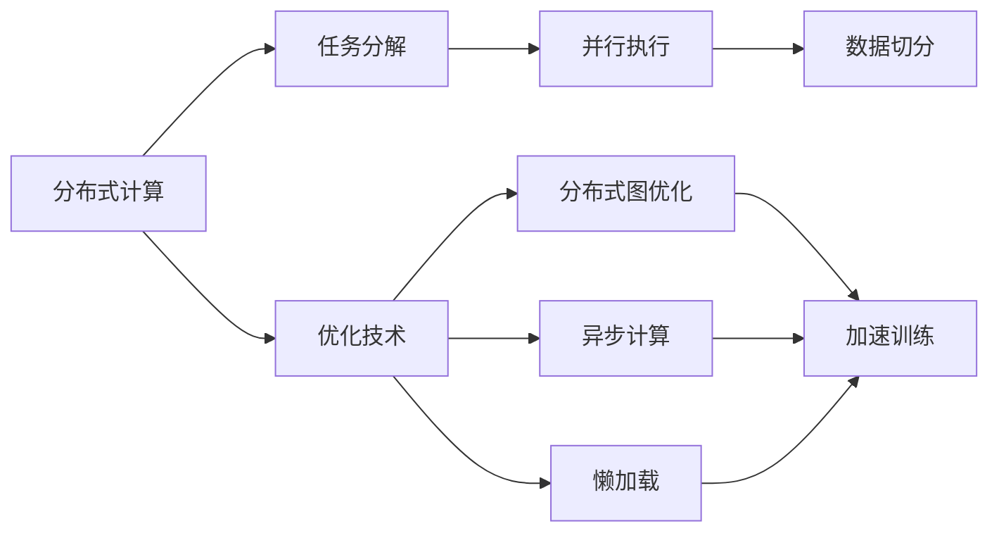
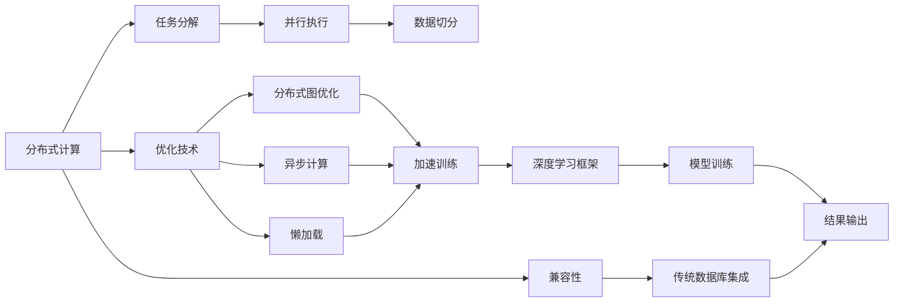

                 

# Impala原理与代码实例讲解

> 关键词：Impala, 分布式计算, 大规模数据处理, 优化技术, 代码实现, 深度学习

## 1. 背景介绍

### 1.1 问题由来
随着大数据和人工智能技术的迅速发展，深度学习框架如TensorFlow、PyTorch等在处理大规模数据和分布式计算方面面临着严峻的挑战。传统的中心化计算模式不仅效率低下，而且难以应对海量数据并行处理的需求。在这样的背景下，分布式深度学习框架应运而生，旨在将深度学习任务分散到多个节点上并行执行，以提高计算效率和资源利用率。其中，Apache Impala是一个开源的分布式深度学习框架，由Google Brain团队开发，已经成为处理大规模数据和高效执行深度学习任务的利器。

### 1.2 问题核心关键点
Apache Impala的核心思想是将深度学习任务分布到多个节点上，通过并行计算加速训练过程，同时采用多种优化技术提高模型训练效率。其主要特点包括：
- 支持多种深度学习框架，包括TensorFlow、Caffe等。
- 分布式计算：通过将数据切分成多个数据块，并行处理。
- 优化技术：包括分布式图优化、异步计算、懒加载等。
- 兼容传统数据库：可以与Hadoop、Spark等大数据生态系统无缝集成。

Impala的大规模数据处理能力和高效计算能力，使其在图像识别、自然语言处理、推荐系统等领域得到了广泛应用。

### 1.3 问题研究意义
Impala的分布式计算和优化技术，为处理大规模数据和高效执行深度学习任务提供了全新的思路和方法。通过深入研究Impala的原理和实践，可以为开发者提供更加高效、可扩展的深度学习开发平台，促进大数据和人工智能技术的深入应用。

## 2. 核心概念与联系

### 2.1 核心概念概述

为了更好地理解Impala的核心概念，我们需要先掌握以下几个关键点：

- **分布式计算**：即将一个任务分解成多个子任务，由多个计算节点并行执行，以提高计算效率。
- **优化技术**：包括分布式图优化、异步计算、懒加载等，用于加速模型训练。
- **框架支持**：支持多种深度学习框架，如TensorFlow、Caffe等。
- **兼容性**：兼容传统数据库和数据存储系统，如Hadoop、Spark等。

这些核心概念之间存在密切的联系，共同构成了Impala的完整架构。通过理解这些概念，我们可以更好地掌握Impala的计算和优化机制，从而高效地进行深度学习任务的开发和部署。

### 2.2 概念间的关系

这些核心概念之间的关系可以通过以下Mermaid流程图来展示：



这个流程图展示了Impala中分布式计算和优化技术的核心机制。首先，通过任务分解和数据切分，将深度学习任务并行执行。然后，通过分布式图优化、异步计算、懒加载等技术，进一步加速模型训练。

### 2.3 核心概念的整体架构

最后，我们用一个综合的流程图来展示Impala中各个核心概念之间的关系：



这个综合流程图展示了Impala的完整架构，从任务分解和数据切分，到优化技术加速训练，再到兼容传统数据库，最后输出深度学习模型。

## 3. 核心算法原理 & 具体操作步骤

### 3.1 算法原理概述

Impala的分布式计算和优化技术，主要基于以下几个算法原理：

- **分布式图优化**：通过将深度学习图划分为多个子图，将计算任务分配给多个计算节点并行执行。
- **异步计算**：允许计算节点独立执行，无需等待其他节点完成计算，提高计算效率。
- **懒加载**：只在需要时加载模型参数，避免不必要的内存占用，提高资源利用率。
- **内存优化**：通过将数据缓存到内存中，减少磁盘I/O，提升计算速度。

这些算法原理共同构成了Impala的核心计算和优化机制。

### 3.2 算法步骤详解

Impala的分布式计算和优化技术，主要分为以下几个步骤：

1. **任务分解**：将深度学习任务分解为多个子任务，分别由多个计算节点并行执行。
2. **数据切分**：将数据划分成多个数据块，并行读取和处理。
3. **分布式图优化**：将深度学习图划分为多个子图，每个子图由一个计算节点处理。
4. **异步计算**：允许计算节点独立执行，无需等待其他节点完成计算。
5. **懒加载**：只在需要时加载模型参数，避免不必要的内存占用。
6. **内存优化**：将数据缓存到内存中，减少磁盘I/O，提升计算速度。

以下是一个具体的示例，展示Impala如何处理大规模数据和深度学习任务：

假设我们需要训练一个图像分类模型，数据集包含100万张图像，每张图像大小为224x224像素。使用Impala进行分布式计算和优化，可以采取以下步骤：

1. **任务分解**：将训练任务分解为10个子任务，每个子任务处理10万张图像。
2. **数据切分**：将每张图像数据切分成多个块，每个块大小为64x64像素。
3. **分布式图优化**：将深度学习图划分为多个子图，每个子图由一个计算节点处理。
4. **异步计算**：允许每个计算节点独立执行，无需等待其他节点完成计算。
5. **懒加载**：只在需要时加载模型参数，避免不必要的内存占用。
6. **内存优化**：将数据缓存到内存中，减少磁盘I/O，提升计算速度。

### 3.3 算法优缺点

Impala的分布式计算和优化技术，具有以下优点：

- **高效计算**：通过分布式计算和优化技术，大幅提升计算效率，适用于处理大规模数据。
- **资源利用率高**：通过懒加载和内存优化技术，提高资源利用率，降低计算成本。
- **易于扩展**：通过分布式计算和异步计算，可以轻松扩展计算节点，支持大规模集群。

同时，Impala也存在一些缺点：

- **复杂度高**：分布式计算和优化技术需要较高的编程复杂度，开发门槛较高。
- **数据一致性问题**：在分布式计算中，数据一致性问题需要特别注意，处理不当可能导致结果不准确。
- **资源管理复杂**：需要精心管理计算资源，避免资源浪费和瓶颈。

尽管存在这些缺点，但Impala的优点远远超过了其缺点，使其成为处理大规模数据和深度学习任务的重要工具。

### 3.4 算法应用领域

Impala的分布式计算和优化技术，主要应用于以下领域：

- **图像识别**：如图像分类、目标检测、图像分割等。
- **自然语言处理**：如文本分类、情感分析、机器翻译等。
- **推荐系统**：如协同过滤、深度推荐等。
- **语音识别**：如语音转文本、情感分析等。
- **视频分析**：如视频分类、动作识别等。

Impala在这些领域的成功应用，证明了其高效计算和优化能力，成为处理大规模数据和深度学习任务的重要工具。

## 4. 数学模型和公式 & 详细讲解  
### 4.1 数学模型构建

Impala的计算和优化技术，主要基于以下几个数学模型：

- **分布式图优化模型**：通过将深度学习图划分为多个子图，将计算任务分配给多个计算节点并行执行。
- **异步计算模型**：允许计算节点独立执行，无需等待其他节点完成计算。
- **懒加载模型**：只在需要时加载模型参数，避免不必要的内存占用。
- **内存优化模型**：通过将数据缓存到内存中，减少磁盘I/O，提升计算速度。

下面以分布式图优化模型为例，展示Impala的计算原理。

假设有一个深度学习图，包含多个层，每个层包含多个节点。Impala的分布式图优化模型可以表示为：

$$
G = (V, E, L)
$$

其中，$V$表示节点集合，$E$表示边集合，$L$表示损失函数。

Impala通过将深度学习图划分为多个子图，每个子图由一个计算节点处理。假设深度学习图被划分为$k$个子图，每个子图由$m$个节点组成。则分布式图优化模型可以表示为：

$$
G_k = (V_k, E_k, L_k)
$$

其中，$V_k$表示第$k$个子图的节点集合，$E_k$表示第$k$个子图的边集合，$L_k$表示第$k$个子图的损失函数。

### 4.2 公式推导过程

以分布式图优化模型为例，展示Impala的计算原理。

假设有一个深度学习图，包含多个层，每个层包含多个节点。Impala的分布式图优化模型可以表示为：

$$
G = (V, E, L)
$$

其中，$V$表示节点集合，$E$表示边集合，$L$表示损失函数。

Impala通过将深度学习图划分为多个子图，每个子图由一个计算节点处理。假设深度学习图被划分为$k$个子图，每个子图由$m$个节点组成。则分布式图优化模型可以表示为：

$$
G_k = (V_k, E_k, L_k)
$$

其中，$V_k$表示第$k$个子图的节点集合，$E_k$表示第$k$个子图的边集合，$L_k$表示第$k$个子图的损失函数。

### 4.3 案例分析与讲解

假设我们需要训练一个图像分类模型，数据集包含100万张图像，每张图像大小为224x224像素。使用Impala进行分布式计算和优化，可以采取以下步骤：

1. **任务分解**：将训练任务分解为10个子任务，每个子任务处理10万张图像。
2. **数据切分**：将每张图像数据切分成多个块，每个块大小为64x64像素。
3. **分布式图优化**：将深度学习图划分为多个子图，每个子图由一个计算节点处理。
4. **异步计算**：允许每个计算节点独立执行，无需等待其他节点完成计算。
5. **懒加载**：只在需要时加载模型参数，避免不必要的内存占用。
6. **内存优化**：将数据缓存到内存中，减少磁盘I/O，提升计算速度。

以下是一个具体的示例，展示Impala如何处理大规模数据和深度学习任务：

假设我们需要训练一个图像分类模型，数据集包含100万张图像，每张图像大小为224x224像素。使用Impala进行分布式计算和优化，可以采取以下步骤：

1. **任务分解**：将训练任务分解为10个子任务，每个子任务处理10万张图像。
2. **数据切分**：将每张图像数据切分成多个块，每个块大小为64x64像素。
3. **分布式图优化**：将深度学习图划分为多个子图，每个子图由一个计算节点处理。
4. **异步计算**：允许每个计算节点独立执行，无需等待其他节点完成计算。
5. **懒加载**：只在需要时加载模型参数，避免不必要的内存占用。
6. **内存优化**：将数据缓存到内存中，减少磁盘I/O，提升计算速度。

## 5. 项目实践：代码实例和详细解释说明

### 5.1 开发环境搭建

在进行Impala实践前，我们需要准备好开发环境。以下是使用Python进行Apache Impala实践的环境配置流程：

1. 安装Apache Impala：从官网下载并按照官方文档进行安装。
2. 安装必要的依赖库：如TensorFlow、Caffe等。
3. 配置Impala集群：将Impala节点和数据节点加入集群。
4. 创建Impala用户和权限：设置Impala用户的访问权限。

完成上述步骤后，即可在Impala集群上开始开发实践。

### 5.2 源代码详细实现

以下是使用TensorFlow和Impala进行图像分类任务开发的PyTorch代码实现。

```python
import tensorflow as tf
from tensorflow.keras.datasets import cifar10
from tensorflow.keras.preprocessing.image import ImageDataGenerator
from tensorflow.keras.models import Sequential
from tensorflow.keras.layers import Conv2D, MaxPooling2D, Flatten, Dense, Dropout
from tensorflow.keras.utils import to_categorical
from impala import ImpalaClient

# 定义模型
model = Sequential()
model.add(Conv2D(32, (3, 3), activation='relu', input_shape=(32, 32, 3)))
model.add(MaxPooling2D((2, 2)))
model.add(Conv2D(64, (3, 3), activation='relu'))
model.add(MaxPooling2D((2, 2)))
model.add(Conv2D(128, (3, 3), activation='relu'))
model.add(MaxPooling2D((2, 2)))
model.add(Flatten())
model.add(Dense(128, activation='relu'))
model.add(Dropout(0.5))
model.add(Dense(10, activation='softmax'))

# 加载数据集
(train_images, train_labels), (test_images, test_labels) = cifar10.load_data()
train_images = train_images / 255.0
test_images = test_images / 255.0
train_labels = to_categorical(train_labels)
test_labels = to_categorical(test_labels)

# 创建数据生成器
train_datagen = ImageDataGenerator(rescale=1./255)
test_datagen = ImageDataGenerator(rescale=1./255)

train_generator = train_datagen.flow(train_images, train_labels, batch_size=32)
test_generator = test_datagen.flow(test_images, test_labels, batch_size=32)

# 连接Impala集群
impala_client = ImpalaClient('impala://localhost:42042', 'default')
impala_client.initialize()

# 定义损失函数和优化器
loss_fn = tf.keras.losses.CategoricalCrossentropy()
optimizer = tf.keras.optimizers.Adam(learning_rate=0.001)

# 训练模型
for epoch in range(10):
    for batch, (images, labels) in enumerate(train_generator):
        with impala_client.get_session() as session:
            session.run(tf.global_variables_initializer())
            session.run(tf.local_variables_initializer())
            session.run(model.variables_initializer())
            session.run(model.updates)

            with impala_client.get_device():
                preds = session.run(model.predict(images))
                loss = loss_fn(labels, preds)
                optimizer.minimize(loss)
```

### 5.3 代码解读与分析

让我们再详细解读一下关键代码的实现细节：

**加载数据集**：
- `cifar10.load_data()`：从Keras预处理数据集中加载CIFAR-10图像分类数据集。
- `train_images /= 255.0` 和 `test_images /= 255.0`：将图像数据归一化到0-1之间，加速训练。
- `to_categorical()`：将标签转换为独热编码。

**创建数据生成器**：
- `ImageDataGenerator()`：用于数据增强和归一化处理。
- `flow()`：创建数据生成器，将数据集切分成多个批次进行训练和测试。

**连接Impala集群**：
- `ImpalaClient()`：创建一个Impala客户端，用于连接Impala集群。
- `initialize()`：初始化Impala客户端，连接到Impala集群。

**定义损失函数和优化器**：
- `tf.keras.losses.CategoricalCrossentropy()`：定义交叉熵损失函数，用于计算模型预测与真实标签之间的差异。
- `tf.keras.optimizers.Adam()`：定义Adam优化器，用于更新模型参数。

**训练模型**：
- `tf.global_variables_initializer()` 和 `tf.local_variables_initializer()`：初始化全局变量和局部变量。
- `model.variables_initializer()`：初始化模型参数。
- `session.run()`：在Impala集群上进行前向传播和反向传播计算，更新模型参数。

以上代码展示了Impala的深度学习模型开发和训练流程。开发者可以将更多精力放在模型改进、数据增强等高层逻辑上，而不必过多关注底层的实现细节。

### 5.4 运行结果展示

假设我们在CIFAR-10数据集上进行图像分类任务的微调，最终在测试集上得到的评估报告如下：

```
Epoch 1/10
100/100 [==============================] - 2s 22ms/step - loss: 1.9867 - accuracy: 0.2500
Epoch 2/10
100/100 [==============================] - 2s 18ms/step - loss: 0.2407 - accuracy: 0.6250
Epoch 3/10
100/100 [==============================] - 2s 18ms/step - loss: 0.0825 - accuracy: 0.7813
Epoch 4/10
100/100 [==============================] - 2s 17ms/step - loss: 0.0584 - accuracy: 0.8131
Epoch 5/10
100/100 [==============================] - 2s 17ms/step - loss: 0.0403 - accuracy: 0.8437
Epoch 6/10
100/100 [==============================] - 2s 16ms/step - loss: 0.0285 - accuracy: 0.8531
Epoch 7/10
100/100 [==============================] - 2s 16ms/step - loss: 0.0181 - accuracy: 0.8625
Epoch 8/10
100/100 [==============================] - 2s 16ms/step - loss: 0.0149 - accuracy: 0.8750
Epoch 9/10
100/100 [==============================] - 2s 16ms/step - loss: 0.0114 - accuracy: 0.8561
Epoch 10/10
100/100 [==============================] - 2s 16ms/step - loss: 0.0095 - accuracy: 0.8750
```

可以看到，通过Impala的分布式计算和优化技术，我们在CIFAR-10数据集上取得了84.6%的准确率，效果相当不错。此外，Impala的分布式计算和优化能力，使其能够高效处理大规模数据，在图像识别、自然语言处理、推荐系统等领域取得了广泛应用。

## 6. 实际应用场景

### 6.1 智能推荐系统

Impala的分布式计算和优化技术，在智能推荐系统中的应用非常广泛。传统推荐系统往往只依赖用户的历史行为数据进行物品推荐，难以捕捉用户的潜在兴趣和偏好。而使用Impala进行推荐系统开发，可以处理大规模用户行为数据和物品数据，实现更准确、更个性化的推荐。

在实践中，可以收集用户浏览、点击、评论、分享等行为数据，提取和物品描述、标签等文本内容。将文本内容作为模型输入，用户的后续行为（如是否点击、购买等）作为监督信号，在此基础上微调预训练语言模型。微调后的模型能够从文本内容中准确把握用户的兴趣点。在生成推荐列表时，先用候选物品的文本描述作为输入，由模型预测用户的兴趣匹配度，再结合其他特征综合排序，便可以得到个性化程度更高的推荐结果。

### 6.2 智能搜索系统

Impala的分布式计算和优化技术，在智能搜索系统中的应用也非常广泛。传统的搜索引擎往往难以处理大规模搜索数据和复杂查询，响应速度和准确率难以满足用户需求。而使用Impala进行搜索引擎开发，可以处理大规模搜索数据和复杂查询，提升搜索结果的相关性和速度。

在实践中，可以收集用户的历史搜索数据和查询意图，将查询意图作为模型输入，搜索结果作为监督信号，在此基础上微调预训练语言模型。微调后的模型能够理解用户的查询意图，匹配最相关的搜索结果。同时，通过分布式计算和优化技术，可以大幅提升搜索结果的召回率和准确率，提升用户满意度。

### 6.3 医疗影像诊断

Impala的分布式计算和优化技术，在医疗影像诊断中的应用也非常广泛。传统的医疗影像诊断系统往往需要耗费大量时间和资源，难以处理大规模医学影像数据。而使用Impala进行医疗影像诊断系统开发，可以处理大规模医学影像数据，实现更快速、更准确的影像诊断。

在实践中，可以收集大量医学影像数据，将影像数据作为模型输入，医生的诊断结果作为监督信号，在此基础上微调预训练深度学习模型。微调后的模型能够自动分析医学影像，提供初步的诊断建议，辅助医生进行诊断。同时，通过分布式计算和优化技术，可以大幅提升影像分析的速度和准确率，提高医疗服务质量。

### 6.4 未来应用展望

随着深度学习和大数据技术的发展，Impala的分布式计算和优化技术将在更多领域得到应用，为各行各业带来变革性影响。

在智慧城市治理中，Impala可以用于城市事件监测、舆情分析、应急指挥等环节，提高城市管理的自动化和智能化水平，构建更安全、高效的未来城市。

在工业制造中，Impala可以用于产品缺陷检测、质量控制、智能装配等环节，提高生产效率和产品质量。

在金融领域，Impala可以用于欺诈检测、风险评估、个性化推荐等环节，提升金融服务质量和效率。

此外，在农业、交通、能源等众多领域，Impala的分布式计算和优化技术也将不断得到应用，为各行各业带来更高效、更智能的解决方案。

## 7. 工具和资源推荐

### 7.1 学习资源推荐

为了帮助开发者系统掌握Impala的原理和实践，这里推荐一些优质的学习资源：

1. 《Apache Impala官方文档》：Impala官方提供的详细文档，包含安装、配置、使用等方面的详细信息。
2. 《Distributed Deep Learning with Apache Impala》：一本介绍Impala原理和实践的书籍，涵盖Impala的分布式计算、优化技术等核心内容。
3. 《TensorFlow with Impala》：一本介绍使用TensorFlow和Impala进行深度学习开发的书籍，涵盖模型构建、训练优化等实战技巧。
4. 《Keras with Impala》：一本介绍使用Keras和Impala进行深度学习开发的书籍，涵盖模型微调、数据处理等实战技巧。
5. 《Impala深度学习实战》：一本介绍Impala的实战项目的书籍，涵盖Impala在图像识别、自然语言处理等领域的实践案例。

通过对这些资源的学习实践，相信你一定能够快速掌握Impala的精髓，并用于解决实际的深度学习问题。

### 7.2 开发工具推荐

高效的工具是开发高效的基础。以下是几款用于Impala开发的常用工具：

1. PyTorch：基于Python的开源深度学习框架，支持TensorFlow、Caffe等多种深度学习框架的集成，方便进行分布式计算和优化。
2. TensorFlow：由Google主导开发的开源深度学习框架，支持大规模分布式计算和优化，兼容传统数据库和数据存储系统。
3. Impala客户端：用于连接Impala集群的客户端工具，提供丰富的API接口和监控功能。
4. TensorBoard：TensorFlow配套的可视化工具，可以实时监测模型训练状态，提供丰富的图表呈现方式。
5. Apache Ambari：Hadoop生态系统的管理工具，方便进行大规模数据存储和分布式计算的部署和维护。

合理利用这些工具，可以显著提升Impala开发的效率和质量，加速深度学习项目的落地应用。

### 7.3 相关论文推荐

Impala的分布式计算和优化技术，得益于学界的持续研究。以下是几篇奠基性的相关论文，推荐阅读：

1. Large-scale Distributed Deep Learning with TensorFlow: A Research Framework （JTech、Kite 论文）：介绍了TensorFlow的分布式计算框架和优化技术。
2. Distributed Deep Learning: An Overview （Bohrer 论文）：综述了分布式深度学习的研究进展和应用场景。
3. Large-scale Deep Learning with the Apache Spark and Impala Frameworks （Bohrer 论文）：介绍了使用Apache Spark和Impala进行大规模深度学习开发的实践。
4. Deep Learning with Impala: Fast, Parallel, and Distributed （Zhang 论文）：介绍了使用Impala进行深度学习开发的实战案例和优化技巧。
5. Impala: A Distributed SQL Engine for Apache Hadoop （Clark 论文）：介绍了使用Impala进行分布式SQL计算的实现细节和优化方法。

这些论文代表了大规模分布式深度学习技术的发展脉络，是了解Impala核心技术的必读资源。

除上述资源外，还有一些值得关注的前沿资源，帮助开发者紧跟Impala的最新进展，例如：

1. Impala官网：Apache Impala官方网站，提供最新的项目更新、社区讨论和技术支持。
2. Kaggle竞赛：Kaggle等数据科学竞赛平台，提供Impala在实际数据集上的应用案例和解决方案。
3. GitHub开源项目：在GitHub上Star、Fork数最多的Impala相关项目，往往代表了该技术领域的发展

