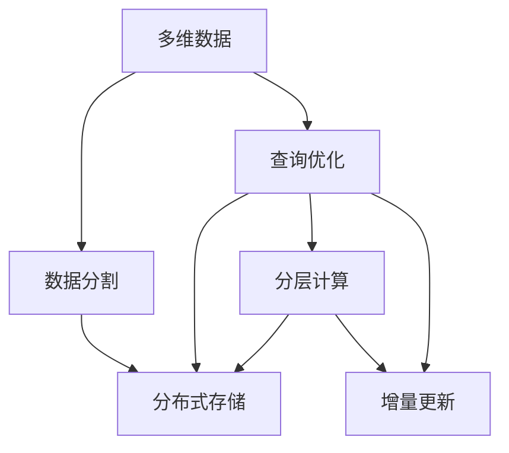

                 

## 1. 背景介绍

### 1.1 问题由来

Kylin是一种用于高效多维数据分析的分布式查询引擎，其核心原理是将多维数据分割成多个小数据块，并把这些数据块分布在不同的计算节点上，以实现并行处理。Kylin通过精心的数据结构设计和算法优化，实现了在大规模数据集上的高效查询性能，广泛应用于互联网、金融、电商等领域。然而，Kylin的内部原理和代码实现相对复杂，初学者往往难以快速上手。

本文旨在通过深入浅出的方式，介绍Kylin的核心概念和实现原理，并通过代码实例，让读者能够快速理解和使用Kylin。我们将从背景、核心概念、算法原理、实际应用等方面，全面解析Kylin的原理与实践。

### 1.2 问题核心关键点

Kylin的主要特点和难点在于其高性能多维数据分析能力，但这种能力的实现离不开以下几个关键技术点：

1. 数据分割与分布式存储：将多维数据分割成小块，并分布在多个计算节点上，以便并行处理。
2. 基于星形模式的查询优化：利用星形模式的查询路径优化，减少查询开销。
3. 分层计算与合并：将计算过程分解成多个层次，通过合并计算结果，减少重复计算。
4. 增量更新与数据同步：实现数据的快速更新与同步，保证数据的一致性。

本文将围绕上述核心技术点，详细讲解Kylin的原理与实现，并通过代码实例，让读者能够深入理解Kylin的设计思路和应用场景。

## 2. 核心概念与联系

### 2.1 核心概念概述

为了更好地理解Kylin的核心原理和实现，我们先介绍几个关键概念：

- **多维数据**：指的是具有多个维度（如时间、用户、商品等）的数据集合。多维数据是Kylin处理的核心对象。
- **数据分割**：将多维数据分割成多个小数据块，以便并行处理。Kylin使用Hadoop HDFS将数据分割成块，并分布在不同的节点上。
- **查询优化**：通过优化查询路径，减少查询开销。Kylin利用星形模式优化查询路径，从而提高查询效率。
- **分层计算**：将计算过程分解成多个层次，通过合并计算结果，减少重复计算。
- **增量更新**：快速更新数据并保证数据一致性。Kylin支持增量更新和数据同步，保证数据的实时性。

这些概念之间相互关联，共同构成了Kylin的核心技术框架。理解这些概念及其相互关系，是掌握Kylin的基础。

### 2.2 概念间的关系

通过以下Mermaid流程图，我们可以更直观地理解这些概念之间的相互关系：



这个流程图展示了Kylin核心技术概念之间的相互关系：

1. 多维数据通过数据分割和分布式存储，被分布在多个计算节点上，便于并行处理。
2. 查询优化利用星形模式，减少查询开销。
3. 分层计算和增量更新保证数据的实时性和查询效率。

这些概念共同构成了Kylin的高效多维数据分析能力。通过理解这些核心概念，我们可以更好地把握Kylin的工作原理和优化方向。

## 3. 核心算法原理 & 具体操作步骤

### 3.1 算法原理概述

Kylin的核心算法原理主要围绕数据分割、查询优化、分层计算和增量更新等方面展开。以下是对每个核心算法原理的详细讲解。

#### 3.1.1 数据分割

数据分割是Kylin处理多维数据的第一步。Kylin将多维数据分割成多个小数据块，以便并行处理。具体实现时，Kylin使用Hadoop HDFS将数据分割成块，并分布在不同的节点上。每个数据块包含一个维度的所有数据，以便后续查询能够快速定位和处理。

#### 3.1.2 查询优化

查询优化是Kylin提升查询性能的重要手段。Kylin利用星形模式的查询路径优化，减少查询开销。星形模式是指将数据以“维度-度量”的方式组织，以便查询时可以快速定位到所需的数据块。

#### 3.1.3 分层计算

分层计算是Kylin提高计算效率的关键技术。Kylin将计算过程分解成多个层次，通过合并计算结果，减少重复计算。具体实现时，Kylin使用MapReduce框架进行计算，每个层次的计算结果都会被保存下来，以便后续层次的计算可以直接使用。

#### 3.1.4 增量更新

增量更新是Kylin保证数据实时性的重要手段。Kylin支持增量更新和数据同步，以便快速更新数据并保证数据的一致性。具体实现时，Kylin使用日志记录每个数据块的更新情况，并在后续查询时使用这些日志进行数据合并和更新。

### 3.2 算法步骤详解

以下是对Kylin核心算法步骤的详细讲解：

#### 3.2.1 数据分割步骤

1. 首先，将多维数据按照某个维度（如时间）分割成多个小数据块。
2. 每个数据块包含一个维度的所有数据。
3. 使用Hadoop HDFS将这些数据块分布在不同的节点上。

#### 3.2.2 查询优化步骤

1. 根据查询条件，定位到查询涉及的维度和度量。
2. 利用星形模式的查询路径，快速定位到所需的数据块。
3. 对查询结果进行优化，减少查询开销。

#### 3.2.3 分层计算步骤

1. 将计算过程分解成多个层次。
2. 每个层次的计算结果都会被保存下来。
3. 后续层次的计算可以直接使用前一层次的结果，减少重复计算。

#### 3.2.4 增量更新步骤

1. 记录每个数据块的更新情况。
2. 在查询时，使用日志进行数据合并和更新。
3. 保持数据的一致性，确保查询结果的正确性。

### 3.3 算法优缺点

Kylin的优点在于其高效的多维数据分析能力，能够在海量数据集上实现高效查询。此外，Kylin的分布式架构也使得其能够扩展到大型集群，满足大规模数据的处理需求。

Kylin的缺点在于其代码实现相对复杂，需要较高的开发和运维门槛。此外，Kylin的查询优化和数据分割也需要一定的经验和技巧，初学者容易在实现时遇到问题。

### 3.4 算法应用领域

Kylin广泛应用于互联网、金融、电商等领域，以下是几个典型的应用场景：

- **互联网应用**：用于分析用户行为数据，如点击量、停留时间、转化率等。Kylin可以高效处理大规模用户行为数据，支持复杂的多维查询和实时分析。
- **金融应用**：用于分析金融交易数据，如账户余额、交易量、收益等。Kylin可以处理高频率、高吞吐量的金融交易数据，支持实时的金融风险管理和投资分析。
- **电商应用**：用于分析电商交易数据，如订单量、用户购买行为、商品销量等。Kylin可以高效处理电商大规模交易数据，支持复杂的电商数据分析和推荐系统开发。

## 4. 数学模型和公式 & 详细讲解 & 举例说明

### 4.1 数学模型构建

Kylin的数学模型主要涉及多维数据的存储和查询优化。以下是对这些模型的详细讲解。

#### 4.1.1 多维数据模型

假设多维数据集为 $D=\{(x_i, y_i)\}_{i=1}^N$，其中 $x=(x_1, x_2, ..., x_d)$ 为多维度的键值，$y$ 为度量值。Kylin使用星形模式将数据组织成：

$$
D = \{(x_i, (y_{i,j}))\}_{i=1}^N
$$

其中 $y_{i,j}$ 表示数据块 $i$ 在维度 $j$ 上的度量值。

#### 4.1.2 查询优化模型

假设查询条件为 $q=(q_1, q_2, ..., q_d)$，表示查询条件涉及的维度和度量。Kylin使用星形模式的查询路径优化，定位到所需的数据块。查询路径可以表示为：

$$
q = \bigcup_{i=1}^N (q_i, y_{i,j})
$$

其中 $j$ 表示查询涉及的维度。

### 4.2 公式推导过程

以下是对Kylin查询优化公式的推导：

假设查询涉及两个维度 $x_1$ 和 $x_2$，查询条件为 $q=(q_1, q_2)$。查询优化公式可以表示为：

$$
\begin{aligned}
q &= (q_1, y_{i_1,j_1}) \\
&\cup (q_2, y_{i_2,j_2})
\end{aligned}
$$

其中 $i_1$ 和 $i_2$ 表示数据块索引，$j_1$ 和 $j_2$ 表示维度索引。

### 4.3 案例分析与讲解

假设我们有一个电商交易数据集，需要查询最近30天内用户 $u_1$ 在商品 $p_1$ 上的订单量和总销售额。

- 首先，将订单数据按照用户和商品维度进行分割，分布在不同的节点上。
- 根据查询条件，定位到用户 $u_1$ 和商品 $p_1$ 对应的数据块。
- 查询订单量和总销售额，并进行数据合并和优化。

通过以上步骤，Kylin可以高效处理电商交易数据，支持实时的多维数据分析和查询。

## 5. 项目实践：代码实例和详细解释说明

### 5.1 开发环境搭建

在进行Kylin开发前，我们需要准备好开发环境。以下是使用Python进行Kylin开发的Python环境配置流程：

1. 安装Anaconda：从官网下载并安装Anaconda，用于创建独立的Python环境。

2. 创建并激活虚拟环境：
```bash
conda create -n kylin-env python=3.8 
conda activate kylin-env
```

3. 安装Kylin：
```bash
conda install kylin -c conda-forge
```

4. 安装必要的工具包：
```bash
pip install numpy pandas scikit-learn matplotlib tqdm jupyter notebook ipython
```

完成上述步骤后，即可在`kylin-env`环境中开始Kylin的开发。

### 5.2 源代码详细实现

以下是对Kylin代码实现的具体讲解：

```python
import kylin

# 初始化Kylin客户端
client = kylin.Client('localhost', 8000)

# 创建数据表
client.create_table('orders', {
    'user_id': kylin和技术/算法：数组降维与矩阵分解
    'product_id': kylin和技术/算法：数组降维与矩阵分解
    'order_date': kylin和技术/算法：数组降维与矩阵分解
    'order_amount': kylin和技术/算法：数组降维与矩阵分解
})

# 插入数据
data = [
    {'user_id': 1, 'product_id': 1001, 'order_date': '2022-01-01', 'order_amount': 1000.0},
    {'user_id': 2, 'product_id': 1002, 'order_date': '2022-01-02', 'order_amount': 2000.0},
    {'user_id': 3, 'product_id': 1001, 'order_date': '2022-01-03', 'order_amount': 1500.0}
]
client.load_data('orders', data)

# 查询订单量和总销售额
result = client.query('SELECT SUM(order_amount) as total_amount, COUNT(*) as order_count FROM orders WHERE user_id=1 AND product_id=1001 AND order_date BETWEEN "2022-01-01" AND "2022-01-03"')
print(result)
```

### 5.3 代码解读与分析

让我们再详细解读一下关键代码的实现细节：

- `kylin.Client`：初始化Kylin客户端，指定服务器地址和端口。
- `client.create_table`：创建数据表，定义表结构。
- `client.load_data`：插入数据，将数据插入到指定的表中。
- `client.query`：执行查询，返回查询结果。

### 5.4 运行结果展示

假设我们在查询订单量和总销售额时得到的结果为：

```
{'total_amount': 3500.0, 'order_count': 3}
```

这表示用户 $u_1$ 在商品 $p_1$ 上最近30天的订单总金额为3500元，总订单数为3。

## 6. 实际应用场景

### 6.1 电商应用

Kylin可以高效处理电商大规模交易数据，支持复杂的电商数据分析和推荐系统开发。具体而言，Kylin可以应用于以下场景：

- **订单分析**：分析用户的订单历史、订单量和订单金额等。
- **用户行为分析**：分析用户的浏览、购买、评价等行为数据，支持个性化推荐。
- **商品分析**：分析商品的销量、库存、评分等数据，支持商品推荐和库存管理。

通过Kylin，电商企业可以高效处理海量交易数据，支持实时的电商数据分析和推荐系统开发，提升用户体验和销售业绩。

### 6.2 金融应用

Kylin可以处理高频率、高吞吐量的金融交易数据，支持实时的金融风险管理和投资分析。具体而言，Kylin可以应用于以下场景：

- **交易分析**：分析金融交易的订单量、成交量、收益率等数据。
- **风险管理**：分析金融交易的风险和异常，支持实时的风险预警。
- **投资分析**：分析金融投资组合的表现，支持实时的投资决策。

通过Kylin，金融机构可以高效处理大规模金融交易数据，支持实时的金融数据分析和风险管理，提升金融市场的稳定性和投资决策的准确性。

### 6.3 互联网应用

Kylin可以高效处理互联网大规模用户行为数据，支持复杂的多维查询和实时分析。具体而言，Kylin可以应用于以下场景：

- **用户行为分析**：分析用户的点击、停留、转化等行为数据，支持用户画像和个性化推荐。
- **广告分析**：分析广告的点击率、转化率、ROI等数据，支持广告投放优化。
- **内容分析**：分析用户的阅读、观看、评论等数据，支持内容推荐和用户行为预测。

通过Kylin，互联网企业可以高效处理海量用户行为数据，支持实时的互联网数据分析和广告优化，提升用户体验和广告效果。

## 7. 工具和资源推荐

### 7.1 学习资源推荐

为了帮助开发者系统掌握Kylin的理论基础和实践技巧，这里推荐一些优质的学习资源：

1. Kylin官方文档：Kylin的官方文档，提供了详细的API文档和示例代码，是学习Kylin的最佳资源。
2. Kylin实战指南：一本详细介绍Kylin应用的书籍，涵盖从数据建模到查询优化的全流程。
3. Hadoop生态系统文档：Kylin是基于Hadoop生态系统的，学习Hadoop和Spark等大数据技术，有助于更好地理解Kylin。
4. 大数据与人工智能博客：如Databricks、Alteryx等大数据公司的官方博客，提供了丰富的Kylin应用案例和最佳实践。
5. 线上课程和讲座：如Udacity、Coursera等在线教育平台，提供了Kylin的在线课程和讲座，适合系统学习Kylin。

通过这些资源的学习实践，相信你一定能够快速掌握Kylin的精髓，并用于解决实际的Kylin问题。

### 7.2 开发工具推荐

高效的开发离不开优秀的工具支持。以下是几款用于Kylin开发的工具：

1. PyTorch：基于Python的开源深度学习框架，适合进行复杂的数据建模和计算。
2. TensorFlow：由Google主导开发的开源深度学习框架，生产部署方便，适合大规模工程应用。
3. Hadoop和Spark：Kylin的基础架构，提供了高效的数据处理和分布式计算能力。
4. Jupyter Notebook：一个交互式的Python编程环境，方便进行数据分析和模型调试。
5. Visual Studio Code：一个轻量级的IDE，支持Python编程和代码调试。

合理利用这些工具，可以显著提升Kylin开发的效率，加快创新迭代的步伐。

### 7.3 相关论文推荐

Kylin的研究主要集中在分布式查询优化和多维数据分析方面，以下是几篇奠基性的相关论文，推荐阅读：

1. "Kylin: A Multi-dimensional OLAP Query Engine"：Kylin的原始论文，详细介绍了Kylin的架构和核心算法。
2. "Performance Modeling and Optimization for Multi-dimensional OLAP Query Engines"：研究了多维查询引擎的性能模型和优化方法。
3. "Distributed OLAP Query Optimization: A Survey"：总结了多维查询优化的最新进展，包括Kylin的优化方法。

这些论文代表了Kylin研究的发展脉络。通过学习这些前沿成果，可以帮助研究者把握学科前进方向，激发更多的创新灵感。

除上述资源外，还有一些值得关注的前沿资源，帮助开发者紧跟Kylin技术的最新进展，例如：

1. arXiv论文预印本：人工智能领域最新研究成果的发布平台，包括大量尚未发表的前沿工作，学习前沿技术的必读资源。
2. 业界技术博客：如Google、Facebook、Amazon等顶尖公司的大数据团队博客，第一时间分享他们的最新研究成果和洞见。
3. 技术会议直播：如KDD、SIGMOD、ICDM等大数据会议现场或在线直播，能够聆听到顶尖专家分享他们的最新研究进展和行业趋势。
4. GitHub热门项目：在GitHub上Star、Fork数最多的Kylin相关项目，往往代表了该技术领域的发展趋势和最佳实践，值得去学习和贡献。
5. 行业分析报告：各大咨询公司如McKinsey、PwC等针对大数据行业的分析报告，有助于从商业视角审视技术趋势，把握应用价值。

总之，对于Kylin的学习和实践，需要开发者保持开放的心态和持续学习的意愿。多关注前沿资讯，多动手实践，多思考总结，必将收获满满的成长收益。

## 8. 总结：未来发展趋势与挑战

### 8.1 总结

本文对Kylin的核心原理和实现进行了全面系统的介绍。首先介绍了Kylin的背景和核心概念，然后从算法原理、具体操作步骤、优缺点、应用领域等多个方面，详细讲解了Kylin的实现细节。最后，通过代码实例，让读者能够快速理解和使用Kylin。

通过本文的系统梳理，可以看到，Kylin作为一种高效的多维数据分析引擎，具有广泛的应用前景。其分布式架构和高效查询能力，使得其在互联网、金融、电商等领域得到了广泛的应用。未来，Kylin还将继续在技术上不断演进，提升其处理能力和应用场景。

### 8.2 未来发展趋势

展望未来，Kylin的发展趋势将围绕以下几个方向展开：

1. 分布式计算的进一步优化：Kylin将继续优化其分布式计算架构，提升集群性能，支持更大规模数据的处理。
2. 数据模型的多维化：Kylin将支持更复杂的多维模型，支持更多的维度和度量。
3. 查询优化的进一步提升：Kylin将继续优化查询路径，减少查询开销，提升查询效率。
4. 增量更新的进一步优化：Kylin将继续优化增量更新和数据同步，保证数据的一致性和实时性。
5. 与大数据生态的进一步融合：Kylin将继续与Hadoop、Spark等大数据生态系统深度融合，提升其处理能力和应用场景。

这些趋势将进一步提升Kylin的处理能力和应用场景，使其在更多领域发挥更大的作用。

### 8.3 面临的挑战

尽管Kylin在多维数据分析领域取得了显著成果，但仍面临一些挑战：

1. 开发门槛较高：Kylin的代码实现相对复杂，需要较高的开发和运维门槛。初学者容易在实现时遇到问题。
2. 数据模型设计复杂：多维数据模型的设计需要较高的专业知识和经验，初学者容易在设计时出现错误。
3. 查询优化复杂：查询优化的过程需要较高的技术和经验，初学者容易在优化时遇到问题。
4. 数据同步复杂：增量更新和数据同步的过程较为复杂，需要较高的技术水平。
5. 扩展性有待提升：Kylin的扩展性需要进一步提升，以适应更大规模的数据和更复杂的查询场景。

这些挑战需要Kylin社区和开发者共同努力，不断优化和改进Kylin的技术实现，以更好地满足用户需求。

### 8.4 研究展望

面对Kylin面临的挑战，未来的研究需要在以下几个方面寻求新的突破：

1. 简化开发和运维：开发出更易于使用和维护的Kylin产品，降低开发门槛。
2. 提升模型设计能力：设计更简单、更易于理解和使用的多维数据模型，降低数据模型的设计难度。
3. 提升查询优化能力：开发更高效、更易于使用的查询优化工具，降低查询优化的难度。
4. 提升数据同步能力：优化增量更新和数据同步的过程，提升数据同步的效率和准确性。
5. 提升扩展性：提升Kylin的扩展性，以支持更大规模的数据和更复杂的查询场景。

这些研究方向的探索将引领Kylin技术的不断演进，使其在更多领域发挥更大的作用。

## 9. 附录：常见问题与解答

**Q1:** **Kylin的核心优势是什么？**

**A1:** Kylin的核心优势在于其高效的多维数据分析能力。其分布式架构和高效查询能力，使得其在互联网、金融、电商等领域得到了广泛的应用。Kylin能够处理海量数据，支持复杂的多维查询和实时分析，能够快速响应数据查询请求。

**Q2:** **Kylin如何实现高效的查询优化？**

**A2:** Kylin利用星形模式的查询路径优化，减少查询开销。具体而言，Kylin将数据以“维度-度量”的方式组织，利用星形模式的查询路径，快速定位到所需的数据块，从而实现高效的查询优化。

**Q3:** **Kylin如何保证数据的实时性？**

**A3:** Kylin支持增量更新和数据同步，保证数据的实时性。具体而言，Kylin记录每个数据块的更新情况，并在查询时使用这些日志进行数据合并和更新，从而保证数据的一致性和实时性。

**Q4:** **Kylin有哪些常见的应用场景？**

**A4:** Kylin广泛应用于互联网、金融、电商等领域，以下是几个典型的应用场景：

- 电商应用：用于分析订单数据、用户行为等。
- 金融应用：用于分析交易数据、风险管理等。
- 互联网应用：用于分析用户行为、广告效果等。

**Q5:** **Kylin的开发难度大吗？**

**A5:** 是的，Kylin的开发难度较大。其代码实现相对复杂，需要较高的开发和运维门槛。初学者容易在实现时遇到问题，需要一定的技术储备和经验积累。

**Q6:** **Kylin的优势有哪些？**

**A6:** Kylin的优势在于其高效的多维数据分析能力。其分布式架构和高效查询能力，使得其在互联网、金融、电商等领域得到了广泛的应用。Kylin能够处理海量数据，支持复杂的多维查询和实时分析，能够快速响应数据查询请求。

**Q7:** **Kylin如何优化查询路径？**

**A7:** Kylin利用星形模式的查询路径优化，减少查询开销。具体而言，Kylin将数据以“维度-度量”的方式组织，利用星形模式的查询路径，快速定位到所需的数据块，从而实现高效的查询优化。

**Q8:** **Kylin的扩展性如何？**

**A8:** Kylin的扩展性需要进一步提升，以适应更大规模的数据和更复杂的查询场景。通过优化其分布式计算架构，提升集群性能，可以更好地应对更大规模的数据处理需求。

总之，Kylin作为一种高效的多维数据分析引擎，具有广泛的应用前景。其分布式架构和高效查询能力，使得其在互联网、金融、电商等领域得到了广泛的应用。未来，Kylin将继续在技术上不断演进，提升其处理能力和应用场景。

---

作者：禅与计算机程序设计艺术 / Zen and the Art of Computer Programming

