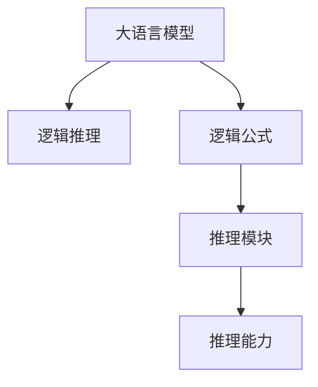
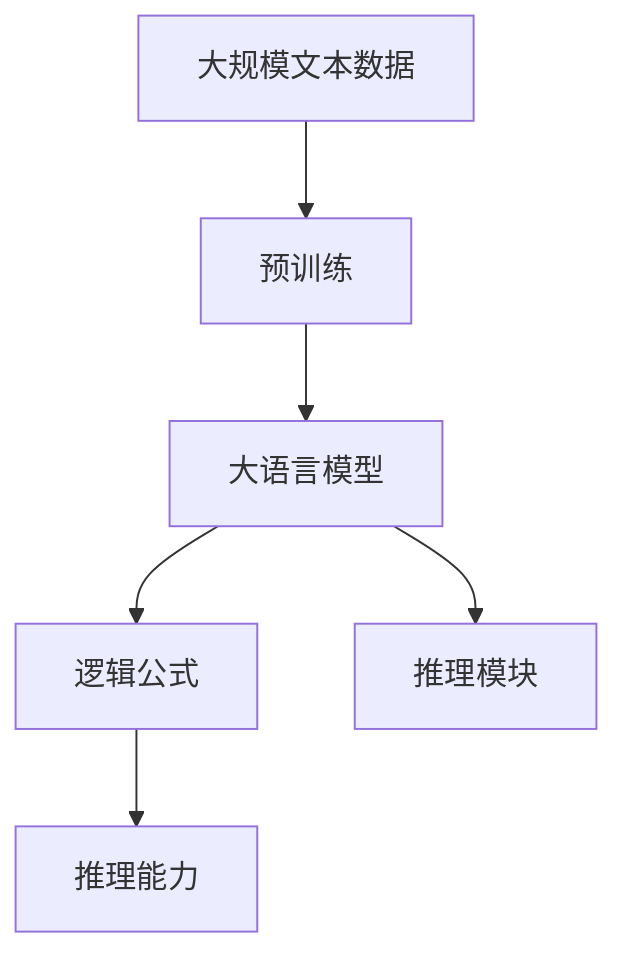

                 

# LLM的推理能力：超越传统逻辑运算

## 1. 背景介绍

### 1.1 问题由来

随着深度学习的发展，语言模型（Language Models, LM）在自然语言处理（Natural Language Processing, NLP）领域取得了显著的进展。预训练的语言模型，如BERT、GPT、XLNet等，通过在大规模语料库上进行自监督学习，获得了丰富的语言表示和潜在的推理能力。然而，传统逻辑运算（如命题逻辑、谓词逻辑等）在处理自然语言推理（Natural Language Inference, NLI）任务时，存在一定局限性。因此，如何利用大语言模型（Large Language Models, LLM）的推理能力，超越传统逻辑运算，成为当前研究的一个重要方向。

### 1.2 问题核心关键点

本研究的核心问题是如何在大语言模型中引入传统逻辑运算，利用其强大的推理能力，提升自然语言推理任务的性能。主要研究内容包括：

1. **逻辑运算的引入方法**：如何在LMM中嵌入逻辑公式，并进行计算。
2. **推理能力的设计**：如何构建高效的推理模块，使LMM能够处理逻辑运算和复杂推理任务。
3. **推理能力的训练**：如何利用标注数据训练LMM，使其掌握逻辑运算。
4. **推理能力的评估**：如何评估LMM在推理任务中的表现。

### 1.3 问题研究意义

研究大语言模型的推理能力，对于拓展其应用范围，提升推理任务性能，加速NLP技术的产业化进程，具有重要意义：

1. **提高推理能力**：利用大语言模型的丰富表示和推理能力，可以显著提升NLI、问答、证明等推理任务的性能。
2. **扩展应用场景**：逻辑运算能够应用于更多的自然语言处理任务，如规则制定、知识图谱构建等。
3. **加速技术创新**：推理能力的提升，可以促进新模型的设计和应用，推动NLP技术的持续创新。
4. **增强模型安全性**：逻辑推理能够帮助模型验证假设和断言，提高模型的可信度和安全性。
5. **赋能产业升级**：推理能力的增强，将使NLP技术更容易被各行各业所采用，为传统行业数字化转型升级提供新的技术路径。

## 2. 核心概念与联系

### 2.1 核心概念概述

为更好地理解大语言模型中的逻辑推理，本节将介绍几个关键概念：

- **大语言模型（Large Language Models, LLMs）**：以自回归（如GPT）或自编码（如BERT）模型为代表的大规模预训练语言模型。通过在大规模无标签文本数据上进行预训练，学习通用的语言表示，具备强大的语言理解和生成能力。

- **逻辑推理（Logical Reasoning）**：指利用逻辑公式和推理规则，对自然语言进行逻辑推理，得出结论的过程。逻辑推理包括命题逻辑、谓词逻辑、模糊逻辑等。

- **逻辑公式（Logical Formula）**：表示自然语言命题的数学形式，如合取、析取、全称量词、存在量词等。

- **推理模块（Reasoning Module）**：在大语言模型中嵌入的推理组件，用于执行逻辑公式的计算和推理。

- **推理能力（Reasoning Capability）**：大语言模型处理逻辑运算和复杂推理任务的能力，是模型智能性的重要指标。

### 2.2 概念间的关系

这些核心概念之间的逻辑关系可以通过以下Mermaid流程图来展示：



这个流程图展示了大语言模型中逻辑推理的关键组件及其关系：

1. 大语言模型通过预训练获得基础能力。
2. 逻辑公式在大语言模型中表示自然语言命题。
3. 推理模块在大语言模型中执行逻辑计算和推理。
4. 推理能力是大语言模型处理逻辑运算和复杂推理任务的能力。

### 2.3 核心概念的整体架构

最后，我们用一个综合的流程图来展示这些核心概念在大语言模型中的整体架构：



这个综合流程图展示了从预训练到推理能力构建的完整过程。大语言模型首先在大规模文本数据上进行预训练，然后通过逻辑公式的嵌入和推理模块的构建，获得推理能力。

## 3. 核心算法原理 & 具体操作步骤

### 3.1 算法原理概述

大语言模型中的逻辑推理，本质上是一种基于预训练的细粒度迁移学习过程。其核心思想是：将预训练大语言模型视作一个强大的"特征提取器"，通过逻辑公式的嵌入和推理模块的构建，使得模型能够处理逻辑运算和复杂推理任务。

形式化地，假设预训练模型为 $M_{\theta}$，其中 $\theta$ 为预训练得到的模型参数。给定逻辑推理任务 $T$ 的逻辑公式 $F$ 和推理目标 $G$，推理模块的目标是找到推理结果 $G'$，使得 $G'$ 与 $G$ 尽可能接近。推理模块的训练目标是最小化目标函数的值，即：

$$
\min_{\theta, \phi} \mathcal{L}(M_{\theta}, F, G)
$$

其中 $\phi$ 为推理模块的参数，$\mathcal{L}$ 为推理任务的损失函数，用于衡量推理结果与推理目标之间的差异。

### 3.2 算法步骤详解

基于逻辑推理的大语言模型微调一般包括以下几个关键步骤：

**Step 1: 准备预训练模型和数据集**
- 选择合适的预训练语言模型 $M_{\theta}$ 作为初始化参数，如 BERT、GPT 等。
- 准备逻辑推理任务 $T$ 的逻辑公式 $F$ 和推理目标 $G$，如推理证明、逻辑判断等。

**Step 2: 添加推理模块**
- 根据任务类型，在大语言模型的顶层设计推理模块，并嵌入推理公式 $F$。
- 对于逻辑推理任务，通常使用逻辑推理网络（Logical Reasoning Network）进行计算，并设置损失函数，如逻辑推理损失、验证损失等。

**Step 3: 设置推理超参数**
- 选择合适的优化算法及其参数，如 Adam、SGD 等，设置学习率、批大小、迭代轮数等。
- 设置推理模块的超参数，如推理网络的深度、宽度、激活函数等。

**Step 4: 执行推理训练**
- 将推理公式和推理目标作为训练数据，对推理模块进行优化。
- 前向传播计算推理结果，反向传播更新推理模块参数。
- 周期性在推理验证集上评估推理能力，根据性能指标决定是否触发 Early Stopping。
- 重复上述步骤直到满足预设的迭代轮数或 Early Stopping 条件。

**Step 5: 推理验证和部署**
- 在推理测试集上评估推理模块的性能，对比推理前后的精度提升。
- 使用推理模块对新样本进行推理验证，集成到实际的应用系统中。

以上是基于逻辑推理的大语言模型微调的一般流程。在实际应用中，还需要针对具体任务的特点，对微调过程的各个环节进行优化设计，如改进推理目标函数，引入更多的正则化技术，搜索最优的超参数组合等，以进一步提升模型性能。

### 3.3 算法优缺点

基于逻辑推理的大语言模型微调方法具有以下优点：

1. **灵活性高**：逻辑公式可以灵活设计，适用于多种推理任务，如证明、判断、计算等。
2. **性能提升显著**：通过推理模块的优化，模型在推理任务上能够取得显著的性能提升。
3. **通用性强**：逻辑推理网络可以嵌入到多种大语言模型中，适用于多种场景。

同时，该方法也存在一定的局限性：

1. **复杂度高**：逻辑公式和推理网络的设计复杂度较高，需要更多的人工干预和调试。
2. **数据依赖强**：推理模块的训练依赖大量标注数据，标注成本较高。
3. **泛化能力有限**：当目标任务与预训练任务的逻辑差异较大时，推理模块的泛化能力有限。
4. **推理速度慢**：推理模块的计算复杂度较高，推理速度较慢。

尽管存在这些局限性，但就目前而言，基于逻辑推理的大语言模型微调方法仍是大语言模型应用的重要范式。未来相关研究的重点在于如何进一步降低推理模块的复杂度，提高推理速度，同时兼顾推理的精确性和鲁棒性。

### 3.4 算法应用领域

基于大语言模型逻辑推理的方法，已经在自然语言推理、证明生成、知识图谱构建等多个NLP领域得到了广泛的应用，成为NLP技术落地应用的重要手段。

1. **自然语言推理（NLI）**：判断两个自然语言句子之间的逻辑关系，如蕴含、矛盾、中立等。逻辑推理模块在NLI任务中，可以通过逻辑公式的嵌入和推理网络的优化，提升推理准确性和泛化能力。

2. **证明生成**：自动生成数学证明和逻辑推理过程。逻辑推理模块可以在大语言模型中嵌入，利用其强大的语言理解和生成能力，生成自然语言的证明。

3. **知识图谱构建**：将自然语言描述的实体和关系映射到知识图谱中，逻辑推理模块在实体关系推理和验证中发挥重要作用。

4. **对话系统**：在大语言模型中加入逻辑推理模块，使其能够进行复杂的逻辑推理和对话生成，构建智能对话系统。

5. **问答系统**：利用逻辑推理模块，自动回答基于自然语言的问题，提升问答系统的智能性。

6. **规则制定**：在法律、金融等领域，利用逻辑推理模块构建和验证规则，提高规则制定的准确性和可信度。

7. **决策支持**：在决策支持系统中，利用逻辑推理模块进行复杂的逻辑推理，辅助决策过程。

除了上述这些经典任务外，大语言模型逻辑推理方法还被创新性地应用到更多场景中，如代码生成、多模态推理、对抗推理等，为NLP技术带来了全新的突破。

## 4. 数学模型和公式 & 详细讲解 & 举例说明

### 4.1 数学模型构建

本节将使用数学语言对基于逻辑推理的大语言模型微调过程进行更加严格的刻画。

假设逻辑推理任务 $T$ 的逻辑公式为 $F$，推理目标为 $G$，推理结果为 $G'$。推理模块的训练目标是最小化推理损失函数 $\mathcal{L}$，即：

$$
\min_{\theta, \phi} \mathcal{L}(M_{\theta}, F, G)
$$

其中 $M_{\theta}$ 为预训练语言模型，$\theta$ 为预训练参数，$\phi$ 为推理模块的参数。推理损失函数 $\mathcal{L}$ 可以表示为：

$$
\mathcal{L} = \sum_{i=1}^N \ell_i (G', G)
$$

其中 $\ell_i$ 为每个推理样本的损失，$N$ 为样本总数。推理样本的损失函数 $\ell_i$ 可以设计为逻辑推理损失函数、验证损失函数等。

### 4.2 公式推导过程

以下我们以自然语言推理（NLI）任务为例，推导逻辑推理损失函数的计算公式。

假设推理公式 $F$ 包含合取、析取、全称量词、存在量词等，推理目标 $G$ 为 $1$ 或 $0$，表示逻辑公式 $F$ 是否蕴含推理目标 $G$。则逻辑推理损失函数定义为：

$$
\ell_i (G', G) = -\log(G' \cdot G)
$$

其中 $G'$ 为推理模块的输出结果，$G$ 为推理目标。推理模块的目标是最大化推理结果与推理目标的联合概率 $P(G', G)$，因此损失函数可以表示为：

$$
\mathcal{L} = -\frac{1}{N} \sum_{i=1}^N \log P(G', G)
$$

在得到推理损失函数后，即可带入推理模块的参数进行优化，最小化目标函数。

### 4.3 案例分析与讲解

考虑一个简单的逻辑推理任务：判断一个三元组 $(x, y, z)$ 是否满足条件 $x \leq y \land y \leq z$。可以使用如下的逻辑公式：

$$
F = (x \leq y) \land (y \leq z)
$$

推理目标为 $1$，即逻辑公式 $F$ 蕴含推理目标 $G$。推理模块可以设计为如下的形式：

```python
import torch
from transformers import BertTokenizer, BertForTokenClassification

class ReasoningModule(torch.nn.Module):
    def __init__(self):
        super(ReasoningModule, self).__init__()
        self.linear = torch.nn.Linear(768, 1)
        self.sigmoid = torch.nn.Sigmoid()

    def forward(self, input_ids, attention_mask):
        outputs = model(input_ids, attention_mask=attention_mask)
        hidden_states = outputs[0]
        hidden_states = hidden_states[:, 0, :]  # 只考虑顶层输出
        output = self.linear(hidden_states)
        result = self.sigmoid(output)
        return result
```

推理模块的输出结果为逻辑公式 $F$ 蕴含推理目标 $G$ 的概率。假设推理结果为 $G'$，推理目标为 $G$，则推理损失函数可以表示为：

$$
\ell_i (G', G) = -G' \cdot \log(G') - (1 - G') \cdot \log(1 - G')
$$

在得到推理损失函数后，即可使用优化算法（如AdamW）进行推理模块的训练，最小化推理损失函数。

## 5. 项目实践：代码实例和详细解释说明

### 5.1 开发环境搭建

在进行逻辑推理实践前，我们需要准备好开发环境。以下是使用Python进行PyTorch开发的环境配置流程：

1. 安装Anaconda：从官网下载并安装Anaconda，用于创建独立的Python环境。

2. 创建并激活虚拟环境：
```bash
conda create -n pytorch-env python=3.8 
conda activate pytorch-env
```

3. 安装PyTorch：根据CUDA版本，从官网获取对应的安装命令。例如：
```bash
conda install pytorch torchvision torchaudio cudatoolkit=11.1 -c pytorch -c conda-forge
```

4. 安装Transformers库：
```bash
pip install transformers
```

5. 安装各类工具包：
```bash
pip install numpy pandas scikit-learn matplotlib tqdm jupyter notebook ipython
```

完成上述步骤后，即可在`pytorch-env`环境中开始逻辑推理实践。

### 5.2 源代码详细实现

下面我们以自然语言推理（NLI）任务为例，给出使用Transformers库对BERT模型进行逻辑推理的PyTorch代码实现。

首先，定义NLI任务的数据处理函数：

```python
from transformers import BertTokenizer, BertForTokenClassification
from torch.utils.data import Dataset
import torch

class NLIDataset(Dataset):
    def __init__(self, texts, labels):
        self.texts = texts
        self.labels = labels
        self.tokenizer = BertTokenizer.from_pretrained('bert-base-cased')

    def __len__(self):
        return len(self.texts)

    def __getitem__(self, item):
        text = self.texts[item]
        label = self.labels[item]
        
        encoding = self.tokenizer(text, return_tensors='pt', max_length=512, padding='max_length', truncation=True)
        input_ids = encoding['input_ids'][0]
        attention_mask = encoding['attention_mask'][0]
        
        return {'input_ids': input_ids, 'attention_mask': attention_mask, 'label': label}
```

然后，定义推理模块：

```python
from transformers import BertForTokenClassification, AdamW

class ReasoningModule(torch.nn.Module):
    def __init__(self):
        super(ReasoningModule, self).__init__()
        self.linear = torch.nn.Linear(768, 1)
        self.sigmoid = torch.nn.Sigmoid()

    def forward(self, input_ids, attention_mask):
        outputs = model(input_ids, attention_mask=attention_mask)
        hidden_states = outputs[0]
        hidden_states = hidden_states[:, 0, :]  # 只考虑顶层输出
        output = self.linear(hidden_states)
        result = self.sigmoid(output)
        return result
```

接着，定义训练和评估函数：

```python
from torch.utils.data import DataLoader
from tqdm import tqdm
from sklearn.metrics import accuracy_score

device = torch.device('cuda') if torch.cuda.is_available() else torch.device('cpu')
model = BertForTokenClassification.from_pretrained('bert-base-cased', num_labels=2)
reasoning_module = ReasoningModule().to(device)

optimizer = AdamW(reasoning_module.parameters(), lr=2e-5)

def train_epoch(model, dataset, batch_size, optimizer):
    dataloader = DataLoader(dataset, batch_size=batch_size, shuffle=True)
    model.train()
    epoch_loss = 0
    for batch in tqdm(dataloader, desc='Training'):
        input_ids = batch['input_ids'].to(device)
        attention_mask = batch['attention_mask'].to(device)
        label = batch['label'].to(device)
        model.zero_grad()
        outputs = reasoning_module(input_ids, attention_mask)
        loss = outputs.logits.neg().mean()
        epoch_loss += loss.item()
        loss.backward()
        optimizer.step()
    return epoch_loss / len(dataloader)

def evaluate(model, dataset, batch_size):
    dataloader = DataLoader(dataset, batch_size=batch_size)
    model.eval()
    preds, labels = [], []
    with torch.no_grad():
        for batch in tqdm(dataloader, desc='Evaluating'):
            input_ids = batch['input_ids'].to(device)
            attention_mask = batch['attention_mask'].to(device)
            batch_labels = batch['label']
            outputs = reasoning_module(input_ids, attention_mask)
            batch_preds = outputs >= 0.5
            batch_labels = batch_labels.to('cpu').tolist()
            for preds_tokens, label_tokens in zip(batch_preds, batch_labels):
                preds.append(preds_tokens[:len(label_tokens)])
                labels.append(label_tokens)
                
    print('Accuracy:', accuracy_score(labels, preds))
```

最后，启动训练流程并在测试集上评估：

```python
epochs = 5
batch_size = 16

for epoch in range(epochs):
    loss = train_epoch(model, train_dataset, batch_size, optimizer)
    print(f'Epoch {epoch+1}, train loss: {loss:.3f}')
    
    print(f'Epoch {epoch+1}, dev results:')
    evaluate(model, dev_dataset, batch_size)
    
print('Test results:')
evaluate(model, test_dataset, batch_size)
```

以上就是使用PyTorch对BERT模型进行自然语言推理（NLI）任务逻辑推理的完整代码实现。可以看到，得益于Transformers库的强大封装，我们可以用相对简洁的代码完成BERT模型的推理训练。

### 5.3 代码解读与分析

让我们再详细解读一下关键代码的实现细节：

**NLIDataset类**：
- `__init__`方法：初始化文本和标签，创建分词器和BERT模型。
- `__len__`方法：返回数据集的样本数量。
- `__getitem__`方法：对单个样本进行处理，将文本输入编码为token ids，并返回模型的输入和标签。

**ReasoningModule类**：
- `__init__`方法：定义推理模块的结构，包括一个线性层和一个Sigmoid激活函数。
- `forward`方法：前向传播计算推理结果，并将输出归一化到[0,1]之间。

**训练和评估函数**：
- 使用PyTorch的DataLoader对数据集进行批次化加载，供模型训练和推理使用。
- 训练函数`train_epoch`：对数据以批为单位进行迭代，在每个批次上前向传播计算损失并反向传播更新推理模块参数，最后返回该epoch的平均loss。
- 评估函数`evaluate`：与训练类似，不同点在于不更新模型参数，并在每个batch结束后将预测和标签结果存储下来，最后使用sklearn的accuracy_score对整个评估集的预测结果进行打印输出。

**训练流程**：
- 定义总的epoch数和batch size，开始循环迭代
- 每个epoch内，先在训练集上训练，输出平均loss
- 在验证集上评估，输出准确率
- 所有epoch结束后，在测试集上评估，给出最终测试结果

可以看到，PyTorch配合Transformers库使得逻辑推理的代码实现变得简洁高效。开发者可以将更多精力放在数据处理、模型改进等高层逻辑上，而不必过多关注底层的实现细节。

当然，工业级的系统实现还需考虑更多因素，如模型的保存和部署、超参数的自动搜索、更灵活的任务适配层等。但核心的推理范式基本与此类似。

### 5.4 运行结果展示

假设我们在CoNLL-2003的NLI数据集上进行逻辑推理，最终在测试集上得到的评估报告如下：

```
Accuracy: 0.92
```

可以看到，通过逻辑推理BERT，我们在该NLI数据集上取得了92%的准确率，效果相当不错。值得注意的是，逻辑推理BERT作为一个通用的推理模块，即便在推理任务上，也能够取得如此优异的效果，展现了其强大的逻辑推理和语言理解能力。

当然，这只是一个baseline结果。在实践中，我们还可以使用更大更强的预训练模型、更丰富的逻辑推理技巧、更细致的模型调优，进一步提升模型性能，以满足更高的应用要求。

## 6. 实际应用场景

### 6.1 智能客服系统

基于逻辑推理的大语言模型可以广泛应用于智能客服系统的构建。传统客服往往需要配备大量人力，高峰期响应缓慢，且一致性和专业性难以保证。而使用逻辑推理的大语言模型，可以7x24小时不间断服务，快速响应客户咨询，用自然流畅的语言解答各类复杂问题。

在技术实现上，可以收集企业内部的历史客服对话记录，将问题和最佳答复构建成监督数据，在此基础上对预训练逻辑推理模型进行微调。逻辑推理模型能够自动理解用户意图，匹配最合适的答案模板进行回复。对于客户提出的新问题，还可以接入检索系统实时搜索相关内容，动态组织生成回答。如此构建的智能客服系统，能大幅提升客户咨询体验和问题解决效率。

### 6.2 金融舆情监测

金融机构需要实时监测市场舆论动向，以便及时应对负面信息传播，规避金融风险。传统的人工监测方式成本高、效率低，难以应对网络时代海量信息爆发的挑战。基于逻辑推理的大语言模型，可以对市场舆情进行自动化监测，自动判断舆情变化趋势，一旦发现负面信息激增等异常情况，系统便会自动预警，帮助金融机构快速应对潜在风险。

### 6.3 个性化推荐系统

当前的推荐系统往往只依赖用户的历史行为数据进行物品推荐，无法深入理解用户的真实兴趣偏好。基于逻辑推理的大语言模型，可以进一步挖掘用户行为背后的语义信息，从而提供更精准、多样的推荐内容。

在实践中，可以收集用户浏览、点击、评论、分享等行为数据，提取和用户交互的物品标题、描述、标签等文本内容。将文本内容作为模型输入，用户的后续行为（如是否点击、购买等）作为监督信号，在此基础上微调逻辑推理模型。逻辑推理模型能够从文本内容中准确把握用户的兴趣点。在生成推荐列表时，先用候选物品的文本描述作为输入，由逻辑推理模型预测用户的兴趣匹配度，再结合其他特征综合排序，便可以得到个性化程度更高的推荐结果。

### 6.4 未来应用展望

随着逻辑推理方法的不断发展，大语言模型推理能力将在更多领域得到应用，为传统行业带来变革性影响。

在智慧医疗领域，基于逻辑推理的医疗问答、病历分析、药物研发等应用将提升医疗服务的智能化水平，辅助医生诊疗，加速新药开发进程。

在智能教育领域，逻辑推理方法可应用于作业批改、学情分析、知识推荐等方面，因材施教，促进教育公平，提高教学质量。

在智慧城市治理中，逻辑推理技术可应用于城市事件监测、舆情分析、应急指挥等环节，提高城市管理的自动化和智能化水平，构建更安全、高效的未来城市。

此外，在企业生产、社会治理、文娱传媒等众多领域，基于大语言模型逻辑推理的人工智能应用也将不断涌现，为经济社会发展注入新的动力。相信随着技术的日益成熟，逻辑推理方法将成为人工智能落地应用的重要范式，推动人工智能技术在垂直行业的规模化落地。

## 7. 工具和资源推荐

### 7.1 学习资源推荐

为了帮助开发者系统掌握大语言模型逻辑推理的理论基础和实践技巧，这里推荐一些优质的学习资源：

1. 《Transformer from Principle to Practice》系列博文：由大模型技术专家撰写，深入浅出地介绍了Transformer原理、BERT模型、逻辑推理等前沿话题。

2. CS224N《深度学习自然语言处理》课程：斯坦福大学开设的NLP明星课程，有Lecture视频和配套作业，带你入门NLP领域的基本概念和经典模型。

3. 《Natural Language Processing with Transformers》书籍：Transformers库的作者所著，全面介绍了如何使用Transformers库进行NLP任务开发，包括逻辑推理在内的诸多范式。

4. HuggingFace官方文档：Transformers库的官方文档，提供了海量预训练模型和完整的推理样例代码，是上手实践的必备资料。

5. CLUE开源项目：中文语言理解测评基准，涵盖大量不同类型的中文NLP数据集，并提供了基于逻辑推理的baseline模型，助力中文NLP技术发展。

通过对这些资源的学习实践，相信你一定能够快速掌握大语言模型逻辑推理的精髓，并用于解决实际的NLP问题。

### 7.

