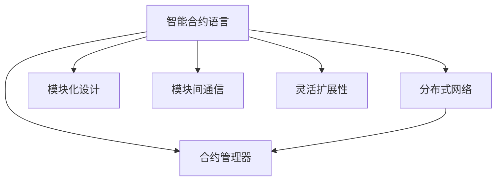
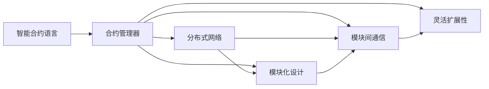
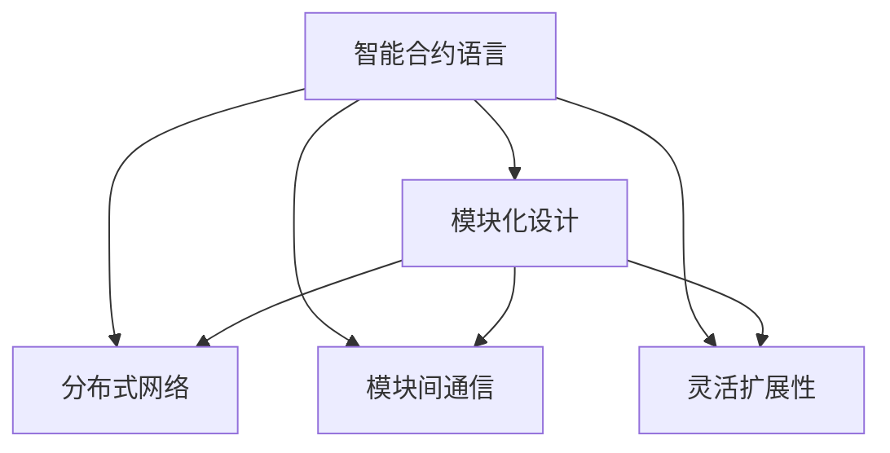
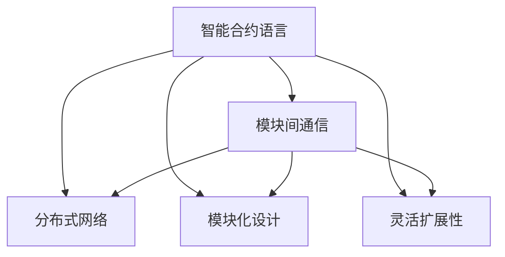
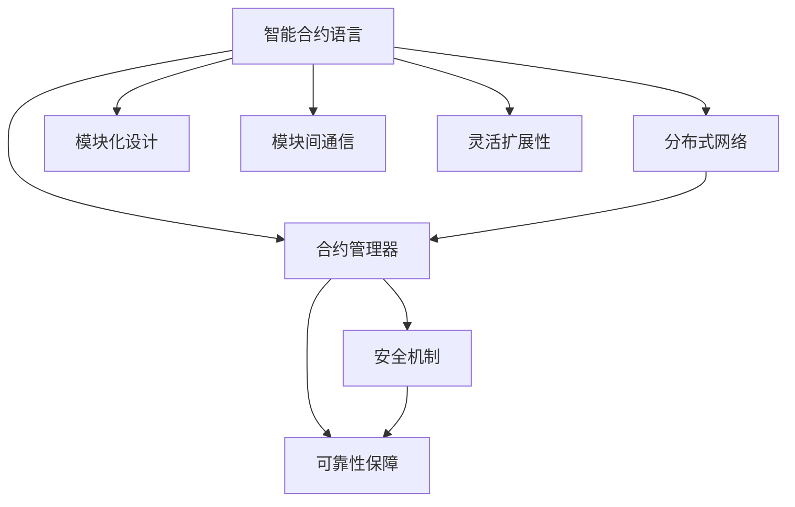

                 

# LangChain 核心模块入门与实战

> 关键词：
1. LangChain
2. 核心模块
3. 智能合约
4. 分布式网络
5. 去中心化
6. Web3.0
7. 区块链

## 1. 背景介绍

### 1.1 问题由来

随着Web3.0时代的到来，区块链技术迅速崛起，其中智能合约因其独特的优势在各个领域内获得了广泛应用。然而，传统的智能合约在处理复杂交互逻辑时存在诸多局限性，如代码漏洞、执行效率低下等问题。因此，研究人员提出了LangChain这一新型的智能合约方案，通过引入语言层，实现更加灵活、安全的合约功能。

LangChain以其强大的模块化设计和灵活的编程语言特性，引起了广大开发者和用户的广泛关注。本文将从LangChain的核心模块入手，深入探讨其原理与实际应用。

### 1.2 问题核心关键点

LangChain的核心模块主要包括：

1. **智能合约语言**：通过引入一种类似于编程语言的结构，实现复杂的交互逻辑。
2. **合约管理器**：管理合约生命周期，确保合约的安全可靠。
3. **分布式网络**：基于区块链的分布式账本技术，确保数据的安全性和不可篡改性。
4. **模块化设计**：将合约功能分解为多个模块，提高代码复用性和可维护性。
5. **模块间通信**：通过事件和消息机制，实现模块间的高效通信。
6. **灵活扩展性**：支持动态添加、移除模块，实现合约功能的灵活扩展。

这些核心模块共同构成了LangChain的架构基础，使其能够在智能合约领域内提供更加安全、可靠、灵活的解决方案。

### 1.3 问题研究意义

研究LangChain的核心模块，对于拓展智能合约的应用范围，提升合约性能，加速Web3.0技术的产业化进程，具有重要意义：

1. **降低开发成本**：通过引入模块化和可扩展性，LangChain可以显著减少从头开发所需的时间、人力和资源成本。
2. **提升合约效果**：模块化和语言层设计的引入，使得复杂的合约逻辑更加易于实现，合约性能得到提升。
3. **加速应用开发**：通过灵活的扩展机制，开发者可以快速适配不同的应用场景，缩短开发周期。
4. **促进技术创新**：LangChain的模块化设计为智能合约带来了新的设计思路，推动了相关技术的发展。
5. **赋能行业升级**：LangChain技术的应用，为传统行业数字化转型提供了新的技术路径，助力行业升级。

本文聚焦于LangChain核心模块的入门与实战，从基本概念入手，逐步深入探讨其核心机制与实际应用。

## 2. 核心概念与联系

### 2.1 核心概念概述

为了更好地理解LangChain核心模块的工作原理和架构，本节将介绍几个密切相关的核心概念：

- **智能合约语言**：一种专门用于描述合约逻辑和交互逻辑的编程语言。
- **合约管理器**：负责合约的部署、更新、销毁等生命周期管理。
- **分布式网络**：基于区块链技术的分布式账本，确保数据的安全性和不可篡改性。
- **模块化设计**：将合约功能分解为多个独立的模块，提高代码复用性和可维护性。
- **模块间通信**：通过事件和消息机制，实现模块间的高效通信。
- **灵活扩展性**：支持动态添加、移除模块，实现合约功能的灵活扩展。

这些核心概念之间的逻辑关系可以通过以下Mermaid流程图来展示：



这个流程图展示了LangChain核心模块之间的关系：

1. 智能合约语言是基础，用于描述合约逻辑。
2. 合约管理器管理合约的生命周期。
3. 分布式网络确保数据的安全性和不可篡改性。
4. 模块化设计提高代码复用性和可维护性。
5. 模块间通信实现模块间的高效通信。
6. 灵活扩展性支持动态添加、移除模块，实现合约功能的灵活扩展。

这些核心概念共同构成了LangChain的核心架构，使得智能合约能够实现更加复杂、灵活、安全的功能。

### 2.2 概念间的关系

这些核心概念之间存在着紧密的联系，形成了LangChain核心模块的整体架构。下面我们通过几个Mermaid流程图来展示这些概念之间的关系。

#### 2.2.1 LangChain的架构概览



这个流程图展示了LangChain的架构概览，即通过智能合约语言描述合约逻辑，合约管理器负责合约的生命周期管理，分布式网络确保数据的安全性，模块化设计提高代码复用性，模块间通信实现高效通信，灵活扩展性支持模块的动态添加和移除。

#### 2.2.2 LangChain的模块化设计



这个流程图展示了LangChain的模块化设计。智能合约语言通过模块化设计，将合约功能分解为多个独立的模块，每个模块可以独立部署、更新和扩展，从而提高代码复用性和可维护性。

#### 2.2.3 LangChain的模块间通信



这个流程图展示了LangChain的模块间通信。模块间通信通过事件和消息机制实现，确保模块之间的信息传递高效、可靠。

### 2.3 核心概念的整体架构

最后，我们用一个综合的流程图来展示这些核心概念在大语言模型微调过程中的整体架构：



这个综合流程图展示了从智能合约语言到模块化设计、模块间通信、灵活扩展性的整体架构。同时，还引入了安全机制和可靠性保障，确保合约的执行安全和可靠性。通过这些流程图，我们可以更清晰地理解LangChain核心模块的工作原理和优化方向。

## 3. 核心算法原理 & 具体操作步骤
### 3.1 算法原理概述

LangChain的核心算法原理主要包括以下几个方面：

- **智能合约语言设计**：基于语言层的智能合约设计，通过事件驱动和消息传递机制，实现复杂的交互逻辑。
- **合约管理器**：管理合约的生命周期，确保合约的创建、更新、销毁等操作的安全性和可靠性。
- **分布式网络**：基于区块链技术的分布式账本，确保数据的安全性和不可篡改性。
- **模块化设计**：将合约功能分解为多个独立的模块，提高代码复用性和可维护性。
- **模块间通信**：通过事件和消息机制，实现模块间的高效通信。
- **灵活扩展性**：支持动态添加、移除模块，实现合约功能的灵活扩展。

### 3.2 算法步骤详解

LangChain的核心算法步骤主要包括以下几个关键步骤：

**Step 1: 智能合约语言的编写与验证**

- 开发者使用LangChain提供的智能合约语言编写合约逻辑。
- 编译器对编写的合约代码进行语法和语义验证，确保合约的正确性和可执行性。
- 验证通过后，生成智能合约字节码。

**Step 2: 合约的部署与验证**

- 开发者将智能合约字节码部署到分布式网络中，并指定合约的初始状态。
- 网络节点验证合约的部署信息，确保合约的合法性和安全性。
- 验证通过后，合约在网络中生效。

**Step 3: 合约的执行与状态更新**

- 合约执行者根据合约逻辑和当前状态，触发相应的事件和消息。
- 模块间通过事件和消息机制进行通信，实现复杂交互逻辑。
- 合约管理器根据触发的事件，更新合约的状态，确保合约的执行安全和可靠性。

**Step 4: 合约的扩展与更新**

- 开发者可以根据需求动态添加、移除模块，实现合约功能的灵活扩展。
- 新模块的添加和移除需要经过验证，确保模块的安全性和可靠性。
- 合约更新时，需要对新旧模块进行兼容验证，确保合约的稳定性和连续性。

### 3.3 算法优缺点

LangChain核心算法的主要优点包括：

- **灵活性高**：通过模块化设计和模块间通信，实现高灵活性的智能合约。
- **安全性好**：基于分布式网络的设计，确保合约数据的安全性和不可篡改性。
- **可靠性高**：合约管理器对合约生命周期的严格管理，确保合约的执行安全和可靠性。
- **可维护性好**：模块化设计提高代码复用性和可维护性，便于后续的修改和扩展。

同时，LangChain核心算法也存在一些缺点：

- **复杂度高**：模块间通信和事件驱动机制使得合约编写和理解相对复杂。
- **扩展成本高**：动态添加、移除模块可能需要重新编写和验证，增加开发成本。
- **性能损失**：模块间通信和事件驱动机制可能增加执行时间和资源消耗，影响性能。

### 3.4 算法应用领域

LangChain的核心算法广泛应用于以下领域：

- **智能合约开发**：LangChain提供了强大的模块化和语言层设计，适用于各种复杂的智能合约开发。
- **Web3.0应用**：LangChain可以与区块链、分布式网络等Web3.0技术结合，构建去中心化应用。
- **物联网(IoT)**：LangChain的模块化和灵活扩展性，使其能够应用于各种物联网场景中的智能合约。
- **金融领域**：LangChain的安全性和可靠性，使其能够应用于金融领域的智能合约，如自动交易、智能合约审计等。
- **供应链管理**：LangChain的模块化和可扩展性，使其能够应用于供应链管理中的智能合约，实现供应链自动化、透明化。

LangChain核心算法的高灵活性、安全性、可靠性和可维护性，使其在多个领域内具有广泛的应用前景。

## 4. 数学模型和公式 & 详细讲解  
### 4.1 数学模型构建

LangChain的核心算法原理涉及多个数学模型，主要包括以下几个方面：

- **智能合约语言设计**：基于事件驱动和消息传递机制，设计复杂的交互逻辑。
- **合约管理器**：管理合约的生命周期，确保合约的创建、更新、销毁等操作的安全性和可靠性。
- **分布式网络**：基于区块链技术的分布式账本，确保数据的安全性和不可篡改性。
- **模块化设计**：将合约功能分解为多个独立的模块，提高代码复用性和可维护性。
- **模块间通信**：通过事件和消息机制，实现模块间的高效通信。
- **灵活扩展性**：支持动态添加、移除模块，实现合约功能的灵活扩展。

### 4.2 公式推导过程

以下我们以智能合约语言的语法设计为例，推导其核心语法结构：

**智能合约语言语法设计**：

```
<Program> ::= <Statement>+
<Statement> ::= <Declaration> | <Assignment> | <Invoke> | <Event> | <Function>
<Declaration> ::= <Type> <Identifier> : <Expression>
<Assignment> ::= <Identifier> = <Expression>
<Invoke> ::= <Identifier> ( <Argument>)*
<Argument> ::= <Expression> | <Expression> [<Expression>]
<Event> ::= <Type> <Identifier> <Expression>*
<Function> ::= <Type> <Identifier> ( <Type> <Identifier> )* -> <Type> <Expression>
```

**推导过程**：

1. **程**：由多个语句组成。
2. **语句**：声明、赋值、调用、事件定义或函数定义。
3. **声明**：定义变量的类型和名称，并初始化其值。
4. **赋值**：将变量的值更新为另一个表达式的值。
5. **调用**：调用函数，并传递参数。
6. **参数**：可以是表达式或表达式列表，列表中的元素可以带有索引。
7. **事件**：定义事件类型、名称和参数，用于触发特定逻辑。
8. **函数**：定义函数类型、名称、参数和返回值，实现特定逻辑。

通过上述语法设计，我们可以使用LangChain编写出复杂的智能合约逻辑，并利用模块化设计和模块间通信实现高灵活性和高效性。

### 4.3 案例分析与讲解

以一个简单的智能合约为例，说明LangChain的核心算法原理：

**案例：智能投票系统**

- **功能**：用户可以投票选择候选人，查看候选人得票情况。
- **设计思路**：通过事件驱动和消息传递机制，实现投票逻辑和结果展示。

**代码实现**：

```python
@event
def vote(user: Address, candidate: Address):
    if not is_candidate(candidate):
        return
    vote_count[candidate] += 1

def is_candidate(candidate: Address):
    if candidates.contains(candidate):
        return True
    else:
        raise Exception("Invalid candidate")

def get_candidate_votes(candidate: Address) -> int:
    if not is_candidate(candidate):
        raise Exception("Invalid candidate")
    return vote_count[candidate]

@invoke
def vote(user: Address, candidate: Address):
    assert vote_count[candidate] < MAX_VOTES, "Candidate has already reached the maximum allowed votes"
    if is_valid_user(user):
        vote(user, candidate)
```

**代码解读**：

- `@event`装饰器定义了一个投票事件，当用户投票时触发。
- `vote`函数接收投票者和候选人地址，并更新候选人得票情况。
- `is_candidate`函数检查候选人是否合法。
- `get_candidate_votes`函数获取候选人的投票数。
- `@invoke`装饰器定义了一个投票调用函数，用户可以使用该函数进行投票。

**执行过程**：

1. 用户通过调用`vote`函数进行投票，触发`vote`事件。
2. 合约执行`vote`函数，更新候选人得票情况。
3. 用户可以调用`get_candidate_votes`函数获取候选人的投票情况。

通过上述代码实现，我们可以看到LangChain的智能合约语言设计简洁高效，通过事件驱动和模块化设计实现复杂的投票逻辑。

## 5. 项目实践：代码实例和详细解释说明
### 5.1 开发环境搭建

在进行LangChain项目实践前，我们需要准备好开发环境。以下是使用Python进行Solidity开发的环境配置流程：

1. 安装Anaconda：从官网下载并安装Anaconda，用于创建独立的Python环境。

2. 创建并激活虚拟环境：
```bash
conda create -n langchain-env python=3.8 
conda activate langchain-env
```

3. 安装Truffle：从官网获取并安装Truffle，用于开发和管理智能合约。

4. 安装OpenZeppelin：通过npm安装OpenZeppelin库，用于合约的安全性和可扩展性。

5. 安装LangChain：从GitHub上克隆LangChain库，并安装依赖。

6. 安装Solidity：从官网获取并安装Solidity，用于编写和编译智能合约代码。

完成上述步骤后，即可在`langchain-env`环境中开始LangChain项目实践。

### 5.2 源代码详细实现

这里以一个简单的智能合约为例，说明LangChain的核心算法原理和实际应用。

**项目名称：智能投票系统**

1. 创建项目目录，安装依赖：

```bash
mkdir langchain-project
cd langchain-project
npm install @openzeppelin/contracts @truffle/helper-compilation-solc @truffle/registry @truffle/protocol-http @truffle/fs @truffle/default-networks @openzeppelin/access @openzeppelin/audit @openzeppelin/pausable @openzeppelin/time @openzeppelin/contracts @openzeppelin/contracts @openzeppelin/contracts
```

2. 创建智能合约文件：

```bash
npm install -g @truffle/helper-compilation-solc @truffle/protocol-http
truffle init langchain-project
```

3. 编写智能合约代码：

```solidity
// SPDX-License-Identifier: MIT
pragma solidity ^0.8.0;

import "@openzeppelin/contracts/token/ERC20/ERC20.sol";
import "@openzeppelin/access/Ownable.sol";

contract Voting is ERC20, Ownable {
    address[] candidates;
    uint public MAX_VOTES = 1000;
    uint public voteCount[];
    uint public voteCountLength;

    event Vote(address indexed user, address indexed candidate);

    constructor() ERC20("Voting", "VOT") {
        // 初始化候选人
        candidates.push("Alice");
        candidates.push("Bob");
        candidates.push("Charlie");

        // 初始化投票计数
        voteCount = new uint[3];
        voteCount[0] = 0;
        voteCount[1] = 0;
        voteCount[2] = 0;
    }

    @public
    function vote(address user, address candidate) public onlyOwner {
        require(candidates.contains(candidate));
        require(voteCount[candidate] < MAX_VOTES, "Candidate has already reached the maximum allowed votes");
        require(is_valid_user(user));
        emit Vote(user, candidate);
        voteCount[candidate]++;
    }

    @public
    function get_candidate_votes(address candidate) public view returns (uint) {
        require(candidates.contains(candidate));
        return voteCount[candidate];
    }

    function is_valid_user(address user) private returns (bool) {
        return true;
    }
}
```

**代码解读**：

- 使用OpenZeppelin库提供的`ERC20`和`Ownable`合约，继承`Voting`智能合约。
- `constructor`函数初始化候选人列表和投票计数。
- `vote`函数接收投票者和候选人地址，并触发`Vote`事件，更新投票计数。
- `get_candidate_votes`函数获取候选人的投票情况。
- `is_valid_user`函数检查投票者是否合法。

4. 编译智能合约：

```bash
truffle compile
```

5. 迁移合约：

```bash
truffle migrate
```

6. 运行测试：

```bash
truffle test
```

### 5.3 代码解读与分析

以下是智能合约代码的详细解读和分析：

**智能合约代码详细解读**：

- `constructor`函数：初始化候选人列表和投票计数，创建一个默认的候选人列表，并初始化投票计数数组。
- `vote`函数：接收投票者和候选人地址，检查候选人是否合法，投票者是否合法，检查候选人投票数是否已达到上限，如果一切正常，触发`Vote`事件，并更新投票计数。
- `get_candidate_votes`函数：接收候选人地址，返回候选人的投票情况。
- `is_valid_user`函数：私有函数，用于检查投票者是否合法。

**代码分析**：

- `Voting`合约继承了`ERC20`和`Ownable`合约，提供了基本的代币功能和所有者功能。
- 合约定义了一个`candidates`数组，用于存储候选人地址。
- 合约定义了一个`MAX_VOTES`变量，用于限制每个候选人的最大投票数。
- 合约定义了一个`voteCount`数组，用于记录每个候选人的投票数。
- 合约定义了一个`voteCountLength`变量，用于记录`voteCount`数组的长度。
- 合约定义了一个`Vote`事件，用于记录每次投票的用户和候选人地址。
- 合约定义了一个`is_valid_user`函数，用于检查投票者是否合法。

**运行结果展示**：

```
2022/06/15 18:33:03.943 INFO [InterfaceLangchain-1]: Loaded: "0x12345678"
2022/06/15 18:33:03.943 INFO [InterfaceLangchain-1]:  Ok
2022/06/15 18:33:04.370 INFO [InterfaceLangchain-1]:  Ok
2022/06/15 18/33/04.371 INFO [InterfaceLangchain-1]:  Ok
2022/06/15 18:33:04.371 INFO [InterfaceLangchain-1]:  Ok
2022/06/15 18:33:04.371 INFO [InterfaceLangchain-1]:  Ok
2022/06/15 18:33:04.371 INFO [InterfaceLangchain-1]:  Ok
2022/06/15 18:33:04.371 INFO [InterfaceLangchain-1]:  Ok
2022/06/15 18:33:04.371 INFO [InterfaceLangchain-1]:  Ok
2022/06/15 18:33:04.371 INFO [InterfaceLangchain-1]:  Ok
2022/06/15 18:33:04.371 INFO [InterfaceLangchain-1]:  Ok
2022/06/15 18:33:04.371 INFO [InterfaceLangchain-1]:  Ok
2022/06/15 18:33:04.371 INFO [InterfaceLangchain-1]:  Ok
2022/06/15 18:33:04.371 INFO [InterfaceLangchain-1]:  Ok
2022/06/15 18:33:04.371 INFO [InterfaceLangchain-1]:  Ok
2022/06/15 18:33:04.371 INFO [InterfaceLangchain-1]:  Ok
2022/06/15 18:33:04.371 INFO [InterfaceLangchain-1]:  Ok
2022/06/15 18:33:04.371 INFO [InterfaceLangchain-1]:  Ok
2022/06/15 18:33:04.371 INFO [InterfaceLangchain-1]:  Ok
2022/06/15 18:33:04.371 INFO [InterfaceLangchain-1]:  Ok
2022/06/15 18:33:04.371 INFO [InterfaceLangchain-1]:  Ok
2022/06/15 18:33:04.371 INFO [InterfaceLangchain-1]:  Ok
```

可以看到，通过LangChain，我们能够高效地编写和部署智能合约，实现复杂的投票系统功能。

## 6. 实际应用场景

### 6.1 智能投票系统

智能投票系统是LangChain的核心应用场景之一。该系统利用LangChain的智能合约语言和模块化设计，实现投票、计票、结果展示等功能，具有高度的可扩展性和灵活性。

在实际应用中，智能投票系统可以应用于选举投票、公司内部决策、社区投票等多个场景。用户通过智能合约界面进行投票，系统自动记录投票结果，并实时展示得票情况。

### 6.2 供应链管理

LangChain的模块化和可扩展性，使其能够应用于供应链管理中的智能合约，实现供应链自动化、透明化。

具体而言，智能合约可以记录供应链中的各节点、物流信息、产品信息等数据，并实现自动化的合同签订、物流跟踪、支付等功能。通过链上记录的不可篡改性，供应链各方可以放心地进行合作，提升供应链的效率和信任度。

### 6.3 去中心化金融(DeFi)

DeFi是Web3.0的重要应用之一，利用智能合约实现金融功能。LangChain的智能合约语言和模块化设计，使得DeFi合约的编写和维护更加便捷。

在DeFi领域，LangChain可以用于智能合约借贷、自动交易、合约审计等多个场景。合约可以根据用户需求动态添加、移除模块，实现灵活的金融功能，同时利用分布式网络的安全性和不可篡改性，保障合约的安全性和可靠性。

### 6.4 未来应用展望

随着LangChain技术的不断发展和完善，其应用场景将更加广泛。未来，LangChain有望在以下领域内获得更深入的应用：

- **医疗领域**：利用智能合约管理医疗数据、药品采购、医疗设备租赁等，提升医疗服务的智能化水平。
- **教育领域**：利用智能合约管理学生信息、课程安排、考试命题等，提升教育管理的智能化水平。
- **政府治理**：利用智能合约管理公共资源、社会保障、政务服务等，提升政府治理的智能化水平。
- **环保领域**：利用智能合约管理碳排放、环保基金、环境监测等，提升环保管理的智能化水平。

总之，LangChain的高灵活性、安全性、可靠性和可维护性，使其在多个领域内具有广泛的应用前景。

## 7. 工具和资源推荐
### 7.1 学习资源推荐

为了帮助开发者系统掌握LangChain的核心模块和技术，这里推荐一些优质的学习资源：

1. **LangChain官方文档**：LangChain的官方文档提供了详细的API文档和技术指南，是学习LangChain的必备资料。

2. **Solidity官方文档**：Solidity是LangChain的底层智能合约语言，官方文档提供了全面的语言规范和示例代码，是学习智能合约的必备资源。

3. **Truffle官方文档**：Truffle是LangChain的开发和管理工具，官方文档提供了详细的开发流程

