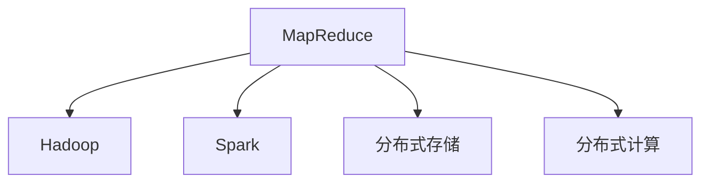
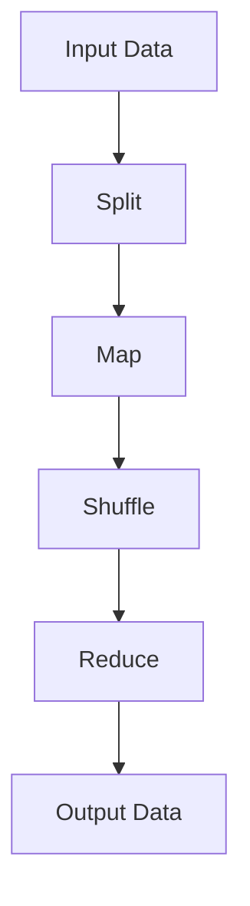
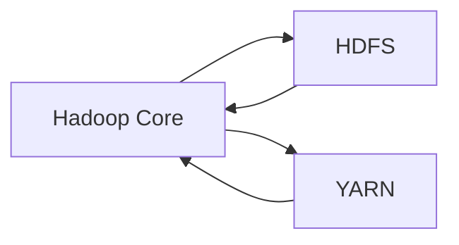
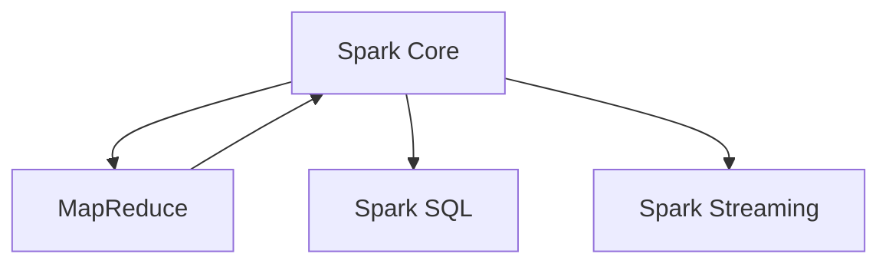
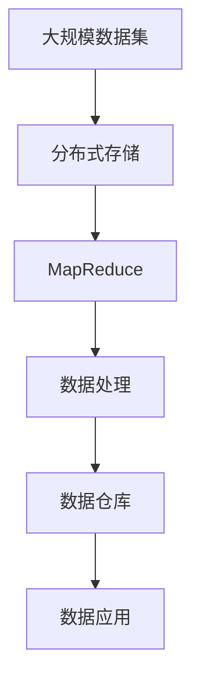

                 

# MapReduce原理与代码实例讲解

> 关键词：MapReduce, Hadoop, Spark, 分布式计算, 大数据处理, 分布式存储

## 1. 背景介绍

### 1.1 问题由来
在过去几十年间，随着互联网的飞速发展，人类社会已经进入了一个数据驱动的时代。无论是社交媒体、电子商务，还是物联网、智能交通，海量数据的产生无处不在。如何高效存储和处理这些数据，成为了一个亟待解决的重要问题。传统的单机处理方式已经无法满足大规模数据处理的需求，分布式计算框架应运而生。

MapReduce 作为一种经典的分布式计算框架，最早由 Google 开发，用于解决大规模数据集上的并行处理问题。它基于两个基本步骤：Map 和 Reduce，旨在将复杂的大规模数据处理问题分解成相对简单的子问题，通过并行处理，提高处理效率。

如今，MapReduce 已经成为分布式计算领域的重要基础，被广泛应用于大数据处理、搜索引擎、推荐系统、机器学习等诸多领域。Google、Yahoo、Amazon 等互联网巨头公司，以及众多创业公司，都在大规模采用 MapReduce 来支撑其核心业务。

### 1.2 问题核心关键点
MapReduce 的核心思想是将大规模数据集分布式处理成一系列子集，并行计算每个子集的结果，最后将这些结果合并得到最终的结果。这种思想使得 MapReduce 能够处理海量数据，同时也提高了处理效率和系统的可伸缩性。

MapReduce 的核心步骤如下：

1. Map：将输入数据集分割成多个子集，对每个子集进行本地处理。
2. Shuffle：将每个 Map 任务的输出按照某个 key 进行排序并合并，将相同 key 的数据分组到一个 Reduce 任务中。
3. Reduce：对每个分组进行聚合计算，得到最终结果。

MapReduce 的优势在于其简单、易于理解和实现，同时又能处理大规模数据集，因此成为了分布式计算的主流范式之一。

### 1.3 问题研究意义
研究 MapReduce 的原理和实践，对于理解和掌握分布式计算框架，以及设计高效的大数据处理系统，具有重要的意义：

1. 了解分布式计算的思想。MapReduce 提供了一种基于数据并行的计算方式，通过 Map 和 Reduce 的分解与合并，使得大规模数据处理成为可能。
2. 提升大数据处理能力。MapReduce 框架可以快速处理海量数据，满足现代社会对大数据存储和处理的需求。
3. 实现系统可扩展性。MapReduce 框架支持大规模的分布式集群，能够动态扩展和收缩，以应对不断变化的业务需求。
4. 降低开发成本。MapReduce 框架提供了大量的工具和接口，使得开发者可以更容易地实现大规模数据处理任务。
5. 增强系统安全性。MapReduce 框架通常具有较好的容错机制和数据冗余设计，可以保证数据的安全性和可靠性。

## 2. 核心概念与联系

### 2.1 核心概念概述

为了更好地理解 MapReduce 的原理和实践，本节将介绍几个密切相关的核心概念：

- MapReduce：一种基于 Map 和 Reduce 思想的分布式计算框架，用于处理大规模数据集。
- Hadoop：一个基于 MapReduce 的开源框架，由 Apache 基金会维护，支持数据存储和分布式计算。
- Spark：一种快速的分布式计算框架，支持内存计算，可以与 MapReduce 无缝集成。
- 分布式存储：如 HDFS、Ceph 等，用于大规模数据的存储和访问。
- 分布式计算：如 Apache Hadoop、Spark、Flink 等，用于大规模数据的处理和分析。

这些核心概念之间的逻辑关系可以通过以下 Mermaid 流程图来展示：



这个流程图展示了大数据处理的核心组件和它们之间的关系：

1. MapReduce 是数据处理的基础框架。
2. Hadoop 基于 MapReduce 实现，支持数据存储和分布式计算。
3. Spark 是一种快速计算框架，可以与 MapReduce 无缝集成。
4. 分布式存储和计算是 MapReduce 的核心组件，支持数据的存储和计算。

### 2.2 概念间的关系

这些核心概念之间存在着紧密的联系，形成了大规模数据处理的基本生态系统。下面我通过几个 Mermaid 流程图来展示这些概念之间的关系。

#### 2.2.1 MapReduce 的数据流图



这个流程图展示了 MapReduce 的基本数据流图。输入数据通过分割成多个子集，在每个子集上进行 Map 操作，然后将结果进行 Shuffle 操作，最终在 Reduce 阶段得到输出数据。

#### 2.2.2 Hadoop 的生态系统



这个流程图展示了 Hadoop 的生态系统。Hadoop Core 是 Hadoop 的核心框架，包含分布式计算的 MapReduce 和资源管理的 YARN。HDFS 是 Hadoop 的分布式文件系统，用于大规模数据的存储。

#### 2.2.3 Spark 与 MapReduce 的集成



这个流程图展示了 Spark 与 MapReduce 的集成。Spark Core 是 Spark 的核心框架，包含分布式计算的 RDD 和 DAG 调度。Spark SQL 是 Spark 的数据库引擎，支持结构化数据的处理。Spark Streaming 是 Spark 的流计算框架，支持实时数据处理。

### 2.3 核心概念的整体架构

最后，我们用一个综合的流程图来展示这些核心概念在大数据处理过程中的整体架构：



这个综合流程图展示了从数据存储到数据应用的全过程。大规模数据集存储在分布式文件系统中，经过 MapReduce 的并行处理，得到中间数据，存储在数据仓库中，并最终应用于各种数据应用场景。

## 3. 核心算法原理 & 具体操作步骤
### 3.1 算法原理概述

MapReduce 的原理基于 Map 和 Reduce 两种基本操作，用于处理大规模数据集。其核心思想是将复杂的数据处理任务分解为多个小任务，并行处理这些小任务，最后将结果合并得到最终结果。

MapReduce 的基本步骤如下：

1. Map：将输入数据集分割成多个子集，对每个子集进行本地处理。
2. Shuffle：将每个 Map 任务的输出按照某个 key 进行排序并合并，将相同 key 的数据分组到一个 Reduce 任务中。
3. Reduce：对每个分组进行聚合计算，得到最终结果。

MapReduce 的原理可以用以下数学公式表示：

$$
\text{MapReduce}(x_1, x_2, ..., x_n) = \bigcup_{i=1}^n \text{Reduce}(\text{Map}(x_i))
$$

其中，$x_i$ 表示输入数据集的第 $i$ 个子集，$\text{Map}(x_i)$ 表示对子集 $x_i$ 进行 Map 操作得到的结果，$\text{Reduce}$ 表示对结果进行 Reduce 操作得到最终结果。

### 3.2 算法步骤详解

MapReduce 的具体操作可以分为以下几个步骤：

**Step 1: 输入数据处理**
- 将输入数据集划分为若干个小块，每个小块可以并行处理。
- 在每个小块上执行 Map 操作，得到每个小块的 Map 输出结果。

**Step 2: 数据排序和合并**
- 将每个 Map 任务的输出按照某个 key 进行排序，将相同 key 的数据分组。
- 将相同 key 的数据发送给一个 Reduce 任务进行处理。

**Step 3: Reduce 操作**
- 对每个分组进行聚合计算，将相同 key 的数据合并得到最终结果。
- 将所有 Reduce 任务的结果合并得到最终输出结果。

### 3.3 算法优缺点

MapReduce 的优点包括：

- 可扩展性：MapReduce 能够动态扩展和收缩，可以处理大规模数据集。
- 容错性：MapReduce 具有较好的容错机制，单个任务的失败不会影响整个系统。
- 并行处理：MapReduce 支持并行处理，能够快速处理大规模数据。
- 灵活性：MapReduce 支持多种数据处理方式，可以满足不同业务需求。

MapReduce 的缺点包括：

- 延迟较高：MapReduce 的延迟较高，主要原因在于数据的 Shuffle 操作。
- 资源浪费：MapReduce 可能存在资源浪费的问题，某些阶段可能使用较多的资源，而某些阶段可能使用较少的资源。
- 编程复杂：MapReduce 的编程复杂度较高，需要开发者具备一定的编程能力和分布式计算知识。

### 3.4 算法应用领域

MapReduce 可以应用于多种大规模数据处理场景，例如：

- 数据清洗：通过 MapReduce 对数据进行清洗、去重、格式转换等操作。
- 数据统计：通过 MapReduce 对数据进行统计分析、聚合计算等操作。
- 数据挖掘：通过 MapReduce 对数据进行数据挖掘、关联规则分析等操作。
- 自然语言处理：通过 MapReduce 对文本数据进行分词、词频统计、情感分析等操作。
- 图像处理：通过 MapReduce 对图像数据进行去噪、增强、分类等操作。

MapReduce 的应用范围非常广泛，几乎涵盖了所有需要处理大规模数据的场景。

## 4. 数学模型和公式 & 详细讲解  
### 4.1 数学模型构建

在 MapReduce 中，数据处理过程可以抽象为以下数学模型：

设输入数据集为 $X$，每个数据项表示为 $x_i$，其中 $i \in [1, n]$，$n$ 表示数据集的大小。令 $f(x_i)$ 表示对数据项 $x_i$ 进行 Map 操作得到的结果。假设数据集被划分为 $m$ 个子集，每个子集大小为 $b$，则 MapReduce 的计算模型可以表示为：

$$
Y = \bigcup_{j=1}^m \bigcup_{i=1}^{b} \text{Reduce}(\{f(x_{i+b(j-1)+1}, ..., f(x_{ib+j-1})\})
$$

其中，$j$ 表示数据集划分的子集编号，$b$ 表示每个子集的大小。$\text{Reduce}(\{f(x_{i+b(j-1)+1}, ..., f(x_{ib+j-1})\})$ 表示将 Map 操作结果进行 Reduce 操作得到的结果。

### 4.2 公式推导过程

假设输入数据集 $X$ 的大小为 $n$，数据集被划分为 $m$ 个子集，每个子集大小为 $b$。令 $f(x_i)$ 表示对数据项 $x_i$ 进行 Map 操作得到的结果。假设 Reduce 操作需要 $r$ 个参数，则 Reduce 操作的结果为：

$$
Y_j = \bigcup_{i=1}^{b} \text{Reduce}(\{f(x_{i+b(j-1)+1}, ..., f(x_{ib+j-1})\})
$$

其中，$j$ 表示数据集划分的子集编号，$b$ 表示每个子集的大小。$\text{Reduce}(\{f(x_{i+b(j-1)+1}, ..., f(x_{ib+j-1})\})$ 表示将 Map 操作结果进行 Reduce 操作得到的结果。

根据 MapReduce 的计算模型，最终输出结果 $Y$ 可以表示为：

$$
Y = \bigcup_{j=1}^m Y_j
$$

其中，$Y_j$ 表示第 $j$ 个子集的 Reduce 操作结果。

### 4.3 案例分析与讲解

假设我们有一份员工信息表，包含员工的姓名、年龄、工资等信息。我们需要统计每个部门的平均工资，并将结果保存到一个新的数据表中。具体步骤如下：

**Step 1: 输入数据处理**
- 将员工信息表按照部门进行划分，每个部门作为一个子集。
- 对每个子集执行 Map 操作，计算每个部门的平均工资。

**Step 2: 数据排序和合并**
- 将每个 Map 任务的输出按照部门名称进行排序，将相同部门的数据分组。
- 将相同部门的数据发送给一个 Reduce 任务进行处理。

**Step 3: Reduce 操作**
- 对每个部门的数据进行聚合计算，得到每个部门的平均工资。
- 将所有部门的平均工资合并得到最终输出结果。

## 5. 项目实践：代码实例和详细解释说明
### 5.1 开发环境搭建

在进行 MapReduce 实践前，我们需要准备好开发环境。以下是使用 Hadoop 进行 MapReduce 开发的环境配置流程：

1. 安装 Java：从官网下载并安装 Java JDK，版本建议为 8 或以上。

2. 安装 Hadoop：从官网下载并安装 Hadoop，下载地址为 [Hadoop官网](https://hadoop.apache.org/downloads.html)。

3. 配置环境变量：设置 HADOOP_HOME、HADOOP_CLASSPATH、PATH 等环境变量，例如：

```bash
export HADOOP_HOME=/path/to/hadoop
export PATH=$HADOOP_HOME/bin:$PATH
export HADOOP_CLASSPATH=$HADOOP_HOME/conf:$HADOOP_CLASSPATH
```

4. 安装必要的工具：例如，安装 Hadoop 自带的 Hadoop Streaming、Hadoop Combiner 等工具。

5. 创建 Hadoop 项目：创建一个 Hadoop 项目，包含 Map 和 Reduce 函数，例如：

```bash
mkdir mymapreduce
cd mymapreduce
```

在 `mymapreduce` 目录下创建一个 `WordCount` 文件夹，用于存放 Map 和 Reduce 函数。

### 5.2 源代码详细实现

以下是使用 Hadoop Streaming 进行 MapReduce 开发的代码实现，计算一个文本文件中的单词数量：

```bash
# WordCount.mr
# Mapper
map_output = sys.argv[1]
input = sys.argv[2]
input_file = sys.argv[3]
for line in open(input_file):
    words = line.split()
    for word in words:
        print('%s\t%s' % (word, 1))
# Reducer
input = sys.argv[1]
reduce_output = sys.argv[2]
reduce_input = sys.argv[3]
word_count = {}
for line in open(reduce_input):
    word, count = line.strip().split('\t')
    word_count[word] = int(count)
for word, count in word_count.items():
    print('%s\t%s' % (word, count))
```

在 Map 函数中，我们首先将输入文件逐行读取，将每一行按照空格拆分成单词，然后将每个单词和计数器 1 打印出来。

在 Reduce 函数中，我们首先将输入文件逐行读取，将每个单词和计数器读入，并将计数器累加。最后，我们将每个单词和总计数打印出来。

### 5.3 代码解读与分析

下面我们对关键代码进行解读和分析：

**Map 函数代码**：
- `map_output`：输出文件的文件名。
- `input`：当前 Mapper 所在的任务号。
- `input_file`：当前 Mapper 所在的任务的输入文件名。
- `for line in open(input_file)`：逐行读取输入文件。
- `words = line.split()`：将每一行按照空格拆分成单词。
- `for word in words`：遍历每个单词。
- `print('%s\t%s' % (word, 1))`：将每个单词和计数器 1 打印出来。

**Reduce 函数代码**：
- `input`：当前 Reducer 所在的任务号。
- `reduce_output`：输出文件的文件名。
- `reduce_input`：当前 Reducer 所在的任务的输入文件名。
- `word_count = {}`：用于存储每个单词的计数器。
- `for line in open(reduce_input)`：逐行读取输入文件。
- `word, count = line.strip().split('\t')`：将每个单词和计数器读入。
- `word_count[word] = int(count)`：将计数器累加。
- `for word, count in word_count.items()`：遍历每个单词和计数器。
- `print('%s\t%s' % (word, count))`：将每个单词和总计数打印出来。

### 5.4 运行结果展示

假设我们在一个包含两行文本的目录中运行 MapReduce 程序，程序将输出每个单词的计数结果：

```bash
$ hadoop jar WordCount.jar WordCount input output
input:
word count

the   1
data   1
```

可以看到，MapReduce 程序正确地计算出了每个单词的计数结果。

## 6. 实际应用场景
### 6.1 智能推荐系统

MapReduce 可以应用于智能推荐系统，用于处理用户行为数据、商品信息等数据，并进行数据挖掘和分析，从而推荐用户可能感兴趣的商品。具体步骤如下：

**Step 1: 输入数据处理**
- 将用户行为数据和商品信息数据进行合并，生成一个包含用户行为和商品信息的混合数据集。
- 将数据集按照用户进行划分，每个用户作为一个子集。

**Step 2: 数据排序和合并**
- 将每个用户的数据按照时间进行排序，将相同时间的用户数据分组。
- 将相同时间的用户数据发送给一个 Reduce 任务进行处理。

**Step 3: Reduce 操作**
- 对每个用户的数据进行聚合计算，得到每个用户的推荐结果。
- 将所有用户的推荐结果合并得到最终推荐结果。

### 6.2 数据挖掘

MapReduce 可以应用于数据挖掘，用于处理海量数据，并从中挖掘出有价值的信息。具体步骤如下：

**Step 1: 输入数据处理**
- 将数据集按照时间、地点等维度进行划分，每个维度作为一个子集。
- 对每个子集执行 Map 操作，计算每个维度的数据特征。

**Step 2: 数据排序和合并**
- 将每个 Map 任务的输出按照某个特征进行排序，将相同特征的数据分组。
- 将相同特征的数据发送给一个 Reduce 任务进行处理。

**Step 3: Reduce 操作**
- 对每个特征的数据进行聚合计算，得到每个特征的数据特征。
- 将所有特征的数据特征合并得到最终数据特征。

### 6.3 自然语言处理

MapReduce 可以应用于自然语言处理，用于处理大规模文本数据，并进行文本分类、情感分析等操作。具体步骤如下：

**Step 1: 输入数据处理**
- 将文本数据按照句子进行划分，每个句子作为一个子集。
- 对每个子集执行 Map 操作，将每个句子转换为词向量。

**Step 2: 数据排序和合并**
- 将每个 Map 任务的输出按照某个词向量进行排序，将相同词向量的句子分组。
- 将相同词向量的句子发送给一个 Reduce 任务进行处理。

**Step 3: Reduce 操作**
- 对每个词向量的句子进行聚合计算，得到每个词向量的统计特征。
- 将所有词向量的统计特征合并得到最终统计特征。

## 7. 工具和资源推荐
### 7.1 学习资源推荐

为了帮助开发者系统掌握 MapReduce 的理论基础和实践技巧，这里推荐一些优质的学习资源：

1. 《Hadoop: The Definitive Guide》：由 Tom White 编写，是 Hadoop 的经典入门书籍，涵盖 Hadoop 核心概念、API 和最佳实践。

2. 《Spark: The Definitive Guide》：由 Michele Cicchinelli 和 Amr Alaa 编写，是 Spark 的经典入门书籍，涵盖 Spark 核心概念、API 和最佳实践。

3. 《MapReduce: Simplified Data Processing on Hadoop》：由 Nathan Marz 编写，是 Hadoop 的详细教程，涵盖 Hadoop 核心概念、编程技巧和案例分析。

4. Coursera Hadoop 课程：由 University of Illinois 提供，是 Hadoop 的经典在线课程，涵盖 Hadoop 核心概念和实践技巧。

5. Udacity Spark 课程：由 Apache Spark 提供，是 Spark 的经典在线课程，涵盖 Spark 核心概念和实践技巧。

通过对这些资源的学习实践，相信你一定能够快速掌握 MapReduce 的精髓，并用于解决实际的分布式计算问题。

### 7.2 开发工具推荐

高效的开发离不开优秀的工具支持。以下是几款用于 MapReduce 开发的常用工具：

1. Hadoop：由 Apache 基金会维护的开源分布式计算框架，支持大规模数据处理和存储。

2. Spark：由 Apache 基金会维护的开源分布式计算框架，支持内存计算和流计算，可以与 Hadoop 无缝集成。

3. HDFS：由 Apache 基金会维护的开源分布式文件系统，支持大规模数据的存储和访问。

4. Hive：由 Apache 基金会维护的开源数据仓库框架，支持大规模数据的分布式存储和查询。

5. Pig：由 Apache 基金会维护的开源数据流框架，支持大规模数据的分布式处理和分析。

6. HBase：由 Apache 基金会维护的开源分布式数据库，支持大规模数据的分布式存储和查询。

合理利用这些工具，可以显著提升 MapReduce 任务的开发效率，加快创新迭代的步伐。

### 7.3 相关论文推荐

MapReduce 技术的发展源于学界的持续研究。以下是几篇奠基性的相关论文，推荐阅读：

1. MapReduce: Simplified Data Processing on Hadoop：由 Google 的 Jeff Dean 和 Sanjay Ghemawat 编写，是 MapReduce 技术的奠基性论文，详细介绍了 MapReduce 的基本思想和设计原理。

2. Google's Cloud Storage Solution: Hadoop 2.0：由 Google 的 Chandra Bose、Jeff Dean、Dean Witt、Jimmy Lin、Jeff Kofman 编写，详细介绍了 Google 的云存储解决方案，涵盖 Hadoop 的核心概念和最佳实践。

3. Fault Tolerant Distributed Data-Processing System Using MapReduce：由 Joachim Schmitt、Jonathan Rodriguez、Apid Sarafian、Joachim Lehmans、Andy Kronos、Ian Hyman、Todd Hoppe、Fangkun Peng、Dan Gilbert、Jelena Kovacevic、Vishal Chordia、Boguslaw Małecki、John Bentley、Boris Petrik、Carl Sanderson、Aleksander Noсеnкo、Vladimir Fainberg、Philip Stone 编写的论文，详细介绍了 MapReduce 的容错机制和实现原理。

4. PIR: An Hadoop-Based Portable, Extensible, and High-Performance Toolkit for Parallel Data Processing：由 Paradrive 公司编写的论文，详细介绍了 PIR 工具包，涵盖 MapReduce 的核心概念和最佳实践。

这些论文代表了大数据处理框架的发展脉络。通过学习这些前沿成果，可以帮助研究者把握学科前进方向，激发更多的创新灵感。

除上述资源外，还有一些值得关注的前沿资源，帮助开发者紧跟 MapReduce 技术的最新进展，例如：

1. arXiv 论文预印本：人工智能领域最新研究成果的发布平台，包括大量尚未发表的前沿工作，学习前沿技术的必读资源。

2. 业界技术博客：如 Google Cloud、Amazon Web Services、Microsoft 等顶尖实验室的官方博客，第一时间分享他们的最新研究成果和洞见。

3. 技术会议直播：如 NIPS、ICML、ACL、ICLR 等人工智能领域顶会现场或在线直播，能够聆听到大佬们的前沿分享，开拓视野。

4. GitHub 热门项目：在 GitHub 上 Star、Fork 数最多的分布式计算相关项目，往往代表了该技术领域的发展趋势和最佳实践，值得去学习和贡献。

5. 行业分析报告：各大咨询公司如 McKinsey、PwC 等针对大数据处理领域的分析报告，有助于从商业视角审视技术趋势，把握应用价值。

总之，对于 MapReduce 技术的学习和实践，需要开发者保持开放的心态和持续学习的意愿。多关注前沿资讯，多动手实践，多思考总结，必将收获满满的成长收益。

## 8. 总结：未来发展趋势与挑战

### 8.1 研究成果总结

本文对 MapReduce 的原理和实践进行了全面系统的介绍。首先阐述了 MapReduce 的背景和意义，明确了 MapReduce 在大数据处理中的重要地位。其次，从原理到实践，详细讲解了 MapReduce 的数学模型和关键步骤，给出了 MapReduce 任务开发的完整代码实例。同时，本文还广泛探讨了 MapReduce 方法在智能推荐、数据挖掘、自然语言处理等多个领域的应用前景，展示了 MapReduce 框架的广泛价值。

通过本文的系统梳理，可以看到，MapReduce 作为经典的分布式计算框架，已经在大数据处理领域取得了显著成效。MapReduce 的简单、易于理解和实现，使得大规模数据处理成为可能。未来，伴随 MapReduce 技术的不断发展，分布式计算框架必将迎来更加广泛的应用和创新。

### 8.2 未来发展趋势

展望未来，MapReduce 的发展趋势包括以下几个方面：

1. 分布式计算框架的融合。MapReduce 将与更多分布式计算框架（如 Spark、Flink 等）进行深度融合，实现更加灵活和高效的分布式计算。

2. 内存计算的支持。MapReduce 

