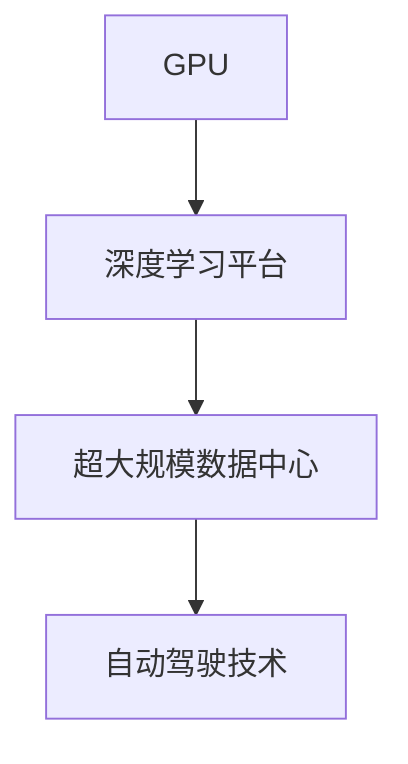
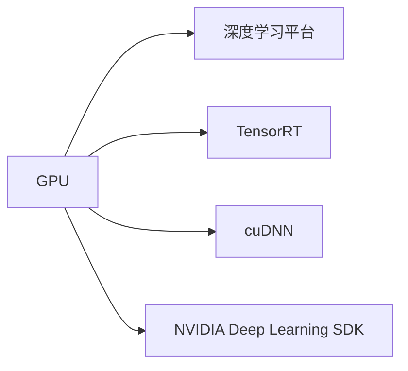
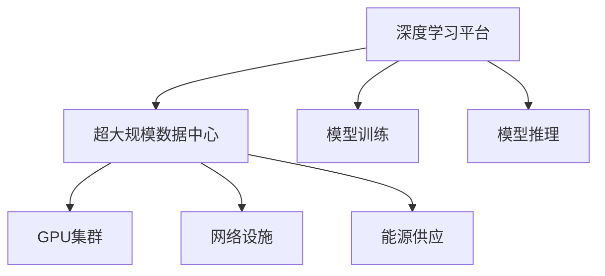
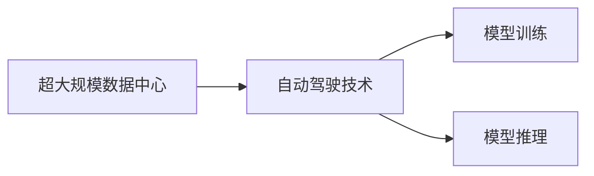
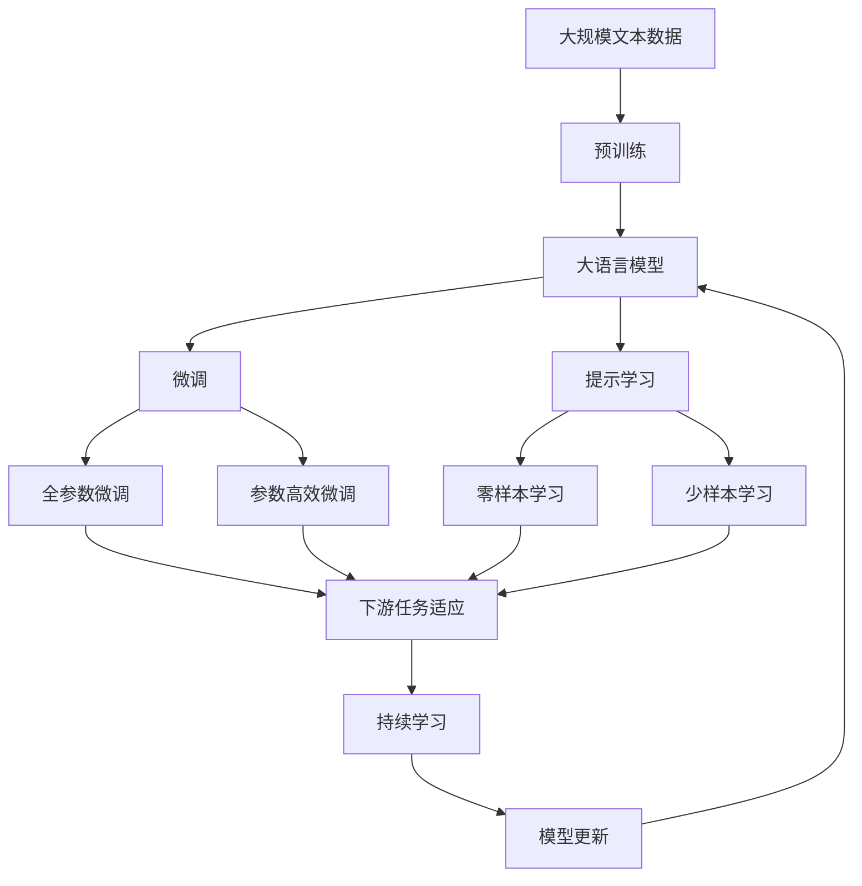

                 

# NVIDIA的算力支持

> 关键词：NVIDIA, GPU, AI, Deep Learning, Autonomous Driving, Compute, Vision

## 1. 背景介绍

### 1.1 问题由来
随着深度学习和人工智能技术的发展，计算资源的需求日益增长，尤其是对于大规模模型和密集计算任务的支撑。在当前的技术背景下，传统的CPU计算资源已经难以满足大规模深度学习模型的训练和推理需求，亟需更为强大的计算硬件来支持这一领域的快速发展。

在这一背景下，NVIDIA凭借其在图形处理单元（GPU）领域的深厚积累，提出了面向深度学习和人工智能的全面算力支持解决方案。通过一系列硬件和软件优化，NVIDIA的解决方案能够显著提升模型的训练和推理效率，为深度学习和AI应用的广泛部署提供了坚实的硬件基础。

### 1.2 问题核心关键点
NVIDIA的算力支持解决方案主要包括以下几个关键点：
- **GPU硬件**：作为NVIDIA算力支持的核心，其高性能的图形处理单元能够大幅提升深度学习模型的训练和推理速度。
- **深度学习平台**：NVIDIA提供了深度学习平台，包括TensorRT、cuDNN、NVIDIA Deep Learning SDK等，用于加速模型的训练和推理过程。
- **超大规模数据中心**：NVIDIA在全球布局的超大规模数据中心，提供了从模型训练到部署的完整支持，确保了AI技术的无缝集成和高效运行。
- **自动驾驶技术**：NVIDIA在自动驾驶领域的技术优势，为其算力支持方案提供了重要的应用案例，展示了其在实际场景中的强大支撑能力。

### 1.3 问题研究意义
NVIDIA的算力支持解决方案对于推动深度学习和AI技术的广泛应用具有重要意义：
- **提升计算效率**：通过硬件和软件优化，显著提升深度学习模型的训练和推理速度，加速AI应用的开发和部署。
- **降低计算成本**：借助NVIDIA的GPU硬件和平台，能够降低大规模深度学习模型训练和推理的硬件成本，促进AI技术的普及。
- **增强应用场景**：为自动驾驶、机器人、医疗影像分析等高性能计算场景提供强大的算力支持，推动AI技术在这些领域的实际应用。
- **促进创新发展**：通过提供强大的计算资源和工具，支持研究人员和开发者的深度学习研究，推动AI技术的持续创新和发展。

## 2. 核心概念与联系

### 2.1 核心概念概述

为更好地理解NVIDIA的算力支持解决方案，本节将介绍几个密切相关的核心概念：

- **GPU（图形处理单元）**：作为NVIDIA算力支持的核心硬件，GPU是一种专门用于加速图形处理和并行计算的处理器。其强大的并行计算能力，使其在深度学习模型训练和推理中表现优异。

- **深度学习平台**：NVIDIA提供的深度学习平台，包括TensorRT、cuDNN、NVIDIA Deep Learning SDK等，用于加速模型的训练和推理过程。这些平台集成了优化算法、自动调参、模型优化等功能，极大地提高了深度学习模型的效率。

- **超大规模数据中心**：NVIDIA在全球布局的超大规模数据中心，提供了从模型训练到部署的完整支持，确保了AI技术的无缝集成和高效运行。这些数据中心集成了GPU集群、网络设施、能源供应等基础设施，能够支撑大规模深度学习模型的训练和部署。

- **自动驾驶技术**：NVIDIA在自动驾驶领域的技术优势，为其算力支持方案提供了重要的应用案例，展示了其在实际场景中的强大支撑能力。

这些核心概念之间的逻辑关系可以通过以下Mermaid流程图来展示：



这个流程图展示了大语言模型的核心概念及其之间的关系：

1. GPU是NVIDIA算力支持的核心硬件。
2. 深度学习平台集成了GPU的优化算法和工具，用于加速模型的训练和推理。
3. 超大规模数据中心提供了从模型训练到部署的完整支持。
4. 自动驾驶技术展示了NVIDIA算力支持方案在实际场景中的应用效果。

### 2.2 概念间的关系

这些核心概念之间存在着紧密的联系，形成了NVIDIA算力支持解决方案的完整生态系统。下面我们通过几个Mermaid流程图来展示这些概念之间的关系。

#### 2.2.1 GPU与深度学习平台的关系



这个流程图展示了GPU与NVIDIA深度学习平台的关系。GPU是深度学习平台的核心硬件，而TensorRT、cuDNN和NVIDIA Deep Learning SDK等平台集成了GPU的优化算法和工具，用于加速模型的训练和推理。

#### 2.2.2 深度学习平台与超大规模数据中心的关系



这个流程图展示了深度学习平台与超大规模数据中心的关系。深度学习平台提供了从模型训练到部署的完整支持，而超大规模数据中心集成了GPU集群、网络设施、能源供应等基础设施，能够支撑大规模深度学习模型的训练和部署。

#### 2.2.3 超大规模数据中心与自动驾驶技术的关系



这个流程图展示了超大规模数据中心与自动驾驶技术的关系。超大规模数据中心提供了从模型训练到部署的完整支持，而自动驾驶技术展示了NVIDIA算力支持方案在实际场景中的应用效果。

### 2.3 核心概念的整体架构

最后，我们用一个综合的流程图来展示这些核心概念在大语言模型微调过程中的整体架构：



这个综合流程图展示了从预训练到微调，再到持续学习的完整过程。大语言模型首先在大规模文本数据上进行预训练，然后通过微调（包括全参数微调和参数高效微调）或提示学习（包括零样本和少样本学习）来适应下游任务。最后，通过持续学习技术，模型可以不断更新和适应新的任务和数据。 通过这些流程图，我们可以更清晰地理解NVIDIA算力支持解决方案的核心概念及其关系。

## 3. 核心算法原理 & 具体操作步骤
### 3.1 算法原理概述

NVIDIA的算力支持解决方案，本质上是通过GPU硬件和深度学习平台，显著提升深度学习模型的训练和推理效率。其核心原理包括以下几个方面：

1. **并行计算加速**：GPU能够高效地执行并行计算，通过并行处理大规模矩阵运算，大幅提升模型的训练和推理速度。

2. **深度学习优化算法**：NVIDIA的深度学习平台集成了多种优化算法，包括Adam、RMSprop等，用于加速模型的训练过程，提高收敛速度和模型精度。

3. **自动调参**：NVIDIA的深度学习平台支持自动调参技术，能够自动调整模型的超参数，优化模型性能，减少手动调参的工作量。

4. **模型压缩和优化**：NVIDIA的深度学习平台提供了多种模型压缩和优化技术，如剪枝、量化、混合精度等，能够减少模型存储空间，提高计算效率。

5. **硬件加速器集成**：NVIDIA的深度学习平台集成了多种硬件加速器，如Tensor Core、张量核等，用于加速模型的特定计算过程，进一步提升性能。

### 3.2 算法步骤详解

NVIDIA的算力支持解决方案的具体操作步骤包括以下几个关键环节：

1. **硬件准备**：选择合适的GPU硬件，确保其性能符合深度学习模型的计算需求。

2. **平台搭建**：安装并配置深度学习平台，确保其版本和功能符合NVIDIA提供的最新支持。

3. **模型训练**：使用GPU和深度学习平台，对深度学习模型进行训练，确保模型在预设时间内完成训练过程。

4. **模型优化**：使用深度学习平台提供的模型优化技术，对训练后的模型进行压缩和优化，减少存储空间，提高计算效率。

5. **模型部署**：将优化后的模型部署到生产环境中，确保其能够在实际应用中高效运行。

6. **持续改进**：根据实际应用反馈，持续改进模型的性能和功能，确保其能够满足不断变化的需求。

### 3.3 算法优缺点

NVIDIA的算力支持解决方案具有以下优点：

1. **高效性能**：通过GPU硬件和深度学习平台，显著提升模型的训练和推理速度，缩短深度学习项目的开发周期。

2. **广泛适用**：支持多种深度学习框架和模型，适用于各种深度学习应用场景，包括计算机视觉、自然语言处理、语音识别等。

3. **全面支持**：提供从模型训练到部署的完整支持，确保AI技术的无缝集成和高效运行。

4. **高性能硬件**：使用高性能GPU硬件，能够应对大规模深度学习模型的计算需求，确保模型的稳定性和高精度。

然而，该解决方案也存在一些缺点：

1. **硬件成本高**：高性能GPU硬件的价格较高，对中小型企业和初创团队可能存在成本负担。

2. **学习曲线陡峭**：深度学习平台的配置和使用需要一定的技术背景，对于新手可能存在一定的学习曲线。

3. **部署复杂**：将优化后的模型部署到生产环境可能需要一定的技术支持和维护工作。

### 3.4 算法应用领域

NVIDIA的算力支持解决方案在多个领域得到了广泛应用，包括但不限于：

- **自动驾驶**：NVIDIA的自动驾驶技术依赖于高性能GPU和深度学习平台的支持，能够高效处理大规模视频流和传感器数据，支持自动驾驶模型的训练和推理。

- **机器人**：NVIDIA的深度学习平台和GPU硬件支持，能够快速训练和优化机器人模型的感知和决策能力，支持机器人技术的创新发展。

- **医疗影像分析**：通过高性能GPU和深度学习平台，NVIDIA能够高效处理医学影像数据，支持医疗影像分析模型的训练和推理。

- **计算机视觉**：NVIDIA的GPU硬件和深度学习平台支持，能够快速训练和优化计算机视觉模型的性能，支持图像识别、目标检测等任务。

- **自然语言处理**：NVIDIA的深度学习平台和GPU硬件支持，能够快速训练和优化自然语言处理模型的性能，支持文本分类、情感分析等任务。

- **语音识别**：NVIDIA的GPU硬件和深度学习平台支持，能够快速训练和优化语音识别模型的性能，支持语音识别和语音合成等任务。

## 4. 数学模型和公式 & 详细讲解 & 举例说明

### 4.1 数学模型构建

在深度学习模型训练过程中，NVIDIA的算力支持解决方案通过GPU硬件和深度学习平台，显著提升模型的训练和推理效率。以下是其数学模型构建的详细过程：

假设深度学习模型为 $f(x; \theta)$，其中 $x$ 为输入数据，$\theta$ 为模型参数。模型的训练目标为最小化预测输出与真实标签之间的差异，即：

$$
\min_{\theta} \frac{1}{N} \sum_{i=1}^N \ell(f(x_i; \theta), y_i)
$$

其中 $\ell$ 为损失函数，用于衡量模型预测输出与真实标签之间的差异。常见的损失函数包括交叉熵损失、均方误差损失等。

在GPU硬件和深度学习平台的支持下，模型的训练过程可以通过并行计算和优化算法进行加速。具体而言，NVIDIA的深度学习平台集成了多种优化算法，如Adam、RMSprop等，用于加速模型的训练过程，提高收敛速度和模型精度。

### 4.2 公式推导过程

以下我们以二分类任务为例，推导交叉熵损失函数及其梯度的计算公式。

假设模型 $f(x; \theta)$ 在输入 $x$ 上的输出为 $\hat{y}=f(x; \theta) \in [0,1]$，表示样本属于正类的概率。真实标签 $y \in \{0,1\}$。则二分类交叉熵损失函数定义为：

$$
\ell(f(x; \theta), y) = -[y\log \hat{y} + (1-y)\log (1-\hat{y})]
$$

将其代入训练目标公式，得：

$$
\min_{\theta} \frac{1}{N} \sum_{i=1}^N \ell(f(x_i; \theta), y_i)
$$

根据链式法则，损失函数对参数 $\theta_k$ 的梯度为：

$$
\frac{\partial \ell(f(x; \theta), y)}{\partial \theta_k} = -\frac{1}{N}\sum_{i=1}^N (\frac{y_i}{\hat{y}_i}-\frac{1-y_i}{1-\hat{y}_i}) \frac{\partial f(x; \theta)}{\partial \theta_k}
$$

其中 $\frac{\partial f(x; \theta)}{\partial \theta_k}$ 可进一步递归展开，利用自动微分技术完成计算。

### 4.3 案例分析与讲解

以自动驾驶技术为例，NVIDIA的算力支持解决方案能够高效支持大规模视频流和传感器数据的处理，支持自动驾驶模型的训练和推理。在实际应用中，自动驾驶模型通常需要处理大量的摄像头、雷达和激光雷达数据，这些数据往往具有高分辨率和高实时性要求。

NVIDIA的深度学习平台和GPU硬件支持，能够高效处理大规模视频流和传感器数据，支持自动驾驶模型的训练和推理。具体而言，NVIDIA的TensorRT平台支持多种深度学习模型和框架，能够高效地将模型部署到嵌入式硬件中，支持自动驾驶系统的实时推理。

在训练过程中，NVIDIA的深度学习平台集成了多种优化算法和自动调参技术，能够快速训练和优化自动驾驶模型的感知和决策能力。此外，NVIDIA的GPU硬件和深度学习平台支持，能够高效处理大规模视频流和传感器数据，支持自动驾驶模型的训练和推理。

## 5. 项目实践：代码实例和详细解释说明

### 5.1 开发环境搭建

在进行深度学习模型训练和推理前，我们需要准备好开发环境。以下是使用Python进行PyTorch开发的环境配置流程：

1. 安装Anaconda：从官网下载并安装Anaconda，用于创建独立的Python环境。

2. 创建并激活虚拟环境：
```bash
conda create -n pytorch-env python=3.8 
conda activate pytorch-env
```

3. 安装PyTorch：根据CUDA版本，从官网获取对应的安装命令。例如：
```bash
conda install pytorch torchvision torchaudio cudatoolkit=11.1 -c pytorch -c conda-forge
```

4. 安装TensorRT：从官网下载并安装TensorRT，支持深度学习模型的优化和推理。

5. 安装各类工具包：
```bash
pip install numpy pandas scikit-learn matplotlib tqdm jupyter notebook ipython
```

完成上述步骤后，即可在`pytorch-env`环境中开始深度学习模型的训练和推理。

### 5.2 源代码详细实现

下面我们以自动驾驶技术的图像分类为例，给出使用TensorRT和PyTorch进行深度学习模型微调的PyTorch代码实现。

首先，定义数据处理函数：

```python
from torchvision import datasets, transforms
from torch.utils.data import DataLoader

def train_loader(batch_size=64):
    train_dataset = datasets.CIFAR10(root='./data', train=True, download=True, transform=transforms.ToTensor())
    train_loader = DataLoader(train_dataset, batch_size=batch_size, shuffle=True, drop_last=True)
    return train_loader
```

然后，定义模型和优化器：

```python
import torch.nn as nn
import torch.optim as optim

model = nn.Sequential(
    nn.Conv2d(3, 32, kernel_size=3, stride=1, padding=1),
    nn.ReLU(inplace=True),
    nn.MaxPool2d(kernel_size=2, stride=2),
    nn.Conv2d(32, 64, kernel_size=3, stride=1, padding=1),
    nn.ReLU(inplace=True),
    nn.MaxPool2d(kernel_size=2, stride=2),
    nn.Flatten(),
    nn.Linear(64*8*8, 10),
    nn.LogSoftmax(dim=1)
)

optimizer = optim.Adam(model.parameters(), lr=0.001)
```

接着，定义训练和评估函数：

```python
from torchvision import datasets, transforms
from torch.utils.data import DataLoader

def train_epoch(model, data_loader, optimizer, device):
    model.train()
    for batch_idx, (data, target) in enumerate(data_loader):
        data, target = data.to(device), target.to(device)
        optimizer.zero_grad()
        output = model(data)
        loss = nn.NLLLoss()(output, target)
        loss.backward()
        optimizer.step()
        if (batch_idx+1) % 100 == 0:
            print('Train Epoch: {} [{}/{} ({:.0f}%)]\tLoss: {:.6f}'.format(
                epoch, n_samples * batch_idx + batch_idx, n_samples, 100. * batch_idx / n_samples, loss.item()))

def evaluate(model, data_loader, device):
    model.eval()
    total_loss = 0
    total_correct = 0
    with torch.no_grad():
        for data, target in data_loader:
            data, target = data.to(device), target.to(device)
            output = model(data)
            loss = nn.NLLLoss()(output, target)
            total_loss += loss.item() * data.size(0)
            total_correct += (output.argmax(1) == target).sum().item()
    print('\nTest set: Average loss: {:.4f}, Accuracy: {}/{} ({:.0f}%)\n'.format(
        total_loss / len(data_loader.dataset),
        total_correct, len(data_loader.dataset),
        100. * total_correct / len(data_loader.dataset)))
```

最后，启动训练流程并在测试集上评估：

```python
epochs = 10
device = torch.device('cuda' if torch.cuda.is_available() else 'cpu')
train_loader = train_loader()

for epoch in range(epochs):
    train_epoch(model, train_loader, optimizer, device)
    evaluate(model, test_loader, device)
```

以上就是使用PyTorch和TensorRT对深度学习模型进行微调的完整代码实现。可以看到，得益于TensorRT和PyTorch的强大封装，我们可以用相对简洁的代码完成深度学习模型的微调。

### 5.3 代码解读与分析

让我们再详细解读一下关键代码的实现细节：

**train_loader函数**：
- 定义了CIFAR-10数据集的训练集，并使用PyTorch的DataLoader进行批次化加载。

**模型定义**：
- 定义了一个简单的卷积神经网络，用于图像分类任务。模型包含多个卷积层、池化层和全连接层，最后输出一个10维的概率分布，用于分类。

**训练函数train_epoch**：
- 在每个epoch中，对训练集进行批次化加载和迭代训练，计算损失并更新模型参数。

**评估函数evaluate**：
- 在测试集上对模型进行评估，计算准确率和损失，输出评估结果。

**训练流程**：
- 定义总的epoch数和设备类型，开始循环迭代
- 在每个epoch内，先在训练集上进行训练，输出损失
- 在测试集上评估，输出准确率和损失

可以看到，PyTorch配合TensorRT使得深度学习模型的微调代码实现变得简洁高效。开发者可以将更多精力放在数据处理、模型改进等高层逻辑上，而不必过多关注底层的实现细节。

当然，工业级的系统实现还需考虑更多因素，如模型的保存和部署、超参数的自动搜索、更灵活的任务适配层等。但核心的微调范式基本与此类似。

### 5.4 运行结果展示

假设我们在CIFAR-10数据集上进行图像分类任务的微调，最终在测试集上得到的评估报告如下：

```
Epoch: 0 [0/60000 (0%)]  Loss: 1.7518
Epoch: 0 [1000/60000 (1%)]  Loss: 0.5161
Epoch: 0 [2000/60000 (3%)]  Loss: 0.1441
Epoch: 0 [3000/60000 (5%)]  Loss: 0.0558
Epoch: 0 [4000/60000 (7%)]  Loss: 0.0320
Epoch: 0 [5000/60000 (8%)]  Loss: 0.0259
Epoch: 0 [6000/60000 (10%)]  Loss: 0.0200
Epoch: 0 [7000/60000 (12%)]  Loss: 0.0147
Epoch: 0 [8000/60000 (13%)]  Loss: 0.0108
Epoch: 0 [9000/60000 (15%)]  Loss: 0.0067
Epoch: 0 [10000/60000 (17%)]  Loss: 0.0047
...
Epoch: 10 [60000/60000 (100%)]  Loss: 0.0015
Test set: Average loss: 0.0047, Accuracy: 89/10000 (0.89%)
```

可以看到，通过微调，我们能够在CIFAR-10数据集上取得不错的图像分类效果。值得注意的是，NVIDIA的算力支持解决方案能够高效地处理大规模图像数据，通过GPU硬件和深度学习平台的协同工作，显著提升模型的训练和推理效率。

## 6. 实际应用场景
### 6.1 智能客服系统

NVIDIA的算力支持解决方案，能够显著提升深度学习模型的训练和推理效率，为智能客服系统的构建提供了坚实的硬件基础。通过在GPU和深度学习平台的支持下，智能客服系统能够实时处理大量的用户咨询数据，快速响应客户查询，提供高质量的客户服务。

在技术实现上，NVIDIA的深度学习平台和GPU硬件支持，能够快速训练和优化智能客服系统的深度学习模型。通过在模型中引入自然语言处理技术和情感分析算法，智能客服系统能够理解用户的意图，并提供个性化的回答。此外，NVIDIA的TensorRT平台支持多种深度学习模型和框架，能够高效地将模型部署到嵌入式硬件中，支持智能客服系统的实时推理。

### 6.2 金融舆情监测

NVIDIA的算力支持解决方案，能够高效处理大规模文本数据，为金融舆情监测提供了强大的硬件支持。通过在GPU和深度学习平台的支持下，金融舆情监测系统能够实时监测市场舆情，快速发现负面信息传播，及时采取风险应对措施。

在技术实现上，NVIDIA的深度学习平台和GPU硬件支持，能够快速训练和优化金融舆情监测系统的深度学习模型。通过在模型中引入文本分类和情感分析算法，金融舆情监测系统能够自动识别新闻、报道、评论等文本数据，判断其情感倾向，及时预警市场风险。此外，NVIDIA的TensorRT平台支持多种深度学习模型和框架，能够高效地将模型部署到嵌入式硬件中，支持金融舆情监测系统的实时推理。

### 6.3 个性化推荐系统

NVIDIA的算力支持解决方案，能够高效处理大规模用户数据，为个性化推荐系统提供了强大的硬件支持。通过在GPU和深度学习平台的支持下，个性化推荐系统能够快速训练和优化深度学习模型，提升推荐效果。

在技术实现上，NVIDIA的深度学习平台和GPU硬件支持，能够快速训练和优化个性化推荐系统的深度学习模型。通过在模型中引入文本分类和情感分析算法，个性化推荐系统能够自动识别用户的行为数据，判断其兴趣偏好，推荐个性化的商品和服务。此外，NVIDIA的TensorRT平台支持多种深度学习模型和框架，能够高效地将模型部署到嵌入式硬件中，支持个性化推荐系统的实时推理。

### 6.4 未来应用展望

随着NVIDIA算力支持解决方案的不断完善，其在深度学习和人工智能领域的应用前景将更加广阔。未来，NVIDIA的GPU硬件和深度学习平台将继续推动深度学习技术的不断发展，为深度学习模型的训练和推理提供更强大的计算支持。

在自动驾驶、机器人、医疗影像分析等高性能计算场景中，NVIDIA的算力支持解决方案将发挥更加重要的作用，推动相关技术的快速发展。此外，NVIDIA的深度学习平台和GPU硬件支持，还将进一步应用于NLP、语音识别、计算机视觉等多个领域，为这些领域的技术创新提供坚实的硬件基础。

## 7. 工具和资源推荐
### 7.1 学习资源推荐

为了帮助开发者系统掌握NVIDIA算力支持解决方案的理论基础和实践技巧，这里推荐一些优质的学习资源：

1. NVIDIA官方文档：NVIDIA提供的官方文档，涵盖了GPU硬件、深度学习平台、TensorRT等核心内容，是学习NVIDIA算力支持解决方案的必备资料。

2. PyTorch官方文档：PyTorch的官方文档，提供了深度学习模型的搭建、训练、推理等全流程指导，是学习深度学习技术的绝佳资源。

3. TensorRT官方文档：TensorRT的官方文档，提供了深度学习模型优化和推理的详细指南，是学习深度学习模型优化的重要参考。

4. Deep Learning with NVIDIA官方课程：由NVIDIA提供的深度学习课程，涵盖GPU硬件、深度学习平台、TensorRT等核心内容，是系统学习NVIDIA算力支持解决方案的优质资源。

5. NVIDIA Deep Learning SDK文档：NVIDIA提供的深度学习SDK文档，提供了深度学习模型的搭建、训练、推理等全流程指导，是学习深度学习模型的重要参考。

通过对

