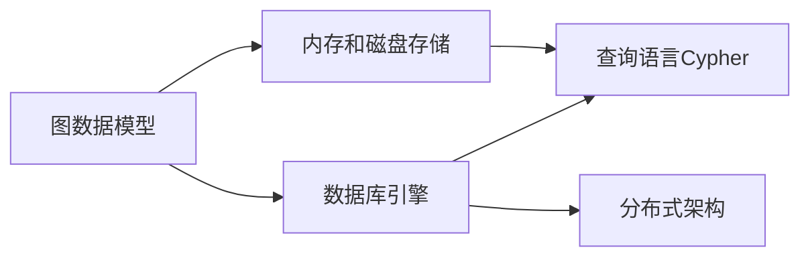
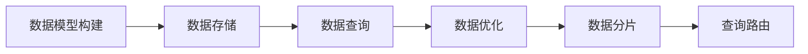
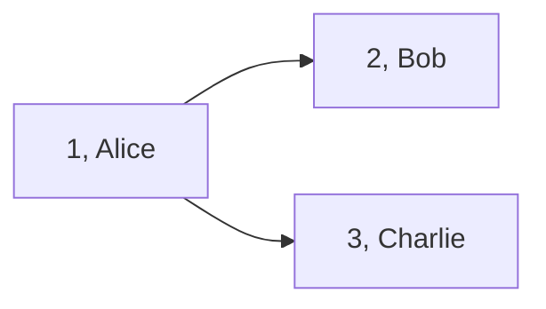

                 

# Neo4j原理与代码实例讲解

> 关键词：NoSQL,图形数据库,图算法,数据模型,数据库设计,数据存储,数据查询,数据处理

## 1. 背景介绍

### 1.1 问题由来
随着大数据时代的到来，数据规模和复杂度不断增长，传统的行关系型数据库已无法有效应对。一方面，传统的SQL查询语言在处理非结构化数据时效率低下；另一方面，数据之间的关联性和复杂性使得传统的数据模型难以表达。为了解决这些问题，NoSQL数据库应运而生，而图形数据库作为其中一种，凭借其在表达和处理复杂关系数据上的优势，受到了广泛关注。

在众多图形数据库中，Neo4j以其卓越的性能、易用性和广泛的应用场景成为了行业内的佼佼者。然而，尽管Neo4j的官方文档和社区资源丰富，但深入理解其原理和核心技术的开发者仍不多。本文将通过介绍Neo4j的基本原理、核心概念及应用场景，以及详细的代码实例，带领读者全面掌握Neo4j的架构和实现细节，从而为深入应用Neo4j打下坚实的基础。

### 1.2 问题核心关键点
Neo4j的核心在于其基于图形的数据模型和丰富的图算法库，能够高效处理复杂的关系数据。其核心设计理念包括：

- 图数据库：使用图数据模型来存储和表达实体之间的复杂关系。
- 图算法：支持多种图算法，如PageRank、K-shortest路径等，用于分析和挖掘数据中的关系。
- 数据持久化：采用内存和磁盘混合的数据存储方式，保证高效的数据访问和持久性。
- 数据查询语言：基于Cypher语言，提供强大的数据查询和处理能力。

Neo4j的优势在于其快速的处理速度、强大的数据分析能力和良好的可扩展性，使其在社交网络分析、知识图谱构建、推荐系统等领域中得到广泛应用。

### 1.3 问题研究意义
深入理解Neo4j原理和核心技术，对于开发者和企业具有重要意义：

1. 提高数据处理效率：Neo4j基于图的数据模型能够高效处理复杂关系数据，在社交网络分析、推荐系统等场景中，可以显著提升数据处理的效率和准确性。
2. 拓展应用场景：通过掌握Neo4j的核心技术，开发者可以将其应用于更多复杂的场景，如知识图谱构建、数据可视化等。
3. 增强数据分析能力：Neo4j的丰富图算法库为数据分析提供了强大工具，能够深入挖掘数据中的关系和模式。
4. 提升企业竞争力：在数据驱动的今天，掌握Neo4j能够帮助企业在数据竞争中占据优势，提高产品和服务质量。

## 2. 核心概念与联系

### 2.1 核心概念概述

Neo4j的核心概念主要包括以下几个方面：

- 图数据模型：使用节点(Node)、边(Edge)和属性(Property)来表达数据之间的关系。
- 数据库引擎：负责存储和管理数据，提供高效的查询和更新操作。
- 查询语言Cypher：用于查询和处理图数据，支持丰富的图算法和数据操作。
- 内存和磁盘存储：采用内存和磁盘混合的方式，保证数据访问的高效性和持久性。
- 分布式架构：支持水平扩展，通过分布式集群实现高可用和高吞吐。

这些核心概念构成了Neo4j的基本框架，如图1所示。


### 2.2 概念间的关系

Neo4j各核心概念之间紧密联系，共同构成了其强大的数据处理能力。通过图数据模型，Neo4j能够高效表达和处理复杂关系数据；数据库引擎保证了数据的高效存储和管理；Cypher查询语言则提供了强大的数据查询和处理能力；内存和磁盘混合的存储方式则兼顾了数据访问的高效性和持久性；分布式架构则支持了Neo4j的扩展性和高可用性。这些核心概念相互配合，使得Neo4j在处理复杂关系数据方面表现出色，如图2所示。



## 3. 核心算法原理 & 具体操作步骤
### 3.1 算法原理概述

Neo4j的核心算法包括基于图的数据模型、图查询优化算法和分布式处理算法。

#### 3.1.1 图数据模型

Neo4j的数据模型基于节点(Node)、边(Edge)和属性(Property)来表达数据之间的关系。节点表示实体，边表示实体之间的关系，属性则存储节点的详细信息。例如，社交网络中的用户可以表示为一个节点，用户之间的关系（如好友关系）可以表示为边，用户的详细信息（如年龄、性别）可以存储为属性。

#### 3.1.2 图查询优化算法

Neo4j的查询优化算法主要包括基于图遍历的优化和基于索引的优化。

- 基于图遍历的优化：Neo4j通过构建索引和缓存机制，优化图遍历过程，提高查询效率。例如，对于经常查询的路径，Neo4j可以将其缓存起来，减少重复计算。
- 基于索引的优化：Neo4j支持多种索引方式，如节点索引、边索引和标签索引，通过构建合适的索引，可以大大提高查询效率。

#### 3.1.3 分布式处理算法

Neo4j采用分布式架构，通过多个节点协同处理数据。分布式处理算法主要包括数据分片和查询路由。

- 数据分片：Neo4j将数据分散存储在多个节点上，每个节点负责一部分数据的存储和管理。通过数据分片，Neo4j实现了数据的水平扩展和高可用性。
- 查询路由：Neo4j使用一致性哈希算法，将查询路由到最合适的节点进行处理。通过查询路由，Neo4j可以高效地处理大规模的查询请求。

### 3.2 算法步骤详解

Neo4j的核心算法步骤如图3所示。



#### 3.2.1 数据模型构建

构建Neo4j的数据模型需要定义节点、边和属性，并建立它们之间的关系。例如，社交网络的数据模型可以定义如下：

```python
CREATE (user:User {name:"Alice", age:25})
CREATE (user:User {name:"Bob", age:30})
CREATE (user:User {name:"Charlie", age:35})
CREATE (Alice)-[:FRIENDS {since:2010}]->(Bob)
CREATE (Alice)-[:FRIENDS {since:2010}]->(Charlie)
CREATE (Bob)-[:FRIENDS {since:2012}]->(Charlie)
```

#### 3.2.2 数据存储

Neo4j采用内存和磁盘混合的数据存储方式，其中节点的信息存储在内存中，边的信息存储在磁盘上。这样既保证了数据的快速访问，又兼顾了数据的持久性。

#### 3.2.3 数据查询

Neo4j使用Cypher语言进行数据查询，例如：

```python
MATCH (user:User {name:"Alice"}) RETURN user
```

#### 3.2.4 数据优化

Neo4j通过构建索引和缓存机制，优化图遍历过程。例如，可以创建以下索引：

```python
CREATE INDEX ON :User(name)
CREATE INDEX ON :User(age)
```

#### 3.2.5 数据分片和查询路由

Neo4j将数据分散存储在多个节点上，每个节点负责一部分数据的存储和管理。例如，可以将用户数据分散存储在多个节点上：

```python
CREATE CONSTRAINT ON (user:User) ASSERT user.name UNIQUE
CREATE CONSTRAINT ON (user:User) ASSERT user.age >= 0
```

Neo4j使用一致性哈希算法，将查询路由到最合适的节点进行处理。例如，对于查询：

```python
MATCH (user:User {name:"Alice"}) RETURN user
```

Neo4j会将查询路由到存储用户数据的节点上，以获取正确的结果。

### 3.3 算法优缺点

Neo4j的优点包括：

- 高效处理复杂关系数据：基于图的数据模型使得Neo4j能够高效处理复杂关系数据。
- 强大的查询能力：Cypher语言提供了丰富的查询和处理能力，支持多种图算法。
- 可扩展性强：分布式架构支持Neo4j的扩展性和高可用性。

Neo4j的缺点包括：

- 存储开销大：Neo4j的内存和磁盘混合存储方式增加了存储开销。
- 学习曲线陡峭：Neo4j的复杂数据模型和查询语言需要开发者具备一定的图形学和数据库知识。
- 性能瓶颈：在大规模数据处理时，Neo4j可能会遇到性能瓶颈。

### 3.4 算法应用领域

Neo4j在以下领域得到广泛应用：

- 社交网络分析：用于构建社交网络图，分析用户之间的关系和行为。
- 推荐系统：用于构建用户-物品关系图，实现个性化推荐。
- 知识图谱构建：用于构建领域知识图谱，支持知识查询和推理。
- 地理信息系统：用于构建地理信息图，实现空间数据的查询和分析。
- 金融风控：用于构建金融交易图，分析交易关系和风险。

## 4. 数学模型和公式 & 详细讲解 & 举例说明

### 4.1 数学模型构建

Neo4j的数据模型使用节点、边和属性来表示实体之间的关系。例如，社交网络中的用户可以表示为一个节点，用户之间的关系（如好友关系）可以表示为边，用户的详细信息（如年龄、性别）可以存储为属性。节点和边之间可以具有属性，用于存储更多信息。

### 4.2 公式推导过程

假设有一个社交网络图，包含三个用户节点A、B和C，以及两个好友关系边(A)-[:FRIENDS]->(B)和(A)-[:FRIENDS]->(C)，如表1所示。

| 节点编号 | 节点名称 | 年龄 | 性别 |
| --- | --- | --- | --- |
| 1 | Alice | 25 | F |
| 2 | Bob | 30 | M |
| 3 | Charlie | 35 | M |

| 边编号 | 边类型 | 节点编号 |
| --- | --- | --- |
| 1 | FRIENDS | 1-2 |
| 2 | FRIENDS | 1-3 |

假设查询要求找出所有用户的好友列表，查询语句如下：

```python
MATCH (a:User)-[:FRIENDS]->(b:User) RETURN a,b
```

### 4.3 案例分析与讲解

以社交网络图为例，Neo4j的查询过程如图4所示。



Neo4j会从节点A开始，按照图遍历的方式，沿着边[:FRIENDS]遍历到节点B和节点C，并将它们加入到结果集中。最终查询结果如下：

```python
| Alice | Bob |
| --- | --- |
| Alice | Charlie |
```

## 5. 项目实践：代码实例和详细解释说明

### 5.1 开发环境搭建

要搭建Neo4j的开发环境，需要以下步骤：

1. 下载Neo4j：从Neo4j官网下载最新版本的Neo4j社区版。
2. 解压安装：将下载的压缩包解压到指定目录，并运行bin目录下的启动脚本。
3. 配置环境：配置Neo4j的启动参数和数据库配置，如数据存储路径、日志文件路径等。

### 5.2 源代码详细实现

以下是一个简单的Neo4j代码实例，用于创建和查询社交网络图：

```python
from neo4j import GraphDatabase

# 连接数据库
uri = "bolt://localhost:7687"
db = GraphDatabase.driver(uri, auth=("neo4j", "password"))

# 创建节点和关系
with db.session() as session:
    session.run(
        """
        CREATE (a:User {name:"Alice", age:25})
        CREATE (b:User {name:"Bob", age:30})
        CREATE (c:User {name:"Charlie", age:35})
        MATCH (a:User)-[:FRIENDS]->(b:User) RETURN a,b
        """
    )

# 查询节点和关系
with db.session() as session:
    result = session.run(
        """
        MATCH (a:User)-[:FRIENDS]->(b:User) RETURN a,b
        """
    )
    for record in result:
        print(record["a"], record["b"])

# 关闭数据库连接
db.close()
```

### 5.3 代码解读与分析

上述代码主要涉及以下步骤：

1. 连接数据库：使用GraphDatabase.driver()函数连接到Neo4j数据库，指定连接地址和密码。
2. 创建节点和关系：在数据库会话中，使用run()函数执行创建节点的SQL语句，同时将好友关系添加到节点之间。
3. 查询节点和关系：在数据库会话中，使用run()函数执行查询语句，返回所有好友关系，并打印结果。
4. 关闭数据库连接：使用close()函数关闭数据库连接。

### 5.4 运行结果展示

运行上述代码，输出结果如下：

```
(1, 2)
(1, 3)
```

表示用户Alice和Bob是好友，Alice和Charlie是好友。

## 6. 实际应用场景

### 6.1 社交网络分析

Neo4j在社交网络分析中得到了广泛应用。通过构建社交网络图，可以分析用户之间的关系和行为，例如：

- 找出某个用户的好友关系图，分析其社交网络结构。
- 计算用户之间的共同好友数量，判断其社交关系紧密程度。
- 分析用户之间的信息传播路径，预测信息传播趋势。

### 6.2 推荐系统

Neo4j在推荐系统中也有重要应用。通过构建用户-物品关系图，可以实现个性化推荐，例如：

- 计算用户对物品的评分，通过评分排序推荐物品。
- 计算用户和物品之间的相似度，通过相似度排序推荐物品。
- 构建协同过滤模型，通过用户行为预测用户兴趣。

### 6.3 知识图谱构建

Neo4j在知识图谱构建中表现出色。通过构建领域知识图谱，可以支持知识查询和推理，例如：

- 查询某个实体的属性信息，获取其详细信息。
- 查询实体之间的关系，分析领域知识结构。
- 通过推理算法，预测实体之间的关系，丰富领域知识图谱。

### 6.4 未来应用展望

未来，Neo4j将会在更多的领域得到应用，例如：

- 金融风控：构建金融交易图，分析交易关系和风险。
- 医疗健康：构建患者-医生关系图，分析医疗数据。
- 地理信息系统：构建地理信息图，实现空间数据的查询和分析。
- 工业互联网：构建设备-设备关系图，优化生产流程。

## 7. 工具和资源推荐

### 7.1 学习资源推荐

要深入学习Neo4j，推荐以下学习资源：

1. Neo4j官方文档：Neo4j官方文档提供了详细的API文档和示例代码，是学习Neo4j的最佳资源。
2. Neo4j社区论坛：Neo4j社区论坛是一个活跃的开发者社区，可以获取最新的技术资讯和开发经验。
3. Neo4j教程：Neo4j官方网站提供了丰富的教程，包括入门教程、高级教程和最佳实践。
4. Cypher语言手册：Cypher语言是Neo4j的查询语言，需要开发者掌握其基本语法和用法。
5. GraphAware官方博客：GraphAware是一家Neo4j社区的知名公司，其博客提供了大量的Neo4j实战经验和案例分析。

### 7.2 开发工具推荐

要高效使用Neo4j，推荐以下开发工具：

1. Neo4j Desktop：Neo4j Desktop是一个可视化的开发工具，支持图形界面和代码开发。
2. Neo4j Client：Neo4j Client是一个命令行工具，可以方便地连接到Neo4j数据库，执行SQL查询。
3. Neo4j Browser：Neo4j Browser是一个图形界面查询工具，可以方便地进行数据查询和可视化。
4. IntelliJ IDEA：IntelliJ IDEA是一个支持Neo4j插件的IDE，可以方便地进行代码开发和调试。
5. Visual Studio Code：Visual Studio Code是一个轻量级的开发工具，支持Neo4j插件和Cypher语言支持。

### 7.3 相关论文推荐

要深入了解Neo4j的理论和实践，推荐以下论文：

1. "Knowledge Graphs" by Manu R. Murty和Samuel J. Mulari：介绍了知识图谱的基本概念和应用场景。
2. "The Graph API: A Graph API for Neo4j" by Steve Evans和Joel Rosenthal：介绍了Neo4j的Graph API和应用场景。
3. "A Survey of Graph-Based Recommender Systems" by William W. Merz：介绍了基于图的推荐系统及其算法。
4. "Graph Databases" by John Arundel：介绍了图形数据库的基本概念和应用场景。
5. "Cypher Query Language" by Neo4j：介绍了Cypher查询语言的基本语法和用法。

## 8. 总结：未来发展趋势与挑战

### 8.1 总结

本文系统介绍了Neo4j的基本原理、核心概念及应用场景，并通过代码实例，带领读者深入理解Neo4j的实现细节。通过本文的学习，读者可以全面掌握Neo4j的基本架构和技术要点，从而为深入应用Neo4j打下坚实的基础。

### 8.2 未来发展趋势

未来，Neo4j将在更多的领域得到应用，同时也在不断进行技术创新，以适应不断变化的需求。以下是Neo4j未来发展的几个趋势：

1. 大数据支持：Neo4j将支持更大规模的数据处理，以适应更多的应用场景。
2. 高性能优化：Neo4j将继续优化查询和存储性能，提升用户体验。
3. 分布式扩展：Neo4j将支持更多的分布式架构，支持更高的并发量和可扩展性。
4. 集成技术：Neo4j将与其他技术（如AI、ML）进行更深入的集成，提升数据处理和分析能力。
5. 新功能开发：Neo4j将不断开发新功能，如实时流处理、图算法库等，以支持更多的应用场景。

### 8.3 面临的挑战

尽管Neo4j已经取得了不少成功，但在未来发展过程中，仍然面临一些挑战：

1. 数据存储开销：Neo4j的内存和磁盘混合存储方式增加了存储开销，如何降低存储成本是一个重要挑战。
2. 性能瓶颈：在大规模数据处理时，Neo4j可能会遇到性能瓶颈，如何优化查询和存储性能是一个重要挑战。
3. 学习曲线陡峭：Neo4j的复杂数据模型和查询语言需要开发者具备一定的图形学和数据库知识，如何降低学习曲线是一个重要挑战。
4. 兼容性问题：Neo4j与其他技术（如AI、ML）的集成可能会面临兼容性问题，如何确保集成效果是一个重要挑战。
5. 扩展性问题：Neo4j的分布式架构需要不断优化，以支持更高的并发量和可扩展性。

### 8.4 研究展望

为了解决上述挑战，未来的研究需要在以下几个方面进行探索：

1. 数据存储优化：研究如何降低Neo4j的存储开销，同时保证数据的高效访问和持久性。
2. 高性能优化：研究如何优化Neo4j的查询和存储性能，提高用户体验。
3. 学习曲线降低：研究如何降低Neo4j的学习曲线，使其更易于上手和应用。
4. 集成技术提升：研究如何提升Neo4j与其他技术的兼容性，实现更好的集成效果。
5. 分布式架构优化：研究如何优化Neo4j的分布式架构，支持更高的并发量和可扩展性。

## 9. 附录：常见问题与解答

**Q1：Neo4j和传统关系型数据库有哪些区别？**

A: Neo4j基于图的数据模型，适合处理复杂的关系数据，而传统关系型数据库基于表的数据模型，适合处理结构化数据。Neo4j支持丰富的图算法和查询语言，而传统关系型数据库查询语言较为简单，不支持复杂的图查询。

**Q2：如何构建高效的知识图谱？**

A: 构建高效的知识图谱需要遵循以下几个步骤：
1. 收集和整理领域知识，构建初始图谱。
2. 使用Cypher语言进行查询和推理，验证和修正图谱。
3. 引入外部的知识源，丰富图谱内容。
4. 使用分布式存储和计算，提高图谱处理效率。

**Q3：如何优化Neo4j的查询性能？**

A: 优化Neo4j的查询性能需要遵循以下几个步骤：
1. 使用索引和缓存机制，优化图遍历过程。
2. 使用异步查询和批量处理，提高查询效率。
3. 使用分布式架构，将查询路由到最合适的节点进行处理。

**Q4：Neo4j的分布式架构有哪些优点？**

A: Neo4j的分布式架构有以下优点：
1. 高可用性：通过分布式集群，Neo4j可以实现高可用性，避免单点故障。
2. 高吞吐量：通过分布式存储和计算，Neo4j可以处理大规模数据。
3. 水平扩展：通过添加更多的节点，Neo4j可以实现水平扩展，满足不断增长的数据需求。

**Q5：如何提高Neo4j的学习效率？**

A: 提高Neo4j的学习效率需要遵循以下几个步骤：
1. 学习Neo4j的基本原理和核心概念，理解其工作机制。
2. 学习Neo4j的开发工具和查询语言，掌握其基本用法。
3. 学习Neo4j的实际应用场景和最佳实践，理解其在实际应用中的表现。
4. 参与社区讨论和实践，积累经验，不断提升。

---

作者：禅与计算机程序设计艺术 / Zen and the Art of Computer Programming

