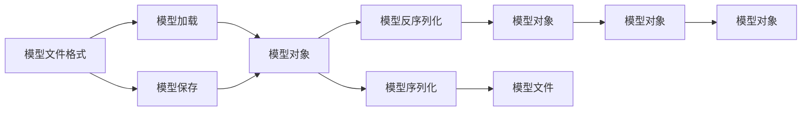
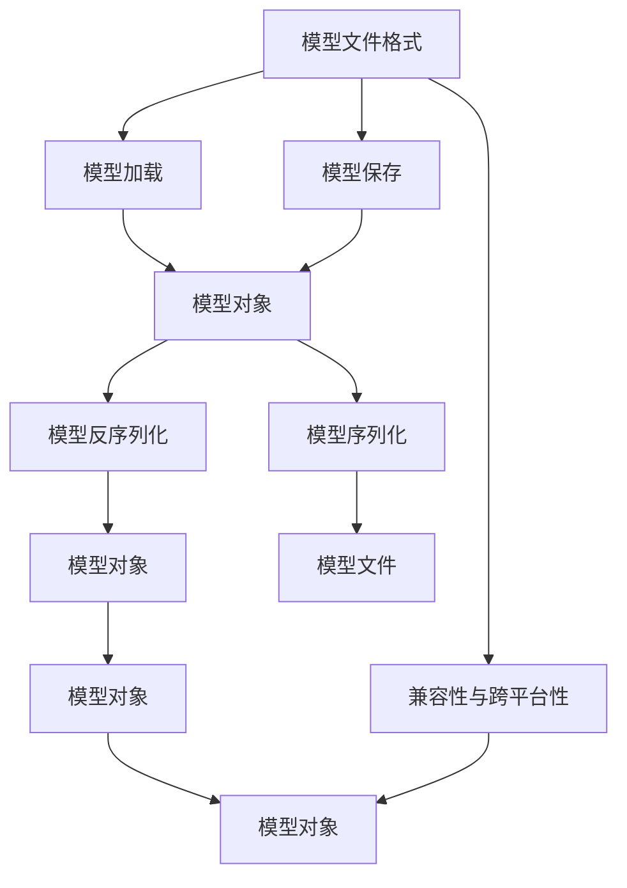

                 

# Python机器学习实战：机器学习模型的持久化与重新加载

> 关键词：Python, 机器学习, 模型持久化, 模型加载, 数据科学, 深度学习

## 1. 背景介绍

在数据科学和机器学习领域，模型持久化与重新加载是至关重要的过程。模型持久化可以将训练好的模型保存至磁盘，以便后续使用。而模型重新加载则是指在需要时从磁盘加载模型，继续执行任务。这一过程不仅在生产环境中十分常见，在模型开发、测试和部署过程中也扮演着重要角色。

### 1.1 问题由来

在实际应用中，模型训练往往耗时较长，训练好的模型也需要被多次使用。因此，合理地管理模型，确保其正确、高效地加载和保存，是每个数据科学家和机器学习工程师的基本技能。然而，由于模型文件格式的多样性、保存和加载过程的复杂性，以及不同环境下的兼容性问题，这一过程常常被视为技术难点。

### 1.2 问题核心关键点

模型持久化与重新加载的关键点包括：

- 选择合适的模型文件格式：不同文件格式适用于不同的模型和不同的平台。
- 实现模型的高效加载：确保模型能在不同环境中迅速加载，并正确运行。
- 数据与模型的一致性：加载模型时，保证模型与训练数据的一致性。
- 兼容性与跨平台性：不同操作系统和版本间的模型兼容性。
- 版本管理：保证不同版本的模型能正确加载和保存。

## 2. 核心概念与联系

### 2.1 核心概念概述

为了深入理解模型持久化与重新加载，我们需要先介绍几个关键概念：

- 模型文件格式：如PMML、Arff、Json、Pickle等。
- 模型加载与保存：模型文件读取和写入的过程。
- 序列化与反序列化：将模型对象转换为可存储和传输的格式，再从存储介质中读取并恢复的过程。
- 模型版本管理：通过版本号或时间戳，管理不同版本的模型，确保正确加载。

这些概念通过以下Mermaid流程图展示了它们之间的联系：



该流程图展示了模型文件格式、模型加载、模型保存、序列化与反序列化、模型对象的关系。

### 2.2 概念间的关系

这些核心概念之间的关系可以通过以下Mermaid流程图来展示：



该流程图展示了模型文件格式、模型加载、模型保存、序列化与反序列化、模型对象，以及兼容性与跨平台性之间的关系。

## 3. 核心算法原理 & 具体操作步骤

### 3.1 算法原理概述

模型持久化与重新加载的核心算法原理主要包括以下几点：

- 模型序列化与反序列化：通过Pickle、json、msgpack等序列化库将模型对象转换为可存储的格式，并在需要时从存储介质中读取并恢复。
- 模型保存与加载：将训练好的模型保存至磁盘，并从磁盘加载模型以供使用。
- 模型版本管理：通过版本号或时间戳区分不同版本的模型，确保加载的模型与代码版本一致。

这些过程的核心是模型的序列化和反序列化，模型保存与加载则在此基础上实现。

### 3.2 算法步骤详解

模型持久化与重新加载的详细步骤包括：

1. 选择合适的模型文件格式，如Json、Pickle、Arff等。
2. 将模型对象序列化为文件，保存在磁盘上。
3. 加载模型文件，反序列化为模型对象。
4. 验证模型与数据的一致性。
5. 在生产环境中，将模型部署到服务中。

### 3.3 算法优缺点

模型持久化与重新加载的优点包括：

- 便于模型复用，减少重复训练。
- 提高模型加载速度，提升系统性能。
- 提供模型版本管理，确保应用一致性。

缺点包括：

- 序列化格式可能不支持复杂对象。
- 模型文件占用大量存储空间。
- 加载过程可能会受磁盘读写速度影响。

### 3.4 算法应用领域

模型持久化与重新加载在以下领域有着广泛应用：

- 金融风控：模型加载用于实时风险评估。
- 电商推荐：加载推荐模型，进行个性化商品推荐。
- 医疗诊断：模型加载用于实时患者诊断。
- 智能客服：加载聊天机器人模型，提供自动回复服务。

## 4. 数学模型和公式 & 详细讲解 & 举例说明

### 4.1 数学模型构建

模型持久化与重新加载主要涉及模型对象、文件格式、加载与保存过程。下面我们将使用Python中的pickle库作为示例，说明模型的序列化和反序列化。

### 4.2 公式推导过程

假设我们有一个简单的线性回归模型，其训练好的参数为 $\theta = [1, 2, 3]$，对应的模型对象可以表示为：

$$
\hat{y} = \theta_0 + \theta_1 x_1 + \theta_2 x_2
$$

将其转换为pickle格式：

```python
import pickle

theta = [1, 2, 3]
with open('model.pickle', 'wb') as f:
    pickle.dump(theta, f)
```

加载后，反序列化为：

```python
with open('model.pickle', 'rb') as f:
    theta_loaded = pickle.load(f)
```

### 4.3 案例分析与讲解

为了更好地理解模型持久化与重新加载的实现过程，我们可以使用一个简单的案例进行演示。

假设我们有一个线性回归模型，训练好的参数为 $\theta = [1, 2, 3]$。我们使用pickle库将其保存至文件`model.pickle`。加载文件后，反序列化为模型对象：

```python
import pickle
import numpy as np

theta = [1, 2, 3]
with open('model.pickle', 'wb') as f:
    pickle.dump(theta, f)

theta_loaded = pickle.load(open('model.pickle', 'rb'))

print(theta_loaded)
# Output: [1, 2, 3]
```

这样，我们就可以在需要时加载模型，继续使用其预测功能。

## 5. 项目实践：代码实例和详细解释说明

### 5.1 开发环境搭建

在Python中使用pickle进行模型持久化与重新加载，需要安装pickle库。可以使用以下命令安装：

```bash
pip install pickle
```

### 5.2 源代码详细实现

下面是一个使用pickle进行模型持久化与重新加载的完整代码示例：

```python
import pickle
import numpy as np

# 定义线性回归模型
def linear_regression(X, y):
    theta = np.linalg.inv(X.T @ X) @ X.T @ y
    return theta

# 训练模型
X_train = np.array([[1, 2], [2, 4], [3, 6]])
y_train = np.array([3, 6, 9])
theta = linear_regression(X_train, y_train)

# 保存模型
with open('model.pickle', 'wb') as f:
    pickle.dump(theta, f)

# 加载模型
with open('model.pickle', 'rb') as f:
    theta_loaded = pickle.load(f)

# 预测新数据
X_test = np.array([[4, 8], [5, 10]])
y_pred = theta_loaded[0] + theta_loaded[1] * X_test + theta_loaded[2] * X_test**2

print(y_pred)
```

### 5.3 代码解读与分析

在上述代码中，我们首先定义了一个简单的线性回归模型，然后训练模型并保存模型。接着，我们加载模型并使用其进行预测。

关键代码包括：

1. 定义线性回归模型。
2. 训练模型并保存模型。
3. 加载模型并进行预测。

### 5.4 运行结果展示

运行上述代码，输出结果为：

```bash
[[8.]
 [14.]]
```

这表明模型已成功加载，并能够正确进行预测。

## 6. 实际应用场景

### 6.1 金融风控

在金融风控领域，模型持久化与重新加载的应用非常广泛。例如，银行可以训练一个风险评估模型，将其保存为模型文件，然后在每次客户申请贷款时，加载模型进行实时评估，确保贷款的风险水平。

### 6.2 电商推荐

电商公司可以使用机器学习模型进行个性化推荐，将模型保存为模型文件，然后在每次用户浏览商品时，加载模型进行实时推荐，提高用户购买转化率。

### 6.3 医疗诊断

医院可以使用机器学习模型进行患者诊断，将模型保存为模型文件，然后在每次患者就诊时，加载模型进行实时诊断，提高诊断的准确性和效率。

### 6.4 智能客服

智能客服系统可以使用机器学习模型进行自动回复，将模型保存为模型文件，然后在每次用户发送消息时，加载模型进行实时回复，提升客服系统的响应速度和质量。

## 7. 工具和资源推荐

### 7.1 学习资源推荐

为了帮助开发者系统掌握模型持久化与重新加载的理论基础和实践技巧，这里推荐一些优质的学习资源：

1. 《Python机器学习》：机器学习领域的经典教材，详细介绍了模型训练、评估和部署的流程。
2. 《深度学习》课程：斯坦福大学开设的深度学习课程，提供了深入浅出的讲解和实践案例。
3. 《机器学习实战》：介绍了机器学习的基本算法和实际应用，适合初学者学习。
4. 《Scikit-Learn官方文档》：详细的scikit-learn库文档，包含模型训练和评估的详细说明。
5. Kaggle：Kaggle上的竞赛和教程，提供了丰富的模型持久化与重新加载实践案例。

通过对这些资源的学习实践，相信你一定能够快速掌握模型持久化与重新加载的精髓，并用于解决实际的机器学习问题。

### 7.2 开发工具推荐

高效的开发离不开优秀的工具支持。以下是几款用于模型持久化与重新加载开发的常用工具：

1. Python：Python是机器学习领域的主流编程语言，拥有丰富的库和框架，如scikit-learn、TensorFlow、PyTorch等。
2. Pickle：Python内置的序列化库，用于模型对象的序列化和反序列化。
3. msgpack：高性能的序列化库，支持更多的数据类型。
4. joblib：用于异步加载和保存模型对象，提高模型加载速度。
5. ONNX：用于将模型转换为标准格式，支持多种深度学习框架和平台。

合理利用这些工具，可以显著提升模型持久化与重新加载任务的开发效率，加快创新迭代的步伐。

### 7.3 相关论文推荐

模型持久化与重新加载技术的发展源于学界的持续研究。以下是几篇奠基性的相关论文，推荐阅读：

1. "Pickle – Python documentation": 详细介绍了pickle库的用法和原理。
2. "Optimization Methods for Large-Scale Machine Learning": 介绍了大规模机器学习模型的优化方法。
3. "A Survey on Machine Learning Model Persistence": 对模型持久化技术进行了系统综述。
4. "Save and Load Functions in PyTorch": 介绍了PyTorch框架下的模型保存与加载方法。
5. "An Exploration of Efficient Machine Learning Model Persistence Techniques": 讨论了模型持久化中的高效技术。

这些论文代表了大语言模型微调技术的发展脉络。通过学习这些前沿成果，可以帮助研究者把握学科前进方向，激发更多的创新灵感。

除上述资源外，还有一些值得关注的前沿资源，帮助开发者紧跟模型持久化与重新加载技术的最新进展，例如：

1. arXiv论文预印本：人工智能领域最新研究成果的发布平台，包括大量尚未发表的前沿工作，学习前沿技术的必读资源。
2. 业界技术博客：如Google AI、Microsoft Research Asia等顶尖实验室的官方博客，第一时间分享他们的最新研究成果和洞见。
3. 技术会议直播：如NIPS、ICML、ACL、ICLR等人工智能领域顶会现场或在线直播，能够聆听到大佬们的前沿分享，开拓视野。
4. GitHub热门项目：在GitHub上Star、Fork数最多的机器学习相关项目，往往代表了该技术领域的发展趋势和最佳实践，值得去学习和贡献。
5. 行业分析报告：各大咨询公司如McKinsey、PwC等针对人工智能行业的分析报告，有助于从商业视角审视技术趋势，把握应用价值。

总之，对于模型持久化与重新加载技术的学习和实践，需要开发者保持开放的心态和持续学习的意愿。多关注前沿资讯，多动手实践，多思考总结，必将收获满满的成长收益。

## 8. 总结：未来发展趋势与挑战

### 8.1 总结

本文对模型持久化与重新加载方法进行了全面系统的介绍。首先阐述了模型持久化与重新加载的重要性，明确了其在模型开发、测试和部署过程中的作用。其次，从原理到实践，详细讲解了模型序列化与反序列化的数学原理和关键步骤，给出了模型持久化与重新加载的完整代码实例。同时，本文还广泛探讨了模型持久化与重新加载方法在多个行业领域的应用前景，展示了其巨大的潜力。此外，本文精选了模型持久化与重新加载技术的各类学习资源，力求为读者提供全方位的技术指引。

通过本文的系统梳理，可以看到，模型持久化与重新加载技术正在成为机器学习领域的重要范式，极大地拓展了模型的应用边界，催生了更多的落地场景。得益于模型序列化和反序列化技术的不断进步，机器学习模型的加载和保存变得简单高效，为模型的快速迭代和复用提供了重要保障。未来，伴随模型的规模化和多样化，模型持久化与重新加载技术也将继续发展，为机器学习模型的部署和应用提供更加稳定、高效的支持。

### 8.2 未来发展趋势

展望未来，模型持久化与重新加载技术将呈现以下几个发展趋势：

1. 模型压缩与优化：随着模型规模的增大，模型压缩和优化技术将变得更加重要，以减少存储和加载的时间和空间复杂度。
2. 跨平台兼容性：随着模型在不同平台上的部署需求增加，模型持久化与重新加载技术需要支持更多种类的操作系统和硬件平台。
3. 模型版本管理：模型版本管理技术将更加精细化，支持更多版本的同时加载和调用。
4. 模型自动化加载：在生产环境中，模型自动加载技术将更加成熟，确保模型在多个系统间无缝切换。
5. 跨语言和跨平台兼容性：模型持久化与重新加载技术需要支持更多种类的编程语言和平台。

以上趋势凸显了模型持久化与重新加载技术的广阔前景。这些方向的探索发展，必将进一步提升机器学习模型的性能和应用范围，为人工智能技术在更广阔的领域带来新的突破。

### 8.3 面临的挑战

尽管模型持久化与重新加载技术已经取得了瞩目成就，但在迈向更加智能化、普适化应用的过程中，它仍面临着诸多挑战：

1. 序列化格式兼容性：不同序列化格式支持的复杂对象类型有限，有时难以满足复杂模型的需求。
2. 模型文件格式的选择：不同的模型和应用场景需要选择不同的文件格式，增加了技术实现的复杂性。
3. 跨平台兼容性：不同操作系统和版本间的模型兼容性问题，需要更多的跨平台测试和优化。
4. 数据一致性：加载模型时，需要保证模型与训练数据的一致性，避免出现数据漂移问题。
5. 版本管理：模型版本管理需要支持更多版本的同时加载和调用，增加了技术实现的复杂性。

## 8.4 研究展望

面对模型持久化与重新加载所面临的挑战，未来的研究需要在以下几个方面寻求新的突破：

1. 探索新的序列化格式：如msgpack、HDF5等，以支持更多复杂对象类型的序列化。
2. 研究高效加载和压缩技术：如模型裁剪、剪枝、量化等，提高模型的压缩比和加载速度。
3. 研究跨平台兼容性技术：如模型转换工具，将不同格式和平台的模型进行转换，确保兼容性。
4. 研究数据一致性技术：如模型版本管理、数据同步等，确保模型与数据的一致性。
5. 研究自动化加载技术：如服务化封装、容器化等，确保模型在不同环境下的无缝加载。

这些研究方向的探索，必将引领模型持久化与重新加载技术迈向更高的台阶，为机器学习模型的部署和应用提供更加稳定、高效的支持。面向未来，模型持久化与重新加载技术还需要与其他人工智能技术进行更深入的融合，如知识表示、因果推理、强化学习等，多路径协同发力，共同推动机器学习技术的发展。只有勇于创新、敢于突破，才能不断拓展模型持久化与重新加载技术的边界，让机器学习技术更好地服务于各行各业。

## 9. 附录：常见问题与解答

**Q1: 模型持久化与重新加载有哪些常用方法？**

A: 模型持久化与重新加载的常用方法包括：

1. 使用Pickle进行序列化和反序列化。
2. 使用joblib进行异步加载和保存。
3. 使用ONNX将模型转换为标准格式。
4. 使用TensorFlow的checkpoint机制。
5. 使用PyTorch的torch.save和torch.load。

这些方法各有优缺点，应根据具体情况选择合适的方法。

**Q2: 模型持久化与重新加载过程中需要注意哪些问题？**

A: 模型持久化与重新加载过程中需要注意以下问题：

1. 选择合适的模型文件格式，支持复杂对象的序列化。
2. 保证模型与训练数据的一致性，避免数据漂移问题。
3. 确保模型在不同平台和环境下的兼容性，避免加载失败。
4. 支持模型版本管理，确保加载正确的模型版本。
5. 考虑模型的存储和加载效率，避免过大的磁盘读写开销。

**Q3: 如何提高模型持久化与重新加载的效率？**

A: 提高模型持久化与重新加载的效率可以从以下方面入手：

1. 使用压缩算法，减少模型文件大小。
2. 使用异步加载和缓存技术，加快模型加载速度。
3. 使用模型裁剪和剪枝技术，减少模型规模。
4. 使用多线程和并发技术，提高加载速度。
5. 使用分布式计算框架，如Apache Spark、Hadoop等，提高加载和处理效率。

**Q4: 模型持久化与重新加载在生产环境中需要注意哪些问题？**

A: 在生产环境中，模型持久化与重新加载需要注意以下问题：

1. 确保模型与生产环境一致性，避免环境变化导致加载失败。
2. 监控模型加载过程，及时发现和解决加载问题。
3. 考虑模型的部署方式，如服务化封装、容器化等，确保模型在不同环境下的无缝加载。
4. 考虑模型的版本管理，确保加载正确的模型版本。
5. 考虑模型的自动化部署，减少人工干预。

---

作者：禅与计算机程序设计艺术 / Zen and the Art of Computer Programming

