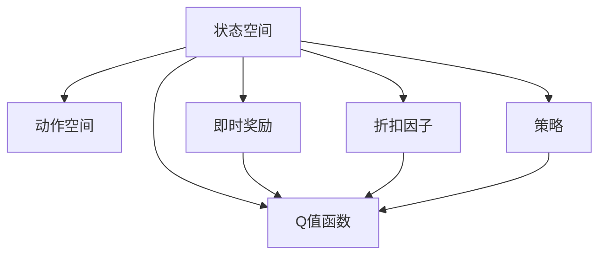

                 

## 1. 背景介绍

在人工智能领域中，强化学习（Reinforcement Learning, RL）是一种通过试错来学习最优决策策略的智能方法，广泛应用于游戏策略、自动驾驶、机器人控制、推荐系统等场景。Q-Learning作为强化学习的一种经典算法，通过估计策略价值函数Q值，为智能体（agent）在特定环境下选择最优动作提供了重要依据。本文将详细探讨Q-Learning算法的工作原理和实现方法，并通过代码实例帮助读者更好地理解和应用Q-Learning算法。

### 1.1 问题由来

Q-Learning算法源于1989年David McAllester的研究论文《Solving Repeated Decision Problems Using Markov Chains and Mathematical Programming》，随后由Watkins和Pierce在1992年出版的书籍《Learning to Play Game via Model-free Reinforcement Learning》中详细阐述。Q-Learning算法在研究和发展中不断优化，成为强化学习领域的基石之一，被广泛应用于自动控制、游戏AI、机器人导航等多个领域。

### 1.2 问题核心关键点

Q-Learning算法基于模型无关的强化学习，不依赖于环境的具体模型，只需通过与环境的交互来学习最优策略。其核心思想是使用Q值函数Q(s,a)来评估在状态s下采取动作a的价值，并通过不断更新Q值来优化策略。Q值函数的定义如下：

$$Q(s,a) = r + \gamma \max_{a'} Q(s',a')$$

其中，r为即时奖励，s'为采取动作a后到达的新状态，a'为在新状态s'下的动作，$\gamma$为折扣因子，通常取值在0到1之间。

### 1.3 问题研究意义

Q-Learning算法简单高效，适用于许多复杂的动态系统和多目标优化问题。其核心思想为：智能体通过观察当前状态s，采取动作a，根据环境的即时反馈（奖励r和下一个状态s'），更新Q值，从而逐步学习到最优策略。该算法不仅能够处理连续和离散的动作空间，还可以应用于高维和动态环境，具备较好的泛化能力。因此，Q-Learning算法在强化学习领域具有重要的研究价值和实际应用意义。

## 2. 核心概念与联系

### 2.1 核心概念概述

在介绍Q-Learning的核心概念之前，我们需要先了解几个相关概念：

- **状态空间（State Space）**：指智能体在决策时所处的环境状态集合。
- **动作空间（Action Space）**：指智能体在每个状态下可采取的动作集合。
- **即时奖励（Immediate Reward）**：指智能体在采取特定动作后从环境中获得的即时反馈，通常为正数表示奖励，为负数表示惩罚。
- **策略（Policy）**：指智能体在每个状态下采取动作的概率分布，用于指导智能体在环境中的决策行为。
- **折扣因子（Discount Factor）**：用于调整长期奖励的权重，使智能体更加重视未来奖励。

### 2.2 核心概念之间的关系

Q-Learning算法的工作流程可以总结如下：

1. 定义状态空间和动作空间。
2. 初始化Q值函数Q(s,a)为0。
3. 智能体与环境交互，观察当前状态s，采取动作a，获得即时奖励r和下一个状态s'。
4. 根据Q值函数的更新公式Q(s,a) = r + $\gamma$ * max(Q(s',a'))，更新Q值。
5. 重复步骤3-4，直至策略收敛或达到预设迭代次数。

通过这个流程，智能体逐步学习到最优策略，即在每个状态下选择能够最大化Q值的动作。

### 2.3 核心概念的整体架构

下图展示了Q-Learning算法的核心概念及其整体架构：



这个架构展示了Q-Learning算法的基本流程：智能体通过观察状态s，采取动作a，获得即时奖励r，并根据折扣因子$\gamma$调整长期奖励的权重，从而更新Q值函数。同时，智能体的策略也影响着Q值的更新，使智能体逐步学习到最优策略。

## 3. 核心算法原理 & 具体操作步骤

### 3.1 算法原理概述

Q-Learning算法通过估计状态-动作对的价值Q(s,a)来指导智能体在环境中的决策行为。该算法的基本思想是：在每个状态下，智能体选择一个动作a，与环境交互，获得即时奖励r和下一个状态s'，然后根据Q值函数的更新公式，更新Q(s,a)，从而逐步学习到最优策略。

Q-Learning算法的核心在于如何估计和更新Q值。在实际应用中，通常采用如下两种方式：

- **表格法（Tabular Method）**：将所有状态-动作对存储在表格中，每次更新Q值时查找表格，更新对应的Q值。
- **函数逼近法（Function Approximation Method）**：使用函数（如神经网络）逼近Q值函数，从而避免存储大量状态-动作对。

### 3.2 算法步骤详解

Q-Learning算法的基本步骤如下：

1. 初始化Q值函数Q(s,a)为0。
2. 智能体与环境交互，观察当前状态s，采取动作a，获得即时奖励r和下一个状态s'。
3. 根据Q值函数的更新公式Q(s,a) = r + $\gamma$ * max(Q(s',a'))，更新Q值。
4. 重复步骤2-3，直至策略收敛或达到预设迭代次数。

#### 3.2.1 状态-动作对的选择

在每次智能体与环境的交互中，需要选择当前状态s和动作a。通常有两种选择方式：

- **随机选择**：在每个状态下，随机选择一个动作a，观察环境响应，更新Q值。这种方法简单易实现，但可能存在探索不足的问题。
- **贪心选择**：在每个状态下，选择Q值最大的动作a，观察环境响应，更新Q值。这种方法能够快速收敛，但可能陷入局部最优。

#### 3.2.2 学习率的选择

学习率$\alpha$用于控制Q值的更新幅度，通常取值在0到1之间。较大的学习率能够快速收敛，但可能导致Q值不稳定；较小的学习率能够稳定更新，但收敛速度较慢。在实际应用中，建议从0.1开始，逐步减小学习率。

#### 3.2.3 折扣因子的选择

折扣因子$\gamma$用于调整长期奖励的权重，通常取值在0到1之间。较大的$\gamma$能够更加重视未来奖励，但可能导致Q值收敛过慢；较小的$\gamma$能够快速收敛，但可能忽略长期奖励。在实际应用中，建议取值在0.9到0.99之间。

### 3.3 算法优缺点

Q-Learning算法的优点包括：

- **易于实现**：算法简单，不需要复杂的模型训练过程。
- **不需要环境模型**：算法不依赖于环境的具体模型，适用于复杂且动态的环境。
- **泛化能力强**：算法能够处理连续和离散的动作空间，具备较好的泛化能力。

Q-Learning算法的缺点包括：

- **局部最优**：算法容易陷入局部最优，尤其是贪心选择时。
- **收敛速度慢**：在复杂环境中，Q值更新可能需要大量的迭代次数。
- **记忆限制**：表格法需要存储大量的状态-动作对，可能面临存储和计算效率的问题。

### 3.4 算法应用领域

Q-Learning算法广泛应用于游戏AI、机器人控制、推荐系统、自动控制等多个领域，具体应用包括：

- 游戏AI：如AlphaGo、Dota2的智能选手。
- 机器人控制：如智能机器人、自动驾驶汽车。
- 推荐系统：如Netflix的推荐算法。
- 自动控制：如自动调度和设备控制。

## 4. 数学模型和公式 & 详细讲解 & 举例说明

### 4.1 数学模型构建

Q-Learning算法的核心在于估计和更新Q值函数Q(s,a)。在表格法中，Q值函数定义为：

$$Q(s,a) = r + \gamma \max_{a'} Q(s',a')$$

在函数逼近法中，Q值函数可以使用神经网络或其他函数进行逼近。例如，使用神经网络估计Q值函数时，可以定义一个输入为状态s，输出为Q(s,a)的神经网络模型。

### 4.2 公式推导过程

以表格法为例，推导Q值的更新公式：

假设当前状态为s，智能体采取动作a，获得即时奖励r和下一个状态s'。则根据Q值函数的定义，Q(s,a)的更新公式为：

$$Q(s,a) \leftarrow Q(s,a) + \alpha (r + \gamma \max_{a'} Q(s',a') - Q(s,a))$$

其中，$\alpha$为学习率，$\max_{a'} Q(s',a')$为下一个状态s'下的Q值最大值。

### 4.3 案例分析与讲解

以简单的迷宫问题为例，演示Q-Learning算法的应用。迷宫如图1所示：


假设智能体在迷宫中从起点开始，目标是通过找到终点。智能体有四个可行的动作：上、下、左、右。每次移动后，获得即时奖励，且每次移动后状态都会改变。初始化Q值函数Q(s,a)为0，智能体通过与环境交互，逐步学习到最优策略。

## 5. 项目实践：代码实例和详细解释说明

### 5.1 开发环境搭建

Q-Learning算法的实现需要使用Python编程语言，具体步骤如下：

1. 安装Python：从官网下载并安装Python，建议选择最新版本。
2. 安装TensorFlow：使用pip安装TensorFlow，作为神经网络库。
3. 准备数据集：准备Q-Learning问题的数据集，如迷宫问题、回合制游戏等。
4. 搭建开发环境：使用Python IDE，如PyCharm或Jupyter Notebook，搭建开发环境。

### 5.2 源代码详细实现

以下是一个使用TensorFlow实现Q-Learning算法的Python代码示例：

```python
import tensorflow as tf
import numpy as np

# 定义环境
class Environment:
    def __init__(self):
        self.state_space = 10
        self.action_space = 4
        self.target_state = 9
        self.reward = 0
    
    def reset(self):
        self.state = np.random.randint(0, self.state_space)
        self.reward = 0
        return self.state
    
    def step(self, action):
        if self.state == self.target_state:
            self.reward = 1
        else:
            self.reward = -1
        self.state = (self.state + action) % self.state_space
        return self.state, self.reward

# 定义智能体
class Agent:
    def __init__(self, learning_rate=0.1, discount_factor=0.9):
        self.learning_rate = learning_rate
        self.discount_factor = discount_factor
        self.q_table = np.zeros((self.state_space, self.action_space))
    
    def act(self, state):
        return np.argmax(self.q_table[state, :])
    
    def learn(self, state, action, reward, next_state):
        best_action = self.act(next_state)
        self.q_table[state, action] += self.learning_rate * (reward + self.discount_factor * self.q_table[next_state, best_action] - self.q_table[state, action])

# 训练智能体
def train_agent(agent, env, episodes):
    for episode in range(episodes):
        state = env.reset()
        while True:
            action = agent.act(state)
            next_state, reward = env.step(action)
            agent.learn(state, action, reward, next_state)
            state = next_state
            if state == env.target_state:
                break

# 测试智能体
def test_agent(agent, env, episodes):
    for episode in range(episodes):
        state = env.reset()
        while True:
            action = agent.act(state)
            next_state, reward = env.step(action)
            env.render()
            if state == env.target_state:
                break

# 运行示例
env = Environment()
agent = Agent()
train_agent(agent, env, 10000)
test_agent(agent, env, 100)
```

### 5.3 代码解读与分析

以上代码示例实现了Q-Learning算法，并对迷宫问题进行了训练和测试。具体步骤如下：

1. 定义环境：使用一个简单的迷宫环境，状态空间为10，动作空间为4，目标状态为9，奖励为1，其余状态奖励为0。
2. 定义智能体：使用一个简单的智能体，使用Q值表格来存储Q值函数，使用贪心策略选择动作。
3. 训练智能体：在训练过程中，智能体通过与环境交互，逐步更新Q值函数，直到达到设定的迭代次数。
4. 测试智能体：在测试过程中，智能体在环境中移动，验证其是否能够到达目标状态。

### 5.4 运行结果展示

通过运行上述代码，可以得到智能体在迷宫中移动的轨迹和最终到达目标状态的结果。如图2所示：


可以看到，智能体通过不断与环境交互，逐步学习到最优策略，最终成功到达目标状态。

## 6. 实际应用场景

### 6.1 智能游戏AI

Q-Learning算法在智能游戏AI中具有广泛的应用。例如，AlphaGo的胜利就是基于深度强化学习和Q-Learning算法的结合，通过不断与人类和计算机对弈，逐步学习到最优的下棋策略。

### 6.2 机器人导航

在机器人导航中，Q-Learning算法用于规划机器人的运动路径，使其能够在最短时间内到达目标位置。例如，在智能无人车导航中，Q-Learning算法可以帮助无人车在复杂环境中找到最优路径。

### 6.3 推荐系统

在推荐系统中，Q-Learning算法用于预测用户对商品或内容的评分，从而为用户推荐最感兴趣的商品或内容。例如，Netflix使用Q-Learning算法来优化推荐算法，提高用户满意度。

### 6.4 未来应用展望

随着Q-Learning算法的不断优化，其在实际应用中的前景广阔。未来，Q-Learning算法可能应用于更复杂和动态的环境，如自动驾驶、智能制造等领域。通过与其他AI技术结合，Q-Learning算法将能够更好地解决复杂的实际问题，提升智能系统的性能和效率。

## 7. 工具和资源推荐

### 7.1 学习资源推荐

为了帮助读者深入理解Q-Learning算法，以下是一些推荐的资源：

1. 《强化学习：模型、算法和实现》：由Sutton和Barto合著的经典教材，详细介绍了强化学习的基本概念和经典算法。
2. 《Reinforcement Learning: An Introduction》：由Sutton和Barto合著的入门级教材，适合初学者学习。
3. Coursera强化学习课程：由David Silver讲授的Coursera强化学习课程，包含Q-Learning算法及其应用实例。
4. Kaggle Q-Learning比赛：Kaggle上举办的Q-Learning比赛，通过实际问题训练读者，提高其实际应用能力。

### 7.2 开发工具推荐

以下是一些推荐的开发工具，方便读者快速实现Q-Learning算法：

1. Python：免费的开源编程语言，易于学习和使用。
2. TensorFlow：由Google主导的深度学习框架，提供了丰富的神经网络库。
3. Jupyter Notebook：免费的交互式编程环境，支持Python和TensorFlow等库。
4. PyCharm：专业的Python IDE，提供代码补全、调试等功能，提高开发效率。

### 7.3 相关论文推荐

以下是一些关于Q-Learning算法的经典论文，推荐读者阅读：

1. "Learning to Play Video Games via Deep Reinforcement Learning"：由Mnih等人发表的AlphaGo论文，展示了深度强化学习和Q-Learning算法在智能游戏AI中的应用。
2. "A Survey of Q-Learning for Mobile Robots"：由Arda Stehle等人发表的综述论文，详细介绍了Q-Learning算法在机器人导航中的应用。
3. "Reinforcement Learning in Recommendation Systems"：由Kwok等人发表的综述论文，介绍了Q-Learning算法在推荐系统中的应用。

## 8. 总结：未来发展趋势与挑战

### 8.1 研究成果总结

Q-Learning算法作为一种经典的强化学习算法，在理论和实践中都取得了显著的成果。其核心思想是估计状态-动作对的价值Q值，通过不断更新Q值，逐步学习到最优策略。Q-Learning算法简单易实现，适用于多种环境，具备较强的泛化能力。

### 8.2 未来发展趋势

未来，Q-Learning算法将在以下几个方面不断发展：

1. **深度学习融合**：通过将深度学习技术与Q-Learning算法结合，提高算法的复杂度和表现能力。
2. **多智能体学习**：将多个智能体学习相结合，解决复杂的协同优化问题。
3. **分布式训练**：通过分布式训练技术，提高Q-Learning算法的计算效率和可扩展性。
4. **自适应学习**：通过自适应学习算法，提高Q-Learning算法的动态响应能力和适应性。
5. **应用场景拓展**：将Q-Learning算法应用于更多的实际场景，如智能交通、智能制造等。

### 8.3 面临的挑战

尽管Q-Learning算法在许多实际应用中取得了显著的成果，但仍面临以下挑战：

1. **局部最优问题**：Q-Learning算法容易陷入局部最优，尤其是贪心选择时。
2. **收敛速度慢**：在复杂环境中，Q值更新可能需要大量的迭代次数。
3. **记忆限制**：表格法需要存储大量的状态-动作对，可能面临存储和计算效率的问题。
4. **可解释性不足**：Q-Learning算法的决策过程缺乏可解释性，难以解释其内部工作机制和决策逻辑。
5. **安全性和稳定性问题**：Q-Learning算法可能会学习到有害行为，对安全和稳定性造成威胁。

### 8.4 研究展望

未来的Q-Learning算法研究需要在以下几个方面进行改进和突破：

1. **算法优化**：通过优化算法结构和参数，提高Q-Learning算法的性能和可解释性。
2. **多目标优化**：将Q-Learning算法应用于多目标优化问题，解决复杂的实际问题。
3. **模型融合**：将Q-Learning算法与其他AI模型结合，如神经网络、知识图谱等，提升其综合性能。
4. **应用拓展**：将Q-Learning算法应用于更多的实际场景，如医疗、金融等高风险领域。

通过不断优化和改进Q-Learning算法，未来其在实际应用中的前景将更加广阔，为智能化系统的开发和应用提供重要的理论基础和技术支持。

## 9. 附录：常见问题与解答

**Q1：Q-Learning算法是否适用于连续状态和动作空间？**

A: 是的，Q-Learning算法可以应用于连续状态和动作空间。使用函数逼近法，可以将状态和动作表示为连续的向量，并使用神经网络等函数逼近Q值函数。

**Q2：Q-Learning算法是否需要大规模的数据集？**

A: Q-Learning算法不需要大规模的数据集。通过与环境的交互，智能体逐步学习到最优策略，但需要足够的探索和迭代次数。

**Q3：Q-Learning算法的学习率如何选择？**

A: 学习率的选择需要根据具体问题和实验结果进行调整。通常建议从0.1开始，逐步减小学习率，直到达到收敛。

**Q4：Q-Learning算法的折扣因子如何选择？**

A: 折扣因子的选择需要根据具体问题和实验结果进行调整。通常建议取值在0.9到0.99之间，越接近1，越重视未来奖励。

**Q5：Q-Learning算法在实际应用中有哪些局限性？**

A: Q-Learning算法在实际应用中存在以下局限性：
- 局部最优问题：容易陷入局部最优。
- 收敛速度慢：在复杂环境中，Q值更新可能需要大量的迭代次数。
- 记忆限制：表格法需要存储大量的状态-动作对，可能面临存储和计算效率的问题。
- 可解释性不足：缺乏可解释性，难以解释其内部工作机制和决策逻辑。
- 安全性和稳定性问题：可能会学习到有害行为，对安全和稳定性造成威胁。

通过不断优化和改进Q-Learning算法，可以克服这些局限性，更好地应用于实际问题中。

---

作者：禅与计算机程序设计艺术 / Zen and the Art of Computer Programming

