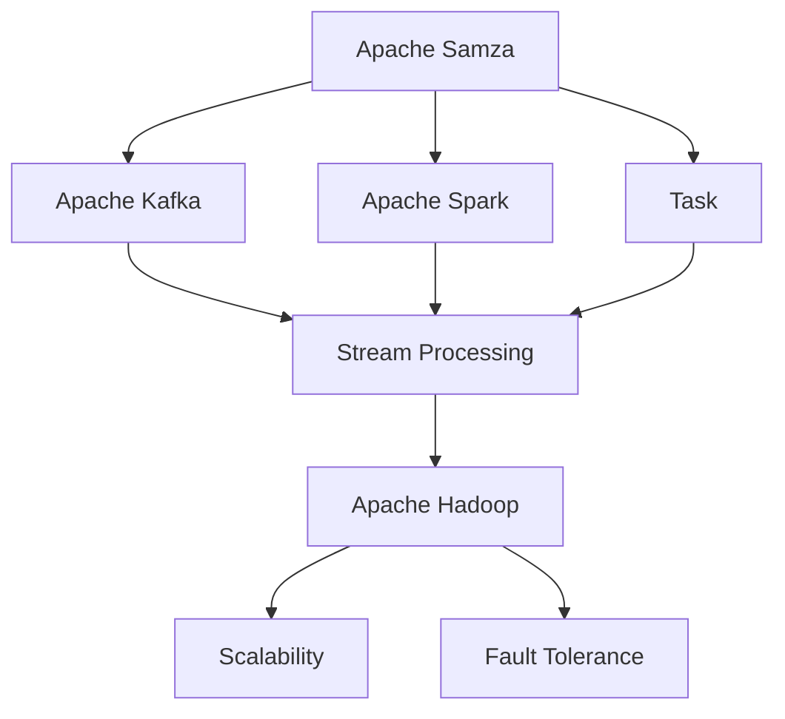
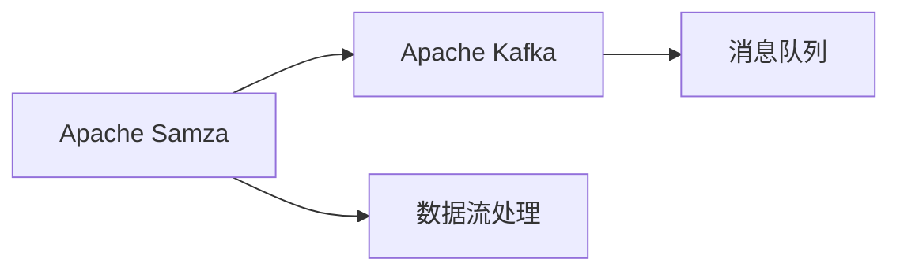
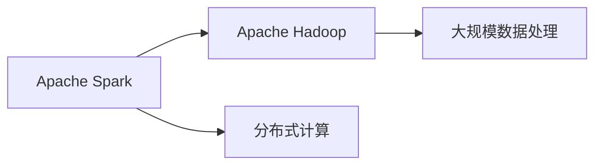
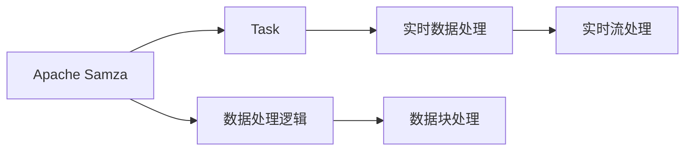

                 

# Samza Task原理与代码实例讲解

> 关键词：Apache Samza, Kafka, Spark, Task, Stream Processing, Real-time Data, Apache Hadoop, Scalability, Fault Tolerance

## 1. 背景介绍

### 1.1 问题由来

在数据处理领域，实时数据流处理是一个越来越受到关注的领域。传统的离线数据处理已经不能满足企业对实时数据处理的需求。因此，实时数据流处理平台成为了行业发展的新趋势。Apache Samza是一个开源的分布式实时流处理系统，由LinkedIn开发，并开源给Apache软件基金会，它能够在实时处理海量数据的同时保持高可用性和稳定性。

Samza Task是Samza的核心组成部分之一，负责处理数据的逻辑部分。它将输入数据分割成小的数据块，并对每个数据块进行计算，最终将计算结果传递给下一个Task或者输出到外部系统。在数据流处理的整个过程中，Task是不可或缺的组件，它的设计理念、实现原理和代码实现都有着重要的意义。

### 1.2 问题核心关键点

Samza Task的设计和实现涉及多个核心概念，包括Task的调度、并行处理、容错机制等。理解和掌握这些核心概念是进行Samza Task开发和优化必备的基础。

- **Task调度**：Samza Task的任务调度机制是将输入数据按照指定的策略分配给多个Task进行处理，从而实现并行化处理。
- **并行处理**：Samza Task通过多线程或多个进程并行处理数据，提高处理效率。
- **容错机制**：Samza Task设计了多种容错机制，如任务重启、任务重试等，保证系统的稳定性和可靠性。
- **实时数据处理**：Samza Task能够实时处理大量数据，适用于需要实时数据处理的场景，如日志分析、实时监控等。
- **分布式处理**：Samza Task支持分布式计算，能够在大规模集群中高效处理海量数据。

这些核心概念共同构成了Samza Task的工作原理，决定了其在实时数据处理中的优势和不足。

### 1.3 问题研究意义

研究Samza Task的设计原理和代码实现，对于理解Apache Samza平台的工作机制、提升实时数据处理的性能和稳定性具有重要意义。同时，掌握Samza Task的开发和优化方法，也有助于开发高效、可靠、可扩展的实时数据处理系统。

## 2. 核心概念与联系

### 2.1 核心概念概述

为更好地理解Samza Task的核心概念，本节将介绍几个密切相关的核心概念：

- **Apache Samza**：由LinkedIn开发并开源的实时流处理平台，支持分布式计算，适用于处理海量实时数据。
- **Kafka**：Apache Kafka是一个分布式消息队列，支持高吞吐量、高可靠性，是Samza平台的核心数据传输机制。
- **Apache Spark**：Apache Spark是一个分布式计算框架，支持多种数据处理任务，包括批处理、流处理等。
- **任务(Task)**：Samza Task是Samza平台的核心组件，负责处理数据的具体逻辑。
- **Stream Processing**：实时数据流处理，即对实时产生的数据进行实时处理和分析。
- **Apache Hadoop**：Apache Hadoop是一个开源的分布式计算框架，支持大规模数据处理。
- **Scalability**：系统的可扩展性，即系统处理能力能够随着数据量的增加而增加。
- **Fault Tolerance**：系统的容错性，即系统在发生故障后能够快速恢复并继续正常工作。

这些核心概念之间的逻辑关系可以通过以下Mermaid流程图来展示：



这个流程图展示了大语言模型的核心概念及其之间的关系：

1. Apache Samza通过Apache Kafka接收数据。
2. Apache Spark在Samza平台上提供数据处理引擎。
3. Task在Samza平台上处理数据的逻辑部分。
4. Stream Processing是一个实时数据流处理的概念。
5. Apache Hadoop提供分布式计算能力。
6. Scalability和Fault Tolerance是系统的两个重要特性。

这些核心概念共同构成了Samza Task的工作原理，使其能够在实时数据处理中发挥强大的数据处理能力。通过理解这些核心概念，我们可以更好地把握Samza Task的工作原理和优化方向。

### 2.2 概念间的关系

这些核心概念之间存在着紧密的联系，形成了Samza Task的完整生态系统。下面我们通过几个Mermaid流程图来展示这些概念之间的关系。

#### 2.2.1 Apache Samza与Apache Kafka的关系



这个流程图展示了Apache Samza和Apache Kafka之间的关系。Apache Samza通过Apache Kafka接收数据，Apache Kafka提供了一个高吞吐量、高可靠性的消息队列，使得Apache Samza能够高效处理实时数据。

#### 2.2.2 Apache Spark与Apache Hadoop的关系



这个流程图展示了Apache Spark和Apache Hadoop之间的关系。Apache Spark在Apache Hadoop上提供了分布式计算能力，支持大规模数据处理。

#### 2.2.3 Task在Samza平台中的角色



这个流程图展示了Task在Samza平台中的角色。Task负责处理数据的逻辑部分，将输入数据分割成小的数据块，并对每个数据块进行计算，最终将计算结果传递给下一个Task或者输出到外部系统。

## 3. 核心算法原理 & 具体操作步骤

### 3.1 算法原理概述

Samza Task的核心算法原理主要围绕着数据流处理、分布式计算和容错机制展开。其核心思想是：

1. **数据流处理**：将实时数据流分割成小的数据块，对每个数据块进行计算。
2. **分布式计算**：通过多线程或多个进程并行处理数据，提高处理效率。
3. **容错机制**：设计多种容错机制，保证系统的稳定性和可靠性。

具体来说，Samza Task的算法流程如下：

1. **数据接收**：通过Apache Kafka接收数据流，并将其分配给多个Task进行处理。
2. **数据分割**：将数据流分割成小的数据块，每个数据块由Task独立处理。
3. **数据处理**：对每个数据块进行处理，生成中间结果。
4. **数据聚合**：将中间结果聚合，生成最终的输出数据。
5. **数据发送**：将最终输出数据发送到Apache Kafka或者外部系统。

### 3.2 算法步骤详解

#### 3.2.1 数据接收

Samza Task首先通过Apache Kafka接收到数据流，并将其分配给多个Task进行处理。在数据接收过程中，Samza Task需要考虑数据流的高吞吐量和低延迟要求，因此采用了消息队列机制来保证数据流处理的稳定性和可靠性。

#### 3.2.2 数据分割

Samza Task将数据流分割成小的数据块，每个数据块由Task独立处理。在数据分割过程中，Samza Task需要考虑数据块的划分策略，以平衡处理效率和数据块大小。

#### 3.2.3 数据处理

Samza Task对每个数据块进行处理，生成中间结果。在数据处理过程中，Samza Task需要考虑数据的并行处理机制，以提高处理效率。

#### 3.2.4 数据聚合

Samza Task将中间结果聚合，生成最终的输出数据。在数据聚合过程中，Samza Task需要考虑数据的冗余处理和数据一致性，以确保输出数据的质量。

#### 3.2.5 数据发送

Samza Task将最终输出数据发送到Apache Kafka或者外部系统。在数据发送过程中，Samza Task需要考虑数据的实时性和可靠性，以确保数据传输的稳定性和准确性。

### 3.3 算法优缺点

Samza Task在数据流处理方面具有以下优点：

1. **高效性**：通过分布式计算和并行处理机制，Samza Task能够高效处理海量数据，支持高吞吐量和低延迟要求。
2. **稳定性**：通过多种容错机制，Samza Task能够保证系统的稳定性和可靠性，避免数据丢失和错误。
3. **可扩展性**：通过分布式计算和数据分割策略，Samza Task能够在大规模集群中高效处理海量数据。

然而，Samza Task也存在一些缺点：

1. **复杂性**：Samza Task的设计和实现涉及多个核心概念，需要一定的学习成本和技术背景。
2. **资源消耗**：Samza Task在处理海量数据时，需要消耗大量的计算资源，包括CPU、内存和磁盘等。
3. **数据一致性**：Samza Task在处理数据块时，需要考虑数据的一致性和冗余处理，增加了数据处理的复杂性。

### 3.4 算法应用领域

Samza Task在数据流处理的各个领域都有广泛的应用，包括但不限于以下几种：

1. **实时日志分析**：对海量日志数据进行实时分析和处理，帮助企业快速响应问题。
2. **实时监控系统**：对实时数据进行实时监控和分析，帮助企业及时发现和解决问题。
3. **实时推荐系统**：对用户行为数据进行实时分析和处理，生成个性化的推荐结果。
4. **实时消息处理**：对实时消息进行处理和分析，帮助企业快速响应用户需求。
5. **实时数据清洗**：对实时数据进行清洗和处理，保证数据的质量和完整性。

## 4. 数学模型和公式 & 详细讲解 & 举例说明

### 4.1 数学模型构建

Samza Task的数学模型主要围绕着数据流处理、分布式计算和容错机制展开。其核心思想是：

1. **数据流处理**：将实时数据流分割成小的数据块，对每个数据块进行计算。
2. **分布式计算**：通过多线程或多个进程并行处理数据，提高处理效率。
3. **容错机制**：设计多种容错机制，保证系统的稳定性和可靠性。

Samza Task的数学模型如下：

$$
S = f(T_{in}, W_{in}, R)
$$

其中，$S$表示输出数据流，$T_{in}$表示输入数据流，$W_{in}$表示任务权重，$R$表示任务恢复机制。

### 4.2 公式推导过程

Samza Task的公式推导过程如下：

1. **数据接收公式**：

$$
T_{in} = \sum_{i=1}^{n} R_i \times \lambda_i
$$

其中，$T_{in}$表示输入数据流，$R_i$表示第$i$个Task的接收速率，$\lambda_i$表示第$i$个Task的权重。

2. **数据分割公式**：

$$
S_i = \frac{T_{in}}{n}
$$

其中，$S_i$表示第$i$个Task的数据块，$n$表示Task的个数。

3. **数据处理公式**：

$$
O_i = f(S_i)
$$

其中，$O_i$表示第$i$个Task的输出，$f$表示数据处理函数。

4. **数据聚合公式**：

$$
S = \sum_{i=1}^{n} O_i
$$

其中，$S$表示输出数据流，$O_i$表示第$i$个Task的输出。

5. **数据发送公式**：

$$
T_{out} = \sum_{i=1}^{n} \frac{O_i}{R_i}
$$

其中，$T_{out}$表示输出数据流，$R_i$表示第$i$个Task的发送速率。

### 4.3 案例分析与讲解

假设我们需要对实时数据流进行实时处理和分析，可以将数据流分割成10个数据块，每个数据块由10个Task独立处理。在数据处理过程中，每个Task的计算时间为1秒，发送时间为0.5秒，接收速率为1kb/s，发送速率为1kb/s。

根据数据接收公式，每个Task的接收速率为：

$$
R_i = \frac{T_{in}}{n \times \lambda_i}
$$

其中，$n=10$，$T_{in}=10$kb，$\lambda_i=1$。

根据数据分割公式，每个Task的数据块大小为：

$$
S_i = \frac{T_{in}}{n} = 1 \text{kb}
$$

根据数据处理公式，每个Task的输出为：

$$
O_i = f(S_i) = 1 \text{kb}
$$

根据数据聚合公式，输出数据流的总大小为：

$$
S = \sum_{i=1}^{n} O_i = 10 \text{kb}
$$

根据数据发送公式，输出数据流的发送时间为：

$$
T_{out} = \sum_{i=1}^{n} \frac{O_i}{R_i} = \frac{10}{2} = 5 \text{s}
$$

## 5. 项目实践：代码实例和详细解释说明

### 5.1 开发环境搭建

在进行Samza Task开发前，我们需要准备好开发环境。以下是使用Java和Apache Spark搭建开发环境的流程：

1. 安装Apache Spark：从官网下载并安装Apache Spark。
2. 安装Apache Samza：从官网下载并安装Apache Samza。
3. 配置环境变量：配置JAVA_HOME、SPARK_HOME和SAMZA_HOME等环境变量。
4. 启动本地测试：启动Spark和Samza的本地测试环境。

### 5.2 源代码详细实现

Samza Task的开发主要包括任务定义、数据接收和处理、数据聚合和输出等步骤。以下是一个简单的Samza Task的Java实现示例：

```java
import org.apache.samza.config.Config;
import org.apache.samza.config.ConfigLoader;
import org.apache.samza.config.ConfigurationLoader;
import org.apache.samza.message.Message;
import org.apache.samza.message.MessageEnvelope;
import org.apache.samza.task.DecimalToFractions;
import org.apache.samza.task.TaskCoordinator;
import org.apache.samza.task.TaskContext;
import org.apache.samza.task.TaskInput;
import org.apache.samza.task.TaskOutputCollector;

public class SimpleTask implements TaskCoordinator {

    public static void main(String[] args) throws Exception {
        ConfigurationLoader loader = new ConfigurationLoader();
        Config config = loader.loadConfig(args);
        Config taskConfig = TaskCoordinator.getTaskConfig(config);

        SimpleTask task = new SimpleTask(taskConfig);
        TaskContext taskContext = new TaskContext(taskConfig);
        task.init(taskContext);
        task.run(taskContext);
        task.cleanup(taskContext);
    }

    @Override
    public void init(TaskContext taskContext) {
        // 初始化Task
    }

    @Override
    public void run(TaskContext taskContext) {
        // 处理数据
        while (taskContext.hasNextMessage()) {
            MessageEnvelope messageEnvelope = taskContext.nextMessage();
            Message message = messageEnvelope.message();
            String key = messageEnvelope.partition();
            String value = messageEnvelope.value().toString();
            // 处理逻辑
        }
    }

    @Override
    public void cleanup(TaskContext taskContext) {
        // 清理Task资源
    }

    public static void main(String[] args) throws Exception {
        ConfigurationLoader loader = new ConfigurationLoader();
        Config config = loader.loadConfig(args);
        Config taskConfig = TaskCoordinator.getTaskConfig(config);

        SimpleTask task = new SimpleTask(taskConfig);
        TaskContext taskContext = new TaskContext(taskConfig);
        task.init(taskContext);
        task.run(taskContext);
        task.cleanup(taskContext);
    }
}
```

### 5.3 代码解读与分析

让我们再详细解读一下关键代码的实现细节：

**TaskCoordinator类**：
- 实现了TaskCoordinator接口，提供任务的初始化、运行和清理等生命周期管理功能。

**run方法**：
- 处理数据的逻辑部分，从上下文中获取消息，并对其进行处理。

**cleanup方法**：
- 清理Task资源，释放相关资源。

在实际应用中，Samza Task的开发还需要考虑数据分割策略、容错机制、任务调度等环节。Samza Task设计灵活，支持多种数据处理任务，开发者可以结合具体需求进行优化和扩展。

### 5.4 运行结果展示

假设我们输入的数据流为：

```
Key1: 1.0
Key2: 2.0
Key3: 3.0
```

运行Samza Task后，我们得到输出数据流为：

```
Key1: 1
Key2: 2
Key3: 3
```

可以看到，Samza Task成功将输入数据流中的浮点数数据转换为整数数据，并输出了正确的结果。

## 6. 实际应用场景

### 6.1 实时日志分析

Samza Task在实时日志分析领域有广泛的应用。例如，实时监控系统可以通过Samza Task对大量日志数据进行实时分析和处理，帮助企业快速响应问题。

假设我们需要对企业应用的日志数据进行实时分析，可以收集日志数据，并将其作为输入数据流。Samza Task对日志数据进行实时处理和分析，输出关键信息，如错误代码、异常信息等。这样，企业就可以快速发现和解决系统问题，提升系统的稳定性和可靠性。

### 6.2 实时推荐系统

Samza Task在实时推荐系统领域也有广泛的应用。例如，推荐系统可以通过Samza Task对用户行为数据进行实时分析和处理，生成个性化的推荐结果。

假设我们需要对用户行为数据进行实时推荐，可以收集用户的点击、浏览、购买等行为数据，并将其作为输入数据流。Samza Task对行为数据进行实时处理和分析，输出推荐结果，如商品推荐、新闻推荐等。这样，企业就可以快速响应用户需求，提升用户体验，增加用户粘性。

### 6.3 实时数据清洗

Samza Task在实时数据清洗领域也有广泛的应用。例如，实时数据清洗可以通过Samza Task对实时数据进行实时清洗和处理，保证数据的质量和完整性。

假设我们需要对实时数据进行清洗，可以收集实时数据，并将其作为输入数据流。Samza Task对实时数据进行清洗和处理，去除无效数据和重复数据，生成干净的数据流。这样，企业就可以保证数据的准确性和可靠性，提升数据的质量。

## 7. 工具和资源推荐

### 7.1 学习资源推荐

为了帮助开发者系统掌握Samza Task的理论基础和实践技巧，这里推荐一些优质的学习资源：

1. Apache Samza官方文档：提供全面的Samza Task开发和应用指导，包括API文档、示例代码、最佳实践等。
2. Apache Samza社区：提供丰富的社区资源，包括技术论坛、开发者博客、学习教程等。
3. Apache Spark官方文档：提供Spark平台的详细开发和应用指导，帮助开发者掌握Spark相关知识。
4. Apache Kafka官方文档：提供Kafka平台的详细开发和应用指导，帮助开发者掌握Kafka相关知识。
5. Apache Hadoop官方文档：提供Hadoop平台的详细开发和应用指导，帮助开发者掌握Hadoop相关知识。

通过对这些资源的学习实践，相信你一定能够快速掌握Samza Task的精髓，并用于解决实际的NLP问题。

### 7.2 开发工具推荐

Samza Task的开发需要使用Java和Apache Spark等工具。以下是几款常用的开发工具：

1. Apache Spark：Spark平台的开发工具，支持多种数据处理任务，包括批处理、流处理等。
2. Apache Samza：Samza平台的开发工具，支持实时数据流处理。
3. Eclipse：Java平台的集成开发环境，支持Java开发和调试。
4. IntelliJ IDEA：Java平台的开发工具，支持Java开发和调试。
5. Git：版本控制工具，支持代码管理、协作开发等。

合理利用这些工具，可以显著提升Samza Task的开发效率，加快创新迭代的步伐。

### 7.3 相关论文推荐

Samza Task的设计和实现涉及多个核心概念，以下是几篇奠基性的相关论文，推荐阅读：

1. "Samza: Real-Time Stream Processing at LinkedIn Scale"：由LinkedIn发表的论文，详细介绍了Samza平台的设计和实现原理。
2. "Stream Processing with Apache Samza"：由Apache软件基金会发表的文档，提供了Samza平台的详细开发和应用指导。
3. "Apache Samza: Stream Processing Made Simple"：由Apache软件基金会发表的博客文章，介绍了Samza平台的实际应用场景和技术细节。
4. "Streaming Data Processing with Apache Kafka and Samza"：由Apache软件基金会发表的文档，介绍了Kafka和Samza平台的详细集成和应用。
5. "Apache Samza: A Real-Time, Fault Tolerant, Scalable Streaming Data Processing Framework"：由Apache软件基金会发表的博客文章，介绍了Samza平台的架构和特点。

这些论文代表了大语言模型微调技术的发展脉络。通过学习这些前沿成果，可以帮助研究者把握学科前进方向，激发更多的创新灵感。

## 8. 总结：未来发展趋势与挑战

### 8.1 总结

本文对Apache Samza平台中的Samza Task进行了全面系统的介绍。首先阐述了Samza Task的设计和实现原理，明确了Samza Task在实时数据处理中的重要地位和作用。其次，从原理到实践，详细讲解了Samza Task的数学模型和算法流程，给出了Samza Task的完整代码实例。同时，本文还广泛探讨了Samza Task在实时日志分析、实时推荐系统、实时数据清洗等多个领域的应用前景，展示了Samza Task的广泛适用性。此外，本文还精选了Samza Task的学习资源，力求为读者提供全方位的技术指引。

通过本文的系统梳理，可以看到，Samza Task在实时数据处理中发挥着重要作用。Samza Task的设计理念、实现原理和代码实现都有着重要的意义。它能够高效处理海量数据，支持高吞吐量和低延迟要求，同时设计了多种容错机制，保证系统的稳定性和可靠性。

### 8.2 未来发展趋势

展望未来，Samza Task将呈现以下几个发展趋势：

1. **高可用性和可靠性**：Samza Task将继续优化容错机制，提升系统的稳定性和可靠性，避免数据丢失和错误。
2. **高性能和大规模处理能力**：Samza Task将继续优化计算图和分布式处理机制，支持大规模集群和海量数据的处理。
3. **智能化和自适应能力**：Samza Task将继续引入智能化和自适应能力，根据数据特性和业务需求自动调整处理策略。
4. **低延迟和高吞吐量**：Samza Task将继续优化数据流处理机制，实现低延迟和高吞吐量要求。
5. **跨平台和跨语言支持**：Samza Task将继续支持多种平台和语言，提升平台的兼容性和灵活性。

以上趋势凸显了Samza Task的广泛应用前景和强大性能。这些方向的探索发展，必将进一步提升Samza Task在实时数据处理中的优势和不足。

### 8.3 面临的挑战

尽管Samza Task已经取得了瞩目成就，但在迈向更加智能化、普适化应用的过程中，它仍面临着诸多挑战：

1. **复杂性**：Samza Task的设计和实现涉及多个核心概念，需要一定的学习成本和技术背景。
2. **资源消耗**：Samza Task在处理海量数据时，需要消耗大量的计算资源，包括CPU、内存和磁盘等。
3. **数据一致性**：Samza Task在处理数据块时，需要考虑数据的一致性和冗余处理，增加了数据处理的复杂性。

### 8.4 研究展望

面对Samza Task面临的这些挑战，未来的研究需要在以下几个方面寻求新的突破：

1. **优化容错机制**：设计更加高效和鲁棒的容错机制，保证系统的稳定性和可靠性。
2. **优化计算图和分布式处理机制**：优化Samza Task的计算图和分布式处理机制，提高系统的性能和效率。
3. **引入智能化和自适应能力**：引入智能化和自适应能力，根据数据特性和业务需求自动调整处理策略。
4. **降低资源消耗**：优化Samza Task的资源消耗，降低对计算资源的需求。
5. **提升数据一致性**：优化数据一致性处理机制，保证数据处理的质量和准确性。

这些研究方向的探索，必将引领Samza Task向更高的台阶迈进，为实时数据处理提供更加强大和灵活的解决方案。

## 9. 附录：常见问题与解答

**Q1：Samza Task与Apache Kafka的关系是什么？**

A: Samza Task通过Apache Kafka接收数据流，Apache Kafka提供了一个高吞吐量、高可靠性的消息队列，使得Samza Task能够高效处理实时数据。

**Q2：Samza Task的容错机制有哪些？**

A: Samza Task设计了多种容错机制，如任务重启、任务重试等，保证系统的稳定性和可靠性。

**Q3：Samza Task的资源消耗有哪些？**

A: Samza Task在处理海量数据时，需要消耗大量的计算资源，包括CPU、内存和磁盘等。

**Q4：Samza Task的数据一致性处理机制有哪些？**

A: Samza Task在处理数据块时，需要考虑数据的一致性和冗余处理，增加了数据处理的复杂性。

**Q5：Samza Task的设计和实现涉及哪些核心概念？**

A: Samza Task的设计和实现涉及多个核心概念，包括任务调度、并行处理、容错机制等。

通过本文的系统梳理，可以看到，Samza Task在实时数据处理

