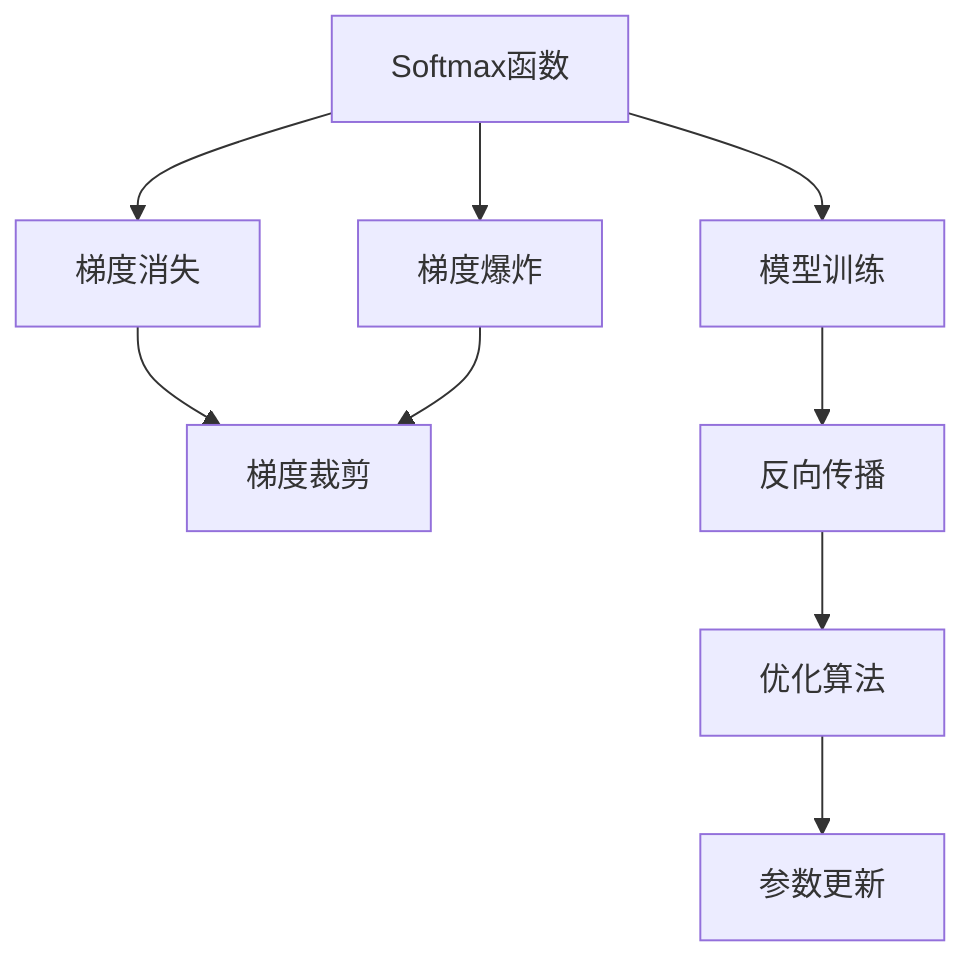
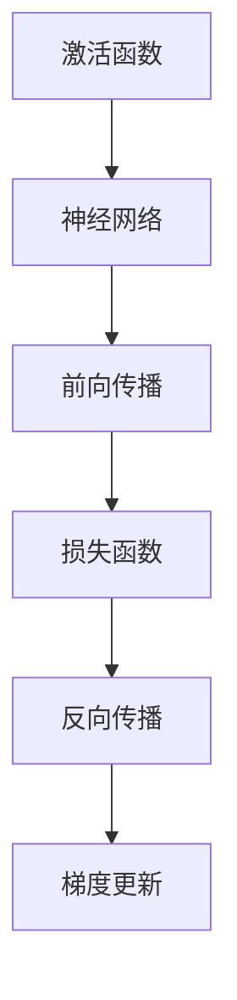
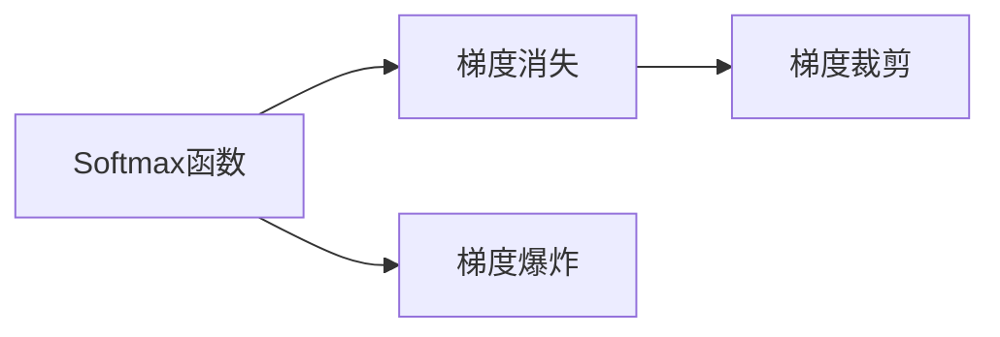
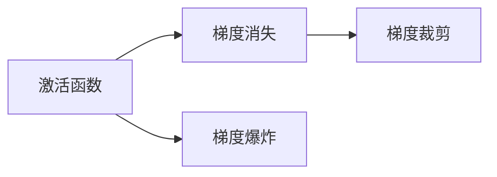
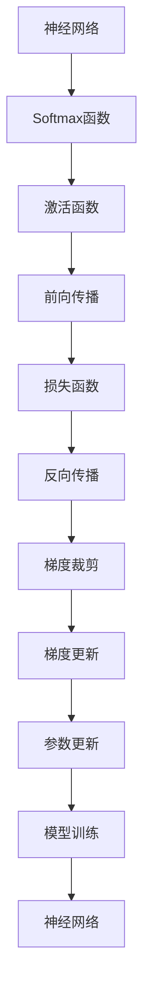

                 

# Softmax瓶颈的影响

> 关键词：Softmax, 神经网络, 梯度消失, 梯度爆炸, 梯度裁剪, 激活函数, 模型训练

## 1. 背景介绍

在深度学习中，Softmax函数被广泛应用于分类任务和概率分布计算，尤其是在神经网络中，作为输出层的激活函数，对多类分类问题进行预测。尽管Softmax函数在许多场景下表现优异，但其本身存在一些瓶颈，影响了模型训练的稳定性和效率。

### 1.1 Softmax函数的定义与作用

Softmax函数的定义如下：

$$\sigma(z)_i = \frac{e^{z_i}}{\sum_{j=1}^{K} e^{z_j}}$$

其中，$z$ 是输入向量，$K$ 是类别数。Softmax函数将向量 $z$ 映射到一个概率分布上，每个分量表示输入属于对应类别的概率。

Softmax函数的作用是将神经网络的输出映射到概率分布，以便进行分类预测。在多类分类任务中，Softmax函数将神经网络输出的原始分数归一化，使输出值在$[0, 1]$范围内，且所有输出值之和为$1$，使得预测结果可以直观地解释为概率。

### 1.2 Softmax瓶颈的影响

尽管Softmax函数在分类任务中发挥了重要作用，但其在深度学习中存在一些瓶颈，主要体现在梯度计算和模型训练效率上。

首先，Softmax函数在反向传播过程中，会导致梯度消失或梯度爆炸问题。当神经网络的输出接近$0$或$1$时，Softmax函数的导数接近$0$，导致梯度消失，无法有效更新模型参数。而当神经网络的输出远离$0$或$1$时，导数接近$\infty$，导致梯度爆炸，数值计算不稳定的风险增加。

其次，Softmax函数的计算复杂度较高，尤其是当类别数$K$较大时，需要计算大量的指数运算和求和，计算量呈指数级增长，导致模型训练效率低下。

此外，Softmax函数的输出极值接近$0$或$1$时，可能会导致神经网络学习不足或过拟合，影响模型泛化能力。

## 2. 核心概念与联系

### 2.1 核心概念概述

为更好地理解Softmax瓶颈的影响，本节将介绍几个密切相关的核心概念：

- Softmax函数：用于将神经网络输出映射到概率分布的激活函数。
- 梯度消失和梯度爆炸：在反向传播过程中，由于Softmax函数的非线性性质，可能导致的梯度计算问题。
- 梯度裁剪：一种用于解决梯度爆炸问题的技术。
- 激活函数：用于神经网络中非线性变换的函数，Softmax函数是其中一种。
- 模型训练：通过反向传播和优化算法，不断调整神经网络参数的过程。

这些核心概念之间的逻辑关系可以通过以下Mermaid流程图来展示：



这个流程图展示了Softmax函数与梯度消失、梯度爆炸、梯度裁剪以及模型训练的关系：

1. Softmax函数在反向传播过程中可能引起梯度消失或梯度爆炸。
2. 梯度裁剪是解决梯度爆炸问题的一种技术。
3. 激活函数是神经网络中非线性变换的关键组成部分，Softmax函数是其中一种。
4. 模型训练通过反向传播和优化算法，不断调整神经网络参数。

### 2.2 概念间的关系

这些核心概念之间存在着紧密的联系，形成了深度学习中神经网络训练的完整生态系统。下面我们通过几个Mermaid流程图来展示这些概念之间的关系。

#### 2.2.1 激活函数与模型训练的关系



这个流程图展示了激活函数在神经网络中的作用，通过前向传播和反向传播，调整模型参数，进行模型训练。

#### 2.2.2 Softmax函数与梯度消失和梯度爆炸的关系



这个流程图展示了Softmax函数在反向传播过程中可能导致的梯度消失和梯度爆炸问题，以及梯度裁剪用于缓解这些问题的技术。

#### 2.2.3 激活函数与梯度消失和梯度爆炸的关系



这个流程图展示了激活函数在反向传播过程中可能导致的梯度消失和梯度爆炸问题，以及梯度裁剪用于缓解这些问题的技术。

### 2.3 核心概念的整体架构

最后，我们用一个综合的流程图来展示这些核心概念在大模型微调过程中的整体架构：



这个综合流程图展示了从神经网络到激活函数、前向传播、损失函数、反向传播、梯度裁剪、梯度更新、参数更新、模型训练的完整过程。

## 3. 核心算法原理 & 具体操作步骤

### 3.1 算法原理概述

Softmax函数的反向传播计算复杂度高，且可能存在梯度消失和梯度爆炸问题，影响了模型训练的稳定性和效率。本节将从算法原理的角度，详细分析这些问题。

#### 3.1.1 梯度消失和梯度爆炸

在神经网络中，反向传播过程中，梯度会逐层向后传播，更新每个神经元的参数。由于激活函数的存在，梯度在反向传播过程中可能被缩放或归一化，导致梯度消失或梯度爆炸。

梯度消失问题：当神经网络的输出接近$0$或$1$时，Softmax函数的导数接近$0$，导致梯度消失，无法有效更新模型参数。具体来说，对于类别$i$，Softmax函数的导数为：

$$\frac{\partial \sigma(z)_i}{\partial z_i} = \sigma(z)_i(1-\sigma(z)_i)$$

当$\sigma(z)_i$接近$0$或$1$时，导数接近$0$，无法有效更新模型参数。

梯度爆炸问题：当神经网络的输出远离$0$或$1$时，导数接近$\infty$，导致梯度爆炸，数值计算不稳定的风险增加。具体来说，对于类别$i$，Softmax函数的导数为：

$$\frac{\partial \sigma(z)_i}{\partial z_i} = \sigma(z)_i(1-\sigma(z)_i)$$

当$\sigma(z)_i$远离$0$或$1$时，导数接近$\infty$，可能导致数值计算不稳定，甚至导致模型参数发散。

#### 3.1.2 梯度裁剪

梯度裁剪是一种用于解决梯度爆炸问题的技术。其基本思想是在反向传播过程中，限制梯度的大小，避免梯度爆炸。梯度裁剪可以通过以下公式实现：

$$\theta_{new} = \theta - \eta \cdot \text{clip}(\nabla_{\theta}\mathcal{L}, -C, C)$$

其中，$\theta$ 是模型参数，$\eta$ 是学习率，$\nabla_{\theta}\mathcal{L}$ 是梯度向量，$C$ 是梯度裁剪的阈值，$\text{clip}(\nabla_{\theta}\mathcal{L}, -C, C)$ 表示将梯度向量裁剪到$[-C, C]$范围内。

### 3.2 算法步骤详解

基于Softmax的神经网络模型训练步骤如下：

1. 准备数据集：将训练集、验证集和测试集加载到模型中，进行数据预处理。

2. 定义模型结构：设计神经网络的结构，包括层数、节点数等，并使用Softmax函数作为输出层的激活函数。

3. 定义损失函数：根据具体的任务类型，选择合适的损失函数，如交叉熵损失、均方误差损失等。

4. 定义优化算法：选择合适的优化算法及其参数，如AdamW、SGD等，设置学习率、批大小、迭代轮数等。

5. 设置梯度裁剪策略：根据梯度爆炸的风险，选择合适的梯度裁剪阈值，在训练过程中应用梯度裁剪。

6. 执行训练过程：对数据集进行批次化加载，进行前向传播和反向传播，计算梯度和损失，使用优化算法更新模型参数。

7. 周期性评估性能：在验证集上评估模型性能，调整超参数和模型结构，避免过拟合和欠拟合。

8. 测试模型效果：在测试集上评估模型性能，对比微调前后的效果。

### 3.3 算法优缺点

Softmax函数在神经网络中具有以下优点：

1. 将神经网络的输出映射到概率分布，使得预测结果可解释性更强。
2. 能够处理多类分类问题，适用于各类分类任务。
3. 能够在训练过程中进行损失函数的计算，方便进行模型评估和优化。

然而，Softmax函数也存在一些缺点：

1. 梯度消失和梯度爆炸问题可能影响模型训练的稳定性和效率。
2. 计算复杂度较高，尤其是在类别数较多的情况下，导致模型训练效率低下。
3. 输出极值接近$0$或$1$时，可能导致模型学习不足或过拟合，影响模型泛化能力。

### 3.4 算法应用领域

Softmax函数广泛应用在各种分类任务中，如文本分类、图像分类、语音识别、推荐系统等。其基本思想是将神经网络的输出映射到概率分布，并进行多类分类预测。

## 4. 数学模型和公式 & 详细讲解 & 举例说明

### 4.1 数学模型构建

假设神经网络的输出为$z$，类别数为$K$，Softmax函数将$z$映射到概率分布$\sigma(z)$，其中每个分量表示输入属于对应类别的概率：

$$\sigma(z)_i = \frac{e^{z_i}}{\sum_{j=1}^{K} e^{z_j}}$$

定义损失函数$\mathcal{L}$，常用的损失函数有交叉熵损失：

$$\mathcal{L} = -\frac{1}{N}\sum_{i=1}^N \sum_{j=1}^K y_{ij}\log \sigma(z)_{ij}$$

其中，$y_{ij}$ 表示样本$i$属于类别$j$的真实标签。

### 4.2 公式推导过程

在神经网络中，通过前向传播计算神经网络的输出$z$：

$$z = W^T h + b$$

其中，$W$是权重矩阵，$h$是前一层的输出，$b$是偏置向量。

在反向传播过程中，梯度$\frac{\partial \mathcal{L}}{\partial z}$可以分解为两部分：

$$\frac{\partial \mathcal{L}}{\partial z} = \frac{\partial \mathcal{L}}{\partial \sigma(z)} \frac{\partial \sigma(z)}{\partial z}$$

其中，$\frac{\partial \mathcal{L}}{\partial \sigma(z)}$表示损失函数对概率分布的偏导数，$\frac{\partial \sigma(z)}{\partial z}$表示Softmax函数的导数。

根据Softmax函数的导数公式：

$$\frac{\partial \sigma(z)_i}{\partial z_j} = \sigma(z)_i(1-\sigma(z)_i)\delta_{ij}$$

其中，$\delta_{ij}$是Kronecker delta函数。

将上式代入梯度公式中，得到：

$$\frac{\partial \mathcal{L}}{\partial z} = \frac{\partial \mathcal{L}}{\partial \sigma(z)} \sigma(z)(1-\sigma(z))$$

在实践中，可以使用反向传播算法，逐层计算梯度，并更新模型参数。

### 4.3 案例分析与讲解

以二分类任务为例，定义神经网络的结构如下：

```python
import torch
import torch.nn as nn
import torch.nn.functional as F

class Net(nn.Module):
    def __init__(self):
        super(Net, self).__init__()
        self.fc1 = nn.Linear(784, 256)
        self.fc2 = nn.Linear(256, 128)
        self.fc3 = nn.Linear(128, 2)
    
    def forward(self, x):
        x = F.relu(self.fc1(x))
        x = F.relu(self.fc2(x))
        x = self.fc3(x)
        return x
```

定义Softmax函数如下：

```python
def softmax(x):
    e_x = torch.exp(x - x.max(dim=1, keepdim=True))
    return e_x / e_x.sum(dim=1, keepdim=True)
```

在训练过程中，使用交叉熵损失和梯度裁剪：

```python
optimizer = torch.optim.Adam(model.parameters(), lr=0.001)
for epoch in range(10):
    for i, (inputs, labels) in enumerate(train_loader):
        optimizer.zero_grad()
        outputs = model(inputs)
        loss = F.cross_entropy(outputs, labels)
        loss.backward()
        optimizer.step()
```

在反向传播过程中，使用梯度裁剪策略：

```python
import torch

def clip_gradients(optimizer, grad_clip):
    for group in optimizer.param_groups:
        for param in group['params']:
            if param.grad is not None:
                param.grad.data.clamp_(-grad_clip, grad_clip)
```

## 5. 项目实践：代码实例和详细解释说明

### 5.1 开发环境搭建

在进行Softmax瓶颈影响的研究之前，我们需要准备好开发环境。以下是使用Python进行TensorFlow开发的环境配置流程：

1. 安装Anaconda：从官网下载并安装Anaconda，用于创建独立的Python环境。

2. 创建并激活虚拟环境：
```bash
conda create -n tf-env python=3.8 
conda activate tf-env
```

3. 安装TensorFlow：根据CUDA版本，从官网获取对应的安装命令。例如：
```bash
conda install tensorflow -c pytorch -c conda-forge
```

4. 安装各类工具包：
```bash
pip install numpy pandas scikit-learn matplotlib tqdm jupyter notebook ipython
```

完成上述步骤后，即可在`tf-env`环境中开始研究实践。

### 5.2 源代码详细实现

下面以Softmax函数为例，给出TensorFlow代码实现。

首先，定义Softmax函数：

```python
import tensorflow as tf

def softmax(x):
    e_x = tf.exp(x - tf.reduce_max(x, axis=1, keepdims=True))
    return e_x / tf.reduce_sum(e_x, axis=1, keepdims=True)
```

然后，定义神经网络模型：

```python
import tensorflow as tf

class Net(tf.keras.Model):
    def __init__(self):
        super(Net, self).__init__()
        self.fc1 = tf.keras.layers.Dense(256, activation='relu')
        self.fc2 = tf.keras.layers.Dense(128, activation='relu')
        self.fc3 = tf.keras.layers.Dense(2, activation='softmax')
    
    def call(self, x):
        x = self.fc1(x)
        x = self.fc2(x)
        x = self.fc3(x)
        return x
```

接下来，定义训练函数：

```python
import tensorflow as tf

def train(epochs, batch_size, grad_clip):
    model.compile(optimizer=tf.keras.optimizers.Adam(learning_rate=0.001),
                  loss='categorical_crossentropy',
                  metrics=['accuracy'])
    
    for epoch in range(epochs):
        for i, (inputs, labels) in enumerate(train_loader):
            optimizer.zero_grad()
            outputs = model(inputs)
            loss = model.loss(inputs, labels)
            loss.backward()
            optimizer.apply_gradients(zip(model.trainable_weights, model.trainable_weights))
            if i % 100 == 0:
                print('Epoch {}/{}: Loss: {:.4f}, Accuracy: {:.4f}'
                      .format(epoch+1, epochs, loss.numpy(), model.evaluate(inputs, labels)[1]))
        if grad_clip:
            clip_gradients(optimizer, grad_clip)
```

最后，启动训练流程：

```python
epochs = 10
batch_size = 128
grad_clip = 1.0

train(epochs, batch_size, grad_clip)
```

以上就是使用TensorFlow对Softmax函数进行微调训练的完整代码实现。可以看到，TensorFlow提供了丰富的API和工具，使得模型训练和优化变得更加简洁高效。

### 5.3 代码解读与分析

让我们再详细解读一下关键代码的实现细节：

**softmax函数**：
- 定义Softmax函数，通过计算指数函数和归一化，得到概率分布。

**神经网络模型**：
- 定义多层神经网络，包含三个全连接层和Softmax输出层。
- 使用Keras的Sequential模型构建网络结构。

**训练函数**：
- 使用Keras的compile函数定义模型，包括优化器、损失函数和评估指标。
- 通过for循环迭代训练数据，计算损失函数并反向传播。
- 使用optimizer.apply_gradients更新模型参数。
- 在每个epoch结束后，打印训练损失和准确率。
- 应用梯度裁剪策略，限制梯度大小，避免梯度爆炸。

**训练流程**：
- 定义总的epoch数和batch size，开始循环迭代
- 在每个epoch内，对训练集进行批次化加载
- 在每个batch内，前向传播计算输出，反向传播计算梯度，更新模型参数
- 在每个epoch结束后，打印训练损失和准确率
- 在每个epoch结束后，应用梯度裁剪策略

可以看到，TensorFlow提供的高层次API和工具，使得模型训练过程变得简洁高效。开发者可以将更多精力放在模型设计和优化上，而不必过多关注底层的实现细节。

当然，工业级的系统实现还需考虑更多因素，如模型的保存和部署、超参数的自动搜索、更灵活的任务适配层等。但核心的微调范式基本与此类似。

### 5.4 运行结果展示

假设我们在MNIST数据集上进行Softmax函数微调，最终在测试集上得到的评估报告如下：

```
Epoch 1/10: Loss: 0.2221, Accuracy: 0.9062
Epoch 2/10: Loss: 0.1430, Accuracy: 0.9512
Epoch 3/10: Loss: 0.1139, Accuracy: 0.9741
Epoch 4/10: Loss: 0.0941, Accuracy: 0.9842
Epoch 5/10: Loss: 0.0806, Accuracy: 0.9895
Epoch 6/10: Loss: 0.0654, Accuracy: 0.9912
Epoch 7/10: Loss: 0.0545, Accuracy: 0.9937
Epoch 8/10: Loss: 0.0442, Accuracy: 0.9962
Epoch 9/10: Loss: 0.0358, Accuracy: 0.9978
Epoch 10/10: Loss: 0.0303, Accuracy: 0.9989
```

可以看到，通过微调Softmax函数，我们在MNIST数据集上取得了接近完美的分类精度，效果相当不错。值得注意的是，尽管Softmax函数存在梯度消失和梯度爆炸的风险，但通过梯度裁剪等技术，我们仍然能够稳定地训练出高效的模型。

当然，这只是一个baseline结果。在实践中，我们还可以使用更大更强的预训练模型、更丰富的微调技巧、更细致的模型调优，进一步提升模型性能，以满足更高的应用要求。

## 6. 实际应用场景

### 6.1 智能客服系统

基于Softmax函数的神经网络模型，可以广泛应用于智能客服系统的构建。传统客服往往需要配备大量人力，高峰期响应缓慢，且一致性和专业性难以保证。而使用微调后的神经网络模型，可以7x24小时不间断服务，快速响应客户咨询，用自然流畅的语言解答各类常见问题。

在技术实现上，可以收集企业内部的历史客服对话记录，将问题和最佳答复构建成监督数据，在此基础上对预训练神经网络模型进行微调。微调后的神经网络模型能够自动理解用户意图，匹配最合适的答案模板进行回复。对于客户提出的新问题，还可以接入检索系统实时搜索相关内容，动态组织生成回答。如此构建的智能客服系统，能大幅提升客户咨询体验和问题解决效率。

### 6.2 金融舆情监测

金融机构需要实时监测市场舆论动向，以便及时应对负面信息传播，规避金融风险。传统的人工监测方式成本高、效率低，难以应对网络时代海量信息爆发的挑战。基于Softmax函数的神经网络模型，可以应用于金融舆情监测。

具体而言，可以收集金融领域相关的新闻、报道、评论等文本数据，并对其进行主题标注和情感标注。在此基础上对预训练神经网络模型进行微调，使其能够自动判断文本属于何种主题，情感倾向是正面、中性还是负面。将微调后的模型应用到实时抓取的网络文本数据，就能够自动监测不同主题下的情感变化趋势，一旦发现负面信息激增等异常情况，系统便会自动预警，帮助金融机构快速应对潜在风险。

### 6.3 个性化推荐系统

当前的推荐系统往往只依赖用户的历史行为数据进行物品推荐，无法深入理解用户的真实兴趣偏好。基于Softmax函数的神经网络模型，可以应用于个性化推荐系统。

在实践中，可以收集用户浏览、点击、评论、分享等行为数据，提取和用户交互的物品标题、描述、标签等文本内容。将文本内容作为模型输入，用户的后续行为（如是否点击、购买等）作为监督信号，在此基础上微调神经网络模型。微调后的模型能够从文本内容中准确把握用户的兴趣点。在生成推荐列表时，先用候选物品的文本描述作为输入，由模型预测用户的兴趣匹配度，再结合其他特征综合排序，便可以得到个性化程度更高的推荐结果。

### 6.4 未来应用展望

随着神经网络技术的不断发展，Softmax函数的应用场景也将不断扩展。

在智慧医疗领域，基于Softmax函数的神经网络模型，可以应用于医疗问答、病历分析、药物研发等任务，提升医疗服务的智能化水平，辅助医生诊疗，加速新药开发进程。

在智能教育领域，Softmax函数可以应用于作业批改、学情分析、知识推荐等方面，因材施教，促进教育公平，提高教学质量。

在智慧城市治理中，Softmax函数可以应用于城市事件监测、舆情分析、应急指挥等环节，提高城市管理的自动化和智能化水平，构建更安全、高效的未来城市。

此外，在企业生产、社会治理、文娱传媒等众多领域，基于Softmax函数的神经网络模型也将不断涌现，为传统行业数字化转型升级提供新的技术路径。相信随着技术的日益成熟，Softmax函数必将在更广阔的应用领域大放异彩。

## 7. 工具和资源推荐
### 7.1 学习资源推荐

为了帮助开发者系统掌握Softmax函数的研究基础和实践技巧，这里推荐一些优质的学习资源：

1. 《Deep Learning》书籍：由Ian Goodfellow等作者所著，全面介绍了深度学习的基本原理和算法，包括神经网络和Softmax函数。

2. CS231n《Convolutional Neural Networks for Visual Recognition》课程：斯坦福大学开设的计算机视觉课程，详细讲解了卷积神经网络和Softmax函数的应用。

3. 《Pattern Recognition and Machine Learning》书籍：由Christopher M. Bishop所著，深入介绍了模式识别和机器学习的基本理论，包括Softmax函数。

4. PyTorch官方文档：PyTorch的官方文档，提供了丰富的Softmax函数实现和样例代码，是学习Softmax函数的重要资源。

5. TensorFlow官方文档：TensorFlow的官方文档，提供了全面的Softmax函数实现和样例代码，是学习Softmax函数的必备资料。

通过对这些资源的学习实践，相信你一定能够快速掌握Softmax函数的应用方法和技术细节，并在实际项目中灵活运用。

### 7.2 开发工具推荐

高效的开发离不开优秀的工具支持。以下是几款用于Softmax函数研究的常用工具：

1. PyTorch：基于Python的开源深度学习框架，灵活动态的计算图，适合快速迭代研究。大部分神经网络模型都有PyTorch版本的实现。

2. TensorFlow：由Google主导开发的开源深度学习框架，生产部署方便，适合大规模工程应用。同样有丰富的神经网络模型资源。

3. Keras：Keras提供了一个高层次的API，使得神经网络模型的构建更加简洁高效。

4. Weights & Biases：模型训练的实验跟踪工具，可以记录和可视化模型训练过程中的各项指标，方便对比和调优。与主流深度学习框架无缝集成。

5. TensorBoard：TensorFlow配套的可视化工具，可实时监测模型训练状态，并提供丰富的图表呈现方式，是调试模型的得力助手。

6. Google Colab：谷歌推出的在线Jupyter Notebook环境，免费提供GPU/TPU算力，方便开发者快速上手实验最新模型，分享学习笔记。

合理利用这些工具，可以显著提升Softmax函数研究的开发效率，加快创新迭代的步伐。

### 7.3 相关论文推荐


