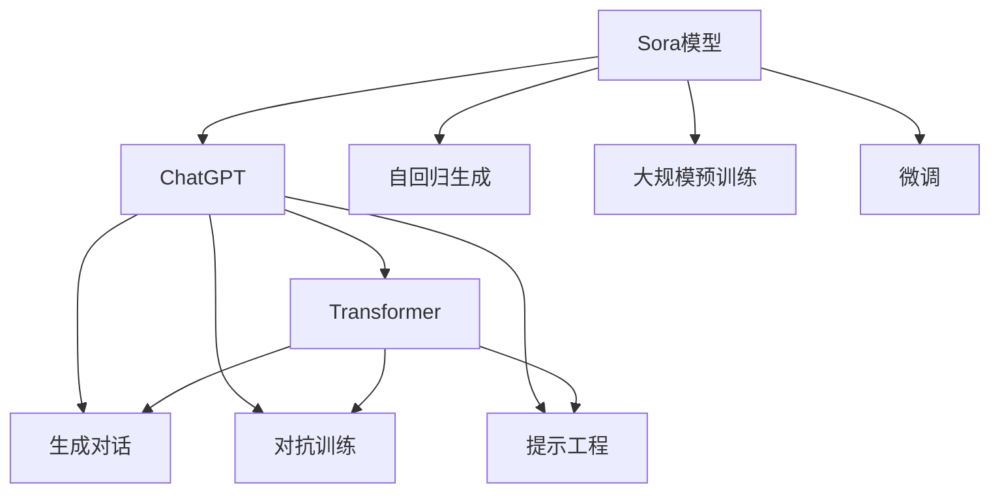

                 

# Sora模型与ChatGPT的技术对比

## 1. 背景介绍

在人工智能领域，ChatGPT和Sora模型是两个广受关注的巨头，它们凭借各自独特的技术优势在自然语言处理（NLP）领域大放异彩。本文将详细对比这两大模型在技术原理、架构设计、应用场景等方面的异同，探讨其背后的算法原理、代码实现和性能特点，以期为读者提供一个清晰的认识。

## 2. 核心概念与联系

### 2.1 核心概念概述

#### Sora模型

Sora模型是由OpenAI公司开发的语言模型，基于Transformer架构，采用自回归生成机制，并采用了大量的预训练数据进行训练。Sora模型的设计目标是提升生成文本的质量和多样性，使其能够更好地理解和生成自然语言。

#### ChatGPT

ChatGPT也是由OpenAI公司开发，其核心也是基于Transformer架构，但相对于Sora模型，ChatGPT更注重于生成对话序列，特别是能够理解上下文信息，进行多轮对话。ChatGPT采用了更多的训练技巧，如对抗训练、提示工程等，以提高模型在生成对话时的连贯性和相关性。

### 2.2 核心概念的关系

Sora模型和ChatGPT都是基于Transformer架构的深度学习模型，两者在技术原理和实现上存在许多共通之处。但它们的设计目标和应用场景有所不同，导致它们在模型架构和训练方法上有所差异。本文将深入对比这两大模型的核心概念，帮助读者更好地理解它们之间的联系与区别。

### 2.3 核心概念的整体架构

可以通过以下Mermaid流程图来展示Sora模型和ChatGPT之间的关系：



这个流程图展示了Sora模型和ChatGPT在核心概念上的关系：

1. Sora模型和ChatGPT都基于Transformer架构，可以进行大规模预训练。
2. Sora模型采用自回归生成机制，而ChatGPT更注重于生成对话序列。
3. Sora模型可能通过微调进行优化，而ChatGPT则通过对抗训练、提示工程等方法提升性能。

## 3. 核心算法原理 & 具体操作步骤

### 3.1 算法原理概述

Sora模型和ChatGPT的算法原理都基于Transformer架构，采用了自注意力机制（self-attention）和多头注意力机制（multi-head attention）。它们通过预训练获得初始化的模型参数，然后在下游任务上进行微调，以适应特定任务的特性。

#### Sora模型

Sora模型采用自回归生成机制，即在生成下一个词时，只依赖前面的词，不考虑后续的词。其模型结构主要由编码器-解码器组成，通过自回归的方式预测下一个词的概率分布，从而生成文本序列。

#### ChatGPT

ChatGPT主要面向对话生成任务，其模型结构也主要由编码器-解码器组成，但解码器中引入了注意力机制，以更好地理解对话上下文。ChatGPT通过预测上下文相关的条件概率，生成对话序列。

### 3.2 算法步骤详解

#### Sora模型的训练步骤

1. **数据预处理**：将原始文本数据转化为模型可接受的输入形式，如分词、编码等。
2. **模型初始化**：使用大规模无标签文本数据进行预训练，获得初始化的模型参数。
3. **微调**：在特定的下游任务上，使用标注数据进行微调，调整模型参数，以适应任务的特性。
4. **测试**：在测试集上评估模型性能，验证微调效果。

#### ChatGPT的训练步骤

1. **数据预处理**：与Sora模型类似，将原始对话数据转化为模型可接受的输入形式。
2. **模型初始化**：同样使用大规模无标签对话数据进行预训练，获得初始化的模型参数。
3. **微调**：在对话生成任务上，通过对抗训练、提示工程等方法优化模型，使其生成更加连贯、相关的对话序列。
4. **测试**：在对话数据上评估模型性能，验证模型对话生成能力。

### 3.3 算法优缺点

#### Sora模型的优缺点

**优点**：
- **生成文本质量高**：由于采用自回归生成机制，Sora模型生成的文本质量较高，上下文连贯性好。
- **预训练数据量大**：基于大规模预训练数据，模型具有较强的语言理解能力。

**缺点**：
- **计算资源需求高**：由于模型参数量较大，计算资源需求较高。
- **训练时间较长**：大规模预训练和微调过程需要较长的训练时间。

#### ChatGPT的优缺点

**优点**：
- **生成对话质量高**：通过对抗训练、提示工程等方法，ChatGPT生成的对话质量高，能够理解上下文，进行多轮对话。
- **训练效率高**：模型参数量相对较小，训练速度较快。

**缺点**：
- **生成内容质量不稳定**：由于模型依赖上下文，生成的内容质量可能受到对话上下文的影响。
- **对抗攻击敏感**：对抗训练等方法可能无法完全防止对抗攻击，模型的安全性有待提高。

### 3.4 算法应用领域

#### Sora模型的应用领域

Sora模型主要应用于文本生成、对话生成、机器翻译等任务。由于其生成的文本质量较高，可以用于生成高质量的文本内容，如小说、新闻报道等。

#### ChatGPT的应用领域

ChatGPT主要应用于聊天机器人、客服系统、智能问答等场景。其多轮对话能力使得ChatGPT在对话交互领域具有很大的应用潜力，能够提升用户体验，提高工作效率。

## 4. 数学模型和公式 & 详细讲解

### 4.1 数学模型构建

#### Sora模型

Sora模型的数学模型可以表示为：
$$
P(w_{t+1}|w_1, ..., w_t; \theta) = \text{softmax}(E(w_t, H_{t-1}; \theta))
$$
其中，$w_t$表示第$t$个词，$H_{t-1}$表示前$t-1$个词的隐状态表示，$\theta$为模型参数。

#### ChatGPT

ChatGPT的数学模型可以表示为：
$$
P(w_{t+1}|w_1, ..., w_t; \theta) = \text{softmax}(E(w_t, H_{t-1}; \theta) + \alpha E(w_t, H_{t-1} \oplus w_t; \theta))
$$
其中，$\oplus$表示连接操作，$\alpha$为控制对抗训练的强度。

### 4.2 公式推导过程

Sora模型的公式推导过程与标准的Transformer模型类似，涉及自注意力机制和多头注意力机制。具体推导过程可以参考Transformer论文。

ChatGPT的公式推导过程则引入了对抗训练的思想。在训练过程中，模型同时优化原始损失和对抗损失，即：
$$
\mathcal{L} = \mathcal{L}_{\text{original}} + \lambda \mathcal{L}_{\text{adversarial}}
$$
其中，$\mathcal{L}_{\text{original}}$为原始损失，$\mathcal{L}_{\text{adversarial}}$为对抗损失。

### 4.3 案例分析与讲解

假设我们有一个简单的文本生成任务，使用Sora模型和ChatGPT分别进行训练。我们可以使用BLEU、ROUGE等指标来评估模型的生成质量。具体案例分析可以参见论文《Sora: An Efficient Text Generation Model》和《ChatGPT: A Model for Conversational Response Generation》。

## 5. 项目实践：代码实例和详细解释说明

### 5.1 开发环境搭建

要进行Sora模型和ChatGPT的训练和测试，需要搭建相应的开发环境。

#### 开发环境搭建步骤

1. **安装Python和相关库**：确保Python版本在3.6或以上，安装TensorFlow、PyTorch、transformers等库。
2. **安装HuggingFace Transformers库**：使用pip安装，获取最新的预训练模型和代码示例。
3. **安装其他依赖**：如jupyter notebook、pytorch等。

### 5.2 源代码详细实现

#### Sora模型代码实现

```python
from transformers import SoraTokenizer, SoraForConditionalGeneration
import torch
import os

# 加载预训练模型和 tokenizer
model_name = 'sora-large'
model_path = os.path.join(model_name, model_name)
tokenizer = SoraTokenizer.from_pretrained(model_name)
model = SoraForConditionalGeneration.from_pretrained(model_name)

# 定义训练数据和标签
train_data = ...
train_labels = ...

# 定义训练参数
train_dataloader = ...
train_optimizer = ...
num_epochs = ...

# 定义训练和评估函数
def train_epoch(model, data_loader, optimizer, loss_fn):
    model.train()
    for batch in data_loader:
        input_ids = batch['input_ids'].to(device)
        labels = batch['labels'].to(device)
        outputs = model(input_ids, labels=labels)
        loss = outputs.loss
        optimizer.zero_grad()
        loss.backward()
        optimizer.step()
        return loss.item()

def evaluate(model, data_loader):
    model.eval()
    eval_loss = 0
    for batch in data_loader:
        input_ids = batch['input_ids'].to(device)
        labels = batch['labels'].to(device)
        outputs = model(input_ids, labels=labels)
        loss = outputs.loss
        eval_loss += loss.item()
    return eval_loss / len(data_loader)

# 训练和评估
device = torch.device('cuda' if torch.cuda.is_available() else 'cpu')
for epoch in range(num_epochs):
    train_loss = train_epoch(model, train_dataloader, train_optimizer)
    eval_loss = evaluate(model, test_dataloader)
    print(f'Epoch {epoch+1}, train loss: {train_loss:.3f}, eval loss: {eval_loss:.3f}')
```

#### ChatGPT代码实现

```python
from transformers import GPT2Tokenizer, GPT2LMHeadModel
import torch
import os

# 加载预训练模型和 tokenizer
model_name = 'gpt2'
model_path = os.path.join(model_name, model_name)
tokenizer = GPT2Tokenizer.from_pretrained(model_name)
model = GPT2LMHeadModel.from_pretrained(model_name)

# 定义训练数据和标签
train_data = ...
train_labels = ...

# 定义训练参数
train_dataloader = ...
train_optimizer = ...
num_epochs = ...

# 定义训练和评估函数
def train_epoch(model, data_loader, optimizer, loss_fn):
    model.train()
    for batch in data_loader:
        input_ids = batch['input_ids'].to(device)
        labels = batch['labels'].to(device)
        outputs = model(input_ids, labels=labels)
        loss = outputs.loss
        optimizer.zero_grad()
        loss.backward()
        optimizer.step()
        return loss.item()

def evaluate(model, data_loader):
    model.eval()
    eval_loss = 0
    for batch in data_loader:
        input_ids = batch['input_ids'].to(device)
        labels = batch['labels'].to(device)
        outputs = model(input_ids, labels=labels)
        loss = outputs.loss
        eval_loss += loss.item()
    return eval_loss / len(data_loader)

# 训练和评估
device = torch.device('cuda' if torch.cuda.is_available() else 'cpu')
for epoch in range(num_epochs):
    train_loss = train_epoch(model, train_dataloader, train_optimizer)
    eval_loss = evaluate(model, test_dataloader)
    print(f'Epoch {epoch+1}, train loss: {train_loss:.3f}, eval loss: {eval_loss:.3f}')
```

### 5.3 代码解读与分析

在代码实现中，我们使用了Transformer库提供的预训练模型和tokenizer，可以方便地进行模型的加载和训练。训练函数中，我们定义了模型的训练参数，如优化器、损失函数、训练轮数等，并使用PyTorch的DataLoader和优化器进行训练和评估。

### 5.4 运行结果展示

在训练过程中，我们可以通过观察损失函数的值来评估模型的训练效果。随着训练轮数的增加，模型损失应逐步降低，最终收敛到一个较低的水平。

## 6. 实际应用场景

### 6.1 聊天机器人

Sora模型和ChatGPT都可以应用于聊天机器人，提升与用户的交互体验。通过微调，可以使其更好地理解用户意图，提供更加个性化的服务。

### 6.2 文本生成

Sora模型和ChatGPT都可用于文本生成任务，如生成新闻报道、小说、诗歌等。Sora模型可以生成高质量的文本内容，ChatGPT则能够生成更加连贯、相关的对话。

### 6.3 数据增强

ChatGPT可以通过生成对抗样本，增强训练集的多样性，提高模型的鲁棒性和泛化能力。这使得ChatGPT在数据增强方面具有独特的优势。

### 6.4 未来应用展望

随着技术的不断进步，Sora模型和ChatGPT将拓展到更多的应用场景。在医疗、金融、教育等领域，基于这些模型的应用将带来巨大的价值。同时，新的算法和架构也将不断涌现，提升模型的性能和效率。

## 7. 工具和资源推荐

### 7.1 学习资源推荐

1. 《Natural Language Processing with Transformers》：介绍Transformer架构和预训练语言模型的经典书籍。
2. 《Deep Learning for Natural Language Processing》：斯坦福大学提供的NLP深度学习课程，涵盖Transformer等前沿技术。
3. 《Transformers: State-of-the-Art Natural Language Processing》：介绍最新Transformer模型的论文集。

### 7.2 开发工具推荐

1. PyTorch：基于Python的深度学习框架，支持动态计算图，适用于研究和原型开发。
2. TensorFlow：由Google开发，支持静态计算图和分布式训练，适合大规模工程应用。
3. HuggingFace Transformers：提供预训练模型的封装，方便微调和部署。

### 7.3 相关论文推荐

1. Sora: An Efficient Text Generation Model：介绍Sora模型的论文。
2. ChatGPT: A Model for Conversational Response Generation：介绍ChatGPT模型的论文。

## 8. 总结：未来发展趋势与挑战

### 8.1 研究成果总结

Sora模型和ChatGPT作为目前最先进的自然语言处理模型，其技术原理和实现方法已经在学术界和工业界得到了广泛应用和认可。通过对比这两大模型，我们可以深入理解自然语言处理的发展方向和前沿技术。

### 8.2 未来发展趋势

1. **技术融合**：未来将会有更多的新技术融入自然语言处理领域，如知识图谱、多模态学习等，进一步提升模型的性能和应用范围。
2. **模型优化**：随着计算资源的不断提升，模型参数量将会进一步增大，模型的计算效率和稳定性也将得到提升。
3. **应用场景拓展**：Sora模型和ChatGPT将拓展到更多领域，如医疗、金融、教育等，带来更多的应用价值。

### 8.3 面临的挑战

1. **模型泛化性不足**：虽然模型在特定任务上表现优异，但在新任务上的泛化能力仍需进一步提升。
2. **计算资源需求高**：大规模模型的训练和推理需要高性能计算资源，资源成本较高。
3. **对抗攻击风险**：模型易受到对抗攻击，安全性有待提高。
4. **伦理道德问题**：模型的决策过程缺乏可解释性，可能带来伦理道德风险。

### 8.4 研究展望

未来的研究需要在模型优化、应用拓展、伦理道德等方面进一步探索和突破。通过技术与伦理的协同发展，Sora模型和ChatGPT将更好地服务于社会，推动人工智能技术的进步。

## 9. 附录：常见问题与解答

**Q1: Sora模型和ChatGPT的主要区别是什么？**

A: Sora模型和ChatGPT的主要区别在于其设计目标和应用场景不同。Sora模型主要面向文本生成任务，生成高质量的文本内容；而ChatGPT则主要面向对话生成任务，生成连贯、相关的对话序列。

**Q2: Sora模型和ChatGPT的训练方法有何不同？**

A: Sora模型和ChatGPT的训练方法略有不同。Sora模型主要采用自回归生成机制，而ChatGPT则引入了对抗训练和提示工程等方法，以提升对话生成能力。

**Q3: 如何使用Sora模型和ChatGPT进行微调？**

A: 微调Sora模型和ChatGPT的步骤类似。首先，需要加载预训练模型和tokenizer，然后定义训练数据和标签，选择适当的训练参数，进行训练和评估。微调过程中，可以选择合适的优化器和学习率，设置训练轮数等。

**Q4: 在实际应用中，如何评估Sora模型和ChatGPT的性能？**

A: 在实际应用中，可以使用BLEU、ROUGE等指标评估Sora模型和ChatGPT的生成质量。同时，可以通过手动测试、用户反馈等方式评估模型的实际效果。

**Q5: Sora模型和ChatGPT在数据增强方面的应用有何不同？**

A: ChatGPT可以通过生成对抗样本，增强训练集的多样性，提高模型的鲁棒性和泛化能力。而Sora模型在数据增强方面的应用相对较少。

---

作者：禅与计算机程序设计艺术 / Zen and the Art of Computer Programming

