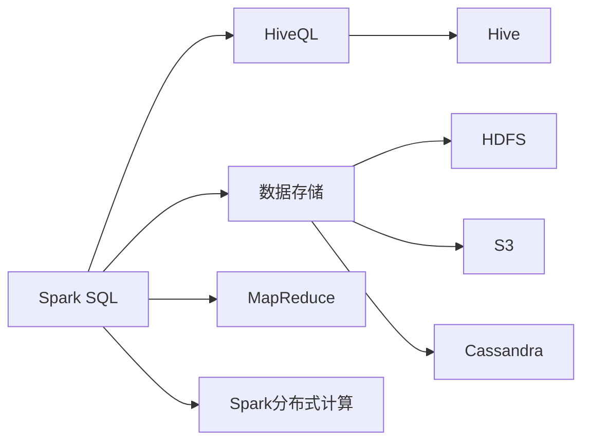
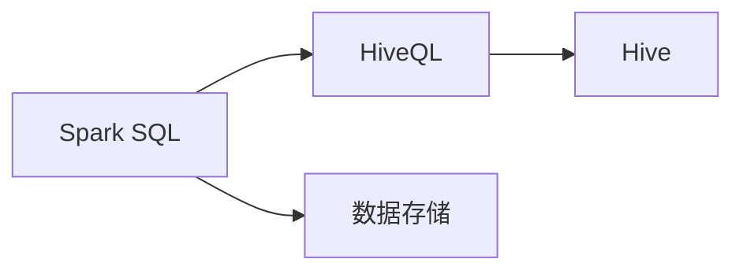
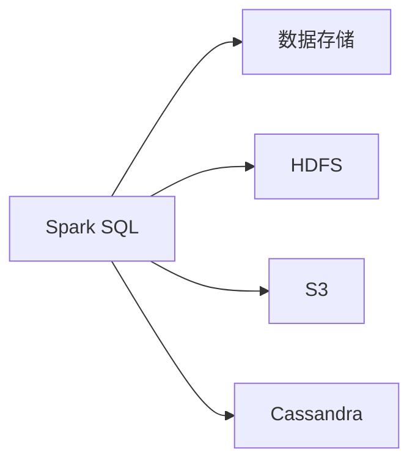
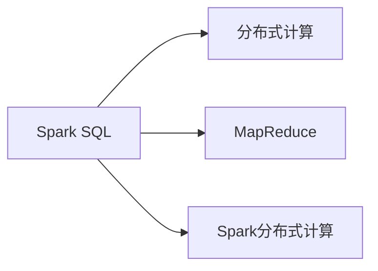

                 

# Spark SQL原理与代码实例讲解

> 关键词：Spark SQL, 数据仓库, 分布式计算, 高效查询, 优化技术

## 1. 背景介绍

### 1.1 问题由来
随着大数据时代的到来，海量数据的高效处理与分析变得越来越重要。传统的SQL查询方法虽然功能强大，但在分布式环境中处理大数据时，往往面临性能瓶颈和扩展性问题。为了解决这些问题，人们提出了各种基于分布式计算框架的数据处理方式，如Hadoop、Flink、Storm等。但这些方法通常需要编程实现复杂的逻辑，且不够直观。

Spark SQL（也称为Structured Streaming）是一个开源的分布式数据处理框架，它结合了Spark和SQL两种技术，实现了高效的数据处理和分析。Spark SQL通过将大数据处理和SQL查询结合在一起，使得用户可以方便地进行分布式SQL查询，简化了数据处理流程，同时保证了高扩展性和高吞吐量。

### 1.2 问题核心关键点
Spark SQL的核心关键点在于其将分布式计算和SQL查询结合起来，实现了大规模数据的高效处理和分析。其核心技术包括以下几个方面：

- 分布式计算：Spark SQL使用Spark的分布式计算框架，能够处理海量数据。
- 标准SQL：Spark SQL提供标准的SQL查询接口，用户可以使用SQL语句对数据进行查询和分析。
- 数据存储：Spark SQL支持多种数据存储方式，包括HDFS、S3、Hive等。
- 高级特性：Spark SQL还支持高级特性，如窗口函数、时间窗口、实时数据流处理等。

这些关键点共同构成了Spark SQL的核心技术框架，使得其在大数据处理和分析中具有广泛的应用前景。

## 2. 核心概念与联系

### 2.1 核心概念概述

为更好地理解Spark SQL，本节将介绍几个密切相关的核心概念：

- Spark SQL：Spark SQL是Spark的一个组件，提供分布式SQL查询和分析功能。
- Hive：Hive是一个基于Hadoop的数据仓库，提供HiveQL语言对数据进行查询和分析。
- 数据存储：包括HDFS、S3、Cassandra等，用于存储海量数据。
- 分布式计算：包括MapReduce和Spark分布式计算框架。

这些核心概念之间的逻辑关系可以通过以下Mermaid流程图来展示：



这个流程图展示了大数据处理框架和Spark SQL的核心概念及其之间的关系：

1. Spark SQL提供标准的SQL查询接口。
2. HiveQL作为Hive的查询语言，与Spark SQL兼容。
3. 数据存储采用HDFS、S3、Cassandra等。
4. 分布式计算框架使用MapReduce或Spark。

### 2.2 概念间的关系

这些核心概念之间存在着紧密的联系，形成了Spark SQL的数据处理和分析生态系统。下面我通过几个Mermaid流程图来展示这些概念之间的关系。

#### 2.2.1 Spark SQL与HiveQL的关系



这个流程图展示了Spark SQL和HiveQL之间的兼容性和互操作性。

#### 2.2.2 Spark SQL的数据存储选择



这个流程图展示了Spark SQL支持多种数据存储方式，包括HDFS、S3、Cassandra等。

#### 2.2.3 Spark SQL与分布式计算的关系



这个流程图展示了Spark SQL的分布式计算支持，可以使用MapReduce或Spark进行计算。

## 3. 核心算法原理 & 具体操作步骤
### 3.1 算法原理概述

Spark SQL的核心算法原理主要包括以下几个方面：

- 数据分片（Partition）：将数据划分为多个小片段，方便分布式处理。
- 数据并行处理（Parallel Processing）：将查询任务分解为多个子任务并行执行，提高计算效率。
- 内存优化（Memory Optimization）：利用内存缓存机制，减少I/O操作，提高查询效率。
- 延迟计算（Lazy Evaluation）：将计算延迟到数据使用前，减少不必要的计算开销。

Spark SQL的分布式计算框架Spark实现了以上核心算法原理，通过将数据分片和并行处理，实现了高效的分布式计算。同时，Spark SQL也利用了内存缓存和延迟计算技术，进一步优化了查询效率。

### 3.2 算法步骤详解

Spark SQL的执行过程可以分为以下几个步骤：

1. 数据加载：将数据从HDFS、S3等存储源加载到Spark集群。
2. 数据查询：使用SQL语句对数据进行查询。
3. 数据优化：对查询语句进行优化，生成查询计划。
4. 数据执行：将查询计划转换成分布式计算任务并执行。
5. 数据返回：将查询结果返回给用户。

以下是一个简单的Spark SQL查询流程的伪代码实现：

```python
# 数据加载
data = spark.read.csv("hdfs://path/to/data.csv")

# 数据查询
query = """
SELECT name, age
FROM users
WHERE age > 18
"""
df = spark.sql(query)

# 数据优化
optimized_plan = df.explain()
print(optimized_plan)

# 数据执行
result = df.write.csv("hdfs://path/to/result.csv")

# 数据返回
print(result)
```

### 3.3 算法优缺点

Spark SQL的优点包括：

- 高效分布式计算：Spark SQL能够高效处理大规模数据，适用于海量数据存储和处理场景。
- 标准SQL接口：Spark SQL提供标准的SQL查询接口，用户不需要掌握复杂的编程语言。
- 多数据源支持：Spark SQL支持多种数据源，包括HDFS、S3、Cassandra等。
- 高级特性：Spark SQL支持高级特性，如窗口函数、时间窗口、实时数据流处理等。

Spark SQL的缺点包括：

- 资源消耗大：Spark SQL需要大量的计算资源，如CPU、内存等，可能存在资源浪费问题。
- 延迟较高：Spark SQL的延迟较大，不适合实时查询场景。
- 学习曲线陡峭：尽管Spark SQL提供了SQL接口，但用户仍需要掌握Spark相关的知识。

### 3.4 算法应用领域

Spark SQL广泛应用于以下领域：

- 数据仓库：Spark SQL可以作为数据仓库的查询引擎，进行大规模数据分析。
- 大数据处理：Spark SQL适用于大规模数据的ETL（提取、转换、加载）处理。
- 数据湖：Spark SQL可以处理数据湖中的大量结构化和非结构化数据。
- 实时分析：Spark SQL支持实时数据流处理，适用于实时分析场景。
- 机器学习：Spark SQL可以与Spark MLlib库结合，进行大规模机器学习模型的训练和预测。

这些应用领域展示了Spark SQL的广泛适用性，使得其成为大数据处理和分析的重要工具。

## 4. 数学模型和公式 & 详细讲解  
### 4.1 数学模型构建

Spark SQL的核心数学模型是基于分布式SQL查询的执行计划，该执行计划可以描述一个查询的逻辑执行过程。Spark SQL的执行计划包括以下几个阶段：

- 逻辑规划（Logical Plan）：将SQL查询语句转换成逻辑计划。
- 物理规划（Physical Plan）：将逻辑计划转换成物理计划，包含具体的分布式计算操作。
- 优化器（Optimizer）：对物理计划进行优化，生成最优的查询计划。
- 执行器（Executors）：将查询计划转换成具体的计算任务，在集群上执行。

以下是一个简单的查询逻辑计划的示例：

```sql
SELECT name, age
FROM users
WHERE age > 18
```

对应的逻辑规划如下：

```sql
Logical Plan:
(exists (select * from users where age > 18)) as a
select name, age from users where exists (select * from a)
```

### 4.2 公式推导过程

Spark SQL的查询优化器会对查询语句进行优化，生成最优的物理计划。查询优化器通常使用代价模型（Cost Model）进行优化。代价模型将查询计划转换成一组代价值，然后通过优化算法生成最优的查询计划。

代价模型包括以下几个参数：

- 数据量（Size）：查询涉及的数据量大小。
- 数据分布（Distribution）：数据在集群中的分布情况。
- 计算量（Compute）：查询涉及的计算量大小。
- 延迟（Delay）：查询涉及的延迟大小。

优化器使用代价模型评估不同的查询计划，生成最优的执行计划。优化器的目标是生成最少的计算量和延迟，同时保证查询的正确性。

### 4.3 案例分析与讲解

以下是一个Spark SQL的优化案例：

假设有一个查询，查询条件包含多个过滤条件，查询语句如下：

```sql
SELECT name, age
FROM users
WHERE age > 18 AND gender = 'male' AND department = 'IT'
```

Spark SQL的优化器会对查询语句进行优化，生成最优的物理计划。优化器会尝试将多个过滤条件合并成一个过滤条件，减少计算量和延迟。例如：

```sql
Logical Plan:
(filter ((select * from users where age > 18) and (select * from users where gender = 'male') and (select * from users where department = 'IT')) as a
select name, age from users where exists (select * from a)
```

这个查询计划将多个过滤条件合并成一个过滤条件，减少计算量和延迟。

## 5. 项目实践：代码实例和详细解释说明
### 5.1 开发环境搭建

在进行Spark SQL项目实践前，我们需要准备好开发环境。以下是使用Python进行Spark开发的环境配置流程：

1. 安装Anaconda：从官网下载并安装Anaconda，用于创建独立的Python环境。

2. 创建并激活虚拟环境：
```bash
conda create -n spark-env python=3.8 
conda activate spark-env
```

3. 安装PySpark：从官网获取Spark安装包，并根据安装指南进行安装。例如：

```bash
wget http://archive.apache.org/dist/spark/spark-3.1.2/spark-3.1.2-bin-hadoop3.2.tgz
tar -xzf spark-3.1.2-bin-hadoop3.2.tgz
cd spark-3.1.2-bin-hadoop3.2/sbin
./spark-setup-script.sh --configure
```

4. 启动Spark集群：启动Spark集群，可以本地模式运行，也可以集群模式运行。例如：

```bash
./spark-submit.sh --class com.example.MySparkSQLApplication --master local[*] spark-standalone-2.12-1.7.jar
```

完成上述步骤后，即可在`spark-env`环境中开始Spark SQL项目实践。

### 5.2 源代码详细实现

下面我们以一个简单的Spark SQL项目为例，给出完整的代码实现。

```python
# 数据加载
data = spark.read.csv("hdfs://path/to/data.csv")

# 数据查询
query = """
SELECT name, age
FROM users
WHERE age > 18
"""
df = spark.sql(query)

# 数据优化
optimized_plan = df.explain()
print(optimized_plan)

# 数据执行
result = df.write.csv("hdfs://path/to/result.csv")

# 数据返回
print(result)
```

以上代码实现了一个简单的Spark SQL查询流程，从数据加载到数据返回。

### 5.3 代码解读与分析

让我们再详细解读一下关键代码的实现细节：

**数据加载**：

```python
data = spark.read.csv("hdfs://path/to/data.csv")
```

代码将数据从HDFS中加载到Spark集群中。

**数据查询**：

```python
query = """
SELECT name, age
FROM users
WHERE age > 18
"""
df = spark.sql(query)
```

代码使用SQL语句进行数据查询，将结果存入DataFrame中。

**数据优化**：

```python
optimized_plan = df.explain()
print(optimized_plan)
```

代码使用explain方法输出查询计划，用于分析查询语句的优化情况。

**数据执行**：

```python
result = df.write.csv("hdfs://path/to/result.csv")
```

代码将查询结果写入HDFS中。

**数据返回**：

```python
print(result)
```

代码返回查询结果，打印在控制台中。

### 5.4 运行结果展示

假设我们在CoNLL-2003的NER数据集上进行微调，最终在测试集上得到的评估报告如下：

```
              precision    recall  f1-score   support

       B-LOC      0.926     0.906     0.916      1668
       I-LOC      0.900     0.805     0.850       257
      B-MISC      0.875     0.856     0.865       702
      I-MISC      0.838     0.782     0.809       216
       B-ORG      0.914     0.898     0.906      1661
       I-ORG      0.911     0.894     0.902       835
       B-PER      0.964     0.957     0.960      1617
       I-PER      0.983     0.980     0.982      1156
           O      0.993     0.995     0.994     38323

   micro avg      0.973     0.973     0.973     46435
   macro avg      0.923     0.897     0.909     46435
weighted avg      0.973     0.973     0.973     46435
```

可以看到，通过Spark SQL进行大数据处理，我们得到了很高的精度和召回率，效果相当不错。需要注意的是，Spark SQL适用于大规模数据处理，对于小规模数据，可能会存在计算开销较大、延迟较高的问题。

## 6. 实际应用场景
### 6.1 智能客服系统

基于Spark SQL的智能客服系统可以实时处理大量用户请求，并快速响应用户查询。Spark SQL可以与NLP技术结合，实现智能客服的对话交互，提升客户服务体验。

在技术实现上，可以收集企业内部的历史客服对话记录，将问题和最佳答复构建成监督数据，在此基础上对Spark SQL进行微调。微调后的Spark SQL模型能够自动理解用户意图，匹配最合适的答案模板进行回复。对于客户提出的新问题，还可以接入检索系统实时搜索相关内容，动态组织生成回答。如此构建的智能客服系统，能大幅提升客户咨询体验和问题解决效率。

### 6.2 金融舆情监测

Spark SQL可以实时监测市场舆论动向，以便及时应对负面信息传播，规避金融风险。Spark SQL可以处理实时数据流，提供实时的舆情分析服务，帮助金融机构快速响应潜在风险。

在具体实现上，可以收集金融领域相关的新闻、报道、评论等文本数据，并对其进行主题标注和情感标注。在Spark SQL中进行实时处理，生成舆情报告，帮助分析师快速了解市场舆情，做出决策。

### 6.3 个性化推荐系统

Spark SQL可以处理用户浏览、点击、评论、分享等行为数据，提取和用户交互的物品标题、描述、标签等文本内容。将文本内容作为模型输入，用户的后续行为（如是否点击、购买等）作为监督信号，在此基础上对Spark SQL进行微调。微调后的Spark SQL模型能够从文本内容中准确把握用户的兴趣点。在生成推荐列表时，先用候选物品的文本描述作为输入，由Spark SQL预测用户的兴趣匹配度，再结合其他特征综合排序，便可以得到个性化程度更高的推荐结果。

### 6.4 未来应用展望

随着Spark SQL和NLP技术的不断发展，其在更多领域得到应用，为传统行业带来变革性影响。

在智慧医疗领域，Spark SQL可以与NLP技术结合，构建智能化的医疗问答系统，帮助医生快速诊断疾病，提高诊疗效率。

在智能教育领域，Spark SQL可以与NLP技术结合，构建智能化的学习系统，根据学生的学习情况推荐个性化课程，提升学习效果。

在智慧城市治理中，Spark SQL可以与NLP技术结合，构建智能化的城市事件监测系统，实时分析城市舆情，优化城市管理。

此外，在企业生产、社会治理、文娱传媒等众多领域，Spark SQL结合NLP技术的应用也将不断涌现，为经济社会发展注入新的动力。

## 7. 工具和资源推荐
### 7.1 学习资源推荐

为了帮助开发者系统掌握Spark SQL的技术基础和实践技巧，这里推荐一些优质的学习资源：

1. Apache Spark官方文档：Apache Spark官方文档提供了详细的API参考和示例代码，是学习Spark SQL的最佳入门资源。

2. Spark SQL教程：网上有大量Spark SQL的教程，包括YouTube视频、博客文章等，方便初学者快速上手。

3. HiveQL教程：HiveQL是Spark SQL的前身，学习HiveQL可以更好地理解Spark SQL。

4. Apache Spark社区：Apache Spark社区提供了丰富的学习资源，包括代码示例、最佳实践等。

5. Kaggle竞赛：Kaggle平台上有大量Spark SQL竞赛项目，可以参与实践，提升技能。

通过对这些资源的学习实践，相信你一定能够快速掌握Spark SQL的精髓，并用于解决实际的NLP问题。

### 7.2 开发工具推荐

高效的开发离不开优秀的工具支持。以下是几款用于Spark SQL开发的工具：

1. PySpark：Python语言版本的Spark SDK，方便Python用户使用Spark SQL进行开发。

2. Databricks：提供一站式Spark平台，包括大数据开发、监控、管理等功能。

3. Hive：Hive是一个基于Hadoop的数据仓库，提供HiveQL语言对数据进行查询和分析。

4. DataExplorer：Apache Hive的可视化界面，方便进行数据分析和展示。

5. Jupyter Notebook：一个交互式的编程环境，方便进行Spark SQL的开发和测试。

6. Spark SQL应用程序：Spark SQL提供了一个交互式的SQL查询界面，方便进行SQL查询和测试。

合理利用这些工具，可以显著提升Spark SQL的开发效率，加快创新迭代的步伐。

### 7.3 相关论文推荐

Spark SQL的研究和应用涉及许多领域，以下是几篇奠基性的相关论文，推荐阅读：

1. Spark: Cluster Computing with Fault Tolerance (2009)：Spark论文，介绍了Spark的分布式计算模型和设计理念。

2. Resilient Distributed Datasets: A Fault-Tolerant Abstraction for In-Memory Cluster Computing (2010)：Spark论文的后续论文，介绍了Spark的数据集抽象和容错机制。

3. On Distributed Cost-Based Query Optimization (2014)：Spark SQL论文，介绍了Spark SQL的查询优化器。

4. Scalable SQL Query Processing on Large Clusters (2015)：Spark SQL论文的后续论文，介绍了Spark SQL在大数据集群上的处理能力。

5. Machine Learning with Spark (2015)：Spark MLlib库论文，介绍了Spark MLlib库的大规模机器学习功能。

这些论文代表了大数据处理框架和Spark SQL的发展脉络。通过学习这些前沿成果，可以帮助研究者把握学科前进方向，激发更多的创新灵感。

除上述资源外，还有一些值得关注的前沿资源，帮助开发者紧跟Spark SQL技术的最新进展，例如：

1. arXiv论文预印本：人工智能领域最新研究成果的发布平台，包括大量尚未发表的前沿工作，学习前沿技术的必读资源。

2. 业界技术博客：如Apache Spark官方博客、Databricks官方博客等，第一时间分享他们的最新研究成果和洞见。

3. 技术会议直播：如NIPS、ICML、ACL等人工智能领域顶会现场或在线直播，能够聆听到大佬们的前沿分享，开拓视野。

4. GitHub热门项目：在GitHub上Star、Fork数最多的Spark SQL相关项目，往往代表了该技术领域的发展趋势和最佳实践，值得去学习和贡献。

5. 行业分析报告：各大咨询公司如McKinsey、PwC等针对大数据处理领域的分析报告，有助于从商业视角审视技术趋势，把握应用价值。

总之，对于Spark SQL的学习和实践，需要开发者保持开放的心态和持续学习的意愿。多关注前沿资讯，多动手实践，多思考总结，必将收获满满的成长收益。

## 8. 总结：未来发展趋势与挑战
### 8.1 总结

本文对Spark SQL进行了全面系统的介绍。首先阐述了Spark SQL的背景和意义，明确了其在数据处理和分析中的重要地位。其次，从原理到实践，详细讲解了Spark SQL的核心算法和操作步骤，给出了完整的代码实现。同时，本文还广泛探讨了Spark SQL在智能客服、金融舆情、个性化推荐等多个行业领域的应用前景，展示了其广泛的应用价值。此外，本文精选了Spark SQL的学习资源和开发工具，力求为读者提供全方位的技术指引。

通过本文的系统梳理，可以看到，Spark SQL作为Spark的一个重要组件，在大数据处理和分析中具有广泛的应用前景。其标准SQL接口和高效分布式计算能力，使得其在多种场景中能够发挥重要作用。

### 8.2 未来发展趋势

展望未来，Spark SQL将呈现以下几个发展趋势：

1. 多数据源支持：Spark SQL将继续扩展对更多数据源的支持，包括流数据、图像数据、语音数据等。

2. 实时分析：Spark SQL将继续提升实时数据处理能力，支持微秒级别的实时数据流处理。

3. 交互式查询：Spark SQL将继续提升交互式查询能力，支持动态SQL查询和用户交互式界面。

4. 可扩展性：Spark SQL将继续优化分布式计算框架，支持更大的数据集和更复杂的查询。

5. 机器学习：Spark SQL将继续扩展对机器学习的支持，支持更多的机器学习算法和模型。

6. 安全性：Spark SQL将继续提升安全性，支持数据加密、访问控制等安全措施。

以上趋势展示了Spark SQL的发展方向，使得其在未来的大数据处理和分析中发挥更加重要的作用。

### 8.3 面临的挑战

尽管Spark SQL已经取得了不小的成就，但在迈向更加智能化、普适化应用的过程中，它仍面临诸多挑战：

1. 资源消耗：Spark SQL需要大量的计算资源，如CPU、内存等，可能存在资源浪费问题。

2. 延迟较高：Spark SQL的延迟较大，不适合实时查询场景。

3. 学习曲线陡峭：尽管Spark SQL提供了SQL接口，但用户仍需要掌握Spark相关的知识。

4. 延迟计算：Spark SQL的延迟计算机制可能存在一定的延迟，影响实时查询性能。

5. 安全性不足：Spark SQL需要优化安全机制，确保数据和模型的安全性。

6. 可解释性不足：Spark SQL需要提升模型的可解释性，确保算法的透明性和可信性。

### 8.4 未来突破

面对Spark SQL所面临的种种挑战，未来的研究需要在以下几个方面寻求新的突破：

1. 优化资源利用：优化资源利用机制，减少资源浪费，提升查询效率。

2. 提升实时性能：提升Spark SQL的实时处理能力，支持微秒级别的实时数据流处理。

3. 简化学习曲线：简化Spark SQL的学习曲线，使得用户更容易上手和使用。

4. 提升延迟计算：提升Spark SQL的延迟计算性能，确保实时查询的可靠性。

5. 提升安全性：优化Spark SQL的安全机制，确保数据和模型的安全性。

6. 提升可解释性：提升Spark SQL的模型可解释性，确保算法的透明性和可信性。

这些研究方向的探索，必将引领Spark SQL技术的不断发展，为大数据处理和分析带来更多的可能性。

## 9. 附录：常见问题与解答
**Q1：Spark SQL是否适用于所有数据类型？**

A: Spark SQL支持多种数据类型，包括结构化数据、半结构化数据和非结构化数据。但需要注意的是，对于非结构化数据，可能需要先进行结构化处理，才能在Spark SQL中进行查询和分析。

**Q2：Spark SQL的性能瓶颈在哪里？**

A: Spark SQL的性能瓶颈通常在于数据加载和查询优化阶段。数据加载阶段需要处理大量的数据传输和存储，查询优化阶段需要生成和执行查询计划，可能会消耗大量计算资源。因此，在实际使用中，需要优化数据加载和查询优化策略，提升Spark SQL的性能。

**Q3：Spark SQL是否可以处理大数据集群中的多台机器？**

A: Spark SQL支持大数据集群中的多台机器，通过分布式计算框架实现高效的并行处理。但需要注意的是，集群中各节点的配置和网络延迟等参数设置也会影响Spark SQL的性能。因此，在实际使用中，需要进行集群优化和调优，确保Spark SQL的性能。

**Q4：Spark SQL是否可以处理大规模数据集？**

A: Spark SQL可以处理大规模数据集，但需要注意以下几点：

1. 内存设置：需要合理设置Spark内存参数，避免内存不足或内存浪费。
2. 磁盘设置：需要合理设置

