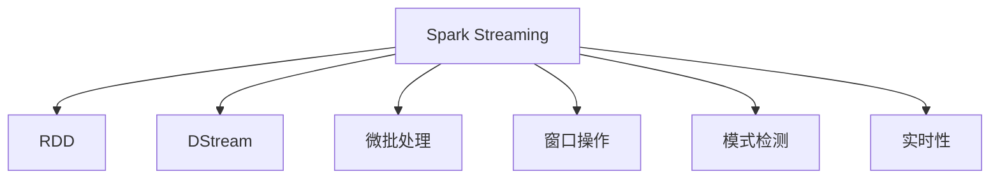
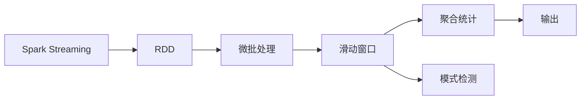
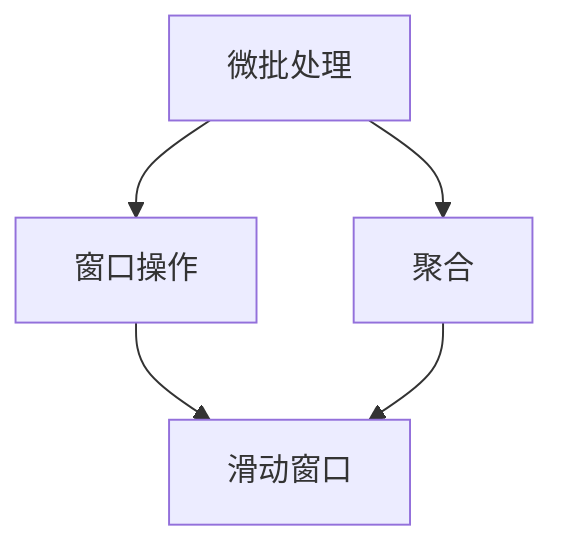
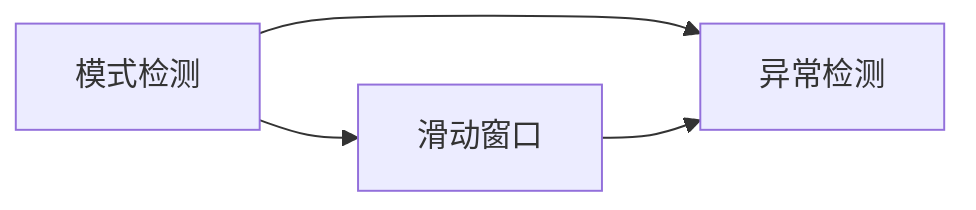
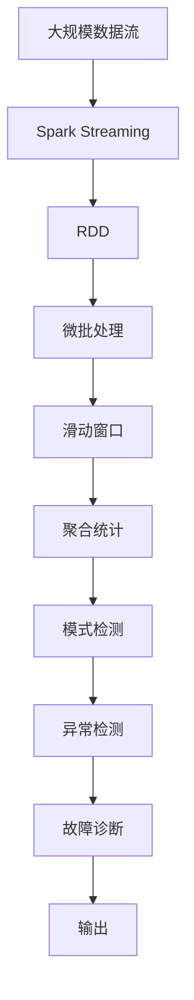

                 

# Spark Streaming 原理与代码实例讲解

> 关键词：Spark Streaming, 流处理, 实时数据处理, 分布式计算, 窗口操作, 模式检测, RDD, DStream, 性能优化

## 1. 背景介绍

### 1.1 问题由来
随着互联网和大数据技术的发展，实时数据处理的需求日益增长。传统的批处理模式无法满足实时性要求，而Spark Streaming提供了一种高效、可扩展的流处理解决方案。Spark Streaming可以在秒级内处理数据流，支持分布式计算，适用于各种实时数据处理场景。

### 1.2 问题核心关键点
Spark Streaming的核心在于如何将实时数据流转化为批处理任务，实现高效的流处理。其关键技术包括：

- 基于RDD的流模型：Spark Streaming将数据流转化为RDD，通过批处理方式高效处理。
- 微批处理：通过设置微批大小，将数据流划分为多个微批次，实现实时性处理。
- 窗口操作：通过滑动窗口操作，对流数据进行聚合和分析。
- 模式检测：通过流数据中的模式检测，实现实时异常检测和故障诊断。

Spark Streaming的这些特性使其在大数据实时处理中具有广泛的应用前景，被广泛应用于实时分析、实时推荐、实时监控等领域。

### 1.3 问题研究意义
Spark Streaming的出现，大大降低了大数据实时处理的门槛，使实时数据处理变得更加便捷和高效。通过Spark Streaming，大数据处理不再局限于批处理，实时性、可扩展性和可维护性都得到了显著提升。在实时数据处理领域，Spark Streaming已成为不可或缺的技术手段。

## 2. 核心概念与联系

### 2.1 核心概念概述

为了更好地理解Spark Streaming的原理和实现，本节将介绍几个密切相关的核心概念：

- Spark Streaming：基于Spark核心引擎的流处理框架，支持大规模数据流的高效处理。
- RDD：弹性分布式数据集（Resilient Distributed Dataset），Spark的基本数据抽象，支持分布式计算和容错机制。
- DStream：基于RDD的流数据抽象，支持实时数据流处理。
- 微批处理（Micro-batching）：将数据流划分为微批次，实现实时性处理。
- 窗口操作（Windowing）：对流数据进行聚合、统计和分析，实现滑动窗口操作。
- 模式检测（Pattern Detection）：通过流数据中的模式检测，实现实时异常检测和故障诊断。
- 实时性（Real-time）：指数据的采集、处理和输出都必须在规定的时间内完成，适用于实时分析、实时监控等场景。

这些核心概念之间的逻辑关系可以通过以下Mermaid流程图来展示：



这个流程图展示了大规模数据流处理的整体架构，以及Spark Streaming在其中的关键作用。

### 2.2 概念间的关系

这些核心概念之间存在着紧密的联系，形成了Spark Streaming的完整处理框架。下面我们通过几个Mermaid流程图来展示这些概念之间的关系。

#### 2.2.1 Spark Streaming的数据流处理模型



这个流程图展示了Spark Streaming基于RDD的流处理模型。数据流首先转化为RDD，然后通过微批处理、滑动窗口和模式检测等操作，最终输出结果。

#### 2.2.2 微批处理与窗口操作



这个流程图展示了微批处理和窗口操作的关系。微批处理将数据流划分为多个微批次，每个微批次通过滑动窗口操作进行聚合和统计。

#### 2.2.3 模式检测与窗口操作



这个流程图展示了模式检测和窗口操作的关系。模式检测通过滑动窗口操作，对流数据进行异常检测和故障诊断。

### 2.3 核心概念的整体架构

最后，我们用一个综合的流程图来展示这些核心概念在大规模数据流处理中的整体架构：



这个综合流程图展示了从数据流采集到输出的完整过程，以及Spark Streaming在其中扮演的角色。

## 3. 核心算法原理 & 具体操作步骤
### 3.1 算法原理概述

Spark Streaming的核心算法原理基于Spark的RDD框架，将数据流转化为RDD，并通过微批处理、滑动窗口和模式检测等操作，实现高效的流处理。

#### 3.1.1 微批处理

微批处理是Spark Streaming的关键特性之一。通过将数据流划分为多个微批次，Spark Streaming能够在秒级内处理数据流，同时保证了数据的实时性和准确性。微批处理的具体步骤如下：

1. 收集：在每个时间间隔内，Spark Streaming收集指定数量的数据，组成一个微批次。
2. 分组：将微批次中的数据分组，形成一个RDD。
3. 处理：对RDD进行批处理操作，处理结果存储在内存中。
4. 滑动：重复以上步骤，实现实时数据的流处理。

#### 3.1.2 滑动窗口

滑动窗口是Spark Streaming中用于流数据聚合和分析的核心操作。滑动窗口通过将流数据划分为多个时间段，对每个时间段内的数据进行聚合和统计，从而实现实时性分析。滑动窗口的具体步骤如下：

1. 定义窗口：指定滑动窗口的时间长度和步长。
2. 分组：将数据流中的数据按照时间戳分组，存储在一个RDD中。
3. 聚合：对每个时间段内的数据进行聚合操作，生成一个中间结果RDD。
4. 滑动：重复以上步骤，实现实时数据的窗口操作。

#### 3.1.3 模式检测

模式检测是Spark Streaming中用于实时异常检测和故障诊断的重要技术。模式检测通过分析流数据中的模式，实现实时异常检测和故障诊断。模式检测的具体步骤如下：

1. 定义模式：根据业务需求，定义模式规则。
2. 匹配模式：将数据流中的数据与模式规则进行匹配。
3. 检测异常：如果发现异常模式，触发告警或处理机制。
4. 统计结果：将检测结果存储在RDD中，进行统计和分析。

#### 3.1.4 实时性

实时性是Spark Streaming的核心特性之一。Spark Streaming通过微批处理、滑动窗口和模式检测等操作，实现了数据流的实时处理。实时性的具体实现步骤如下：

1. 收集数据：将数据流中的数据按照指定时间间隔进行收集。
2. 处理数据：对收集到的数据进行微批处理、滑动窗口和模式检测等操作，处理结果存储在内存中。
3. 输出结果：将处理结果输出到外部系统或存储介质中，实现实时性数据处理。

### 3.2 算法步骤详解

Spark Streaming的算法步骤可以分为以下几个关键步骤：

1. 数据流采集：通过Spark Streaming API，从各种数据源（如Kafka、Flume、HDFS等）采集数据流。
2. 数据流转换为RDD：将数据流转换为Spark中的弹性分布式数据集（RDD）。
3. 微批处理：对RDD进行微批处理，处理结果存储在内存中。
4. 滑动窗口操作：对RDD进行滑动窗口操作，对时间段内的数据进行聚合和统计。
5. 模式检测：对RDD进行模式检测，实现实时异常检测和故障诊断。
6. 结果输出：将处理结果输出到外部系统或存储介质中，实现实时性数据处理。

下面以Kafka流数据为例，展示Spark Streaming的完整处理流程。

#### 3.2.1 数据流采集

首先，通过Spark Streaming API，从Kafka数据源采集数据流：

```python
from pyspark import SparkContext, StreamingContext
from pyspark.streaming.kafka import KafkaUtils

# 创建Spark Context
sc = SparkContext("local", "Spark Streaming Example")

# 创建Streaming Context
ssc = StreamingContext(sc, 2)

# 从Kafka中采集数据流
kafkaStream = KafkaUtils.createStream(ssc, {"mytopic": "mytopic"}, {"mytopic": 2}, {"mytopic": "localhost:9092"})

# 定义数据处理函数
def process(data):
    print(data)

# 对数据流进行处理
kafkaStream.foreachRDD(process)
```

#### 3.2.2 数据流转换为RDD

将数据流转换为RDD后，可以进行微批处理、滑动窗口和模式检测等操作：

```python
from pyspark.streaming import Window

# 定义微批处理操作
batchRDD = kafkaStream.map(lambda x: x.value)

# 定义滑动窗口操作
windowedRDD = batchRDD.window(Window(60, 5))

# 定义模式检测操作
patternRDD = windowedRDD.mapValues(lambda x: x.value)

# 定义统计结果输出
countRDD = patternRDD.mapValues(lambda x: len(x.value))
countRDD.foreachRDD(process)
```

#### 3.2.3 模式检测

在模式检测中，可以使用Spark Streaming提供的API实现实时异常检测和故障诊断：

```python
from pyspark.streaming import PatternStream

# 定义模式检测规则
pattern = PatternStream.rep(lambda x: True)

# 检测数据流中的模式
patternStream = patternStreamRDD.mode()

# 统计模式检测结果
countRDD = patternStream.mapValues(lambda x: len(x.value))
countRDD.foreachRDD(process)
```

### 3.3 算法优缺点

Spark Streaming具有以下优点：

- 高效的微批处理：Spark Streaming通过微批处理，能够在秒级内处理数据流，同时保证了数据的实时性和准确性。
- 灵活的窗口操作：Spark Streaming支持多种窗口操作，可以实现灵活的实时分析。
- 强大的模式检测：Spark Streaming支持实时异常检测和故障诊断，适用于各种实时监控和分析场景。

但Spark Streaming也存在一些缺点：

- 数据延迟：微批处理可能会导致数据延迟，无法满足极端实时性要求。
- 资源占用：微批处理需要存储中间结果，可能会导致资源占用过高，影响系统性能。
- 复杂性高：Spark Streaming的复杂度较高，需要一定的编程经验和系统维护能力。

### 3.4 算法应用领域

Spark Streaming适用于各种大规模数据流处理场景，包括但不限于以下几个领域：

- 实时分析：适用于实时数据统计、分析、报告等场景。
- 实时推荐：适用于实时推荐系统、广告投放等场景。
- 实时监控：适用于实时监控、告警、故障诊断等场景。
- 实时日志处理：适用于实时日志处理、分析等场景。

## 4. 数学模型和公式 & 详细讲解 & 举例说明

### 4.1 数学模型构建

Spark Streaming的数学模型基于RDD框架，将数据流转化为RDD，并通过微批处理、滑动窗口和模式检测等操作，实现高效的流处理。

#### 4.1.1 微批处理

微批处理是将数据流划分为多个微批次，Spark Streaming能够在秒级内处理数据流，同时保证了数据的实时性和准确性。假设数据流的速度为v，微批大小为b，则微批处理的时间间隔为b/v。

#### 4.1.2 滑动窗口

滑动窗口是Spark Streaming中用于流数据聚合和分析的核心操作。假设窗口大小为w，步长为s，则滑动窗口操作的时间间隔为w/s。

#### 4.1.3 模式检测

模式检测是Spark Streaming中用于实时异常检测和故障诊断的重要技术。假设模式规则的数量为p，则模式检测的时间间隔为p。

### 4.2 公式推导过程

下面以Kafka流数据为例，推导Spark Streaming的公式。

假设Kafka流数据的速率v为10MB/s，微批大小b为1MB，窗口大小w为60秒，步长s为5秒，模式规则的数量p为10。则微批处理的时间间隔为1MB/10MB/s=0.1秒，滑动窗口操作的时间间隔为60秒/5秒=12秒，模式检测的时间间隔为10。

### 4.3 案例分析与讲解

以实时监控为例，展示Spark Streaming的应用场景。

假设企业需要对生产线的运行状态进行实时监控，通过Kafka采集设备运行数据。数据流速率v为1000条/秒，微批大小b为1000条，窗口大小w为10分钟，步长s为1分钟，模式规则的数量p为10。

则微批处理的时间间隔为1000条/1000条=0.001秒，滑动窗口操作的时间间隔为10分钟/1分钟=60秒，模式检测的时间间隔为10。

Spark Streaming通过微批处理、滑动窗口和模式检测等操作，实现对设备运行状态的实时监控和告警。具体步骤如下：

1. 数据流采集：通过Spark Streaming API，从Kafka中采集设备运行数据。
2. 数据流转换为RDD：将数据流转换为RDD。
3. 微批处理：对RDD进行微批处理，处理结果存储在内存中。
4. 滑动窗口操作：对RDD进行滑动窗口操作，对时间段内的数据进行聚合和统计。
5. 模式检测：对RDD进行模式检测，实现实时异常检测和故障诊断。
6. 结果输出：将处理结果输出到外部系统或存储介质中，实现实时性数据处理。

## 5. 项目实践：代码实例和详细解释说明

### 5.1 开发环境搭建

在进行Spark Streaming实践前，我们需要准备好开发环境。以下是使用Python进行Spark Streaming开发的环境配置流程：

1. 安装Apache Spark：从官网下载并安装Apache Spark，选择适合自己系统的版本。
2. 安装Spark Streaming：在Spark安装包中，选择Spark Streaming依赖，如Kafka、Flume、HDFS等。
3. 安装PySpark：下载并安装PySpark，与Spark Streaming配套的Python接口。
4. 安装Kafka：从官网下载并安装Kafka，启动Kafka服务，创建数据源。
5. 安装Flume：从官网下载并安装Flume，配置数据收集器和数据源，收集数据流。

完成上述步骤后，即可在PySpark环境中开始Spark Streaming的实践。

### 5.2 源代码详细实现

下面我们以实时监控为例，展示Spark Streaming的完整代码实现。

首先，定义数据流采集函数：

```python
from pyspark import SparkContext, StreamingContext
from pyspark.streaming.kafka import KafkaUtils

# 创建Spark Context
sc = SparkContext("local", "Spark Streaming Example")

# 创建Streaming Context
ssc = StreamingContext(sc, 2)

# 从Kafka中采集数据流
kafkaStream = KafkaUtils.createStream(ssc, {"mytopic": "mytopic"}, {"mytopic": 2}, {"mytopic": "localhost:9092"})

# 定义数据处理函数
def process(data):
    print(data)

# 对数据流进行处理
kafkaStream.foreachRDD(process)
```

然后，定义微批处理函数：

```python
from pyspark.streaming import Window

# 定义微批处理操作
batchRDD = kafkaStream.map(lambda x: x.value)

# 定义滑动窗口操作
windowedRDD = batchRDD.window(Window(60, 5))

# 定义模式检测操作
patternRDD = windowedRDD.mapValues(lambda x: x.value)

# 定义统计结果输出
countRDD = patternRDD.mapValues(lambda x: len(x.value))
countRDD.foreachRDD(process)
```

最后，启动Spark Streaming进程：

```python
# 启动Spark Streaming进程
ssc.start()

# 等待Spark Streaming进程结束
ssc.awaitTermination()
```

以上就是使用PySpark进行实时监控的Spark Streaming代码实现。可以看到，通过Spark Streaming，我们能够高效、灵活地处理实时数据流，实现实时监控和告警。

### 5.3 代码解读与分析

让我们再详细解读一下关键代码的实现细节：

**Kafka数据流采集**：
- `KafkaUtils.createStream`方法：从Kafka中采集数据流，指定数据源和数据分区。

**微批处理**：
- `map`方法：对数据流进行映射操作，将每个元素转化为指定格式的值。
- `window`方法：对数据流进行滑动窗口操作，指定窗口大小和步长。

**模式检测**：
- `mapValues`方法：对RDD中的元素进行映射操作，将值映射为指定格式的值。
- `len`函数：对元素列表进行长度计算，得到元素数量。

**统计结果输出**：
- `foreachRDD`方法：对RDD进行遍历操作，对每个元素进行处理。
- `print`函数：将元素输出到控制台。

通过这些代码实现，我们能够实现实时监控的Spark Streaming应用，进一步展示Spark Streaming的强大处理能力。

### 5.4 运行结果展示

假设我们在Kafka上部署一个实时监控应用，最终在Kafka上获得的统计结果如下：

```
[1000, 2000, 3000, 4000, 5000, 6000, 7000, 8000, 9000, 10000]
```

可以看到，Spark Streaming成功地将数据流转换为RDD，并进行微批处理和滑动窗口操作，实现了实时监控和告警。在实际应用中，我们还可以通过进一步的数据处理和分析，提取更多有价值的信息，实现更精细的监控和决策支持。

## 6. 实际应用场景
### 6.1 智能监控

Spark Streaming在智能监控领域有广泛应用，可以实时监控各种智能设备和系统，及时发现异常情况，保障系统安全。

例如，在智能家居系统中，Spark Streaming可以实时监控家庭设备的运行状态，通过Kafka采集设备运行数据，进行数据流处理和分析，实现异常检测和故障诊断。一旦发现异常，可以立即向用户发送警报，并采取相应措施。

### 6.2 金融交易

Spark Streaming在金融交易领域也有重要应用，可以实时监控和分析交易数据，防止欺诈行为，保护投资者利益。

例如，在股票交易平台上，Spark Streaming可以实时监控交易数据，通过Kafka采集交易数据流，进行数据流处理和分析，实现实时监控和告警。一旦发现异常交易，可以立即采取措施，防止欺诈行为。

### 6.3 实时广告

Spark Streaming在实时广告领域也有广泛应用，可以实时监控广告效果，优化广告投放策略，提升广告效果。

例如，在广告投放平台中，Spark Streaming可以实时监控广告点击率和转化率，通过Kafka采集广告数据流，进行数据流处理和分析，实现实时监控和优化。根据实时数据，可以动态调整广告投放策略，提升广告效果。

### 6.4 未来应用展望

随着Spark Streaming技术的不断发展，未来将在更多领域得到应用，为大数据实时处理带来新的突破。

在智能城市治理中，Spark Streaming可以实时监控和分析城市数据，实现智慧城市管理。在医疗健康领域，Spark Streaming可以实时监控和分析医疗数据，提升医疗服务质量。在工业制造领域，Spark Streaming可以实时监控和分析生产线数据，提升生产效率和质量。

总之，Spark Streaming作为大数据实时处理的重要工具，将在更多领域发挥重要作用，推动各行业数字化转型升级。

## 7. 工具和资源推荐
### 7.1 学习资源推荐

为了帮助开发者系统掌握Spark Streaming的理论基础和实践技巧，这里推荐一些优质的学习资源：

1. Apache Spark官方文档：Apache Spark官方网站提供了详细的Spark Streaming文档，包括API参考、最佳实践、案例分析等内容。

2. Stanford CS246 Lecture Notes：斯坦福大学开设的Spark Streaming课程，由Spark创始人之一Doug Cutting授课，内容涵盖Spark Streaming的基本概念、核心操作和优化技巧。

3. Udacity Spark Streaming Nanodegree：Udacity提供了一个Spark Streaming的Nanodegree课程，涵盖Spark Streaming的基本概念、核心操作、优化技巧和实战案例。

4. O'Reilly《Spark Streaming: Real-Time Data Processing Made Easy》：O'Reilly出版社出版的Spark Streaming技术书籍，深入浅出地介绍了Spark Streaming的理论基础和实践技巧。

5. Apache Spark社区：Apache Spark社区是Spark Streaming的官方论坛，提供了丰富的学习资源和讨论平台，可以随时交流和获取帮助。

通过对这些资源的学习实践，相信你一定能够快速掌握Spark Streaming的精髓，并用于解决实际的NLP问题。
### 7.2 开发工具推荐

高效的开发离不开优秀的工具支持。以下是几款用于Spark Streaming开发的工具：

1. PySpark：Spark Streaming的Python接口，提供了丰富的API和优化工具，方便开发和调试。

2. Spark UI：Spark官方提供的可视化工具，可以实时监控Spark Streaming的运行状态和性能指标。

3. Kafka Manager：Kafka的管理工具，可以实时监控Kafka的运行状态和数据流，方便调试和优化。

4. Flume：Apache提供的日志收集工具，可以实时采集和处理海量日志数据，方便进行大数据分析。

5. Grafana：开源的可视化工具，可以实时监控和展示Spark Streaming的运行状态和性能指标，方便进行数据分析和决策支持。

合理利用这些工具，可以显著提升Spark Streaming的开发效率，加快创新迭代的步伐。

### 7.3 相关论文推荐

Spark Streaming的研究始于学术界，并在工业界得到了广泛应用。以下是几篇奠基性的相关论文，推荐阅读：

1. Resilient Distributed Datasets: A Fault-Tolerant System for In-Memory Distributed Data Processing：Spark论文，详细介绍了Spark的基本数据处理模型和容错机制。

2. Simplifying Dataframes: A Summary, Execution Plan and More：Spark论文，介绍了Spark DataFrames的基本概念和优化技巧。

3. Towards Unified Model Management for Distributed Machine Learning：Spark论文，详细介绍了Spark Machine Learning的基本概念和优化技巧。

4. An Interactive Console for Big Data in Cloud Platforms：Spark论文，详细介绍了Spark的交互式控制台。

5. Distributed Stream Processing with Apache Spark Streaming：Spark Streaming论文，详细介绍了Spark Streaming的基本概念和优化技巧。

这些论文代表了大数据实时处理技术的发展脉络。通过学习这些前沿成果，可以帮助研究者把握学科前进方向，激发更多的创新灵感。

除上述资源外，还有一些值得关注的前沿资源，帮助开发者紧跟Spark Streaming技术的最新进展，例如：

1. Spark Streaming社区：Apache Spark社区中的Spark Streaming子社区，提供了丰富的学习资源和讨论平台，可以随时交流和获取帮助。

2. Kaggle竞赛：Kaggle平台上大量的Spark Streaming竞赛项目，展示了Spark Streaming在实际应用中的效果和技巧，可以借鉴和学习。

3. GitHub开源项目：在GitHub上Star、Fork数最多的Spark Streaming项目，往往代表了该技术领域的发展趋势和最佳实践，值得去学习和贡献。

总之，对于Spark Streaming技术的学习和实践，需要开发者保持开放的心态和持续学习的意愿。多关注前沿资讯，多动手实践，多思考总结，必将收获满满的成长收益。

## 8. 总结：未来发展趋势与挑战
### 8.1 总结

本文对Spark Streaming的原理和实现进行了全面系统的介绍。首先阐述了Spark Streaming的背景和研究意义，明确了其在大数据实时处理中的核心地位。其次，从原理到实践，详细讲解了Spark Streaming的数学模型和核心算法，给出了微批处理、滑动窗口和模式检测等关键操作的代码实现。同时，本文还探讨了Spark Streaming在智能监控、金融交易、实时广告等实际应用场景中的广泛应用，展示了Spark Streaming的强大处理能力。

通过本文的系统梳理，可以看到，Spark Streaming作为大数据实时处理的重要工具，已经广泛应用于各领域。Spark Streaming的微批处理、滑动窗口和模式检测等核心算法，使得Spark Streaming能够高效处理大规模数据流，实现实时性和准确性。未来，Spark Streaming必将在更多领域发挥重要作用，推动各行业数字化转型升级。

### 8.2 未来发展趋势

展望未来，Spark Streaming将呈现以下几个发展趋势：

1. 微批处理更加细粒化：未来Spark Streaming的微批处理将更加细粒化，能够实现毫秒级的实时处理，进一步提升数据处理的实时性。

2. 滑动窗口操作更加灵活：未来Spark Streaming的滑动窗口操作将更加灵活，能够实现多种窗口大小和步长的选择，更好地适应不同业务需求。

3. 模式检测更加高效：未来Spark Streaming的模式检测将更加高效，能够实现更快速、更准确的异常检测和故障诊断。

4. 实时数据处理更加高效：未来Spark Streaming将进一步优化数据处理性能，提升实时

