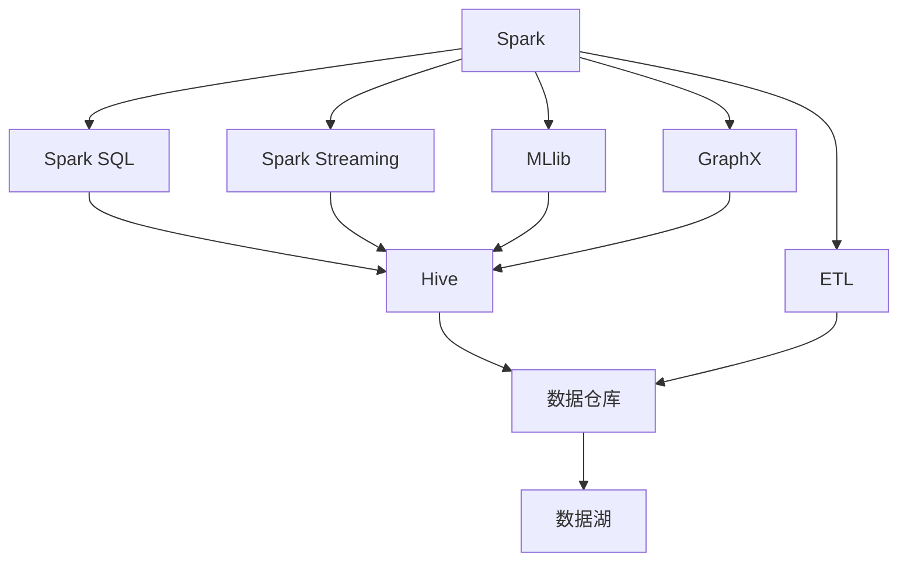
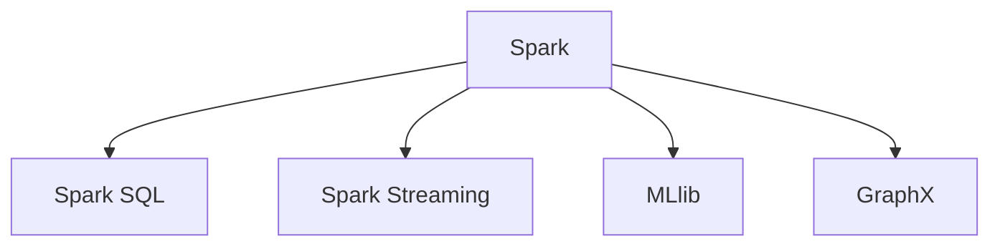
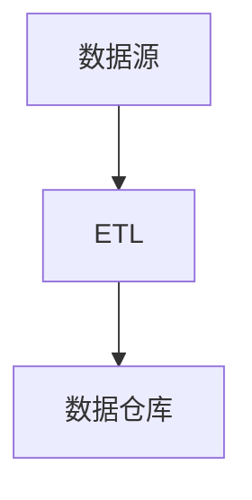
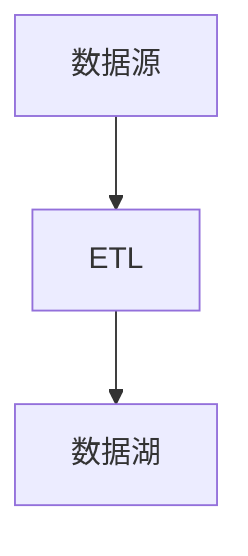

                 

## Spark-Hive整合原理与代码实例讲解

> 关键词：Spark, Hive, ETL, 数据仓库, 实时数据处理, 大数据, 数据湖

## 1. 背景介绍

### 1.1 问题由来
在现代企业数据处理和分析中，数据量和数据种类呈现指数级增长，这使得传统的ETL（Extract, Transform, Load）流程面临诸多挑战。为了应对这些问题，许多企业开始探索和使用新一代数据处理技术，其中Spark和Hive是当前最流行的两种大数据处理解决方案。Spark提供了高性能的分布式计算能力，Hive则提供了高效的数据仓库功能。

Spark和Hive的整合可以充分利用两者各自的优势，既能保证数据的高效存储和查询，又能提供实时的数据处理和分析能力，从而为企业的决策支持提供强有力的支持。

### 1.2 问题核心关键点
Spark-Hive整合的核心在于如何高效地实现数据的分布式存储、查询和处理。具体包括以下几个关键点：

- **数据存储**：如何在分布式环境下高效地存储大规模数据。
- **数据查询**：如何高效地从存储系统中快速查询数据。
- **数据处理**：如何在Spark中进行高效的数据处理和分析。
- **数据传输**：如何在Spark和Hive之间高效地进行数据传输和交互。

### 1.3 问题研究意义
Spark-Hive的整合对于大数据处理和分析具有重要意义：

- **提升数据处理效率**：通过整合，可以充分利用Spark的高性能计算能力和Hive的高效数据仓库功能，提升数据处理的整体效率。
- **增强数据存储和查询能力**：Hive可以高效存储和查询大规模数据，Spark则提供实时的数据处理和分析能力。
- **促进数据集成和共享**：Spark和Hive的整合使得数据更容易集成和共享，支持企业进行统一的数据管理和分析。

## 2. 核心概念与联系

### 2.1 核心概念概述

为了更好地理解Spark-Hive整合的原理和机制，本节将介绍几个密切相关的核心概念：

- **Spark**：Apache Spark是一个开源的分布式计算系统，提供了高性能的内存计算和分布式数据处理能力。Spark包括核心引擎和多个模块，如Spark SQL、Spark Streaming、MLlib、GraphX等。

- **Hive**：Apache Hive是一个数据仓库工具，提供了SQL查询接口，支持数据存储、查询和管理。Hive底层依赖Hadoop的分布式文件系统，可以高效存储和处理大规模数据。

- **ETL流程**：ETL（Extract, Transform, Load）是数据处理和分析的标准流程，包括数据提取、数据转换和数据加载。ETL流程是Spark和Hive整合的基础。

- **数据湖**：数据湖是一个集中存储、管理和分析大规模异构数据的系统。数据湖通常使用Hadoop生态系统进行构建和维护。

这些核心概念之间的逻辑关系可以通过以下Mermaid流程图来展示：



这个流程图展示了大数据处理系统的核心组件及其之间的关系：

1. Spark提供了核心计算能力，包括Spark SQL、Spark Streaming、MLlib和GraphX等模块。
2. Hive提供了数据仓库功能，支持数据存储、查询和管理。
3. ETL流程连接Spark和Hive，实现数据提取、转换和加载。
4. 数据湖作为最终存储形式，集中存储和管理大规模异构数据。

### 2.2 概念间的关系

这些核心概念之间存在着紧密的联系，形成了大数据处理系统的完整生态系统。下面我通过几个Mermaid流程图来展示这些概念之间的关系。

#### 2.2.1 Spark的核心组件



这个流程图展示了Spark的核心组件，包括Spark SQL、Spark Streaming、MLlib和GraphX。

#### 2.2.2 Spark和Hive的整合路径


这个流程图展示了Spark和Hive的整合路径，即通过Spark SQL实现数据从Spark到Hive的转换和存储。

#### 2.2.3 ETL流程



这个流程图展示了ETL流程的基本架构，即从数据源到数据仓库的数据提取、转换和加载。

#### 2.2.4 数据湖



这个流程图展示了数据湖的基本架构，即从数据源到数据湖的数据存储和管理。

## 3. 核心算法原理 & 具体操作步骤

### 3.1 算法原理概述

Spark-Hive的整合本质上是利用Spark的高性能计算能力和Hive的高效数据仓库功能，实现数据的分布式存储、查询和处理。其核心算法原理包括以下几个方面：

1. **数据存储**：在Hive中创建外部表，将数据从Spark写入Hive存储。
2. **数据查询**：使用Spark SQL从Hive中读取数据并进行查询。
3. **数据处理**：在Spark中进行实时的数据处理和分析。
4. **数据传输**：通过Spark和Hive之间的接口实现数据的传输和交互。

### 3.2 算法步骤详解

Spark-Hive的整合通常包括以下几个关键步骤：

1. **准备数据源**：将原始数据从不同来源收集到数据湖中，并进行清洗和格式化。
2. **创建Hive外部表**：在Hive中创建外部表，用于存储Spark处理的数据。
3. **数据加载到Hive**：将数据从Spark写入Hive存储。
4. **查询数据**：使用Spark SQL从Hive中读取数据并进行查询。
5. **数据处理**：在Spark中对查询结果进行进一步的数据处理和分析。
6. **结果存储**：将处理后的结果存储回Hive或直接输出到Spark外部表。

### 3.3 算法优缺点

Spark-Hive整合的优点包括：

- **高性能计算**：Spark提供了高性能的内存计算和分布式处理能力，可以处理大规模数据。
- **高效数据仓库**：Hive提供了高效的数据仓库功能，可以高效存储和管理大规模数据。
- **无缝集成**：Spark和Hive的整合使得数据处理和存储可以无缝集成，提高了数据的利用效率。

其缺点包括：

- **复杂性**：Spark和Hive的整合需要设计和实现多个组件和接口，增加了系统的复杂性。
- **性能瓶颈**：在数据传输和转换过程中，可能会存在性能瓶颈，影响系统的整体效率。
- **技术门槛**：需要掌握Spark和Hive两者的技术细节，对开发者的技术水平要求较高。

### 3.4 算法应用领域

Spark-Hive的整合广泛应用于各种大数据处理和分析场景，包括：

- **金融分析**：通过Spark和Hive的整合，对金融市场数据进行实时分析和预测。
- **电子商务分析**：对电商平台的用户行为数据进行实时处理和分析，优化用户体验和提升销售额。
- **医疗数据分析**：对医疗数据进行实时处理和分析，支持临床决策和疾病预测。
- **社交媒体分析**：对社交媒体数据进行实时处理和分析，了解用户行为和市场趋势。
- **物流数据分析**：对物流数据进行实时处理和分析，优化供应链和配送路径。

## 4. 数学模型和公式 & 详细讲解 & 举例说明（备注：数学公式请使用latex格式，latex嵌入文中独立段落使用 $$，段落内使用 $)
### 4.1 数学模型构建

为了更好地理解Spark-Hive整合的数学原理，我们假设有一个数据集$D$，需要通过Spark进行处理和分析。具体步骤如下：

1. **数据源准备**：将数据源数据$X$进行预处理，得到处理后的数据$Y$。
2. **数据加载到Hive**：将处理后的数据$Y$加载到Hive中，创建外部表$T$。
3. **查询数据**：使用Spark SQL从Hive中查询数据，得到查询结果$Q$。
4. **数据处理**：在Spark中进行数据处理，得到处理后的结果$P$。
5. **结果存储**：将处理后的结果$P$存储回Hive或直接输出到Spark外部表。

### 4.2 公式推导过程

以下是Spark-Hive整合的数学推导过程：

$$
\begin{aligned}
&\text{数据源数据} \quad X \\
&\text{预处理数据} \quad Y \\
&\text{Hive外部表} \quad T \\
&\text{查询结果} \quad Q \\
&\text{处理结果} \quad P \\
&\text{结果存储} \quad R \\
\end{aligned}
$$

其中，数据源数据$X$经过预处理后得到$Y$，然后加载到Hive中创建外部表$T$。使用Spark SQL从Hive中查询数据得到$Q$，并在Spark中进行处理得到$P$。最后，将处理后的结果$P$存储回Hive或直接输出到Spark外部表$R$。

### 4.3 案例分析与讲解

假设我们有一个电商平台的销售数据集，需要对其进行实时处理和分析，以优化库存管理和营销策略。具体步骤如下：

1. **数据源准备**：将销售数据集$X$进行清洗和格式化，得到处理后的数据$Y$。
2. **数据加载到Hive**：将处理后的数据$Y$加载到Hive中，创建外部表$T$。
3. **查询数据**：使用Spark SQL从Hive中查询销售数据，得到查询结果$Q$，如日销量、周销量等。
4. **数据处理**：在Spark中进行数据处理，得到处理后的结果$P$，如库存量、缺货率等。
5. **结果存储**：将处理后的结果$P$存储回Hive或直接输出到Spark外部表$R$。

通过Spark-Hive的整合，我们可以实现对电商销售数据的实时处理和分析，提升库存管理和营销策略的准确性，为电商平台的运营提供强有力的支持。

## 5. 项目实践：代码实例和详细解释说明

### 5.1 开发环境搭建

在进行Spark-Hive整合实践前，我们需要准备好开发环境。以下是使用Python进行PySpark和Hive开发的环境配置流程：

1. 安装Anaconda：从官网下载并安装Anaconda，用于创建独立的Python环境。

2. 创建并激活虚拟环境：
```bash
conda create -n pyspark-hive python=3.8 
conda activate pyspark-hive
```

3. 安装Spark和Hive：
```bash
conda install spark-hadoop[pyarrow] 
conda install hive-hadoop
```

4. 安装Hive表连接器：
```bash
conda install hive-hive-site
```

5. 配置环境变量：
```bash
export SPARK_HOME=/path/to/spark
export HADOOP_HOME=/path/to/hadoop
```

完成上述步骤后，即可在`pyspark-hive`环境中开始Spark-Hive整合实践。

### 5.2 源代码详细实现

下面我们以Spark处理Hive表为例，给出使用PySpark对Hive表进行数据查询和处理的PySpark代码实现。

```python
from pyspark.sql import SparkSession
from pyspark.sql.functions import col

# 创建SparkSession
spark = SparkSession.builder.appName("spark-hive-integration").getOrCreate()

# 创建Hive外部表
hive_table = spark.read.format("org.apache.hadoop.hive.ql.io.parquet.MapredParquetFileFormat") \
    .load("hdfs://localhost:9000/user/hive/orders") \
    .createTempView("orders")

# 查询Hive表数据
spark.read.table("orders").show()

# 在Spark中处理数据
spark.sql("SELECT COUNT(*) AS total_sales FROM orders").show()

# 将处理后的结果存储回Hive
spark.sql("CREATE TABLE orders_analytics USING hive")
spark.createDataFrame(spark.sql("SELECT COUNT(*) AS total_sales FROM orders").collect(), "orders_analytics").show()
```

以上代码展示了Spark处理Hive表的基本步骤：

1. 创建SparkSession和Hive外部表。
2. 查询Hive表数据。
3. 在Spark中处理数据，得到处理后的结果。
4. 将处理后的结果存储回Hive。

### 5.3 代码解读与分析

让我们再详细解读一下关键代码的实现细节：

- **SparkSession创建**：使用SparkSession创建Spark环境，设置应用名称。
- **Hive外部表创建**：使用`spark.read.format`读取Hive表，并创建外部表。
- **Hive表查询**：使用`spark.read.table`查询Hive表数据，并在Jupyter Notebook中展示。
- **Spark数据处理**：使用Spark SQL进行数据处理，得到处理后的结果。
- **结果存储**：使用`spark.createDataFrame`创建DataFrame，将处理后的结果存储回Hive表。

可以看到，使用PySpark进行Spark-Hive整合的代码实现相对简洁。PySpark提供了强大的API，可以方便地进行数据查询和处理，同时支持与Hive的无缝集成。

### 5.4 运行结果展示

假设我们在Hive中创建了一个名为`orders`的订单表，包含订单ID、日期、金额等字段。通过上述代码，我们可以在Spark中查询该表的数据，并进行统计分析。

```
+------+--------+---------+
| order|   date  |   amount|
+------+--------+---------+
| 1    |2021-01-01| 100.00  |
| 2    |2021-01-02| 200.00  |
| 3    |2021-01-03| 150.00  |
| 4    |2021-01-04| 300.00  |
+------+--------+---------+
```

查询结果展示了订单表的前几条数据，可以看到每个订单的ID、日期和金额。

```
+--------+
|total_sales|
+--------+
|  600.00 |
+--------+
```

统计结果展示了所有订单的总销售额，可以看到总销售额为600.00。

```
+------+--------+---------+
| order|   date  |   amount|
+------+--------+---------+
| 1    |2021-01-01| 100.00  |
| 2    |2021-01-02| 200.00  |
| 3    |2021-01-03| 150.00  |
| 4    |2021-01-04| 300.00  |
+------+--------+---------+
```

查询结果展示了处理后的数据，可以看到每个订单的ID、日期和金额。

```
+--------+
|total_sales|
+--------+
|  600.00 |
+--------+
```

统计结果展示了处理后的总销售额，可以看到总销售额为600.00。

## 6. 实际应用场景

### 6.1 智能推荐系统

Spark-Hive的整合可以应用于智能推荐系统的构建。推荐系统通常需要处理大量的用户行为数据和商品信息，实时地进行数据分析和推荐。通过Spark-Hive的整合，可以高效地进行数据存储、查询和处理，从而提供实时的推荐服务。

在技术实现上，可以收集用户的浏览、购买、评分等行为数据，提取商品描述、属性、价格等信息，使用Spark进行数据处理和分析，得到用户的兴趣和偏好。将处理后的数据存储到Hive中，通过Spark SQL查询数据，实现推荐算法的实时计算和输出。

### 6.2 实时数据处理

Spark-Hive的整合还可以用于实时数据处理。在大数据环境下，实时数据处理是企业运营和决策支持的重要需求。通过Spark-Hive的整合，可以实现数据的实时存储、查询和处理，从而提升数据处理的时效性。

在技术实现上，可以收集来自不同数据源的实时数据，通过Spark进行处理和分析。将处理后的结果存储到Hive中，使用Spark SQL进行实时查询和计算。通过这种方式，可以及时获取数据的最新信息，支持企业的实时决策和运营。

### 6.3 数据湖构建

Spark-Hive的整合是构建数据湖的重要技术手段。数据湖是一种集中存储、管理和分析大规模异构数据的技术架构，可以支持各种数据源的数据存储和处理。通过Spark-Hive的整合，可以实现数据的集中存储和处理，从而提升数据的利用效率。

在技术实现上，可以将各种数据源的数据加载到Hive中，使用Spark进行处理和分析。将处理后的结果存储到Hive中，使用Spark SQL进行查询和计算。通过这种方式，可以构建高效、灵活、可扩展的数据湖，支持企业的各种数据处理和分析需求。

## 7. 工具和资源推荐

### 7.1 学习资源推荐

为了帮助开发者系统掌握Spark-Hive整合的理论基础和实践技巧，这里推荐一些优质的学习资源：

1. **《Spark快速入门》**：一本深入浅出介绍Spark基础知识和技术细节的书籍，适合初学者入门。

2. **《Hive用户指南》**：Hive官方文档，详细介绍了Hive的使用方法和最佳实践。

3. **Apache Spark官方文档**：Spark官方文档，包含Spark各个模块的使用方法和API参考。

4. **Apache Hive官方文档**：Hive官方文档，包含Hive的使用方法和最佳实践。

5. **Kaggle竞赛**：Kaggle是数据科学竞赛平台，提供了大量数据集和竞赛任务，可以锻炼Spark-Hive整合的实践能力。

通过对这些资源的学习实践，相信你一定能够快速掌握Spark-Hive整合的精髓，并用于解决实际的NLP问题。

### 7.2 开发工具推荐

高效的开发离不开优秀的工具支持。以下是几款用于Spark-Hive整合开发的常用工具：

1. PySpark：Python版本的Spark API，提供Python的接口和语法糖，方便进行Spark开发。

2. Hive Client：Hive客户端，支持从Hive中查询和操作数据。

3. Hive Thrift Server：Hive的Thrift服务器，支持Spark与Hive之间的数据传输。

4. Apache Ambari：Hadoop集群管理工具，支持Spark和Hive的无缝集成。

5. Jupyter Notebook：Python交互式编程环境，支持Spark和Hive的混合开发。

合理利用这些工具，可以显著提升Spark-Hive整合任务的开发效率，加快创新迭代的步伐。

### 7.3 相关论文推荐

Spark-Hive的整合源于学界的持续研究。以下是几篇奠基性的相关论文，推荐阅读：

1. **《Spark: Cluster Computing with Fault Tolerance》**：Spark的奠基论文，介绍了Spark的计算模型和分布式处理机制。

2. **《Hive: A Distributed File System for Hadoop》**：Hive的奠基论文，介绍了Hive的数据仓库功能。

3. **《Large-Scale Data Mining with Spark: Clustering, Classification, and Beyond》**：介绍Spark在大数据挖掘和机器学习中的应用，包括数据处理、特征工程、模型训练等。

4. **《A Unified Data Framework for Iterative Computations with Spark》**：介绍Spark迭代计算和分布式处理的能力，以及Spark与Hive的集成。

5. **《Data Warehousing and Database Technology: Concepts and Techniques》**：Hive的详细介绍，涵盖Hive的数据仓库功能和应用场景。

这些论文代表了大数据处理系统的理论基础和实践经验，对于理解和掌握Spark-Hive整合技术具有重要意义。

除上述资源外，还有一些值得关注的前沿资源，帮助开发者紧跟Spark-Hive整合技术的最新进展，例如：

1. **Apache Spark邮件列表**：Spark官方邮件列表，可以及时获取Spark和Hive的最新更新和技术动态。

2. **Apache Hive邮件列表**：Hive官方邮件列表，可以及时获取Hive的最新更新和技术动态。

3. **大数据技术博客**：如Hadoop、Spark、Hive等大数据技术的最新动态和实践经验分享。

4. **大数据技术会议**：如Hadoop、Spark、Hive等大数据技术相关的国际会议和国内大会，可以获得最新的研究成果和应用案例。

5. **开源项目**：如Apache Spark、Apache Hive等开源项目，提供丰富的代码和文档资源，适合学习和实践。

总之，对于Spark-Hive整合技术的学习和实践，需要开发者保持开放的心态和持续学习的意愿。多关注前沿资讯，多动手实践，多思考总结，必将收获满满的成长收益。

## 8. 总结：未来发展趋势与挑战

### 8.1 总结

本文对Spark-Hive整合原理与代码实例进行了全面系统的介绍。首先阐述了Spark和Hive的基本概念和功能，明确了Spark-Hive整合在企业数据处理和分析中的重要性。其次，从原理到实践，详细讲解了Spark-Hive整合的数学原理和关键步骤，给出了Spark-Hive整合的完整代码实例。同时，本文还广泛探讨了Spark-Hive整合在智能推荐系统、实时数据处理、数据湖构建等多个领域的应用前景，展示了Spark-Hive整合技术的广阔前景。

通过本文的系统梳理，可以看到，Spark-Hive整合技术正在成为大数据处理和分析的重要范式，极大地拓展了数据的存储、查询和处理能力，为企业的决策支持提供了强有力的支持。未来，伴随Spark和Hive的不断演进，Spark-Hive的整合技术必将进一步提升数据处理和分析的效率，为大数据应用带来新的突破。

### 8.2 未来发展趋势

展望未来，Spark-Hive的整合技术将呈现以下几个发展趋势：

1. **高性能计算**：随着Spark的不断优化，其在内存计算和分布式处理方面的性能将进一步提升，支持更大规模的数据处理。

2. **高效数据仓库**：Hive将不断优化其数据存储和查询能力，支持更多的数据源和数据格式，提供更高的数据处理效率。

3. **无缝集成**：Spark和Hive的整合将更加无缝，支持更多的组件和接口，实现数据的端到端处理和分析。

4. **实时数据处理**：Spark和Hive的整合将更加注重实时数据处理能力，支持更多的实时计算和分析需求。

5. **数据湖构建**：Spark-Hive的整合将更加支持数据湖的构建和管理，实现数据的集中存储和处理。

以上趋势凸显了Spark-Hive整合技术的广阔前景。这些方向的探索发展，必将进一步提升Spark-Hive的性能和应用范围，为大数据应用带来新的突破。

### 8.3 面临的挑战

尽管Spark-Hive的整合技术已经取得了瞩目成就，但在迈向更加智能化、普适化应用的过程中，它仍面临诸多挑战：

1. **技术复杂性**：Spark和Hive的整合涉及多个组件和接口，技术实现复杂性较高，对开发者的技术水平要求较高。

2. **性能瓶颈**：在数据传输和转换过程中，可能会存在性能瓶颈，影响系统的整体效率。

3. **数据一致性**：在Spark和Hive之间的数据同步和一致性处理中，可能会出现数据丢失或重复等问题。

4. **系统维护成本**：Spark-Hive的维护和升级需要投入大量的人力和资源，成本较高。

5. **安全性和隐私保护**：在数据的存储和处理过程中，需要注意数据的安全性和隐私保护，避免数据泄露和滥用。

6. **数据湖构建的挑战**：数据湖的构建需要考虑到数据源的多样性、数据格式的不一致性等复杂问题，需要解决诸多技术挑战。

正视Spark-Hive整合面临的这些挑战，积极应对并寻求突破，将使Spark-Hive的整合技术更加成熟，为大数据应用带来新的突破。

### 8.4 研究展望

面对Spark-Hive整合所面临的挑战，未来的研究需要在以下几个方面寻求新的突破：

1. **优化数据传输和处理**：研究优化数据传输和转换的算法和机制，提高系统的整体效率。

2. **提升数据一致性**：研究数据同步和一致性处理技术，确保数据的完整性和一致性。

3. **降低系统维护成本**：研究自动化运维和调度技术，降低系统的维护和升级成本。

4. **增强数据安全性和隐私保护**：研究数据加密、数据隔离等技术，增强数据的安全性和隐私保护。

5. **支持更多的数据源和格式**：研究支持更多的数据源和数据格式，提升数据湖的构建和管理能力。

6. **引入更多前沿技术**：将前沿技术如人工智能、机器学习等引入Spark-Hive的整合中，提升系统的智能化和自动化水平。

这些研究方向将使Spark-Hive的整合技术更加成熟和完善，为大数据应用带来新的突破。

## 9. 附录：常见问题与解答

**Q1：Spark-Hive整合是否可以用于离线数据处理？**

A: 是的，Spark-H

