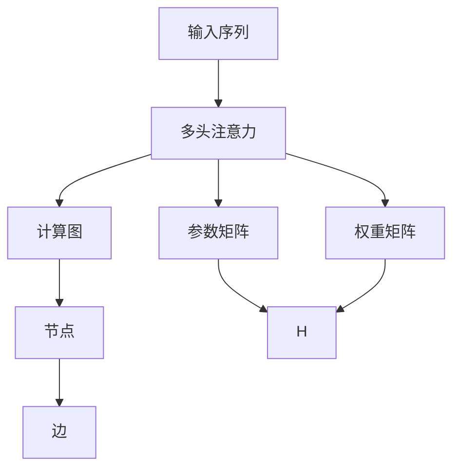
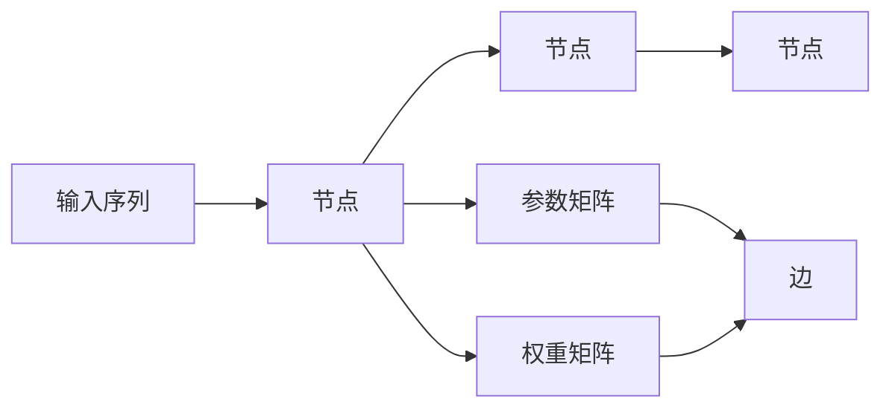
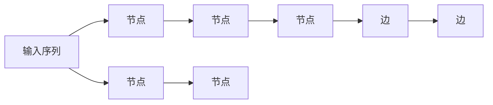

                 

# Transformer大模型实战 多头注意力层

> 关键词：大模型,Transformer,多头注意力,注意力机制,自注意力,计算图

## 1. 背景介绍

### 1.1 问题由来
自2017年Transformer模型提出以来，基于自注意力机制的深度学习模型就成为了NLP领域的核心架构，广泛应用于机器翻译、文本分类、情感分析、问答系统等任务中。Transformer模型显著提升了NLP任务的表现，同时大幅简化了模型结构，提高了训练和推理效率。然而，原始的Transformer模型只具有单一的自注意力机制，难以有效处理长文本和大规模数据。

为此，研究者提出在Transformer模型基础上引入多头注意力机制，使得模型能够同时关注不同维度的信息，大大提升了模型的性能和泛化能力。本文将详细探讨Transformer大模型的多头注意力层，帮助读者深入理解其原理和实现方法。

### 1.2 问题核心关键点
Transformer大模型的多头注意力层是其核心部件之一，通过同时关注不同维度的信息，实现了复杂特征的并行提取和融合，提升了模型的理解能力和表达能力。本文将深入分析多头注意力层的核心原理和实现方法，同时结合实际应用场景，介绍其优缺点和改进策略。

### 1.3 问题研究意义
理解Transformer大模型的多头注意力层，对于掌握Transformer模型的精髓，应用其在NLP任务中的优异表现，具有重要意义。同时，掌握多头注意力机制，也有助于深入理解其他基于自注意力机制的深度学习模型，如BERT、GPT等。

## 2. 核心概念与联系

### 2.1 核心概念概述

为更好地理解Transformer大模型的多头注意力层，本节将介绍几个密切相关的核心概念：

- 自注意力机制(Self-Attention Mechanism)：Transformer模型的核心机制，用于计算输入序列中每个位置对其他位置的注意力权重。自注意力机制通过计算输入序列中每个位置与所有其他位置之间的相似度，得到权重向量，用于加权融合各位置的信息。

- 多头注意力(Multi-Head Attention)：通过将输入序列分解为多个子序列，每个子序列进行独立的自注意力计算，然后将结果进行拼接和线性变换，得到最终的注意力输出。多头注意力机制能够同时关注不同维度的信息，增强模型的表达能力。

- 计算图(Computational Graph)：深度学习模型中用于描述计算流程和参数更新的数据结构。计算图由节点(Node)和边(Edge)组成，节点代表计算操作，边代表数据流向。Transformer大模型中的计算图十分复杂，每个节点可能涉及多层的计算和数据传递。

- 参数矩阵和权重矩阵：在计算图中，自注意力机制中的注意力权重由多个矩阵相乘得到。参数矩阵代表输入序列中的查询、键、值向量，权重矩阵代表注意力权重向量，两者相乘得到权重矩阵。

- 多头注意力计算图：多头注意力机制涉及多个独立的自注意力计算，每个计算图由多个节点和边组成，整体形成一个多分支的计算图结构。

这些核心概念之间的逻辑关系可以通过以下Mermaid流程图来展示：



这个流程图展示了大模型中的多头注意力层和计算图的关系：

1. 输入序列经过多头注意力计算得到输出。
2. 计算图由多个节点和边组成，描述计算流程。
3. 参数矩阵和权重矩阵是计算图中的重要组成部分，用于计算注意力权重。

### 2.2 概念间的关系

这些核心概念之间存在着紧密的联系，形成了Transformer大模型的注意力机制生态系统。下面我通过几个Mermaid流程图来展示这些概念之间的关系。

#### 2.2.1 自注意力机制的计算图



这个流程图展示了自注意力机制的计算图，其中节点B和节点C分别代表查询向量和键值向量，节点D代表注意力权重向量，节点E和节点F代表参数矩阵和权重矩阵。

#### 2.2.2 多头注意力计算图



这个流程图展示了多头注意力机制的计算图，其中节点B和节点C代表单头的自注意力计算图，节点E和节点F分别代表多头的自注意力计算图，节点D和节点G代表多个独立的注意力权重计算图。

#### 2.2.3 计算图的参数矩阵


这个流程图展示了参数矩阵和权重矩阵的计算图，其中节点B代表输入序列，节点E和节点F分别代表参数矩阵和权重矩阵，节点D和节点G分别代表注意力权重计算图。

### 2.3 核心概念的整体架构

最后，我们用一个综合的流程图来展示这些核心概念在大模型多头注意力层的整体架构：


这个综合流程图展示了从输入序列到多头注意力层的完整计算过程，以及其中涉及的参数矩阵、权重矩阵和计算图的细节。通过这个流程图，我们可以更清晰地理解大模型的多头注意力层的工作原理和结构。

## 3. 核心算法原理 & 具体操作步骤
### 3.1 算法原理概述

Transformer大模型的多头注意力层通过同时关注输入序列中不同维度的信息，实现复杂特征的并行提取和融合。具体而言，多头注意力层将输入序列分解为多个子序列，每个子序列进行独立的自注意力计算，然后将结果进行拼接和线性变换，得到最终的注意力输出。

多头注意力层的基本流程如下：

1. 将输入序列分别转化为查询向量、键值向量，计算注意力权重向量。
2. 对多个注意力权重向量进行拼接，得到最终的注意力权重矩阵。
3. 使用注意力权重矩阵对键值向量进行加权求和，得到注意力输出。

多头注意力层的核心在于注意力权重矩阵的计算，其通过查询向量、键值向量和权重矩阵的矩阵乘法，得到注意力权重向量。其中，查询向量、键值向量和权重矩阵分别由不同的参数矩阵计算得到，确保了计算过程的独立性和可控性。

### 3.2 算法步骤详解

以一个3头的多头注意力层为例，介绍其具体实现步骤。

**Step 1: 输入序列准备**

假设输入序列长度为$L$，首先将其分别转化为查询向量、键值向量：

$$
\mathbf{Q}=\mathbf{W}_Q\mathbf{X},\quad \mathbf{K}=\mathbf{W}_K\mathbf{X},\quad \mathbf{V}=\mathbf{W}_V\mathbf{X}
$$

其中，$\mathbf{Q}$、$\mathbf{K}$、$\mathbf{V}$分别代表查询向量、键值向量、值向量，$\mathbf{W}_Q$、$\mathbf{W}_K$、$\mathbf{W}_V$分别代表查询向量、键值向量、值向量的参数矩阵。

**Step 2: 计算注意力权重**

对每个查询向量$\mathbf{q}_i$和所有键值向量$\mathbf{k}_j$计算注意力权重$e_{ij}$：

$$
e_{ij}=\frac{\exp(\mathbf{q}_i\cdot\mathbf{k}_j/\sqrt{d_k})}{\sum_j\exp(\mathbf{q}_i\cdot\mathbf{k}_j/\sqrt{d_k})}
$$

其中，$d_k$代表键值向量的维度，$\cdot$代表向量点乘，$\exp$函数代表指数运算，$\sum$函数代表求和。

**Step 3: 拼接注意力权重**

对每个头计算注意力权重向量，然后拼接得到总的注意力权重矩阵$\mathbf{A}$：

$$
\mathbf{a}_i=\frac{\exp(\mathbf{q}_i\cdot\mathbf{k}_j/\sqrt{d_k})}{\sum_j\exp(\mathbf{q}_i\cdot\mathbf{k}_j/\sqrt{d_k})}\mathbf{v}_j
$$

$$
\mathbf{A}=[\mathbf{a}_1; \mathbf{a}_2; \cdots; \mathbf{a}_h]
$$

**Step 4: 计算注意力输出**

使用注意力权重矩阵$\mathbf{A}$对键值向量$\mathbf{V}$进行加权求和，得到注意力输出$\mathbf{O}$：

$$
\mathbf{O}=\mathbf{A}\mathbf{V}=\sum_i a_i \mathbf{v}_i
$$

**Step 5: 线性变换**

对注意力输出$\mathbf{O}$进行线性变换，得到最终的输出$\mathbf{Y}$：

$$
\mathbf{Y}=\mathbf{W}_Y\mathbf{O}+\mathbf{b}_Y
$$

其中，$\mathbf{W}_Y$和$\mathbf{b}_Y$分别代表输出向量的参数矩阵和偏置向量。

### 3.3 算法优缺点

Transformer大模型的多头注意力层具有以下优点：

1. 并行计算能力强。多头注意力机制可以同时关注多个维度的信息，提升了计算效率。
2. 特征表达能力强。通过并行计算和线性变换，多头注意力层能够学习到复杂特征，提升模型的理解能力。
3. 灵活性高。通过调整参数矩阵，多头注意力层可以适应不同的输入序列和任务需求。

同时，多头注意力层也存在以下缺点：

1. 计算复杂度高。多头注意力层的计算量随头数和序列长度呈二次方增长，增加了计算资源消耗。
2. 参数量较大。多头注意力层涉及多个参数矩阵和权重矩阵，参数量较大，增加了模型训练和推理的计算成本。
3. 内存占用高。多头注意力层的计算过程涉及矩阵乘法，内存占用较高，对计算资源要求较高。

### 3.4 算法应用领域

Transformer大模型的多头注意力层广泛应用于机器翻译、文本分类、问答系统、文本生成等NLP任务中。具体而言，其能够同时关注输入序列中不同维度的信息，增强模型的表达能力和泛化能力，从而提升任务表现。

## 4. 数学模型和公式 & 详细讲解  
### 4.1 数学模型构建

本节将使用数学语言对Transformer大模型的多头注意力层进行更加严格的刻画。

记输入序列长度为$L$，输入序列$\mathbf{X}=\{x_i\}_{i=1}^L$，其中$x_i \in \mathbb{R}^{d_x}$。假设多头注意力层有$h$个注意力头，每个头的查询向量、键值向量和值向量的维度分别为$d_k$、$d_k$、$d_v$，输出向量的维度为$d_y$。

定义多头注意力层为$F(\mathbf{X},\mathbf{W}_Q,\mathbf{W}_K,\mathbf{W}_V,\mathbf{W}_Y,\mathbf{b}_Y)$，其计算过程如下：

1. 将输入序列转化为查询向量、键值向量和值向量：

$$
\mathbf{Q}=\mathbf{W}_Q\mathbf{X},\quad \mathbf{K}=\mathbf{W}_K\mathbf{X},\quad \mathbf{V}=\mathbf{W}_V\mathbf{X}
$$

2. 计算注意力权重矩阵：

$$
\mathbf{A}=\frac{\exp(\mathbf{Q}\mathbf{K}^T/\sqrt{d_k})}{\sum_j\exp(\mathbf{Q}\mathbf{K}^T/\sqrt{d_k})}
$$

3. 拼接注意力权重向量：

$$
\mathbf{a}_i=\frac{\exp(\mathbf{q}_i\cdot\mathbf{k}_j/\sqrt{d_k})}{\sum_j\exp(\mathbf{q}_i\cdot\mathbf{k}_j/\sqrt{d_k})}\mathbf{v}_j
$$

4. 计算注意力输出：

$$
\mathbf{O}=\mathbf{A}\mathbf{V}=\sum_i a_i \mathbf{v}_i
$$

5. 线性变换：

$$
\mathbf{Y}=\mathbf{W}_Y\mathbf{O}+\mathbf{b}_Y
$$

其中，$\mathbf{W}_Q$、$\mathbf{W}_K$、$\mathbf{W}_V$、$\mathbf{W}_Y$和$\mathbf{b}_Y$分别代表查询向量、键值向量、值向量、输出向量和偏置向量的参数矩阵，$\cdot$和$\cdot^T$分别代表向量点乘和向量转置，$\exp$函数和$\sum$函数分别代表指数运算和求和。

### 4.2 公式推导过程

以下我们以3头多头注意力层为例，推导其计算公式。

首先，将输入序列$\mathbf{X}$分别转化为查询向量$\mathbf{Q}$、键值向量$\mathbf{K}$、值向量$\mathbf{V}$：

$$
\mathbf{Q}=\mathbf{W}_Q\mathbf{X},\quad \mathbf{K}=\mathbf{W}_K\mathbf{X},\quad \mathbf{V}=\mathbf{W}_V\mathbf{X}
$$

然后，计算注意力权重矩阵$\mathbf{A}$：

$$
\mathbf{A}=\frac{\exp(\mathbf{Q}\mathbf{K}^T/\sqrt{d_k})}{\sum_j\exp(\mathbf{Q}\mathbf{K}^T/\sqrt{d_k})}
$$

其中，$\mathbf{Q}$和$\mathbf{K}$的维度为$L \times d_k$，$\mathbf{A}$的维度为$L \times L$。

接着，计算注意力权重向量$\mathbf{a}_i$：

$$
\mathbf{a}_i=\frac{\exp(\mathbf{q}_i\cdot\mathbf{k}_j/\sqrt{d_k})}{\sum_j\exp(\mathbf{q}_i\cdot\mathbf{k}_j/\sqrt{d_k})}\mathbf{v}_j
$$

其中，$\mathbf{q}_i$的维度为$d_k$，$\mathbf{k}_j$的维度为$d_k$，$\mathbf{v}_j$的维度为$d_v$，$\mathbf{a}_i$的维度为$d_v$。

最后，计算注意力输出$\mathbf{O}$：

$$
\mathbf{O}=\mathbf{A}\mathbf{V}=\sum_i a_i \mathbf{v}_i
$$

其中，$\mathbf{V}$的维度为$L \times d_v$，$\mathbf{O}$的维度为$L \times d_v$。

对注意力输出$\mathbf{O}$进行线性变换，得到最终的输出$\mathbf{Y}$：

$$
\mathbf{Y}=\mathbf{W}_Y\mathbf{O}+\mathbf{b}_Y
$$

其中，$\mathbf{Y}$的维度为$L \times d_y$。

### 4.3 案例分析与讲解

以机器翻译任务为例，说明Transformer大模型多头注意力层的实际应用。

假设输入序列为英文文本，输出序列为对应的法文翻译，输入序列和输出序列的长度均为$L$。定义多头注意力层为$F(\mathbf{X},\mathbf{W}_Q,\mathbf{W}_K,\mathbf{W}_V,\mathbf{W}_Y,\mathbf{b}_Y)$，其中$\mathbf{X}$为输入序列，$\mathbf{W}_Q$、$\mathbf{W}_K$、$\mathbf{W}_V$、$\mathbf{W}_Y$和$\mathbf{b}_Y$为参数矩阵。

首先，将输入序列$\mathbf{X}$转化为查询向量$\mathbf{Q}$、键值向量$\mathbf{K}$、值向量$\mathbf{V}$：

$$
\mathbf{Q}=\mathbf{W}_Q\mathbf{X},\quad \mathbf{K}=\mathbf{W}_K\mathbf{X},\quad \mathbf{V}=\mathbf{W}_V\mathbf{X}
$$

然后，计算注意力权重矩阵$\mathbf{A}$：

$$
\mathbf{A}=\frac{\exp(\mathbf{Q}\mathbf{K}^T/\sqrt{d_k})}{\sum_j\exp(\mathbf{Q}\mathbf{K}^T/\sqrt{d_k})}
$$

其中，$\mathbf{Q}$和$\mathbf{K}$的维度为$L \times d_k$，$\mathbf{A}$的维度为$L \times L$。

接着，计算注意力权重向量$\mathbf{a}_i$：

$$
\mathbf{a}_i=\frac{\exp(\mathbf{q}_i\cdot\mathbf{k}_j/\sqrt{d_k})}{\sum_j\exp(\mathbf{q}_i\cdot\mathbf{k}_j/\sqrt{d_k})}\mathbf{v}_j
$$

其中，$\mathbf{q}_i$的维度为$d_k$，$\mathbf{k}_j$的维度为$d_k$，$\mathbf{v}_j$的维度为$d_v$，$\mathbf{a}_i$的维度为$d_v$。

最后，计算注意力输出$\mathbf{O}$：

$$
\mathbf{O}=\mathbf{A}\mathbf{V}=\sum_i a_i \mathbf{v}_i
$$

其中，$\mathbf{V}$的维度为$L \times d_v$，$\mathbf{O}$的维度为$L \times d_v$。

对注意力输出$\mathbf{O}$进行线性变换，得到最终的输出$\mathbf{Y}$：

$$
\mathbf{Y}=\mathbf{W}_Y\mathbf{O}+\mathbf{b}_Y
$$

其中，$\mathbf{Y}$的维度为$L \times d_y$。

经过上述计算，多头注意力层可以同时关注输入序列中不同维度的信息，将源语言文本转换为目标语言文本。这种并行计算和线性变换的机制，使得Transformer模型在机器翻译任务中表现优异，提升了翻译质量。

## 5. 项目实践：代码实例和详细解释说明
### 5.1 开发环境搭建

在进行Transformer大模型多头注意力层的实现前，我们需要准备好开发环境。以下是使用PyTorch进行Transformer大模型实现的环境配置流程：

1. 安装Anaconda：从官网下载并安装Anaconda，用于创建独立的Python环境。

2. 创建并激活虚拟环境：
```bash
conda create -n transformer-env python=3.8 
conda activate transformer-env
```

3. 安装PyTorch：根据CUDA版本，从官网获取对应的安装命令。例如：
```bash
conda install pytorch torchvision torchaudio cudatoolkit=11.1 -c pytorch -c conda-forge
```

4. 安装Transformers库：
```bash
pip install transformers
```

5. 安装各类工具包：
```bash
pip install numpy pandas scikit-learn matplotlib tqdm jupyter notebook ipython
```

完成上述步骤后，即可在`transformer-env`环境中开始Transformer大模型的实现。

### 5.2 源代码详细实现

下面我们以3头Transformer大模型的多头注意力层为例，给出其PyTorch代码实现。

首先，定义多头的查询向量、键值向量和值向量计算函数：

```python
import torch
import torch.nn as nn

class MultiHeadAttention(nn.Module):
    def __init__(self, d_model, n_heads, d_k, d_v, d_o):
        super(MultiHeadAttention, self).__init__()
        assert d_k * n_heads == d_v * n_heads == d_model
        self.n_heads = n_heads
        self.d_k = d_k
        self.d_v = d_v
        self.d_o = d_o

        self.W_q = nn.Linear(d_model, d_k * n_heads)
        self.W_k = nn.Linear(d_model, d_k * n_heads)
        self.W_v = nn.Linear(d_model, d_v * n_heads)
        self.W_o = nn.Linear(d_v * n_heads, d_o)

    def forward(self, q, k, v, mask):
        bs, seqlen, _ = q.size()

        # 将输入序列转化为查询向量、键值向量和值向量
        q = q.view(bs, seqlen, self.n_heads, self.d_k).transpose(1, 2).contiguous()
        k = k.view(bs, seqlen, self.n_heads, self.d_k).transpose(1, 2).contiguous()
        v = v.view(bs, seqlen, self.n_heads, self.d_v).transpose(1, 2).contiguous()

        # 计算注意力权重矩阵
        scaled_attention = torch.matmul(q, k.transpose(2, 3)) / torch.sqrt(torch.tensor(self.d_k, dtype=torch.float32))
        attention_weights = nn.functional.softmax(scaled_attention, dim=-1)

        # 拼接注意力权重向量
        a = attention_weights.view(bs, seqlen, self.n_heads, self.d_v) * v
        a = a.transpose(1, 2).contiguous().view(bs, seqlen, -1)

        # 计算注意力输出
        y = self.W_o(a)

        return y
```

然后，定义整个Transformer大模型的编码层和解码层：

```python
class TransformerEncoderLayer(nn.Module):
    def __init__(self, d_model, n_heads, d_k, d_v, d_o, dropout):
        super(TransformerEncoderLayer, self).__init__()
        self.self_attn = MultiHeadAttention(d_model, n_heads, d_k, d_v, d_o)
        self.linear_1 = nn.Linear(d_model, d_o)
        self.dropout = nn.Dropout(dropout)
        self.linear_2 = nn.Linear(d_o, d_model)

    def forward(self, x, mask):
        x = self.linear_1(x)
        attn_out = self.self_attn(x, x, x, mask)
        out = self.dropout(attn_out) + x
        out = self.linear_2(out)
        return out

class TransformerDecoderLayer(nn.Module):
    def __init__(self, d_model, n_heads, d_k, d_v, d_o, dropout):
        super(TransformerDecoderLayer, self).__init__()
        self.self_attn = MultiHeadAttention(d_model, n_heads, d_k, d_v, d_o)
        self.multihead_attn = MultiHeadAttention(d_model, n_heads, d_k, d_v, d_o)
        self.linear_1 = nn.Linear(d_model, d_o)
        self.dropout = nn.Dropout(dropout)
        self.linear_2 = nn.Linear(d_o, d_model)

    def forward(self, x, dec_input, enc_output, mask, dec_attn_mask):
        x = self.linear_1(x)
        self_attn_out = self.self_attn(x, x, x, mask)
        out = self.dropout(self_attn_out) + x
        multihead_attn_out = self.multihead_attn(out, dec_input, enc_output, dec_attn_mask)
        out = self.dropout(multihead_attn_out) + x
        out = self.linear_2(out)
        return out
```

最后，定义整个Transformer大模型：

```python
class TransformerModel(nn.Module):
    def __init__(self, n_layers, d_model, n_heads, d_k, d_v, d_o, dropout):
        super(TransformerModel, self).__init__()
        self.encoder = nn.ModuleList([TransformerEncoderLayer(d_model, n_heads, d_k, d_v, d_o, dropout)
                                     for _ in range(n_layers)])
        self.decoder = nn.ModuleList([TransformerDecoderLayer(d_model, n_heads, d_k, d_v, d_o, dropout)
                                     for _ in range(n_layers)])

    def forward(self, dec_input, enc_input, enc_output, dec_attn_mask, enc_attn_mask):
        for i in range(len(self.encoder)):
            dec_input = self.encoder[i](dec_input, dec_attn_mask)
        for i in range(len(self.decoder)):
            dec_input = self.decoder[i](dec_input, enc_input, enc_output, dec_attn_mask, enc_attn_mask)
        return dec_input
``

