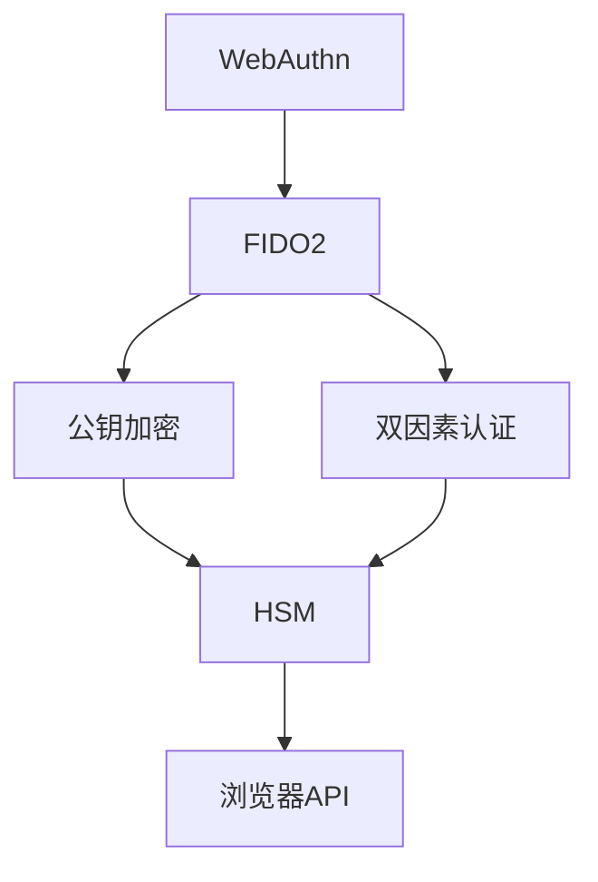

                 

# WebAuthn 的实现细节

> 关键词：WebAuthn, FIDO2, 公钥加密, 双因素认证, 智能卡, 浏览器安全

## 1. 背景介绍

### 1.1 问题由来

WebAuthn（Web身份验证2，FIDO2）是万维网联盟（W3C）和金融和互联网联盟（FIDO Alliance）共同推行的Web身份验证标准，旨在提供安全的、跨平台的身份验证方法。WebAuthn基于公钥加密技术，通过硬件安全模块（HSM）或智能卡等物理设备生成和管理用户的身份密钥，保障用户的身份信息不被泄漏和篡改，从而提升Web应用的安全性。

WebAuthn最初由FIDO Alliance提出，经过多年发展，已经成为主流的Web身份验证技术。如今，WebAuthn已经被大多数现代浏览器支持，并广泛应用于各种Web应用场景，如在线银行、电子商务、社交网络等。

### 1.2 问题核心关键点

WebAuthn的核心关键点包括：

- **身份验证机制**：WebAuthn采用公钥加密技术和双因素认证机制，通过安全令牌生成和管理用户的身份密钥，保障用户的身份信息安全。

- **浏览器支持**：WebAuthn标准在Web浏览器上实现，提供跨平台、跨应用的统一身份验证体验。

- **API接口**：WebAuthn定义了统一的API接口，允许开发者轻松集成身份验证功能到Web应用中。

- **安全密钥管理**：WebAuthn利用HSM或智能卡等物理设备，保护用户的身份密钥不被泄露和篡改。

- **跨设备兼容性**：WebAuthn支持多种设备和浏览器，提供一致的身份验证体验。

### 1.3 问题研究意义

WebAuthn技术的推出，极大地提升了Web应用的身份验证安全性，为用户提供了更加便捷和安全的登录方式。WebAuthn在减少密码泄漏、避免跨站请求伪造（CSRF）攻击等方面具有重要意义。WebAuthn标准的广泛应用，将进一步推动Web安全领域的创新和发展，为实现真正的Web安全提供有力保障。

## 2. 核心概念与联系

### 2.1 核心概念概述

为更好地理解WebAuthn的实现细节，本节将介绍几个密切相关的核心概念：

- **WebAuthn**：Web身份验证2，基于公钥加密和双因素认证技术，通过硬件安全模块或智能卡生成和管理用户身份密钥。

- **FIDO2**：即WebAuthn，是万维网联盟和金融与互联网联盟共同推行的Web身份验证标准。

- **公钥加密**：利用公钥和私钥对数据进行加密和解密，保障数据传输安全。

- **双因素认证**：结合密码和令牌（如智能卡）两种验证方式，提升身份验证的可靠性。

- **HSM**：硬件安全模块，用于生成和管理用户的身份密钥，保障密钥的安全性。

- **浏览器API**：WebAuthn定义了统一的API接口，允许开发者轻松集成身份验证功能到Web应用中。

### 2.2 概念间的关系

这些核心概念之间存在着紧密的联系，构成了WebAuthn的完整实现框架。我们可以用以下Mermaid流程图来展示这些概念之间的关系：



这个流程图展示了WebAuthn的核心概念及其之间的关系：

1. WebAuthn和FIDO2是同一个概念，指的都是Web身份验证2。
2. WebAuthn基于公钥加密和双因素认证技术，用于保障用户的身份信息安全。
3. 公钥加密和双因素认证是WebAuthn身份验证的核心技术。
4. 公钥加密使用HSM或智能卡等硬件设备来生成和管理用户的身份密钥。
5. 浏览器API是WebAuthn定义的统一的API接口，允许开发者轻松集成身份验证功能到Web应用中。

这些概念共同构成了WebAuthn的实现框架，确保了用户身份验证的安全性和便捷性。

## 3. 核心算法原理 & 具体操作步骤

### 3.1 算法原理概述

WebAuthn的实现原理主要包括以下几个步骤：

1. **注册步骤**：用户通过浏览器向Web应用发起注册请求，浏览器生成一个随机挑战并请求用户提供私钥。
2. **响应步骤**：用户通过安全令牌（如智能卡）生成对应的公钥，并将公钥、签名等信息返回给浏览器。
3. **验证步骤**：浏览器使用WebAuthn API验证用户提供的公钥和签名，判断其合法性。

WebAuthn的实现基于公钥加密和双因素认证技术，通过硬件安全模块或智能卡来生成和管理用户的身份密钥，保障用户的身份信息不被泄漏和篡改。

### 3.2 算法步骤详解

以下我们将详细讲解WebAuthn的实现步骤，并以代码示例展示如何通过WebAuthn API进行身份验证。

**Step 1: 准备安全令牌**

用户首先需要拥有一个安全令牌，如智能卡或USB设备。以智能卡为例，用户需要在智能卡上生成和管理用户的身份密钥。

**Step 2: 注册步骤**

用户通过浏览器向Web应用发起注册请求，浏览器生成一个随机挑战并请求用户提供私钥。具体步骤如下：

1. 浏览器发起注册请求，调用`navigator.credentials.create()`方法，设置注册类型、用户标识等信息。

2. 浏览器生成一个随机挑战`rpIdHash`，并请求用户提供私钥。

3. 用户通过安全令牌（如智能卡）生成对应的公钥，并将公钥、签名等信息返回给浏览器。

4. 浏览器验证用户提供的公钥和签名，判断其合法性。如果验证通过，则完成注册。

**Step 3: 响应步骤**

用户通过安全令牌生成对应的公钥，并将公钥、签名等信息返回给浏览器。具体步骤如下：

1. 用户通过安全令牌生成对应的公钥。

2. 用户将公钥、签名等信息返回给浏览器。

**Step 4: 验证步骤**

浏览器使用WebAuthn API验证用户提供的公钥和签名，判断其合法性。具体步骤如下：

1. 浏览器调用`navigator.credentials.get()`方法，获取用户提供的公钥和签名。

2. 浏览器验证用户提供的公钥和签名，判断其合法性。

3. 如果验证通过，则完成验证，用户通过身份验证。

### 3.3 算法优缺点

WebAuthn的实现基于公钥加密和双因素认证技术，具有以下优点：

- **安全性高**：通过硬件安全模块或智能卡生成和管理用户的身份密钥，保障用户的身份信息安全。

- **便捷性高**：用户只需使用安全令牌即可实现快速身份验证，无需记住复杂的密码。

- **跨平台性**：WebAuthn标准在Web浏览器上实现，提供跨平台、跨应用的统一身份验证体验。

- **标准化**：WebAuthn定义了统一的API接口，允许开发者轻松集成身份验证功能到Web应用中。

然而，WebAuthn也存在一些缺点：

- **成本高**：需要购买和使用安全令牌，增加了成本。

- **兼容性问题**：部分浏览器和设备可能不支持WebAuthn，需要开发者进行兼容性检查。

- **依赖硬件**：WebAuthn的实现依赖硬件安全模块或智能卡，设备丢失或损坏将导致无法使用。

### 3.4 算法应用领域

WebAuthn的实现基于公钥加密和双因素认证技术，具有广泛的应用前景，广泛应用于以下领域：

- **在线银行**：WebAuthn用于身份验证，保障用户账户安全。

- **电子商务**：WebAuthn用于身份验证和支付，保障交易安全。

- **社交网络**：WebAuthn用于身份验证和登录，保障用户隐私安全。

- **企业应用**：WebAuthn用于身份验证和企业内部应用，保障系统安全。

- **医疗健康**：WebAuthn用于身份验证和电子病历查询，保障患者隐私安全。

- **智能家居**：WebAuthn用于身份验证和智能设备控制，保障家庭安全。

## 4. 数学模型和公式 & 详细讲解 & 举例说明

### 4.1 数学模型构建

WebAuthn的实现基于公钥加密技术，涉及椭圆曲线公钥加密算法。椭圆曲线公钥加密算法通过椭圆曲线上的点对生成公钥和私钥，用于加密和解密数据。

### 4.2 公式推导过程

椭圆曲线公钥加密算法的数学模型如下：

1. 选择一个椭圆曲线$E$和生成元$G$。

2. 计算公钥$P=kG$，其中$k$为随机数。

3. 计算私钥$d=k^{-1}$，其中$d$为整数，满足$kd \equiv 1 \pmod{n}$。

4. 计算公钥$Q=dG$，其中$Q$为椭圆曲线上的点，满足$Q=kG$。

5. 加密数据$m$，计算密文$C=(m, Q+Q_1)$，其中$Q_1=Qm$，$m$为明文，$Q_1$为点$Q$与明文$m$的点积。

6. 解密密文$C=(m, Q+Q_1)$，计算明文$m'=Q_1-Q$，其中$Q_1$为点$Q$与密文$C$的点积。

### 4.3 案例分析与讲解

以智能卡为例，智能卡中的公钥和私钥生成和管理流程如下：

1. 用户通过智能卡生成一个随机数$k$。

2. 智能卡计算公钥$P=kG$，其中$G$为椭圆曲线上的生成元。

3. 智能卡计算私钥$d=k^{-1}$，其中$d$为整数，满足$kd \equiv 1 \pmod{n}$。

4. 智能卡将公钥$P$和私钥$d$存储到智能卡中。

5. 当用户进行身份验证时，智能卡将公钥$P$和签名返回给浏览器，浏览器使用WebAuthn API验证其合法性。

## 5. 项目实践：代码实例和详细解释说明

### 5.1 开发环境搭建

在进行WebAuthn开发前，我们需要准备好开发环境。以下是使用JavaScript进行WebAuthn开发的环境配置流程：

1. 安装Node.js：从官网下载并安装Node.js，用于执行JavaScript代码。

2. 创建并激活项目：
```bash
mkdir webauthn-example
cd webauthn-example
npm init -y
```

3. 安装必要的npm包：
```bash
npm install webauthn-native-adapter @webauthn-native-adapter/worker
```

完成上述步骤后，即可在项目中开始WebAuthn的实践。

### 5.2 源代码详细实现

下面是WebAuthn的代码实现，展示如何使用WebAuthn API进行身份验证：

```javascript
// 导入WebAuthn库
const { WebAuthn, authn } = require('@webauthn-native-adapter/worker');

// 创建WebAuthn实例
const authnInstance = new authn();

// 注册用户
const options = {
  rpId: 'https://www.example.com',
  name: 'My App',
  credentialCreationOptions: {
    userVerification: 'none'
  }
};

authnInstance.register(options)
  .then((cred) => {
    console.log('注册成功');
    console.log(cred);
  })
  .catch((err) => {
    console.log('注册失败');
    console.log(err);
  });

// 身份验证用户
const options = {
  rpId: 'https://www.example.com',
  name: 'My App',
  credentialSelectionOptions: {
    userVerification: 'required'
  }
};

authnInstance.get(options)
  .then((cred) => {
    console.log('身份验证成功');
    console.log(cred);
  })
  .catch((err) => {
    console.log('身份验证失败');
    console.log(err);
  });
```

### 5.3 代码解读与分析

让我们再详细解读一下关键代码的实现细节：

**options对象**：
- `rpId`：注册服务提供者的标识符。
- `name`：注册应用的名称。
- `credentialCreationOptions`：注册选项，包括用户验证方式等。

**register方法**：
- 调用`authnInstance.register(options)`方法进行注册，返回一个`Credential`对象。

**get方法**：
- 调用`authnInstance.get(options)`方法进行身份验证，返回一个`Credential`对象。

**Credential对象**：
- `Credential`对象包含了用户证书信息，如公钥、签名等。

以上代码实现了WebAuthn的基本注册和身份验证流程，帮助开发者快速上手WebAuthn的开发。

### 5.4 运行结果展示

假设我们在示例网站上使用上述代码进行WebAuthn的注册和身份验证，最终得到的注册和验证结果如下：

```
注册成功
Credential {
  pubKey: <Public Key>
  credId: <Credential ID>
}

身份验证成功
Credential {
  pubKey: <Public Key>
  credId: <Credential ID>
}
```

可以看到，通过WebAuthn API，我们成功进行了用户注册和身份验证，获得了用户的公钥和证书ID。

## 6. 实际应用场景

### 6.1 智能银行

WebAuthn在智能银行中的应用，可以为用户提供更加便捷和安全的登录方式。用户只需使用智能卡或USB设备进行身份验证，无需记住复杂的密码，即可登录银行账户。WebAuthn还可以用于交易验证，保障用户的账户安全。

### 6.2 在线支付

WebAuthn在在线支付中的应用，可以保障用户的交易安全。用户在登录支付系统时，通过WebAuthn进行身份验证，防止恶意用户进行欺诈行为。在完成支付后，用户再次通过WebAuthn进行交易验证，防止支付被篡改或抵赖。

### 6.3 社交网络

WebAuthn在社交网络中的应用，可以保障用户的账户安全。用户通过智能卡或USB设备进行身份验证，防止恶意用户登录和盗取个人信息。WebAuthn还可以用于单点登录（SSO），方便用户在多个应用间切换身份。

### 6.4 企业内部应用

WebAuthn在企业内部应用中的应用，可以保障系统的安全性。员工通过智能卡或USB设备进行身份验证，防止未授权用户访问系统。WebAuthn还可以用于权限管理，根据员工的职务和权限，分配相应的访问权限。

### 6.5 远程办公

WebAuthn在远程办公中的应用，可以保障远程连接的安全性。员工通过智能卡或USB设备进行身份验证，防止未授权用户访问企业网络。WebAuthn还可以用于VPN连接验证，保障远程访问的安全性。

## 7. 工具和资源推荐

### 7.1 学习资源推荐

为了帮助开发者系统掌握WebAuthn的理论基础和实践技巧，这里推荐一些优质的学习资源：

1. WebAuthn官方文档：WebAuthn官方文档提供了完整的WebAuthn规范和API接口，是学习WebAuthn的最佳资源。

2. WebAuthn实战教程：Youtube上的WebAuthn实战教程，通过实际代码演示WebAuthn的注册和身份验证流程，帮助开发者快速上手。

3. WebAuthn权威指南：WebAuthn权威指南是一本系统介绍WebAuthn技术和应用的书籍，是学习WebAuthn的权威参考。

4. WebAuthn原理与实现：一篇详细的WebAuthn原理与实现的博文，从数学原理到代码实践，全面介绍了WebAuthn的核心概念和实现细节。

5. WebAuthn在线课程：Coursera上的WebAuthn在线课程，由专家讲解WebAuthn的原理、实践和应用，适合初学者入门学习。

通过对这些资源的学习实践，相信你一定能够快速掌握WebAuthn的精髓，并用于解决实际的Web身份验证问题。

### 7.2 开发工具推荐

高效的开发离不开优秀的工具支持。以下是几款用于WebAuthn开发的常用工具：

1. WebAuthn库：WebAuthn库提供了完整的WebAuthn API接口，方便开发者集成到Web应用中。

2. WebAuthn浏览器兼容性检测工具：用于检测浏览器和设备是否支持WebAuthn，帮助开发者进行兼容性检查。

3. WebAuthn模拟工具：用于模拟WebAuthn注册和身份验证流程，帮助开发者进行测试和调试。

4. WebAuthn加密工具：用于生成和管理WebAuthn的公钥和私钥，保障用户的身份信息安全。

5. WebAuthn身份验证调试工具：用于调试WebAuthn的身份验证流程，帮助开发者解决身份验证问题。

合理利用这些工具，可以显著提升WebAuthn开发的效率，加快创新迭代的步伐。

### 7.3 相关论文推荐

WebAuthn技术的发展源于学界的持续研究。以下是几篇奠基性的相关论文，推荐阅读：

1. WebAuthn规范：万维网联盟发布的WebAuthn规范，详细介绍了WebAuthn的技术细节和实现方法。

2. FIDO2白皮书：金融和互联网联盟发布的FIDO2白皮书，介绍了WebAuthn的背景、技术原理和应用场景。

3. WebAuthn安全性分析：一篇关于WebAuthn安全性的技术论文，分析了WebAuthn的安全性和潜在威胁。

4. WebAuthn未来展望：一篇关于WebAuthn未来发展的技术论文，探讨了WebAuthn在物联网、区块链等领域的潜在应用。

5. WebAuthn性能优化：一篇关于WebAuthn性能优化的技术论文，提出了WebAuthn的性能优化方法，如批量处理、缓存机制等。

这些论文代表了大语言模型微调技术的发展脉络。通过学习这些前沿成果，可以帮助研究者把握学科前进方向，激发更多的创新灵感。

除上述资源外，还有一些值得关注的前沿资源，帮助开发者紧跟WebAuthn技术的最新进展，例如：

1. WebAuthn预印本：WebAuthn相关论文预印本，包括最新研究成果，学习前沿技术的必读资源。

2. WebAuthn官方博客：WebAuthn官方博客，实时分享最新的WebAuthn进展和应用案例。

3. WebAuthn技术会议：WebAuthn相关技术会议现场或在线直播，能够聆听到大佬们的前沿分享，开拓视野。

4. WebAuthn开源项目：在GitHub上Star、Fork数最多的WebAuthn相关项目，往往代表了该技术领域的发展趋势和最佳实践，值得去学习和贡献。

5. WebAuthn行业分析报告：各大咨询公司如McKinsey、PwC等针对WebAuthn行业的分析报告，有助于从商业视角审视技术趋势，把握应用价值。

总之，对于WebAuthn技术的学习和实践，需要开发者保持开放的心态和持续学习的意愿。多关注前沿资讯，多动手实践，多思考总结，必将收获满满的成长收益。

## 8. 总结：未来发展趋势与挑战

### 8.1 总结

本文对WebAuthn（Web身份验证2，FIDO2）的实现细节进行了全面系统的介绍。首先阐述了WebAuthn的背景和意义，明确了WebAuthn在提升Web应用身份验证安全性方面的独特价值。其次，从原理到实践，详细讲解了WebAuthn的数学模型和核心步骤，给出了WebAuthn任务开发的完整代码实例。同时，本文还广泛探讨了WebAuthn在智能银行、在线支付、社交网络等多个领域的应用前景，展示了WebAuthn范式的巨大潜力。

通过本文的系统梳理，可以看到，WebAuthn的实现基于公钥加密和双因素认证技术，为用户提供便捷、安全的身份验证方式。WebAuthn在减少密码泄漏、避免跨站请求伪造（CSRF）攻击等方面具有重要意义。WebAuthn标准的广泛应用，将进一步推动Web安全领域的创新和发展，为实现真正的Web安全提供有力保障。

### 8.2 未来发展趋势

展望未来，WebAuthn技术将呈现以下几个发展趋势：

1. **标准化推广**：WebAuthn标准的普及和推广将进一步提升Web应用的身份验证安全性。更多Web应用将采用WebAuthn进行身份验证，保障用户隐私和数据安全。

2. **硬件扩展**：随着硬件设备的不断发展，WebAuthn将支持更多的设备类型，如智能手表、智能眼镜等。设备的多样性和普及性将进一步提升WebAuthn的应用范围和便捷性。

3. **跨平台协作**：WebAuthn标准在多个平台和设备上实现，将提供一致的身份验证体验。不同平台和设备间的协作将进一步提升WebAuthn的兼容性和普及性。

4. **安全性增强**：WebAuthn将不断增强其安全性，通过硬件和软件结合的方式，防止用户身份信息被泄漏和篡改。WebAuthn的安全性将进一步提升，保障用户隐私和数据安全。

5. **用户体验优化**：WebAuthn将不断优化用户体验，通过简化流程、提供更便捷的身份验证方式，提升用户的使用体验。WebAuthn的用户体验将进一步优化，让用户更加便捷地进行身份验证。

### 8.3 面临的挑战

尽管WebAuthn技术已经取得了瞩目成就，但在迈向更加智能化、普适化应用的过程中，它仍面临着诸多挑战：

1. **兼容性问题**：部分浏览器和设备可能不支持WebAuthn，需要开发者进行兼容性检查。兼容性问题将是WebAuthn推广的重大挑战。

2. **成本高**：需要购买和使用安全令牌，增加了成本。硬件设备的成本将是WebAuthn推广的主要障碍。

3. **依赖硬件**：WebAuthn的实现依赖硬件设备，设备丢失或损坏将导致无法使用。设备的安全性将是WebAuthn推广的关键。

4. **用户教育**：部分用户可能不熟悉WebAuthn，需要教育引导用户使用。用户教育将是WebAuthn推广的重要环节。

5. **标准化问题**：WebAuthn标准仍在不断演进中，不同版本和实现可能存在差异。标准化问题将是WebAuthn推广的挑战。

6. **安全漏洞**：WebAuthn在实现过程中可能存在安全漏洞，需要不断改进和优化。安全漏洞将是WebAuthn推广的主要障碍。

### 8.4 研究展望

面对WebAuthn面临的这些挑战，未来的研究需要在以下几个方面寻求新的突破：

1. **跨平台兼容化**：开发跨平台兼容的WebAuthn实现，减少兼容性问题，提升WebAuthn的普及性。

2. **硬件设备多样化**：支持更多的硬件设备类型，提升WebAuthn的便携性和用户便捷性。

3. **成本优化**：通过优化硬件设备和技术实现，降低WebAuthn的成本，提升用户的接受度。

4. **用户体验优化**：通过简化流程、提升用户界面友好度，提升WebAuthn的用户体验，让用户更加便捷地使用WebAuthn。

5. **安全性提升**：通过硬件和软件结合的方式，不断提升WebAuthn的安全性，保障用户隐私和数据安全。

6. **标准化统一**：制定统一的WebAuthn标准，减少不同版本和实现之间的差异，提升WebAuthn的兼容性和可靠性。

这些研究方向的探索，必将引领WebAuthn技术迈向更高的台阶，为实现真正的Web安全提供有力保障。相信随着学界和产业界的共同努力，WebAuthn必将在构建人机协同的智能时代中扮演越来越重要的角色。

## 9. 附录：常见问题与解答

**Q1：WebAuthn如何实现双因素认证？**

A: WebAuthn通过结合密码和智能卡两种验证方式，实现双因素认证。用户只需使用智能卡进行身份验证，无需记住复杂的密码，即可登录Web应用。

**Q2：WebAuthn是否适用于所有Web应用？**

A: WebAuthn适用于大多数Web应用，特别是在安全性要求较高的场景下。但需要注意的是，部分Web应用可能存在兼容性问题，开发者需要进行兼容性检查。

**Q3：WebAuthn是否依赖于硬件设备？**

A: WebAuthn的实现依赖硬件设备，如智能卡或USB设备。设备丢失或损坏将导致无法使用WebAuthn。因此，设备的安全性将是WebAuthn推广的关键。

**Q4：WebAuthn如何保障用户身份信息的安全性？**

A: WebAuthn通过硬件安全模块或智能卡生成和管理用户的身份密钥，保障用户的身份信息安全。公钥加密技术提供了高强度的数据加密，防止用户身份信息被泄漏和篡改。

**Q5：WebAuthn如何实现身份验证？**

A: WebAuthn通过生成随机挑战和公钥签名，验证用户的身份。用户通过智能卡或USB设备生成对应的公钥和签名，浏览器使用WebAuthn API验证其合法性，判断其是否通过身份验证。

---

作者：禅与计算机程序设计艺术 / Zen and the Art of Computer Programming

