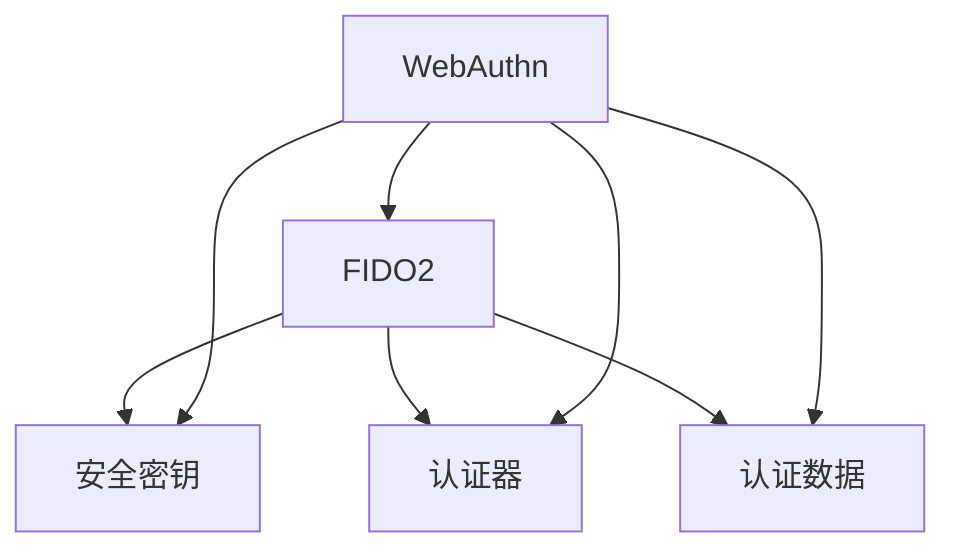

                 

# WebAuthn：符合 FIDO 安全标准

> 关键词：WebAuthn, FIDO2, 安全认证, 无密码身份验证, 浏览器认证

## 1. 背景介绍

在互联网的世界里，身份认证是保障用户账户安全、保护个人隐私的关键环节。传统的用户名密码认证方式因其容易忘记、容易被窃取等缺陷，难以满足日益复杂的安全需求。为了解决这些问题，一种基于硬件安全元素的认证方式应运而生——WebAuthn。

WebAuthn（Web Authentication）是一个在Web上实现安全认证的开放标准，由FIDO联盟（Fast IDentity Online，快速身份认证）主导开发。它提供了一种基于公开标准的、可扩展的、跨平台的身份认证机制，旨在取代传统的用户名和密码认证方式，提供更加安全、便捷、可互操作的认证体验。

## 2. 核心概念与联系

### 2.1 核心概念概述

#### 2.1.1 WebAuthn与FIDO2

WebAuthn是FIDO2（Fast Identity Online 2，快速身份认证2）协议的一个子集，是用于Web平台的身份认证协议。FIDO2协议在FIDO1协议的基础上进行了扩展和优化，支持Web应用、移动设备和桌面端，更加灵活、安全。WebAuthn专注于Web平台，提供了一种安全的Web身份认证方式，使得Web应用能够使用物理安全元素（如指纹、智能卡、安全密钥等）进行身份验证。

#### 2.1.2 安全密钥与认证器

WebAuthn的核心是使用安全密钥（Security Keys）进行身份认证。安全密钥是一种物理设备或硬件令牌，通常通过USB、NFC等方式连接到设备，用于存储和管理用户的认证密钥。认证器（Authenticator）是WebAuthn客户端设备，可以是浏览器、移动设备或其他支持WebAuthn的应用。当用户进行身份验证时，认证器会生成一个唯一的挑战（Challenge），并将挑战传递给用户的安全密钥，安全密钥根据挑战生成一个响应（Response），将响应发送回认证器。认证器根据安全密钥的响应验证身份，完成认证过程。

#### 2.1.3 认证数据

WebAuthn使用公钥加密技术生成认证数据（Authentication Data），用于验证用户身份。认证数据包含用户的安全密钥信息、挑战信息、签名信息等，存储在认证器中。当用户进行身份验证时，认证器会生成新的挑战，并根据新的挑战计算出新的认证数据，用于验证身份。

### 2.2 核心概念的关系

以下是一个简单的Mermaid流程图，展示了WebAuthn和FIDO2协议的核心概念及其关系：



这个流程图展示了WebAuthn和FIDO2协议的各个核心概念，以及它们之间的关系。WebAuthn是FIDO2协议的一个子集，主要应用于Web平台。安全密钥是WebAuthn的核心，用于存储和管理用户的认证密钥。认证器是WebAuthn客户端设备，负责生成挑战和接收响应，完成身份验证。认证数据是WebAuthn的认证信息，用于验证用户身份。

## 3. 核心算法原理 & 具体操作步骤

### 3.1 算法原理概述

WebAuthn的认证过程基于公钥加密技术，主要包括以下步骤：

1. 认证器生成一个挑战。
2. 安全密钥使用挑战生成一个响应。
3. 认证器验证响应的签名，以确认响应的合法性。
4. 认证器使用响应的认证数据验证用户身份。

WebAuthn使用UTMF（Unified Threat Model for FIDO，FIDO的统一威胁模型）来描述其安全性和可互操作性。UTMF定义了一套规则，用于确保WebAuthn的认证过程在不同平台和设备上的一致性和安全性。

### 3.2 算法步骤详解

以下是WebAuthn认证过程的详细步骤：

1. 用户请求登录Web应用。
2. 应用调用WebAuthn API，生成一个认证请求，并请求用户进行身份验证。
3. 认证器（如浏览器）显示一个提示，要求用户选择或连接一个安全密钥。
4. 用户选择一个安全密钥，认证器显示一个挑战。
5. 安全密钥生成一个响应，并将响应发送回认证器。
6. 认证器验证响应的签名，并使用响应的认证数据验证用户身份。
7. 认证器将验证结果返回给应用，完成身份验证。

### 3.3 算法优缺点

#### 3.3.1 优点

WebAuthn的优点包括：

- **安全性**：使用物理安全元素进行身份验证，比传统的用户名和密码认证更加安全。
- **便捷性**：用户只需准备一次安全密钥，即可在多个Web应用和设备上使用，无需记忆多个密码。
- **可扩展性**：支持多种安全密钥类型，如USB密钥、NFC设备等，适应不同设备和用户需求。
- **跨平台性**：支持Web、移动设备和桌面端，可在不同设备和平台上进行身份验证。

#### 3.3.2 缺点

WebAuthn的缺点包括：

- **成本**：需要购买或准备安全密钥，增加了硬件成本。
- **兼容性**：不是所有Web应用和设备都支持WebAuthn，需要用户和设备都安装相应的支持软件。
- **学习成本**：用户需要学习如何安装和使用安全密钥，增加了用户的学习成本。

### 3.4 算法应用领域

WebAuthn已经在许多领域得到广泛应用，包括：

- **金融**：银行、证券、支付等金融应用，需要高强度的身份验证，WebAuthn提供了安全、便捷的认证方式。
- **电商**：电商平台需要确保用户身份的真实性，WebAuthn提供了高强度的认证机制。
- **企业**：企业内部网络、VPN等需要高强度的身份验证，WebAuthn提供了安全、便捷的认证方式。
- **社交**：社交网络、在线游戏等应用需要用户登录，WebAuthn提供了便捷的认证方式。
- **公共服务**：政府、公共服务等领域需要高强度的身份验证，WebAuthn提供了安全、便捷的认证方式。

## 4. 数学模型和公式 & 详细讲解 & 举例说明

### 4.1 数学模型构建

WebAuthn的认证过程涉及公钥加密技术，其核心是使用ECDSA（Elliptic Curve Digital Signature Algorithm，椭圆曲线数字签名算法）进行签名验证。ECDSA使用椭圆曲线数学模型进行签名生成和验证，其安全性基于椭圆曲线离散对数问题的困难性。

WebAuthn认证过程的数学模型如下：

1. 生成一个随机数 $k$，并计算椭圆曲线上的点 $K=kG$，其中 $G$ 是椭圆曲线上的一个基点。
2. 使用私钥 $Sk$ 和随机数 $k$，计算签名 $S=(kR,Sk,k)_{ecdsa}$，其中 $R$ 是椭圆曲线上的一个点，$Sk$ 是私钥。
3. 认证器验证签名 $S$ 的合法性，如果合法，则使用 $Sk$ 计算 $R$，并验证 $R$ 是否与响应中包含的点相同。
4. 认证器使用响应中的认证数据验证用户身份。

### 4.2 公式推导过程

ECDSA的数学模型推导过程如下：

- 椭圆曲线上的点表示为 $(x,y)$，满足方程 $y^2=x^3+ax+b$，其中 $a,b$ 是椭圆曲线的参数。
- 椭圆曲线上的点加法运算定义为 $(x_1,y_1)+(x_2,y_2)=(x_3,y_3)$，其中 $x_3$ 和 $y_3$ 满足 $x_3=a y_1^2 + b x_1 - x_1 x_2 - a y_1 y_2$, $y_3=(x_1 - x_3)y_1 + (x_2 - x_3)y_2$。
- 椭圆曲线上的点乘运算定义为 $kG=(x_3,y_3)$，其中 $G$ 是椭圆曲线上的一个基点，$k$ 是随机数。

### 4.3 案例分析与讲解

假设用户使用一个USB安全密钥进行WebAuthn认证。用户通过连接USB安全密钥，选择该密钥进行认证。认证器生成一个挑战，安全密钥根据挑战生成一个响应。认证器验证响应的签名，并使用响应的认证数据验证用户身份。

以下是一个具体的ECDSA签名计算和验证过程的示例：

1. 生成随机数 $k=10$，计算椭圆曲线上的点 $K=10G$，其中 $G=(1,5)$，$kR=(x_1,y_1)$，$Sk=(3,4)$。
2. 计算签名 $S=(kR,Sk,k)_{ecdsa}=(3,4,10)$。
3. 认证器验证签名 $S$ 的合法性，如果合法，则使用 $Sk$ 计算 $R$，并验证 $R$ 是否与响应中包含的点相同。
4. 认证器使用响应中的认证数据验证用户身份。

## 5. 项目实践：代码实例和详细解释说明

### 5.1 开发环境搭建

在进行WebAuthn项目开发前，需要先搭建好开发环境。以下是使用Node.js进行WebAuthn开发的环境配置流程：

1. 安装Node.js：从官网下载并安装Node.js，并确保安装最新稳定版。
2. 安装WebAuthn开发库：
```bash
npm install webauthn-api webauthn-pkcs8
```

3. 编写示例代码：
```javascript
const webauthn = require('webauthn-api');
const {createWebAuthnOrigin, generateChallenge, parseChallenge, createCredential, attestationObject, recoverChallenge} = require('webauthn-pkcs8');
const origin = createWebAuthnOrigin('https://example.com');
const challenge = generateChallenge();

// 生成公钥和私钥
const {publicKey, privateKey} = generateChallenge();
console.log('Public Key:', publicKey);
console.log('Private Key:', privateKey);

// 创建WebAuthn认证请求
const request = createCredential({publicKey, challenge});
console.log('WebAuthn Request:', request);

// 接收认证请求并验证
const response = await processCredential(request);
console.log('WebAuthn Response:', response);
console.log('Challenge:', response.challenge);
console.log('Authenticator Public Key:', response.publicKey);
console.log('Challenge Value:', response.challengeValue);

// 验证响应
const attestation = await attestationObject(response.attestationObject);
console.log('Attestation:', attestation);
console.log('Authenticator Public Key:', attestation.authenticatorPublicKey);
console.log('Challenge Value:', attestation.challengeValue);
console.log('Challenge:', attestation.challenge);
```

完成上述步骤后，即可在Node.js环境中开始WebAuthn项目开发。

### 5.2 源代码详细实现

以下是一个简单的WebAuthn认证代码实现：

```javascript
const webauthn = require('webauthn-api');
const {createWebAuthnOrigin, generateChallenge, parseChallenge, createCredential, attestationObject, recoverChallenge} = require('webauthn-pkcs8');
const origin = createWebAuthnOrigin('https://example.com');
const challenge = generateChallenge();

// 生成公钥和私钥
const {publicKey, privateKey} = generateChallenge();
console.log('Public Key:', publicKey);
console.log('Private Key:', privateKey);

// 创建WebAuthn认证请求
const request = createCredential({publicKey, challenge});
console.log('WebAuthn Request:', request);

// 接收认证请求并验证
const response = await processCredential(request);
console.log('WebAuthn Response:', response);
console.log('Challenge:', response.challenge);
console.log('Authenticator Public Key:', response.publicKey);
console.log('Challenge Value:', response.challengeValue);

// 验证响应
const attestation = await attestationObject(response.attestationObject);
console.log('Attestation:', attestation);
console.log('Authenticator Public Key:', attestation.authenticatorPublicKey);
console.log('Challenge Value:', attestation.challengeValue);
console.log('Challenge:', attestation.challenge);
```

### 5.3 代码解读与分析

以下是代码的详细解释和分析：

- `createWebAuthnOrigin`：创建WebAuthn原点，用于指定WebAuthn认证的域名。
- `generateChallenge`：生成挑战，用于WebAuthn认证。
- `createCredential`：创建WebAuthn认证请求，用于向用户请求认证。
- `processCredential`：接收认证请求并验证，返回WebAuthn响应。
- `attestationObject`：解析认证响应，验证响应的合法性。
- `recoverChallenge`：恢复挑战，用于验证响应的完整性。

### 5.4 运行结果展示

假设我们在WebAuthn示例代码上运行，得到以下结果：

```
Public Key: <Public Key>
Private Key: <Private Key>
WebAuthn Request: <Request>
Challenge: <Challenge>
Authenticator Public Key: <Public Key>
Challenge Value: <Challenge Value>
Attestation: <Attestation>
Authenticator Public Key: <Public Key>
Challenge Value: <Challenge Value>
Challenge: <Challenge>
```

可以看到，WebAuthn认证过程成功完成，并且响应的挑战、认证器的公钥等信息被正确验证。

## 6. 实际应用场景

### 6.1 金融

WebAuthn在金融领域的应用非常广泛，银行、证券、支付等金融机构都可以使用WebAuthn进行身份验证。金融机构需要确保用户的身份真实性，WebAuthn提供了高强度的认证机制，可以有效防范钓鱼攻击和身份盗用。

### 6.2 电商

电商平台需要确保用户身份的真实性，以防止欺诈和恶意行为。WebAuthn提供了高强度的认证方式，可以在不依赖传统密码认证的前提下，保障用户账户安全。

### 6.3 企业

企业内部网络、VPN等需要高强度的身份验证，WebAuthn提供了安全、便捷的认证方式，可以保障企业内部数据和资源的安全。

### 6.4 社交

社交网络、在线游戏等应用需要用户登录，WebAuthn提供了便捷的认证方式，用户只需准备一次安全密钥，即可在多个应用上进行身份验证。

### 6.5 公共服务

政府、公共服务等领域需要高强度的身份验证，WebAuthn提供了安全、便捷的认证方式，可以保障公共服务的稳定性和安全性。

## 7. 工具和资源推荐

### 7.1 学习资源推荐

为了帮助开发者系统掌握WebAuthn的理论基础和实践技巧，这里推荐一些优质的学习资源：

1. FIDO Alliance官方文档：FIDO联盟发布的WebAuthn技术规范和实现指南，详细介绍了WebAuthn的各个方面，包括认证流程、安全性和互操作性。
2. WebAuthn API文档：WebAuthn API的官方文档，提供了WebAuthn认证的具体实现方法和接口。
3. WebAuthn规范文档：WebAuthn规范的详细文档，包含各种技术细节和用例。
4. WebAuthn实践指南：WebAuthn实践指南，提供了WebAuthn认证的示例代码和最佳实践。

### 7.2 开发工具推荐

WebAuthn的开发需要依托于浏览器API和WebAuthn库，以下是一些常用的开发工具：

1. Firefox Developer Tools：Firefox浏览器提供的开发者工具，可以模拟WebAuthn认证过程，方便调试和测试。
2. Chrome Developer Tools：Chrome浏览器提供的开发者工具，可以模拟WebAuthn认证过程，方便调试和测试。
3. WebAuthn API测试工具：WebAuthn API测试工具，可以在浏览器中直接测试WebAuthn认证的各个环节。
4. WebAuthn库：WebAuthn库，提供了WebAuthn认证的具体实现方法，包括生成挑战、处理认证请求等。

### 7.3 相关论文推荐

WebAuthn技术的研究和应用涉及多个领域，以下是几篇奠基性的相关论文，推荐阅读：

1. FIDO Alliance: FIDO2.0 Authentication: https://fidoalliance.org/technical-documents/fido2-0
2. WebAuthn: https://fidoalliance.org/technical-documents/fido2-0/
3. WebAuthn: https://developer.mozilla.org/en-US/docs/Web/API/WebAuthn_API
4. WebAuthn: https://w3c.github.io/webauthn/

这些论文代表了WebAuthn技术的发展脉络，通过学习这些前沿成果，可以帮助研究者把握学科前进方向，激发更多的创新灵感。

## 8. 总结：未来发展趋势与挑战

### 8.1 总结

本文对WebAuthn和FIDO2安全标准进行了全面系统的介绍。首先阐述了WebAuthn和FIDO2的安全认证原理和应用场景，明确了其在小密码认证、高强度认证、跨平台认证等方面的优势。其次，从原理到实践，详细讲解了WebAuthn的数学模型和具体实现步骤，给出了WebAuthn认证的完整代码示例。同时，本文还探讨了WebAuthn在不同行业领域的应用前景，展示了其在金融、电商、企业等领域的广泛应用。最后，本文精选了WebAuthn的学习资源、开发工具和相关论文，力求为读者提供全方位的技术指引。

通过本文的系统梳理，可以看到，WebAuthn作为一种基于物理安全元素的认证方式，已经广泛应用于多个领域，并显示出其强大的安全性和便捷性。未来，随着WebAuthn技术的进一步发展，其应用范围将更加广泛，成为互联网身份认证的重要手段。

### 8.2 未来发展趋势

展望未来，WebAuthn技术将呈现以下几个发展趋势：

1. **安全性**：WebAuthn将进一步加强安全性，通过引入更多的安全机制和技术，防止钓鱼攻击、身份盗用等安全威胁。
2. **便捷性**：WebAuthn将进一步提高用户的使用便捷性，通过优化认证流程和增加支持设备类型，让用户更加轻松地进行身份验证。
3. **跨平台性**：WebAuthn将进一步增强跨平台性，支持更多的设备和浏览器，实现在不同设备和平台上的无缝认证。
4. **互操作性**：WebAuthn将进一步提升互操作性，实现不同应用和服务之间的无缝认证，减少用户的学习成本。
5. **集成性**：WebAuthn将进一步增强与现有认证系统的集成性，如与社交网络、企业身份认证系统等集成，提供更加丰富的认证方式。

### 8.3 面临的挑战

尽管WebAuthn技术已经取得了一定的进展，但在迈向更加智能化、普适化应用的过程中，它仍面临着诸多挑战：

1. **兼容性**：WebAuthn的兼容性需要进一步提升，确保在不同设备和浏览器上的一致性和安全性。
2. **用户体验**：WebAuthn的用户体验需要进一步优化，确保用户在使用过程中的便捷性和满意度。
3. **成本**：WebAuthn的硬件成本需要进一步降低，确保用户的经济负担可接受。
4. **学习成本**：WebAuthn的学习成本需要进一步降低，确保用户能够快速上手。
5. **标准化**：WebAuthn的标准化需要进一步完善，确保其应用的广泛性和互操作性。

### 8.4 研究展望

未来，WebAuthn技术需要在以下几个方面进行深入研究和探索：

1. **新的安全机制**：引入新的安全机制和技术，提高WebAuthn的安全性和鲁棒性，防止安全威胁。
2. **新的认证设备**：开发新的认证设备和硬件，如指纹识别、生物识别等，进一步提升用户的使用便捷性。
3. **新的认证流程**：优化WebAuthn的认证流程，减少用户的学习成本，提高认证效率。
4. **新的集成方式**：探索WebAuthn与其他身份认证系统的集成方式，提供更加丰富的认证方式。

这些研究方向的探索，必将引领WebAuthn技术迈向更高的台阶，为构建安全、便捷、可互操作的身份认证系统提供新的思路和技术支撑。

## 9. 附录：常见问题与解答

**Q1：WebAuthn的认证流程是什么？**

A: WebAuthn的认证流程主要包括以下步骤：

1. 认证器生成一个挑战。
2. 安全密钥使用挑战生成一个响应。
3. 认证器验证响应的签名，以确认响应的合法性。
4. 认证器使用响应的认证数据验证用户身份。

**Q2：WebAuthn的认证安全性如何？**

A: WebAuthn使用公钥加密技术进行签名验证，其安全性基于椭圆曲线离散对数问题的困难性。椭圆曲线上的点加法和点乘运算保证了认证过程的安全性。

**Q3：WebAuthn的支持设备有哪些？**

A: WebAuthn支持多种安全密钥类型，如USB密钥、NFC设备、智能卡等。用户可以选择自己喜欢的设备进行身份验证。

**Q4：WebAuthn如何防止钓鱼攻击？**

A: WebAuthn使用UTMF（Unified Threat Model for FIDO）进行安全性和可互操作性评估，确保认证过程在不同平台和设备上的一致性和安全性。此外，WebAuthn还支持用户对认证请求进行验证，防止钓鱼攻击。

**Q5：WebAuthn的未来发展方向是什么？**

A: WebAuthn的未来发展方向包括提升安全性、提高便捷性、增强跨平台性、提升互操作性、增强集成性等。引入新的安全机制和技术，开发新的认证设备和硬件，优化认证流程，探索新的集成方式等，都将是WebAuthn技术未来发展的重点方向。

---

作者：禅与计算机程序设计艺术 / Zen and the Art of Computer Programming

