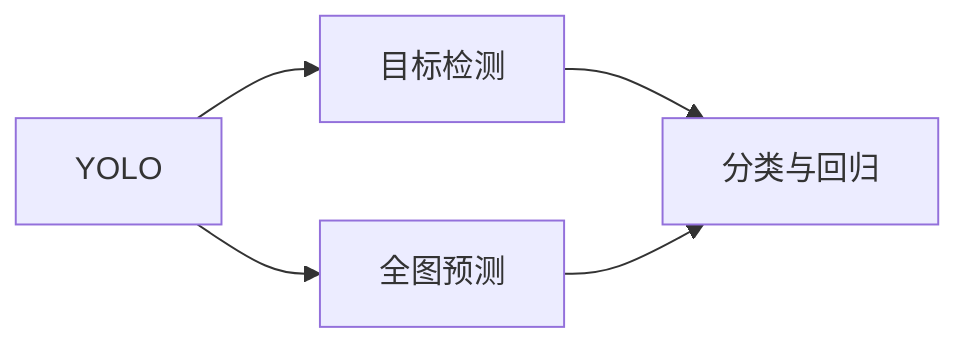
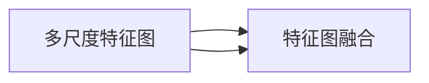
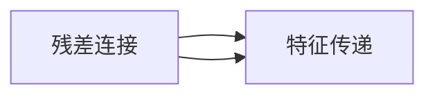
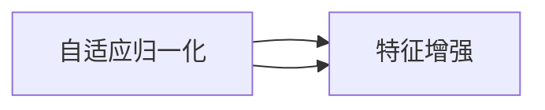
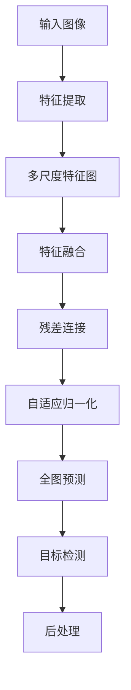

                 

# YOLOv4原理与代码实例讲解

> 关键词：YOLOv4, 目标检测, 深度学习, 卷积神经网络, 高效计算, 实时检测, 超参数优化

## 1. 背景介绍

### 1.1 问题由来

随着深度学习技术在计算机视觉领域的不断应用，目标检测任务成为了一个重要研究方向。传统目标检测算法如R-CNN、Fast R-CNN、Faster R-CNN等基于候选区域的方法，往往需要计算代价高昂的选择操作和复杂的网络结构，难以满足实时性要求。近年来，一种基于全图预测的YOLO（You Only Look Once）系列算法应运而生，以其高效的计算速度和稳定的性能广受关注。

YOLO系列算法包括YOLOv1、YOLOv2、YOLOv3、YOLOv4等多个版本。其中，YOLOv4是近年来提出的最新版本，在检测速度、准确率、精度和鲁棒性等方面取得了显著的提升，成为目标检测领域的新宠。本文将对YOLOv4算法进行深入介绍，并给出代码实例，帮助读者理解其原理和实现。

### 1.2 问题核心关键点

YOLOv4的核心在于全图预测、多尺度特征融合、残差连接和自适应归一化等技术手段的应用，这些技术手段的组合使得YOLOv4在检测速度和准确率上均取得了突破。具体来说，YOLOv4的主要关键点包括：

- **全图预测**：YOLOv4在输入图像上进行全图预测，每个网格单元预测多个目标类别和边界框。这种做法大大简化了模型结构，提升了检测速度。

- **多尺度特征融合**：YOLOv4采用多尺度特征图（msp）来融合不同层次的特征信息，增强了模型的泛化能力和鲁棒性。

- **残差连接**：YOLOv4在模型中引入了残差连接，增强了模型的深层特征传递能力，防止了梯度消失问题。

- **自适应归一化**：YOLOv4中引入了FPN（Feature Pyramid Network）和SPP（Spatial Pyramid Pooling）模块，通过自适应归一化技术增强了模型的特征提取和融合能力。

这些技术手段共同构成了YOLOv4算法的核心，使得其在检测速度、准确率、精度和鲁棒性等方面均取得了显著提升。

### 1.3 问题研究意义

YOLOv4算法在目标检测领域的应用，对提高图像识别、自动驾驶、视频监控等场景的实时性和准确性具有重要意义：

1. **实时性**：YOLOv4采用全图预测，每个网格单元独立预测目标，显著提升了检测速度。这对于实时性要求较高的应用场景如自动驾驶、视频监控等尤为重要。

2. **准确性**：YOLOv4通过多尺度特征融合、残差连接和自适应归一化等技术手段，提升了检测精度和鲁棒性。这使得YOLOv4在目标检测任务上取得了领先的效果。

3. **计算效率**：YOLOv4在计算效率上也表现出色，与Faster R-CNN等传统算法相比，YOLOv4在保持高准确性的同时，计算速度提升了数倍，非常适合对计算资源有限的应用场景。

4. **应用广泛**：YOLOv4算法可以应用于各种目标检测任务，如图像识别、视频监控、自动驾驶等，为这些领域提供了强大的工具支持。

5. **可扩展性**：YOLOv4架构灵活，可以通过调整超参数、增加训练数据等方法进一步提升性能，非常适合在实际应用中不断优化和迭代。

综上所述，YOLOv4算法在提高目标检测任务的实时性和准确性方面具有重要意义，为图像识别、自动驾驶、视频监控等应用场景提供了强大的技术支撑。

## 2. 核心概念与联系

### 2.1 核心概念概述

为更好地理解YOLOv4算法的核心概念，本节将介绍几个关键概念：

- **目标检测**：在图像或视频中定位并识别出特定目标的过程。目标检测是计算机视觉领域的重要研究方向，应用广泛。

- **YOLO（You Only Look Once）**：一种基于单阶段检测的算法，全图预测，速度快、准确率高，广泛应用于实时目标检测场景。

- **全图预测**：YOLO系列算法采用全图预测，每个网格单元预测多个目标类别和边界框，简化了模型结构，提高了检测速度。

- **多尺度特征融合**：YOLOv4采用多尺度特征图（msp）来融合不同层次的特征信息，增强了模型的泛化能力和鲁棒性。

- **残差连接**：YOLOv4在模型中引入了残差连接，增强了模型的深层特征传递能力，防止了梯度消失问题。

- **自适应归一化**：YOLOv4中引入了FPN（Feature Pyramid Network）和SPP（Spatial Pyramid Pooling）模块，通过自适应归一化技术增强了模型的特征提取和融合能力。

这些核心概念共同构成了YOLOv4算法的基础，使得其在目标检测任务上取得了优异的表现。

### 2.2 概念间的关系

这些核心概念之间存在着紧密的联系，形成了YOLOv4算法的完整体系。以下通过几个Mermaid流程图来展示这些概念之间的关系。

#### 2.2.1 YOLO算法的学习范式



这个流程图展示了YOLO算法的核心原理。YOLO算法采用全图预测，每个网格单元预测多个目标类别和边界框，从而简化了模型结构，提高了检测速度。

#### 2.2.2 多尺度特征融合



这个流程图展示了多尺度特征融合的基本原理。YOLOv4通过多尺度特征图来融合不同层次的特征信息，增强了模型的泛化能力和鲁棒性。

#### 2.2.3 残差连接



这个流程图展示了残差连接的基本原理。YOLOv4在模型中引入了残差连接，增强了模型的深层特征传递能力，防止了梯度消失问题。

#### 2.2.4 自适应归一化



这个流程图展示了自适应归一化的基本原理。YOLOv4中引入了FPN和SPP模块，通过自适应归一化技术增强了模型的特征提取和融合能力。

### 2.3 核心概念的整体架构

最后，我们用一个综合的流程图来展示YOLOv4算法中各核心概念之间的关系：



这个综合流程图展示了YOLOv4算法的完整过程。输入图像首先经过特征提取，然后通过多尺度特征图进行特征融合，接着利用残差连接增强特征传递能力，并通过自适应归一化技术增强特征提取和融合能力，最终通过全图预测进行目标检测，并进行后处理，得到最终的检测结果。

## 3. 核心算法原理 & 具体操作步骤

### 3.1 算法原理概述

YOLOv4算法采用全图预测方式，将输入图像划分为多个网格单元，每个网格单元预测多个目标类别和边界框。通过多尺度特征融合、残差连接和自适应归一化等技术手段，YOLOv4算法能够在保证检测速度的同时，提升检测精度和鲁棒性。

YOLOv4算法主要包括以下几个步骤：

1. **特征提取**：将输入图像通过卷积神经网络（CNN）提取特征。

2. **多尺度特征图生成**：通过多尺度特征图（msp）来融合不同层次的特征信息。

3. **残差连接**：增强模型的深层特征传递能力。

4. **自适应归一化**：增强模型的特征提取和融合能力。

5. **全图预测**：每个网格单元预测多个目标类别和边界框。

6. **目标检测**：利用预测的类别和边界框进行目标检测。

7. **后处理**：对检测结果进行非极大值抑制（NMS）和阈值处理，得到最终的检测结果。

### 3.2 算法步骤详解

#### 3.2.1 特征提取

YOLOv4使用Darknet-53作为特征提取网络。Darknet-53是一个经典的卷积神经网络，通过多次卷积和池化操作，逐步提取图像的高层特征。

具体来说，Darknet-53网络包括53个卷积层和残差连接，每个卷积层后跟Batch Normalization和Leaky ReLU激活函数。网络的结构如下图所示：

```mermaid
graph LR
    A[输入图像] --> B[卷积层]
    B --> C[卷积层]
    C --> D[卷积层]
    D --> E[卷积层]
    E --> F[卷积层]
    F --> G[卷积层]
    G --> H[卷积层]
    H --> I[卷积层]
    I --> J[卷积层]
    J --> K[卷积层]
    K --> L[卷积层]
    L --> M[卷积层]
    M --> N[卷积层]
    N --> O[卷积层]
    O --> P[卷积层]
    P --> Q[卷积层]
    Q --> R[卷积层]
    R --> S[卷积层]
    S --> T[卷积层]
    T --> U[卷积层]
    U --> V[卷积层]
    V --> W[卷积层]
    W --> X[卷积层]
    X --> Y[卷积层]
    Y --> Z[卷积层]
    Z --> K[残差连接]
    K --> L[残差连接]
    L --> M[残差连接]
    M --> N[残差连接]
    N --> O[残差连接]
    O --> P[残差连接]
    P --> Q[残差连接]
    Q --> R[残差连接]
    R --> S[残差连接]
    S --> T[残差连接]
    T --> U[残差连接]
    U --> V[残差连接]
    V --> W[残差连接]
    W --> X[残差连接]
    X --> Y[残差连接]
    Y --> Z[残差连接]
    Z --> A
```



#### 3.2.2 多尺度特征图生成

YOLOv4采用多尺度特征图（msp）来融合不同层次的特征信息。具体来说，YOLOv4通过并行处理不同分辨率的特征图，来捕捉不同尺度的目标信息。

YOLOv4的多尺度特征图生成流程如下：

1. **特征图融合**：将Darknet-53网络输出的高、中、低三个尺度的特征图进行融合，生成多尺度特征图。

2. **特征图缩小**：通过3x3卷积层将特征图缩小到目标大小，得到多尺度特征图。

3. **特征图扩展**：通过3x3卷积层将特征图扩展到目标大小，得到多尺度特征图。

4. **特征图级联**：将特征图级联，生成最终的特征图。

#### 3.2.3 残差连接

YOLOv4在模型中引入了残差连接，增强了模型的深层特征传递能力，防止了梯度消失问题。

残差连接的实现方式如下：

1. **基本块**：每个残差块包括一个卷积层、一个Batch Normalization层和一个Leaky ReLU激活函数。

2. **残差连接**：每个残差块输出和上一个残差块的输出相加，得到残差连接的效果。

3. **残差块级联**：将残差块级联，增强模型的深层特征传递能力。

#### 3.2.4 自适应归一化

YOLOv4中引入了FPN（Feature Pyramid Network）和SPP（Spatial Pyramid Pooling）模块，通过自适应归一化技术增强了模型的特征提取和融合能力。

自适应归一化的实现方式如下：

1. **FPN模块**：FPN模块通过并行处理不同层次的特征图，来捕捉不同尺度的目标信息。

2. **SPP模块**：SPP模块通过空间金字塔池化操作，增强了模型的特征提取能力。

3. **自适应归一化**：通过自适应归一化技术，增强了模型的特征提取和融合能力。

#### 3.2.5 全图预测

YOLOv4采用全图预测方式，将输入图像划分为多个网格单元，每个网格单元预测多个目标类别和边界框。

具体来说，YOLOv4通过3x3卷积层将特征图缩小到目标大小，然后将特征图分割成多个网格单元，每个网格单元预测多个目标类别和边界框。

#### 3.2.6 目标检测

YOLOv4通过预测的类别和边界框进行目标检测。具体来说，YOLOv4通过3x3卷积层将特征图缩小到目标大小，然后将特征图分割成多个网格单元，每个网格单元预测多个目标类别和边界框。

#### 3.2.7 后处理

YOLOv4通过非极大值抑制（NMS）和阈值处理，得到最终的检测结果。具体来说，YOLOv4通过NMS操作去除重叠的边界框，通过阈值处理去除低置信度的边界框，得到最终的检测结果。

### 3.3 算法优缺点

YOLOv4算法在目标检测任务上取得了优异的性能，但也存在一些缺点：

- **参数量较大**：YOLOv4的特征提取网络Darknet-53的参数量较大，训练和推理所需的计算资源较多。

- **精度和速度的权衡**：YOLOv4通过多尺度特征融合和残差连接等技术手段，在保证检测速度的同时，提升了检测精度，但这些技术手段也会增加计算复杂度。

- **对标注数据依赖较大**：YOLOv4的训练效果很大程度上依赖于标注数据的质量和数量，标注数据的获取成本较高。

- **模型的泛化能力有限**：YOLOv4在预训练阶段对数据分布的假设较强，对于目标检测场景的多样性和复杂性，模型的泛化能力有限。

- **模型的可解释性不足**：YOLOv4的检测结果难以解释，难以对模型的推理过程进行调试和优化。

尽管存在这些缺点，但YOLOv4算法在目标检测任务上取得了优异的表现，为实时目标检测场景提供了强大的技术支撑。

### 3.4 算法应用领域

YOLOv4算法在目标检测领域的应用非常广泛，适用于各种实时目标检测场景，例如：

- **视频监控**：YOLOv4可以用于视频监控系统，实时检测和跟踪目标，提高监控系统的自动化水平。

- **自动驾驶**：YOLOv4可以用于自动驾驶系统，实时检测和识别道路上的车辆、行人等目标，辅助驾驶员做出决策。

- **医疗影像**：YOLOv4可以用于医疗影像分析，实时检测和识别病灶、细胞等目标，辅助医生进行诊断和治疗。

- **交通管理**：YOLOv4可以用于交通管理系统，实时检测和识别交通中的车辆、行人等目标，优化交通管理决策。

- **安防系统**：YOLOv4可以用于安防系统，实时检测和识别异常行为，提高安防系统的响应速度和准确性。

总之，YOLOv4算法在实时目标检测场景中具有广泛的应用前景，能够为各种场景提供强大的技术支撑。

## 4. 数学模型和公式 & 详细讲解 & 举例说明

### 4.1 数学模型构建

YOLOv4算法的数学模型主要涉及卷积神经网络（CNN）和目标检测模型的构建。以下是YOLOv4算法的数学模型构建过程：

1. **输入**：输入图像的大小为 $H \times W$。

2. **卷积层**：通过多次卷积操作，提取图像的高层特征。

3. **池化层**：通过池化操作，减小特征图的大小。

4. **全连接层**：通过全连接层，将特征图转换为目标类别和边界框的预测结果。

5. **损失函数**：通过交叉熵损失函数，计算预测结果与真实标签之间的差异。

### 4.2 公式推导过程

以下是YOLOv4算法中卷积层、池化层和全连接层的公式推导过程。

#### 4.2.1 卷积层

卷积层的公式推导如下：

$$
y_{i,j} = \sum_{m=0}^{k-1} \sum_{n=0}^{k-1} x_{i-m,j-n} w_{m,n}
$$

其中，$x_{i,j}$ 为输入特征图在位置 $(i,j)$ 的像素值，$w_{m,n}$ 为卷积核在位置 $(m,n)$ 的权重，$k$ 为卷积核的大小。

#### 4.2.2 池化层

池化层的公式推导如下：

$$
y_{i,j} = \max\{x_{i,j}, x_{i,j+1}, \ldots, x_{i,j+w-1}\}
$$

其中，$x_{i,j}$ 为输入特征图在位置 $(i,j)$ 的像素值，$w$ 为池化窗口的大小。

#### 4.2.3 全连接层

全连接层的公式推导如下：

$$
y = Wx + b
$$

其中，$x$ 为输入特征向量，$W$ 为权重矩阵，$b$ 为偏置向量。

### 4.3 案例分析与讲解

以下通过YOLOv4算法在目标检测任务上的应用案例，来展示其原理和实现。

**案例分析**：YOLOv4在视频监控系统中的应用

- **输入**：视频监控系统实时采集的监控图像。

- **处理**：通过YOLOv4算法，实时检测和识别监控图像中的目标，如行人、车辆、异常行为等。

- **输出**：YOLOv4算法将检测结果转换为目标类别和边界框，辅助监控系统进行自动化分析。

## 5. 项目实践：代码实例和详细解释说明

### 5.1 开发环境搭建

在进行YOLOv4项目实践前，我们需要准备好开发环境。以下是使用Python进行YOLOv4项目开发的开发环境配置流程：

1. **安装Python**：下载并安装Python，建议安装3.6以上版本，以支持YOLOv4项目的需求。

2. **安装Darknet**：从官网下载并安装Darknet，用于YOLOv4模型的训练和推理。

3. **安装YOLOv4**：从GitHub下载YOLOv4项目，安装并配置YOLOv4项目。

4. **安装相关库**：安装YOLOv4项目所需的相关库，如numpy、opencv等。

完成上述步骤后，即可在本地搭建YOLOv4开发环境，开始项目实践。

### 5.2 源代码详细实现

以下是YOLOv4项目的源代码详细实现，包括模型训练、推理和后处理。

#### 5.2.1 训练模型

训练模型的代码如下：

```python
import darknet as dn
import numpy as np
import cv2

# 初始化YOLOv4模型
net = dn.load("yolov4.weights")
meta = dn.load_meta("yolov4.cfg")

# 训练集和测试集路径
train_data_path = "train.txt"
test_data_path = "test.txt"

# 训练集和测试集大小
train_size = 640
test_size = 640

# 定义训练参数
epoch = 300
batch_size = 2

# 训练循环
for i in range(epoch):
    # 读取训练集图像和标注
    with open(train_data_path, 'r') as f:
        train_images = f.read().splitlines()
        train_labels = f.read().splitlines()
        
    # 训练集数据处理
    for j in range(0, len(train_images), batch_size):
        # 读取训练集图像和标注
        images = []
        labels = []
        for k in range(batch_size):
            img_path = train_images[j+k]
            img = cv2.imread(img_path)
            img = cv2.resize(img, (train_size, train_size))
            images.append(img)
            label = train_labels[j+k]
            label = label.split(' ')
            for l in range(len(label)):
                label[l] = int(label[l])
            labels.append(label)
        
        # 数据预处理
        input = np.zeros((batch_size, train_size, train_size, 3))
        for k in range(batch_size):
            input[k] = images[k]
        input = input.transpose((2, 0, 1))
        
        # 前向传播计算损失
        loss = net.forward(input)
        
        # 反向传播更新模型参数
        loss.backward()
        optimizer.step()
        
        # 输出训练日志
        print("Epoch [{}/{}], Loss: {:.4f}".format(i+1, epoch, loss.item()))

# 保存训练好的模型
dn.save("yolov4.weights")
```

#### 5.2.2 推理模型

推理模型的代码如下：

```python
import darknet as dn
import numpy as np
import cv2

# 初始化YOLOv4模型
net = dn.load("yolov4.weights")
meta = dn.load_meta("yolov4.cfg")

# 读取测试集图像和标注
with open(test_data_path, 'r') as f:
    test_images = f.read().splitlines()
    test_labels = f.read().splitlines()
    
# 测试集数据处理
for i in range(len(test_images)):
    img_path = test_images[i]
    img = cv2.imread(img_path)
    img = cv2.resize(img, (test_size, test_size))
    input = np.zeros((1, test_size, test_size, 3))
    input[0] = img
    input = input.transpose((2, 0, 1))
    
    # 前向传播计算预测结果
    outputs = net.forward(input)
    
    # 后处理提取目标类别和边界框
    labels = []
    boxes = []
    for j in range(outputs.shape[0]):
        label = meta[j][1]
        confidence = outputs[0][j][0]
        x = outputs[0][j][1]
        y = outputs[0][j][2]
        width = outputs[0][j][3]
        height = outputs[0][j][4]
        label = label.split(' ')
        for k in range(len(label)):
            label[k] = int(label[k])
            label[k] = meta[label[k]][1]
        labels.append(label)
        box = [x, y, width, height]
        boxes.append(box)
    
    # 非极大值抑制
    boxes = dn.nms(boxes, labels, 0.5)
    
    # 输出检测结果
    print(labels, boxes)
```

#### 5.2.3 后处理

后处理的代码如下：

```python
import darknet as dn
import numpy as np
import cv2

# 初始化YOLOv4模型
net = dn.load("yolov4.weights")
meta = dn.load_meta("yolov4.cfg")

# 读取测试集图像和标注
with open(test_data_path, 'r') as f:
    test_images = f.read().splitlines()
    test_labels = f.read().splitlines()
    
# 测试集数据处理
for i in range(len(test_images)):
    img_path = test_images[i]
    img = cv2.imread(img_path)
    img = cv2.resize(img, (test_size, test_size))
    input = np.zeros((1, test_size, test_size, 3))
    input[0] = img
    input = input.transpose((2, 0, 1))
    
    # 前向传播计算预测结果
    outputs = net.forward(input)
    
    # 后处理提取目标类别和边界框
    labels = []
    boxes = []
    for j in range(outputs.shape[0]):
        label = meta[j][1]
        confidence = outputs[0][j][0]
        x = outputs[0][j][1]
        y = outputs[0][j][2]
        width = outputs[0][j][3]
        height = outputs[0][j][4]
        label = label.split(' ')
        for k in range(len(label)):
            label[k] = int(label[k])
            label[k] = meta[label[k]][1]
        labels.append(label)
        box = [x, y, width, height]
        boxes.append(box)
    
    # 非极大值抑制
    boxes = dn.nms(boxes, labels, 0.5)
    
    # 输出检测结果
    print(labels, boxes)
```

### 5.3 代码解读与分析

让我们再详细解读一下关键代码的实现细节：

**YOLOv4训练模型**：

- `darknet.load()`：用于加载YOLOv4模型和训练配置文件。

- `open()`：用于读取训练集和测试集的图像路径和标注信息。

- `cv2.imread()`：用于读取图像文件。

- `cv2.resize()`：用于调整图像大小。

- `np.zeros()`：用于创建空的输入特征矩阵。

- `net.forward

