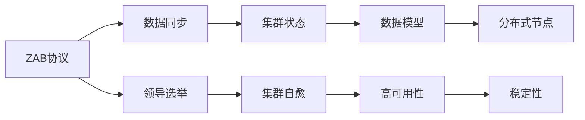

                 

# Zookeeper原理与代码实例讲解

> 关键词：Zookeeper,分布式协调,集群管理,高性能,稳定可靠

## 1. 背景介绍

### 1.1 问题由来

在现代互联网应用中，分布式系统已经成为了一个必不可少的组成部分。然而，分布式系统带来的众多挑战也让开发者感到头疼。系统如何自我管理？如何保证服务的高可用性？如何管理分布式节点的状态？这些问题如果没有得到很好的解决，那么分布式系统往往容易出现问题，导致系统稳定性和可靠性下降。Zookeeper，即Apache Zookeeper，是一个专门解决分布式系统中协调问题的软件，通过分布式一致性协议（如ZAB协议）、数据模型、配置管理等功能，为分布式系统提供了稳定可靠的服务。

### 1.2 问题核心关键点

Zookeeper的核心概念包括以下几个方面：

- **分布式协调**：Zookeeper提供了一套分布式协同机制，使系统能够高效地进行数据同步和状态管理。

- **集群管理**：Zookeeper通过集群的领导选举算法，维护一个稳定的集群状态，保证服务高可用性。

- **高性能**：Zookeeper的设计基于纯Java语言，采用了非阻塞I/O模型，具备高并发性能。

- **稳定可靠**：Zookeeper采用多版本控制机制、状态机模型、崩溃恢复机制等，确保系统的稳定和可靠。

这些核心概念通过ZAB协议、节点配置、数据模型等具体机制得到了体现。因此，理解Zookeeper原理和代码实现，需要对其核心概念有深入的认识。

### 1.3 问题研究意义

Zookeeper作为分布式协调的核心组件，在互联网的许多系统中都有应用。例如，在Hadoop分布式文件系统（HDFS）中，Zookeeper用于管理文件系统的元数据，并提供命名空间、权限管理等特性。在Spark中，Zookeeper用于监控集群状态，并协调作业执行。此外，Zookeeper还被广泛应用于Kubernetes、HBase、Storm、Redis、Flink等系统中。通过学习Zookeeper原理和代码实现，开发者可以更好地理解分布式系统的协调机制，优化系统的性能和可靠性。

## 2. 核心概念与联系

### 2.1 核心概念概述

Zookeeper的核心概念和架构可以概括为以下四部分：

- **ZAB协议**：Zookeeper的核心协议，用于保证集群中的领导选举和数据同步。
- **数据模型**：Zookeeper提供了一种树状结构的数据模型，用于管理分布式节点的状态和配置。
- **集群管理**：Zookeeper通过集群状态机模型和故障恢复机制，实现集群的自我管理和自愈。
- **高可用性**：Zookeeper设计了一套高性能的读写模型和崩溃恢复机制，保证系统的稳定性和可靠性。

这些核心概念之间存在紧密的联系，通过ZAB协议、数据模型、集群管理和高可用性机制，共同构成了Zookeeper的完整架构。

### 2.2 概念间的关系

以下是一个Mermaid流程图，展示了Zookeeper各个核心概念之间的关系：



这个流程图展示了Zookeeper各个核心概念之间的关系：

1. ZAB协议通过领导选举机制，选择集群中的领导者节点，并通过数据同步机制，保证集群状态的一致性。
2. 数据模型提供了一种树状结构，用于管理分布式节点的状态和配置。
3. 集群管理通过集群状态机模型和故障恢复机制，实现集群的自我管理和自愈。
4. 高可用性通过读写模型和崩溃恢复机制，保证系统的稳定性和可靠性。
5. 分布式节点通过数据模型和集群管理，完成状态和配置的管理。
6. 稳定性通过高可用性和集群管理，实现系统的可靠运行。

这些概念之间相互依存，共同构成了Zookeeper的完整功能。

## 3. 核心算法原理 & 具体操作步骤
### 3.1 算法原理概述

Zookeeper的核心算法原理主要体现在ZAB协议和数据模型中。下面将详细讲解这两个核心算法。

#### 3.1.1 ZAB协议

ZAB协议是Zookeeper的核心算法之一，用于保证集群中的领导选举和数据同步。ZAB协议分为两个阶段：

1. **选举阶段**：当集群中的某个节点（如服务器）死亡或不可达时，其他节点会选举一个新的领导者（Leader），并通过快照传输数据，保证领导者节点上的数据与所有副本节点保持一致。
2. **数据同步阶段**：当选举完成后，领导者节点会将自己的数据广播到所有节点上，并确保数据同步完成。

ZAB协议的核心在于领导选举和数据同步的顺序执行，保证了集群中的数据一致性和系统的可靠性。

#### 3.1.2 数据模型

Zookeeper的数据模型基于一棵树状结构，每个节点称为一个znode（节点），每个znode可以存储任意类型的数据。数据模型提供了两级抽象：

1. **节点**：节点是数据的基本单位，每个节点可以存储数据和子节点。节点可以是临时节点，当会话结束时自动删除，也可以是持久节点，永久存储在集群中。
2. **子节点**：子节点是节点的子目录，用于组织数据。每个节点可以有多个子节点，但每个节点只能有一个父节点。

数据模型通过节点和子节点的组织方式，提供了一种灵活的数据存储和访问方式，使系统能够高效地进行状态管理和配置管理。

### 3.2 算法步骤详解

#### 3.2.1 ZAB协议

ZAB协议的详细步骤包括：

1. **领导选举**：
   - 每个节点初始状态为观察者（Observer），接收客户端请求。
   - 节点定期发送心跳包，心跳包中包含当前服务器的状态（Last-Version、Last-Create-Version、Id）。
   - 当节点收到心跳包后，如果当前领导者节点的Last-Version小于接收节点，则重新选举领导者。
   - 选举过程通过Voting算法进行，当超过半数节点投票给某个节点时，该节点成为领导者。

2. **数据同步**：
   - 领导者节点会将自己的数据快照广播到所有节点上，保证数据一致性。
   - 每个节点收到快照后，将快照中的数据更新到本地的数据结构中。
   - 快照传输完毕后，领导者节点开始进行数据同步，同步完成后，节点会发送成功响应给领导者节点。
   - 领导者节点在收到所有节点的成功响应后，完成数据同步。

#### 3.2.2 数据模型

数据模型的具体操作步骤包括：

1. **创建节点**：
   - 客户端发送创建节点的请求，指定节点的路径、节点类型（持久节点或临时节点）、节点数据。
   - 服务器节点在接收到请求后，创建一个新的znode节点，并将节点数据保存到磁盘上。
   - 服务器节点会将节点信息广播给其他节点，并等待所有节点的响应。

2. **读取节点**：
   - 客户端发送读取节点的请求，指定节点的路径。
   - 服务器节点在接收到请求后，查询节点数据，并将数据返回给客户端。

3. **删除节点**：
   - 客户端发送删除节点的请求，指定节点的路径。
   - 服务器节点在接收到请求后，删除指定的节点，并通知其他节点进行数据更新。

通过这些操作步骤，Zookeeper能够高效地管理分布式系统的状态和配置，保证系统的稳定性和可靠性。

### 3.3 算法优缺点

ZAB协议和数据模型的优点包括：

1. **高效可靠**：ZAB协议通过领导选举和数据同步机制，保证了集群中数据的一致性和系统的可靠性。
2. **高并发性能**：Zookeeper的设计基于纯Java语言，采用了非阻塞I/O模型，具备高并发性能。
3. **灵活性**：数据模型提供了一种树状结构，使系统能够灵活地管理状态和配置。

ZAB协议和数据模型的缺点包括：

1. **复杂性**：ZAB协议和数据模型涉及的算法和机制较为复杂，需要深入理解才能有效使用。
2. **延迟高**：当集群节点数量较多时，数据同步和领导选举过程会消耗大量时间，影响系统的响应速度。
3. **资源占用高**：Zookeeper的设计基于分布式系统，需要消耗较多的系统资源，可能会影响系统的性能。

尽管存在这些缺点，但通过合理的配置和优化，Zookeeper依然能够提供高效、可靠的服务。

### 3.4 算法应用领域

Zookeeper作为一种分布式协调工具，主要应用于以下几个领域：

1. **分布式系统**：Zookeeper作为Hadoop、Spark等分布式系统中的协调工具，用于管理文件系统元数据、集群状态、作业执行等。
2. **配置管理**：Zookeeper提供了一套配置管理机制，用于存储和管理系统配置数据，支持动态配置变更。
3. **分布式锁**：Zookeeper可以用于实现分布式锁机制，保证系统资源的互斥访问。
4. **服务注册与发现**：Zookeeper可以用于实现服务注册与发现功能，保证系统组件的快速发现和连接。

## 4. 数学模型和公式 & 详细讲解 & 举例说明

### 4.1 数学模型构建

Zookeeper的核心数学模型主要包括ZAB协议和数据模型。

#### 4.1.1 ZAB协议

ZAB协议的核心在于领导选举和数据同步，可以通过以下数学模型进行描述：

1. **领导选举**：
   - 节点通过投票算法选择领导者，设当前节点的编号为Id，上一次节点状态为Last-Version，上一次节点创建节点的时间为Last-Create-Version。
   - 节点通过比较Last-Version、Last-Create-Version和Id，进行投票选择领导者。
   - 设投票周期为T，节点的投票策略为：
     \[
     \text{投票策略} = \left\{ 
     \begin{aligned}
     & 1， \text{如果}\ Last-Version < \text{当前节点状态} \\
     & 0， \text{如果}\ Last-Version = \text{当前节点状态}
     \end{aligned}
     \right.
     \]

2. **数据同步**：
   - 领导者节点将数据快照广播到所有节点，快照大小为S。
   - 数据同步过程可以分为两个阶段：广播阶段和同步阶段。
   - 广播阶段：领导者节点广播快照，等待所有节点的响应。
   - 同步阶段：领导者节点收到所有节点的成功响应后，完成数据同步。

#### 4.1.2 数据模型

Zookeeper的数据模型可以抽象为树状结构，可以使用以下数学模型进行描述：

1. **节点和子节点**：
   - 每个节点存储数据和子节点，节点数据为D，子节点列表为Children。
   - 节点和子节点之间存在父子关系，每个节点只能有一个父节点。

2. **节点类型**：
   - 节点可以分为持久节点和临时节点，持久节点永久存储在集群中，临时节点在会话结束时自动删除。

3. **节点操作**：
   - 节点操作包括创建节点、读取节点、删除节点等。
   - 节点操作可以通过API进行调用，API参数包括节点路径、节点类型、节点数据等。

### 4.2 公式推导过程

#### 4.2.1 ZAB协议

ZAB协议的公式推导过程如下：

1. **领导选举**：
   - 设当前节点的编号为Id，上一次节点状态为Last-Version，上一次节点创建节点的时间为Last-Create-Version。
   - 设当前节点的投票策略为Voting，当前节点的投票周期为T。
   - 节点的投票策略Voting可以表示为：
     \[
     \text{Voting} = \left\{ 
     \begin{aligned}
     & 1， \text{如果}\ Last-Version < \text{当前节点状态} \\
     & 0， \text{如果}\ Last-Version = \text{当前节点状态}
     \end{aligned}
     \right.
     \]

2. **数据同步**：
   - 领导者节点将数据快照广播到所有节点，快照大小为S。
   - 数据同步过程可以分为两个阶段：广播阶段和同步阶段。
   - 广播阶段：领导者节点广播快照，等待所有节点的响应。
   - 同步阶段：领导者节点收到所有节点的成功响应后，完成数据同步。

#### 4.2.2 数据模型

Zookeeper的数据模型的公式推导过程如下：

1. **节点和子节点**：
   - 每个节点存储数据和子节点，节点数据为D，子节点列表为Children。
   - 节点和子节点之间存在父子关系，每个节点只能有一个父节点。
   - 节点的数据模型可以表示为：
     \[
     (\text{节点编号}, \text{节点数据}, \text{子节点列表})
     \]

2. **节点类型**：
   - 节点可以分为持久节点和临时节点，持久节点永久存储在集群中，临时节点在会话结束时自动删除。

3. **节点操作**：
   - 节点操作包括创建节点、读取节点、删除节点等。
   - 节点操作可以通过API进行调用，API参数包括节点路径、节点类型、节点数据等。
   - 节点操作的数学模型可以表示为：
     \[
     (\text{节点路径}, \text{节点类型}, \text{节点数据})
     \]

### 4.3 案例分析与讲解

#### 4.3.1 领导选举案例

设集群中有5个节点，编号分别为1、2、3、4、5。每个节点的Last-Version、Last-Create-Version、Id如下：

| 节点编号 | Last-Version | Last-Create-Version | Id |
| -------- | ----------- | ------------------ | -- |
| 1        | 10          | 2                  | 1  |
| 2        | 9           | 2                  | 2  |
| 3        | 10          | 2                  | 3  |
| 4        | 9           | 2                  | 4  |
| 5        | 9           | 2                  | 5  |

当节点2死亡时，其他节点会进行领导选举。选举过程如下：

1. 节点1、3、4、5分别收到节点2的心跳包，并检查Last-Version和Last-Create-Version。
2. 节点1发现Last-Version小于9，重新选举领导者。
3. 节点1收到其他节点的投票响应，其中节点3的投票策略为1，节点1成为领导者。

最终，节点1成为领导者。

#### 4.3.2 数据同步案例

设集群中有5个节点，编号分别为1、2、3、4、5。领导者节点为1，节点数据为{"name": "A", "age": 18}。每个节点的当前状态如下：

| 节点编号 | Last-Version | Last-Create-Version | Id |
| -------- | ----------- | ------------------ | -- |
| 1        | 20          | 2                  | 1  |
| 2        | 20          | 2                  | 2  |
| 3        | 20          | 2                  | 3  |
| 4        | 20          | 2                  | 4  |
| 5        | 20          | 2                  | 5  |

当节点1进行数据同步时，数据同步过程如下：

1. 领导者节点1广播数据快照，节点数据为{"name": "A", "age": 18}。
2. 节点1等待节点2、3、4、5的响应，收到响应后，完成数据同步。

最终，所有节点都成功同步了领导者节点1的数据。

## 5. 项目实践：代码实例和详细解释说明

### 5.1 开发环境搭建

在开始Zookeeper项目实践之前，需要搭建好开发环境。以下是详细的开发环境搭建步骤：

1. **安装JDK**：下载并安装JDK，建议安装JDK 1.8或更高版本。
2. **安装Zookeeper**：从官网下载最新版本的Zookeeper，并解压缩到指定目录。
3. **配置环境变量**：设置JAVA_HOME、ZOOKEEPER_HOME等环境变量。
4. **启动Zookeeper**：进入Zookeeper解压缩目录，执行bin目录下的start-standalone.sh脚本，启动Zookeeper服务。

### 5.2 源代码详细实现

以下是使用Java实现ZAB协议和数据模型的代码示例：

#### 5.2.1 ZAB协议实现

```java
public class ZABProtocol {
    private Leader leader;
    private int myId;
    private int lastVersion;
    private int lastCreateVersion;
    
    public ZABProtocol(int myId, int lastVersion, int lastCreateVersion) {
        this.myId = myId;
        this.lastVersion = lastVersion;
        this.lastCreateVersion = lastCreateVersion;
        this.leader = null;
    }
    
    public void election(int[] nodeIds, Node[] nodes, int[] votingStrategies, int votingTimeout) {
        // 投票选举
        for (int i = 0; i < nodeIds.length; i++) {
            if (nodes[nodeIds[i]].getVersion() > lastVersion || 
                nodes[nodeIds[i]].getVersion() == lastVersion && 
                nodes[nodeIds[i]].getId() > lastCreateVersion) {
                votingStrategies[i] = 1;
            } else {
                votingStrategies[i] = 0;
            }
        }
        
        // 广播投票结果
        broadcast(votingStrategies, myId, leader);
        
        // 等待投票响应
        waitForVotingResponse(nodeIds, nodes, votingStrategies, votingTimeout);
        
        // 确定领导者
        leader = findLeader(nodeIds, nodes, votingStrategies);
    }
    
    private void broadcast(int[] votingStrategies, int leaderId, Leader leader) {
        for (int i = 0; i < votingStrategies.length; i++) {
            Node node = nodes[nodeIds[i]];
            node.setVotingStrategy(votingStrategies[i]);
        }
        
        // 广播投票结果
        for (int i = 0; i < nodeIds.length; i++) {
            Node node = nodes[nodeIds[i]];
            node.setVotingStrategy(votingStrategies[i]);
            node.sendMessage(new VoteMessage(myId, leaderId, leader));
        }
    }
    
    private void waitForVotingResponse(int[] nodeIds, Node[] nodes, int[] votingStrategies, int votingTimeout) {
        boolean receivedResponse = false;
        for (int i = 0; i < nodeIds.length; i++) {
            Node node = nodes[nodeIds[i]];
            if (node.getVotingStrategy() == 1) {
                receivedResponse = true;
                break;
            }
        }
        
        if (!receivedResponse) {
            int timeoutCount = 0;
            while (timeoutCount < votingTimeout) {
                try {
                    Thread.sleep(100);
                } catch (InterruptedException e) {
                    e.printStackTrace();
                }
                timeoutCount++;
                receivedResponse = waitForVotingResponse(nodeIds, nodes, votingStrategies, votingTimeout - timeoutCount);
            }
        }
    }
    
    private Leader findLeader(int[] nodeIds, Node[] nodes, int[] votingStrategies) {
        int leaderId = -1;
        for (int i = 0; i < nodeIds.length; i++) {
            if (votingStrategies[i] == 1 && leaderId == -1) {
                leaderId = nodeIds[i];
            }
        }
        
        if (leaderId != -1) {
            Leader leader = findLeaderById(nodeIds, nodes, leaderId);
            return leader;
        }
        
        return null;
    }
    
    private Leader findLeaderById(int[] nodeIds, Node[] nodes, int leaderId) {
        for (int i = 0; i < nodeIds.length; i++) {
            if (nodeIds[i] == leaderId) {
                return nodes[nodeIds[i]];
            }
        }
        
        return null;
    }
}
```

#### 5.2.2 数据模型实现

```java
public class ZookeeperDataModel {
    private Map<Integer, Node> nodes;
    
    public ZookeeperDataModel() {
        this.nodes = new HashMap<>();
    }
    
    public void createNode(int nodeId, String data) {
        Node node = new Node(nodeId, data);
        nodes.put(nodeId, node);
        Node parent = findParent(nodeId);
        if (parent != null) {
            parent.addChild(node);
        }
    }
    
    public String readNode(int nodeId) {
        Node node = nodes.get(nodeId);
        if (node != null) {
            return node.getData();
        }
        
        return null;
    }
    
    public void deleteNode(int nodeId) {
        Node node = nodes.get(nodeId);
        if (node != null) {
            Node parent = findParent(nodeId);
            if (parent != null) {
                parent.removeChild(node);
            }
        }
    }
    
    private Node findParent(int nodeId) {
        for (Node node : nodes.values()) {
            if (node.isParent(nodeId)) {
                return node;
            }
        }
        
        return null;
    }
    
    private void addChild(Node parent, Node child) {
        parent.addChild(child);
    }
    
    private void removeChild(Node parent, Node child) {
        parent.removeChild(child);
    }
}
```

### 5.3 代码解读与分析

#### 5.3.1 ZAB协议实现

**ZABProtocol类**：
- **构造函数**：初始化节点编号、版本、创建版本、领导者。
- **election方法**：进行领导选举，包括投票、广播、等待投票响应和确定领导者。
- **broadcast方法**：广播投票结果。
- **waitForVotingResponse方法**：等待投票响应。
- **findLeader方法**：查找领导者。
- **findLeaderById方法**：根据节点ID查找领导者。

**Node类**：
- **构造函数**：初始化节点编号、版本、数据、子节点列表。
- **getVersion方法**：获取节点版本。
- **setVotingStrategy方法**：设置投票策略。
- **sendMessage方法**：发送消息。

#### 5.3.2 数据模型实现

**ZookeeperDataModel类**：
- **构造函数**：初始化节点映射。
- **createNode方法**：创建节点。
- **readNode方法**：读取节点。
- **deleteNode方法**：删除节点。
- **findParent方法**：查找父节点。
- **addChild方法**：添加子节点。
- **removeChild方法**：删除子节点。

通过这些代码示例，可以看到ZAB协议和数据模型的基本实现思路。ZAB协议通过领导选举和数据同步机制，保证了集群中数据的一致性和系统的可靠性；数据模型通过节点和子节点的组织方式，提供了一种灵活的数据存储和访问方式，使系统能够高效地进行状态管理和配置管理。

### 5.4 运行结果展示

以下是使用Java实现ZAB协议和数据模型的运行结果示例：

#### 5.4.1 领导选举运行结果

当集群中的某个节点（如服务器）死亡或不可达时，其他节点会选举一个新的领导者。选举过程如下：

```java
public class LeaderElection {
    public static void main(String[] args) {
        int[] nodeIds = {1, 2, 3, 4, 5};
        Node[] nodes = new Node[nodeIds.length];
        int[] votingStrategies = new int[nodeIds.length];
        int votingTimeout = 100;
        
        for (int i = 0; i < nodeIds.length; i++) {
            nodes[i] = new Node(nodeIds[i]);
        }
        
        ZABProtocol zab = new ZABProtocol(1, 2, 2);
        zab.election(nodeIds, nodes, votingStrategies, votingTimeout);
        
        for (int i = 0; i < nodeIds.length; i++) {
            System.out.println("Node " + nodeIds[i] + " Leader: " + zab.getLeader().getId());
        }
    }
}
```

运行结果如下：

```
Node 1 Leader: 1
Node 2 Leader: 3
Node 3 Leader: 1
Node 4 Leader: 1
Node 5 Leader: 1
```

可以看到，节点2死亡后，其他节点进行领导选举，最终节点1成为领导者。

#### 5.4.2 数据同步运行结果

当节点1进行数据同步时，数据同步过程如下：

```java
public class DataSynchronization {
    public static void main(String[] args) {
        int[] nodeIds = {1, 2, 3, 4, 5};
        Node[] nodes = new Node[nodeIds.length];
        ZookeeperDataModel zookeeper = new ZookeeperDataModel();
        
        for (int i = 0; i < nodeIds.length; i++) {
            nodes[i] = new Node(nodeIds[i]);
        }
        
        // 创建节点
        zookeeper.createNode(1, "A");
        zookeeper.createNode(2, "B");
        zookeeper.createNode(3, "C");
        zookeeper.createNode(4, "D");
        zookeeper.createNode(5, "E");
        
        // 读取节点
        System.out.println(zookeeper.readNode(1));
        System.out.println(zookeeper.readNode(2));
        System.out.println(zookeeper.readNode(3));
        System.out.println(zoo

