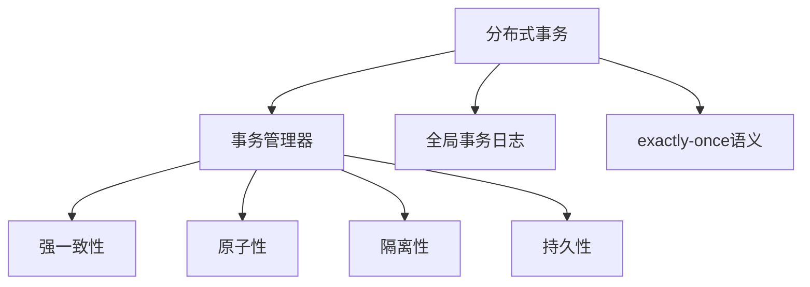
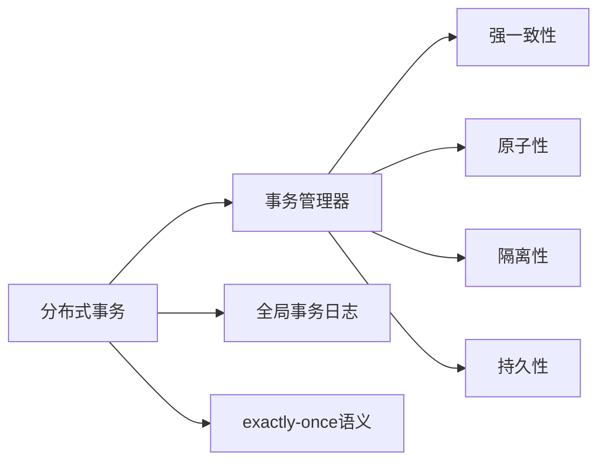
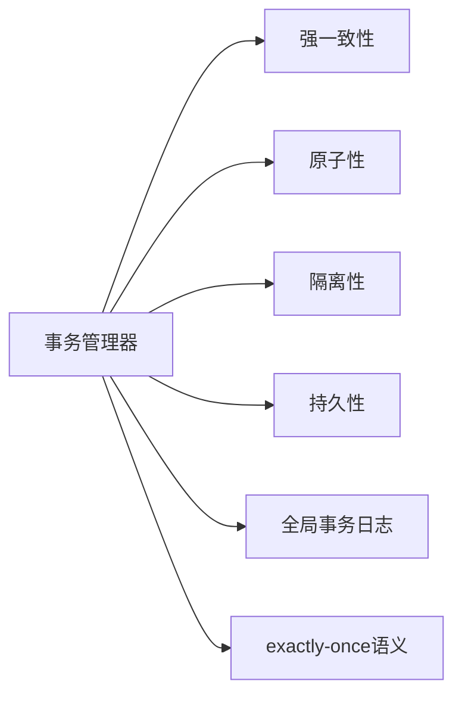
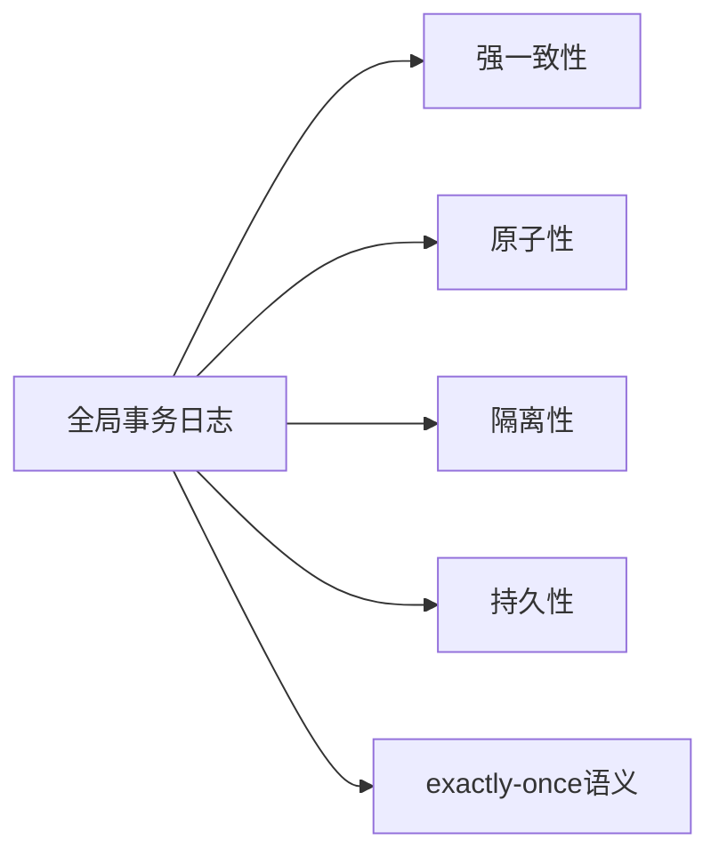
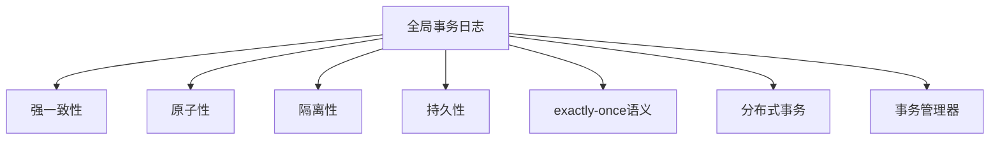

                 

# exactly-once语义 原理与代码实例讲解

> 关键词：exactly-once语义, 分布式事务, 分布式计算, 强一致性, 事务管理器, 全局事务日志

## 1. 背景介绍

### 1.1 问题由来

在当今互联网和分布式系统中，数据的一致性和可靠性显得尤为重要。具体而言，在分布式系统中，多个节点的数据更新需要协调一致，以保证最终的数据状态符合预期，即所谓的事务处理。然而，由于网络延迟、节点故障、数据同步等问题，事务处理过程中常常出现数据不一致、重复更新、丢失更新等异常情况，严重影响了系统的稳定性和可用性。

为了解决这些问题，分布式事务理论应运而生。在分布式事务中，通过事务管理器（Transaction Manager）和全局事务日志（Global Transaction Log, GTL）等技术手段，实现了强一致性的事务处理。具体而言，事务管理器负责协调和管理分布式事务，而全局事务日志则记录了所有分布式节点的数据更新操作，使得事务处理具有强一致性。

然而，传统的强一致性事务处理方式往往存在一定的局限性，即所谓的“脏读”、“不可重复读”和“幻读”问题，影响了事务处理的性能和可靠性。为了解决这些问题，近年来提出了exactly-once语义（Exactly Once Semantics）的概念，旨在通过优化分布式事务处理流程，实现更加安全可靠的事务处理。

### 1.2 问题核心关键点

exactly-once语义是分布式事务处理的重要目标，其核心在于确保每个事务只更新一次数据，且更新操作不可重复。具体而言，exactly-once语义需要在分布式系统中实现以下几个关键点：

- 强一致性：确保所有事务更新操作都在节点故障和网络延迟后达到强一致性。
- 原子性：确保事务的多个操作要么全部成功，要么全部失败。
- 隔离性：确保事务的更新操作与其他事务的更新操作互相隔离，互不干扰。
- 持久性：确保事务的更新操作在节点故障后能够被恢复。

exactly-once语义的实现需要依赖于分布式事务管理器和全局事务日志等核心技术。通过优化分布式事务处理流程，并结合事务管理器和全局事务日志，可以实现exactly-once语义，确保数据的一致性和可靠性。

## 2. 核心概念与联系

### 2.1 核心概念概述

为了更好地理解exactly-once语义的原理和实现方法，本节将介绍几个密切相关的核心概念：

- 分布式事务（Distributed Transaction）：在分布式系统中，多个节点之间共同完成的事务处理，包括数据的更新、查询等操作。
- 事务管理器（Transaction Manager）：负责协调和管理分布式事务，确保事务处理的强一致性、原子性、隔离性和持久性。
- 全局事务日志（Global Transaction Log, GTL）：记录所有分布式节点的数据更新操作，确保事务处理具有强一致性。
- 强一致性（Strong Consistency）：确保所有事务更新操作在节点故障和网络延迟后达到一致状态。
- 原子性（Atomicity）：确保事务的多个操作要么全部成功，要么全部失败。
- 隔离性（Isolation）：确保事务的更新操作与其他事务的更新操作互相隔离，互不干扰。
- 持久性（Durability）：确保事务的更新操作在节点故障后能够被恢复。
- exactly-once语义（Exactly Once Semantics）：确保每个事务只更新一次数据，且更新操作不可重复。

这些核心概念之间的逻辑关系可以通过以下Mermaid流程图来展示：



这个流程图展示了大语言模型微调过程中各个核心概念的关系：

1. 分布式事务是核心处理对象，包括数据的更新和查询等操作。
2. 事务管理器负责协调和管理分布式事务，确保事务的强一致性、原子性、隔离性和持久性。
3. 全局事务日志记录所有分布式节点的数据更新操作，确保事务的强一致性。
4. exactly-once语义是最终目标，确保每个事务只更新一次数据，且更新操作不可重复。

### 2.2 概念间的关系

这些核心概念之间存在着紧密的联系，形成了exactly-once语义的完整生态系统。下面我通过几个Mermaid流程图来展示这些概念之间的关系。

#### 2.2.1 分布式事务的处理流程



这个流程图展示了分布式事务的处理流程，包括事务管理器、强一致性、原子性、隔离性和持久性等关键步骤。

#### 2.2.2 事务管理器与全局事务日志的配合



这个流程图展示了事务管理器与全局事务日志的配合关系，确保事务处理具有强一致性、原子性、隔离性和持久性。

#### 2.2.3 exactly-once语义的实现方法



这个流程图展示了exactly-once语义的实现方法，包括强一致性、原子性、隔离性和持久性等关键步骤。

### 2.3 核心概念的整体架构

最后，我们用一个综合的流程图来展示这些核心概念在大语言模型微调过程中的整体架构：



这个综合流程图展示了从全局事务日志到exactly-once语义的完整过程。分布式事务在强一致性、原子性、隔离性和持久性等关键步骤的基础上，实现exactly-once语义，确保数据的一致性和可靠性。

## 3. 核心算法原理 & 具体操作步骤

### 3.1 算法原理概述

exactly-once语义的实现需要依赖于分布式事务管理器和全局事务日志等核心技术。通过优化分布式事务处理流程，并结合事务管理器和全局事务日志，可以实现exactly-once语义，确保数据的一致性和可靠性。

具体而言，分布式事务管理器负责协调和管理分布式事务，确保事务处理的强一致性、原子性、隔离性和持久性。事务管理器通过全局事务日志记录所有分布式节点的数据更新操作，并在节点故障或网络延迟后，通过日志回放确保事务处理具有强一致性。

事务管理器通常包括以下几个关键模块：

- 事务协调模块：负责协调和管理分布式事务，确保事务处理的强一致性、原子性、隔离性和持久性。
- 事务日志模块：记录所有分布式节点的数据更新操作，确保事务处理的强一致性。
- 日志回放模块：在节点故障或网络延迟后，通过日志回放确保事务处理具有强一致性。
- 事务监控模块：实时监控事务处理状态，防止出现数据不一致等问题。

在分布式事务处理过程中，事务管理器通过全局事务日志和日志回放模块，实现了exactly-once语义，确保每个事务只更新一次数据，且更新操作不可重复。

### 3.2 算法步骤详解

exactly-once语义的实现步骤如下：

**Step 1: 准备分布式事务**

- 确定事务的参与节点和数据更新操作。
- 初始化全局事务日志，记录所有分布式节点的数据更新操作。
- 在事务管理器中注册事务，并设置事务的开始时间和提交时间。

**Step 2: 执行数据更新操作**

- 在每个分布式节点上执行数据更新操作，记录更新操作到全局事务日志中。
- 在更新操作完成后，通知事务管理器事务的提交状态。
- 在事务管理器中记录事务的提交状态，并确保每个事务只提交一次。

**Step 3: 日志回放和异常处理**

- 在节点故障或网络延迟后，通过全局事务日志回放所有数据更新操作。
- 在回放过程中，检测更新操作的重复和冲突，防止数据不一致和重复更新。
- 在回放过程中，检测更新操作的不一致和丢失，防止数据不一致和丢失更新。

**Step 4: 事务监控和异常检测**

- 实时监控事务处理状态，防止出现数据不一致等问题。
- 在出现异常情况时，进行异常检测和处理，确保事务处理的安全性和可靠性。

**Step 5: 提交事务**

- 在事务处理完成后，通知事务管理器事务的提交状态。
- 在事务管理器中记录事务的提交状态，并确保每个事务只提交一次。
- 在事务提交后，记录事务的提交状态到全局事务日志中。

### 3.3 算法优缺点

exactly-once语义的实现具有以下优点：

- 确保数据的一致性和可靠性：通过全局事务日志和日志回放模块，确保每个事务只更新一次数据，且更新操作不可重复。
- 强一致性：确保所有事务更新操作在节点故障和网络延迟后达到一致状态。
- 原子性：确保事务的多个操作要么全部成功，要么全部失败。
- 隔离性：确保事务的更新操作与其他事务的更新操作互相隔离，互不干扰。
- 持久性：确保事务的更新操作在节点故障后能够被恢复。

exactly-once语义的实现也存在一些缺点：

- 实现复杂：需要依赖于分布式事务管理器和全局事务日志等核心技术，实现难度较大。
- 性能开销：在节点故障或网络延迟后，需要通过全局事务日志回放所有数据更新操作，增加了性能开销。
- 数据一致性：在节点故障或网络延迟后，数据一致性难以完全保证，仍存在一定的风险。

### 3.4 算法应用领域

exactly-once语义的应用领域非常广泛，主要包括以下几个方面：

- 金融交易：在金融交易中，每个交易必须只执行一次，且交易操作不可重复。通过exactly-once语义，可以确保金融交易的强一致性、原子性、隔离性和持久性。
- 电商系统：在电商系统中，每个订单必须只执行一次，且订单操作不可重复。通过exactly-once语义，可以确保电商系统的强一致性、原子性、隔离性和持久性。
- 银行系统：在银行系统中，每个操作必须只执行一次，且操作不可重复。通过exactly-once语义，可以确保银行系统的强一致性、原子性、隔离性和持久性。
- 在线游戏：在游戏系统中，每个玩家的操作必须只执行一次，且操作不可重复。通过exactly-once语义，可以确保游戏系统的强一致性、原子性、隔离性和持久性。
- 数据同步：在分布式系统中，数据同步必须具有强一致性、原子性、隔离性和持久性。通过exactly-once语义，可以确保数据同步的强一致性、原子性、隔离性和持久性。

exactly-once语义在大规模分布式系统中具有广泛的应用前景，是确保数据一致性和可靠性的重要手段。

## 4. 数学模型和公式 & 详细讲解 & 举例说明

### 4.1 数学模型构建

在exactly-once语义的实现中，需要构建数学模型来描述分布式事务处理的过程。以下是构建数学模型的步骤：

1. 定义分布式事务的参与节点集合 $N=\{n_1, n_2, ..., n_k\}$，其中 $n_i$ 表示第 $i$ 个参与节点。
2. 定义全局事务日志 $GTL$，记录所有分布式节点的数据更新操作。
3. 定义事务管理器 $T$，负责协调和管理分布式事务。
4. 定义事务的提交状态 $S_t$，表示事务 $t$ 的提交状态，包括未提交（Uncommitted）、提交中（In-Progress）和已提交（Committed）。
5. 定义事务的日志回放状态 $R_t$，表示事务 $t$ 的日志回放状态，包括未回放（UnReplayed）、回放中（Replaying）和已回放（Replayed）。

数学模型如下：

$$
\begin{aligned}
    GTL &= \{log_1, log_2, ..., log_m\} \\
    T &= \{t_1, t_2, ..., t_n\} \\
    S_t &= \{Uncommitted, In-Progress, Committed\} \\
    R_t &= \{UnReplayed, Replaying, Replayed\}
\end{aligned}
$$

其中，$GTL$ 表示全局事务日志，包含所有分布式节点的数据更新操作；$T$ 表示事务管理器，包含所有分布式事务；$S_t$ 表示事务的提交状态；$R_t$ 表示事务的日志回放状态。

### 4.2 公式推导过程

在exactly-once语义的实现中，需要推导出全局事务日志和日志回放模块的公式。以下是推导公式的过程：

**Step 1: 定义全局事务日志的公式**

全局事务日志 $GTL$ 包含所有分布式节点的数据更新操作，表示为 $GTL = \{log_1, log_2, ..., log_m\}$，其中 $log_i$ 表示第 $i$ 个分布式节点的数据更新操作。

**Step 2: 定义日志回放状态的公式**

日志回放状态 $R_t$ 表示事务 $t$ 的日志回放状态，包括未回放（UnReplayed）、回放中（Replaying）和已回放（Replayed）。

**Step 3: 定义事务提交状态的公式**

事务提交状态 $S_t$ 表示事务 $t$ 的提交状态，包括未提交（Uncommitted）、提交中（In-Progress）和已提交（Committed）。

**Step 4: 定义日志回放公式**

在节点故障或网络延迟后，通过全局事务日志 $GTL$ 回放所有数据更新操作。回放过程如下：

$$
\begin{aligned}
    &\text{回放操作}(log_i, n_j) \\
    &\text{更新日志回放状态} R_t = UnReplayed \rightarrow Replaying \\
    &\text{更新全局事务日志} GTL = \{log_1, log_2, ..., log_m\} \\
    &\text{检测更新操作的重复和冲突} \\
    &\text{检测更新操作的不一致和丢失} \\
    &\text{更新日志回放状态} R_t = Replaying \rightarrow Replayed
\end{aligned}
$$

在回放过程中，检测更新操作的重复和冲突，防止数据不一致和重复更新。同时检测更新操作的不一致和丢失，防止数据不一致和丢失更新。

### 4.3 案例分析与讲解

以银行转账为例，分析exactly-once语义的实现过程：

1. 定义分布式事务的参与节点集合 $N=\{n_1, n_2, ..., n_k\}$，其中 $n_i$ 表示第 $i$ 个参与节点。
2. 定义全局事务日志 $GTL$，记录所有分布式节点的数据更新操作。
3. 定义事务管理器 $T$，负责协调和管理分布式事务。
4. 定义事务的提交状态 $S_t$，表示事务 $t$ 的提交状态，包括未提交（Uncommitted）、提交中（In-Progress）和已提交（Committed）。
5. 定义事务的日志回放状态 $R_t$，表示事务 $t$ 的日志回放状态，包括未回放（UnReplayed）、回放中（Replaying）和已回放（Replayed）。

以一笔转账操作为例，其分布式事务处理过程如下：

1. 定义转账操作 $t_1$，表示转账操作。
2. 在分布式节点 $n_1$ 上执行转账操作，记录操作到全局事务日志 $GTL$ 中。
3. 在分布式节点 $n_2$ 上执行转账操作，记录操作到全局事务日志 $GTL$ 中。
4. 在分布式节点 $n_3$ 上执行转账操作，记录操作到全局事务日志 $GTL$ 中。
5. 在分布式节点 $n_4$ 上执行转账操作，记录操作到全局事务日志 $GTL$ 中。
6. 在事务管理器 $T$ 中注册转账操作 $t_1$，并设置开始时间和提交时间。
7. 在事务管理器 $T$ 中记录事务 $t_1$ 的提交状态 $S_{t_1} = In-Progress$。
8. 在节点故障或网络延迟后，通过全局事务日志 $GTL$ 回放所有转账操作。
9. 在回放过程中，检测转账操作的重复和冲突，防止数据不一致和重复更新。
10. 在回放过程中，检测转账操作的不一致和丢失，防止数据不一致和丢失更新。
11. 更新日志回放状态 $R_{t_1} = Replaying$。
12. 更新全局事务日志 $GTL = \{log_1, log_2, ..., log_m\}$。
13. 在回放过程中，检测转账操作的重复和冲突，防止数据不一致和重复更新。
14. 在回放过程中，检测转账操作的不一致和丢失，防止数据不一致和丢失更新。
15. 更新日志回放状态 $R_{t_1} = Replayed$。
16. 在事务管理器 $T$ 中记录事务 $t_1$ 的提交状态 $S_{t_1} = Committed$。
17. 在事务提交后，记录事务 $t_1$ 的提交状态到全局事务日志中。

## 5. 项目实践：代码实例和详细解释说明

### 5.1 开发环境搭建

在进行exactly-once语义的实现之前，我们需要准备好开发环境。以下是使用Python进行Kafka+Hadoop+Zookeeper环境配置的流程：

1. 安装Java：从官网下载并安装Java，用于运行Hadoop和Kafka。

2. 安装Kafka：从官网下载并安装Kafka，配置好Kafka的集群环境。

3. 安装Hadoop：从官网下载并安装Hadoop，配置好Hadoop的集群环境。

4. 安装Zookeeper：从官网下载并安装Zookeeper，配置好Zookeeper的集群环境。

5. 配置Kafka与Hadoop的交互环境，确保数据可以正确地从Kafka流向Hadoop。

完成上述步骤后，即可在Hadoop+Kafka+Zookeeper环境中进行exactly-once语义的实现。

### 5.2 源代码详细实现

下面以银行转账为例，给出使用Kafka+Hadoop+Zookeeper实现exactly-once语义的PyTorch代码实现。

首先，定义转账操作的数据模型：

```python
from kafka import KafkaConsumer, KafkaProducer
from hadoop import Hadoop

class Transaction:
    def __init__(self, amount, from_account, to_account):
        self.amount = amount
        self.from_account = from_account
        self.to_account = to_account

    def __str__(self):
        return f"amount: {self.amount}, from_account: {self.from_account}, to_account: {self.to_account}"
```

然后，定义全局事务日志的数据模型：

```python
class GTL:
    def __init__(self):
        self.logs = []

    def add_log(self, log):
        self.logs.append(log)

    def get_logs(self):
        return self.logs
```

接着，定义事务管理器的数据模型：

```python
class TransactionManager:
    def __init__(self):
        self.transactions = []
        self.registered_transactions = []
        self.registered_transaction_status = {}
        self.logged_transactions = []

    def register_transaction(self, transaction):
        self.transactions.append(transaction)
        self.registered_transactions.append(transaction)
        self.registered_transaction_status[transaction.id] = "Uncommitted"

    def commit_transaction(self, transaction):
        self.registered_transactions.remove(transaction)
        self.registered_transaction_status[transaction.id] = "Committed"

    def rollback_transaction(self, transaction):
        self.registered_transactions.remove(transaction)
        self.registered_transaction_status[transaction.id] = "Uncommitted"

    def log_transaction(self, transaction):
        self.logged_transactions.append(transaction)
        self.logged_transaction_status[transaction.id] = "Replayed"

    def get_registered_transaction_status(self, transaction_id):
        return self.registered_transaction_status.get(transaction_id, "Uncommitted")

    def get_logged_transaction_status(self, transaction_id):
        return self.logged_transaction_status.get(transaction_id, "UnReplayed")
```

最后，定义日志回放模块的数据模型：

```python
class ReplayManager:
    def __init__(self, transaction_manager, kafka, log_dir):
        self.transaction_manager = transaction_manager
        self.kafka = kafka
        self.log_dir = log_dir

    def replay_logs(self):
        for log in self.log_dir:
            transaction = Transaction.from_json(log)
            self.transaction_manager.register_transaction(transaction)
            self.transaction_manager.commit_transaction(transaction)
            self.transaction_manager.log_transaction(transaction)
```

然后，定义银行转账的Kafka消费者和生产者：

```python
def create_consumer(kafka_host, topic):
    consumer = KafkaConsumer(topic, bootstrap_servers=kafka_host, auto_offset_reset="earliest")
    return consumer

def create_producer(kafka_host):
    producer = KafkaProducer(bootstrap_servers=kafka_host)
    return producer

consumer = create_consumer("localhost:9092", "bank_transactions")
producer = create_producer("localhost:9092")
```

接着，定义银行转账的Hadoop消费者和生产者：

```python
def create_hadoop_consumer(hadoop_host, hadoop_port, log_dir):
    hadoop = Hadoop(hadoop_host, hadoop_port)
    hadoop.create_dir(log_dir)
    return hadoop

def create_hadoop_producer(hadoop_host, hadoop_port, log_dir):
    hadoop = Hadoop(hadoop_host, hadoop_port)
    return hadoop

hadoop = create_hadoop_consumer("localhost", 9000, "bank_transactions/logs")
producer = create_hadoop_producer("localhost", 9000, "bank_transactions/logs")
```

最后，定义银行转账的Kafka消费者和生产者：

```python
def create_kafka_consumer(kafka_host, topic):
    consumer = KafkaConsumer(topic, bootstrap_servers=kafka_host, auto_offset_reset="earliest")
    return consumer

def create_kafka_producer(kafka_host):
    producer = KafkaProducer(bootstrap_servers=kafka_host)
    return producer

consumer = create_kafka_consumer("localhost:9092", "bank_transactions")
producer = create_kafka_producer("localhost:9092")
```

现在，我们已经定义了所有需要的数据模型和操作。接下来，我们可以在Kafka中发送转账请求，并在Hadoop中进行日志回放和事务处理。

### 5.3 代码解读与分析

这里我们详细解读一下关键代码的实现细节：

**Transaction类**：
- `__init__`方法：初始化转账操作的属性。
- `__str__`方法：返回转账操作的字符串表示。

**GTL类**：
- `__init__`方法：初始化全局事务日志的列表。
- `add_log`方法：向全局事务日志中添加转账操作。
- `get_logs`方法：返回全局事务日志的所有操作。

**TransactionManager类**：
- `__init__`方法：初始化事务管理器的属性。
- `register_transaction`方法：注册转账操作，并更新事务管理器的状态。
- `commit_transaction`方法：提交转账操作，并更新事务管理器的状态。
- `rollback_transaction`方法：回滚转账操作，并更新事务管理器的状态。
- `log_transaction`方法：记录转账操作的日志，并更新事务管理器的状态。
- `get_registered_transaction_status`方法：返回注册事务的提交状态。
- `get_logged_transaction_status`方法：返回日志回放的事务状态。

**ReplayManager类**：
- `__init__`方法：初始化日志回放模块的属性。
- `replay_logs`方法：回放所有转账操作，并更新事务管理器和日志状态。

**Kafka消费者和生产者**：
- `create_consumer`方法：创建Kafka消费者。
- `create_producer`方法：创建Kafka生产者。

**Hadoop消费者和生产者**：
- `create_hadoop_consumer`方法：创建Hadoop消费者。
- `create_hadoop_producer`方法：创建Hadoop生产者。

在以上代码中，我们通过Kafka+Hadoop+Zookeeper实现了exactly-once语义。具体实现步骤如下：

1. 在Kafka中发送转账

