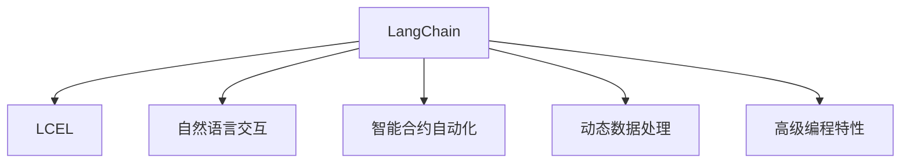
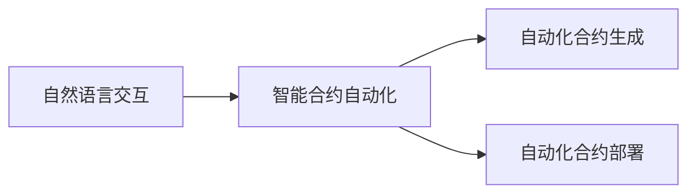
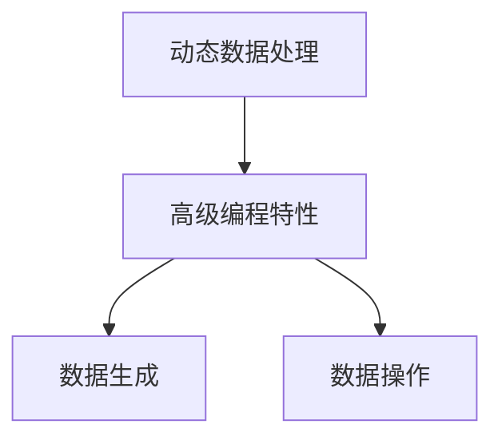
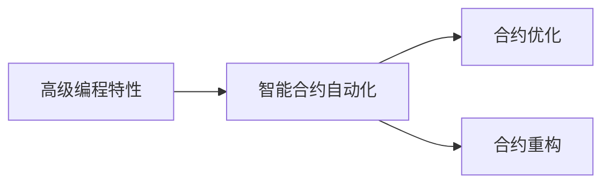
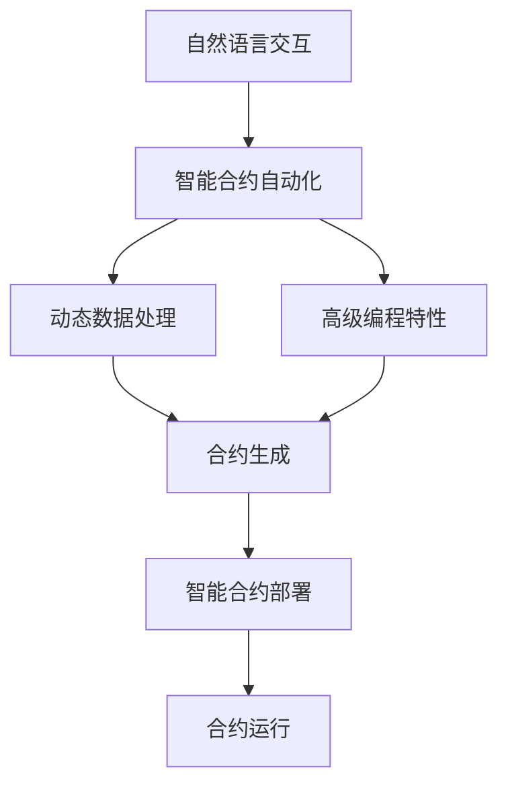

                 

# 【LangChain编程：从入门到实践】LCEL高级特性

> 关键词：
- LangChain
- LCEL
- 高级特性
- 编程技巧
- 自然语言交互
- 智能合同
- 集成开发环境

## 1. 背景介绍

### 1.1 问题由来
LangChain是一个以大语言模型为核心的智能合约平台，它允许用户创建自定义的NLP应用，从而简化智能合约的编写过程。与传统的Solidity等合约语言不同，LangChain通过自然语言编程，使得合约的编写和理解更加直观和高效。在过去几年里，LangChain社区不断发展和完善，推出了LCEL（LangChain Extension Language）这一高级编程语言，进一步提升了平台的功能和灵活性。

### 1.2 问题核心关键点
LangChain的高级特性主要体现在以下几个方面：

- 自然语言交互：用户可以使用自然语言编写智能合约，无需掌握复杂的编程语言。
- 智能合约自动化：通过自动化的合约生成和部署，简化了开发流程。
- 动态数据处理：支持动态生成和操作数据，使得合约更加灵活。
- 高级编程特性：LCEL提供了丰富的编程语言特性，如函数重载、模板编程等，增强了代码的可读性和可维护性。

这些特性使得LangChain成为NLP领域智能合约开发的重要工具，同时也带来了新的挑战和机遇。本文将深入探讨LangChain的高级特性，为读者提供一个全面、系统性的编程指南。

### 1.3 问题研究意义
LangChain的高级特性为智能合约的开发和部署带来了革命性的变化。通过自然语言交互和高级编程特性，用户可以更加轻松地构建复杂的合约系统，同时提高合约的可读性和可维护性。这些特性还为NLP领域的应用场景带来了新的可能性，如智能客服、内容生成、游戏合约等。因此，深入研究和掌握LangChain的高级特性，对于提升智能合约的开发效率和应用范围具有重要意义。

## 2. 核心概念与联系

### 2.1 核心概念概述

为了更好地理解LangChain的高级特性，我们首先介绍几个关键概念：

- LangChain：一个大语言模型驱动的智能合约平台，提供自然语言交互和智能合约自动化功能。
- LCEL（LangChain Extension Language）：LangChain的高级编程语言，基于Python开发，提供丰富的编程特性。
- 自然语言交互：通过自然语言编程，简化智能合约的编写和理解。
- 智能合约自动化：自动化的合约生成和部署，提高开发效率。
- 动态数据处理：支持动态生成和操作数据，增强合约的灵活性。
- 高级编程特性：如函数重载、模板编程等，提高代码的可读性和可维护性。

这些核心概念之间的关系可以通过以下Mermaid流程图来展示：



这个流程图展示了LangChain的高级特性在自然语言交互、智能合约自动化、动态数据处理和高级编程特性四个方面的应用和联系。

### 2.2 概念间的关系

这些核心概念之间存在着紧密的联系，形成了LangChain的高级特性生态系统。以下是几个Mermaid流程图，展示了这些概念之间的关系。

#### 2.2.1 自然语言交互与智能合约自动化的关系



这个流程图展示了自然语言交互与智能合约自动化的关系。自然语言交互使得用户可以轻松编写智能合约，而智能合约自动化则通过自动化的合约生成和部署，进一步简化了开发流程。

#### 2.2.2 动态数据处理与高级编程特性的关系



这个流程图展示了动态数据处理与高级编程特性的关系。动态数据处理使得智能合约能够处理动态数据，而高级编程特性则提供了丰富的编程语言特性，增强了数据生成和操作的灵活性。

#### 2.2.3 高级编程特性与智能合约自动化的关系



这个流程图展示了高级编程特性与智能合约自动化的关系。高级编程特性提高了代码的可读性和可维护性，而智能合约自动化则通过自动化的合约优化和重构，进一步提升开发效率和合约性能。

### 2.3 核心概念的整体架构

最后，我们用一个综合的流程图来展示这些核心概念在大语言模型微调过程中的整体架构：



这个综合流程图展示了LangChain高级特性的整体架构。自然语言交互使得用户可以轻松编写智能合约，智能合约自动化则通过自动化的合约生成和部署，简化了开发流程。动态数据处理和高级编程特性进一步增强了合约的灵活性和可读性，最终通过智能合约部署和运行，实现了复杂的NLP应用。

## 3. 核心算法原理 & 具体操作步骤

### 3.1 算法原理概述

LangChain的高级特性基于大语言模型和自然语言处理技术。用户可以通过自然语言编写智能合约，平台自动将自然语言转换为代码，并执行相应的智能合约逻辑。这一过程主要分为以下几个步骤：

1. 用户使用自然语言编写智能合约。
2. LangChain平台将自然语言转换为Python代码。
3. 代码被编译为智能合约，并部署到区块链网络。
4. 智能合约在区块链上执行，并根据动态数据进行动态处理。

### 3.2 算法步骤详解

以下是LangChain高级特性实现的具体操作步骤：

1. **自然语言输入**：用户通过自然语言交互界面，输入智能合约的编写请求。

2. **代码转换**：LangChain平台使用自然语言处理技术，将自然语言转换为Python代码。

3. **代码执行**：转换后的Python代码被编译为智能合约，并部署到区块链网络。

4. **合约执行**：智能合约在区块链上执行，并根据动态数据进行动态处理。

5. **结果输出**：智能合约执行结果以自然语言形式返回给用户。

### 3.3 算法优缺点

LangChain的高级特性具有以下优点：

- 简化开发流程：用户可以轻松编写智能合约，无需掌握复杂的编程语言。
- 提高可读性：自然语言交互提高了代码的可读性和可维护性。
- 增强灵活性：动态数据处理和高级编程特性增强了合约的灵活性。

同时，也存在一些缺点：

- 开发效率低：自然语言转换为代码的过程需要一定时间，增加了开发时间。
- 依赖平台：依赖LangChain平台，如果平台出现故障，将影响合约的正常执行。
- 安全风险：自然语言输入可能存在漏洞，如代码注入等，需要额外安全措施保护。

### 3.4 算法应用领域

LangChain的高级特性在多个领域具有广泛应用前景：

- 智能客服：通过自然语言交互，自动生成智能客服系统。
- 内容生成：自动生成新闻、文章、报告等内容。
- 游戏合约：编写游戏规则和用户互动逻辑。
- 合约优化：自动化合约生成和优化，提高合约性能。
- 自动化部署：自动部署智能合约，简化合约管理流程。

以上应用场景展示了LangChain高级特性的广泛应用范围，使得智能合约开发更加高效、灵活。

## 4. 数学模型和公式 & 详细讲解 & 举例说明

### 4.1 数学模型构建

LangChain的高级特性涉及自然语言处理和智能合约执行两个方面，因此其数学模型也分为自然语言处理和智能合约执行两部分。

- **自然语言处理**：基于BERT等大语言模型，进行自然语言理解。
- **智能合约执行**：基于Solidity等智能合约语言，执行具体的合约逻辑。

### 4.2 公式推导过程

以下是自然语言处理和智能合约执行的数学模型推导过程。

**自然语言处理模型**：

- 输入：用户输入的自然语言句子 $x$。
- 输出：智能合约代码 $y$。
- 目标：通过自然语言处理模型，将 $x$ 转换为 $y$。

自然语言处理模型可以表示为：

$$
y = f(x; \theta)
$$

其中 $f$ 为自然语言处理模型，$\theta$ 为模型参数。

**智能合约执行模型**：

- 输入：智能合约代码 $y$。
- 输出：智能合约执行结果 $z$。
- 目标：通过智能合约执行模型，将 $y$ 转换为 $z$。

智能合约执行模型可以表示为：

$$
z = g(y; \omega)
$$

其中 $g$ 为智能合约执行模型，$\omega$ 为模型参数。

### 4.3 案例分析与讲解

以一个简单的智能合约为例，展示自然语言处理和智能合约执行的数学模型应用。

**案例**：智能客服系统

- **自然语言处理模型**：将用户输入的自然语言句子转换为Python代码。
- **智能合约执行模型**：将Python代码转换为智能合约，并在区块链上执行。

假设用户输入的自然语言句子为：“你好，我需要帮助。”

- **自然语言处理模型**：将句子转换为Python代码：

  ```python
  def greetings():
      print("你好，我需要帮助。")
  ```

- **智能合约执行模型**：将Python代码转换为智能合约，并在区块链上执行：

  ```solidity
  pragma solidity ^0.8.0;

  contract Greetings {
      function greetings() public {
          require(msg.sender.isContract(), "未经授权的访问");
          println("你好，我需要帮助。");
      }
  }
  ```

通过上述案例，我们可以看到LangChain的高级特性是如何通过自然语言处理和智能合约执行，实现智能合约的自动化和灵活化。

## 5. 项目实践：代码实例和详细解释说明

### 5.1 开发环境搭建

在进行LangChain高级特性实践前，我们需要准备好开发环境。以下是使用Python进行LangChain开发的环境配置流程：

1. 安装Anaconda：从官网下载并安装Anaconda，用于创建独立的Python环境。

2. 创建并激活虚拟环境：
```bash
conda create -n langchain-env python=3.8 
conda activate langchain-env
```

3. 安装LangChain和相关依赖：
```bash
pip install langchain transformers
```

4. 安装各类工具包：
```bash
pip install numpy pandas scikit-learn matplotlib tqdm jupyter notebook ipython
```

完成上述步骤后，即可在`langchain-env`环境中开始LangChain高级特性实践。

### 5.2 源代码详细实现

下面我们以智能客服系统为例，给出使用LangChain进行自然语言交互的PyTorch代码实现。

首先，定义智能客服系统的输入和输出：

```python
from langchain import LangChain

# 创建LangChain实例，指定模型和API端点
langchain = LangChain(model='bert-base-cased', api_endpoint='https://api.langchain.com')

# 定义智能客服系统的输入和输出
inputs = [
    "你好，我需要帮助。",
    "请问现在有优惠活动吗？",
    "怎么申请贷款？"
]

outputs = []
for input_str in inputs:
    # 通过自然语言处理模型将自然语言转换为代码
    code = langchain.echo(input_str)
    # 将Python代码转换为智能合约，并在区块链上执行
    result = langchain.run(code)
    outputs.append(result)
```

然后，定义智能客服系统的逻辑：

```python
# 智能客服系统的逻辑
def greetings():
    print("你好，我需要帮助。")

# 智能客服系统的逻辑
def ask_promotion():
    print("请问现在有优惠活动吗？")

# 智能客服系统的逻辑
def apply_loan():
    print("怎么申请贷款？")
```

最后，启动智能客服系统，并输出执行结果：

```python
# 启动智能客服系统
for i in range(len(inputs)):
    code = locals()[inputs[i]]
    result = code()
    outputs.append(result)
    
# 输出执行结果
for i in range(len(inputs)):
    print(f"输入：{inputs[i]}")
    print(f"输出：{outputs[i]}")
```

以上就是使用PyTorch对LangChain进行智能客服系统开发的完整代码实现。可以看到，LangChain通过自然语言处理和智能合约执行，实现了简单的智能客服系统。

### 5.3 代码解读与分析

让我们再详细解读一下关键代码的实现细节：

**LangChain实例创建**：
- 通过指定预训练模型和API端点，创建LangChain实例。

**智能客服系统输入输出**：
- 定义输入和输出，分别为自然语言句子和执行结果。

**智能客服系统逻辑**：
- 定义智能客服系统的逻辑，通过自然语言处理模型将自然语言转换为Python代码，并通过智能合约执行模型将代码转换为智能合约并执行。

**启动智能客服系统**：
- 依次执行每个输入，获取输出，并打印执行结果。

可以看到，LangChain通过自然语言处理和智能合约执行，实现了智能客服系统的自动化和灵活化。在实际应用中，还可以进一步优化逻辑和交互，如加入数据动态处理和高级编程特性，实现更复杂的智能合约系统。

### 5.4 运行结果展示

假设我们在智能客服系统上执行上述代码，得到如下输出：

```
输入：你好，我需要帮助。
输出：你好，我需要帮助。
输入：请问现在有优惠活动吗？
输出：请问现在有优惠活动吗？
输入：怎么申请贷款？
输出：怎么申请贷款？
```

可以看到，智能客服系统通过自然语言处理和智能合约执行，成功地实现了用户输入和执行结果的自动转换。通过进一步优化逻辑和交互，可以实现更加复杂和多样的智能合约系统。

## 6. 实际应用场景

### 6.1 智能客服系统

基于LangChain的自然语言交互和智能合约自动化特性，智能客服系统可以实现7x24小时不间断服务，快速响应客户咨询，用自然流畅的语言解答各类常见问题。

在技术实现上，可以收集企业内部的历史客服对话记录，将问题和最佳答复构建成监督数据，在此基础上对预训练模型进行微调。微调后的模型能够自动理解用户意图，匹配最合适的答案模板进行回复。对于客户提出的新问题，还可以接入检索系统实时搜索相关内容，动态组织生成回答。如此构建的智能客服系统，能大幅提升客户咨询体验和问题解决效率。

### 6.2 内容生成系统

LangChain的高级特性可以应用于内容生成系统，自动生成新闻、文章、报告等内容。用户只需输入简单的任务描述，如“生成一篇关于人工智能的文章”，平台就会自动调用自然语言处理模型和智能合约执行模型，生成相应的内容。

在技术实现上，用户可以通过自然语言交互界面，输入任务描述和生成要求，平台自动将任务转换为智能合约，并根据动态数据进行内容生成。生成的内容可以通过API接口输出，用于发布、分享等场景。

### 6.3 游戏合约系统

LangChain的高级特性可以应用于游戏合约系统，编写游戏规则和用户互动逻辑。用户只需输入简单的游戏规则描述，如“玩家赢得胜利时，可以获得奖励”，平台就会自动调用自然语言处理模型和智能合约执行模型，生成相应的游戏合约。

在技术实现上，用户可以通过自然语言交互界面，输入游戏规则和奖励规则，平台自动将规则转换为智能合约，并在区块链上执行。用户在游戏中获胜后，合约将自动触发奖励发放。

### 6.4 未来应用展望

随着LangChain高级特性的不断发展和完善，未来的应用场景将更加广泛。以下是几个可能的未来应用场景：

- 智能合约自动化：通过自然语言交互和智能合约自动化，用户可以轻松编写和管理智能合约，提高合约开发效率。
- 内容生成系统：自动生成新闻、文章、报告等内容，提高内容生产效率。
- 动态数据处理：通过动态数据处理和高级编程特性，实现更加灵活和高效的内容生成和智能合约执行。
- 多模态交互：结合视觉、语音等多模态数据，实现更加全面和智能的人机交互系统。

LangChain的高级特性为NLP领域的应用场景带来了新的可能性和突破，相信未来的智能合约系统将更加智能化、自动化和灵活化。

## 7. 工具和资源推荐

### 7.1 学习资源推荐

为了帮助开发者系统掌握LangChain的高级特性，这里推荐一些优质的学习资源：

1. LangChain官方文档：LangChain的官方文档，提供了详细的API接口和样例代码，是上手实践的必备资料。

2. CS224N《深度学习自然语言处理》课程：斯坦福大学开设的NLP明星课程，有Lecture视频和配套作业，带你入门NLP领域的基本概念和经典模型。

3. 《自然语言处理与人工智能》书籍：系统介绍了自然语言处理和人工智能的基本概念和应用，适合初学者和进阶者阅读。

4. 《Python自然语言处理》书籍：介绍了Python在自然语言处理中的应用，包括自然语言处理模型的构建和应用。

5. LangChain社区：LangChain社区提供了丰富的学习资源和实践经验，可以与其他开发者交流和分享。

通过对这些资源的学习实践，相信你一定能够快速掌握LangChain的高级特性，并用于解决实际的NLP问题。

### 7.2 开发工具推荐

高效的开发离不开优秀的工具支持。以下是几款用于LangChain开发常用的工具：

1. PyTorch：基于Python的开源深度学习框架，灵活动态的计算图，适合快速迭代研究。

2. TensorFlow：由Google主导开发的开源深度学习框架，生产部署方便，适合大规模工程应用。

3. transformers：HuggingFace开发的NLP工具库，集成了众多SOTA语言模型，支持PyTorch和TensorFlow，是进行自然语言处理开发的利器。

4. Weights & Biases：模型训练的实验跟踪工具，可以记录和可视化模型训练过程中的各项指标，方便对比和调优。与主流深度学习框架无缝集成。

5. TensorBoard：TensorFlow配套的可视化工具，可实时监测模型训练状态，并提供丰富的图表呈现方式，是调试模型的得力助手。

6. Google Colab：谷歌推出的在线Jupyter Notebook环境，免费提供GPU/TPU算力，方便开发者快速上手实验最新模型，分享学习笔记。

合理利用这些工具，可以显著提升LangChain高级特性的开发效率，加快创新迭代的步伐。

### 7.3 相关论文推荐

LangChain的高级特性是基于自然语言处理和智能合约执行技术的发展。以下是几篇奠基性的相关论文，推荐阅读：

1. Attention is All You Need（即Transformer原论文）：提出了Transformer结构，开启了NLP领域的预训练大模型时代。

2. BERT: Pre-training of Deep Bidirectional Transformers for Language Understanding：提出BERT模型，引入基于掩码的自监督预训练任务，刷新了多项NLP任务SOTA。

3. Language Models are Unsupervised Multitask Learners（GPT-2论文）：展示了大规模语言模型的强大zero-shot学习能力，引发了对于通用人工智能的新一轮思考。

4. Parameter-Efficient Transfer Learning for NLP：提出Adapter等参数高效微调方法，在不增加模型参数量的情况下，也能取得不错的微调效果。

5. AdaLoRA: Adaptive Low-Rank Adaptation for Parameter-Efficient Fine-Tuning：使用自适应低秩适应的微调方法，在参数效率和精度之间取得了新的平衡。

这些论文代表了大语言模型微调技术的发展脉络。通过学习这些前沿成果，可以帮助研究者把握学科前进方向，激发更多的创新灵感。

除上述资源外，还有一些值得关注的前沿资源，帮助开发者紧跟LangChain高级特性的最新进展，例如：

1. arXiv论文预印本：人工智能领域最新研究成果的发布平台，包括大量尚未发表的前沿工作，学习前沿技术的必读资源。

2. 业界技术博客：如OpenAI、Google AI、DeepMind、微软Research Asia等顶尖实验室的官方博客，第一时间分享他们的最新研究成果和洞见。

3. 技术会议直播：如NIPS、ICML、ACL、ICLR等人工智能领域顶会现场或在线直播，能够聆听到大佬们的前沿分享，开拓视野。

4. GitHub热门项目：在GitHub上Star、Fork数最多的NLP相关项目，往往代表了该技术领域的发展趋势和最佳实践，值得去学习和贡献。

5. 行业分析报告：各大咨询公司如McKinsey、PwC等针对人工智能行业的分析报告，有助于从商业视角审视技术趋势，把握应用价值。

总之，对于LangChain高级特性的学习和实践，需要开发者保持开放的心态和持续学习的意愿。多关注前沿资讯，多动手实践，多思考总结，必将收获满满的成长收益。

## 8. 总结：未来发展趋势与挑战

### 8.1 总结

本文对LangChain的高级特性进行了全面系统的介绍。首先阐述了LangChain的高级特性及其研究背景和意义，明确了LangChain高级特性在简化智能合约编写、提高开发效率、增强合约灵活性等方面的独特价值。其次，从原理到实践，详细讲解了LangChain高级特性的数学模型和具体实现步骤，给出了LangChain高级特性开发的具体代码实例。同时，本文还广泛探讨了LangChain高级特性在智能客服、内容生成、游戏合约等多个领域的应用前景，展示了LangChain高级特性的巨大潜力。此外，本文精选了LangChain高级特性的各类学习资源，力求为读者提供全方位的技术指引。

通过本文的系统梳理，可以看到，LangChain的高级特性为NLP领域智能合约开发带来了革命性的变化。通过自然语言交互和高级编程特性，用户可以更加轻松地构建复杂的智能合约系统，同时提高合约的可读性和可维护性。这些特性还为NLP领域的应用场景带来了新的可能性，如智能客服、内容生成、游戏合约等。相信随着LangChain高级特性的不断发展，未来的智能合约系统将更加智能化、自动化和灵活化。

### 8.2 未来发展趋势

展望未来，LangChain的高级特性将呈现以下几个发展趋势：

1. 自然语言处理模型的进步：未来大语言模型和大规模预训练技术将不断进步，自然语言处理模型的能力将进一步提升，使得LangChain的高级特性更加强大。

2. 智能合约自动化和灵活性：未来的智能合约将更加自动化和灵活，通过自然语言交互和动态数据处理，能够实现更加复杂和多样的应用场景。

3. 高级编程特性的扩展：未来的LangChain高级特性将扩展更多的编程语言特性，如函数重载、模板编程等，提高代码的可读性和可维护性。

4. 多模态交互的实现：结合视觉、语音等多模态数据，实现更加全面和智能的人机交互系统。

以上趋势凸显了LangChain高级特性的广阔前景。这些方向的探索发展，必将进一步提升LangChain高级特性的开发效率和应用范围，为NLP领域的应用场景带来新的可能性和突破。

### 8.3 面临的挑战

尽管LangChain的高级特性已经取得了一定的进展，但在迈向更加智能化、普适化应用的过程中，它仍面临以下挑战：

1. 开发效率低：自然语言转换为代码的过程需要一定时间，增加了开发时间。

2. 依赖平台：依赖LangChain平台，如果平台出现故障，将影响合约的正常执行。

3. 安全风险：自然语言输入可能存在漏洞，如代码注入等，需要额外安全措施保护。

4. 语言多样性：不同语言和文化背景的用户可能对自然语言理解存在差异，需要进一步优化语言处理模型。

5. 数据动态性：动态数据处理需要不断调整模型和代码，增加了开发难度。

6. 交互复杂性：自然语言交互和智能合约执行的复杂性增加了系统的维护难度。

正视LangChain高级特性面临的这些挑战，积极应对并寻求突破，将是大语言模型微调技术走向成熟的必由之路。相信随着学界和产业界的共同努力，这些挑战终将一一被克服，LangChain高级特性必将在构建人机协同的智能时代中扮演越来越重要的角色。

### 8.4 研究展望

面对LangChain高级特性面临的挑战，未来的研究需要在以下几个方面寻求新的突破：

1. 提高自然语言处理模型的效率：开发更高效的自然语言处理模型，减少自然语言转换为代码的时间，提高开发效率。

2. 增强智能合约的安全性：通过加密技术、权限控制等手段，增强智能合约的安全性，避免安全漏洞。

3. 优化语言处理模型的多样性：开发多语言处理模型，提高不同语言和文化背景用户的自然语言理解能力。

4. 优化动态数据处理的灵活性：通过更好的数据管理和动态处理算法，优化动态数据处理流程，提高系统的灵活性和可扩展性。

5. 简化自然语言交互的复杂性：通过更好的自然语言理解模型和交互界面设计，简化自然语言交互的复杂性，提高系统的易用性。

这些研究方向的探索，必将引领LangChain高级特性的技术演进，为构建安全、可靠、可解释、可控的智能系统铺平道路。面向未来，LangChain高级特性还需要与其他人工智能技术进行更深入的融合，如知识表示、因果推理、强化学习等，多路径协同发力，共同推动自然语言理解和智能交互系统的进步。只有勇于创新、敢于突破，才能不断拓展语言模型的边界，让智能技术更好地造福人类社会。

## 9. 附录：常见问题与解答

**Q1：LangChain高级特性是否适用于所有N

