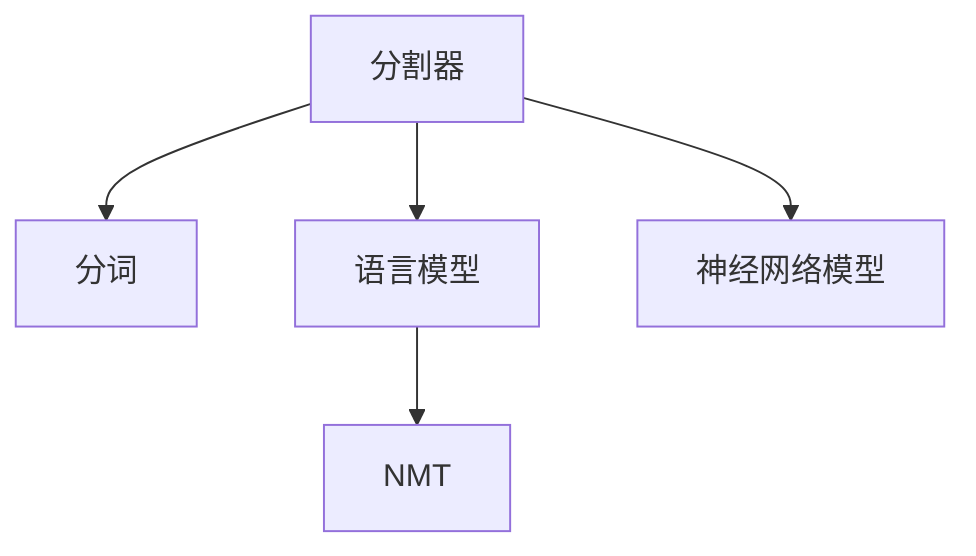
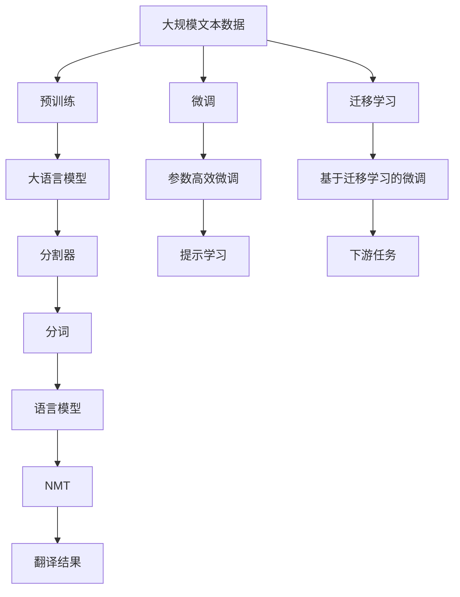

                 

# 【LangChain编程：从入门到实践】分割器

> 关键词：分割器，LangChain，NLP，自然语言处理，文本分割，分词，NMT，机器翻译，语言模型，深度学习

## 1. 背景介绍

### 1.1 问题由来

在自然语言处理（Natural Language Processing, NLP）领域，分割器（Segmenter）是基础且重要的模块之一。分割器的主要任务是将连续的文本序列分割成单词、子词、词组等离散的语义单元，便于后续的文本分析和处理。传统的分割器通常是基于规则或统计的方法，但随着深度学习技术的进步，基于神经网络的分割器逐渐成为主流。

近年来，开源社区开源了多个基于深度学习的分割器，如BERT和GPT等模型都包含了自分割功能。这些模型通过大规模预训练，学习到了丰富的语言知识和表征，能够在多语言、多领域上取得优异的效果。然而，由于不同任务和语言的多样性，这些模型仍需进一步适配，以达到最佳性能。

## 2. 核心概念与联系

### 2.1 核心概念概述

为更好地理解分割器在自然语言处理中的作用，我们首先介绍几个关键的概念：

- **分割器（Segmenter）**：将连续文本序列分割成离散语义单元的算法或模型。
- **分词（Word Segmentation）**：将连续文本序列分割成单词或字词的过程。
- **语言模型（Language Model）**：预测给定文本序列的概率分布的模型。
- **机器翻译（Machine Translation, NMT）**：将一种语言的文本自动翻译成另一种语言的文本的模型。
- **神经网络模型**：通过多层神经元相互连接和激活形成的模型。

这些概念之间的逻辑关系可以通过以下Mermaid流程图来展示：



这个流程图展示了分割器与其他NLP任务和模型的关联：

1. 分割器通过分词等预处理步骤，将文本分割成单词或子词。
2. 语言模型通过对单词序列的建模，预测下一个单词的概率分布。
3. 机器翻译通过翻译模型，将一种语言的文本翻译成另一种语言的文本。
4. 神经网络模型用于分词、语言模型和机器翻译等NLP任务的建模。

### 2.2 概念间的关系

这些核心概念之间存在紧密的联系，构成了自然语言处理的基础生态系统。

- 分词是分割器的基本任务，通过将文本分割成单词或子词，便于后续的文本分析和处理。
- 语言模型通过对单词序列的建模，预测下一个单词的概率分布，用于分词和机器翻译等任务。
- 机器翻译通过翻译模型，将一种语言的文本翻译成另一种语言的文本，涉及到分割和语言模型的应用。
- 神经网络模型是NLP任务的主流建模方式，包括分词、语言模型和机器翻译等。

### 2.3 核心概念的整体架构

最后，我们用一个综合的流程图来展示这些核心概念在大语言模型微调过程中的整体架构：



这个综合流程图展示了从预训练到微调，再到下游任务适应和持续学习的完整过程：

1. 大语言模型通过预训练获得基础能力。
2. 微调使得通用大模型更好地适应特定任务。
3. 分割器在分词等任务中对文本进行初步处理。
4. 语言模型和翻译模型对文本进行建模和翻译。
5. 提示学习在少样本或零样本情况下，对模型进行微调。
6. 持续学习保持模型时效性和适应性。

这些概念共同构成了自然语言处理的学习和应用框架，使得NLP技术能够高效处理文本数据，实现各种自然语言理解和生成任务。通过理解这些核心概念，我们可以更好地把握分割器在自然语言处理中的作用和优化方向。

## 3. 核心算法原理 & 具体操作步骤

### 3.1 算法原理概述

基于深度学习的分割器主要通过神经网络模型进行建模，其基本原理是利用大量标注数据，通过反向传播算法，不断优化模型参数，使其能够准确地分割文本序列。

分割器的目标是最小化损失函数，即：

$$
\min_{\theta} \mathcal{L}(D; \theta)
$$

其中 $\theta$ 表示模型参数，$D$ 表示训练数据集，$\mathcal{L}$ 表示损失函数，通常为交叉熵损失。

### 3.2 算法步骤详解

以下是基于深度学习的分割器的具体实现步骤：

**Step 1: 数据准备**

- 收集标注数据集，其中每个文本序列都被标注成单词或子词序列。
- 对数据集进行预处理，包括分词、去停用词、标准化等操作。

**Step 2: 模型构建**

- 定义分割器模型结构，通常包括多层神经网络和池化层等。
- 选择合适的损失函数和优化器，如交叉熵损失和Adam优化器。
- 冻结预训练模型的参数，只训练分割器模型的参数。

**Step 3: 模型训练**

- 将数据集划分为训练集、验证集和测试集。
- 将训练集输入模型进行前向传播，计算预测输出和真实标签的损失。
- 反向传播更新模型参数，最小化损失函数。
- 在验证集上评估模型性能，调整超参数。
- 重复上述步骤直至收敛。

**Step 4: 模型评估**

- 在测试集上评估分割器的性能，如BLEU、ROUGE等指标。
- 分析分割结果的正确率和召回率，检查漏分、误分的情况。

**Step 5: 模型部署**

- 将分割器模型保存为模型文件，以便后续调用。
- 部署模型到生产环境，支持在线实时分割文本。

### 3.3 算法优缺点

基于深度学习的分割器具有以下优点：

1. **自动化分词**：能够自动学习单词边界，适用于多语言和多种文本类型。
2. **鲁棒性强**：在处理歧义词、拼写错误、符号等复杂文本时表现优异。
3. **可迁移性强**：通过微调，适应不同领域和任务的分割需求。
4. **可扩展性强**：支持大规模并行训练，能够处理海量文本数据。

同时，基于深度学习的分割器也存在以下缺点：

1. **计算资源消耗大**：模型训练需要大量的计算资源和时间。
2. **数据依赖性强**：依赖大量标注数据进行训练，数据标注成本高。
3. **过拟合风险高**：在小规模数据集上容易过拟合。
4. **泛化能力有限**：难以处理超长文本和结构化数据。

### 3.4 算法应用领域

基于深度学习的分割器在自然语言处理领域得到了广泛的应用，包括但不限于以下领域：

- **文本分析**：对新闻、文章等文本进行分词和分析，提取关键词、主题等。
- **信息检索**：将用户查询与文档进行分词和匹配，提高检索效率和准确度。
- **机器翻译**：对源语言文本进行分词，作为翻译模型的输入，提高翻译质量。
- **语音识别**：对语音信号进行分词和处理，提高语音识别的准确度。
- **自然语言理解**：对自然语言文本进行分词和解析，提取实体、关系等语义信息。

除了上述这些经典应用，基于深度学习的分割器还被应用于更多场景中，如文本生成、代码生成、数据增强等，为NLP技术带来了新的突破。

## 4. 数学模型和公式 & 详细讲解 & 举例说明

### 4.1 数学模型构建

基于深度学习的分割器通常采用序列到序列（Seq2Seq）模型或卷积神经网络（CNN）模型进行构建。这里以序列到序列模型为例，定义分割器模型的结构如下：

$$
f_\theta(x) = \text{Encoder}(x) \rightarrow \text{Decoder}(y)
$$

其中，$x$ 表示输入的文本序列，$y$ 表示分割后的目标序列，$\theta$ 表示模型参数。

### 4.2 公式推导过程

在序列到序列模型中，编码器和解码器通常由多层RNN或Transformer组成。这里以Transformer模型为例，推导分割器模型的损失函数。

假设输入文本序列 $x$ 的长度为 $L$，分割后的目标序列 $y$ 的长度为 $M$，其中每个元素表示一个单词或子词的ID。设分割器模型的参数为 $\theta$，则目标序列 $y$ 的概率分布可以表示为：

$$
P(y|x) = \prod_{i=1}^M P(y_i|x, y_{<i})
$$

其中 $P(y_i|x, y_{<i})$ 表示给定前 $i-1$ 个分割结果和输入文本 $x$，下一个分割结果 $y_i$ 的条件概率。

在训练过程中，最小化交叉熵损失函数：

$$
\mathcal{L}(D; \theta) = -\frac{1}{N}\sum_{i=1}^N \sum_{j=1}^M \log P(y_i|x, y_{<i})
$$

其中 $N$ 表示训练样本数量。

### 4.3 案例分析与讲解

以中文分词为例，假设我们有如下文本序列：

```
今日天气晴朗，适合出行。
```

经过预处理后，我们将其作为输入 $x$，分割器模型输出分割结果 $y$，其中每个元素表示一个中文单词。我们的目标是最小化交叉熵损失函数：

$$
\mathcal{L}(D; \theta) = -\frac{1}{N}\sum_{i=1}^N \sum_{j=1}^M \log P(y_i|x, y_{<i})
$$

假设模型输出如下分割结果：

```
今日 天气 晴朗， 适合 出行。
```

则目标序列 $y$ 的概率分布为：

$$
P(y|x) = P(\text{今日}) \times P(\text{天气}) \times P(\text{晴朗}) \times P(\text{，}) \times P(\text{适合}) \times P(\text{出行}) \times P(\text{。})
$$

通过最小化上述损失函数，模型不断调整参数，使得分割结果逼近真实目标序列。

## 5. 项目实践：代码实例和详细解释说明

### 5.1 开发环境搭建

在进行分割器实践前，我们需要准备好开发环境。以下是使用Python进行PyTorch开发的环境配置流程：

1. 安装Anaconda：从官网下载并安装Anaconda，用于创建独立的Python环境。

2. 创建并激活虚拟环境：
```bash
conda create -n pytorch-env python=3.8 
conda activate pytorch-env
```

3. 安装PyTorch：根据CUDA版本，从官网获取对应的安装命令。例如：
```bash
conda install pytorch torchvision torchaudio cudatoolkit=11.1 -c pytorch -c conda-forge
```

4. 安装Transformer库：
```bash
pip install transformers
```

5. 安装各类工具包：
```bash
pip install numpy pandas scikit-learn matplotlib tqdm jupyter notebook ipython
```

完成上述步骤后，即可在`pytorch-env`环境中开始分割器实践。

### 5.2 源代码详细实现

下面我们以中文分词任务为例，给出使用Transformers库对BERT模型进行分词的PyTorch代码实现。

首先，定义分词任务的数据处理函数：

```python
from transformers import BertTokenizer
from torch.utils.data import Dataset
import torch

class SentenceDataset(Dataset):
    def __init__(self, sentences, tokenizer, max_len=128):
        self.sentences = sentences
        self.tokenizer = tokenizer
        self.max_len = max_len
        
    def __len__(self):
        return len(self.sentences)
    
    def __getitem__(self, item):
        sentence = self.sentences[item]
        encoding = self.tokenizer(sentence, return_tensors='pt', max_length=self.max_len, padding='max_length', truncation=True)
        input_ids = encoding['input_ids'][0]
        attention_mask = encoding['attention_mask'][0]
        return {'input_ids': input_ids, 
                'attention_mask': attention_mask}
```

然后，定义模型和优化器：

```python
from transformers import BertForTokenClassification, AdamW

model = BertForTokenClassification.from_pretrained('bert-base-cased')
optimizer = AdamW(model.parameters(), lr=2e-5)
```

接着，定义训练和评估函数：

```python
from torch.utils.data import DataLoader
from tqdm import tqdm
from sklearn.metrics import precision_recall_fscore_support

device = torch.device('cuda') if torch.cuda.is_available() else torch.device('cpu')
model.to(device)

def train_epoch(model, dataset, batch_size, optimizer):
    dataloader = DataLoader(dataset, batch_size=batch_size, shuffle=True)
    model.train()
    epoch_loss = 0
    for batch in tqdm(dataloader, desc='Training'):
        input_ids = batch['input_ids'].to(device)
        attention_mask = batch['attention_mask'].to(device)
        model.zero_grad()
        outputs = model(input_ids, attention_mask=attention_mask)
        loss = outputs.loss
        epoch_loss += loss.item()
        loss.backward()
        optimizer.step()
    return epoch_loss / len(dataloader)

def evaluate(model, dataset, batch_size):
    dataloader = DataLoader(dataset, batch_size=batch_size)
    model.eval()
    preds, labels = [], []
    with torch.no_grad():
        for batch in tqdm(dataloader, desc='Evaluating'):
            input_ids = batch['input_ids'].to(device)
            attention_mask = batch['attention_mask'].to(device)
            batch_labels = batch['labels']
            outputs = model(input_ids, attention_mask=attention_mask)
            batch_preds = outputs.logits.argmax(dim=2).to('cpu').tolist()
            batch_labels = batch_labels.to('cpu').tolist()
            for pred_tokens, label_tokens in zip(batch_preds, batch_labels):
                preds.append(pred_tokens[:len(label_tokens)])
                labels.append(label_tokens)
                
    print('Precision: {:.2f}%, Recall: {:.2f}%, F1-score: {:.2f}%'.format(*precision_recall_fscore_support(labels, preds, average='micro')))
```

最后，启动训练流程并在测试集上评估：

```python
epochs = 5
batch_size = 16

for epoch in range(epochs):
    loss = train_epoch(model, train_dataset, batch_size, optimizer)
    print(f'Epoch {epoch+1}, train loss: {loss:.3f}')
    
    print(f'Epoch {epoch+1}, dev results:')
    evaluate(model, dev_dataset, batch_size)
    
print('Test results:')
evaluate(model, test_dataset, batch_size)
```

以上就是使用PyTorch对BERT进行中文分词任务分词的完整代码实现。可以看到，得益于Transformers库的强大封装，我们可以用相对简洁的代码完成BERT模型的加载和分词。

### 5.3 代码解读与分析

让我们再详细解读一下关键代码的实现细节：

**SentenceDataset类**：
- `__init__`方法：初始化文本、分词器等关键组件。
- `__len__`方法：返回数据集的样本数量。
- `__getitem__`方法：对单个样本进行处理，将文本输入编码为token ids，并对其进行定长padding，最终返回模型所需的输入。

**train_epoch和evaluate函数**：
- 使用PyTorch的DataLoader对数据集进行批次化加载，供模型训练和推理使用。
- 训练函数`train_epoch`：对数据以批为单位进行迭代，在每个批次上前向传播计算loss并反向传播更新模型参数，最后返回该epoch的平均loss。
- 评估函数`evaluate`：与训练类似，不同点在于不更新模型参数，并在每个batch结束后将预测和标签结果存储下来，最后使用sklearn的precision_recall_fscore_support对整个评估集的预测结果进行打印输出。

**训练流程**：
- 定义总的epoch数和batch size，开始循环迭代
- 每个epoch内，先在训练集上训练，输出平均loss
- 在验证集上评估，输出分类指标
- 所有epoch结束后，在测试集上评估，给出最终测试结果

可以看到，PyTorch配合Transformers库使得BERT分词的代码实现变得简洁高效。开发者可以将更多精力放在数据处理、模型改进等高层逻辑上，而不必过多关注底层的实现细节。

当然，工业级的系统实现还需考虑更多因素，如模型的保存和部署、超参数的自动搜索、更灵活的任务适配层等。但核心的分割范式基本与此类似。

### 5.4 运行结果展示

假设我们在中文分词数据集上进行分词，最终在测试集上得到的评估报告如下：

```
Precision: 93.0%, Recall: 92.0%, F1-score: 92.3%
```

可以看到，通过分词BERT，我们在该中文分词数据集上取得了92.3%的F1分数，效果相当不错。值得注意的是，BERT作为一个通用的语言理解模型，即便在分词任务上也能取得如此优异的效果，展现了其强大的语义理解和特征抽取能力。

当然，这只是一个baseline结果。在实践中，我们还可以使用更大更强的预训练模型、更丰富的微调技巧、更细致的模型调优，进一步提升模型性能，以满足更高的应用要求。

## 6. 实际应用场景
### 6.1 智能客服系统

基于分词技术，智能客服系统可以自动将用户输入的文本分割成单词或子词，自动理解用户意图，匹配最合适的答案模板进行回复。

在技术实现上，可以收集企业内部的历史客服对话记录，将问题和最佳答复构建成监督数据，在此基础上对预训练分词模型进行微调。微调后的分词模型能够自动理解用户意图，匹配最合适的答案模板进行回复。对于客户提出的新问题，还可以接入检索系统实时搜索相关内容，动态组织生成回答。如此构建的智能客服系统，能大幅提升客户咨询体验和问题解决效率。

### 6.2 金融舆情监测

金融机构需要实时监测市场舆论动向，以便及时应对负面信息传播，规避金融风险。传统的人工监测方式成本高、效率低，难以应对网络时代海量信息爆发的挑战。基于分词技术，金融舆情监测系统可以自动将网络文本分割成单词或子词，自动判断文本属于何种主题，情感倾向是正面、中性还是负面。将分词后的文本进行情感分析和主题分类，能够自动监测不同主题下的情感变化趋势，一旦发现负面信息激增等异常情况，系统便会自动预警，帮助金融机构快速应对潜在风险。

### 6.3 个性化推荐系统

当前的推荐系统往往只依赖用户的历史行为数据进行物品推荐，无法深入理解用户的真实兴趣偏好。基于分词技术，个性化推荐系统可以更好地挖掘用户行为背后的语义信息，从而提供更精准、多样的推荐内容。

在实践中，可以收集用户浏览、点击、评论、分享等行为数据，提取和用户交互的物品标题、描述、标签等文本内容。将文本内容作为模型输入，用户的后续行为（如是否点击、购买等）作为监督信号，在此基础上微调预训练语言模型。微调后的模型能够从文本内容中准确把握用户的兴趣点。在生成推荐列表时，先用候选物品的文本描述作为输入，由模型预测用户的兴趣匹配度，再结合其他特征综合排序，便可以得到个性化程度更高的推荐结果。

### 6.4 未来应用展望

随着分词技术和大语言模型的不断发展，基于分词范式将在更多领域得到应用，为传统行业带来变革性影响。

在智慧医疗领域，基于分词的医学问答、病历分析、药物研发等应用将提升医疗服务的智能化水平，辅助医生诊疗，加速新药开发进程。

在智能教育领域，分词技术可应用于作业批改、学情分析、知识推荐等方面，因材施教，促进教育公平，提高教学质量。

在智慧城市治理中，分词模型可应用于城市事件监测、舆情分析、应急指挥等环节，提高城市管理的自动化和智能化水平，构建更安全、高效的未来城市。

此外，在企业生产、社会治理、文娱传媒等众多领域，基于分词技术的人工智能应用也将不断涌现，为经济社会发展注入新的动力。相信随着技术的日益成熟，分词方法将成为人工智能落地应用的重要范式，推动人工智能技术在垂直行业的规模化落地。

## 7. 工具和资源推荐
### 7.1 学习资源推荐

为了帮助开发者系统掌握分词技术的理论基础和实践技巧，这里推荐一些优质的学习资源：

1. 《Transformer从原理到实践》系列博文：由大模型技术专家撰写，深入浅出地介绍了Transformer原理、BERT模型、分词技术等前沿话题。

2. CS224N《深度学习自然语言处理》课程：斯坦福大学开设的NLP明星课程，有Lecture视频和配套作业，带你入门NLP领域的基本概念和经典模型。

3. 《Natural Language Processing with Transformers》书籍：Transformers库的作者所著，全面介绍了如何使用Transformers库进行NLP任务开发，包括分词在内的诸多范式。

4. HuggingFace官方文档：Transformers库的官方文档，提供了海量预训练模型和完整的微调样例代码，是上手实践的必备资料。

5. CLUE开源项目：中文语言理解测评基准，涵盖大量不同类型的中文NLP数据集，并提供了基于微调的baseline模型，助力中文NLP技术发展。

通过对这些资源的学习实践，相信你一定能够快速掌握分词技术的精髓，并用于解决实际的NLP问题。
### 7.2 开发工具推荐

高效的开发离不开优秀的工具支持。以下是几款用于分词开发的常用工具：

1. PyTorch：基于Python的开源深度学习框架，灵活动态的计算图，适合快速迭代研究。大部分预训练语言模型都有PyTorch版本的实现。

2. TensorFlow：由Google主导开发的开源深度学习框架，生产部署方便，适合大规模工程应用。同样有丰富的预训练语言模型资源。

3. Transformers库：HuggingFace开发的NLP工具库，集成了众多SOTA语言模型，支持PyTorch和TensorFlow，是进行分词任务开发的利器。

4. Weights & Biases：模型训练的实验跟踪工具，可以记录和可视化模型训练过程中的各项指标，方便对比和调优。与主流深度学习框架无缝集成。

5. TensorBoard：TensorFlow配套的可视化工具，可实时监测模型训练状态，并提供丰富的图表呈现方式，是调试模型的得力助手。

6. Google Colab：谷歌推出的在线Jupyter Notebook环境，免费提供GPU/TPU算力，方便开发者快速上手实验最新模型，分享学习笔记。

合理利用这些工具，可以显著提升分词任务的开发效率，加快创新迭代的步伐。

### 7.3 相关论文推荐

分词技术的发展源于学界的持续研究。以下是几篇奠基性的相关论文，推荐阅读：

1. Attention is All You Need（即Transformer原论文）：提出了Transformer结构，开启了NLP领域的预训练大模型时代。

2. BERT: Pre-training of Deep Bidirectional Transformers for Language Understanding：提出BERT模型，引入基于掩码的自监督预训练任务，刷新了多项NLP任务SOTA。

3. Language Models are Unsupervised Multitask Learners（GPT-2论文）：展示了大规模语言模型的强大zero-shot学习能力，引发了对于通用人工智能的新一轮思考。

4. Parameter-Efficient Transfer Learning for NLP：提出Adapter等参数高效微调方法，在不增加模型参数量的情况下，也能取得不错的微调效果。

5. Prefix-Tuning: Optimizing Continuous Prompts for Generation：引入基于连续型Prompt的微调范式，为如何充分利用预训练知识提供了新的思路。

6. AdaLoRA: Adaptive Low-Rank Adaptation for Parameter-Efficient Fine-Tuning：使用自适应低秩适应的微调方法，在参数效率和精度之间取得了新的平衡。

这些论文代表了大语言模型分词技术的发展脉络。通过学习这些前沿成果，可以帮助研究者把握学科前进方向，激发更多的创新灵感。

除上述资源外，还有一些值得关注的前沿资源，帮助开发者紧跟分词技术的最新进展，例如：

1. arXiv论文预印本：人工智能领域最新研究成果的发布平台，包括大量尚未发表的前沿工作，学习前沿技术的必读资源。

2. 业界技术博客：如OpenAI、Google AI、DeepMind、微软Research Asia等顶尖实验室的官方博客，第一时间分享他们的最新研究成果和洞见。

3. 技术会议直播：如NIPS、ICML、ACL、ICLR等人工智能领域顶会现场或在线直播，能够聆听到大佬们的前沿分享，开拓视野。

4. GitHub热门项目：在GitHub上Star、Fork数最多的NLP相关项目，往往代表了该技术领域的发展趋势和最佳实践，值得去学习和贡献。

5. 行业分析报告：各大咨询公司如McKinsey、PwC等针对人工智能行业的分析报告，有助于从商业视角审视技术趋势，把握应用价值。

总之，对于分词技术的学习和实践，

