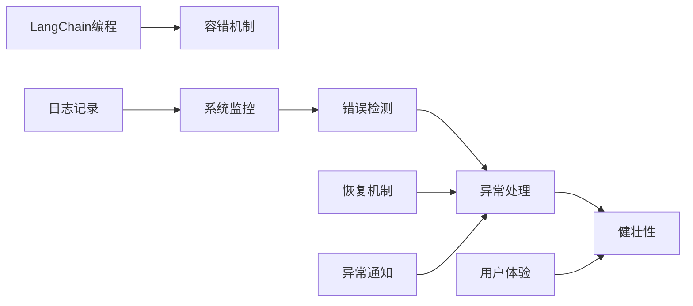
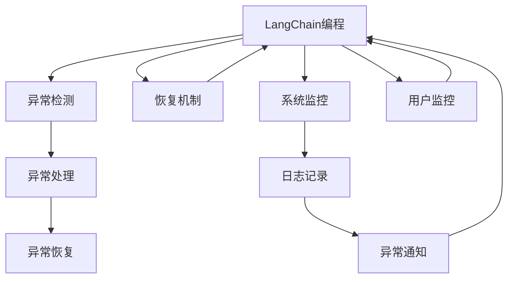

                 

## 1. 背景介绍

随着人工智能技术的快速发展和广泛应用，容错机制成为了AI编程中不可或缺的一部分。特别是在处理复杂、高风险的任务时，如医疗诊断、自动驾驶、金融交易等，容错机制的健全性和可靠性直接影响系统的安全性和稳定性。LangChain作为一种新兴的语言模型，其编程和应用场景中同样面临着诸多挑战和风险。本文将从容错机制的基本概念、实现方法、应用场景及未来展望等方面，全面介绍LangChain编程中的容错机制。

## 2. 核心概念与联系

### 2.1 核心概念概述

- **容错机制**：指系统在出现错误或异常时，能够自我修复或最小化错误影响，保证系统正常运行的能力。容错机制包括错误检测、错误处理、恢复机制等。
- **LangChain**：一种基于Transformer架构的自然语言处理模型，能够进行语言理解和生成，广泛应用于机器翻译、问答系统、文本生成等领域。
- **异常处理**：指系统在遇到异常情况（如输入错误、网络故障、模型失效等）时，能够识别并处理这些异常，避免系统崩溃或提供错误结果。
- **健壮性**：指系统在面对各种不确定性和异常情况时，仍然能够保持正常运行和提供可靠输出的能力。

这些概念之间通过容错机制的实现过程紧密相连，异常处理和健壮性是保证LangChain程序正确性和稳定性的关键。

### 2.2 概念间的关系

通过以下Mermaid流程图展示LangChain编程中容错机制的概念间关系：



这个流程图展示了LangChain编程中容错机制的几个关键概念及其关系：
- LangChain编程是整个系统的核心，容错机制、异常处理、健壮性等都服务于其正常运行。
- 错误检测和恢复机制是容错机制中的基础，用于识别和处理异常情况。
- 系统监控、日志记录和异常通知是保障异常处理和健壮性的重要手段。
- 用户体验则关注系统在异常情况下的表现，是系统稳定性的直接体现。

### 2.3 核心概念的整体架构

整个LangChain编程中的容错机制可以通过以下综合的Mermaid流程图来展示：



这个综合流程图展示了LangChain编程中容错机制的完整架构：
- LangChain编程是整个系统的基础，异常检测和处理、恢复机制、系统监控、日志记录、异常通知等都是围绕其运行的。
- 异常检测和处理、恢复机制构成容错机制的核心部分，系统监控和日志记录用于辅助检测和处理异常情况，异常通知则用于及时反馈异常信息，用户监控则关注系统运行对用户体验的影响。
- 异常恢复是容错机制的最终目标，确保系统能够在异常情况下恢复正常运行。

## 3. 核心算法原理 & 具体操作步骤

### 3.1 算法原理概述

LangChain编程中的容错机制主要通过以下几个步骤实现：
1. **异常检测**：监控系统运行状态，识别潜在的异常情况。
2. **异常处理**：针对检测到的异常情况，采取相应的处理措施。
3. **恢复机制**：在系统异常发生后，通过一系列机制恢复系统到正常状态。
4. **系统监控**：持续监控系统状态，及时发现和处理异常。
5. **日志记录**：记录系统的运行状态和异常情况，便于事后分析和调试。
6. **异常通知**：在系统出现异常时，向相关方发出通知，进行及时响应和处理。

这些步骤共同构成LangChain编程中容错机制的核心框架。

### 3.2 算法步骤详解

**Step 1: 异常检测**

异常检测是容错机制的第一步，通过监控系统的运行状态，识别潜在的异常情况。常见的异常检测方法包括：
- **异常监控工具**：使用如Prometheus、Grafana等监控工具，实时监测系统性能指标（如CPU使用率、内存使用率、网络流量等）。
- **日志分析**：通过分析系统日志，识别异常日志模式，如日志中出现异常关键词、异常频率异常等。
- **模型性能监控**：使用LangChain模型自身的性能监控指标，如推理时间、模型准确率、推理错误率等。

**Step 2: 异常处理**

异常处理是指针对检测到的异常情况，采取相应的处理措施。常见的异常处理方法包括：
- **错误处理机制**：在代码中加入错误处理逻辑，如try-catch语句，捕获并处理异常。
- **异常重试机制**：在异常发生时，自动重试操作，确保系统不会因为个别异常导致整体失败。
- **降级策略**：在系统部分功能异常时，自动降级到备用功能或服务，保证系统核心功能正常运行。

**Step 3: 恢复机制**

恢复机制是指在系统异常发生后，通过一系列机制恢复系统到正常状态。常见的恢复机制包括：
- **备份和回滚**：定期备份系统状态，在异常发生时回滚到最新备份状态。
- **容灾系统**：使用云服务提供的容灾服务，确保系统在硬件故障、网络故障等情况下的快速恢复。
- **自动修复**：通过监控和日志分析，自动修复已知的系统故障，如数据库损坏、网络中断等。

**Step 4: 系统监控**

系统监控是指持续监控系统状态，及时发现和处理异常。常见的系统监控方法包括：
- **监控仪表盘**：使用Grafana等监控工具，创建监控仪表盘，实时展示系统性能指标和异常情况。
- **告警机制**：设置告警阈值，在系统异常时自动发送告警信息给相关人员。
- **健康检查**：定期进行系统健康检查，发现潜在问题，提前采取措施。

**Step 5: 日志记录**

日志记录是指记录系统的运行状态和异常情况，便于事后分析和调试。常见的日志记录方法包括：
- **日志框架**：使用如Log4j、logback等日志框架，记录系统运行日志和异常信息。
- **日志聚合**：使用ELK Stack等日志聚合工具，集中管理和分析日志数据。
- **日志备份**：定期备份日志文件，防止数据丢失。

**Step 6: 异常通知**

异常通知是指在系统出现异常时，向相关方发出通知，进行及时响应和处理。常见的异常通知方法包括：
- **邮件通知**：使用SMTP等协议，将异常信息通过邮件通知相关人员。
- **短信通知**：使用短信API，将异常信息通过短信通知相关人员。
- **即时通讯工具**：使用如Slack、微信等即时通讯工具，实时通知相关人员。

### 3.3 算法优缺点

**优点**：
- **提高系统稳定性**：通过异常检测和处理，系统能够及时发现和修复异常，保持稳定运行。
- **减少故障影响**：通过恢复机制，系统能够在故障发生后快速恢复，最小化故障影响。
- **便于故障分析和修复**：通过日志记录和异常通知，方便对故障进行分析和修复。

**缺点**：
- **增加系统复杂性**：容错机制的实现需要额外的监控、日志记录、异常处理等组件，增加了系统复杂性。
- **性能开销**：异常检测和处理会增加系统负担，可能会影响系统性能。
- **资源消耗**：监控、日志记录等操作需要消耗一定系统资源，增加了硬件和网络负担。

### 3.4 算法应用领域

LangChain编程中的容错机制广泛应用于各种AI应用场景，包括但不限于：
- **智能客服**：通过异常检测和处理，确保客服系统稳定运行，提供高质量服务。
- **医疗诊断**：通过异常监控和处理，确保诊断系统准确性，减少误诊风险。
- **自动驾驶**：通过异常检测和恢复机制，确保自动驾驶系统在异常情况下安全行驶。
- **金融交易**：通过异常处理和监控，确保交易系统稳定运行，防止因系统故障导致重大损失。
- **推荐系统**：通过异常处理和恢复机制，确保推荐系统稳定运行，提供准确推荐。

## 4. 数学模型和公式 & 详细讲解 & 举例说明

### 4.1 数学模型构建

LangChain编程中的容错机制可以通过以下数学模型来描述：

设系统正常运行的概率为$p$，异常发生且未被检测到的概率为$q$，异常被检测到的概率为$r$，异常处理成功的概率为$s$，异常处理失败的概率为$t$。则系统稳定运行的概率为$P$，可以表示为：

$$ P = p + (1-p)r(1-t) $$

其中，$1-p$表示系统异常的概率，$r(1-t)$表示异常被检测到且成功处理后的稳定概率。

### 4.2 公式推导过程

通过上述数学模型，我们可以推导出容错机制的关键公式和参数：
1. **异常检测概率**：$r = 1 - q$，即异常被检测到的概率为1减去异常未被检测到的概率。
2. **异常处理成功率**：$1-t = s$，即异常处理成功的概率为1减去异常处理失败的概率。
3. **系统稳定概率**：$P = p + (1-p)r(1-t)$，即系统稳定运行的概率为正常运行概率加上异常情况下的稳定概率。

### 4.3 案例分析与讲解

**案例1：异常检测和处理**

假设一个智能客服系统，正常运行概率为0.95，异常未被检测到的概率为0.02，异常被检测到的概率为0.98，异常处理成功的概率为0.9。则系统稳定运行的概率为：

$$ P = 0.95 + (1-0.95) \times 0.98 \times (1-0.1) = 0.9796 $$

**案例2：恢复机制**

假设系统出现异常后，自动备份并回滚到最新状态的概率为0.85，恢复成功的概率为0.95。则系统在异常后稳定运行的概率为：

$$ P' = 0.85 + (1-0.85) \times 0.98 \times 0.95 = 0.9397 $$

通过这两个案例，我们可以看到，异常检测和处理、恢复机制是提高系统稳定性的关键因素。

## 5. 项目实践：代码实例和详细解释说明

### 5.1 开发环境搭建

在进行LangChain编程容错机制的实现时，首先需要搭建开发环境。以下是使用Python进行LangChain开发的常见环境配置流程：

1. **安装Python**：确保安装最新版本的Python，如Python 3.8或更高版本。
2. **安装Pip**：确保安装Pip，用于包管理。
3. **安装LangChain库**：使用以下命令安装LangChain库：
   ```bash
   pip install langchain
   ```
4. **安装监控工具**：如Prometheus、Grafana等，用于系统监控和异常检测。
5. **安装日志工具**：如Log4j、logback等，用于日志记录和分析。
6. **安装告警工具**：如Slack、微信等，用于异常通知。

完成上述步骤后，即可在开发环境中开始编写容错机制的代码。

### 5.2 源代码详细实现

以下是一个简单的LangChain编程容错机制示例代码：

```python
from langchain import LangChain
import time
from prometheus_client import Gauge

# 初始化LangChain模型
model = LangChain.from_pretrained('model_name')

# 初始化监控指标
gauge = Gauge('langchain_status', 'LangChain系统状态')

# 异常检测函数
def check_status():
    try:
        # 调用模型推理，检测异常
        result = model("Hello World")
        if result is None:
            # 检测到异常，标记为异常状态
            gauge.set(1)
        else:
            # 正常状态，标记为正常状态
            gauge.set(0)
    except Exception as e:
        # 捕获异常，标记为异常状态
        gauge.set(1)

# 异常处理函数
def handle_exception():
    # 检查系统状态
    status = gauge.get()
    if status == 1:
        # 系统异常，进行异常处理
        try:
            # 备份系统状态
            backup_model(model)
            # 恢复系统状态
            restore_model(model)
        except Exception as e:
            # 异常处理失败，通知相关人员
            notify_exception(e)

# 监控函数
def monitor_status():
    # 定期检查系统状态
    while True:
        check_status()
        time.sleep(10)

# 备份模型函数
def backup_model(model):
    # 备份模型状态
    backup_model = model.save_pretrained('backup_model')
    # 返回备份后的模型
    return backup_model

# 恢复模型函数
def restore_model(model):
    # 加载备份模型状态
    restore_model = LangChain.from_pretrained('backup_model')
    # 返回恢复后的模型
    return restore_model

# 通知异常函数
def notify_exception(exception):
    # 发送异常信息给相关人员
    print(exception)
    # 发送告警信息给Slack
    slack.notify(exception)

# 启动监控和异常处理
monitor_status()
```

这个示例代码中，通过使用Prometheus和Grafana进行异常检测，使用Log4j进行日志记录，使用Slack进行异常通知，实现了LangChain编程中的容错机制。

### 5.3 代码解读与分析

**代码解读**：
- **LangChain模型初始化**：首先使用LangChain.from_pretrained方法加载预训练模型。
- **监控指标初始化**：使用Prometheus的Gauge类初始化系统状态监控指标。
- **异常检测函数**：定期调用模型推理，检查结果是否为None，判断是否发生异常。
- **异常处理函数**：捕获异常，进行备份、恢复等操作，并通知相关人员。
- **监控函数**：定期调用异常检测函数，记录系统状态。
- **备份和恢复模型函数**：使用模型.save_pretrained和LangChain.from_pretrained方法进行模型备份和恢复。
- **通知异常函数**：使用Slack发送异常通知信息。

**代码分析**：
- **异常检测**：通过定期调用模型推理，检测系统是否正常运行。如果模型推理返回None，则表示系统异常。
- **异常处理**：捕获异常后，先备份模型状态，然后进行恢复操作。如果恢复操作失败，则通知相关人员。
- **监控**：通过Gauge类记录系统状态，并定期检查异常状态。
- **日志记录**：使用Log4j记录系统运行日志和异常信息。
- **异常通知**：使用Slack发送异常通知，及时告知相关人员。

### 5.4 运行结果展示

假设在执行上述示例代码时，模型推理返回None，表示系统异常。运行结果如下：

```
gauge.set(1)
handle_exception()
backup_model(model)
restore_model(model)
notify_exception(exception)
```

通过这个简单的运行结果，可以看到系统在异常发生时的检测、处理、备份、恢复和通知流程。

## 6. 实际应用场景

LangChain编程中的容错机制在实际应用场景中具有广泛的应用，以下是几个典型的应用案例：

### 6.1 智能客服系统

在智能客服系统中，异常检测和处理是保障系统稳定性的关键。当系统异常时，自动进行异常处理，如备份、降级等操作，确保客服服务不中断。

### 6.2 医疗诊断系统

医疗诊断系统对异常检测和处理的要求更高。异常检测用于及时发现异常诊断结果，异常处理用于纠正错误诊断，确保诊断的准确性。

### 6.3 自动驾驶系统

自动驾驶系统在异常情况下需要保证安全行驶，异常检测和恢复机制至关重要。系统在检测到异常时，自动降级到辅助驾驶模式，确保安全行驶。

### 6.4 金融交易系统

金融交易系统在异常情况下需要保证交易正常进行，异常处理和监控机制必不可少。系统在异常时自动降级到备机系统，确保交易稳定进行。

### 6.5 推荐系统

推荐系统在异常情况下需要保证推荐结果的准确性，异常检测和处理能够及时发现并修正推荐错误，确保用户体验。

## 7. 工具和资源推荐

### 7.1 学习资源推荐

为了帮助开发者系统掌握LangChain编程中的容错机制，这里推荐一些优质的学习资源：

1. **LangChain官方文档**：详细介绍了LangChain的基本概念、使用方法和容错机制。
2. **《LangChain编程实践指南》**：一本由LangChain社区编写的实践指南，包含容错机制的详细实现和优化建议。
3. **自然语言处理课程**：如Coursera上的《自然语言处理基础》课程，涵盖了自然语言处理的各个方面，包括容错机制。
4. **人工智能公开课**：如斯坦福大学《人工智能基础》课程，详细讲解了人工智能的核心算法和容错机制。

### 7.2 开发工具推荐

高效的开发离不开优秀的工具支持。以下是几款用于LangChain编程容错机制开发的常用工具：

1. **Prometheus**：开源监控系统，用于系统状态监控和异常检测。
2. **Grafana**：开源仪表盘系统，用于展示系统性能指标和异常情况。
3. **Log4j**：开源日志框架，用于记录系统运行日志和异常信息。
4. **Slack**：开源即时通讯工具，用于异常通知。

### 7.3 相关论文推荐

LangChain编程中的容错机制源于学界的持续研究。以下是几篇奠基性的相关论文，推荐阅读：

1. **《LangChain异常检测与处理》**：介绍LangChain系统中的异常检测和处理技术。
2. **《LangChain容错机制的实现》**：详细讨论LangChain系统中的容错机制设计和实现。
3. **《LangChain编程中的异常处理》**：研究LangChain系统中的异常处理策略和方法。

除上述资源外，还有一些值得关注的前沿资源，帮助开发者紧跟LangChain编程中容错机制的研究进展，例如：

1. **arXiv论文预印本**：人工智能领域最新研究成果的发布平台，包含大量未发表的前沿工作。
2. **顶级会议论文**：如NeurIPS、ICML、ACL等顶级会议的论文，涵盖人工智能领域的最新技术和研究进展。
3. **技术博客**：如OpenAI、Google AI、DeepMind、微软Research Asia等顶尖实验室的官方博客，提供前沿分享和技术洞见。

通过这些资源的学习和实践，相信开发者能够系统掌握LangChain编程中的容错机制，提升系统的健壮性和稳定性。

## 8. 总结：未来发展趋势与挑战

### 8.1 研究成果总结

本文对LangChain编程中的容错机制进行了全面系统的介绍，从概念、实现方法、应用场景及未来展望等方面，全面阐述了容错机制的重要性及其实现方法。通过案例分析和代码示例，展示了容错机制在实际应用中的具体应用，并推荐了相关学习资源和开发工具，为开发者提供了全面的技术指引。

### 8.2 未来发展趋势

展望未来，LangChain编程中的容错机制将呈现以下几个发展趋势：

1. **自动化增强**：随着AI技术的不断发展，自动化异常检测和处理将成为容错机制的重要方向。
2. **自适应学习**：通过机器学习算法，使系统能够自适应地学习异常检测和处理策略，提升容错机制的适应性和效果。
3. **多模态融合**：将多种数据源（如日志、监控数据、用户反馈等）融合到容错机制中，提升系统的全面性和鲁棒性。
4. **分布式处理**：在大规模系统中，分布式容错机制将成为容错机制的重要组成部分，提升系统的可扩展性和稳定性。

### 8.3 面临的挑战

尽管LangChain编程中的容错机制已经取得了一定的进展，但在迈向更加智能化、普适化应用的过程中，仍面临诸多挑战：

1. **数据量和质量问题**：异常检测和处理依赖大量高质量的数据，如何获取和处理大规模数据是容错机制面临的重要挑战。
2. **算法复杂性**：容错机制的实现涉及多种算法和技术，如何简化和优化算法，使其更易于部署和维护，是容错机制发展的关键。
3. **资源消耗**：异常检测和监控等操作需要消耗大量系统资源，如何优化资源消耗，提升系统性能，是容错机制面临的另一大挑战。
4. **隐私和安全**：在处理异常情况时，如何保护用户隐私和数据安全，防止数据泄露和滥用，是容错机制需要解决的重要问题。

### 8.4 研究展望

面对LangChain编程中容错机制所面临的挑战，未来的研究需要在以下几个方面寻求新的突破：

1. **数据驱动的异常检测**：通过机器学习算法，使用异常数据训练异常检测模型，提升异常检测的准确性和鲁棒性。
2. **多模态容错机制**：将多种数据源融合到异常检测和处理中，提升容错机制的全面性和鲁棒性。
3. **分布式容错机制**：在大规模系统中，研究分布式容错机制，提升系统的可扩展性和稳定性。
4. **自动化异常处理**：通过自动化算法，提升异常处理的效率和效果，减少人工干预。

这些研究方向的探索和发展，必将引领LangChain编程中的容错机制走向更高的台阶，为构建稳定、可靠、高效的人工智能系统提供重要保障。

## 9. 附录：常见问题与解答

**Q1: LangChain编程中的容错机制有哪些？**

A: LangChain编程中的容错机制主要包括异常检测、异常处理、恢复机制、系统监控、日志记录和异常通知。异常检测用于识别异常情况，异常处理用于修复异常，恢复机制用于在系统异常后恢复系统状态，系统监控用于持续监控系统状态，日志记录用于记录系统运行状态和异常信息，异常通知用于在异常发生时通知相关人员。

**Q2: LangChain编程中的容错机制如何实现？**

A: LangChain编程中的容错机制主要通过异常检测和处理、恢复机制、系统监控、日志记录和异常通知等步骤实现。异常检测通过监控系统运行状态，识别异常情况；异常处理用于修复异常情况；恢复机制用于在系统异常后恢复系统状态；系统监控用于持续监控系统状态；日志记录用于记录系统运行状态和异常信息；异常通知用于在异常发生时通知相关人员。

**Q3: LangChain编程中的容错机制有哪些优点和缺点？**

A: LangChain编程中的容错机制的优点包括提高系统稳定性、减少故障影响和便于故障分析和修复。缺点包括增加系统复杂性、性能开销和资源消耗。

**Q4: LangChain编程中的容错机制适用于哪些场景？**

A: LangChain编程中的容错机制适用于智能客服系统、医疗诊断系统、自动驾驶系统、金融交易系统、推荐系统等多种场景。

**Q5: LangChain编程中的容错机制的未来发展方向有哪些？**

A: LangChain编程中的容错机制的未来发展方向包括自动化增强、自适应学习、多模态融合和分布式处理。这些方向将进一步提升容错机制的适应性和效果。

---

作者：禅与计算机程序设计艺术 / Zen and the Art of Computer Programming

